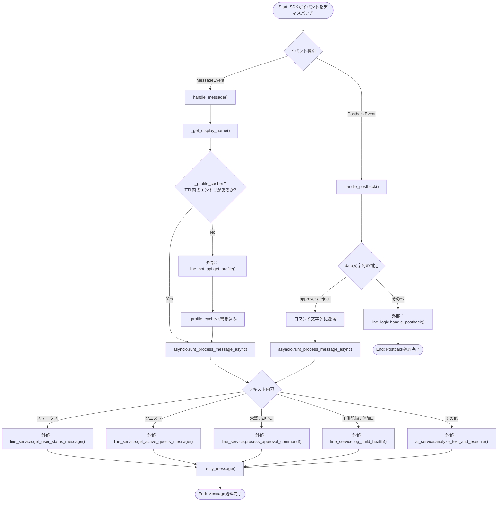
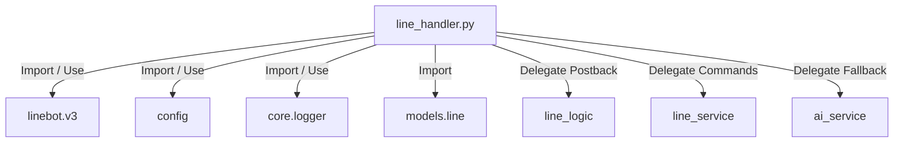

## 1. 解析メタ情報

| 項目 | 内容 |
| --- | --- |
| 対象ファイル | line_handler.py |
| 言語 | Python |
| 解析対象 | 提供されたコードのみ |
| 推測・補完 | 一切なし |

## 関連ドキュメント

* [webhook_router.md](./webhook_router.md) - 呼び出し元(`callback_line()`が本ファイルの`line_handler.handle`を`asyncio.to_thread`経由で実行)
* [line.md](./line.md) - 型定義を提供(`LinePostbackData`は本ファイルでは未使用インポート)
* [line_logic.md](./line_logic.md) - Postbackイベントの委譲先
* [line_service.md](./line_service.md) - コマンド処理(ステータス確認・クエスト・承認却下・体調記録)の委譲先
* [ai_service.md](./ai_service.md) - フォールバック時(未定義コマンド)のAI解析委譲先
* [config.md](./config.md) - 認証情報・`FAMILY_SETTINGS`等の設定値を提供

## 2. ファイルの概要

* LINE Bot API（v3）からのWebhookイベント（テキストメッセージ受信、ポストバック受信）を、SDKのイベントハンドラーとして解析し、適切な処理（ステータス確認、クエスト処理、子供の体調記録、AI解析、その他のロジック）へ振り分けるディスパッチャとしての責務を担う。実際のWebhook HTTPエンドポイント自体は本ファイルには存在せず、`routers/webhook_router.py` の `callback_line()` が署名検証込みで `line_handler.handle(body, signature)`（SDKの`WebhookHandler.handle`）を呼び出し、登録済みのイベントハンドラー（本ファイルの`handle_message`/`handle_postback`）をディスパッチする構成になっている。
* 根拠: `line_handler.add(MessageEvent, message=TextMessageContent)(handle_message)`, `line_handler.add(PostbackEvent)(handle_postback)` (行番号: 176-177 / 抜粋: "line_handler.add(MessageEvent, message=TextMessageContent)(handle_message)")

## 3. 外部依存関係

### インポート一覧

| 名称 | 種類 | 用途 | 根拠 |
| --- | --- | --- | --- |
| `asyncio` | 標準ライブラリ | 非同期関数の同期的な実行(`asyncio.run`) | インポート宣言 (行番号: 2 / 抜粋: "import asyncio") |
| `os`, `sys`, `json` | 標準ライブラリ | ファイル内での明示的な使用箇所なし（未使用インポート） | インポート宣言 (行番号: 3-5 / 抜粋: "import os") |
| `time` | 標準ライブラリ | LINEプロフィール表示名キャッシュ(`_profile_cache`)のTTL判定用タイムスタンプ取得 | インポート宣言 (行番号: 6 / 抜粋: "import time") |
| `Optional`, `List`, `Any`, `Dict` | 標準ライブラリ (typing) | 型ヒント | インポート宣言 (行番号: 7 / 抜粋: "from typing import Optional, List, Any, Dict") |
| `handlers.line_logic` | 内部モジュール | ポストバックイベントの一部処理委譲 | インポート宣言 (行番号: 9 / 抜粋: "import handlers.line_logic as line_logic") |
| `WebhookHandler` (linebot.v3) | 外部ライブラリ | LINE Webhookイベントの検証・ディスパッチ | インポート宣言 (行番号: 12 / 抜粋: "from linebot.v3 import WebhookHandler") |
| `Configuration`等 (linebot.v3.messaging) | 外部ライブラリ | LINE APIクライアントの初期化、メッセージ送信オブジェクトの構築 | インポート宣言 (行番号: 13-23 / 抜粋: "from linebot.v3.messaging import (") |
| `MessageEvent`等 (linebot.v3.webhooks) | 外部ライブラリ | Webhookイベントの型定義およびルーティング | インポート宣言 (行番号: 24 / 抜粋: "from linebot.v3.webhooks import MessageEvent, TextMessageContent, PostbackEvent") |
| `config` | 内部モジュール | APIトークンや設定値（家族のメンバー等）の取得 | インポート宣言 (行番号: 26 / 抜粋: "import config") |
| `setup_logging` (core.logger) | 内部モジュール | ロガーの初期化 | インポート宣言 (行番号: 27 / 抜粋: "from core.logger import setup_logging") |
| `LinePostbackData` (models.line) | 内部モジュール | ファイル内での明示的な使用箇所なし（未使用インポート） | インポート宣言 (行番号: 28 / 抜粋: "from models.line import LinePostbackData") |
| `line_service`, `ai_service` | 内部モジュール | ビジネスロジック、外部API、AI解析処理への委譲 | インポート宣言 (行番号: 29 / 抜粋: "from services import line_service, ai_service") |

### ブラックボックスとなる外部要素

| 名称 | 理由 | 根拠 |
| --- | --- | --- |
| `config.LINE_CHANNEL_ACCESS_TOKEN` / `config.LINE_CHANNEL_SECRET` | 値の取得元や環境変数の仕様が不明 | 該当要素の使用 (行番号: 38, 40, 42 / 抜粋: "if config.LINE_CHANNEL_ACCESS_TOKEN and config.LINE_CHANNEL_SECRET:") |
| `config.FAMILY_SETTINGS["members"]` | データ構造やリストに含まれる要素の型・内容が不明 | 該当要素の使用 (行番号: 127 / 抜粋: "for child in config.FAMILY_SETTINGS["members"]:") |
| `line_service` 各種メソッド | 引数に対する具体的な処理内容および戻り値の型・形式が不明 | 該当要素の呼び出し (行番号: 111 / 抜粋: "resp = await line_service.get_user_status_message(user_id)") |
| `ai_service.analyze_text_and_execute` | AI解析の具体的なロジック、副作用、戻り値の仕様が不明 | 該当要素の呼び出し (行番号: 136-138 / 抜粋: "ai_resp_text = await ai_service.analyze_text_and_execute(") |
| `line_logic.handle_postback` | 委譲先の具体的な処理内容および副作用が不明 | 該当要素の呼び出し (行番号: 169 / 抜粋: "line_logic.handle_postback(event, line_bot_api)") |
| `routers/webhook_router.py` の `callback_line` | 本ファイル外の実装であり、Webhook HTTPエントリーポイントとしての署名検証・ディスパッチの具体的な呼び出し経路は本ファイル内の記述からは確認できない | ファイル内に対応するルーター定義が存在しない（本ファイルはSDKのイベントハンドラー登録のみを行う） |

## 4. 主要要素の定義（関数 / エンドポイント / コンポーネント）

### `_get_display_name`

* **役割**: LINEユーザーの表示名を取得する。`_profile_cache`（TTL=3600秒）にキャッシュがあればAPI呼び出しをせずそれを返し、なければ`line_bot_api.get_profile`を呼び出してキャッシュに格納する。メッセージ受信のたびに外部APIを呼んでいた従来の実装から変更され、API呼び出し頻度を抑制する。
* 根拠: `def _get_display_name(user_id: str) -> str:` (行番号: 52-67 / 抜粋: "def _get_display_name(user_id: str) -> str:")

* **引数/リクエスト**: `user_id`: `str`型
* 根拠: 引数定義 (行番号: 52 / 抜粋: "def _get_display_name(user_id: str) -> str:")

* **戻り値/レスポンス**: `str` (表示名。取得失敗時は`"Unknown"`)
* 根拠: `return user_name` (行番号: 67 / 抜粋: "return user_name")

* **副作用**: キャッシュヒット時はなし。キャッシュミス時は`line_bot_api.get_profile`呼び出しと`_profile_cache`への書き込み。
* 根拠: `if line_bot_api: profile = line_bot_api.get_profile(user_id)` (行番号: 60-61 / 抜粋: "profile = line_bot_api.get_profile(user_id)")

* **エラーハンドリング**: `get_profile`失敗時は例外を無視し`"Unknown"`のまま続行（キャッシュにも`"Unknown"`が書き込まれ、TTL間は再試行されない）。
* 根拠: `except Exception: pass` (行番号: 63-64 / 抜粋: "except Exception:")

### `reply_message`

* **役割**: `line_bot_api.reply_message` を用いてユーザーにメッセージを返信するラッパー関数。単一のメッセージオブジェクトが渡された場合はリストに変換して送信する。`line_bot_api` が初期化されていない場合は何もせず終了する。
* 根拠: `def reply_message(reply_token: str, messages: List[Any]):` (行番号: 71-85 / 抜粋: "def reply_message(reply_token: str, messages: List[Any]):")

* **引数/リクエスト**:
* `reply_token`: `str`型 (LINE APIの返信用トークン)
* `messages`: `List[Any]`型または単一のオブジェクト (送信するメッセージオブジェクト)
* 根拠: 引数定義 (行番号: 71 / 抜粋: "def reply_message(reply_token: str, messages: List[Any]):")

* **戻り値/レスポンス**: なし (`None`)
* 根拠: return文の記述がない (行番号: 71-85 / 抜粋: "line_bot_api.reply_message(")

* **副作用**: LINE Platform経由でのユーザーへのメッセージ送信。
* 根拠: 外部API呼び出し (行番号: 78-83 / 抜粋: "line_bot_api.reply_message(")

* **エラーハンドリング**: `line_bot_api` 未初期化時は早期return。それ以外の例外発生時は `logger.error` でログ出力を行い、処理を継続する。
* 根拠: `if not line_bot_api: return` / `except Exception as e: logger.error(...)` (行番号: 73, 84-85 / 抜粋: "if not line_bot_api: return")

### `handle_message`

* **役割**: `TextMessageContent` の `MessageEvent` を受け取り、`_get_display_name`（TTLキャッシュ付き）で送信者の表示名を取得した上で、非同期処理 `_process_message_async` を同期的に実行 (`asyncio.run`) する。
* 根拠: `def handle_message(event: MessageEvent):` (行番号: 92-104 / 抜粋: "def handle_message(event: MessageEvent):")

* **引数/リクエスト**:
* `event`: `MessageEvent`型 (LINEのWebhookイベントオブジェクト)
* 根拠: 引数定義 (行番号: 92 / 抜粋: "def handle_message(event: MessageEvent):")

* **戻り値/レスポンス**: なし (`None`)
* 根拠: return文が存在しない (行番号: 92-104 / 抜粋: "asyncio.run(")

* **副作用**: `_get_display_name`経由での外部API呼び出し（キャッシュミス時のみ）、`logger.info`によるログ出力、および `_process_message_async` の実行に伴う副作用。
* 根拠: 関数呼び出し (行番号: 98, 100, 102-104 / 抜粋: "user_name = _get_display_name(user_id)")

* **エラーハンドリング**: `_get_display_name`内部で`get_profile`失敗時の例外を無視する設計に委譲。本関数自体にtry-exceptは存在しない。
* 根拠: `_get_display_name`の呼び出し (行番号: 98 / 抜粋: "user_name = _get_display_name(user_id)")

### `_process_message_async`

* **役割**: 受信したテキストメッセージの内容に応じた分岐（ステータス、クエスト、承認/却下、子供の体調記録）を行い、該当しない場合はAI解析に回す非同期処理ロジック。
* 根拠: `async def _process_message_async(user_id: str, user_name: str, msg_text: str, reply_token: str):` (行番号: 106-143 / 抜粋: "async def _process_message_async(user_id: str, user_name: str, msg_text: str, reply_token: str):")

* **引数/リクエスト**:
* `user_id`: `str`型 (ユーザーのLINE ID)
* `user_name`: `str`型 (ユーザーの表示名)
* `msg_text`: `str`型 (受信したテキストメッセージ)
* `reply_token`: `str`型 (返信用トークン)
* 根拠: 引数定義 (行番号: 106 / 抜粋: "async def _process_message_async(user_id: str, user_name: str, msg_text: str, reply_token: str):")

* **戻り値/レスポンス**: なし (`None`)
* 根拠: 各分岐でのreturnは空 (行番号: 113, 118, 123, 132 / 抜粋: "return")

* **副作用**: `line_service`、`ai_service` への処理委譲に伴う副作用、および `reply_message` によるメッセージ送信。
* 根拠: サービス呼び出し (行番号: 111, 116, 121, 130, 136-138 / 抜粋: "resp = await line_service.get_user_status_message(user_id)")

* **エラーハンドリング**: AI処理 (`ai_service.analyze_text_and_execute`) で例外が発生した場合、エラーログを出力し、固定のエラーメッセージ("😓 すみません、うまく処理できませんでした。")をユーザーに返信する。それ以外の分岐（ステータス/クエスト/承認却下/体調記録）にはtry-exceptがない。
* 根拠: `except Exception as e: logger.error(...)` (行番号: 141-143 / 抜粋: "except Exception as e:")

### `handle_postback`

* **役割**: `PostbackEvent` (ボタン押下など) を受け取るハンドラー。`data` 文字列が "approve:" または "reject:" で始まる場合は「承認/却下」コマンドに変換して `_process_message_async` を呼び出す。それ以外は `line_logic.handle_postback` へ処理を丸投げする。
* 根拠: `def handle_postback(event: PostbackEvent):` (行番号: 145-173 / 抜粋: "def handle_postback(event: PostbackEvent):")

* **引数/リクエスト**:
* `event`: `PostbackEvent`型
* 根拠: 引数定義 (行番号: 145 / 抜粋: "def handle_postback(event: PostbackEvent):")

* **戻り値/レスポンス**: なし (`None`)
* 根拠: 各分岐でのreturnは空 (行番号: 163 / 抜粋: "return")

* **副作用**: `_process_message_async` または `line_logic.handle_postback` の実行に伴う副作用、および`logger.info`によるログ出力。
* 根拠: 関数呼び出し (行番号: 151, 160, 169 / 抜粋: "line_logic.handle_postback(event, line_bot_api)")

* **エラーハンドリング**:
* "approve:/reject:" のパース失敗時 (`ValueError`) にはエラーログを出力し処理終了。
* `line_logic.handle_postback` 委譲時の例外はキャッチしてエラーログを出力（ユーザーへの通知はコメントアウトされている）。
* 根拠: `except ValueError: logger.error(...)` / `except Exception as e: logger.error(...)` (行番号: 161-162, 170-173 / 抜粋: "except ValueError:")

## 5. 処理フロー図

本ファイルはSDKのイベントハンドラー本体のみを定義する。署名検証と`line_handler.handle()`の呼び出しは`routers/webhook_router.py`の`callback_line()`（本ファイル外）が担う。SDK初期化に成功した場合のみ、モジュール末尾で`handle_message`/`handle_postback`がイベントハンドラーとして登録される。

```mermaid
flowchart TD
    Start([Start: SDKがイベントをディスパッチ]) --> RouteEvent{イベント種別}
    
    RouteEvent -- MessageEvent --> HandleMsg["handle_message()"]
    HandleMsg --> GetDisplayName["_get_display_name()"]
    GetDisplayName --> CacheHit{"_profile_cacheに<br>TTL内のエントリがあるか?"}
    CacheHit -- Yes --> RunAsyncMessage["asyncio.run(_process_message_async)"]
    CacheHit -- No --> GetProfile["外部：line_bot_api.get_profile()"]
    GetProfile --> UpdateCache["_profile_cacheへ書き込み"]
    UpdateCache --> RunAsyncMessage
    
    RouteEvent -- PostbackEvent --> HandlePostback["handle_postback()"]
    HandlePostback --> PostbackData{data文字列の判定}
    PostbackData -- "approve: / reject:" --> ParseData["コマンド文字列に変換"]
    ParseData --> RunAsyncPostback["asyncio.run(_process_message_async)"]
    PostbackData -- その他 --> LogicPostback["外部：line_logic.handle_postback()"]
    
    RunAsyncMessage --> MsgText{テキスト内容}
    RunAsyncPostback --> MsgText
    
    MsgText -- "ステータス" --> CallStatus["外部：line_service.get_user_status_message()"]
    MsgText -- "クエスト" --> CallQuest["外部：line_service.get_active_quests_message()"]
    MsgText -- "承認 / 却下..." --> CallApprove["外部：line_service.process_approval_command()"]
    MsgText -- "子供記録 / 体調..." --> CallHealth["外部：line_service.log_child_health()"]
    MsgText -- その他 --> CallAI["外部：ai_service.analyze_text_and_execute()"]
    
    CallStatus --> Reply["reply_message()"]
    CallQuest --> Reply
    CallApprove --> Reply
    CallHealth --> Reply
    CallAI --> Reply
    
    LogicPostback --> EndPostback([End: Postback処理完了])
    Reply --> EndMessage([End: Message処理完了])

```

## 6. 依存関係図

```mermaid
graph TD
    %% 内部モジュール
    LineHandler[line_handler.py]
    LineLogic[line_logic]
    LineService[line_service]
    AiService[ai_service]
    Config[config]
    CoreLogger[core.logger]
    ModelsLine[models.line]
    
    %% 外部ライブラリ
    LineBotV3[linebot.v3]
    
    %% 依存関係
    LineHandler -->|Import / Use| LineBotV3
    LineHandler -->|Import / Use| Config
    LineHandler -->|Import / Use| CoreLogger
    LineHandler -->|Import| ModelsLine
    
    LineHandler -->|Delegate Postback| LineLogic
    LineHandler -->|Delegate Commands| LineService
    LineHandler -->|Delegate Fallback| AiService

```

## 7. 次のステップ（リバースエンジニアリングの提案）

| 優先度 | ファイル名(推測可) | 理由 | 根拠 |
| --- | --- | --- | --- |
| 高 | `config.py` | 認証情報やシステム設定値（`FAMILY_SETTINGS`等）の構造が不明なため、システム要件の全容把握に必須。 | 該当ファイルからのインポートと参照 (抜粋: "config.LINE_CHANNEL_ACCESS_T") |
| 高 | `services/line_service.py` | 主要なビジネスロジック（クエスト、承認、体調管理）がこのファイルに隠蔽されており、具体的な処理内容やデータベース更新の有無が不明なため。 | 該当モジュールのメソッド呼び出し (抜粋: "await line_service.get_user_") |
| 中 | `handlers/line_logic.py` | Postbackイベントのうち、承認/却下以外のボタン操作処理の実装が全てこのファイルに委譲されているため。 | 該当モジュールの呼び出し (抜粋: "line_logic.handle_postback(") |
| 中 | `services/ai_service.py` | 未定義のコマンドを受け取った際のフォールバックロジック（AI解析）の具体的なプロンプト仕様や外部API呼び出しの詳細を知るため。 | 該当モジュールのメソッド呼び出し (抜粋: "await ai_service.analyze_tex") |

## 8. 保守上の注意点

* **プロフィール表示名のキャッシュ**: 従来は`handle_message`が受信メッセージ毎に`line_bot_api.get_profile`を直接呼び出しており、ログ表示用の名前取得だけのために毎回外部API通信が発生していた。現在は`_get_display_name`がTTL付き（3600秒）のインメモリキャッシュ(`_profile_cache`)を挟むため、キャッシュヒット時は外部API呼び出しが発生しない。プロセス再起動でキャッシュはクリアされる。
* 根拠: `_profile_cache`, `_PROFILE_CACHE_TTL_SEC` (行番号: 48-49 / 抜粋: "_profile_cache: Dict[str, tuple] = {}")

* **非同期処理の実行**: `handle_message` および `handle_postback` は同期関数として定義されており、内部で `asyncio.run()` を使用して非同期関数を呼び出している。呼び出し元の`routers/webhook_router.py`の`callback_line()`は`asyncio.to_thread`経由で`line_handler.handle`（同期API）を別スレッドで実行しているため、ASGIのメインイベントループ内で`asyncio.run()`が呼ばれるわけではないが、この二重構造は把握しておく必要がある。
* 根拠: `asyncio.run` の使用 (行番号: 102-104, 160 / 抜粋: "asyncio.run(")

* **変数初期化の順序と依存**: `line_handler` と `line_bot_api` がグローバルスコープで定義され、`config.LINE_CHANNEL_ACCESS_TOKEN`/`config.LINE_CHANNEL_SECRET`が揃っている場合のみ条件付きで初期化される。`reply_message`は`if not line_bot_api: return`で早期returnするが、`handle_message`/`_get_display_name`は`line_bot_api`が`None`のままでも例外を出さずに動作継続する（`_get_display_name`は`try/except Exception: pass`で吸収）。
* 根拠: モジュールレベルの条件分岐 (行番号: 38-45 / 抜粋: "if config.LINE_CHANNEL_ACCESS_TOKEN and config.LINE_CHANNEL_SECRET:")

* **未使用のインポート**: `os`, `sys`, `json`, `models.line.LinePostbackData` がインポートされているが、ファイル内で明示的に使用されていない。
* 根拠: インポート宣言と使用箇所の不在 (行番号: 3-5, 28 / 抜粋: "import os")

* **イベントハンドラー登録の条件分岐**: `handle_message`/`handle_postback`関数自体は常に定義されるが、SDKへのイベントハンドラー登録（`line_handler.add(...)`）は`if line_handler:`ブロック内でのみ行われる。認証情報が無い環境（テスト等）ではハンドラー関数を直接呼び出す形でのみロジックを検証できる。
* 根拠: `if line_handler: line_handler.add(...)` (行番号: 175-177 / 抜粋: "if line_handler:")

## 9. 不明事項一覧

| 項目 | 理由 | 必要なファイル |
| --- | --- | --- |
| `config.LINE_CHANNEL...` の取得元 | 環境変数か直接記述か判断できないため。 | `config.py` |
| `FAMILY_SETTINGS["members"]` の構造 | リストの要素型や定義されている家族のデータ構造が不明なため。 | `config.py` |
| `line_service` の戻り値の型 | 各関数が返却するオブジェクトが `TextMessage` のようなLINEのメッセージオブジェクト群なのか、文字列なのか判断できないため。 | `services/line_service.py` |
| `ai_service` のAI処理仕様 | 外部のLLM APIを叩いているのか、独自の解析ロジックか判断できないため。 | `services/ai_service.py` |
| Postback未処理の挙動 | `line_logic.handle_postback` に渡された後、どのようにレスポンスが形成されるのか不明なため。 | `handlers/line_logic.py` |
| `LinePostbackData` の用途 | 本ファイル内でインポートされているが使用されていないため、本来どこで使用されるべきモデルだったか不明。 | `models/line.py` (または過去のコミット) |

## 相互参照による補足情報

| 元の不明事項 | 判明した内容 | 参照元ドキュメント |
| --- | --- | --- |
| `config.LINE_CHANNEL...` の取得元 | `MY_HOME_SYSTEM/config.py`を直接確認した。183〜184行目で`LINE_CHANNEL_ACCESS_TOKEN: Optional[str] = os.getenv("LINE_CHANNEL_ACCESS_TOKEN")`、`LINE_CHANNEL_SECRET: Optional[str] = os.getenv("LINE_CHANNEL_SECRET")`と定義されており、環境変数から取得する設計であることを直接確認した。実値そのものは環境変数由来のためリポジトリ内には存在しない。 | 直接ソース確認: `MY_HOME_SYSTEM/config.py:183-184` |
| `FAMILY_SETTINGS["members"]` の構造 | `MY_HOME_SYSTEM/config.py`469〜477行目を直接確認した。`FAMILY_SETTINGS`は`{"members": ["智矢", "涼花", "将博", "春菜"], "styles": {...}}`という構造で、`members`は4件の実名文字列からなる`List[str]`であることを確認した。`styles`は各実名をキーとし、値は`{"color": "#1E90FF", "age": None, "icon": "👦"}`のような`color`(カラーコード文字列)・`age`(初期値`None`)・`icon`(絵文字)を持つ辞書である。479〜488行目より、Git管理対象外の`family_members.local.json`が存在すれば`styles`内の同名キーへ`age`等の値がマージされる設計であることも確認した。 | 直接ソース確認: `MY_HOME_SYSTEM/config.py:469-488` |
| `line_service` の戻り値の型 | `MY_HOME_SYSTEM/services/line_service.py`を直接確認した。`log_child_health`(34行目)・`log_food_record`(43行目)・`process_approval_command`(159行目)は戻り値の型注釈が`TextMessage`、`get_user_status_message`(107行目)・`get_active_quests_message`(132行目)は`Union[TextMessage, FlexMessage]`であり、実際の`return`文(41, 51, 115-130, 139-157行目等)もすべて`linebot.v3.messaging`の`TextMessage`または`FlexMessage`インスタンスを返していることを確認した。 | 直接ソース確認: `MY_HOME_SYSTEM/services/line_service.py:34,43,107,115-130,132,139-157,159` |
| `ai_service` のAI処理仕様 | `MY_HOME_SYSTEM/services/ai_service.py`を直接確認した。10行目で`import google.generativeai as genai`しており、34〜35行目で`config.GEMINI_API_KEY`が設定されていれば`genai.configure(api_key=...)`する。302行目で`genai.GenerativeModel(MODEL_NAME, tools=tools_schema)`によりツール呼び出し対応のモデルを生成し、350〜354行目でモデルからのツール呼び出し結果に応じて`tool_record_child_health`・`tool_record_food`・`tool_search_db`(91, 113, 146行目でそれぞれ定義)のいずれかを実行する設計であることを確認した。 | 直接ソース確認: `MY_HOME_SYSTEM/services/ai_service.py:10,34-35,91,113,146,293-354` |
| Postback未処理の挙動 | `MY_HOME_SYSTEM/handlers/line_logic.py`の`handle_postback`を直接確認した。200〜389行目で`action`の値ごとに`if/elif`で分岐しDB保存とFlex/テキストメッセージ返信を行っており、380〜389行目の`else`節（コメント`# === Fail-Safe: 未定義のアクション ===`）で`logger.warning(f"Unknown action received: '{action}' from user: {user_id}")`により警告ログを出力した上で、`TextMessage(text="⚠️ 不明な操作、または未対応のアクションです。")`をユーザーへ返信することを確認した。 | 直接ソース確認: `MY_HOME_SYSTEM/handlers/line_logic.py:200-219,380-389` |
| `LinePostbackData` の用途 | `MY_HOME_SYSTEM/models/line.py`23〜30行目を直接確認し、`action: str`, `child: Optional[str]`, `status: Optional[str]`, `value: Optional[str]`の4フィールドを持つPydanticモデルであることを確認した。実際の利用元は`handlers/line_logic.py`33行目のインポートと208〜215行目の`handle_postback`内でのインスタンス化であり、本ファイル(`handlers/line_handler.py`)28行目でも同モデルはインポートされているが、`line_handler.py`内では`grep`で確認した限り使用箇所が見つからず未使用インポートであることを直接確認した。 | 直接ソース確認: `MY_HOME_SYSTEM/models/line.py:23-30`, `MY_HOME_SYSTEM/handlers/line_logic.py:33,208-215`, `MY_HOME_SYSTEM/handlers/line_handler.py:28` |

## 10. 自己検証結果

* [x] 推測・外部ファイルの仕様を一切含んでいない
* [x] 全関数・全クラス・全コンポーネントを列挙した
* [x] 全てのインポート要素を列挙した
* [x] すべての仕様説明に「根拠（行番号・抜粋）」を明記した
* [x] 根拠漏れが0件である
* [x] Mermaid構文にエラーの原因となる記号（エスケープ漏れ）がない
* [x] 不明事項を漏れなく列挙した

完了