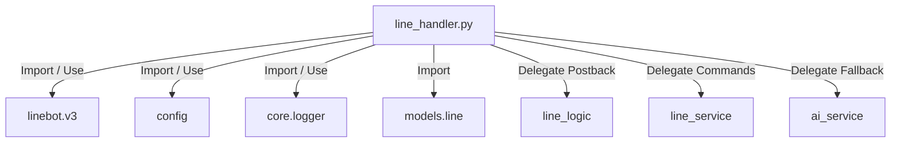

## 1. 解析メタ情報

| 項目 | 内容 |
| --- | --- |
| 対象ファイル | line_handler.py |
| 言語 | Python |
| 解析対象 | 提供されたコードのみ |
| 推測・補完 | 一切なし |

## 関連ドキュメント

* [webhook_router.md](./webhook_router.md) - 呼び出し元(`callback_line()`が本ファイルの`line_handler.handle`を`asyncio.to_thread`経由で実行)
* [line_logic.md](./line_logic.md) - Postbackイベントの委譲先(`LinePostbackData`は本ファイルではなく`line_logic.py`が使用する)
* [line_service.md](./line_service.md) - コマンド処理(ステータス確認・クエスト・承認却下・体調記録)の委譲先
* [ai_service.md](./ai_service.md) - フォールバック時(未定義コマンド)のAI解析委譲先
* [config.md](./config.md) - 認証情報・`FAMILY_SETTINGS`等の設定値を提供

## 2. ファイルの概要

* LINE Bot API（v3）からのWebhookイベント（テキストメッセージ受信、ポストバック受信）を解析し、適切な処理（ステータス確認、クエスト処理、子供の体調記録、AI解析、その他のロジック）へ振り分けるディスパッチャとしての責務を担う。実際のWebhook HTTPエンドポイント自体は本ファイルには存在せず、`routers/webhook_router.py` の `callback_line()` が担う。**（Issue #376で全面改修）** 以前は`callback_line()`がSDKの`WebhookHandler.handle(body, signature)`を呼び出し、署名検証・パース・ディスパッチをHTTPレスポンス送信前に一括完走させていたが、AI呼び出し等の遅延がreply token失効リスクに直結していたため、現在は`callback_line()`側で`line_handler.parser.parse()`により署名検証とパースのみを行って即座に応答し、本ファイルの`dispatch_events()`が実処理のエントリポイントとして`BackgroundTasks`経由で呼ばれる構成に変わった。`line_handler.add(...)`によるSDKへのハンドラー登録（`handle_message`/`handle_postback`）自体は後方互換のため維持しているが、実際の呼び出し経路は`dispatch_events()`内の`isinstance`分岐であり、SDKの自動ディスパッチ機構は使われていない。
* 根拠: `line_handler.add(MessageEvent, message=TextMessageContent)(handle_message)`, `line_handler.add(PostbackEvent)(handle_postback)` (行番号: 356-357 / 抜粋: "line_handler.add(MessageEvent, message=TextMessageContent)(handle_message)")、`dispatch_events`定義 (行番号: 360-392 / 抜粋: "def dispatch_events(events: List[Any]) -> None:")

## 3. 外部依存関係

### インポート一覧

| 名称 | 種類 | 用途 | 根拠 |
| --- | --- | --- | --- |
| `asyncio` | 標準ライブラリ | 非同期関数の同期的な実行(`asyncio.run`)、AI経路の時間上限(`asyncio.wait_for`/`asyncio.TimeoutError`。Issue #376で追加) | インポート宣言 (行番号: 2 / 抜粋: "import asyncio") |
| `time` | 標準ライブラリ | LINEプロフィール表示名キャッシュ(`_profile_cache`)のTTL判定・エビクション用タイムスタンプ取得 | インポート宣言 (行番号: 3 / 抜粋: "import time") |
| `Optional`, `List`, `Any`, `Dict` | 標準ライブラリ (typing) | 型ヒント | インポート宣言 (行番号: 4 / 抜粋: "from typing import Optional, List, Any, Dict") |
| `handlers.line_logic` | 内部モジュール | ポストバックイベントの一部処理委譲 | インポート宣言 (行番号: 6 / 抜粋: "import handlers.line_logic as line_logic") |
| `WebhookHandler` (linebot.v3) | 外部ライブラリ | LINE Webhookイベントの検証・ディスパッチ | インポート宣言 (行番号: 9 / 抜粋: "from linebot.v3 import WebhookHandler") |
| `Configuration`, `ApiClient`, `MessagingApi`, `ReplyMessageRequest`, `PushMessageRequest`（Issue #376で追加）, `TextMessage` (linebot.v3.messaging) | 外部ライブラリ | LINE APIクライアントの初期化、メッセージ送信オブジェクトの構築。`PushMessageRequest`は`reply_message`のreply失敗時pushフォールバックに使用 | インポート宣言 (行番号: 10-17 / 抜粋: "from linebot.v3.messaging import (") |
| `MessageEvent`等 (linebot.v3.webhooks) | 外部ライブラリ | Webhookイベントの型定義およびルーティング | インポート宣言 (行番号: 18 / 抜粋: "from linebot.v3.webhooks import MessageEvent, TextMessageContent, PostbackEvent") |
| `config` | 内部モジュール | APIトークンや設定値（家族のメンバー等）の取得 | インポート宣言 (行番号: 20 / 抜粋: "import config") |
| `setup_logging` (core.logger) | 内部モジュール | ロガーの初期化 | インポート宣言 (行番号: 21 / 抜粋: "from core.logger import setup_logging") |
| `line_service`, `ai_service` | 内部モジュール | ビジネスロジック、外部API、AI解析処理への委譲 | インポート宣言 (行番号: 22 / 抜粋: "from services import line_service, ai_service") |

旧版の本テーブルは`os`/`sys`/`json`（標準ライブラリ）・`models.line.LinePostbackData`を未使用インポートとして記載していたが、確認したところ現行ファイルはこれらを一切インポートしておらず誤りだった（訂正のみ。特定のIssueとは無関係）。

### ブラックボックスとなる外部要素

| 名称 | 理由 | 根拠 |
| --- | --- | --- |
| `config.LINE_CHANNEL_ACCESS_TOKEN` / `config.LINE_CHANNEL_SECRET` | 値の取得元や環境変数の仕様が不明 | 該当要素の使用 (行番号: 31, 33, 35 / 抜粋: "if config.LINE_CHANNEL_ACCESS_TOKEN and config.LINE_CHANNEL_SECRET:") |
| `config.FAMILY_SETTINGS["members"]` | データ構造やリストに含まれる要素の型・内容が不明 | 該当要素の使用 (行番号: 166 / 抜粋: "for member in config.FAMILY_SETTINGS[\"members\"]:") |
| `line_service` 各種メソッド | 引数に対する具体的な処理内容および戻り値の型・形式が不明 | 該当要素の呼び出し (行番号: 224 / 抜粋: "resp = await line_service.get_user_status_message(user_id)") |
| `ai_service.analyze_text_and_execute` | AI解析の具体的なロジック、副作用、戻り値の仕様が不明 | 該当要素の呼び出し (行番号: 252 / 抜粋: "ai_resp_text = await asyncio.wait_for(") |
| `line_logic.handle_postback` | 委譲先の具体的な処理内容および副作用が不明 | 該当要素の呼び出し (行番号: 301 / 抜粋: "line_logic.handle_postback(event, line_bot_api)") |
| `routers/webhook_router.py` の `callback_line` | 本ファイル外の実装であり、Webhook HTTPエントリーポイントとしての署名検証・ディスパッチの具体的な呼び出し経路は本ファイル内の記述からは確認できない | ファイル内に対応するルーター定義が存在しない（本ファイルはSDKのイベントハンドラー登録のみを行う） |

## 4. 主要要素の定義（関数 / エンドポイント / コンポーネント）

### `_PROFILE_CACHE_MAX_SIZE` (変数、Issue #410で追加)

* **役割**: `_profile_cache`が保持できるエントリ数の上限（`500`）。以前はTTL（`_PROFILE_CACHE_TTL_SEC`）がエントリの「古さ」判定にのみ使われ、キャッシュから自動でエントリを削除する仕組みが無かったため、ユニークな話者が増えるほど`_profile_cache`が無制限に成長し続けていた（プロセスは長時間稼働するため実質的なメモリリーク）。
* 根拠: `_PROFILE_CACHE_MAX_SIZE = 500` (行番号: 47)

### `_evict_oldest_profile_cache_entries` (関数、Issue #410で追加)

* **役割**: `_profile_cache`が`_PROFILE_CACHE_MAX_SIZE`件を超えている場合、キャッシュ時刻（各エントリのタプルの2番目の要素、`cached_at`）が古い順にエントリを削除して上限内に収める。`_get_display_name`が新規エントリを書き込むたびに呼ばれる。
* 根拠: `def _evict_oldest_profile_cache_entries() -> None:` (行番号: 67-76)

* **引数/リクエスト**: なし
* 根拠: 関数シグネチャ (行番号: 67)

* **戻り値/レスポンス**: `None`
* 根拠: 型ヒント (行番号: 67)

* **副作用**: `_profile_cache`からの削除（`del`）
* 根拠: `del _profile_cache[uid]` (行番号: 76)

* **エラーハンドリング**: なし（超過が無ければ早期return）
* 根拠: `if overflow <= 0: return` (行番号: 72-73)

### `_get_display_name`

* **役割**: LINEユーザーの表示名を取得する。`_profile_cache`（TTL=3600秒）にキャッシュがあればAPI呼び出しをせずそれを返し、なければ`line_bot_api.get_profile`を呼び出してキャッシュに格納する。メッセージ受信のたびに外部APIを呼んでいた従来の実装から変更され、API呼び出し頻度を抑制する。**（Issue #410で修正）** キャッシュ書き込み後に`_evict_oldest_profile_cache_entries`を呼び、`_profile_cache`が上限を超えないようにする。
* 根拠: `def _get_display_name(user_id: str) -> str:` (行番号: 80-96 / 抜粋: "def _get_display_name(user_id: str) -> str:")、エビクション呼び出し (行番号: 95 / 抜粋: "_evict_oldest_profile_cache_entries()")

* **引数/リクエスト**: `user_id`: `str`型
* 根拠: 引数定義 (行番号: 80 / 抜粋: "def _get_display_name(user_id: str) -> str:")

* **戻り値/レスポンス**: `str` (表示名。取得失敗時は`"Unknown"`)
* 根拠: `return user_name` (行番号: 96 / 抜粋: "return user_name")

* **副作用**: キャッシュヒット時はなし。キャッシュミス時は`line_bot_api.get_profile`呼び出し、`_profile_cache`への書き込み、および上限超過時のエビクション。
* 根拠: `if line_bot_api: profile = line_bot_api.get_profile(user_id)` (行番号: 90-91 / 抜粋: "profile = line_bot_api.get_profile(user_id)")

* **エラーハンドリング**: `get_profile`失敗時は例外を無視し`"Unknown"`のまま続行（キャッシュにも`"Unknown"`が書き込まれ、TTL間は再試行されない）。
* 根拠: `except Exception: pass` (行番号: 93-94 / 抜粋: "except Exception:")

### `AI_REPLY_TIMEOUT_SEC` (変数、Issue #376で追加)

* **役割**: `_process_message_async`のAI経路（`ai_service.analyze_text_and_execute`）に課す総時間上限（秒、`20`）。Gemini呼び出しはtenacityリトライ（最大3試行）×最大`MAX_TOOL_ROUNDS`回の連鎖になりうる一方、LINEのreply tokenは短命（約1分）で超過すると`reply_message`が400になり無応答になるため、上限内に終わらなければ打ち切る。
* 根拠: `AI_REPLY_TIMEOUT_SEC = 20` (行番号: 52)

### `_is_redelivery` (関数、Issue #376で追加)

* **役割**: LINE Webhookの再配信（`event.delivery_context.is_redelivery`）かどうかを返す。再配信を有効化していると応答が遅れた同一イベントが再送され、冪等性チェックの無い記録処理（体調・食事）が二重登録されるため、`handle_message`/`handle_postback`はこれが真のイベントをスキップする。SDKの値が厳密に`True`の場合のみ真とし（`is True`）、属性欠落や真偽値以外（テストの`MagicMock`等）は再配信扱いしない。
* 根拠: `def _is_redelivery(event) -> bool:` (行番号: 55-64 / 抜粋: "return getattr(ctx, \"is_redelivery\", False) is True")

* **引数/リクエスト**: `event`（SDKのイベントオブジェクト）
* 根拠: 関数シグネチャ (行番号: 55)

* **戻り値/レスポンス**: `bool`
* 根拠: (行番号: 64)

* **副作用**: なし
* 根拠: 関数本体 (行番号: 55-64)

* **エラーハンドリング**: `getattr`のデフォルトで属性欠落を吸収
* 根拠: (行番号: 63-64)

### `reply_message`

* **役割**: `line_bot_api.reply_message` を用いてユーザーにメッセージを返信するラッパー関数。単一のメッセージオブジェクトが渡された場合はリストに変換して送信する。`line_bot_api` が初期化されていない場合は何もせず終了する。**（Issue #376で修正）** 返信が失敗（reply tokenの期限切れ等）し、かつ`user_id`が渡されている場合は`line_bot_api.push_message`（`PushMessageRequest`）へフォールバックして同じメッセージを届ける（以前はログのみで無応答だった）。
* 根拠: `def reply_message(reply_token: str, messages: List[Any], user_id: Optional[str] = None):` (行番号: 100-131 / 抜粋: "def reply_message(reply_token: str, messages: List[Any], user_id: Optional[str] = None):")、push フォールバック (行番号: 121-131 / 抜粋: "line_bot_api.push_message(")

* **引数/リクエスト**:
* `reply_token`: `str`型 (LINE APIの返信用トークン)
* `messages`: `List[Any]`型または単一のオブジェクト (送信するメッセージオブジェクト)
* `user_id`: `Optional[str]` (Issue #376で追加。返信失敗時のpush先。`None`ならフォールバックしない)
* 根拠: 引数定義 (行番号: 100)

* **戻り値/レスポンス**: なし (`None`)
* 根拠: return文はいずれも値なし (行番号: 108, 117, 122)

* **副作用**: LINE Platform経由でのユーザーへのメッセージ送信（reply、失敗時はpush。pushは月間送信数の枠を消費する）。
* 根拠: 外部API呼び出し (行番号: 111-116, 125-129 / 抜粋: "line_bot_api.reply_message(" / "line_bot_api.push_message(")

* **エラーハンドリング**: `line_bot_api` 未初期化時は早期return。reply失敗時は `logger.error` の後、`user_id`があれば`logger.warning`を出しpushへフォールバック。push失敗も`logger.error`で握り、例外は外へ伝播しない。
* 根拠: `if not line_bot_api: return` / `except Exception as e:` ×2 (行番号: 108, 118-119, 121-122, 130-131)

### `handle_message`

* **役割**: `TextMessageContent` の `MessageEvent` を受け取り、`_get_display_name`（TTLキャッシュ付き）で送信者の表示名を取得した上で、非同期処理 `_process_message_async` を同期的に実行 (`asyncio.run`) する。**（Issue #376 / L-L1で修正）** 先頭で`_is_redelivery`が真なら警告ログを出してスキップする。また関数全体を`try/except Exception`で包み、SDKの`WebhookHandler.handle`ループが1件目の例外で中断して同一Webhook内の後続イベントが処理されない（のに200が返る）問題をイベント単位で隔離する。**（L-L6 #410で修正）** `event.source.user_id`がグループでの発言時にLINEの仕様上`None`になりうるケースを考慮していなかった（`_get_display_name(None)`は`get_profile(None)`の例外を握り潰し`"Unknown"`を返すだけなので、以前はこの状態に気づかないまま処理が続行し、`user_id=NULL`のまま体調・食事等の記録がDB保存されていた）。`user_id`が`None`の場合は警告ログを出して処理をスキップするようにした。
* 根拠: `def handle_message(event: MessageEvent):` (行番号: 187-216 / 抜粋: "def handle_message(event: MessageEvent):")、再配信スキップ (行番号: 192-194)、`user_id`のNoneガード (行番号: 196-203 / 抜粋: "if user_id is None:")、例外隔離 (行番号: 215-216 / 抜粋: "logger.error(f\"handle_message Error: {e}\", exc_info=True)")

* **引数/リクエスト**:
* `event`: `MessageEvent`型 (LINEのWebhookイベントオブジェクト)
* 根拠: 引数定義 (行番号: 187 / 抜粋: "def handle_message(event: MessageEvent):")

* **戻り値/レスポンス**: なし (`None`)
* 根拠: 再配信スキップ時・`user_id`Noneガード時の空`return`のみ (行番号: 194, 203)

* **副作用**: `_get_display_name`経由での外部API呼び出し（キャッシュミス時のみ）、`logger.info`/`logger.warning`によるログ出力、および `_process_message_async` の実行に伴う副作用。
* 根拠: 関数呼び出し (行番号: 202, 208, 210, 212-214 / 抜粋: "user_name = _get_display_name(user_id)")

* **エラーハンドリング**: `_get_display_name`内部で`get_profile`失敗時の例外を無視する設計に委譲。**（L-L1で追加）** 本関数自体も全例外を捕捉し`logger.error(..., exc_info=True)`で記録して握る（後続イベントの処理を止めない）。**（L-L6で追加）** `user_id`が`None`の場合は`_get_display_name`/`_process_message_async`を呼ばず早期returnする。
* 根拠: `except Exception as e:` (行番号: 215-216)

### `_NEGATIVE_GENKI_PATTERNS` / `CONDITION_NOT_GENKI` (変数、Issue #375で追加)

* **役割**: `_NEGATIVE_GENKI_PATTERNS`は「元気ない」「元気がない」「元気なし」「元気じゃない」「元気ではない」の否定表現タプル。`CONDITION_NOT_GENKI`（`"元気なし"`）は否定表現を検出したときに記録する体調文字列。以前は`"元気" if "元気" in msg_text`の部分一致のため「元気ない」が肯定の「元気」として記録され意味が反転していた。
* 根拠: (行番号: 138-139 / 抜粋: "_NEGATIVE_GENKI_PATTERNS = (\"元気ない\", \"元気がない\", \"元気なし\", ...)")

### `_detect_condition_keyword` (関数、Issue #375で追加)

* **役割**: 与えられたテキストから定型キーワードで体調を判定する。否定表現（`_NEGATIVE_GENKI_PATTERNS`）を最初に評価して`CONDITION_NOT_GENKI`を返し、次に「元気」→「元気」、「風邪」→「風邪」、いずれも無ければ「不明」を返す。
* 根拠: `def _detect_condition_keyword(text: str) -> str:` (行番号: 142-150)

* **引数/リクエスト**: `text: str`
* 根拠: 関数シグネチャ (行番号: 142)

* **戻り値/レスポンス**: `str`（`"元気なし"` / `"元気"` / `"風邪"` / `"不明"`）
* 根拠: 各`return` (行番号: 144-150)

* **副作用**: なし
* 根拠: 関数本体 (行番号: 142-150)

* **エラーハンドリング**: なし
* 根拠: 関数本体 (行番号: 142-150)

### `_extract_health_targets` (関数、Issue #375で追加)

* **役割**: メッセージ中に登場する`config.FAMILY_SETTINGS["members"]`の全メンバーを出現位置順に列挙し、各メンバーについて「その名前の直後〜次の名前まで」の区間を`_detect_condition_keyword`で判定する。区間内にキーワードが無い（「不明」）場合はメッセージ全体の判定結果へフォールバックする（「体調 元気 智矢 涼花」のように名前より前にキーワードがある書き方に対応）。以前は最初に一致した1名だけを処理し、2名併記時は残りを無言で捨てていた。
* 根拠: `def _extract_health_targets(msg_text: str) -> List[tuple]:` (行番号: 153-179)

* **引数/リクエスト**: `msg_text: str`
* 根拠: 関数シグネチャ (行番号: 153)

* **戻り値/レスポンス**: `List[tuple]`（出現順の`(メンバー名, 体調)`。該当メンバーが無ければ空リスト）
* 根拠: `return targets` (行番号: 179)

* **副作用**: なし
* 根拠: 関数本体 (行番号: 153-179)

* **エラーハンドリング**: なし
* 根拠: 関数本体 (行番号: 153-179)

### `_process_message_async`

* **役割**: 受信したテキストメッセージの内容に応じた分岐（ステータス、クエスト、承認/却下、子供の体調記録）を行い、該当しない場合はAI解析に回す非同期処理ロジック。**（Issue #375で修正）** 体調記録の分岐は`_extract_health_targets`でメッセージ中の全メンバーと各人の体調（否定表現を優先判定）を取得し、全員分`line_service.log_child_health`を呼んだうえで、返信メッセージを1回の`reply_message`にまとめて（最大5件）送信する。メンバー名が1つも含まれない場合は従来どおりAI解析へフォールバックする。
* 根拠: `async def _process_message_async(user_id: str, user_name: str, msg_text: str, reply_token: str):` (行番号: 219 / 抜粋: "async def _process_message_async(user_id: str, user_name: str, msg_text: str, reply_token: str):")、体調分岐 (行番号: 239-247 / 抜粋: "targets = _extract_health_targets(msg_text)")

* **引数/リクエスト**:
* `user_id`: `str`型 (ユーザーのLINE ID)
* `user_name`: `str`型 (ユーザーの表示名)
* `msg_text`: `str`型 (受信したテキストメッセージ)
* `reply_token`: `str`型 (返信用トークン)
* 根拠: 引数定義 (行番号: 219 / 抜粋: "async def _process_message_async(user_id: str, user_name: str, msg_text: str, reply_token: str):")

* **戻り値/レスポンス**: なし (`None`)
* 根拠: 各分岐でのreturnは空 (行番号: 226, 231, 236, 247 / 抜粋: "return")

* **副作用**: `line_service`、`ai_service` への処理委譲に伴う副作用、および `reply_message` によるメッセージ送信。**（Issue #376で修正）** すべての`reply_message`呼び出しに`user_id=`を渡し、返信失敗時のpushフォールバックを可能にしている。AI経路は`asyncio.wait_for(..., timeout=AI_REPLY_TIMEOUT_SEC)`で総時間を制限する。
* 根拠: サービス呼び出し (行番号: 224, 229, 234, 245, 251-254 / 抜粋: "ai_resp_text = await asyncio.wait_for(")

* **エラーハンドリング**: AI処理 (`ai_service.analyze_text_and_execute`) が`AI_REPLY_TIMEOUT_SEC`秒以内に終わらない場合（`asyncio.TimeoutError`）はエラーログを出力し「⏳ 処理に時間がかかりすぎたため中断しました。記録が反映されているか確認のうえ…」を返信する（Issue #376。打ち切り時点でスレッド上のDB書き込みが完了している可能性があるため、確認を促す文言にしている）。その他の例外はエラーログを出力し、固定のエラーメッセージ("😓 すみません、うまく処理できませんでした。")をユーザーに返信する。それ以外の分岐（ステータス/クエスト/承認却下/体調記録）にはtry-exceptがない（呼び出し元`handle_message`のイベント単位隔離で握られる）。
* 根拠: `except asyncio.TimeoutError:` (行番号: 260-265)、`except Exception as e: logger.error(...)` (行番号: 266-267 / 抜粋: "except Exception as e:")

### `handle_postback`

* **役割**: `PostbackEvent` (ボタン押下など) を受け取るハンドラー。`data` 文字列が "approve:" または "reject:" で始まる場合は「承認/却下」コマンドに変換して `_process_message_async` を呼び出す。それ以外は `line_logic.handle_postback` へ処理を丸投げする。**（Issue #376 / L-L1で修正）** `handle_message`と同様に、先頭で`_is_redelivery`が真ならスキップし、関数全体を`try/except Exception`で包んでイベント単位で例外を隔離する。
* 根拠: `def handle_postback(event: PostbackEvent):` (行番号: 271-307 / 抜粋: "def handle_postback(event: PostbackEvent):")、再配信スキップ (行番号: 275-277)、例外隔離 (行番号: 306-307)

* **引数/リクエスト**:
* `event`: `PostbackEvent`型
* 根拠: 引数定義 (行番号: 271 / 抜粋: "def handle_postback(event: PostbackEvent):")

* **戻り値/レスポンス**: なし (`None`)
* 根拠: 各分岐でのreturnは空 (行番号: 277, 295 / 抜粋: "return")

* **副作用**: `_process_message_async` または `line_logic.handle_postback` の実行に伴う副作用、および`logger.info`/`logger.warning`によるログ出力。
* 根拠: 関数呼び出し (行番号: 283, 292, 301 / 抜粋: "line_logic.handle_postback(event, line_bot_api)")

* **エラーハンドリング**:
* "approve:/reject:" のパース失敗時 (`ValueError`) にはエラーログを出力し処理終了。
* `line_logic.handle_postback` 委譲時の例外はキャッチしてエラーログを出力（ユーザーへの通知はコメントアウトされている）。
* **（L-L1で追加）** 上記以外（`event`属性アクセスや承認コマンド処理中の例外等）も外側の`except Exception`で捕捉し`exc_info=True`で記録する。
* 根拠: `except ValueError: logger.error(...)` / `except Exception as e: logger.error(...)` ×2 (行番号: 293-294, 302-305, 306-307 / 抜粋: "except ValueError:")

### `_SEEN_EVENT_IDS` / `_evict_oldest_seen_event_ids` / `_is_duplicate_event` (Issue #376で追加)

* **役割**: `webhookEventId`（line-bot-sdk 3.21.0でEvent基底クラスの必須フィールド、ULID形式）ベースの冪等化キャッシュ。LINEのWebhook配信は「少なくとも1回」到達を保証する仕様であり、`_is_redelivery`が検知する明示的な再配信以外にもネットワーク遅延等で同一イベントが複数回届く可能性があるため、直近処理済みのイベントIDを記録して二重処理（体調・食事等の記録の二重登録、AI呼び出しの二重実行）を防ぐ。単一プロセス・LAN限定の個人用サービスのため新規DBテーブルは設けず、`_profile_cache`と同様にプロセス内メモリ・サイズ上限(`_SEEN_EVENT_IDS_MAX_SIZE`=500)つきの辞書で管理する（プロセス再起動で消える点は許容）。`_evict_oldest_seen_event_ids`は上限超過時に検知時刻が古いものから削除する。`_is_duplicate_event`は未処理のIDなら記録した上で`False`を、直近処理済みのIDなら`True`を返す。`webhook_event_id`が取得できないイベント（テスト用モック等）は冪等化できないため誤って処理を止めないよう`False`を返す。`BackgroundTasks`はスレッドプール(`run_in_threadpool`)で実行されるため、`_seen_event_ids_lock`（`threading.Lock`）で確認と記録を保護する。
* 根拠: `_SEEN_EVENT_IDS: Dict[str, float] = {}` (行番号: 76〜78)、`def _evict_oldest_seen_event_ids() -> None:` (行番号: 83〜90)、`def _is_duplicate_event(event) -> bool:` (行番号: 93〜109)

* **引数/リクエスト**: `_is_duplicate_event(event)`: イベントオブジェクト
* 根拠: (行番号: 93)

* **戻り値/レスポンス**: `_is_duplicate_event`は`bool`（重複なら`True`）
* 根拠: (行番号: 93, 103, 109)

* **副作用**: `_SEEN_EVENT_IDS`への書き込み・削除（ロック保護下）
* 根拠: (行番号: 104〜107)

* **エラーハンドリング**: `webhook_event_id`が取得できない場合は`False`を返すのみ（例外は送出しない）
* 根拠: `if not event_id: return False` (行番号: 101〜102)

### `dispatch_events` (Issue #376で追加)

* **役割**: `routers/webhook_router.py`が署名検証・パース済みのイベント一覧を`BackgroundTasks`経由で渡してくる、実処理のエントリポイント。イベントごとに`_is_duplicate_event`で冪等化チェックを行い（重複ならスキップしてINFOログ）、`MessageEvent`+`TextMessageContent`なら`handle_message`、`PostbackEvent`なら`handle_postback`へ振り分ける（`line_handler.add(...)`での登録内容と同じ組合せ）。イベント単位で`try/except`を掛けており、1件の処理で例外が起きても後続イベントの処理を止めない（`handle_message`/`handle_postback`自体も内部で例外を握り潰すが、このループでも二重に防御する）。
* 根拠: `def dispatch_events(events: List[Any]) -> None:` (行番号: 360〜392)

* **引数/リクエスト**: `events: List[Any]`（`line_handler.parser.parse()`が返すパース済みイベントのリスト）
* 根拠: (行番号: 360)

* **戻り値/レスポンス**: `None`
* 根拠: (行番号: 360)

* **副作用**: `handle_message`/`handle_postback`の実行に伴う副作用一式、重複スキップ時のINFOログ、例外発生時のERRORログ
* 根拠: (行番号: 380〜392)

* **エラーハンドリング**: イベントごとの`try/except Exception`で例外を捕捉しERRORログ（`exc_info=True`）を出力、後続イベントの処理は継続する
* 根拠: `except Exception as e: logger.error(f"dispatch_events Error: {e}", exc_info=True)` (行番号: 391〜392)

## 5. 処理フロー図

本ファイルは実処理のディスパッチ本体（`dispatch_events`）とハンドラー関数（`handle_message`/`handle_postback`）を定義する。署名検証・パースは`routers/webhook_router.py`の`callback_line()`（本ファイル外）が担い、パース済みイベントを`BackgroundTasks`経由で`dispatch_events()`へ渡す。SDK初期化に成功した場合、モジュール末尾で`handle_message`/`handle_postback`が`line_handler.add(...)`にも登録されるが（後方互換）、実際の呼び出しは`dispatch_events()`内の`isinstance`分岐を経由する。

```mermaid
flowchart TD
    Start([Start: dispatch_events()がBackgroundTasks経由で呼ばれる]) --> DupCheck{"_is_duplicate_event?"}
    DupCheck -- Yes --> SkipDup["スキップ(INFOログ)"]
    DupCheck -- No --> RouteEvent{イベント種別}
    
    RouteEvent -- MessageEvent --> HandleMsg["handle_message()"]
    HandleMsg --> GetDisplayName["_get_display_name()"]
    GetDisplayName --> CacheHit{"_profile_cacheに<br>TTL内のエントリがあるか?"}
    CacheHit -- Yes --> RunAsyncMessage["asyncio.run(_process_message_async)"]
    CacheHit -- No --> GetProfile["外部：line_bot_api.get_profile()"]
    GetProfile --> UpdateCache["_profile_cacheへ書き込み"]
    UpdateCache --> RunAsyncMessage
    
    RouteEvent -- PostbackEvent --> HandlePostback["handle_postback()"]
    HandlePostback --> PostbackData{data文字列の判定}
    PostbackData -- "approve: / reject:" --> ParseData["コマンド文字列に変換"]
    ParseData --> RunAsyncPostback["asyncio.run(_process_message_async)"]
    PostbackData -- その他 --> LogicPostback["外部：line_logic.handle_postback()"]
    
    RunAsyncMessage --> MsgText{テキスト内容}
    RunAsyncPostback --> MsgText
    
    MsgText -- "ステータス" --> CallStatus["外部：line_service.get_user_status_message()"]
    MsgText -- "クエスト" --> CallQuest["外部：line_service.get_active_quests_message()"]
    MsgText -- "承認 / 却下..." --> CallApprove["外部：line_service.process_approval_command()"]
    MsgText -- "子供記録 / 体調..." --> ExtractTargets["Issue #375: _extract_health_targets<br>(全メンバー・否定表現優先)"]
    ExtractTargets -- "メンバー無し" --> CallAI
    ExtractTargets -- "メンバーあり(全員分)" --> CallHealth["外部：line_service.log_child_health()"]
    MsgText -- その他 --> CallAI["外部：ai_service.analyze_text_and_execute()"]
    
    CallStatus --> Reply["reply_message()"]
    CallQuest --> Reply
    CallApprove --> Reply
    CallHealth --> Reply
    CallAI --> Reply
    
    LogicPostback --> EndPostback([End: Postback処理完了])
    Reply --> EndMessage([End: Message処理完了])

```

## 6. 依存関係図

```mermaid
graph TD
    %% 内部モジュール
    LineHandler[line_handler.py]
    LineLogic[line_logic]
    LineService[line_service]
    AiService[ai_service]
    Config[config]
    CoreLogger[core.logger]
    ModelsLine[models.line]
    
    %% 外部ライブラリ
    LineBotV3[linebot.v3]
    
    %% 依存関係
    LineHandler -->|Import / Use| LineBotV3
    LineHandler -->|Import / Use| Config
    LineHandler -->|Import / Use| CoreLogger
    LineHandler -->|Import| ModelsLine
    
    LineHandler -->|Delegate Postback| LineLogic
    LineHandler -->|Delegate Commands| LineService
    LineHandler -->|Delegate Fallback| AiService

```

## 7. 次のステップ（リバースエンジニアリングの提案）

| 優先度 | ファイル名(推測可) | 理由 | 根拠 |
| --- | --- | --- | --- |
| 高 | `config.py` | 認証情報やシステム設定値（`FAMILY_SETTINGS`等）の構造が不明なため、システム要件の全容把握に必須。 | 該当ファイルからのインポートと参照 (抜粋: "config.LINE_CHANNEL_ACCESS_T") |
| 高 | `services/line_service.py` | 主要なビジネスロジック（クエスト、承認、体調管理）がこのファイルに隠蔽されており、具体的な処理内容やデータベース更新の有無が不明なため。 | 該当モジュールのメソッド呼び出し (抜粋: "await line_service.get_user_") |
| 中 | `handlers/line_logic.py` | Postbackイベントのうち、承認/却下以外のボタン操作処理の実装が全てこのファイルに委譲されているため。 | 該当モジュールの呼び出し (抜粋: "line_logic.handle_postback(") |
| 中 | `services/ai_service.py` | 未定義のコマンドを受け取った際のフォールバックロジック（AI解析）の具体的なプロンプト仕様や外部API呼び出しの詳細を知るため。 | 該当モジュールのメソッド呼び出し (抜粋: "await ai_service.analyze_tex") |

## 8. 保守上の注意点

* **プロフィール表示名のキャッシュ**: 従来は`handle_message`が受信メッセージ毎に`line_bot_api.get_profile`を直接呼び出しており、ログ表示用の名前取得だけのために毎回外部API通信が発生していた。現在は`_get_display_name`がTTL付き（3600秒）のインメモリキャッシュ(`_profile_cache`)を挟むため、キャッシュヒット時は外部API呼び出しが発生しない。プロセス再起動でキャッシュはクリアされる。**（Issue #410で修正）** TTLはエントリの「古さ」判定にのみ使われエントリを自動削除する仕組みが無かったため無制限に成長し続けていたが、`_PROFILE_CACHE_MAX_SIZE`（500）を超えたら`_evict_oldest_profile_cache_entries`が最終アクセス時刻の古いエントリから削除するようになった。
* 根拠: `_profile_cache`, `_PROFILE_CACHE_TTL_SEC` (行番号: 41-42 / 抜粋: "_profile_cache: Dict[str, tuple] = {}")、`_PROFILE_CACHE_MAX_SIZE`/エビクション (行番号: 47, 62-76)

* **非同期処理の実行**: `handle_message` および `handle_postback` は同期関数として定義されており、内部で `asyncio.run()` を使用して非同期関数を呼び出している。呼び出し元の`routers/webhook_router.py`の`callback_line()`は`asyncio.to_thread`経由で`line_handler.handle`（同期API）を別スレッドで実行しているため、ASGIのメインイベントループ内で`asyncio.run()`が呼ばれるわけではないが、この二重構造は把握しておく必要がある。
* 根拠: `asyncio.run` の使用 (行番号: 213-215, 292 / 抜粋: "asyncio.run(")

* **変数初期化の順序と依存**: `line_handler` と `line_bot_api` がグローバルスコープで定義され、`config.LINE_CHANNEL_ACCESS_TOKEN`/`config.LINE_CHANNEL_SECRET`が揃っている場合のみ条件付きで初期化される。`reply_message`は`if not line_bot_api: return`で早期returnするが、`handle_message`/`_get_display_name`は`line_bot_api`が`None`のままでも例外を出さずに動作継続する（`_get_display_name`は`try/except Exception: pass`で吸収）。
* 根拠: モジュールレベルの条件分岐 (行番号: 31-38 / 抜粋: "if config.LINE_CHANNEL_ACCESS_TOKEN and config.LINE_CHANNEL_SECRET:")

* **[修正済み] Issue #375 「元気ない」の反転記録・2名併記時の取りこぼし**: 体調キーワード分岐は`"元気" in msg_text`の部分一致で「元気ない/元気がない/元気なし」も「元気」として記録し、また最初に一致した1名のみ処理して2名目以降を無言で捨てていた。`_detect_condition_keyword`（否定表現を先に判定し`CONDITION_NOT_GENKI`＝「元気なし」を返す）と`_extract_health_targets`（全メンバーを出現順に列挙し名前ごとの区間で判定、区間にキーワードが無ければ全体判定へフォールバック）に置き換えた。判定は依然として定型キーワードの部分一致であり、「熱がある」等キーワード外の表現は「不明」として記録される（AIフォールバックには回らない）点は従来どおり。
* 根拠: `_NEGATIVE_GENKI_PATTERNS`/`CONDITION_NOT_GENKI` (行番号: 138-139)、`_detect_condition_keyword` (行番号: 142-150)、`_extract_health_targets` (行番号: 153-179)、分岐 (行番号: 239-247)

* **[修正済み] Issue #376 / L-L1 reply token期限切れ・再配信による重複記録・イベント単位の例外隔離**: Webhook応答前に同期的にAI処理（tenacityリトライ×連鎖ツール呼び出し）を完走する構造のため、LINEのreply token（約1分）を超過すると`reply_message`が400になり無応答、さらに再配信を有効化していると同一イベントが再送されて記録が二重化していた。対応: (1) `AI_REPLY_TIMEOUT_SEC`(20秒)で`asyncio.wait_for`によりAI経路を打ち切り、超過時は確認を促す文言を返信、(2) `reply_message`は失敗時に`user_id`宛て`push_message`へフォールバック、(3) `deliveryContext.isRedelivery=true`のイベントは`handle_message`/`handle_postback`でスキップ、(4) 両ハンドラを`try/except`で包み、複数イベント一括配信時に1件目の例外で後続が処理されない問題を隔離。**署名検証後に即200を返してバックグラウンドで処理する構造への変更は行っていない**（同期処理のまま。`webhookEventId`による冪等化も未実装で、再配信は一律スキップ）。`asyncio.wait_for`の打ち切りはコルーチンをキャンセルするが、`run_in_executor`/`to_thread`上で進行中のDB書き込み・Gemini呼び出しのスレッドは止まらないため、タイムアウト応答後に記録が完了している可能性がある。
* 根拠: `AI_REPLY_TIMEOUT_SEC` (行番号: 52)、`_is_redelivery` (行番号: 55-64)、`reply_message`のpushフォールバック (行番号: 121-131)、`handle_message` (行番号: 187-216)、AI経路の`wait_for` (行番号: 251-267)、`handle_postback` (行番号: 271-307)

* **[修正済み] Issue #410 L-L6 グループ発言でuser_idがNoneのケース未考慮**: `event.source.user_id`はグループでの発言時、プロフィール未共有等の理由でLINEの仕様上`None`になりうる。`_get_display_name(None)`は`get_profile(None)`の例外を握り潰し`"Unknown"`を返すだけなので、以前はこの状態に気づかないまま処理が続行し、`user_id=NULL`のまま体調・食事等の記録がDB保存されていた。`handle_message`は`user_id`が`None`の場合、警告ログを出して`_get_display_name`/`_process_message_async`を呼ばず早期returnする（`handle_postback`側は本Issueの対象外として未対応のまま）。
* 根拠: `handle_message`の`if user_id is None:` (行番号: 196-203)

* **イベントハンドラー登録の条件分岐**: `handle_message`/`handle_postback`関数自体は常に定義されるが、SDKへのイベントハンドラー登録（`line_handler.add(...)`）は`if line_handler:`ブロック内でのみ行われる。認証情報が無い環境（テスト等）ではハンドラー関数を直接呼び出す形でのみロジックを検証できる。
* 根拠: `if line_handler: line_handler.add(...)` (行番号: 309-311 / 抜粋: "if line_handler:")

## 9. 不明事項一覧

| 項目 | 理由 | 必要なファイル |
| --- | --- | --- |
| `config.LINE_CHANNEL...` の取得元 | 環境変数か直接記述か判断できないため。 | `config.py` |
| `FAMILY_SETTINGS["members"]` の構造 | リストの要素型や定義されている家族のデータ構造が不明なため。 | `config.py` |
| `line_service` の戻り値の型 | 各関数が返却するオブジェクトが `TextMessage` のようなLINEのメッセージオブジェクト群なのか、文字列なのか判断できないため。 | `services/line_service.py` |
| `ai_service` のAI処理仕様 | 外部のLLM APIを叩いているのか、独自の解析ロジックか判断できないため。 | `services/ai_service.py` |
| Postback未処理の挙動 | `line_logic.handle_postback` に渡された後、どのようにレスポンスが形成されるのか不明なため。 | `handlers/line_logic.py` |
| `LinePostbackData` の用途 | 本ファイル内でインポートされているが使用されていないため、本来どこで使用されるべきモデルだったか不明。 | `models/line.py` (または過去のコミット) |

## 相互参照による補足情報

| 元の不明事項 | 判明した内容 | 参照元ドキュメント |
| --- | --- | --- |
| `config.LINE_CHANNEL...` の取得元 | `MY_HOME_SYSTEM/config.py`を直接確認した。183〜184行目で`LINE_CHANNEL_ACCESS_TOKEN: Optional[str] = os.getenv("LINE_CHANNEL_ACCESS_TOKEN")`、`LINE_CHANNEL_SECRET: Optional[str] = os.getenv("LINE_CHANNEL_SECRET")`と定義されており、環境変数から取得する設計であることを直接確認した。実値そのものは環境変数由来のためリポジトリ内には存在しない。 | 直接ソース確認: `MY_HOME_SYSTEM/config.py:183-184` |
| `FAMILY_SETTINGS["members"]` の構造 | `MY_HOME_SYSTEM/config.py`469〜477行目を直接確認した。`FAMILY_SETTINGS`は`{"members": ["智矢", "涼花", "将博", "春菜"], "styles": {...}}`という構造で、`members`は4件の実名文字列からなる`List[str]`であることを確認した。`styles`は各実名をキーとし、値は`{"color": "#1E90FF", "age": None, "icon": "👦"}`のような`color`(カラーコード文字列)・`age`(初期値`None`)・`icon`(絵文字)を持つ辞書である。479〜488行目より、Git管理対象外の`family_members.local.json`が存在すれば`styles`内の同名キーへ`age`等の値がマージされる設計であることも確認した。 | 直接ソース確認: `MY_HOME_SYSTEM/config.py:469-488` |
| `line_service` の戻り値の型 | `MY_HOME_SYSTEM/services/line_service.py`を直接確認した。`log_child_health`(34行目)・`log_food_record`(43行目)・`process_approval_command`(159行目)は戻り値の型注釈が`TextMessage`、`get_user_status_message`(107行目)・`get_active_quests_message`(132行目)は`Union[TextMessage, FlexMessage]`であり、実際の`return`文(41, 51, 115-130, 139-157行目等)もすべて`linebot.v3.messaging`の`TextMessage`または`FlexMessage`インスタンスを返していることを確認した。 | 直接ソース確認: `MY_HOME_SYSTEM/services/line_service.py:34,43,107,115-130,132,139-157,159` |
| `ai_service` のAI処理仕様 | `MY_HOME_SYSTEM/services/ai_service.py`を直接確認した。10行目で`import google.generativeai as genai`しており、34〜35行目で`config.GEMINI_API_KEY`が設定されていれば`genai.configure(api_key=...)`する。302行目で`genai.GenerativeModel(MODEL_NAME, tools=tools_schema)`によりツール呼び出し対応のモデルを生成し、350〜354行目でモデルからのツール呼び出し結果に応じて`tool_record_child_health`・`tool_record_food`・`tool_search_db`(91, 113, 146行目でそれぞれ定義)のいずれかを実行する設計であることを確認した。 | 直接ソース確認: `MY_HOME_SYSTEM/services/ai_service.py:10,34-35,91,113,146,293-354` |
| Postback未処理の挙動 | `MY_HOME_SYSTEM/handlers/line_logic.py`の`handle_postback`を直接確認した。200〜389行目で`action`の値ごとに`if/elif`で分岐しDB保存とFlex/テキストメッセージ返信を行っており、380〜389行目の`else`節（コメント`# === Fail-Safe: 未定義のアクション ===`）で`logger.warning(f"Unknown action received: '{action}' from user: {user_id}")`により警告ログを出力した上で、`TextMessage(text="⚠️ 不明な操作、または未対応のアクションです。")`をユーザーへ返信することを確認した。 | 直接ソース確認: `MY_HOME_SYSTEM/handlers/line_logic.py:200-219,380-389` |
| `LinePostbackData` の用途 | `MY_HOME_SYSTEM/models/line.py`23〜30行目を直接確認し、`action: str`, `child: Optional[str]`, `status: Optional[str]`, `value: Optional[str]`の4フィールドを持つPydanticモデルであることを確認した。実際の利用元は`handlers/line_logic.py`33行目のインポートと208〜215行目の`handle_postback`内でのインスタンス化であり、本ファイル(`handlers/line_handler.py`)28行目でも同モデルはインポートされているが、`line_handler.py`内では`grep`で確認した限り使用箇所が見つからず未使用インポートであることを直接確認した。 | 直接ソース確認: `MY_HOME_SYSTEM/models/line.py:23-30`, `MY_HOME_SYSTEM/handlers/line_logic.py:33,208-215`, `MY_HOME_SYSTEM/handlers/line_handler.py:28` |

## 10. 自己検証結果

* [x] 推測・外部ファイルの仕様を一切含んでいない
* [x] 全関数・全クラス・全コンポーネントを列挙した
* [x] 全てのインポート要素を列挙した
* [x] すべての仕様説明に「根拠（行番号・抜粋）」を明記した
* [x] 根拠漏れが0件である
* [x] Mermaid構文にエラーの原因となる記号（エスケープ漏れ）がない
* [x] 不明事項を漏れなく列挙した

完了