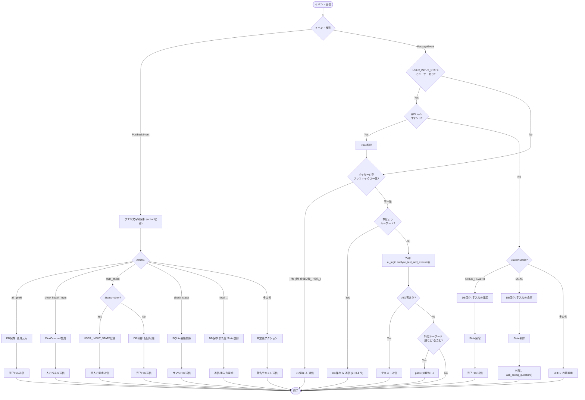
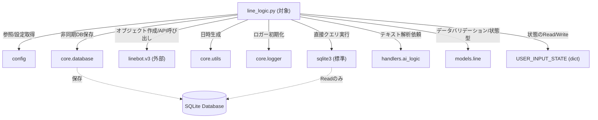

## 1. 解析メタ情報

| 項目 | 内容 |
| --- | --- |
| 対象ファイル | `line_logic.py` |
| 言語 | Python |
| 解析対象 | 提供されたコードのみ |
| 推測・補完 | 一切なし |

## 2. ファイルの概要

* LINE Messaging APIを利用し、Webhookからのメッセージイベントおよびポストバックイベントを受信するロジック群。
* ユーザーからの入力やボタン操作（体調記録、食事記録など）を解析し、SQLiteデータベースへの非同期保存処理を呼び出す。
* LINEプラットフォームへ返すテキスト、QuickReply、FlexMessageなどのUIコンポーネントを生成・送信する。
* 一部のテキスト入力に対しては、AI解析処理（外部モジュール）へのルーティングを行う。

## 3. 外部依存関係

### インポート一覧

| 名称 | 種類 | 用途 | 根拠 |
| --- | --- | --- | --- |
| `config` | 外部モジュール | 設定値や定数（メンバー、DBパス等）の参照 | `import config` (行番号: 2 / 抜粋: "import config") |
| `asyncio` | 標準ライブラリ | 非同期関数の同期実行ヘルパーの作成 | `import asyncio` (行番号: 3 / 抜粋: "import asyncio") |
| `json` | 標準ライブラリ | インポートされているが未使用 | `import json` (行番号: 4 / 抜粋: "import json") |
| `sqlite3` | 標準ライブラリ | データベースへの直接接続・クエリ実行 | `import sqlite3` (行番号: 5 / 抜粋: "import sqlite3") |
| `datetime` | 標準ライブラリ | 日時のフォーマット処理 | `import datetime` (行番号: 6 / 抜粋: "import datetime") |
| `parse_qsl` | 標準ライブラリ (`urllib.parse`) | Postbackデータのパース | `from urllib.parse import parse_qsl` (行番号: 7 / 抜粋: "from urllib.parse import parse...") |
| `linebot.v3.messaging` | 外部ライブラリ | LINE APIのモデルおよびリクエストクラス | `from linebot.v3.messaging imp...` (行番号: 10〜21 / 抜粋: "from linebot.v3.messaging...") |
| `linebot.v3.webhooks` | 外部ライブラリ | LINE Webhookイベントの型定義 | `from linebot.v3.webhooks impo...` (行番号: 22 / 抜粋: "from linebot.v3.webhooks impo...") |
| `setup_logging` | 外部モジュール (`core.logger`) | ロガーの初期化 | `from core.logger import setup...` (行番号: 27 / 抜粋: "from core.logger import setup...") |
| `get_now_iso` / `get_today_date_str` | 外部モジュール (`core.utils`) | 現在日時の取得 | `from core.utils import get_no...` (行番号: 30 / 抜粋: "from core.utils import get_no...") |
| `save_log_async` | 外部モジュール (`core.database`) | ログの非同期DB保存 | `from core.database import sav...` (行番号: 31 / 抜粋: "from core.database import sav...") |
| `ai_logic` | 外部モジュール (`handlers`) | 自然言語のAI解析 | `import handlers.ai_logic as a...` (行番号: 32 / 抜粋: "import handlers.ai_logic as a...") |
| `LinePostbackData` / `UserInputState` / `InputMode` | 外部モジュール (`models.line`) | データパース用モデル、状態管理モデル | `from models.line import LineP...` (行番号: 33 / 抜粋: "from models.line import LineP...") |

### ブラックボックスとなる外部要素

| 名称 | 理由 | 根拠 |
| --- | --- | --- |
| `config` | 定義内容（`FAMILY_SETTINGS`, `SQLITE_DB_PATH`など）の実装がないため | `TARGET_MEMBERS = config.FAMIL...` (行番号: 37 / 抜粋: "TARGET_MEMBERS = config.FAMIL...") |
| `core.database.save_log_async` | 引数仕様やDB接続の実装詳細が不明なため | `sync_run(save_log_async(...)` (行番号: 201 / 抜粋: "sync_run(save_log_async(") |
| `handlers.ai_logic.analyze_text_and_execute` | AIによるパースと実行の具体的手法が不明なため | `ai_response = ai_logic.analyz...` (行番号: 468 / 抜粋: "ai_response = ai_logic.analyz...") |
| `models.line` (`LinePostbackData`等) | モデルのプロパティ定義やバリデーションルールが不明なため | `pb = LinePostbackData(**raw_d...` (行番号: 181 / 抜粋: "pb = LinePostbackData(**raw_d...") |

## 4. 主要要素の定義（関数 / エンドポイント / コンポーネント）

### 変数 `USER_INPUT_STATE`

* **役割**: ユーザーからの状態依存な入力（手入力モード等）を管理するインメモリ辞書。
* 根拠: `USER_INPUT_STATE` (行番号: 36 / 抜粋: "USER_INPUT_STATE = {}")

### 変数 `TARGET_MEMBERS`

* **役割**: 設定ファイルから取得した家族メンバーのリスト。
* 根拠: `TARGET_MEMBERS` (行番号: 37 / 抜粋: "TARGET_MEMBERS = config.FAMIL...")

### 関数 `sync_run`

* **役割**: 非同期コルーチンをイベントループを作成して同期的に実行する。
* 根拠: `sync_run` (行番号: 41〜49 / 抜粋: "def sync_run(coro):")

* **引数/リクエスト**: `coro` (コルーチンオブジェクト)
* 根拠: `sync_run` (行番号: 41 / 抜粋: "def sync_run(coro):")

* **戻り値/レスポンス**: 実行結果（型定義なし）
* 根拠: `sync_run` (行番号: 47 / 抜粋: "return asyncio.run(coro)")

* **副作用**: 新規イベントループの生成と実行。
* 根拠: `sync_run` (行番号: 47 / 抜粋: "return asyncio.run(coro)")

* **エラーハンドリング**: 例外発生時はロガーにてエラー出力し、Noneを返す。
* 根拠: `sync_run` (行番号: 48〜49 / 抜粋: "except Exception as e: logger...")

### 関数 `send_reply_text`

* **役割**: LINE Messaging APIを呼び出してテキストメッセージを返信する。
* 根拠: `send_reply_text` (行番号: 51〜61 / 抜粋: "def send_reply_text(api: Mess...")

* **引数/リクエスト**: `api` (MessagingApi), `reply_token` (str), `text` (str), `quick_reply` (QuickReply, デフォルトNone)
* 根拠: `send_reply_text` (行番号: 51 / 抜粋: "def send_reply_text(api: Mess...")

* **戻り値/レスポンス**: なし (None)
* 根拠: `send_reply_text` (行番号: 51〜61 / 抜粋: "return"文なし)

* **副作用**: 外部API (LINE API) へのネットワークリクエスト実行。
* 根拠: `send_reply_text` (行番号: 55 / 抜粋: "api.reply_message(")

* **エラーハンドリング**: APIリクエスト失敗時に例外をキャッチしログ出力する。
* 根拠: `send_reply_text` (行番号: 60〜61 / 抜粋: "except Exception as e: logger...")

### 関数 `get_user_name`

* **役割**: イベント情報に基づいて、グループメンバーまたはユーザー自身の表示名を取得する。
* 根拠: `get_user_name` (行番号: 63〜75 / 抜粋: "def get_user_name(event, line...")

* **引数/リクエスト**: `event` (Webhookイベント), `line_bot_api` (MessagingApi)
* 根拠: `get_user_name` (行番号: 63 / 抜粋: "def get_user_name(event, line...")

* **戻り値/レスポンス**: `str` (表示名 または "家族のみんな")
* 根拠: `get_user_name` (行番号: 63, 75 / 抜粋: "-> str:", "return "家族のみんな"")

* **副作用**: 外部API (LINE API) へのプロファイル取得リクエスト。
* 根拠: `get_user_name` (行番号: 68, 71 / 抜粋: "profile = line_bot_api.get_gr...", "profile = line_bot_api.get_pr...")

* **エラーハンドリング**: 取得失敗時は例外を握り潰し（`pass`）、デフォルト値を返す。
* 根拠: `get_user_name` (行番号: 73〜75 / 抜粋: "except Exception: pass")

### 関数 `create_quick_reply`

* **役割**: ラベルとテキストのリストから `QuickReply` オブジェクトを生成する。
* 根拠: `create_quick_reply` (行番号: 77〜85 / 抜粋: "def create_quick_reply(items_...")

* **引数/リクエスト**: `items_data` (list)
* 根拠: `create_quick_reply` (行番号: 77 / 抜粋: "def create_quick_reply(items_...")

* **戻り値/レスポンス**: `QuickReply` オブジェクト
* 根拠: `create_quick_reply` (行番号: 77, 85 / 抜粋: "-> QuickReply:", "return QuickReply(items=items...")

* **副作用**: なし
* 根拠: `create_quick_reply` (行番号: 77〜85 / 抜粋: 副作用を伴う処理なし)

* **エラーハンドリング**: なし
* 根拠: `create_quick_reply` (行番号: 77〜85 / 抜粋: "try-exceptなし")

### 関数 `get_quota_text`

* **役割**: LINE APIを使用して当月のメッセージ送信使用量を取得し、テキストフォーマットで返す。
* 根拠: `get_quota_text` (行番号: 87〜96 / 抜粋: "def get_quota_text(api: Messa...")

* **引数/リクエスト**: `api` (MessagingApi)
* 根拠: `get_quota_text` (行番号: 87 / 抜粋: "def get_quota_text(api: Messa...")

* **戻り値/レスポンス**: `str` (メッセージ残数テキスト または 空文字)
* 根拠: `get_quota_text` (行番号: 93, 96 / 抜粋: "return f"\n(当月送信数: {quota.to...", "return """)

* **副作用**: 外部API (LINE API) への割当量取得リクエスト。
* 根拠: `get_quota_text` (行番号: 90 / 抜粋: "quota = api.get_message_quota...")

* **エラーハンドリング**: 例外発生時は握り潰して空文字を返す。
* 根拠: `get_quota_text` (行番号: 94〜96 / 抜粋: "except: pass return """)

### 関数 `create_health_carousel_flex`

* **役割**: `TARGET_MEMBERS`ごとに体調入力用のFlexMessageカルーセルを作成する。
* 根拠: `create_health_carousel_flex` (行番号: 100〜144 / 抜粋: "def create_health_carousel_fl...")

* **引数/リクエスト**: なし
* 根拠: `create_health_carousel_flex` (行番号: 100 / 抜粋: "def create_health_carousel_fl...")

* **戻り値/レスポンス**: `FlexContainer` オブジェクト
* 根拠: `create_health_carousel_flex` (行番号: 144 / 抜粋: "return FlexContainer.from_dic...")

* **副作用**: なし
* 根拠: `create_health_carousel_flex` (行番号: 100〜144 / 抜粋: 副作用を伴う処理なし)

* **エラーハンドリング**: なし
* 根拠: `create_health_carousel_flex` (行番号: 100〜144 / 抜粋: "try-exceptなし")

### 関数 `get_daily_health_summary`

* **役割**: SQLiteデータベースに直接接続し、対象メンバーの今日の最新の体調記録を取得して文字列のサマリを作成する。
* 根拠: `get_daily_health_summary` (行番号: 146〜178 / 抜粋: "def get_daily_health_summary(...)")

* **引数/リクエスト**: なし
* 根拠: `get_daily_health_summary` (行番号: 146 / 抜粋: "def get_daily_health_summary(...)")

* **戻り値/レスポンス**: `str` (改行区切りのサマリテキスト または エラーメッセージ)
* 根拠: `get_daily_health_summary` (行番号: 178 / 抜粋: "return "\n".join(summary_line...")

* **副作用**: ローカルDB (`config.SQLITE_DB_PATH`) に対するSELECTクエリの発行。
* 根拠: `get_daily_health_summary` (行番号: 153〜161 / 抜粋: "with sqlite3.connect(config.S...", "cur.execute(f"...")

* **エラーハンドリング**:
* DB接続・読み込み全体のエラーをキャッチしてログ出力し、「（データ取得エラー）」を返す。
* タイムスタンプのパース失敗時は時刻を `??:??` にフォールバックする。
* 根拠: `get_daily_health_summary` (行番号: 164〜167, 175〜177 / 抜粋: "except: time_str = "??:??"", "except Exception as e: logger...")

### 関数 `handle_postback`

* **役割**: ボタン押下などのPostbackEventを受信し、設定された `action` ごとに適切な記録（全件元気、子別記録、食事アンケート等）やUI表示を行う。
* 根拠: `handle_postback` (行番号: 183〜351 / 抜粋: "def handle_postback(event: Po...")

* **引数/リクエスト**: `event` (PostbackEvent), `line_bot_api` (MessagingApi)
* 根拠: `handle_postback` (行番号: 183 / 抜粋: "def handle_postback(event: Po...")

* **戻り値/レスポンス**: なし
* 根拠: `handle_postback` (行番号: 183〜351 / 抜粋: "return"文は存在しない)

* **副作用**:
* `save_log_async` を用いたDBへの書き込み処理（非同期を同期化）。
* `USER_INPUT_STATE` の更新（状態の追加）。
* LINE APIを通じたリプライ送信。
* 根拠: `handle_postback` (行番号: 209〜215, 260, 226 / 抜粋: "sync_run(save_log_async(", "USER_INPUT_STATE[user_id] = U...", "line_bot_api.reply_message(")

* **エラーハンドリング**:
* PostbackデータのPydanticモデル変換失敗時にフォールバック処理を実行する。
* 全体の処理エラーをキャッチしログ出力する。
* 根拠: `handle_postback` (行番号: 198〜201, 350〜351 / 抜粋: "except Exception: pb = LinePo...", "except Exception as e: logger...")

### 関数 `handle_message`

* **役割**: テキストメッセージを受信し、ユーザーの入力モード（手入力中かどうか）の確認、特定プレフィックスのコマンド処理、挨拶判定、AI解析処理の呼び出しを行う。
* 根拠: `handle_message` (行番号: 353〜481 / 抜粋: "def handle_message(event, lin...")

* **引数/リクエスト**: `event` (イベントオブジェクト), `line_bot_api` (MessagingApi)
* 根拠: `handle_message` (行番号: 353 / 抜粋: "def handle_message(event, lin...")

* **戻り値/レスポンス**: なし
* 根拠: `handle_message` (行番号: 353〜481 / 抜粋: 処理完了時に `return` で抜ける)

* **副作用**:
* `save_log_async` を用いたDBへの書き込み。
* `USER_INPUT_STATE` の削除・追加。
* `ai_logic.analyze_text_and_execute` の呼び出し（内部実装はブラックボックス）。
* LINE APIを通じたテキスト/Flexメッセージリプライ。
* 根拠: `handle_message` (行番号: 374, 362, 468, 385 / 抜粋: "sync_run(save_log_async(confi...", "del USER_INPUT_STATE[user_id]", "ai_response = ai_logic.analyz...", "line_bot_api.reply_message(")

* **エラーハンドリング**: なし（明示的なtry-exceptブロックなし）
* 根拠: `handle_message` (行番号: 353〜481 / 抜粋: 全体を通して "try-exceptなし")

### 関数 `ask_outing_question`

* **役割**: 食事記録後などに、外出の有無を尋ねるQuickReplyを送信する。
* 根拠: `ask_outing_question` (行番号: 483〜486 / 抜粋: "def ask_outing_question(api: ...")

* **引数/リクエスト**: `api` (MessagingApi), `token` (str), `food_rec` (str)
* 根拠: `ask_outing_question` (行番号: 483 / 抜粋: "def ask_outing_question(api: ...")

* **戻り値/レスポンス**: なし
* 根拠: `ask_outing_question` (行番号: 483〜486 / 抜粋: "return"文なし)

* **副作用**: LINE APIを通じたメッセージリプライ送信。
* 根拠: `ask_outing_question` (行番号: 486 / 抜粋: "send_reply_text(api, token, f...")

* **エラーハンドリング**: なし
* 根拠: `ask_outing_question` (行番号: 483〜486 / 抜粋: "try-exceptなし")

### 関数 `handle_child_record`

* **役割**: 子供の体調記録メッセージ（`子供記録_` プレフィックス）を処理し、DBに保存し結果を返信する。
* 根拠: `handle_child_record` (行番号: 488〜506 / 抜粋: "def handle_child_record(msg, ...")

* **引数/リクエスト**: `msg` (str), `user_id` (str), `user_name` (str), `reply_token` (str), `api` (MessagingApi)
* 根拠: `handle_child_record` (行番号: 488 / 抜粋: "def handle_child_record(msg, ...")

* **戻り値/レスポンス**: なし
* 根拠: `handle_child_record` (行番号: 488〜506 / 抜粋: 不正な引数の場合は早期return、それ以外は戻り値なし)

* **副作用**: DBへの保存（`sync_run` / `save_log_async`）、LINE API返信。
* 根拠: `handle_child_record` (行番号: 494, 504 / 抜粋: "sync_run(save_log_async(confi...", "send_reply_text(api, reply_to...")

* **エラーハンドリング**: 処理全体で例外を捕捉し、ロガーにエラー出力する。
* 根拠: `handle_child_record` (行番号: 506 / 抜粋: "except Exception as e: logger...")

### 関数 `handle_stomach_record`

* **役割**: お腹の記録メッセージ（`お腹記録_` プレフィックス）を処理し、DB保存と結果返信を行う。
* 根拠: `handle_stomach_record` (行番号: 508〜522 / 抜粋: "def handle_stomach_record(msg...")

* **引数/リクエスト**: `msg` (str), `user_id` (str), `user_name` (str), `reply_token` (str), `api` (MessagingApi)
* 根拠: `handle_stomach_record` (行番号: 508 / 抜粋: "def handle_stomach_record(msg...")

* **戻り値/レスポンス**: なし
* 根拠: `handle_stomach_record` (行番号: 508〜522 / 抜粋: 早期returnのみ)

* **副作用**: DBへの保存（`sync_run` / `save_log_async`）、LINE API返信。
* 根拠: `handle_stomach_record` (行番号: 513, 519 / 抜粋: "sync_run(save_log_async(confi...", "send_reply_text(api, reply_to...")

* **エラーハンドリング**: 処理全体で例外を捕捉し、ロガーにエラー出力する。
* 根拠: `handle_stomach_record` (行番号: 521〜522 / 抜粋: "except Exception as e: logger...")

## 5. 処理フロー図

## 6. 依存関係図

## 7. 次のステップ（リバースエンジニアリングの提案）

| 優先度 | ファイル名(推測可) | 理由 | 根拠 |
| --- | --- | --- | --- |
| 高 | `config.py` | `TARGET_MEMBERS`, `FAMILY_SETTINGS`, `SQLITE_DB_PATH`, `SQLITE_TABLE_*`, `OHAYO_KEYWORDS` など、ロジック内で多用される定数やDB設定の実態を把握する必要があるため。 | `config.FAMILY_SETTINGS["members"]` 等 (行番号: 37) |
| 中 | `core/database.py` | `save_log_async` 関数の非同期DB保存のトランザクション管理やエラーハンドリング詳細の確認が必要なため。 | `save_log_async(...)` (行番号: 201) |
| 中 | `handlers/ai_logic.py` | 自然言語での入力をパースし、どのような応答や副作用（外部連携）を行っているか（ブラックボックスの解明）を確認するため。 | `ai_logic.analyze_text_and_execute(...)` (行番号: 468) |
| 低 | `models/line.py` | `LinePostbackData` などのバリデーションルールが、Postback処理の挙動にどう影響しているかを理解するため。 | `from models.line import LinePostbackData...` (行番号: 33) |

## 8. 保守上の注意点

* `USER_INPUT_STATE` をグローバル変数（インメモリの辞書）として保持している。プロセスの再起動や、マルチワーカー構成の場合は状態が初期化・分散される可能性がある。
* `get_daily_health_summary` にて、他箇所で利用されている `core.database` (非同期アクセス) ではなく、`sqlite3` モジュールを利用した同期的かつ直接的なDB接続が行われている。
* `get_user_name` や `get_quota_text` において、`except Exception:` で例外の握り潰し（`pass` または 空文字返却）が行われており、通信エラー時の追跡が困難になる可能性がある。
* `handle_message` 内には明示的な `try-except` によるエラーハンドリングが存在しない。
* Postbackデータパース時、`LinePostbackData` の変換に失敗した場合に、未定義パラメータのみを取得するフォールバック処理を行っている。

## 9. 不明事項一覧

| 項目 | 理由 | 必要なファイル |
| --- | --- | --- |
| データベースのスキーマ構造 | 各テーブル（`CHILD`, `FOOD`, `DAILY`, `DEFECATION`, `OHAYO`）の正確なカラム制約が本ファイル単体では不明なため。 | `config.py` または DB初期化スクリプト |
| AIによるメッセージ処理の仕様 | `analyze_text_and_execute` の判定ロジックや、同関数内でDB保存等が行われているかが不明なため。 | `handlers/ai_logic.py` |
| 設定値の構造と中身 | `FAMILY_SETTINGS["styles"]` の内容や、`CHILDREN_NAMES`, `MENU_OPTIONS` の要素が不明なため。 | `config.py` |
| Postbackモデルのプロパティ | `LinePostbackData` の必須/任意フィールド（`child`, `status` の存在等）が不明なため。 | `models/line.py` |

## 10. 自己検証結果

* [x] 推測・外部ファイルの仕様を一切含んでいない
* [x] 全関数・全クラス・全コンポーネントを列挙した
* [x] 全てのインポート要素を列挙した
* [x] すべての仕様説明に「根拠（行番号・抜粋）」を明記した
* [x] 根拠漏れが0件である
* [x] Mermaid構文にエラーの原因となる記号（エスケープ漏れ）がない
* [x] 不明事項を漏れなく列挙した