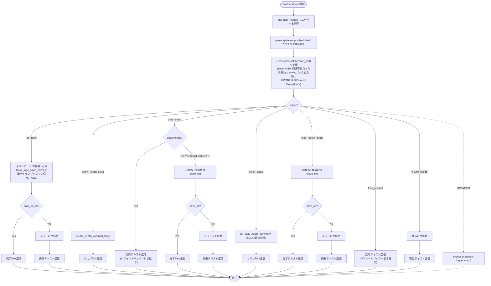
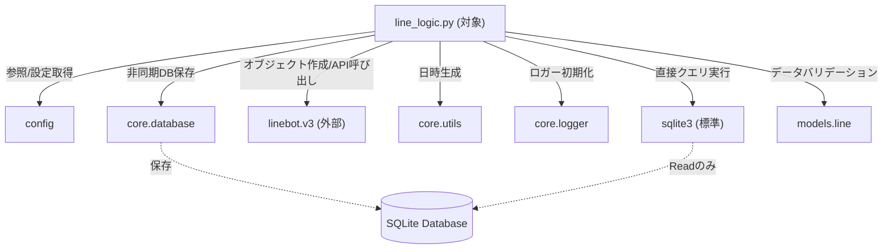

## 1. 解析メタ情報

| 項目 | 内容 |
| --- | --- |
| 対象ファイル | `line_logic.py` |
| 言語 | Python |
| 解析対象 | 提供されたコードのみ |
| 推測・補完 | 一切なし |

## 関連ドキュメント

* [line_handler.md](./line_handler.md) - 呼び出し元(`handle_postback`が承認/却下以外のPostbackを本ファイルの`handle_postback`に委譲)
* [line.md](./line.md) - 型定義を提供(`LinePostbackData`)
* [config.md](./config.md) - `FAMILY_SETTINGS`, `SQLITE_DB_PATH`等の設定値を提供
* [database.md](./database.md) - `save_log_async`/`save_logs_batch_async`(Issue #231で追加)の実体を提供

## 2. ファイルの概要

* LINE Messaging APIを利用し、Webhookの **PostbackEvent（ボタン操作）専用**の処理ロジックを提供するファイル。
* 子供の体調記録（一括/個別）、記録サマリ確認、食事アンケート回答などのボタン操作を解析し、SQLiteデータベースへの非同期保存処理を呼び出す。
* LINEプラットフォームへ返すテキスト、QuickReply、FlexMessageなどのUIコンポーネントを生成・送信するヘルパー関数群も提供する。
* 2026年のリファクタリング（コミット `1ecbe3b`）により、`handle_message`、`ask_outing_question`、`handle_child_record`、`handle_stomach_record` および `USER_INPUT_STATE` ステートマシンは削除された。これらは本番のLINE Webhook経路（`handlers/line_handler.py`）から一切呼び出されない到達不能コードだったため。テキストメッセージの自由文処理は現在 `handlers/line_handler.py` の `_process_message_async()` → `services/ai_service.py` に一本化されている。
* コミット `8525dc2`（H-7修正）により、`all_genki`・`child_check`・`food_record_direct`の3記録フローは`sync_run(save_log_async(...))`(または`all_genki`は後述の`save_logs_batch_async`)の戻り値（保存成否のbool）を検査するようになった。保存に失敗した場合は成功メッセージを返さず「⚠️ 記録に失敗しました。もう一度お試しください。」を返信しエラーログを出力する。これに伴い`sync_run`自体も、内部で例外が発生した場合に暗黙の`None`ではなく明示的に`False`を返すよう変更された。**（Issue #231で修正）** `all_genki`は以前、`TARGET_MEMBERS`分の`save_log_async`をそれぞれ独立に呼びリスト内包表記で結果を`all()`判定していたため、各呼び出しが個別にcommitされ、一部だけ失敗しても既に成功していた分がコミット済みのまま残った。案内どおりユーザーが再試行すると成功済み分まで重複INSERTされていた。現在は`save_logs_batch_async`(単一トランザクションで全件保存)を1回呼び出す方式に変更し、1件でも失敗すれば全件ロールバックされる真のall-or-nothingにしている。
* 根拠: `if not save_all_ok:\n                logger.error(...)\n                send_reply_text(..., "⚠️ 記録に失敗しました。もう一度お試しください。")` (行番号: 240-242 / 抜粋: "if not save_all_ok:"), `except Exception as e:\n        logger.error(f"Sync execution error: {e}")\n        return False` (行番号: 48-50 / 抜粋: "return False")
* 根拠: [ファイル全体の構成] (行番号: 1-408 / 抜粋: "def handle_postback(event: PostbackEvent, line_bot_api: MessagingApi):")

## 3. 外部依存関係

### インポート一覧

| 名称 | 種類 | 用途 | 根拠 |
| --- | --- | --- | --- |
| `config` | 外部モジュール | 設定値や定数（メンバー、DBパス等）の参照 | `import config` (行番号: 2 / 抜粋: "import config") |
| `asyncio` | 標準ライブラリ | 非同期関数の同期実行ヘルパーの作成 | `import asyncio` (行番号: 3 / 抜粋: "import asyncio") |
| `sqlite3` | 標準ライブラリ | データベースへの直接接続・クエリ実行 | `import sqlite3` (行番号: 4 / 抜粋: "import sqlite3") |
| `datetime` | 標準ライブラリ | 日時のフォーマット処理 | `import datetime` (行番号: 5 / 抜粋: "import datetime") |
| `parse_qsl` | 標準ライブラリ (`urllib.parse`) | Postbackデータのパース | `from urllib.parse import parse_qsl` (行番号: 6 / 抜粋: "from urllib.parse import parse_qsl") |
| `MessagingApi`, `ReplyMessageRequest`, `TextMessage`, `FlexMessage`, `FlexContainer`, `QuickReply` | 外部ライブラリ (`linebot.v3.messaging`) | LINE APIのクライアント・メッセージモデル。`QuickReply`は`send_reply_text`の引数型ヒントで使用（**保守性 #410で修正**: 以前ここに含まれていた`QuickReplyItem`/`MessageAction`は、未使用だった`create_quick_reply`関数の削除に伴い未使用インポートとなったため削除した。旧版の本テーブルが記載していた`json`インポート・`PushMessageRequest`/`PostbackAction`の未使用インポートは、確認したところ現行ファイルには存在せず誤りだった） | `from linebot.v3.messaging import (` (行番号: 9-15 / 抜粋: "from linebot.v3.messaging import (") |
| `PostbackEvent` | 外部ライブラリ (`linebot.v3.webhooks`) | LINE Webhookイベントの型定義 | `from linebot.v3.webhooks import PostbackEvent` (行番号: 16 / 抜粋: "from linebot.v3.webhooks import PostbackEvent") |
| `setup_logging` | 外部モジュール (`core.logger`) | ロガーの初期化 | `from core.logger import setup_logging` (行番号: 22 / 抜粋: "from core.logger import setup_logging") |
| `get_now_iso` / `get_today_date_str` / `get_display_date`（Issue #410で追加） | 外部モジュール (`core.utils`) | 現在日時の取得。`get_display_date`は`check_status`の日付表示（JST基準`"%m/%d"`）に、naiveな`datetime.datetime.now()`の代わりに使う | `from core.utils import get_now_iso, get_today_date_str, get_display_date` (行番号: 25 / 抜粋: "from core.utils import get_now_iso, get_today_date_str, get_display_date") |
| `save_log_async` / `save_logs_batch_async`（Issue #231で追加） | 外部モジュール (`core.database`) | ログの非同期DB保存(単発/複数行を単一トランザクションで一括保存) | `from core.database import save_log_async, save_logs_batch_async` (行番号: 26 / 抜粋: "from core.database import save_log_async, save_logs_batch_async") |
| `LinePostbackData` | 外部モジュール (`models.line`) | Postbackデータパース用モデル | `from models.line import LinePostbackData` (行番号: 27 / 抜粋: "from models.line import LinePostbackData") |

### ブラックボックスとなる外部要素

| 名称 | 理由 | 根拠 |
| --- | --- | --- |
| `config` | 定義内容（`FAMILY_SETTINGS`, `SQLITE_DB_PATH`, `SQLITE_TABLE_CHILD`, `SQLITE_TABLE_FOOD`など）の実装がないため | `TARGET_MEMBERS = config.FAMILY_SETTINGS["members"]` (行番号: 35 / 抜粋: "TARGET_MEMBERS = config.FAMILY_SETTINGS["members"]") |
| `core.database.save_log_async` / `save_logs_batch_async` | 引数仕様やDB接続の実装詳細が不明なため([database.md](./database.md)に別途解析結果あり) | `sync_run(save_logs_batch_async(` (行番号: 210 / 抜粋: "sync_run(save_logs_batch_async(") |
| `models.line.LinePostbackData` | 本ファイルからは`action: str`（必須）が唯一の必須フィールドで他は`Optional`であること、`extra`未設定（既定で未知フィールドを無視）であることまでは確認できるが、それ以外の詳細な検証ルールは不明 | `pb = LinePostbackData(**raw_dict)` (行番号: 193 / 抜粋: "pb = LinePostbackData(**raw_dict)") |

## 4. 主要要素の定義（関数 / エンドポイント / コンポーネント）

### 変数 `TARGET_MEMBERS`

* **役割**: 設定ファイルから取得した家族メンバーのリスト。
* 根拠: `TARGET_MEMBERS = config.FAMILY_SETTINGS["members"]` (行番号: 35 / 抜粋: "TARGET_MEMBERS = config.FAMILY_SETTINGS["members"]")

### 関数 `sync_run`

* **役割**: 非同期コルーチンをイベントループを作成して同期的に実行する。呼び出し元（`all_genki`/`child_check`/`food_record_direct`の各記録フロー）が保存成否を判定できるよう、戻り値はコルーチンの戻り値をそのまま返し、実行時に例外が発生した場合は`False`を返す。
* 根拠: `def sync_run(coro):` (行番号: 39-50 / 抜粋: "def sync_run(coro):"), `戻り値はコルーチンの戻り値。実行時に例外が発生した場合はFalseを返す。` (行番号: 44 / 抜粋: "戻り値はコルーチンの戻り値。実行時に例外が発生した場合はFalseを返す。")

* **引数/リクエスト**: `coro` (コルーチンオブジェクト)
* 根拠: `def sync_run(coro):` (行番号: 39 / 抜粋: "def sync_run(coro):")

* **戻り値/レスポンス**: `asyncio.run(coro)`の実行結果（型定義なし。`save_log_async`呼び出し時は`bool`）。例外発生時は明示的に`False`。
* 根拠: `return asyncio.run(coro)` (行番号: 47 / 抜粋: "return asyncio.run(coro)"), `except Exception as e:\n        logger.error(f"Sync execution error: {e}")\n        return False` (行番号: 48-50 / 抜粋: "return False")

* **副作用**: 新規イベントループの生成と実行。
* 根拠: `return asyncio.run(coro)` (行番号: 47 / 抜粋: "return asyncio.run(coro)")

* **エラーハンドリング**: 例外発生時はロガーにてエラー出力し、`False`を返す（呼び出し元の`all()`/`not`チェックで保存失敗として扱われる）。
* 根拠: `except Exception as e: logger.error(...); return False` (行番号: 48-50 / 抜粋: "return False")

### 関数 `send_reply_text`

* **役割**: LINE Messaging APIを呼び出してテキストメッセージを返信する。
* 根拠: `def send_reply_text(api: MessagingApi, reply_token: str, text: str, quick_reply: QuickReply = None):` (行番号: 52-64 / 抜粋: "def send_reply_text(api: MessagingApi, reply_token: str, text: str, quick_reply: QuickReply = None):")

* **引数/リクエスト**: `api` (MessagingApi), `reply_token` (str), `text` (str), `quick_reply` (QuickReply, デフォルトNone)
* 根拠: 引数定義 (行番号: 52 / 抜粋: "def send_reply_text(api: MessagingApi, reply_token: str, text: str, quick_reply: QuickReply = None):")

* **戻り値/レスポンス**: なし (None)
* 根拠: return文なし (行番号: 52-64 / 抜粋: "api.reply_message(")

* **副作用**: 外部API (LINE API) へのネットワークリクエスト実行。
* 根拠: `api.reply_message(` (行番号: 57 / 抜粋: "api.reply_message(")

* **エラーハンドリング**: APIリクエスト失敗時に例外をキャッチしログ出力する。
* 根拠: `except Exception as e: logger.error(...)` (行番号: 63-64 / 抜粋: "except Exception as e:")

### 関数 `get_user_name`

* **役割**: イベント情報に基づいて、グループメンバーまたはユーザー自身の表示名を取得する。
* 根拠: `def get_user_name(event, line_bot_api: MessagingApi) -> str:` (行番号: 66-79 / 抜粋: "def get_user_name(event, line_bot_api: MessagingApi) -> str:")

* **引数/リクエスト**: `event` (Webhookイベント), `line_bot_api` (MessagingApi)
* 根拠: 引数定義 (行番号: 66 / 抜粋: "def get_user_name(event, line_bot_api: MessagingApi) -> str:")

* **戻り値/レスポンス**: `str` (表示名 または "家族のみんな")
* 根拠: `return profile.display_name` / `return "家族のみんな"` (行番号: 73, 76, 79 / 抜粋: "return "家族のみんな"")

* **副作用**: 外部API (LINE API) へのプロファイル取得リクエスト。
* 根拠: `profile = line_bot_api.get_group_member_profile(...)` / `profile = line_bot_api.get_profile(user_id)` (行番号: 72, 75 / 抜粋: "profile = line_bot_api.get_profile(user_id)")

* **エラーハンドリング**: 取得失敗時は例外を握り潰し（`pass`）、デフォルト値を返す。
* 根拠: `except Exception: pass` (行番号: 77-78 / 抜粋: "except Exception:")

### [削除済み] 関数 `create_quick_reply` / `get_quota_text`（Issue #410で削除）

* 保守性(#410): `create_quick_reply`（ラベル/テキストのリストから`QuickReply`を生成）と`get_quota_text`（LINE APIから当月のメッセージ送信使用量を取得しテキスト化）はいずれもファイル内外を問わず呼び出し箇所が無い未使用関数だった（grep incl. tests で確認。両者を参照するテストも存在しなかった）ため削除した。付随して、`create_quick_reply`でのみ使用されていた`linebot.v3.messaging`の`QuickReplyItem`/`MessageAction`インポートも未使用となり削除した（`QuickReply`自体は`send_reply_text`の引数型ヒントで使用中のため残存）。`get_quota_text`内にあったbareの`except:`（保守性#410の対象の1つだった）も、関数ごと削除により解消した。
* 根拠: 削除前のコミット履歴(本仕様書の旧版)、および現行`handlers/line_logic.py`に両関数が存在しないこと

### 関数 `create_health_carousel_flex`

* **役割**: `TARGET_MEMBERS`ごとに体調入力用のFlexMessageカルーセルを作成する。
* 根拠: `def create_health_carousel_flex():` (行番号: 79-125 / 抜粋: "def create_health_carousel_flex():")

* **引数/リクエスト**: なし
* 根拠: 引数定義 (行番号: 79 / 抜粋: "def create_health_carousel_flex():")

* **戻り値/レスポンス**: `FlexContainer` オブジェクト
* 根拠: `return FlexContainer.from_dict({"type": "carousel", "contents": bubbles})` (行番号: 125 / 抜粋: "return FlexContainer.from_dict({"type": "carousel", "contents": bubbles})")

* **副作用**: なし
* 根拠: [関数本体] (行番号: 79-125 / 抜粋: 副作用を伴う処理なし)

* **エラーハンドリング**: なし
* 根拠: [関数本体] (行番号: 79-125 / 抜粋: "try-exceptなし")

### 関数 `get_daily_health_summary`

* **役割**: SQLiteデータベースに直接接続し、対象メンバーの今日の最新の体調記録を取得して文字列のサマリを作成する。
* 根拠: `def get_daily_health_summary():` (行番号: 127-163 / 抜粋: "def get_daily_health_summary():")

* **引数/リクエスト**: なし
* 根拠: 引数定義 (行番号: 127 / 抜粋: "def get_daily_health_summary():")

* **戻り値/レスポンス**: `str` (改行区切りのサマリテキスト または エラーメッセージ)
* 根拠: `return "\n".join(summary_lines)` / `return "（データ取得エラー）"` (行番号: 163, 160 / 抜粋: "return "\n".join(summary_lines)")

* **副作用**: ローカルDB (`config.SQLITE_DB_PATH`) に対するSELECTクエリの発行。
* **（#411 S-L8で修正）** 接続は以前 `with sqlite3.connect(...) as conn:` で開いていたが、sqlite3の`Connection.__exit__`はcommit/rollbackのみを行い接続自体はcloseしない既知の挙動のため、LINE Botへのリクエストのたびに接続がcloseされずリークしていた。`contextlib.closing`で明示的にcloseするよう変更した。
* 根拠: `with contextlib.closing(sqlite3.connect(config.SQLITE_DB_PATH)) as conn:` (行番号: 138)
* 根拠: `with sqlite3.connect(config.SQLITE_DB_PATH) as conn:` / `cur.execute(f"...")` (行番号: 133, 139-143 / 抜粋: "with sqlite3.connect(config.SQLITE_DB_PATH) as conn:")

* **エラーハンドリング**:
* DB接続・読み込み全体のエラーをキャッチしてログ出力し、「（データ取得エラー）」を返す。
* タイムスタンプのパース失敗時は時刻を `??:??` にフォールバックする。**（保守性 #410で修正）** タイムスタンプパース失敗時のbareの`except:`を`except Exception:`へ変更した(挙動は変わらない)。
* 根拠: `except Exception: time_str = "??:??"` / `except Exception as e: logger.error(...)` (行番号: 150-151, 156-158 / 抜粋: "except Exception:")

### 関数 `handle_postback`

* **役割**: ボタン押下などのPostbackEventを受信し、設定された `action` ごとに適切な記録（全件元気、子別記録、食事アンケート等）やUI表示を行う。`InputMode`/`UserInputState`ベースの手入力継続状態はもはや設定しない（コミット `1ecbe3b` で該当ロジックを撤去済み）。「その他（手入力）」系の分岐（`child_check`の`status=other`、`food_manual`）では状態を設定する代わりに案内テキストのみ返信し、続く自由文メッセージは `handlers/line_handler.py` のAIフォールバック(`services/ai_service.py`)経由で処理される前提になっている。コミット`8525dc2`（H-7修正）以降、`all_genki`・`child_check`（`target_name`ありの保存分岐）・`food_record_direct`の3フローは、DB保存結果（bool）を検査してから応答を分岐する。保存成功時のみ従来通りの完了メッセージ（Flex/テキスト）を返し、失敗時は「⚠️ 記録に失敗しました。もう一度お試しください。」を返信してエラーログを出力する。**（Issue #231で修正）** `all_genki`は以前、`TARGET_MEMBERS`分の`save_log_async`をそれぞれ独立に呼び出しリスト内包表記で結果を`all()`判定していたため、各呼び出しが個別にcommitされ、1件でも失敗すると「全体を失敗扱い」として案内する一方で既に成功していた分はコミット済みのまま残っていた。ユーザーが案内どおり再試行すると、成功済み分まで再度INSERTされ重複行が生じる不具合があった。現在は`save_logs_batch_async`(単一トランザクションで全件保存し1件でも失敗すれば全件ロールバックする)を1回呼び出すことで、真にall-or-nothingにし再試行を安全にしている。**（保守性 #410で修正）** `check_status`の記録確認画面の日付表示(`today_disp`)を、naiveな`datetime.datetime.now()`（サーバーのローカルタイムゾーン依存）から`core.utils.get_display_date()`（JST基準・`"%m/%d"`形式）へ変更した。また、`LinePostbackData(**raw_dict)`のバリデーション失敗時に`action`のみで再構築するtry/exceptフォールバックを削除した——`LinePostbackData`は`action`必須以外は全て`Optional`で`extra`設定も既定(未知フィールドは無視)のため、`raw_dict`に`action`キーが含まれる限り例外は送出されず、このフォールバックは到達不能だった。削除後、万一`action`キーが無い等でモデル構築が失敗しても、関数末尾の`except Exception`で握り潰される（挙動は実質変わらない: 到達不能だった旧フォールバックが動いていた場合の出力と、削除後に末尾の汎用ハンドラで捕捉された場合とで、ユーザーへの応答が「不明な操作」相当になる点は同じ）。
* 根拠: `def handle_postback(event: PostbackEvent, line_bot_api: MessagingApi):` (行番号: 167-390 / 抜粋: "def handle_postback(event: PostbackEvent, line_bot_api: MessagingApi):")
* 根拠: `if not save_all_ok:` (行番号: 210-216 / 抜粋: "save_all_ok = sync_run(save_logs_batch_async(" / "if not save_all_ok:")、`pb = LinePostbackData(**raw_dict)` (行番号: 186-193)、`today_disp = get_display_date()` (行番号: 311)

* **引数/リクエスト**: `event` (PostbackEvent), `line_bot_api` (MessagingApi)
* 根拠: 引数定義 (行番号: 167 / 抜粋: "def handle_postback(event: PostbackEvent, line_bot_api: MessagingApi):")

* **戻り値/レスポンス**: なし
* 根拠: [関数本体] (行番号: 167-390 / 抜粋: "return"文は存在しない)

* **副作用**:
* `save_log_async`/`save_logs_batch_async`（Issue #231以降、`all_genki`は`save_logs_batch_async`）を用いたDBへの書き込み処理（`sync_run`で同期化）。保存結果は`all_genki`では`save_logs_batch_async`の単一の戻り値を`save_all_ok`として判定、`child_check`/`food_record_direct`では単一の戻り値を`save_ok`として判定する。
* LINE APIを通じたリプライ送信（テキスト・FlexMessage）。保存失敗時は`send_reply_text`で失敗テキストのみ返信し、成功時のみ従来のFlexMessage/テキストを送信する。
* 根拠: `sync_run(save_logs_batch_async(` (行番号: 210-213 / 抜粋: "save_all_ok = sync_run(save_logs_batch_async(") / `line_bot_api.reply_message(` (行番号: 239-244)

* **エラーハンドリング**:
* **（保守性 #410で削除）** PostbackデータのPydanticモデル変換失敗時のフォールバック処理は到達不能だったため削除した（上記「役割」参照）。
* 未定義の`action`はFail-Safe分岐でユーザーに警告テキストを返信する。
* `all_genki`/`child_check`/`food_record_direct`はDB保存結果が偽の場合、成功メッセージを送らずエラーログ出力＋失敗テキスト返信を行う。
* 全体の処理エラーをキャッチしログ出力する。
* 根拠: `else: logger.warning(...)` / `except Exception as e: logger.error(...)` (行番号: 379-388, 389-390 / 抜粋: "logger.warning(f\"Unknown action received:")
* 根拠: `logger.error(f"all_genki の記録保存に失敗しました (user_id={user_id})")` (行番号: 216 / 抜粋: "の記録保存に失敗しました")

## 5. 処理フロー図

```mermaid
flowchart TD
    Start([PostbackEvent受信]) --> GetUser["get_user_name() でユーザー名取得"]
    GetUser --> ParseQS["parse_qsl(event.postback.data) でクエリ文字列解析"]
    ParseQS --> ModelParse["LinePostbackData(**raw_dict)へ変換<br>(Issue #410: 到達不能だった失敗時フォールバックは削除。<br>失敗時は末尾のexcept Exceptionへ)"]
    ModelParse --> ActionCheck{"action?"}

    ActionCheck -->|"all_genki"| PB_AllGenki["全メンバー分DB保存: 元気<br>(save_logs_batch_asyncで単一トランザクション保存、#231)"] --> PB_AllGenkiCheck{"save_all_ok?"}
    PB_AllGenkiCheck -->|No| PB_AllGenkiFail["エラーログ出力"] --> PB_Reply1b["失敗テキスト送信"]
    PB_AllGenkiCheck -->|Yes| PB_Reply1["完了Flex送信"]
    ActionCheck -->|"show_health_input"| PB_Show["create_health_carousel_flex()"] --> PB_Reply2["入力パネル送信"]
    ActionCheck -->|"child_check"| StatusCheck{"status=other?"}
    StatusCheck -->|Yes| PB_Prompt["案内テキスト送信<br>(AIフォールバックへ引き継ぎ)"]
    StatusCheck -->|No かつ target_nameあり| PB_ChildLog["DB保存: 個別状態 (save_ok)"] --> PB_ChildCheck{"save_ok?"}
    PB_ChildCheck -->|No| PB_ChildFail["エラーログ出力"] --> PB_Reply4b["失敗テキスト送信"]
    PB_ChildCheck -->|Yes| PB_Reply4["完了Flex送信"]
    ActionCheck -->|"check_status"| PB_Summary["get_daily_health_summary()<br>(SQLite直接参照)"] --> PB_Reply5["サマリFlex送信"]
    ActionCheck -->|"food_record_direct"| PB_FoodDirect["DB保存: 食事記録 (save_ok)"] --> PB_FoodCheck{"save_ok?"}
    PB_FoodCheck -->|No| PB_FoodFail["エラーログ出力"] --> PB_Reply6b["失敗テキスト送信"]
    PB_FoodCheck -->|Yes| PB_Reply6a["完了テキスト送信"]
    ActionCheck -->|"food_manual"| PB_FoodManual["案内テキスト送信<br>(AIフォールバックへ引き継ぎ)"]
    ActionCheck -->|"その他(未定義)"| PB_Fallback["警告ログ出力"] --> PB_Reply7["警告テキスト送信"]

    PB_Reply1 --> End([終了])
    PB_Reply1b --> End
    PB_Reply2 --> End
    PB_Prompt --> End
    PB_Reply4 --> End
    PB_Reply4b --> End
    PB_Reply5 --> End
    PB_Reply6a --> End
    PB_Reply6b --> End
    PB_FoodManual --> End
    PB_Reply7 --> End

    ActionCheck -.->|"例外発生時"| ExHandler["except Exception: logger.error()"] -.-> End

```

## 6. 依存関係図

```mermaid
graph TD
    %% Files / Modules
    line_logic["line_logic.py (対象)"]
    config["config"]
    sqlite3["sqlite3 (標準)"]
    linebot_sdk["linebot.v3 (外部)"]
    core_utils["core.utils"]
    core_logger["core.logger"]
    core_database["core.database"]
    models_line["models.line"]

    %% Dependencies
    line_logic -->|参照/設定取得| config
    line_logic -->|直接クエリ実行| sqlite3
    line_logic -->|オブジェクト作成/API呼び出し| linebot_sdk
    line_logic -->|日時生成| core_utils
    line_logic -->|ロガー初期化| core_logger
    line_logic -->|非同期DB保存| core_database
    line_logic -->|データバリデーション| models_line

    %% DB Storage logic
    core_database -.->|保存| SQLite_DB[(SQLite Database)]
    sqlite3 -.->|Readのみ| SQLite_DB

```

## 7. 次のステップ（リバースエンジニアリングの提案）

| 優先度 | ファイル名(推測可) | 理由 | 根拠 |
| --- | --- | --- | --- |
| 高 | `config.py` | `TARGET_MEMBERS`, `FAMILY_SETTINGS`, `SQLITE_DB_PATH`, `SQLITE_TABLE_CHILD`, `SQLITE_TABLE_FOOD` など、ロジック内で多用される定数やDB設定の実態を把握する必要があるため。 | `config.FAMILY_SETTINGS["members"]` 等 (行番号: 35) |
| 中 | `core/database.py` | `save_log_async`/`save_logs_batch_async` 関数の非同期DB保存のトランザクション管理やエラーハンドリング詳細の確認が必要なため（[database.md](./database.md)に解析結果あり）。 | `save_log_async(...)` / `save_logs_batch_async(...)` (行番号: 32, 234) |
| 中 | `handlers/line_handler.py` | 自由文メッセージ（AIフォールバック）が本ファイルの案内テキスト送信後にどう処理へ接続されるかを確認するため。 | `_process_message_async()` への一本化に関する記述 (概要セクション参照) |
| 低 | `models/line.py` | `LinePostbackData` のバリデーションルールが、Postback処理の挙動にどう影響しているかを理解するため。 | `from models.line import LinePostbackData` (行番号: 33) |

## 8. 保守上の注意点

* **2026年のリファクタリング**: `handle_message`、`ask_outing_question`、`handle_child_record`、`handle_stomach_record` および `USER_INPUT_STATE` ステートマシン（`models/line.py` の `InputMode`/`UserInputState` を含む）はコミット `1ecbe3b` で削除された。これらは本番のLINE Webhook経路（`handlers/line_handler.py`）から一切呼び出されない到達不能コードだったため。現在このファイルに残るのは `handle_postback()`（ボタン操作のディスパッチ）と、それが使うUI生成ヘルパー群のみ。
* `get_daily_health_summary` にて、他箇所で利用されている `core.database` (非同期アクセス) ではなく、`sqlite3` モジュールを利用した同期的かつ直接的なDB接続が行われている。
* `get_user_name` において、`except Exception:` で例外の握り潰し（`pass`）が行われており、通信エラー時の追跡が困難になる可能性がある。
* **[修正済み] Issue #410 保守性**: Postbackデータパース時、`LinePostbackData` の変換に失敗した場合に未定義パラメータのみを取得するフォールバック処理があったが、`LinePostbackData`は`action`必須以外は`Optional`かつ`extra`未設定（既定で未知フィールドは無視）のため、`raw_dict`に`action`キーが含まれる限り実際にはバリデーションエラーが送出されず到達不能なコードだった。削除し、`pb = LinePostbackData(**raw_dict)`を直接呼ぶよう単純化した（万一の失敗は`handle_postback`末尾の`except Exception`が捕捉する）。
* **[修正済み] Issue #410 保守性 未使用の関数・インポート**: `create_quick_reply`、`get_quota_text` はファイル内・他ファイルのいずれからも呼び出し箇所が無いデッドコードだったため削除した（`get_quota_text`内にあったbareの`except:`も関数ごと解消）。付随して未使用となった`linebot.v3.messaging`の`QuickReplyItem`/`MessageAction`インポートも削除した。
* **保存失敗チェックの実装が箇所ごとにやや不統一**: `all_genki`は`save_logs_batch_async`(単一トランザクションでの一括保存、Issue #231で導入)の単一の戻り値を`save_all_ok`として判定するのに対し、`child_check`/`food_record_direct`は単一行の`save_log_async`の戻り値を`save_ok`変数で判定する。3フローともロジック自体は`sync_run(...)`の直後にチェックする形で個別に実装されており、共通ヘルパー化はされていない。**（Issue #231で修正）** 以前の`all_genki`はリスト内包表記で全員分の`save_log_async`の結果を集め`all()`で判定していたが、これは「1件でも失敗すれば全体を失敗扱いとする」という判定自体は正しくても、各`save_log_async`呼び出しが独立にcommitされるため、失敗扱いにした後も既に成功した分がDBに残ってしまう不整合があった。判定ロジックの統一自体は本Issueのスコープ外で未解消のまま残っている。
* 根拠: `save_results = [\n                sync_run(save_log_async(\n ...\n                for name in TARGET_MEMBERS\n            ]\n\n            if not all(save_results):` (行番号: 228-237 / 抜粋: "if not all(save_results):")

## 9. 不明事項一覧

| 項目 | 理由 | 必要なファイル |
| --- | --- | --- |
| データベースのスキーマ構造 | 各テーブル（`CHILD`, `FOOD`）の正確なカラム制約が本ファイル単体では不明なため。 | `config.py` または DB初期化スクリプト |
| 設定値の構造と中身 | `FAMILY_SETTINGS["styles"]` の内容が不明なため。 | `config.py` |
| Postbackモデルのプロパティ | `LinePostbackData` の必須/任意フィールド（`child`, `status` の存在等）が不明なため。 | `models/line.py` |

## 相互参照による補足情報

| 元の不明事項 | 判明した内容 | 参照元ドキュメント |
| --- | --- | --- |
| データベースのスキーマ構造 | `config.py`と`init_unified_db.py`/`current_schema.sql`を直接確認した。`config.SQLITE_TABLE_CHILD`(実体は`"child_health_records"`、`config.py`245行目)は`init_unified_db.py`244〜252行目より`id INTEGER PRIMARY KEY AUTOINCREMENT, user_id TEXT, user_name TEXT, child_name TEXT, condition TEXT, timestamp DATETIME NOT NULL`の6カラム構成、`config.SQLITE_TABLE_FOOD`(`"food_records"`、`config.py`242行目)は194〜203行目より`id INTEGER PRIMARY KEY AUTOINCREMENT, user_id TEXT, user_name TEXT, meal_date TEXT, meal_time_category TEXT, menu_category TEXT, timestamp DATETIME`の7カラム構成であることを確認した。`current_schema.sql`48〜54行目・94〜99行目も同趣旨のカラム構成であることを確認した（`food_records`側は過去のカラム`date`/`menu`/`created_at`が残存する等、若干の差異はある）。 | 直接ソース確認: `MY_HOME_SYSTEM/config.py:242,245`, `MY_HOME_SYSTEM/init_unified_db.py:193-203,242-252`, `MY_HOME_SYSTEM/current_schema.sql:48-54,94-99` |
| 設定値の構造と中身 | `MY_HOME_SYSTEM/config.py`469〜477行目を直接確認した。`FAMILY_SETTINGS["styles"]`は`{"智矢": {"color": "#1E90FF", "age": None, "icon": "👦"}, "涼花": {...}, "将博": {...}, "春菜": {...}}`という、実名4名をキーとし`color`(カラーコード文字列)・`age`(初期値`None`、479〜488行目のロジックで`family_members.local.json`が存在すれば上書きされる)・`icon`(絵文字)を値に持つ辞書構造であることを確認した。 | 直接ソース確認: `MY_HOME_SYSTEM/config.py:469-488` |
| Postbackモデルのプロパティ | `MY_HOME_SYSTEM/models/line.py`23〜30行目を直接確認した。`LinePostbackData`は`action: str`(必須)、`child: Optional[str] = None`、`status: Optional[str] = None`、`value: Optional[str] = None`(いずれも任意、デフォルト`None`)の4フィールドを持つPydanticモデルであることを確認した。`extra`の設定（未知フィールドの扱い）は明示されておらずpydanticの既定（無視）に従うため、`raw_dict`に定義外のキーが含まれてもバリデーションエラーにはならないことを確認した（Issue #410で判明: これにより`handlers/line_logic.py`の旧`except Exception: pb = LinePostbackData(action=...)`フォールバックは`action`キーが存在する限り到達不能だった）。 | 直接ソース確認: `MY_HOME_SYSTEM/models/line.py:23-30` |

## 10. 自己検証結果

* [x] 推測・外部ファイルの仕様を一切含んでいない
* [x] 全関数・全クラス・全コンポーネントを列挙した
* [x] 全てのインポート要素を列挙した
* [x] すべての仕様説明に「根拠（行番号・抜粋）」を明記した
* [x] 根拠漏れが0件である
* [x] Mermaid構文にエラーの原因となる記号（エスケープ漏れ）がない
* [x] 不明事項を漏れなく列挙した

完了
