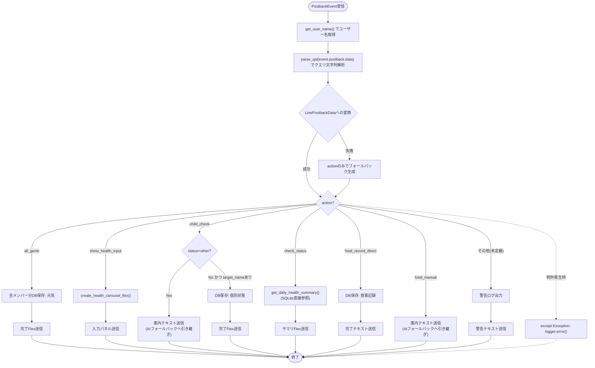
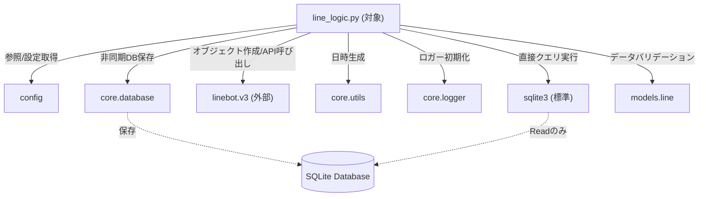

## 1. 解析メタ情報

| 項目 | 内容 |
| --- | --- |
| 対象ファイル | `line_logic.py` |
| 言語 | Python |
| 解析対象 | 提供されたコードのみ |
| 推測・補完 | 一切なし |

## 関連ドキュメント

* [line_handler.md](./line_handler.md) - 呼び出し元(`handle_postback`が承認/却下以外のPostbackを本ファイルの`handle_postback`に委譲)
* [line.md](./line.md) - 型定義を提供(`LinePostbackData`)
* [config.md](./config.md) - `FAMILY_SETTINGS`, `SQLITE_DB_PATH`等の設定値を提供
* [database.md](./database.md) - `save_log_async`の実体を提供

## 2. ファイルの概要

* LINE Messaging APIを利用し、Webhookの **PostbackEvent（ボタン操作）専用**の処理ロジックを提供するファイル。
* 子供の体調記録（一括/個別）、記録サマリ確認、食事アンケート回答などのボタン操作を解析し、SQLiteデータベースへの非同期保存処理を呼び出す。
* LINEプラットフォームへ返すテキスト、QuickReply、FlexMessageなどのUIコンポーネントを生成・送信するヘルパー関数群も提供する。
* 2026年のリファクタリング（コミット `1ecbe3b`）により、`handle_message`、`ask_outing_question`、`handle_child_record`、`handle_stomach_record` および `USER_INPUT_STATE` ステートマシンは削除された。これらは本番のLINE Webhook経路（`handlers/line_handler.py`）から一切呼び出されない到達不能コードだったため。テキストメッセージの自由文処理は現在 `handlers/line_handler.py` の `_process_message_async()` → `services/ai_service.py` に一本化されている。
* 根拠: [ファイル全体の構成] (行番号: 1-392 / 抜粋: "def handle_postback(event: PostbackEvent, line_bot_api: MessagingApi):")

## 3. 外部依存関係

### インポート一覧

| 名称 | 種類 | 用途 | 根拠 |
| --- | --- | --- | --- |
| `config` | 外部モジュール | 設定値や定数（メンバー、DBパス等）の参照 | `import config` (行番号: 2 / 抜粋: "import config") |
| `asyncio` | 標準ライブラリ | 非同期関数の同期実行ヘルパーの作成 | `import asyncio` (行番号: 3 / 抜粋: "import asyncio") |
| `json` | 標準ライブラリ | インポートされているが未使用 | `import json` (行番号: 4 / 抜粋: "import json") |
| `sqlite3` | 標準ライブラリ | データベースへの直接接続・クエリ実行 | `import sqlite3` (行番号: 5 / 抜粋: "import sqlite3") |
| `datetime` | 標準ライブラリ | 日時のフォーマット処理 | `import datetime` (行番号: 6 / 抜粋: "import datetime") |
| `parse_qsl` | 標準ライブラリ (`urllib.parse`) | Postbackデータのパース | `from urllib.parse import parse_qsl` (行番号: 7 / 抜粋: "from urllib.parse import parse_qsl") |
| `MessagingApi`, `ReplyMessageRequest`, `TextMessage`, `FlexMessage`, `FlexContainer`, `QuickReply`, `QuickReplyItem`, `MessageAction` | 外部ライブラリ (`linebot.v3.messaging`) | LINE APIのクライアント・メッセージモデル | `from linebot.v3.messaging import (` (行番号: 10-21 / 抜粋: "from linebot.v3.messaging import (") |
| `PushMessageRequest`, `PostbackAction` | 外部ライブラリ (`linebot.v3.messaging`) | インポートされているが未使用 | 同上 (行番号: 13, 20 / 抜粋: "PushMessageRequest,") |
| `PostbackEvent` | 外部ライブラリ (`linebot.v3.webhooks`) | LINE Webhookイベントの型定義 | `from linebot.v3.webhooks import PostbackEvent` (行番号: 22 / 抜粋: "from linebot.v3.webhooks import PostbackEvent") |
| `setup_logging` | 外部モジュール (`core.logger`) | ロガーの初期化 | `from core.logger import setup_logging` (行番号: 28 / 抜粋: "from core.logger import setup_logging") |
| `get_now_iso` / `get_today_date_str` | 外部モジュール (`core.utils`) | 現在日時の取得 | `from core.utils import get_now_iso, get_today_date_str` (行番号: 31 / 抜粋: "from core.utils import get_now_iso, get_today_date_str") |
| `save_log_async` | 外部モジュール (`core.database`) | ログの非同期DB保存 | `from core.database import save_log_async` (行番号: 32 / 抜粋: "from core.database import save_log_async") |
| `LinePostbackData` | 外部モジュール (`models.line`) | Postbackデータパース用モデル | `from models.line import LinePostbackData` (行番号: 33 / 抜粋: "from models.line import LinePostbackData") |

### ブラックボックスとなる外部要素

| 名称 | 理由 | 根拠 |
| --- | --- | --- |
| `config` | 定義内容（`FAMILY_SETTINGS`, `SQLITE_DB_PATH`, `SQLITE_TABLE_CHILD`, `SQLITE_TABLE_FOOD`など）の実装がないため | `TARGET_MEMBERS = config.FAMILY_SETTINGS["members"]` (行番号: 35 / 抜粋: "TARGET_MEMBERS = config.FAMILY_SETTINGS["members"]") |
| `core.database.save_log_async` | 引数仕様やDB接続の実装詳細が不明なため | `sync_run(save_log_async(` (行番号: 227 / 抜粋: "sync_run(save_log_async(") |
| `models.line.LinePostbackData` | モデルのプロパティ定義やバリデーションルールが不明なため | `pb = LinePostbackData(**raw_dict)` (行番号: 212 / 抜粋: "pb = LinePostbackData(**raw_dict)") |

## 4. 主要要素の定義（関数 / エンドポイント / コンポーネント）

### 変数 `TARGET_MEMBERS`

* **役割**: 設定ファイルから取得した家族メンバーのリスト。
* 根拠: `TARGET_MEMBERS = config.FAMILY_SETTINGS["members"]` (行番号: 35 / 抜粋: "TARGET_MEMBERS = config.FAMILY_SETTINGS["members"]")

### 関数 `sync_run`

* **役割**: 非同期コルーチンをイベントループを作成して同期的に実行する。
* 根拠: `def sync_run(coro):` (行番号: 39-48 / 抜粋: "def sync_run(coro):")

* **引数/リクエスト**: `coro` (コルーチンオブジェクト)
* 根拠: `def sync_run(coro):` (行番号: 39 / 抜粋: "def sync_run(coro):")

* **戻り値/レスポンス**: 実行結果（型定義なし）。例外発生時は暗黙の`None`。
* 根拠: `return asyncio.run(coro)` (行番号: 46 / 抜粋: "return asyncio.run(coro)")

* **副作用**: 新規イベントループの生成と実行。
* 根拠: `return asyncio.run(coro)` (行番号: 46 / 抜粋: "return asyncio.run(coro)")

* **エラーハンドリング**: 例外発生時はロガーにてエラー出力し、`None`を返す。
* 根拠: `except Exception as e: logger.error(...)` (行番号: 47-48 / 抜粋: "except Exception as e:")

### 関数 `send_reply_text`

* **役割**: LINE Messaging APIを呼び出してテキストメッセージを返信する。
* 根拠: `def send_reply_text(api: MessagingApi, reply_token: str, text: str, quick_reply: QuickReply = None):` (行番号: 50-62 / 抜粋: "def send_reply_text(api: MessagingApi, reply_token: str, text: str, quick_reply: QuickReply = None):")

* **引数/リクエスト**: `api` (MessagingApi), `reply_token` (str), `text` (str), `quick_reply` (QuickReply, デフォルトNone)
* 根拠: 引数定義 (行番号: 50 / 抜粋: "def send_reply_text(api: MessagingApi, reply_token: str, text: str, quick_reply: QuickReply = None):")

* **戻り値/レスポンス**: なし (None)
* 根拠: return文なし (行番号: 50-62 / 抜粋: "api.reply_message(")

* **副作用**: 外部API (LINE API) へのネットワークリクエスト実行。
* 根拠: `api.reply_message(` (行番号: 55 / 抜粋: "api.reply_message(")

* **エラーハンドリング**: APIリクエスト失敗時に例外をキャッチしログ出力する。
* 根拠: `except Exception as e: logger.error(...)` (行番号: 61-62 / 抜粋: "except Exception as e:")

### 関数 `get_user_name`

* **役割**: イベント情報に基づいて、グループメンバーまたはユーザー自身の表示名を取得する。
* 根拠: `def get_user_name(event, line_bot_api: MessagingApi) -> str:` (行番号: 64-77 / 抜粋: "def get_user_name(event, line_bot_api: MessagingApi) -> str:")

* **引数/リクエスト**: `event` (Webhookイベント), `line_bot_api` (MessagingApi)
* 根拠: 引数定義 (行番号: 64 / 抜粋: "def get_user_name(event, line_bot_api: MessagingApi) -> str:")

* **戻り値/レスポンス**: `str` (表示名 または "家族のみんな")
* 根拠: `return profile.display_name` / `return "家族のみんな"` (行番号: 71, 74, 77 / 抜粋: "return "家族のみんな"")

* **副作用**: 外部API (LINE API) へのプロファイル取得リクエスト。
* 根拠: `profile = line_bot_api.get_group_member_profile(...)` / `profile = line_bot_api.get_profile(user_id)` (行番号: 70, 73 / 抜粋: "profile = line_bot_api.get_profile(user_id)")

* **エラーハンドリング**: 取得失敗時は例外を握り潰し（`pass`）、デフォルト値を返す。
* 根拠: `except Exception: pass` (行番号: 75-76 / 抜粋: "except Exception:")

### 関数 `create_quick_reply`

* **役割**: ラベルとテキストのリストから `QuickReply` オブジェクトを生成する。ファイル内には呼び出し箇所が存在しない（未使用）。
* 根拠: `def create_quick_reply(items_data: list) -> QuickReply:` (行番号: 79-88 / 抜粋: "def create_quick_reply(items_data: list) -> QuickReply:")

* **引数/リクエスト**: `items_data` (list)
* 根拠: 引数定義 (行番号: 79 / 抜粋: "def create_quick_reply(items_data: list) -> QuickReply:")

* **戻り値/レスポンス**: `QuickReply` オブジェクト
* 根拠: `return QuickReply(items=items)` (行番号: 88 / 抜粋: "return QuickReply(items=items)")

* **副作用**: なし
* 根拠: [関数本体] (行番号: 79-88 / 抜粋: 副作用を伴う処理なし)

* **エラーハンドリング**: なし
* 根拠: [関数本体] (行番号: 79-88 / 抜粋: "try-exceptなし")

### 関数 `get_quota_text`

* **役割**: LINE APIを使用して当月のメッセージ送信使用量を取得し、テキストフォーマットで返す。ファイル内には呼び出し箇所が存在しない（未使用）。
* 根拠: `def get_quota_text(api: MessagingApi):` (行番号: 90-100 / 抜粋: "def get_quota_text(api: MessagingApi):")

* **引数/リクエスト**: `api` (MessagingApi)
* 根拠: 引数定義 (行番号: 90 / 抜粋: "def get_quota_text(api: MessagingApi):")

* **戻り値/レスポンス**: `str` (メッセージ送信数テキスト または 空文字)
* 根拠: `return f"\n(当月送信数: {quota.total_usage}通)"` / `return ""` (行番号: 97, 100 / 抜粋: "return f"\n(当月送信数: {quota.total_usage}通)"")

* **副作用**: 外部API (LINE API) への割当量取得リクエスト。
* 根拠: `quota = api.get_message_quota()` (行番号: 93 / 抜粋: "quota = api.get_message_quota()")

* **エラーハンドリング**: 例外発生時は握り潰して空文字を返す。
* 根拠: `except: pass` (行番号: 98-99 / 抜粋: "except:")

### 関数 `create_health_carousel_flex`

* **役割**: `TARGET_MEMBERS`ごとに体調入力用のFlexMessageカルーセルを作成する。
* 根拠: `def create_health_carousel_flex():` (行番号: 104-150 / 抜粋: "def create_health_carousel_flex():")

* **引数/リクエスト**: なし
* 根拠: 引数定義 (行番号: 104 / 抜粋: "def create_health_carousel_flex():")

* **戻り値/レスポンス**: `FlexContainer` オブジェクト
* 根拠: `return FlexContainer.from_dict({"type": "carousel", "contents": bubbles})` (行番号: 150 / 抜粋: "return FlexContainer.from_dict({"type": "carousel", "contents": bubbles})")

* **副作用**: なし
* 根拠: [関数本体] (行番号: 104-150 / 抜粋: 副作用を伴う処理なし)

* **エラーハンドリング**: なし
* 根拠: [関数本体] (行番号: 104-150 / 抜粋: "try-exceptなし")

### 関数 `get_daily_health_summary`

* **役割**: SQLiteデータベースに直接接続し、対象メンバーの今日の最新の体調記録を取得して文字列のサマリを作成する。
* 根拠: `def get_daily_health_summary():` (行番号: 152-187 / 抜粋: "def get_daily_health_summary():")

* **引数/リクエスト**: なし
* 根拠: 引数定義 (行番号: 152 / 抜粋: "def get_daily_health_summary():")

* **戻り値/レスポンス**: `str` (改行区切りのサマリテキスト または エラーメッセージ)
* 根拠: `return "\n".join(summary_lines)` / `return "（データ取得エラー）"` (行番号: 185, 187 / 抜粋: "return "\n".join(summary_lines)")

* **副作用**: ローカルDB (`config.SQLITE_DB_PATH`) に対するSELECTクエリの発行。
* 根拠: `with sqlite3.connect(config.SQLITE_DB_PATH) as conn:` / `cur.execute(f"...")` (行番号: 159, 165-169 / 抜粋: "with sqlite3.connect(config.SQLITE_DB_PATH) as conn:")

* **エラーハンドリング**:
* DB接続・読み込み全体のエラーをキャッチしてログ出力し、「（データ取得エラー）」を返す。
* タイムスタンプのパース失敗時は時刻を `??:??` にフォールバックする。
* 根拠: `except: time_str = "??:??"` / `except Exception as e: logger.error(...)` (行番号: 176-177, 183-185 / 抜粋: "except:")

### 関数 `handle_postback`

* **役割**: ボタン押下などのPostbackEventを受信し、設定された `action` ごとに適切な記録（全件元気、子別記録、食事アンケート等）やUI表示を行う。`InputMode`/`UserInputState`ベースの手入力継続状態はもはや設定しない（コミット `1ecbe3b` で該当ロジックを撤去済み）。「その他（手入力）」系の分岐（`child_check`の`status=other`、`food_manual`）では状態を設定する代わりに案内テキストのみ返信し、続く自由文メッセージは `handlers/line_handler.py` のAIフォールバック(`services/ai_service.py`)経由で処理される前提になっている。
* 根拠: `def handle_postback(event: PostbackEvent, line_bot_api: MessagingApi):` (行番号: 192-392 / 抜粋: "def handle_postback(event: PostbackEvent, line_bot_api: MessagingApi):")

* **引数/リクエスト**: `event` (PostbackEvent), `line_bot_api` (MessagingApi)
* 根拠: 引数定義 (行番号: 192 / 抜粋: "def handle_postback(event: PostbackEvent, line_bot_api: MessagingApi):")

* **戻り値/レスポンス**: なし
* 根拠: [関数本体] (行番号: 192-392 / 抜粋: "return"文は存在しない)

* **副作用**:
* `save_log_async` を用いたDBへの書き込み処理（`sync_run`で同期化）。
* LINE APIを通じたリプライ送信（テキスト・FlexMessage）。
* 根拠: `sync_run(save_log_async(` / `line_bot_api.reply_message(` (行番号: 227-231, 255-260 / 抜粋: "sync_run(save_log_async(")

* **エラーハンドリング**:
* PostbackデータのPydanticモデル変換失敗時にフォールバック処理を実行する。
* 未定義の`action`はFail-Safe分岐でユーザーに警告テキストを返信する。
* 全体の処理エラーをキャッチしログ出力する。
* 根拠: `except Exception: pb = LinePostbackData(...)` / `else: logger.warning(...)` / `except Exception as e: logger.error(...)` (行番号: 211-215, 381-389, 391-392 / 抜粋: "except Exception:")

## 5. 処理フロー図

```mermaid
flowchart TD
    Start([PostbackEvent受信]) --> GetUser["get_user_name() でユーザー名取得"]
    GetUser --> ParseQS["parse_qsl(event.postback.data) でクエリ文字列解析"]
    ParseQS --> ModelParse{"LinePostbackDataへの変換"}
    ModelParse -- 成功 --> ActionCheck{"action?"}
    ModelParse -- 失敗 --> Fallback["actionのみでフォールバック生成"] --> ActionCheck

    ActionCheck -->|"all_genki"| PB_AllGenki["全メンバー分DB保存: 元気"] --> PB_Reply1["完了Flex送信"]
    ActionCheck -->|"show_health_input"| PB_Show["create_health_carousel_flex()"] --> PB_Reply2["入力パネル送信"]
    ActionCheck -->|"child_check"| StatusCheck{"status=other?"}
    StatusCheck -->|Yes| PB_Prompt["案内テキスト送信<br>(AIフォールバックへ引き継ぎ)"]
    StatusCheck -->|No かつ target_nameあり| PB_ChildLog["DB保存: 個別状態"] --> PB_Reply4["完了Flex送信"]
    ActionCheck -->|"check_status"| PB_Summary["get_daily_health_summary()<br>(SQLite直接参照)"] --> PB_Reply5["サマリFlex送信"]
    ActionCheck -->|"food_record_direct"| PB_FoodDirect["DB保存: 食事記録"] --> PB_Reply6a["完了テキスト送信"]
    ActionCheck -->|"food_manual"| PB_FoodManual["案内テキスト送信<br>(AIフォールバックへ引き継ぎ)"]
    ActionCheck -->|"その他(未定義)"| PB_Fallback["警告ログ出力"] --> PB_Reply7["警告テキスト送信"]

    PB_Reply1 --> End([終了])
    PB_Reply2 --> End
    PB_Prompt --> End
    PB_Reply4 --> End
    PB_Reply5 --> End
    PB_Reply6a --> End
    PB_FoodManual --> End
    PB_Reply7 --> End

    ActionCheck -.->|"例外発生時"| ExHandler["except Exception: logger.error()"] -.-> End

```

## 6. 依存関係図

```mermaid
graph TD
    %% Files / Modules
    line_logic["line_logic.py (対象)"]
    config["config"]
    sqlite3["sqlite3 (標準)"]
    linebot_sdk["linebot.v3 (外部)"]
    core_utils["core.utils"]
    core_logger["core.logger"]
    core_database["core.database"]
    models_line["models.line"]

    %% Dependencies
    line_logic -->|参照/設定取得| config
    line_logic -->|直接クエリ実行| sqlite3
    line_logic -->|オブジェクト作成/API呼び出し| linebot_sdk
    line_logic -->|日時生成| core_utils
    line_logic -->|ロガー初期化| core_logger
    line_logic -->|非同期DB保存| core_database
    line_logic -->|データバリデーション| models_line

    %% DB Storage logic
    core_database -.->|保存| SQLite_DB[(SQLite Database)]
    sqlite3 -.->|Readのみ| SQLite_DB

```

## 7. 次のステップ（リバースエンジニアリングの提案）

| 優先度 | ファイル名(推測可) | 理由 | 根拠 |
| --- | --- | --- | --- |
| 高 | `config.py` | `TARGET_MEMBERS`, `FAMILY_SETTINGS`, `SQLITE_DB_PATH`, `SQLITE_TABLE_CHILD`, `SQLITE_TABLE_FOOD` など、ロジック内で多用される定数やDB設定の実態を把握する必要があるため。 | `config.FAMILY_SETTINGS["members"]` 等 (行番号: 35) |
| 中 | `core/database.py` | `save_log_async` 関数の非同期DB保存のトランザクション管理やエラーハンドリング詳細の確認が必要なため。 | `save_log_async(...)` (行番号: 32, 227) |
| 中 | `handlers/line_handler.py` | 自由文メッセージ（AIフォールバック）が本ファイルの案内テキスト送信後にどう処理へ接続されるかを確認するため。 | `_process_message_async()` への一本化に関する記述 (概要セクション参照) |
| 低 | `models/line.py` | `LinePostbackData` のバリデーションルールが、Postback処理の挙動にどう影響しているかを理解するため。 | `from models.line import LinePostbackData` (行番号: 33) |

## 8. 保守上の注意点

* **2026年のリファクタリング**: `handle_message`、`ask_outing_question`、`handle_child_record`、`handle_stomach_record` および `USER_INPUT_STATE` ステートマシン（`models/line.py` の `InputMode`/`UserInputState` を含む）はコミット `1ecbe3b` で削除された。これらは本番のLINE Webhook経路（`handlers/line_handler.py`）から一切呼び出されない到達不能コードだったため。現在このファイルに残るのは `handle_postback()`（ボタン操作のディスパッチ）と、それが使うUI生成ヘルパー群のみ。
* `get_daily_health_summary` にて、他箇所で利用されている `core.database` (非同期アクセス) ではなく、`sqlite3` モジュールを利用した同期的かつ直接的なDB接続が行われている。
* `get_user_name` や `get_quota_text` において、`except Exception:` で例外の握り潰し（`pass` または 空文字返却）が行われており、通信エラー時の追跡が困難になる可能性がある。
* Postbackデータパース時、`LinePostbackData` の変換に失敗した場合に、未定義パラメータのみを取得するフォールバック処理を行っている。
* **未使用の関数・インポート**: `create_quick_reply`、`get_quota_text` はファイル内・他ファイルのいずれからも呼び出し箇所がなく、現状デッドコードになっている。同様に `json` (標準ライブラリ)、`PushMessageRequest`、`PostbackAction` (`linebot.v3.messaging`) もインポートされているが未使用。

## 9. 不明事項一覧

| 項目 | 理由 | 必要なファイル |
| --- | --- | --- |
| データベースのスキーマ構造 | 各テーブル（`CHILD`, `FOOD`）の正確なカラム制約が本ファイル単体では不明なため。 | `config.py` または DB初期化スクリプト |
| 設定値の構造と中身 | `FAMILY_SETTINGS["styles"]` の内容が不明なため。 | `config.py` |
| Postbackモデルのプロパティ | `LinePostbackData` の必須/任意フィールド（`child`, `status` の存在等）が不明なため。 | `models/line.py` |
| `create_quick_reply` / `get_quota_text` の本来の呼び出し元 | 現在ファイル内・他ファイルのいずれからも呼び出されていないが、削除されずに残っている理由（将来の再利用予定か、削除漏れか）は本ファイル単体では判断できないため。 | 過去のコミット履歴、または開発者への確認 |

## 相互参照による補足情報

| 元の不明事項 | 判明した内容 | 参照元ドキュメント |
| --- | --- | --- |
| データベースのスキーマ構造 | `config.py`と`init_unified_db.py`/`current_schema.sql`を直接確認した。`config.SQLITE_TABLE_CHILD`(実体は`"child_health_records"`、`config.py`245行目)は`init_unified_db.py`244〜252行目より`id INTEGER PRIMARY KEY AUTOINCREMENT, user_id TEXT, user_name TEXT, child_name TEXT, condition TEXT, timestamp DATETIME NOT NULL`の6カラム構成、`config.SQLITE_TABLE_FOOD`(`"food_records"`、`config.py`242行目)は194〜203行目より`id INTEGER PRIMARY KEY AUTOINCREMENT, user_id TEXT, user_name TEXT, meal_date TEXT, meal_time_category TEXT, menu_category TEXT, timestamp DATETIME`の7カラム構成であることを確認した。`current_schema.sql`48〜54行目・94〜99行目も同趣旨のカラム構成であることを確認した（`food_records`側は過去のカラム`date`/`menu`/`created_at`が残存する等、若干の差異はある）。 | 直接ソース確認: `MY_HOME_SYSTEM/config.py:242,245`, `MY_HOME_SYSTEM/init_unified_db.py:193-203,242-252`, `MY_HOME_SYSTEM/current_schema.sql:48-54,94-99` |
| 設定値の構造と中身 | `MY_HOME_SYSTEM/config.py`469〜477行目を直接確認した。`FAMILY_SETTINGS["styles"]`は`{"智矢": {"color": "#1E90FF", "age": None, "icon": "👦"}, "涼花": {...}, "将博": {...}, "春菜": {...}}`という、実名4名をキーとし`color`(カラーコード文字列)・`age`(初期値`None`、479〜488行目のロジックで`family_members.local.json`が存在すれば上書きされる)・`icon`(絵文字)を値に持つ辞書構造であることを確認した。 | 直接ソース確認: `MY_HOME_SYSTEM/config.py:469-488` |
| Postbackモデルのプロパティ | `MY_HOME_SYSTEM/models/line.py`23〜30行目を直接確認した。`LinePostbackData`は`action: str`(必須)、`child: Optional[str] = None`、`status: Optional[str] = None`、`value: Optional[str] = None`(いずれも任意、デフォルト`None`)の4フィールドを持つPydanticモデルであることを確認した。 | 直接ソース確認: `MY_HOME_SYSTEM/models/line.py:23-30` |
| `create_quick_reply` / `get_quota_text` の本来の呼び出し元 | `MY_HOME_SYSTEM/handlers/line_logic.py`本体および`MY_HOME_SYSTEM/handlers/line_handler.py`をリポジトリ全体で`grep`した結果、両関数(79行目`create_quick_reply`、90行目`get_quota_text`)は定義箇所以外どこからも呼び出されていないことを直接確認した。また`git log -S`で両関数の追加・変更履歴を辿ったところ、いずれもリポジトリの最初のコミット（コミットメッセージ「一旦コミットします」）時点から存在し、`line_logic.py`から`handle_message`等の到達不能コードを削除した後続のクリーンアップコミット(`1ecbe3b`, コミットメッセージ「fix: LINE会話ロジックの到達不能デッドコードを削除し、未使用関数を整理」)でもこの2関数は変更対象に含まれていないことを確認した。ただし、これが「将来の再利用予定」なのか「削除漏れ」なのかというコミットメッセージ上の明示的な意図はいずれのコミットにも記載されておらず、根本的な理由は依然として確認できなかった。 | 直接ソース確認: リポジトリ全体`grep`（`MY_HOME_SYSTEM/handlers/line_logic.py:79,90`）、`git log -S`によるコミット履歴確認（コミット`1ecbe3b`, 初回コミット） |

## 10. 自己検証結果

* [x] 推測・外部ファイルの仕様を一切含んでいない
* [x] 全関数・全クラス・全コンポーネントを列挙した
* [x] 全てのインポート要素を列挙した
* [x] すべての仕様説明に「根拠（行番号・抜粋）」を明記した
* [x] 根拠漏れが0件である
* [x] Mermaid構文にエラーの原因となる記号（エスケープ漏れ）がない
* [x] 不明事項を漏れなく列挙した

完了
