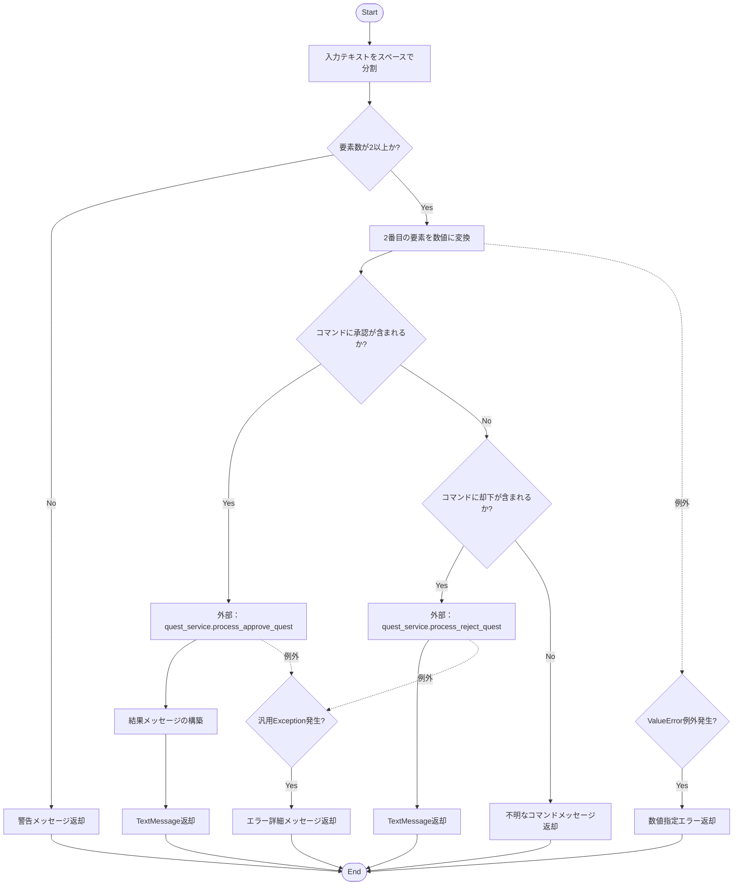

## 1. 解析メタ情報

| 項目 | 内容 |
| --- | --- |
| 対象ファイル | `line_service.py` |
| 言語 | Python |
| 解析対象 | 提供されたコードのみ |
| 推測・補完 | 一切なし |

## 2. ファイルの概要

このファイルは、システムにおいてLINEメッセージからの情報を記録および取得し、LINE Messaging APIのメッセージモデル（`TextMessage`など）を生成して返す責務を持つ。日常の健康・食事・行動ログの記録と、ゲーム化されたクエストのステータス照会、受注可能クエストの表示、およびクエストの承認・却下処理を担当している。

## 3. 外部依存関係

### インポート一覧

| 名称 | 種類 | 用途 | 根拠 |
| --- | --- | --- | --- |
| `sqlite3` | 標準ライブラリ | データベース操作 | `import sqlite3` (行番号: 2 / 抜粋: "import sqlite3") |
| `datetime` | 標準ライブラリ | 日付時刻処理 | `import datetime` (行番号: 3 / 抜粋: "import datetime") |
| `asyncio` | 標準ライブラリ | 非同期処理の実行 | `import asyncio` (行番号: 4 / 抜粋: "import asyncio") |
| `typing` | 標準ライブラリ | 型ヒントの提供 | `from typing import List...` (行番号: 5 / 抜粋: "from typing import List, Tupl...") |
| `linebot.v3.messaging` | 外部ライブラリ | LINEメッセージモデルの構築 | `from linebot.v3.messaging...` (行番号: 8-14 / 抜粋: "from linebot.v3.messaging imp...") |
| `config` | 外部モジュール | 設定値や定数の取得 | `import config` (行番号: 16 / 抜粋: "import config") |
| `common` | 外部モジュール | DBカーソルの取得等 | `import common` (行番号: 17 / 抜粋: "import common") |
| `core.logger` | 外部モジュール | ロガーの設定 | `from core.logger import...` (行番号: 18 / 抜粋: "from core.logger import setup...") |
| `core.utils` | 外部モジュール | 時刻や日付文字列の取得 | `from core.utils import...` (行番号: 19 / 抜粋: "from core.utils import get_no...") |
| `core.database` | 外部モジュール | 非同期でのログ保存 | `from core.database import...` (行番号: 20 / 抜粋: "from core.database import sav...") |
| `services.quest_service` | 外部モジュール | ゲームやクエスト情報の処理 | `from services.quest_service...` (行番号: 23 / 抜粋: "from services.quest_service i...") |

### ブラックボックスとなる外部要素

| 名称 | 理由 | 根拠 |
| --- | --- | --- |
| `config`内の定数 | `FAMILY_SETTINGS`, `SQLITE_TABLE_CHILD`, `SQLITE_TABLE_FOOD`の具体的な値や構造が不明。 | `TARGET_MEMBERS = config.FAMIL...` (行番号: 28 / 抜粋: "TARGET_MEMBERS = config.FAMIL...") |
| `common.get_db_cursor` | トランザクション管理やDB接続の詳細な仕組みが不明。 | `with common.get_db_cursor() a...` (行番号: 70 / 抜粋: "with common.get_db_cursor() a...") |
| `core.database.save_log_async` | 非同期DB書き込みの実装詳細や対象スキーマ構造が不明。 | `await save_log_async(...)` (行番号: 36 / 抜粋: "await save_log_async(") |
| `game_system.get_all_view_data` | 返却されるデータの正確な辞書構造（キーの存在保証など）が不明。 | `data = await asyncio.to_threa...` (行番号: 100 / 抜粋: "data = await asyncio.to_threa...") |
| `quest_service.process_approve_quest` / `process_reject_quest` | 承認・却下に伴う具体的なステータス変更の内部ロジックや返却値の詳細構造が不明。 | `res = await asyncio.to_thread...` (行番号: 160 / 抜粋: "res = await asyncio.to_thread...") |

## 4. 主要要素の定義（関数 / エンドポイント / コンポーネント）

### `log_child_health`

* **役割**: 子供の体調をDBに記録し、記録完了の`TextMessage`を返す。
* 根拠: `async def log_child_health...` (行番号: 34-40 / 抜粋: "def log_child_health(user_id:")

* **引数/リクエスト**: `user_id` (str), `user_name` (str), `child_name` (str), `condition` (str)
* 根拠: 関数の引数定義 (行番号: 34 / 抜粋: "user_id: str, user_name: str,")

* **戻り値/レスポンス**: `TextMessage`
* 根拠: 戻り値の型ヒント (行番号: 34 / 抜粋: "-> TextMessage:")

* **副作用**: 外部関数(`save_log_async`)によるDB書き込み。
* 根拠: `await save_log_async...` (行番号: 36 / 抜粋: "await save_log_async(")

* **エラーハンドリング**: なし
* 根拠: 該当ブロック内に例外処理(`try-except`)なし (行番号: 34-40 / 抜粋: "該当ブロック内に例外処理なし")

### `log_food_record`

* **役割**: 食事内容をDBに記録し、記録完了の`TextMessage`を返す。
* 根拠: `async def log_food_record...` (行番号: 42-49 / 抜粋: "def log_food_record(user_id:")

* **引数/リクエスト**: `user_id` (str), `user_name` (str), `category` (str), `item` (str), `is_manual` (bool, デフォルト `False`)
* 根拠: 関数の引数定義 (行番号: 42 / 抜粋: "category: str, item: str, is_")

* **戻り値/レスポンス**: `TextMessage`
* 根拠: 戻り値の型ヒント (行番号: 42 / 抜粋: "-> TextMessage:")

* **副作用**: 外部関数(`save_log_async`)によるDB書き込み。
* 根拠: `await save_log_async...` (行番号: 45 / 抜粋: "await save_log_async(")

* **エラーハンドリング**: なし
* 根拠: 該当ブロック内に例外処理なし (行番号: 42-49 / 抜粋: "該当ブロック内に例外処理なし")

### `log_daily_action`

* **役割**: ユーザーの日常動作（外出・面会など）をログ出力する（返信は行わない）。
* 根拠: `async def log_daily_action...` (行番号: 51-54 / 抜粋: "def log_daily_action(user_id:")

* **引数/リクエスト**: `user_id` (str), `user_name` (str), `action_type` (str), `value` (str)
* 根拠: 関数の引数定義 (行番号: 51 / 抜粋: "action_type: str, value: str)")

* **戻り値/レスポンス**: `None`
* 根拠: 戻り値の型ヒント (行番号: 51 / 抜粋: "-> None:")

* **副作用**: ロガーによる情報出力。
* 根拠: `logger.info...` (行番号: 53 / 抜粋: "logger.info(f"Daily Action: ")

* **エラーハンドリング**: なし
* 根拠: 該当ブロック内に例外処理なし (行番号: 51-54 / 抜粋: "該当ブロック内に例外処理なし")

### `log_ohayo`

* **役割**: おはようメッセージと認識されたキーワードをDBに記録する。
* 根拠: `async def log_ohayo...` (行番号: 56-62 / 抜粋: "def log_ohayo(user_id: str, u")

* **引数/リクエスト**: `user_id` (str), `user_name` (str), `message` (str), `keyword` (str)
* 根拠: 関数の引数定義 (行番号: 56 / 抜粋: "message: str, keyword: str)")

* **戻り値/レスポンス**: `None`
* 根拠: 戻り値の型ヒント (行番号: 56 / 抜粋: "-> None:")

* **副作用**: 外部関数(`save_log_async`)によるDB書き込み。
* 根拠: `await save_log_async...` (行番号: 58 / 抜粋: "await save_log_async(")

* **エラーハンドリング**: なし
* 根拠: 該当ブロック内に例外処理なし (行番号: 56-62 / 抜粋: "該当ブロック内に例外処理なし")

### `get_daily_health_summary_text`

* **役割**: 設定された全メンバーの今日の体調記録の最新をDBから取得し、サマリの文字列として結合して返す。
* 根拠: `def get_daily_health_summary...` (行番号: 64-96 / 抜粋: "def get_daily_health_summary_")

* **引数/リクエスト**: なし
* 根拠: 関数の引数定義 (行番号: 64 / 抜粋: "def get_daily_health_summary_")

* **戻り値/レスポンス**: `str`
* 根拠: 戻り値の型ヒント (行番号: 64 / 抜粋: "-> str:")

* **副作用**: DBからの読み取り処理、およびDBコネクションの `row_factory` プロパティの変更。
* 根拠: `cur.connection.row_factory = sqlite3.Row` (行番号: 73 / 抜粋: "cur.connection.row_factory = ")

* **エラーハンドリング**: タイムスタンプのパース失敗時に時間を `??:??` とし、DB読み取り時の汎用エラー(`Exception`)をキャッチしてエラーメッセージ文字列を返す。
* 根拠: `except Exception as e:` (行番号: 84, 93 / 抜粋: "except Exception as e:")

### `get_user_status_message`

* **役割**: 外部のゲームシステムから全ユーザーデータを取得し、該当するユーザーのステータス情報を含む`TextMessage`を返す。
* 根拠: `async def get_user_status_me...` (行番号: 98-121 / 抜粋: "def get_user_status_message(u")

* **引数/リクエスト**: `user_id` (str)
* 根拠: 関数の引数定義 (行番号: 98 / 抜粋: "user_id: str")

* **戻り値/レスポンス**: `Union[TextMessage, FlexMessage]`
* 根拠: 戻り値の型ヒント (行番号: 98 / 抜粋: "-> Union[TextMessage, FlexMes")

* **副作用**: `asyncio.to_thread` を用いた外部関数(`game_system.get_all_view_data`)の同期呼び出し。
* 根拠: `await asyncio.to_thread...` (行番号: 101 / 抜粋: "await asyncio.to_thread(game_")

* **エラーハンドリング**: データ取得時等の汎用エラー(`Exception`)をキャッチし、エラーメッセージを返す。
* 根拠: `except Exception as e:` (行番号: 118 / 抜粋: "except Exception as e:")

### `get_active_quests_message`

* **役割**: 外部のゲームシステムからクエスト一覧を取得し、該当ユーザーが受注可能なクエストを抽出して`TextMessage`を返す。
* 根拠: `async def get_active_quests...` (行番号: 123-149 / 抜粋: "def get_active_quests_message")

* **引数/リクエスト**: `user_id` (str)
* 根拠: 関数の引数定義 (行番号: 123 / 抜粋: "user_id: str")

* **戻り値/レスポンス**: `Union[TextMessage, FlexMessage]`
* 根拠: 戻り値の型ヒント (行番号: 123 / 抜粋: "-> Union[TextMessage, FlexMes")

* **副作用**: `asyncio.to_thread` を用いた外部関数(`game_system.get_all_view_data`)の同期呼び出し。
* 根拠: `await asyncio.to_thread...` (行番号: 126 / 抜粋: "await asyncio.to_thread(game_")

* **エラーハンドリング**: データ取得時等の汎用エラー(`Exception`)をキャッチし、エラーメッセージを返す。
* 根拠: `except Exception as e:` (行番号: 146 / 抜粋: "except Exception as e:")

### `process_approval_command`

* **役割**: 入力テキストを解析し、クエストの承認または却下の処理を実行して結果の`TextMessage`を返す。
* 根拠: `async def process_approval_c...` (行番号: 151-186 / 抜粋: "def process_approval_command(")

* **引数/リクエスト**: `approver_id` (str), `text` (str)
* 根拠: 関数の引数定義 (行番号: 151 / 抜粋: "approver_id: str, text: str")

* **戻り値/レスポンス**: `TextMessage`
* 根拠: 戻り値の型ヒント (行番号: 151 / 抜粋: "-> TextMessage:")

* **副作用**: `asyncio.to_thread` を用いた外部関数(`quest_service.process_approve_quest` または `process_reject_quest`)の同期呼び出し。
* 根拠: `await asyncio.to_thread...` (行番号: 161, 172 / 抜粋: "await asyncio.to_thread(")

* **エラーハンドリング**: ID変換時の `ValueError` をキャッチし専用メッセージを返す。その他の `Exception` をキャッチし、例外に `detail` 属性があればそれを付与したエラーメッセージを返す。
* 根拠: `except ValueError:` および `except Exception as e:` (行番号: 177, 179 / 抜粋: "except ValueError:")

## 5. 処理フロー図

以下は `process_approval_command` のロジックを示すフローチャートです。

## 6. 依存関係図

ファイル内の要素と外部モジュールとの依存関係を示します。

```mermaid
graph TD
    subgraph "line_service.py"
        log_child_health
        log_food_record
        log_daily_action
        log_ohayo
        get_daily_health_summary_text
        get_user_status_message
        get_active_quests_message
        process_approval_command
    end

    subgraph "外部: coreモジュール"
        save_log_async
        setup_logging
        get_now_iso
        get_today_date_str
    end

    subgraph "外部: services.quest_service"
        game_system
        quest_service
    end

    subgraph "外部: その他"
        config
        common
        linebot_v3_messaging[linebot.v3.messaging]
    end

    log_child_health --> save_log_async
    log_child_health --> get_now_iso
    log_child_health --> linebot_v3_messaging

    log_food_record --> save_log_async
    log_food_record --> get_today_date_str
    log_food_record --> get_now_iso
    log_food_record --> linebot_v3_messaging

    log_daily_action --> setup_logging

    log_ohayo --> save_log_async
    log_ohayo --> get_now_iso

    get_daily_health_summary_text --> get_today_date_str
    get_daily_health_summary_text --> common
    get_daily_health_summary_text --> config

    get_user_status_message --> game_system
    get_user_status_message --> linebot_v3_messaging

    get_active_quests_message --> game_system
    get_active_quests_message --> linebot_v3_messaging

    process_approval_command --> quest_service
    process_approval_command --> linebot_v3_messaging

```

## 7. 次のステップ（リバースエンジニアリングの提案）

| 優先度 | ファイル名(推測可) | 理由 | 根拠 |
| --- | --- | --- | --- |
| 高 | `services/quest_service.py` | クエスト承認・却下時の具体的なステータス更新処理、およびユーザー情報のデータ構造を把握するため。 | `import game_system, quest_service` の呼び出しがあるため。 |
| 中 | `core/database.py` | ログを保存する `save_log_async` の詳細なトランザクション管理やDBスキーマを確認するため。 | `from core.database import save_log_async` の呼び出しがあるため。 |
| 中 | `common.py` | `get_db_cursor` の接続プーリングの有無やリソース管理の仕様を確認するため。 | `import common` および `common.get_db_cursor()` の呼び出しがあるため。 |
| 低 | `config.py` | 定数（家族メンバーの一覧やテーブル名）の定義構造を特定するため。 | `config.FAMILY_SETTINGS["members"]` の参照があるため。 |

## 8. 保守上の注意点

* `get_daily_health_summary_text` 内で `cur.connection.row_factory = sqlite3.Row` の設定を行っているが、`common.get_db_cursor` がコネクションプールを用いている場合、同じ接続を使い回す他の処理に副作用が波及する可能性がある。
* `process_approval_command` において、`hasattr(e, 'detail')` を用いて例外の詳細を取得しようとしているが、外部システム (`quest_service`) が投げる特定の例外構造に暗黙的に依存している。
* `game_system.get_all_view_data` や `quest_service.process_approve_quest` が同期関数である前提で `asyncio.to_thread` を用いて非同期実行しているが、これらの関数内部でのDB書き込みや排他制御がスレッドセーフに行われているかの確認が必要。
* 全体的に `except Exception as e:` による広範な例外キャッチが行われており、予期せぬシステムエラーが握りつぶされる構造になっている。

## 9. 不明事項一覧

| 項目 | 理由 | 必要なファイル |
| --- | --- | --- |
| `TARGET_MEMBERS` の具体的な要素数と型 | 外部の設定ファイルから読み込まれるため。 | `config.py` |
| DBの各テーブルの正確なスキーマ | 実行時に指定されるテーブルのカラム定義が本ファイル内に存在しないため。 | `core/database.py` またはマイグレーションファイル |
| `game_system.get_all_view_data()` の返却値のスキーマ | 返却される辞書のキー (`level`, `gold`, `quests` など) が存在するかどうかの保証が不明なため。 | `services/quest_service.py` |

## 10. 自己検証結果

* [x] 推測・外部ファイルの仕様を一切含んでいない
* [x] 全関数・全クラス・全コンポーネントを列挙した
* [x] 全てのインポート要素を列挙した
* [x] すべての仕様説明に「根拠（行番号・抜粋）」を明記した
* [x] 根拠漏れが0件である
* [x] Mermaid構文にエラーの原因となる記号（エスケープ漏れ）がない
* [x] 不明事項を漏れなく列挙した

完了