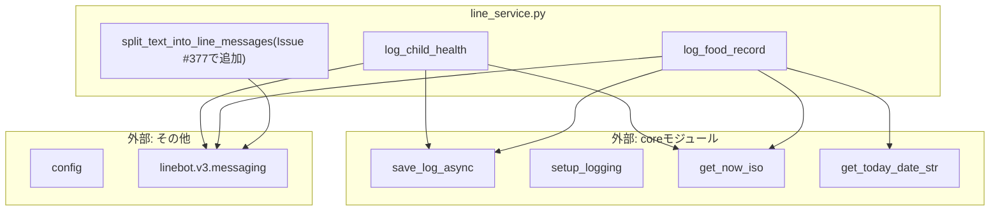

## 1. 解析メタ情報

| 項目 | 内容 |
| --- | --- |
| 対象ファイル | `line_service.py` |
| 言語 | Python |
| 解析対象 | 提供されたコードのみ |
| 推測・補完 | 一切なし |

## 関連ドキュメント

* [line_handler.md](./line_handler.md) - 呼び出し元(体調記録コマンドの委譲先・AI応答の文字数分割ヘルパーの提供元として本ファイルを呼び出す)
* [database.md](./database.md) - `save_log_async`の実体を提供
* [config.md](./config.md) - `FAMILY_SETTINGS`等の設定値を提供

## 2. ファイルの概要

このファイルは、システムにおいてLINEメッセージからの情報を記録し、LINE Messaging APIのメッセージモデル（`TextMessage`）を生成して返す責務を持つ。日常の健康・食事ログの記録と、LINEの5000字メッセージ制限に対応する長文分割ヘルパーを担当している。**（#358で撤去）** 以前このファイルにあった、ゲーム化されたクエストのステータス照会・受注可能クエストの表示・クエストの承認/却下処理(`get_user_status_message`/`get_active_quests_message`/`process_approval_command`)は、LINE の `event.source.user_id`（`U`+32hex）を Family Quest の `quest_users.user_id`（`dad`/`mom`/`son`/`daughter`）へマッピングする仕組みがリポジトリ内に存在せず、本番では常に失敗メッセージしか返さないデッドコードだったため、オーナー判断（LINE経由のクエスト機能は廃止）により削除された。クエストの確認・完了報告・承認は family-quest フロントエンドで行う。

## 3. 外部依存関係

### インポート一覧

| 名称 | 種類 | 用途 | 根拠 |
| --- | --- | --- | --- |
| `asyncio` | 標準ライブラリ | 非同期処理の実行 | `import asyncio` (行番号: 2 / 抜粋: "import asyncio") |
| `typing` | 標準ライブラリ | 型ヒントの提供。`Union`（元々使用）に加え`List`もIssue #377で`split_text_into_line_messages`の型ヒントに使用され始めた | `from typing import List, Union` (行番号: 3 / 抜粋: "from typing import List, Union") |
| `linebot.v3.messaging` | 外部ライブラリ | LINEメッセージモデルの構築。使用されているのは`TextMessage`のみ | `from linebot.v3.messaging import TextMessage` (行番号: 6 / 抜粋: "from linebot.v3.messaging import TextMessage") |
| `config` | 外部モジュール | 設定値や定数の取得 | `import config` (行番号: 8 / 抜粋: "import config") |
| `core.logger` | 外部モジュール | ロガーの設定 | `from core.logger import...` (行番号: 9 / 抜粋: "from core.logger import setup...") |
| `core.utils` | 外部モジュール | 時刻や日付文字列の取得 | `from core.utils import...` (行番号: 10 / 抜粋: "from core.utils import get_no...") |
| `core.database` | 外部モジュール | 非同期でのログ保存 | `from core.database import...` (行番号: 11 / 抜粋: "from core.database import sav...") |

**（Issue #410で削除）** 以前このテーブルにあった`sqlite3`（標準ライブラリ）・`datetime`（標準ライブラリ）・`common`（外部モジュール）・`linebot.v3.messaging`の`QuickReply`/`QuickReplyItem`/`MessageAction`（未使用インポートとして記載）・`typing`の`Tuple`/`Optional`/`Dict`/`Any`（未使用インポートとして記載、ただし実際には元々インポートされていなかった旧版の誤記）は、`log_daily_action`/`log_ohayo`/`get_daily_health_summary_text`の削除に伴い（`sqlite3`/`datetime`/`common`は）実際に未使用となったため削除、または（`QuickReply`系・`typing`系は）元々インポートされていなかった旧版の記載誤りだった。

**（#358で削除）** 以前このテーブルにあった`linebot.v3.messaging`の`FlexMessage`（型ヒントのみで使用）・`services.quest_service`の`game_system`/`quest_service`/`ROLE_CHILD`は、それらを参照していた`get_user_status_message`/`get_active_quests_message`/`process_approval_command`の削除に伴い未使用となったため削除した。

### ブラックボックスとなる外部要素

| 名称 | 理由 | 根拠 |
| --- | --- | --- |
| `config`内の定数 | `FAMILY_SETTINGS`, `SQLITE_TABLE_CHILD`, `SQLITE_TABLE_FOOD`の具体的な値や構造が不明。 | `TARGET_MEMBERS = config.FAMIL...` (行番号: 16 / 抜粋: "TARGET_MEMBERS = config.FAMIL...") |
| `core.database.save_log_async` | 非同期DB書き込みの実装詳細や対象スキーマ構造が不明。本ファイルは戻り値が真偽値（失敗時`False`、例外は送出しないFail-Soft）であることのみを前提とする（Issue #373）。 | `save_ok = await save_log_async(` (行番号: 64 / 抜粋: "save_ok = await save_log_async(") |

## 4. 主要要素の定義（関数 / エンドポイント / コンポーネント）

### `SAVE_FAILED_PREFIX` (変数、Issue #373で追加)

* **役割**: `log_child_health` / `log_food_record` がDB保存に失敗したときに返す`TextMessage`本文の共通プレフィックス `"⚠️ 記録に失敗しました"`。呼び出し元（`ai_service.tool_record_child_health` / `tool_record_food`）はこのプレフィックスで返信の成否を判別する。
* 根拠: `SAVE_FAILED_PREFIX = "⚠️ 記録に失敗しました"` (行番号: 29)

### `log_child_health`

* **役割**: 子供の体調をDBに記録し、記録完了の`TextMessage`を返す。**（Issue #373で修正）** `save_log_async`の戻り値（Fail-Softで`False`）を確認し、失敗時はエラーログを出力したうえで`SAVE_FAILED_PREFIX`で始まる失敗メッセージ（保存されていない旨と再試行の案内）を返す。以前は戻り値を無視して常に成功メッセージを組み立てていたため、DBロック超過・ディスクフル等で保存されていないのに「記録しました」と返す無言のデータ欠損が起きていた（`line_logic.py`側はH-7で修正済みだったが本関数は未修正だった）。
* 根拠: `async def log_child_health...` (行番号: 35-49 / 抜粋: "def log_child_health(user_id:")、`save_ok = await save_log_async(` (行番号: 41)、`if not save_ok:` (行番号: 46-48)

* **引数/リクエスト**: `user_id` (str), `user_name` (str), `child_name` (str), `condition` (str)
* 根拠: 関数の引数定義 (行番号: 35 / 抜粋: "user_id: str, user_name: str,")

* **戻り値/レスポンス**: `TextMessage`。成功時は`"【{child_name}】{condition} を記録しました！🏥"`、保存失敗時は`f"{SAVE_FAILED_PREFIX}。【{child_name}】{condition} は保存されていません。もう一度お試しください。"`。
* 根拠: 戻り値の型ヒント (行番号: 35 / 抜粋: "-> TextMessage:")、失敗時 (行番号: 48)、成功時 (行番号: 49)

* **副作用**: 外部関数(`save_log_async`)によるDB書き込み。保存失敗時は`logger.error`。
* 根拠: `save_ok = await save_log_async(` (行番号: 41)、`logger.error(f"log_child_health の記録保存に失敗しました ...")` (行番号: 47)

* **エラーハンドリング**: `try-except`は無いが、`save_log_async`の戻り値`False`を失敗として扱い失敗メッセージを返す（Issue #373）。
* 根拠: `if not save_ok:` (行番号: 46-48)

### `log_food_record`

* **役割**: 食事内容をDBに記録し、記録完了の`TextMessage`を返す。**（Issue #373で修正）** `log_child_health`と同様に`save_log_async`の戻り値を確認し、失敗時はエラーログを出力したうえで`SAVE_FAILED_PREFIX`で始まる失敗メッセージを返す。
* 根拠: `async def log_food_record...` (行番号: 51-63 / 抜粋: "def log_food_record(user_id:")、`save_ok = await save_log_async(` (行番号: 55)、`if not save_ok:` (行番号: 60-62)

* **引数/リクエスト**: `user_id` (str), `user_name` (str), `category` (str), `item` (str), `is_manual` (bool, デフォルト `False`)
* 根拠: 関数の引数定義 (行番号: 51 / 抜粋: "category: str, item: str, is_")

* **戻り値/レスポンス**: `TextMessage`。成功時は`"🍽️ {category}「{item}」を記録しました！"`、保存失敗時は`f"{SAVE_FAILED_PREFIX}。{category}「{item}」は保存されていません。もう一度お試しください。"`。
* 根拠: 戻り値の型ヒント (行番号: 51 / 抜粋: "-> TextMessage:")、失敗時 (行番号: 62)、成功時 (行番号: 63)

* **副作用**: 外部関数(`save_log_async`)によるDB書き込み。保存失敗時は`logger.error`。
* 根拠: `save_ok = await save_log_async(` (行番号: 55)、`logger.error(f"log_food_record の記録保存に失敗しました ...")` (行番号: 61)

* **エラーハンドリング**: `try-except`は無いが、`save_log_async`の戻り値`False`を失敗として扱い失敗メッセージを返す（Issue #373）。
* 根拠: `if not save_ok:` (行番号: 60-62)

### [削除済み] `log_daily_action` / `log_ohayo` / `get_daily_health_summary_text`（Issue #410で削除）

* 保守性(#410): 3関数とも本番コード（`handlers/line_handler.py`・`services/ai_service.py`等）のいずれからも呼び出し箇所が無い未使用関数だった（grep incl. tests で確認。`log_ohayo`と`get_daily_health_summary_text`はテストのみから参照されていたため、該当テスト（`TestLogOhayo`/`TestGetDailyHealthSummaryText`）も合わせて削除した。`log_daily_action`はテストからも未参照だった）。`get_daily_health_summary_text`削除に伴い、同関数内にあった「カーソル生成後で無効な`cur.connection.row_factory = sqlite3.Row`のno-op設定」「タイムスタンプパース失敗時のbareな`except:`」も解消された。体調サマリの取得・表示は`handlers/line_logic.py`の`get_daily_health_summary`（LINEの`check_status` postbackアクションから実際に呼ばれている実装、生の`sqlite3.connect`を使う点は別の既知事項として残る）が担う。関数削除に伴い、本ファイルで未使用となった`import sqlite3`・`import datetime`・`import common`も削除した。
* 根拠: 削除前のコミット履歴(本仕様書の旧版)、および現行`services/line_service.py`に3関数が存在しないこと

### [削除済み] `get_user_status_message` / `get_active_quests_message` / `process_approval_command`（Issue #358で削除）

* 3関数とも「LINE経由のFamily Questコマンド」の実処理を担っていたが、いずれもLINEの`event.source.user_id`（`U`+32hex）をFamily Questの`quest_users.user_id`（`dad`/`mom`/`son`/`daughter`）へマッピングする仕組みがリポジトリ内に存在せず、本番では`get_user_status_message`は常に「ユーザーデータが見つかりません」、`process_approval_command`は常に承認権限エラー、`get_active_quests_message`は`target='all'`以外のクエストが全て非表示という、実質的に機能しないデッドコードだった。加えて`process_approval_command`が受け取る想定だった`approve:`/`reject:` postbackを生成する箇所がリポジトリ内に一切存在しなかった（`handlers/line_handler.py`側もデッドコード）。オーナー判断（Issue #358: LINE経由のクエスト機能は廃止）により3関数とも削除した。クエストの確認・完了報告・承認は family-quest フロントエンド（`GET/POST /api/quest/*`）で行う。
* 根拠: 削除前のコミット履歴(本仕様書の旧版)、および現行`services/line_service.py`に3関数が存在しないこと

### `LINE_TEXT_MAX_CHARS` / `LINE_MAX_MESSAGES_PER_REPLY` (変数、Issue #377で追加)

* **役割**: `LINE_TEXT_MAX_CHARS`（`4900`）はLINEの`TextMessage`1件あたりの文字数上限（実際の上限は5000字で、超過するとMessaging APIが400を返す）に安全マージンを取った、本ファイルが扱う1メッセージあたりの上限。`LINE_MAX_MESSAGES_PER_REPLY`（`5`）は1回のreply/pushで送信できるメッセージ数の上限。
* 根拠: `LINE_TEXT_MAX_CHARS = 4900` (行番号: 34)、`LINE_MAX_MESSAGES_PER_REPLY = 5` (行番号: 36)

### `split_text_into_line_messages` (関数、Issue #377で追加)

* **役割**: 長文を LINE の5000字制限に収まる`TextMessage`へ変換する。テキストが`LINE_TEXT_MAX_CHARS`字以下ならそのまま単一の`TextMessage`を返す（`handlers.line_handler.reply_message`は単一オブジェクト・リストのどちらも受け付けるため、短文の場合の呼び出し元の挙動は変わらない）。超過する場合のみ`LINE_TEXT_MAX_CHARS`字ごとに分割した`TextMessage`のリストを返し、`LINE_MAX_MESSAGES_PER_REPLY`件を超えるときは末尾を切り詰めて「(文字数上限のため以下省略)」の注記を付ける（全文を無制限に送り続けることはしない）。`handlers/line_handler.py`のAI応答返信でも使われる。
* 根拠: `def split_text_into_line_messages(text: str) -> Union[TextMessage, List[TextMessage]]:` (行番号: 39-61)

* **引数/リクエスト**: `text: str`
* 根拠: 関数シグネチャ (行番号: 39)

* **戻り値/レスポンス**: `Union[TextMessage, List[TextMessage]]`
* 根拠: `return TextMessage(text=text)` (行番号: 51) / `return [TextMessage(text=c) for c in chunks]` (行番号: 61)

* **副作用**: なし
* 根拠: 関数本体 (行番号: 39-61)

* **エラーハンドリング**: なし
* 根拠: 関数本体 (行番号: 39-61)

## 5. 処理フロー図

**（#358で削除）** 以前ここにあった`process_approval_command`のロジックを示すフローチャートは、同関数の削除に伴い撤去した。

## 6. 依存関係図

ファイル内の要素と外部モジュールとの依存関係を示します。

```mermaid
graph TD
    subgraph "line_service.py"
        log_child_health
        log_food_record
        split_text_into_line_messages["split_text_into_line_messages(Issue #377で追加)"]
    end

    subgraph "外部: coreモジュール"
        save_log_async
        setup_logging
        get_now_iso
        get_today_date_str
    end

    subgraph "外部: その他"
        config
        linebot_v3_messaging[linebot.v3.messaging]
    end

    log_child_health --> save_log_async
    log_child_health --> get_now_iso
    log_child_health --> linebot_v3_messaging

    log_food_record --> save_log_async
    log_food_record --> get_today_date_str
    log_food_record --> get_now_iso
    log_food_record --> linebot_v3_messaging

    %% Issue #410: log_daily_action / log_ohayo / get_daily_health_summary_text は
    %% 未使用関数として削除済み(それに伴い common への依存も解消)

    %% Issue #358: get_user_status_message / get_active_quests_message /
    %% process_approval_command は未使用となったため削除済み
    %% (それに伴い services.quest_service への依存も解消)

    split_text_into_line_messages --> linebot_v3_messaging

```

## 7. 次のステップ（リバースエンジニアリングの提案）

| 優先度 | ファイル名(推測可) | 理由 | 根拠 |
| --- | --- | --- | --- |
| 中 | `core/database.py` | ログを保存する `save_log_async` の詳細なトランザクション管理やDBスキーマを確認するため。 | `from core.database import save_log_async` の呼び出しがあるため。 |
| 低 | `config.py` | 定数（家族メンバーの一覧やテーブル名）の定義構造を特定するため。 | `config.FAMILY_SETTINGS["members"]` の参照があるため。 |

## 8. 保守上の注意点

* **[修正済み] Issue #410 保守性**: `get_daily_health_summary_text`（`cur.connection.row_factory = sqlite3.Row`のno-op設定を含んでいた）は、`log_daily_action`・`log_ohayo`とともに本番未参照の未使用関数だったため削除した（詳細は「削除済み」セクション参照）。
* 全体的に `except Exception as e:` による広範な例外キャッチが行われており、予期せぬシステムエラーが握りつぶされる構造になっている。
* 旧版の本セクションは「`linebot.v3.messaging`から`QuickReply`, `QuickReplyItem`, `MessageAction`が未使用インポートされている」と記載していたが、確認したところ本ファイルはそもそも`TextMessage`以外を`linebot.v3.messaging`からインポートしておらず誤りだった（訂正のみ。Issue #410とは無関係）。
* **[修正済み] Issue #377 LINEの5000字テキスト制限未考慮**: 旧`get_active_quests_message`（Issue #358で削除）が組み立てるクエスト一覧テキストは件数に応じて無制限に伸び、5000字を超えるとLINE Messaging APIが400を返す（呼び出し元`handlers/line_handler.py`の`reply_message`は例外を`logger.error`で握るだけなのでユーザーには何も届かなかった）。`split_text_into_line_messages`（`LINE_TEXT_MAX_CHARS`=4900字ごとに分割、`LINE_MAX_MESSAGES_PER_REPLY`=5件を超える場合は末尾切り詰め）を追加して対応した。同関数は現在も`handlers/line_handler.py`のGemini応答返信（`ai_service.analyze_text_and_execute`の戻り値）に使われている。
* 根拠: `LINE_TEXT_MAX_CHARS`/`LINE_MAX_MESSAGES_PER_REPLY` (行番号: 25, 27)、`split_text_into_line_messages` (行番号: 30-52)
* **[修正済み] Issue #358 LINE経由のFamily Questコマンドが本番で成立しない**: `get_user_status_message`/`get_active_quests_message`/`process_approval_command`（LINE ID と `quest_users.user_id` のマッピングが存在せず本番で機能しないデッドコード）を削除した。詳細は「削除済み」セクション参照。

## 9. 不明事項一覧

| 項目 | 理由 | 必要なファイル |
| --- | --- | --- |
| `TARGET_MEMBERS` の具体的な要素数と型 | 外部の設定ファイルから読み込まれるため。 | `config.py` |
| DBの各テーブルの正確なスキーマ | 実行時に指定されるテーブルのカラム定義が本ファイル内に存在しないため。 | `core/database.py` またはマイグレーションファイル |

## 相互参照による補足情報

| 元の不明事項 | 判明した内容 | 参照元ドキュメント |
| --- | --- | --- |
| `TARGET_MEMBERS` の具体的な要素数と型 | `MY_HOME_SYSTEM/services/line_service.py`16行目で`TARGET_MEMBERS = config.FAMILY_SETTINGS["members"]`と定義されていることを確認した上で、`MY_HOME_SYSTEM/config.py`470行目を直接確認した。`FAMILY_SETTINGS["members"]`は`["智矢", "涼花", "将博", "春菜"]`という4件の実名文字列からなる`List[str]`であり、`TARGET_MEMBERS`もこれをそのまま参照するため同じく4要素の`List[str]`であることを確認した。 | 直接ソース確認: `MY_HOME_SYSTEM/services/line_service.py:16`, `MY_HOME_SYSTEM/config.py:469-470` |
| DBの各テーブルの正確なスキーマ | `MY_HOME_SYSTEM/core/database.py`13〜24行目を直接確認した。DBアクセスは`get_db_cursor(commit=False)`という汎用的なSQLite接続コンテキストマネージャで提供され、23〜24行目で`PRAGMA journal_mode=WAL;`・`PRAGMA foreign_keys=ON;`が実行されWALモードと外部キー制約が有効化される設計であることを確認した。本ファイル(`line_service.py`)自体は64〜67行目で`config.SQLITE_TABLE_CHILD`(実体`"child_health_records"`)テーブルへ`INSERT`しているのみで他テーブルへの直接アクセスはなく、`child_health_records`の正確なスキーマは`MY_HOME_SYSTEM/init_unified_db.py`244〜252行目で`id INTEGER PRIMARY KEY AUTOINCREMENT, user_id TEXT, user_name TEXT, child_name TEXT, condition TEXT, timestamp DATETIME NOT NULL`の6カラムとして定義されていることを直接確認した。 | 直接ソース確認: `MY_HOME_SYSTEM/core/database.py:13-24`, `MY_HOME_SYSTEM/services/line_service.py:64-67`, `MY_HOME_SYSTEM/init_unified_db.py:244-252` |

## 10. 自己検証結果

* [x] 推測・外部ファイルの仕様を一切含んでいない
* [x] 全関数・全クラス・全コンポーネントを列挙した
* [x] 全てのインポート要素を列挙した
* [x] すべての仕様説明に「根拠（行番号・抜粋）」を明記した
* [x] 根拠漏れが0件である
* [x] Mermaid構文にエラーの原因となる記号（エスケープ漏れ）がない
* [x] 不明事項を漏れなく列挙した

完了