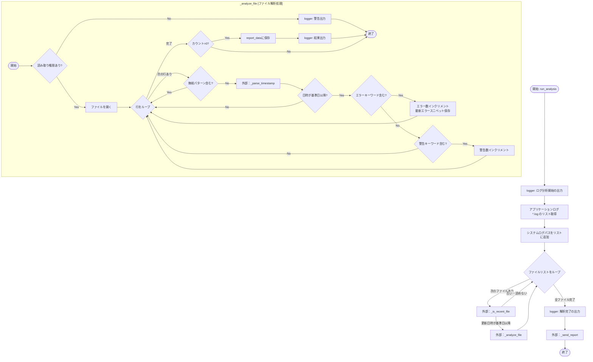
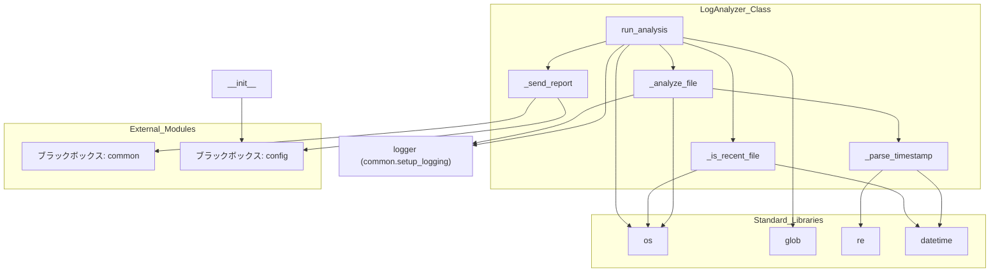

## 1. 解析メタ情報

| 項目 | 内容 |
| --- | --- |
| 対象ファイル | `log_analyzer.py` |
| 言語 | Python |
| 解析対象 | 提供されたコードのみ |
| 推測・補完 | 一切なし |

## 2. ファイルの概要

このファイルは、指定された過去の日数分のアプリケーションログディレクトリおよび特定のシステムログファイル（`/var/log/syslog`, `/var/log/auth.log`）を走査し、特定のエラーキーワードが含まれる行を検知・集計した上で、外部の通知機能を利用してレポートを送信する責務を担っている。

## 3. 外部依存関係

### インポート一覧

| 名称 | 種類 | 用途 | 根拠 |
| --- | --- | --- | --- |
| `os` | 標準ライブラリ | ファイルパス操作、存在確認、更新日時取得、アクセス権限確認 | `import os` (行番号: 取得不可 / 抜粋: "import os") |
| `glob` | 標準ライブラリ | ログディレクトリ内のファイルパターンマッチング | `import glob` (行番号: 取得不可 / 抜粋: "import glob") |
| `re` | 標準ライブラリ | ログ行のタイムスタンプ解析（正規表現） | `import re` (行番号: 取得不可 / 抜粋: "import re") |
| `datetime` | 標準ライブラリ | 現在日時の取得、日付計算、文字列と日付の相互変換 | `import datetime` (行番号: 取得不可 / 抜粋: "import datetime") |
| `logging` | 標準ライブラリ | インポートのみ（直接的な利用箇所はファイル内に見当たらない） | `import logging` (行番号: 取得不可 / 抜粋: "import logging") |
| `typing` | 標準ライブラリ | 型ヒント（List, Dict, Any, Optional） | `from typing import List, Dict, Any, Optional` (行番号: 取得不可 / 抜粋: "from typing import List, Dict...") |
| `config` | 自作モジュール | ログディレクトリパス、通知先IDの取得 | `import config` (行番号: 取得不可 / 抜粋: "import config") |
| `common` | 自作モジュール | ロガー設定、プッシュ通知送信の呼び出し | `import common` (行番号: 取得不可 / 抜粋: "import common") |

### ブラックボックスとなる外部要素

| 名称 | 理由 | 根拠 |
| --- | --- | --- |
| `config.LOG_DIR` | 外部ファイルで定義されており、具体的なパスや型が提供されていないため。 | `self.log_dir = config.LOG_DIR` (行番号: 取得不可 / 抜粋: "self.log_dir = config.LOG_DIR") |
| `config.LINE_USER_ID` | 外部ファイルで定義されており、具体的な値や型が提供されていないため。 | `common.send_push(config.LINE...` (行番号: 取得不可 / 抜粋: "common.send_push(config.LINE_US...") |
| `common.setup_logging` | 外部ファイルで定義されており、内部処理や戻り値の型仕様が不明なため。 | `logger = common.setup_logging(...` (行番号: 取得不可 / 抜粋: "logger = common.setup_logging("...") |
| `common.send_push` | 外部ファイルで定義されており、引数の詳細仕様やエラー挙動が不明なため。 | `common.send_push(config.LINE...` (行番号: 取得不可 / 抜粋: "common.send_push(config.LINE_US...") |

## 4. 主要要素の定義（関数 / エンドポイント / コンポーネント）

### `LogAnalyzer`

* **役割**: ログディレクトリおよびシステムログを走査し、システムエラーを集計・通知するクラス。
* 根拠: `LogAnalyzer` (行番号: 取得不可 / 抜粋: "class LogAnalyzer:")

* **引数/リクエスト**: なし（クラス定義自体の引数はなし）
* 根拠: `LogAnalyzer` (行番号: 取得不可 / 抜粋: "class LogAnalyzer:")

* **戻り値/レスポンス**: なし
* 根拠: `LogAnalyzer` (行番号: 取得不可 / 抜粋: "class LogAnalyzer:")

* **副作用**: なし
* 根拠: `LogAnalyzer` (行番号: 取得不可 / 抜粋: "class LogAnalyzer:")

* **エラーハンドリング**: なし
* 根拠: `LogAnalyzer` (行番号: 取得不可 / 抜粋: "class LogAnalyzer:")

### `__init__`

* **役割**: インスタンス変数の初期化、基準日時の算出、外部設定の取り込みを行う。
* 根拠: `__init__` (行番号: 取得不可 / 抜粋: "def **init**(self, days_back:")

* **引数/リクエスト**: `days_back: int = 7` (さかのぼる日数)
* 根拠: `__init__` (行番号: 取得不可 / 抜粋: "def **init**(self, days_back: in...")

* **戻り値/レスポンス**: `None`
* 根拠: `__init__` (行番号: 取得不可 / 抜粋: ") -> None:")

* **副作用**: `self.days_back`, `self.log_dir`, `self.report_data`, `self.now`, `self.start_date`, `self.start_date_str` の状態を変更する。
* 根拠: `__init__`内の代入処理 (行番号: 取得不可 / 抜粋: "self.days_back = days_back")

* **エラーハンドリング**: なし
* 根拠: `__init__` (行番号: 取得不可 / 抜粋: "def **init**(self, days_back:")

### `_is_recent_file`

* **役割**: 指定されたファイルの更新日時が基準日時（`self.start_date`）以降であるかを判定する。
* 根拠: `_is_recent_file` (行番号: 取得不可 / 抜粋: "def _is_recent_file(self, file...")

* **引数/リクエスト**: `filepath: str` (チェック対象のファイルパス)
* 根拠: `_is_recent_file` (行番号: 取得不可 / 抜粋: "filepath: str")

* **戻り値/レスポンス**: `bool` (新しい場合はTrue、存在しない・古い・エラーの場合はFalse)
* 根拠: `_is_recent_file` (行番号: 取得不可 / 抜粋: "-> bool:")

* **副作用**: ファイルシステムへのアクセス（存在確認、更新日時取得）。
* 根拠: `os.path.exists`, `os.path.getmtime` (行番号: 取得不可 / 抜粋: "mtime = os.path.getmtime(fil...")

* **エラーハンドリング**: `OSError`, `PermissionError` をキャッチし、`False` を返す。
* 根拠: `except`ブロック (行番号: 取得不可 / 抜粋: "except (OSError, PermissionErr...")

### `_parse_timestamp`

* **役割**: ログの行頭文字列からタイムスタンプを抽出し、`datetime`オブジェクトに変換する。
* 根拠: `_parse_timestamp` (行番号: 取得不可 / 抜粋: "def _parse_timestamp(self, l...")

* **引数/リクエスト**: `line: str` (ログの1行)
* 根拠: `_parse_timestamp` (行番号: 取得不可 / 抜粋: "line: str")

* **戻り値/レスポンス**: `Optional[datetime.datetime]` (解析成功時は日時オブジェクト、失敗時はNone)
* 根拠: `_parse_timestamp` (行番号: 取得不可 / 抜粋: "-> Optional[datetime.datetime]:")

* **副作用**: なし
* 根拠: `_parse_timestamp`内部処理 (行番号: 取得不可 / 抜粋: "match_iso = re.match(r'^(\d{4}...")

* **エラーハンドリング**: `ValueError` をキャッチし、無視して次のフォーマット判定またはNoneの返却へ進む。
* 根拠: `except`ブロック (行番号: 取得不可 / 抜粋: "except ValueError:")

### `_analyze_file`

* **役割**: ファイルを1行ずつ読み込み、無視パターンを除外した上でタイムスタンプを評価し、エラーまたは警告キーワードが含まれる行をカウント・集計する。
* 根拠: `_analyze_file` (行番号: 取得不可 / 抜粋: "def _analyze_file(self, file...")

* **引数/リクエスト**: `filepath: str` (解析対象のファイルパス)
* 根拠: `_analyze_file` (行番号: 取得不可 / 抜粋: "filepath: str")

* **戻り値/レスポンス**: `None`
* 根拠: `_analyze_file` (行番号: 取得不可 / 抜粋: "-> None:")

* **副作用**: `self.report_data` の更新、ファイル読み込み、`logger` を用いたログ出力。
* 根拠: 代入およびI/O処理 (行番号: 取得不可 / 抜粋: "self.report_data[filename] = {")

* **エラーハンドリング**: 関数全体の処理を`try-except Exception`で囲み、エラー発生時は`logger.error`で記録して処理を継続する。
* 根拠: `except`ブロック (行番号: 取得不可 / 抜粋: "except Exception as e:")

### `run_analysis`

* **役割**: 対象となる全てのログファイルを取得し、直近の更新があるファイルに対して解析処理を順次実行した後、レポート送信処理を呼び出す。
* 根拠: `run_analysis` (行番号: 取得不可 / 抜粋: "def run_analysis(self) -> None:")

* **引数/リクエスト**: なし（`self`のみ）
* 根拠: `run_analysis` (行番号: 取得不可 / 抜粋: "def run_analysis(self) -> None:")

* **戻り値/レスポンス**: `None`
* 根拠: `run_analysis` (行番号: 取得不可 / 抜粋: "-> None:")

* **副作用**: 外部ファイル一覧の取得、`logger` を用いたログ出力。
* 根拠: `glob.glob`呼び出しなど (行番号: 取得不可 / 抜粋: "target_files = glob.glob(os.pa...")

* **エラーハンドリング**: なし（個別のファイル解析エラーは`_analyze_file`内でハンドリングされる）
* 根拠: `run_analysis`内部処理 (行番号: 取得不可 / 抜粋: "for filepath in target_files:")

### `_send_report`

* **役割**: 集計結果(`self.report_data`)をもとにMarkdown形式のレポートメッセージを組み立て、外部通知モジュールを呼び出す。
* 根拠: `_send_report` (行番号: 取得不可 / 抜粋: "def _send_report(self) -> None:")

* **引数/リクエスト**: なし（`self`のみ）
* 根拠: `_send_report` (行番号: 取得不可 / 抜粋: "def _send_report(self) -> None:")

* **戻り値/レスポンス**: `None`
* 根拠: `_send_report` (行番号: 取得不可 / 抜粋: "-> None:")

* **副作用**: `common.send_push` による外部システムへの通信。
* 根拠: 外部モジュール呼び出し (行番号: 取得不可 / 抜粋: "common.send_push(config.LINE_...")

* **エラーハンドリング**: なし
* 根拠: `_send_report`内部処理 (行番号: 取得不可 / 抜粋: "def _send_report(self) -> None:")

## 5. 処理フロー図

## 6. 依存関係図

## 7. 次のステップ（リバースエンジニアリングの提案）

| 優先度 | ファイル名(推測可) | 理由 | 根拠 |
| --- | --- | --- | --- |
| 高 | `common.py` | ログ設定の実態や、`send_push`のエラー発生時の挙動（リトライの有無、同期・非同期など）を特定するため。 | `common.send_push(config.LINE_USER_ID, [{"type": "text", "text": msg}], target="discord", channel="report")` の呼び出しから |
| 高 | `config.py` | `LOG_DIR`の具体的なパス構造や、`LINE_USER_ID`に何が格納されているか（複数IDか単一IDか等）を確認するため。 | `self.log_dir = config.LOG_DIR` の参照から |

## 8. 保守上の注意点

* **エラーハンドリング**: `_send_report` 内の `common.send_push` 呼び出しでネットワークエラー等が発生した場合の例外ハンドリングが存在しない。
* **年情報の補完処理**: `_parse_timestamp` 内のSyslog解析において、年情報が含まれないため一律で「現在年」を補完している。年またぎのタイミング（例：1月1日に12月31日のログを解析する際など）でパース結果が未来の日付となる可能性がある。
* **ファイルアクセス時の例外**: `_analyze_file` においてファイルの読み込み処理は `try-except Exception` で包括的にキャッチされているため、意図しないバグもファイル解析エラーとしてロギングされ処理が継続される。

## 9. 不明事項一覧

| 項目 | 理由 | 必要なファイル |
| --- | --- | --- |
| `LOG_DIR` の具体的なパス | 外部ファイルに定義されているため | `config.py` |
| `LINE_USER_ID` の値とデータ型 | 外部ファイルに定義されているため | `config.py` |
| `setup_logging` の詳細仕様 | ログフォーマットや出力先などの設定が不明なため | `common.py` |
| `send_push` の詳細仕様 | 引数（`target="discord"`, `channel="report"`）の意味や、通信エラー時の挙動が不明なため | `common.py` |

## 10. 自己検証結果

* [x] 推測・外部ファイルの仕様を一切含んでいない
* [x] 全関数・全クラス・全コンポーネントを列挙した
* [x] 全てのインポート要素を列挙した
* [x] すべての仕様説明に「根拠（行番号・抜粋）」を明記した
* [x] 根拠漏れが0件である
* [x] Mermaid構文にエラーの原因となる記号（エスケープ漏れ）がない
* [x] 不明事項を漏れなく列挙した

完了