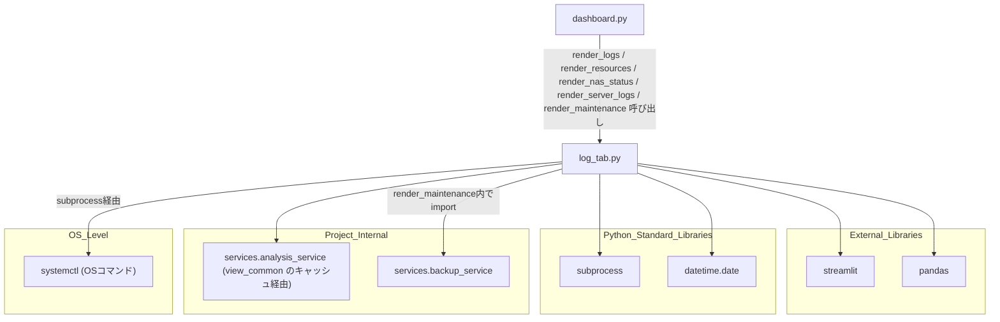

## 1. 解析メタ情報

| 項目 | 内容 |
| --- | --- |
| 対象ファイル | `views/dashboard/log_tab.py` |
| 言語 | Python |
| 解析対象 | 提供されたコードのみ |
| 推測・補完 | 一切なし |

## 関連ドキュメント

* [analysis_service.md](./analysis_service.md) - `services.analysis_service`の実体。`get_disk_usage`, `get_memory_usage`, `load_nas_status`, `get_system_logs`を提供。**（スマホ対応で変更）** 本ファイルは直接呼ばず、[dashboard_common.md](./dashboard_common.md)のキャッシュ付きラッパー経由で呼ぶ
* [dashboard_common.md](./dashboard_common.md) - **（スマホ対応で追加）** キャッシュ付きラッパー(`get_disk_usage_cached` / `get_memory_usage_cached` / `load_nas_status_cached` / `get_system_logs_cached`)と表描画(`render_table`)を提供する共通モジュール
* [backup_service.md](./backup_service.md) - `services.backup_service`の実体。`render_maintenance`内でバックアップボタン押下時に呼び出される`perform_backup`を提供
* [dashboard.md](./dashboard.md) - 呼び出し元。**（スマホ対応で変更）** `views.dashboard.log_tab`をインポートし、「🔧 システム」タブの中で`render_resources`, `render_nas_status`, `render_server_logs`, `render_logs`, `render_maintenance`を呼び出す（以前は「ログ分析」「システム管理」の2タブで`render_logs`, `render_system`を呼んでいた）

## 2. ファイルの概要

* **（Issue #651 の横展開）** 「システム再起動」ボタンが呼ぶ `subprocess.run(["sudo", "systemctl", "restart", "home_system"])` に `SUBPROCESS_TIMEOUT_SEC`(30秒)を付与し、`subprocess.TimeoutExpired` を捕捉して画面にエラーを出すようにした。timeout が無いと、systemd 側が応答しない状況で Streamlit のスクリプト実行スレッドが無限に待ち、ダッシュボード全体が固まる(再起動対象が自分の動くホストのサービスであるため、詰まる場面が現実にある)。

* Streamlitダッシュボードの「🔧 システム」タブ配下と、センサーログ分析を描画するモジュール。**（スマホ対応で分割）** 以前は`render_logs`と、システム管理の全機能を1つにまとめた`render_system`の2関数だったが、`render_system`は責務ごとに`render_resources`（リソース）/`render_nas_status`（NAS）/`render_server_logs`（サーバーログ）/`render_maintenance`（再起動・バックアップ）の4関数へ分割された。呼び出し元（`dashboard.py`）は副次的なものを`st.expander`に畳んで並べる。
* 根拠: `def render_logs(df_sensor: pd.DataFrame):`, `def render_resources():`, `def render_nas_status():`, `def render_server_logs():`, `def render_maintenance():` (行番号: 12, 32, 47, 63, 94 / 抜粋: "def render_logs(df_sensor: pd.DataFrame):")
* **（Issue #507で削除）** 以前は3つ目の公開関数として、直近3日分のアプリランキング(無料トップ・売上トップ)を`analysis_service.load_ranking_dates`/`load_ranking_data`経由で取得し週ごとに列表示する`render_trends`(「🌟 最近の流行・トレンド推移」タブ)が存在した。しかし参照先の`app_rankings`テーブルへ書き込むコード(収集スクリプト)がリポジトリのどこにも存在せず、収集に使うはずの`google-play-scraper`もIssue #496で未使用パッケージとして既に削除済みであり、`migrations/`にもテーブル定義が無いため新規構築したDBでは永久に「データがありません」としか表示されない死んだ機能だった(Issue #507)。オーナー判断によりUIごと削除され、対応する`analysis_service.load_ranking_dates`/`load_ranking_data`、`current_schema.sql`の`app_rankings`テーブル定義、`dashboard.py`のタブ登録もあわせて削除された。
* `render_logs`は、渡された`df_sensor`（センサーデータ）を場所（`location`）でフィルタ可能な形で一覧表示する。**（スマホ対応で変更）** `df_sensor`が空のときは以前は無言で何も描画しなかったが、`st.info("センサーログがありません")`を出して早期`return`するようになった。
* 根拠: `sel = st.multiselect("場所", locs, default=locs)` (行番号: 19 / 抜粋: "sel = st.multiselect(\"場所\", locs, default=locs)")、空のときの早期return (行番号: 12〜14 / 抜粋: "        st.info(\"センサーログがありません\")")
* **（スマホ対応で分割）** 旧`render_system`が持っていた機能は、ディスク/メモリ使用率（`render_resources`）、NASステータス（`render_nas_status`）、サーバーログの検索・表示（`render_server_logs`）、確認チェック付きのサービス再起動とバックアップ実行（`render_maintenance`）の4つに分かれた。各関数は`st.title`ではなく`st.markdown("##### ...")`の小見出しで始まる（呼び出し元が`st.expander`に畳むため）。以前はngrokのローカルAPI経由で取得した外部公開URLの接続状態も表示していたが、無認証のダッシュボードがngrok経由で外部公開されうるセキュリティ上の懸念から削除された（Issue #225）。
* 根拠: `st.markdown("##### 💻 リソース状況")` (行番号: 29 / 抜粋: "st.markdown(\"##### 💻 リソース状況\")")、`st.markdown("##### 🛠️ メンテナンス操作")` (行番号: 101 / 抜粋: "st.markdown(\"##### 🛠️ メンテナンス操作\")")
* `render_maintenance`内のサービス再起動処理は、`subprocess.run`で`sudo systemctl restart home_system`を実行する破壊的操作であり、チェックボックスによる確認を経てからボタンが有効化される。docstringに、スマートフォンからも実行できるようにしたのはオーナー判断であること、誤タップで本番サービスが落ちる操作のため2段階確認を維持していること、タップターゲットは`common.CUSTOM_CSS`で44px以上を確保していることが記されている。
* 根拠: `subprocess.run(` (行番号: 99〜103 / 抜粋: "subprocess.run(")、docstring (行番号: 84〜89 / 抜粋: "    スマートフォンからも実行できるようにした(オーナー判断)が、誤タップで本番サービスが")

## 3. 外部依存関係

### インポート一覧

| 名称 | 種類 | 用途 | 根拠 |
| --- | --- | --- | --- |
| `streamlit` | 外部ライブラリ | UI描画全般（タブ、フィルタ、メトリクス、コード表示、ボタン等） | `import streamlit as st` (行番号: 2 / 抜粋: "import streamlit as st") |
| `pandas` | 外部ライブラリ | `render_logs`の引数型注釈（`pd.DataFrame`）およびフィルタ処理 | `import pandas as pd` (行番号: 3 / 抜粋: "import pandas as pd") |
| `subprocess` | 標準ライブラリ | システム再起動コマンド(`systemctl restart`)の実行 | `import subprocess` (行番号: 4 / 抜粋: "import subprocess") |
| `date` | 標準ライブラリ | 日付指定検索時の初期値(`date.today()`)取得に使用 | `from datetime import date` (行番号: 8 / 抜粋: "from datetime import date") |
| `views.dashboard.common` (`view_common`) | 内部モジュール | **（スマホ対応で変更）** ディスク/メモリ使用率・NASステータス・システムログの**キャッシュ付き**取得と、表描画(`render_table`) | `from . import common as view_common` (行番号: 10 / 抜粋: "from . import common as view_common") |
| `backup_service` | 内部モジュール | `render_maintenance`関数内でインポートされる（関数内import）。バックアップ実行処理(`perform_backup`)の提供 | `from services import backup_service` (行番号: 125 / 抜粋: "from services import backup_service") |

### ブラックボックスとなる外部要素

| 名称 | 理由 | 根拠 |
| --- | --- | --- |
| `view_common.get_disk_usage_cached` / `get_memory_usage_cached` | ディスク・メモリ使用率の取得元・実装（`psutil`等の使用有無）が不明。 | `disk = view_common.get_disk_usage_cached()` (行番号: 35 / 抜粋: "disk = view_common.get_disk_usage_cached()") |
| `view_common.load_nas_status_cached` | NASステータスデータの取得元・スキーマ（`status_ping`, `status_mount`, `timestamp`以外のフィールド有無）が不明。 | `nas_data = view_common.load_nas_status_cached()` (行番号: 52 / 抜粋: "nas_data = view_common.load_nas_status_cached()") |
| `view_common.get_system_logs_cached` | サーバーログの取得元（journalctl等）・`priority`引数の解釈方法が不明。 | `logs = view_common.get_system_logs_cached(lines=lines_val, priority=priority, target_date=target_date)` (行番号: 89 / 抜粋: "logs = view_common.get_system_logs_cached(") |
| `backup_service.perform_backup` | バックアップ処理の実装（対象データ・保存先・失敗時の`res`の意味）が不明。 | `success, res, size = backup_service.perform_backup()` (行番号: 128 / 抜粋: "success, res, size = backup_service.perform_backup()") |
| `sudo systemctl restart home_system` (OSサービス) | 対象の`home_system`サービスの実体（`systemd`ユニット定義）が本ファイルからは不明。 | `subprocess.run(` (行番号: 99〜103 / 抜粋: "subprocess.run(") |

## 4. 主要要素の定義（関数 / エンドポイント / コンポーネント）

### `render_logs`

* **役割**: `df_sensor`を場所（`location`）で絞り込むマルチセレクトと、絞り込んだ結果（最大200件）の表形式表示を提供する。
* 根拠: `def render_logs(df_sensor: pd.DataFrame):` (行番号: 12〜29 / 抜粋: "def render_logs(df_sensor: pd.DataFrame):")

* **引数/リクエスト**: `df_sensor` (型: `pd.DataFrame`。`location`, `timestamp`, `friendly_name`, `contact_state`, `power_watts`列を含むことを前提とするセンサーデータ)
* 根拠: `def render_logs(df_sensor: pd.DataFrame):` (行番号: 12 / 抜粋: "def render_logs(df_sensor: pd.DataFrame):")

* **戻り値/レスポンス**: なし（**スマホ対応で変更**: `df_sensor`が空の場合は`st.info("センサーログがありません")`を表示して早期`return`する）
* 根拠: `if df_sensor.empty:` (行番号: 12〜14 / 抜粋: "    if df_sensor.empty:")

* **副作用**: `st.multiselect`、`view_common.render_table`（内部で`st.dataframe`）によるStreamlit画面への描画。**（スマホ対応で変更）** 列は「時刻 / センサー / 場所 / 状態 / W」の表示名に絞り、時刻を短縮し、行番号を隠す。
* 根拠: `view_common.render_table(` (行番号: 20 / 抜粋: "view_common.render_table(")

* **エラーハンドリング**: なし（明示的な例外捕捉は行われていない。呼び出し元の`dashboard.py`が`safe_section`で囲む）
* 根拠: `def render_logs(df_sensor: pd.DataFrame):` 全体 (行番号: 12〜29 / 抜粋: "def render_logs(df_sensor: pd.DataFrame):")

### `render_resources` （スマホ対応で`render_system`から分割）

* **役割**: ディスク使用率とメモリ使用率を、パーセント表記と`st.progress`のバーで表示する。
* 根拠: `def render_resources():` (行番号: 32〜44 / 抜粋: "def render_resources():")

* **引数/リクエスト**: なし
* 根拠: `def render_resources():` (行番号: 32 / 抜粋: "def render_resources():")

* **戻り値/レスポンス**: なし
* 根拠: `def render_resources():` (行番号: 32 / 抜粋: "def render_resources():")

* **副作用**: `view_common.get_disk_usage_cached()` / `get_memory_usage_cached()` 経由のデータ取得（TTL 60秒のキャッシュ越し。メモリ使用率はホームタブのサマリーカードとも共有される）と、`st.write` / `st.progress` による描画。
* 根拠: `disk = view_common.get_disk_usage_cached()` (行番号: 35 / 抜粋: "disk = view_common.get_disk_usage_cached()")、`mem = view_common.get_memory_usage_cached()` (行番号: 41 / 抜粋: "mem = view_common.get_memory_usage_cached()")

* **エラーハンドリング**: なし（取得結果が falsy の場合は該当ブロックを描画しないだけ）
* 根拠: `if disk:` / `if mem:` (行番号: 31, 37 / 抜粋: "    if disk:")

### `render_nas_status` （スマホ対応で`render_system`から分割）

* **役割**: NASのPing疎通・マウント状態・最終確認時刻を`st.columns(3)`の`st.metric`で表示する。データが無い場合は`st.info("データなし")`。
* 根拠: `def render_nas_status():` (行番号: 47〜60 / 抜粋: "def render_nas_status():")

* **引数/リクエスト**: なし
* 根拠: `def render_nas_status():` (行番号: 47 / 抜粋: "def render_nas_status():")

* **戻り値/レスポンス**: なし（`nas_data`が`None`のとき早期`return`）
* 根拠: `if nas_data is None:` (行番号: 46〜48 / 抜粋: "    if nas_data is None:")

* **副作用**: `view_common.load_nas_status_cached()` 経由のデータ取得と、`st.columns` / `st.metric` による描画。**（スマホ対応で変更）** 以前はここだけがキャッシュを迂回して素の`analysis_service.load_nas_status()`を呼んでおり、「🔧 システム」タブを開くたびにNASの状態を別途読み直していた（ホームタブのサマリーとは別に）。
* 根拠: `nas_data = view_common.load_nas_status_cached()` (行番号: 52 / 抜粋: "nas_data = view_common.load_nas_status_cached()")、`c1, c2, c3 = st.columns(3)` (行番号: 57 / 抜粋: "c1, c2, c3 = st.columns(3)")

* **エラーハンドリング**: なし（`nas_data["status_ping"]` 等のキー欠落は捕捉していない）
* 根拠: `with c1: st.metric("Ping疎通", ...)` (行番号: 58 / 抜粋: "    with c1: st.metric(\"Ping疎通\", f\"{'✅' if nas_data['status_ping']=='OK' else '❌'} {nas_data['status_ping']}\")")

### `render_server_logs` （スマホ対応で`render_system`から分割）

* **役割**: journald由来のサーバーログの検索・表示。検索モード（「直近のログを表示」/「日付を指定して検索」）を`st.radio`（`horizontal=True`）で選び、`st.columns(2)`の左に対象日または表示行数、右にログレベルのセレクトボックスを置く。「🔄 ログを更新」ボタン押下で`st.rerun()`する。取得結果は`st.code(logs, language="text")`で表示し、空なら`st.info("ログなし")`。
* 根拠: `def render_server_logs():` (行番号: 63〜91 / 抜粋: "def render_server_logs():")

* **引数/リクエスト**: なし
* 根拠: `def render_server_logs():` (行番号: 63 / 抜粋: "def render_server_logs():")

* **戻り値/レスポンス**: なし
* 根拠: `def render_server_logs():` (行番号: 63 / 抜粋: "def render_server_logs():")

* **副作用**: `view_common.get_system_logs_cached()` 経由のデータ取得（TTL 60秒のキャッシュ越し。実体は`journalctl`のサブプロセス起動）、`st.rerun()` によるアプリ全体の再実行、各種ウィジェットの描画。**（スマホ対応で変更）** 「🔄 ログを更新」は再実行の前に`view_common.get_system_logs_cached.clear()`を呼ぶ — キャッシュを捨てないと、押しても同じ内容が返るため。
* 根拠: `logs = view_common.get_system_logs_cached(lines=lines_val, priority=priority, target_date=target_date)` (行番号: 89 / 抜粋: "logs = view_common.get_system_logs_cached(")、`view_common.get_system_logs_cached.clear()` (行番号: 86 / 抜粋: "view_common.get_system_logs_cached.clear()")

* **エラーハンドリング**: なし（明示的な例外捕捉は行われていない）
* 根拠: 関数本体全体 (行番号: 63〜91 / 抜粋: "def render_server_logs():")

* **補足（スマホ対応で変更）**: コメントに、以前は `st.columns([1, 1, 2])` の3列目を捨てる形で幅を調整していたが、空列はスマホ幅では縦積みされたぶんだけ無駄な余白になるだけなので2列にし、幅の調整はCSS側の縦積みルールに委ねた旨が記されている。
* 根拠: (行番号: 60〜63 / 抜粋: "    # スマホ対応: 以前は st.columns([1, 1, 2]) の3列目を捨てる形で幅を調整していたが、")

### `render_maintenance` （スマホ対応で`render_system`から分割）

* **役割**: サービス再起動・バックアップといった管理操作を提供する。`st.warning`で破壊的操作である旨を出し、`st.checkbox("再起動することを理解しました", key="confirm_reboot_checkbox")`にチェックが入った場合のみ`st.button("🔄 システム再起動", type="primary")`を描画する。続けてバックアップ実行ボタンを置く。
* 根拠: `def render_maintenance():` (行番号: 94〜130 / 抜粋: "def render_maintenance():")

* **引数/リクエスト**: なし
* 根拠: `def render_maintenance():` (行番号: 94 / 抜粋: "def render_maintenance():")

* **戻り値/レスポンス**: なし
* 根拠: `def render_maintenance():` (行番号: 94 / 抜粋: "def render_maintenance():")

* **副作用**:
    * チェックボックス確認後、再起動ボタン押下で`subprocess.run(["sudo", "systemctl", "restart", "home_system"], check=True, timeout=SUBPROCESS_TIMEOUT_SEC)`により実際にOSレベルの`systemctl restart`コマンドを実行する（本番サービス再起動という破壊的操作）。
    * `st.button("今すぐバックアップを実行")`押下で`backup_service.perform_backup()`を呼び出す（`backup_service`は関数内import）。
* 根拠: `subprocess.run(` (行番号: 99〜103 / 抜粋: "subprocess.run(")、`success, res, size = backup_service.perform_backup()` (行番号: 128 / 抜粋: "success, res, size = backup_service.perform_backup()")

* **エラーハンドリング**: 再起動処理のみ`try`で囲み、`subprocess.TimeoutExpired`（#651。`timeout`が無いとsystemd側が応答しない状況でStreamlitのスクリプト実行スレッドが無限に待ち、ダッシュボード全体が固まる）と、それ以外の`Exception`をそれぞれ捕捉して`st.error`で表示する。バックアップは`perform_backup`の戻り値`success`で成否を分岐するのみで、例外捕捉はしていない。
* 根拠: `except subprocess.TimeoutExpired:` (行番号: 105〜109 / 抜粋: "except subprocess.TimeoutExpired:")、`except Exception as e:` (行番号: 110〜111 / 抜粋: "except Exception as e:")

## 5. 処理フロー図

```mermaid
flowchart TD
    subgraph render_logs_Flow["render_logs() 処理フロー"]
        RL1["開始"] --> RL2{"df_sensorが空でないか"}
        RL2 -- No --> RL2b["st.info('センサーログがありません')"]
        RL2b --> RL3["終了"]
        RL2 -- Yes --> RL4["場所の一覧をmultiselectで表示"]
        RL4 --> RL5["選択された場所でフィルタしdataframe表示(最大200件)"]
        RL5 --> RL3
    end

    subgraph render_resources_Flow["render_resources() (スマホ対応で分割)"]
        RR1["開始"] --> RR2["外部: get_disk_usage_cached() / get_memory_usage_cached()"]
        RR2 --> RR3["使用率プログレスバー表示"]
        RR3 --> RR4["終了"]
    end

    subgraph render_nas_status_Flow["render_nas_status() (スマホ対応で分割)"]
        RN1["開始"] --> RN2["外部: view_common.load_nas_status_cached()"]
        RN2 --> RN3{"nas_dataがNoneでないか"}
        RN3 -- No --> RN4["st.info('データなし')"]
        RN3 -- Yes --> RN5["3列のst.metricで表示"]
        RN4 --> RN6["終了"]
        RN5 --> RN6
    end

    subgraph render_server_logs_Flow["render_server_logs() (スマホ対応で分割)"]
        RS10["開始"] --> RS10b["検索モード・行数/対象日・ログレベル選択UI(2列)"]
        RS10b --> RS11{"更新ボタン押下か"}
        RS11 -- Yes --> RS12["st.rerun()"]
        RS11 -- No --> RS13["外部: view_common.get_system_logs_cached()"]
        RS13 --> RS14{"ログが空か"}
        RS14 -- Yes --> RS14b["st.info('ログなし')"]
        RS14 -- No --> RS14c["ログをst.codeで表示"]
        RS14b --> RS14d["終了"]
        RS14c --> RS14d
    end

    subgraph render_maintenance_Flow["render_maintenance() (スマホ対応で分割)"]
        RM1["開始"] --> RM2["st.warning + 再起動確認チェックボックス"]
        RM2 --> RM3{"チェック済みか"}
        RM3 -- No --> RM8["バックアップUIへ"]
        RM3 -- Yes --> RM4{"再起動ボタン押下か"}
        RM4 -- No --> RM8
        RM4 -- Yes --> RM5["外部: subprocess.run(systemctl restart, timeout=30)"]
        RM5 -- "TimeoutExpired" --> RM6["st.error(タイムアウト)"]
        RM5 -- "その他の例外" --> RM7["st.error(エラー内容)"]
        RM5 -- 成功 --> RM8
        RM6 --> RM8
        RM7 --> RM8
        RM8 --> RM9["backup_serviceを関数内import"]
        RM9 --> RM10{"バックアップ実行ボタン押下か"}
        RM10 -- Yes --> RM11["外部: backup_service.perform_backup()"]
        RM11 --> RM12["結果を成功/失敗で表示"]
        RM10 -- No --> RM13["終了"]
        RM12 --> RM13
    end
```

## 6. 依存関係図

## 7. 次のステップ（リバースエンジニアリングの提案）

| 優先度 | ファイル名(推測可) | 理由 | 根拠 |
| --- | --- | --- | --- |
| 高 | `services/analysis_service.py` | ディスク/メモリ・NAS・システムログ取得の各関数の実装とスキーマを把握するため。 | `analysis_service.get_system_logs(...)` (行番号: 78 / 抜粋: "logs = analysis_service.get_system_logs(") |
| 高 | `services/backup_service.py` | `perform_backup`の戻り値タプル`(success, res, size)`の正確な意味とバックアップ対象を把握するため。 | `success, res, size = backup_service.perform_backup()` (行番号: 128 / 抜粋: "success, res, size = backup_service.perform_backup()") |
| 中 | `deploy/systemd/home_system.service` | `systemctl restart home_system`で再起動される対象サービスの実体を把握するため。 | `subprocess.run(` (行番号: 99〜103 / 抜粋: "subprocess.run(") |
| 中 | `dashboard.py` | 分割された5つの関数がどのタブ・どの`st.expander`に配置されるかを把握するため。 | 該当なし（本ファイルは呼び出し順を持たない） |

## 8. 保守上の注意点

* **破壊的操作のUI保護が限定的**: サービス再起動はチェックボックス確認を要するが、`st.checkbox`はページ再描画のたびに状態がリセットされうるStreamlitの挙動に依存しており、確認の実効性は`key="confirm_reboot_checkbox"`によるセッション状態管理に依存する。バックアップ実行ボタン（116行目）には同様の確認ステップが存在しない。**（スマホ対応）** これらの操作はスマートフォンからも到達できる（オーナー判断）。呼び出し元では`st.expander`（既定で畳まれた状態）の中に置かれ、タップターゲットの最小高さは`views/dashboard/common.py`の`CUSTOM_CSS`が44pxを確保しているが、モバイル専用の非表示化はしていない。
* 根拠: `confirm_reboot = st.checkbox("再起動することを理解しました", key="confirm_reboot_checkbox")` (行番号: 92 / 抜粋: "confirm_reboot = st.checkbox("), `if st.button("今すぐバックアップを実行"):` (行番号: 127 / 抜粋: "if st.button(\"今すぐバックアップを実行\"):")

* **エラーハンドリングの不均一**: サービス再起動処理のみ`try...except`で保護されているが、ディスク/メモリ・NAS・ログ取得・バックアップ実行の各外部呼び出しには例外捕捉がなく、これらの関数が例外を送出した場合はタブ全体の描画が中断する可能性がある。ただし呼び出し元`dashboard.py`側で`views.dashboard.common.safe_section`により例外が隔離されるため(Issue #438)、他への影響は無い。**（スマホ対応で変更）** 保護の単位は「タブ」ではなく本ファイルの関数1つ1つ（リソース状況／NAS状態／サーバーログ／ログ分析／メンテナンス操作）になったため、例えばNAS状態の取得に失敗してもサーバーログの表示は生き残る。
* 根拠: `disk = view_common.get_disk_usage_cached()` (行番号: 35 / 抜粋: "disk = view_common.get_disk_usage_cached()"), `success, res, size = backup_service.perform_backup()` (行番号: 128 / 抜粋: "success, res, size = backup_service.perform_backup()")

* **（スマホ対応）各関数は`st.title`ではなく`st.markdown("##### ...")`で始まる**: 呼び出し元が`st.expander`の中に置く前提のため。単独で使う場合は見出しレベルが浅く見える点に注意。
* 根拠: `st.markdown("##### 💻 リソース状況")` (行番号: 34 / 抜粋: "st.markdown(\"##### 💻 リソース状況\")")

* **（スマホ対応）`import subprocess` の直後に定数定義があり、`from datetime import date` がその後に続く**: 分割前から続く並びで、モジュール先頭にimportがまとまっていない（`SUBPROCESS_TIMEOUT_SEC`の定義がimportの間に挟まっている）。
* 根拠: (行番号: 4〜8 / 抜粋: "SUBPROCESS_TIMEOUT_SEC: int = 30")

## 9. 不明事項一覧

| 項目 | 理由 | 必要なファイル |
| --- | --- | --- |
| `analysis_service`各関数の戻り値スキーマ・DB/取得元 | `services.analysis_service`の実装が提供されていないため。 | `services/analysis_service.py` |
| `backup_service.perform_backup`の戻り値の詳細（`res`の意味等） | `services.backup_service`の実装が提供されていないため。 | `services/backup_service.py` |
| `home_system` systemdサービスの定義内容 | 再起動対象サービスの構成が本ファイルからは不明。 | `deploy/systemd/home_system.service` |

## 相互参照による補足情報

| 元の不明事項 | 判明した内容 | 参照元ドキュメント |
| --- | --- | --- |
| `analysis_service`各関数の戻り値スキーマ・DB/取得元 | `MY_HOME_SYSTEM/services/analysis_service.py`を直接確認した。`get_disk_usage() -> Optional[Dict[str, float]]`は`shutil.disk_usage("/")`から`total_gb, used_gb, free_gb, percent`を算出。`get_memory_usage() -> Optional[Dict[str, float]]`は`free -m`コマンドの出力をパースし`total_mb, used_mb, available_mb, percent`を返す。`load_nas_status() -> Optional[pd.Series]`は`config.SQLITE_TABLE_NAS`(既定`"nas_records"`)テーブルの最新1件を`timestamp`降順で取得する。`get_system_logs(lines=50, priority=None, target_date=None) -> str`は`journalctl -u home_system.service --no-pager`を実行しログ文字列を返す。以前存在した`get_ngrok_url()`（ngrokのローカルAPI経由で外部公開URLを取得しダッシュボードに表示する関数）は、無認証のダッシュボードがngrok経由で外部公開されうるセキュリティ上の懸念からIssue #225で削除された。**（Issue #507で削除）** 以前ここに記載していた`load_ranking_dates`/`load_ranking_data`(`app_rankings`テーブル参照)は、書き込み側の収集コードが存在せず機能として死んでいたため、`render_trends`タブごと削除された。 | 直接ソース確認: `MY_HOME_SYSTEM/services/analysis_service.py` |
| `backup_service.perform_backup`の戻り値の詳細（`res`の意味等） | `MY_HOME_SYSTEM/services/backup_service.py`を直接確認した。`perform_backup() -> Tuple[bool, str, float]`は`(成功フラグ, メッセージ, バックアップサイズMB)`のタプルを返す（docstringにも明記）。成功時は`return True, "バックアップ完了", local_size_mb`を返し、`log_tab.py`側の`success, res, size = backup_service.perform_backup()`における`res`は成功/失敗いずれの場合もこのメッセージ文字列であることを確認した。 | 直接ソース確認: `MY_HOME_SYSTEM/services/backup_service.py` |
| `home_system` systemdサービスの定義内容 | `MY_HOME_SYSTEM/deploy/systemd/home_system.service`を直接確認した。`Type=oneshot`・`User=masahiro`で、`ExecStart`は`start_all.sh`（本ファイルが再起動対象とする`home_system`サービス本体を起動するスクリプト）を実行する。`After=`行はIssue #225対応の一環として`ngrok.service`への順序依存を除去し`network.target`のみとした（ダッシュボードのngrok経由外部公開バイパス疑いの対応。ngrok起動有無にかかわらずサービス起動を試みるようにする意図）。 | 直接ソース確認: `MY_HOME_SYSTEM/deploy/systemd/home_system.service` |

## 10. 自己検証結果

* [x] 推測・外部ファイルの仕様を一切含んでいない
* [x] 全関数・全クラス・全コンポーネントを列挙した
* [x] 全てのインポート要素を列挙した
* [x] すべての仕様説明に「根拠（行番号・抜粋）」を明記した
* [x] 根拠漏れが0件である
* [x] Mermaid構文にエラーの原因となる記号（エスケープ漏れ）がない
* [x] 不明事項を漏れなく列挙した
