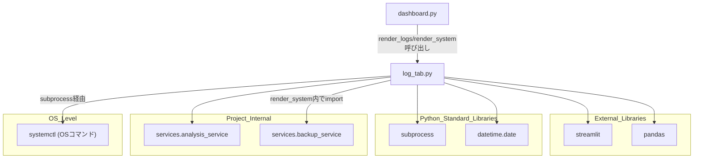

## 1. 解析メタ情報

| 項目 | 内容 |
| --- | --- |
| 対象ファイル | `views/dashboard/log_tab.py` |
| 言語 | Python |
| 解析対象 | 提供されたコードのみ |
| 推測・補完 | 一切なし |

## 関連ドキュメント

* [analysis_service.md](./analysis_service.md) - `services.analysis_service`の実体。`get_disk_usage`, `get_memory_usage`, `load_nas_status`, `get_system_logs`を提供
* [backup_service.md](./backup_service.md) - `services.backup_service`の実体。`render_system`内でバックアップボタン押下時に呼び出される`perform_backup`を提供
* [dashboard.md](./dashboard.md) - 呼び出し元。`views.dashboard.log_tab`をインポートし、ログ分析・システム管理の2タブとして`render_logs`, `render_system`を呼び出す

## 2. ファイルの概要

* Streamlitダッシュボードの「ログ分析」「システム管理」の2タブを描画するモジュール。2つの独立した公開関数（`render_logs`, `render_system`）で構成される。
* 根拠: `def render_logs(df_sensor: pd.DataFrame):`, `def render_system():` (行番号: 8, 20 / 抜粋: "def render_logs(df_sensor: pd.DataFrame):")
* **（Issue #507で削除）** 以前は3つ目の公開関数として、直近3日分のアプリランキング(無料トップ・売上トップ)を`analysis_service.load_ranking_dates`/`load_ranking_data`経由で取得し週ごとに列表示する`render_trends`(「🌟 最近の流行・トレンド推移」タブ)が存在した。しかし参照先の`app_rankings`テーブルへ書き込むコード(収集スクリプト)がリポジトリのどこにも存在せず、収集に使うはずの`google-play-scraper`もIssue #496で未使用パッケージとして既に削除済みであり、`migrations/`にもテーブル定義が無いため新規構築したDBでは永久に「データがありません」としか表示されない死んだ機能だった(Issue #507)。オーナー判断によりUIごと削除され、対応する`analysis_service.load_ranking_dates`/`load_ranking_data`、`current_schema.sql`の`app_rankings`テーブル定義、`dashboard.py`のタブ登録もあわせて削除された。
* `render_logs`は、渡された`df_sensor`（センサーデータ）を場所（`location`）でフィルタ可能な形で一覧表示する。
* 根拠: `sel = st.multiselect("場所", locs, default=locs)` (行番号: 12 / 抜粋: "sel = st.multiselect(\"場所\", locs, default=locs)")
* `render_system`は、ディスク/メモリ使用率、NASステータス、サーバーログの検索・表示、確認チェック付きのサービス再起動ボタン、バックアップ実行ボタンをまとめて表示する、システム管理向けの多機能パネルである。以前はngrokのローカルAPI経由で取得した外部公開URLの接続状態も表示していたが、無認証のダッシュボードがngrok経由で外部公開されうるセキュリティ上の懸念から削除された（Issue #225）。
* 根拠: `st.title("🔧 システム管理コックピット")` (行番号: 22 / 抜粋: "st.title(\"🔧 システム管理コックピット\")")
* `render_system`内のサービス再起動処理は、`subprocess.run`で`sudo systemctl restart home_system`を実行する破壊的操作であり、チェックボックスによる確認を経てからボタンが有効化される。
* 根拠: `subprocess.run(["sudo", "systemctl", "restart", "home_system"], check=True)` (行番号: 77 / 抜粋: "subprocess.run([\"sudo\", \"systemctl\", \"restart\", \"home_system\"], check=True)")

## 3. 外部依存関係

### インポート一覧

| 名称 | 種類 | 用途 | 根拠 |
| --- | --- | --- | --- |
| `streamlit` | 外部ライブラリ | UI描画全般（タブ、フィルタ、メトリクス、コード表示、ボタン等） | `import streamlit as st` (行番号: 2 / 抜粋: "import streamlit as st") |
| `pandas` | 外部ライブラリ | `render_logs`の引数型注釈（`pd.DataFrame`）およびフィルタ処理 | `import pandas as pd` (行番号: 3 / 抜粋: "import pandas as pd") |
| `subprocess` | 標準ライブラリ | システム再起動コマンド(`systemctl restart`)の実行 | `import subprocess` (行番号: 4 / 抜粋: "import subprocess") |
| `date` | 標準ライブラリ | 日付指定検索時の初期値(`date.today()`)取得に使用 | `from datetime import date` (行番号: 5 / 抜粋: "from datetime import date") |
| `analysis_service` | 内部モジュール | ディスク/メモリ使用率・NASステータス・システムログの取得 | `from services import analysis_service` (行番号: 6 / 抜粋: "from services import analysis_service") |
| `backup_service` | 内部モジュール | `render_system`関数内でインポートされる（関数内import）。バックアップ実行処理(`perform_backup`)の提供 | `from services import backup_service` (行番号: 83 / 抜粋: "from services import backup_service") |

### ブラックボックスとなる外部要素

| 名称 | 理由 | 根拠 |
| --- | --- | --- |
| `analysis_service.get_disk_usage` / `get_memory_usage` | ディスク・メモリ使用率の取得元・実装（`psutil`等の使用有無）が不明。 | `disk = analysis_service.get_disk_usage()` (行番号: 25 / 抜粋: "disk = analysis_service.get_disk_usage()") |
| `analysis_service.load_nas_status` | NASステータスデータの取得元・スキーマ（`status_ping`, `status_mount`, `timestamp`以外のフィールド有無）が不明。 | `nas_data = analysis_service.load_nas_status()` (行番号: 38 / 抜粋: "nas_data = analysis_service.load_nas_status()") |
| `analysis_service.get_system_logs` | サーバーログの取得元（journalctl等）・`priority`引数の解釈方法が不明。 | `logs = analysis_service.get_system_logs(lines=lines_val, priority=priority, target_date=target_date)` (行番号: 65 / 抜粋: "logs = analysis_service.get_system_logs(") |
| `backup_service.perform_backup` | バックアップ処理の実装（対象データ・保存先・失敗時の`res`の意味）が不明。 | `success, res, size = backup_service.perform_backup()` (行番号: 86 / 抜粋: "success, res, size = backup_service.perform_backup()") |
| `sudo systemctl restart home_system` (OSサービス) | 対象の`home_system`サービスの実体（`systemd`ユニット定義）が本ファイルからは不明。 | `subprocess.run(["sudo", "systemctl", "restart", "home_system"], check=True)` (行番号: 77 / 抜粋: "subprocess.run([\"sudo\", \"systemctl\", \"restart\", \"home_system\"], check=True)") |

## 4. 主要要素の定義（関数 / エンドポイント / コンポーネント）

### `render_logs`

* **役割**: `df_sensor`を場所（`location`）で絞り込むマルチセレクトと、絞り込んだ結果（最大200件）の表形式表示を提供する。
* 根拠: `def render_logs(df_sensor: pd.DataFrame):` (行番号: 8〜18 / 抜粋: "def render_logs(df_sensor: pd.DataFrame):")

* **引数/リクエスト**: `df_sensor` (型: `pd.DataFrame`。`location`, `timestamp`, `friendly_name`, `contact_state`, `power_watts`列を含むことを前提とするセンサーデータ)
* 根拠: `def render_logs(df_sensor: pd.DataFrame):` (行番号: 8 / 抜粋: "def render_logs(df_sensor: pd.DataFrame):")

* **戻り値/レスポンス**: なし（`df_sensor`が空の場合は何も描画しない）
* 根拠: `if not df_sensor.empty:` (行番号: 10 / 抜粋: "if not df_sensor.empty:")

* **副作用**: `st.multiselect`, `st.dataframe`によるStreamlit画面への描画。
* 根拠: `st.dataframe(...)` (行番号: 13〜18 / 抜粋: "st.dataframe(")

* **エラーハンドリング**: なし（明示的な例外捕捉は行われていない）
* 根拠: `def render_logs(df_sensor: pd.DataFrame):` 全体 (行番号: 8〜18 / 抜粋: "def render_logs(df_sensor: pd.DataFrame):")

### `render_system`

* **役割**: システム管理用の複数機能（ディスク/メモリ使用率表示、NASステータス表示、サーバーログ検索・表示、確認付きサービス再起動、バックアップ実行）をひとつのタブにまとめて提供する。
* 根拠: `def render_system():` (行番号: 20〜87 / 抜粋: "def render_system():")

* **引数/リクエスト**: なし
* 根拠: `def render_system():` (行番号: 20 / 抜粋: "def render_system():")

* **戻り値/レスポンス**: なし
* 根拠: `def render_system():` (行番号: 20 / 抜粋: "def render_system():")

* **副作用**:
    * `analysis_service.get_disk_usage`, `get_memory_usage`, `load_nas_status`, `get_system_logs`経由の外部データ取得。
    * `st.button("🔄 ログを更新")`押下時に`st.rerun()`でアプリ全体を再実行する。
    * チェックボックス確認後、`st.button("🔄 システム再起動", ...)`押下で`subprocess.run`により実際にOSレベルの`systemctl restart`コマンドを実行する（本番サービス再起動という破壊的操作）。
    * `st.button("今すぐバックアップを実行")`押下で`backup_service.perform_backup()`を呼び出す。
* 根拠: `subprocess.run(["sudo", "systemctl", "restart", "home_system"], check=True)` (行番号: 77 / 抜粋: "subprocess.run([\"sudo\", \"systemctl\", \"restart\", \"home_system\"], check=True)"), `success, res, size = backup_service.perform_backup()` (行番号: 86 / 抜粋: "success, res, size = backup_service.perform_backup()")

* **エラーハンドリング**: サービス再起動処理のみ`try...except Exception as e:`で捕捉し、`st.error`でエラー表示する。その他の処理（ディスク/メモリ・NAS・ログ取得・バックアップ）には明示的な例外捕捉がない。
* 根拠: `except Exception as e:\n                    st.error(f"エラー: {e}")` (行番号: 79〜80 / 抜粋: "except Exception as e:")

## 5. 処理フロー図

```mermaid
flowchart TD
    subgraph render_logs_Flow["render_logs() 処理フロー"]
        RL1["開始"] --> RL2{"df_sensorが空でないか"}
        RL2 -- No --> RL3["終了 (何も描画しない)"]
        RL2 -- Yes --> RL4["場所の一覧をmultiselectで表示"]
        RL4 --> RL5["選択された場所でフィルタしdataframe表示(最大200件)"]
        RL5 --> RL3
    end

    subgraph render_system_Flow["render_system() 処理フロー"]
        RS1["開始"] --> RS4["外部: get_disk_usage() / get_memory_usage()"]
        RS4 --> RS5["使用率プログレスバー表示"]
        RS5 --> RS6["外部: analysis_service.load_nas_status()"]
        RS6 --> RS7{"nas_dataが存在するか"}
        RS7 -- Yes --> RS8["NASメトリクス表示"]
        RS7 -- No --> RS9["データなし表示"]
        RS8 --> RS10
        RS9 --> RS10["検索モード・行数・ログレベル選択UI"]
        RS10 --> RS11{"更新ボタン押下か"}
        RS11 -- Yes --> RS12["st.rerun()"]
        RS11 -- No --> RS13["外部: analysis_service.get_system_logs()"]
        RS13 --> RS14["ログをst.codeで表示"]
        RS14 --> RS15["再起動確認チェックボックス"]
        RS15 --> RS16{"チェック済みか"}
        RS16 -- No --> RS20["バックアップUIへ"]
        RS16 -- Yes --> RS17{"再起動ボタン押下か"}
        RS17 -- No --> RS20
        RS17 -- Yes --> RS18["外部: subprocess.run(systemctl restart)"]
        RS18 -- 例外発生 --> RS19["st.error表示"]
        RS18 -- 成功 --> RS20
        RS19 --> RS20
        RS20 --> RS21["backup_serviceをインポート"]
        RS21 --> RS22{"バックアップ実行ボタン押下か"}
        RS22 -- Yes --> RS23["外部: backup_service.perform_backup()"]
        RS23 --> RS24["結果を成功/失敗で表示"]
        RS22 -- No --> RS25["終了"]
        RS24 --> RS25
    end
```

## 6. 依存関係図

## 7. 次のステップ（リバースエンジニアリングの提案）

| 優先度 | ファイル名(推測可) | 理由 | 根拠 |
| --- | --- | --- | --- |
| 高 | `services/analysis_service.py` | ディスク/メモリ・NAS・システムログ取得の各関数の実装とスキーマを把握するため。 | `analysis_service.get_system_logs(...)` (行番号: 65 / 抜粋: "logs = analysis_service.get_system_logs(") |
| 高 | `services/backup_service.py` | `perform_backup`の戻り値タプル`(success, res, size)`の正確な意味とバックアップ対象を把握するため。 | `success, res, size = backup_service.perform_backup()` (行番号: 86 / 抜粋: "success, res, size = backup_service.perform_backup()") |
| 中 | `deploy/systemd/home_system.service` | `systemctl restart home_system`で再起動される対象サービスの実体を把握するため。 | `subprocess.run(["sudo", "systemctl", "restart", "home_system"], check=True)` (行番号: 77 / 抜粋: "subprocess.run([\"sudo\", \"systemctl\", \"restart\", \"home_system\"], check=True)") |

## 8. 保守上の注意点

* **破壊的操作のUI保護が限定的**: サービス再起動はチェックボックス確認を要するが、`st.checkbox`はページ再描画のたびに状態がリセットされうるStreamlitの挙動に依存しており、確認の実効性は`key="confirm_reboot_checkbox"`によるセッション状態管理に依存する。バックアップ実行ボタン（85行目）には同様の確認ステップが存在しない。
* 根拠: `confirm_reboot = st.checkbox("再起動することを理解しました", key="confirm_reboot_checkbox")` (行番号: 73 / 抜粋: "confirm_reboot = st.checkbox("), `if st.button("今すぐバックアップを実行"):` (行番号: 85 / 抜粋: "if st.button(\"今すぐバックアップを実行\"):")

* **エラーハンドリングの不均一**: サービス再起動処理のみ`try...except`で保護されているが、ディスク/メモリ・NAS・ログ取得・バックアップ実行の各外部呼び出しには例外捕捉がなく、これらの関数が例外を送出した場合はタブ全体の描画が中断する可能性がある。ただし呼び出し元`dashboard.py`側で`views.dashboard.common.safe_section`によりタブ単位の例外が隔離されるため(Issue #438)、他タブへの影響は無い。
* 根拠: `disk = analysis_service.get_disk_usage()` (行番号: 25 / 抜粋: "disk = analysis_service.get_disk_usage()"), `success, res, size = backup_service.perform_backup()` (行番号: 86 / 抜粋: "success, res, size = backup_service.perform_backup()")

## 9. 不明事項一覧

| 項目 | 理由 | 必要なファイル |
| --- | --- | --- |
| `analysis_service`各関数の戻り値スキーマ・DB/取得元 | `services.analysis_service`の実装が提供されていないため。 | `services/analysis_service.py` |
| `backup_service.perform_backup`の戻り値の詳細（`res`の意味等） | `services.backup_service`の実装が提供されていないため。 | `services/backup_service.py` |
| `home_system` systemdサービスの定義内容 | 再起動対象サービスの構成が本ファイルからは不明。 | `deploy/systemd/home_system.service` |

## 相互参照による補足情報

| 元の不明事項 | 判明した内容 | 参照元ドキュメント |
| --- | --- | --- |
| `analysis_service`各関数の戻り値スキーマ・DB/取得元 | `MY_HOME_SYSTEM/services/analysis_service.py`を直接確認した。`get_disk_usage() -> Optional[Dict[str, float]]`は`shutil.disk_usage("/")`から`total_gb, used_gb, free_gb, percent`を算出。`get_memory_usage() -> Optional[Dict[str, float]]`は`free -m`コマンドの出力をパースし`total_mb, used_mb, available_mb, percent`を返す。`load_nas_status() -> Optional[pd.Series]`は`config.SQLITE_TABLE_NAS`(既定`"nas_records"`)テーブルの最新1件を`timestamp`降順で取得する。`get_system_logs(lines=50, priority=None, target_date=None) -> str`は`journalctl -u home_system.service --no-pager`を実行しログ文字列を返す。以前存在した`get_ngrok_url()`（ngrokのローカルAPI経由で外部公開URLを取得しダッシュボードに表示する関数）は、無認証のダッシュボードがngrok経由で外部公開されうるセキュリティ上の懸念からIssue #225で削除された。**（Issue #507で削除）** 以前ここに記載していた`load_ranking_dates`/`load_ranking_data`(`app_rankings`テーブル参照)は、書き込み側の収集コードが存在せず機能として死んでいたため、`render_trends`タブごと削除された。 | 直接ソース確認: `MY_HOME_SYSTEM/services/analysis_service.py` |
| `backup_service.perform_backup`の戻り値の詳細（`res`の意味等） | `MY_HOME_SYSTEM/services/backup_service.py`を直接確認した。`perform_backup() -> Tuple[bool, str, float]`は`(成功フラグ, メッセージ, バックアップサイズMB)`のタプルを返す（docstringにも明記）。成功時は`return True, "バックアップ完了", local_size_mb`を返し、`log_tab.py`側の`success, res, size = backup_service.perform_backup()`における`res`は成功/失敗いずれの場合もこのメッセージ文字列であることを確認した。 | 直接ソース確認: `MY_HOME_SYSTEM/services/backup_service.py` |
| `home_system` systemdサービスの定義内容 | `MY_HOME_SYSTEM/deploy/systemd/home_system.service`を直接確認した。`Type=oneshot`・`User=masahiro`で、`ExecStart`は`start_all.sh`（本ファイルが再起動対象とする`home_system`サービス本体を起動するスクリプト）を実行する。`After=`行はIssue #225対応の一環として`ngrok.service`への順序依存を除去し`network.target`のみとした（ダッシュボードのngrok経由外部公開バイパス疑いの対応。ngrok起動有無にかかわらずサービス起動を試みるようにする意図）。 | 直接ソース確認: `MY_HOME_SYSTEM/deploy/systemd/home_system.service` |

## 10. 自己検証結果

* [x] 推測・外部ファイルの仕様を一切含んでいない
* [x] 全関数・全クラス・全コンポーネントを列挙した
* [x] 全てのインポート要素を列挙した
* [x] すべての仕様説明に「根拠（行番号・抜粋）」を明記した
* [x] 根拠漏れが0件である
* [x] Mermaid構文にエラーの原因となる記号（エスケープ漏れ）がない
* [x] 不明事項を漏れなく列挙した
