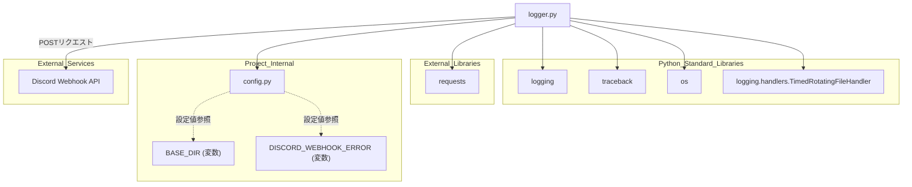

## 1. 解析メタ情報

| 項目 | 内容 |
| --- | --- |
| 対象ファイル | logger.py |
| 言語 | Python |
| 解析対象 | 提供されたコードのみ |
| 推測・補完 | 一切なし |

## 2. ファイルの概要

システム全体のログ出力設定を管轄するモジュール。コンソールへの標準出力、日付単位でローテーションされるファイルへのログ保存、およびエラー発生時（ERRORレベル以上のログ）にスタックトレースを含めてDiscordのWebhookへ自動通知する機能を提供する。

## 3. 外部依存関係

### インポート一覧

| 名称 | 種類 | 用途 | 根拠 |
| --- | --- | --- | --- |
| `logging` | 標準ライブラリ | ログ処理基盤および標準のハンドラ・フォーマッタ機能の提供 | 根拠: `[import logging]` (行番号: 1 / 抜粋: "import logging") |
| `traceback` | 標準ライブラリ | 例外情報およびコールスタックからのスタックトレース文字列生成 | 根拠: `[import traceback]` (行番号: 2 / 抜粋: "import traceback") |
| `os` | 標準ライブラリ | パス結合（`os.path.join`）およびディレクトリ作成（`os.makedirs`） | 根拠: `[import os]` (行番号: 3 / 抜粋: "import os") |
| `requests` | 外部ライブラリ | DiscordのWebhook URLに対するHTTP POSTリクエストの送信 | 根拠: `[import requests]` (行番号: 4 / 抜粋: "import requests") |
| `TimedRotatingFileHandler` | 標準ライブラリ | 日付変更（深夜）のタイミングで行われるログファイルのローテーション処理 | 根拠: `[TimedRotatingFileHandler]` (行番号: 5 / 抜粋: "from logging.handlers import T...") |
| `config` | 内部モジュール（推測） | ログ保存先ディレクトリやWebhook URLなどのシステム設定値の提供 | 根拠: `[import config]` (行番号: 6 / 抜粋: "import config") |

### ブラックボックスとなる外部要素

| 名称 | 理由 | 根拠 |
| --- | --- | --- |
| `config.DISCORD_WEBHOOK_ERROR` | `config`モジュールの実装が提供されておらず、Webhook送信先の実際のURL文字列が不明であるため。 | 根拠: `[config.DISCORD_WEBHOOK_ERROR]` (行番号: 21 / 抜粋: "config.DISCORD_WEBHOOK_ERROR") |
| `config.BASE_DIR` | `config`モジュールの実装が提供されておらず、ログディレクトリが作成されるベースとなるルートパスが不明であるため。 | 根拠: `[config.BASE_DIR]` (行番号: 61 / 抜粋: "config.BASE_DIR") |

## 4. 主要要素の定義（関数 / エンドポイント / コンポーネント）

### `DiscordErrorHandler`

* **役割**: エラーログをDiscordに通知するカスタムハンドラ。`logging.Handler`を継承し、指定されたWebhook URLの保持を担う。
* 根拠: `[DiscordErrorHandler]` (行番号: 9〜14 / 抜粋: "class DiscordErrorHandler(logg...")

* **引数/リクエスト**: `webhook_url` (型: 明示なし/デフォルト `None`。Discordの通知先URL)
* 根拠: `[__init__]` (行番号: 12 / 抜粋: "def **init**(self, webhook_url...")

* **戻り値/レスポンス**: なし
* 根拠: `[__init__]` (行番号: 12〜14 / 抜粋: "def **init**(self, webhook_url...")

* **副作用**: なし
* 根拠: `[__init__]` (行番号: 12〜14 / 抜粋: "self.webhook_url = webhook_url")

* **エラーハンドリング**: なし
* 根拠: `[__init__]` (行番号: 12〜14 / 抜粋: "def **init**(self, webhook_url...")

### `DiscordErrorHandler.emit`

* **役割**: ロガーから渡されたレコードがERRORレベル以上かつメッセージに"Discord"が含まれない場合、スタックトレース（最大1000文字）を付与してWebhook URLへPOST送信する。
* 根拠: `[emit]` (行番号: 16〜42 / 抜粋: "def emit(self, record):")

* **引数/リクエスト**: `record` (型: 明示なし、暗黙的に`logging.LogRecord`。判定およびフォーマット対象のログレコード)
* 根拠: `[emit]` (行番号: 16 / 抜粋: "def emit(self, record):")

* **戻り値/レスポンス**: なし (URLが存在しない場合は早期 `return`)
* 根拠: `[return]` (行番号: 22〜23 / 抜粋: "if not url:\n    return")

* **副作用**: `requests.post`によるDiscord Webhookへの外部API通信。
* 根拠: `[requests.post]` (行番号: 40 / 抜粋: "requests.post(url, json=payloa...")

* **エラーハンドリング**: `requests.post`等の処理中に発生した全ての例外(`Exception`)をキャッチし、`pass`で握りつぶす。
* 根拠: `[except Exception]` (行番号: 41〜42 / 抜粋: "except Exception:\n    pass")

### `setup_logging`

* **役割**: 指定された名前でロガーを初期化し、既存のハンドラをクリアした後、コンソール出力、ファイル出力（ローテーション設定）、Discord通知の3種のハンドラを登録して返す。
* 根拠: `[setup_logging]` (行番号: 44〜84 / 抜粋: "def setup_logging(name: str, w...")

* **引数/リクエスト**: `name` (型: `str`。取得するロガーの名前)、`webhook_url` (型: `str`、デフォルト `None`。Discord通知先URL)
* 根拠: `[setup_logging]` (行番号: 44 / 抜粋: "def setup_logging(name: str, w...")

* **戻り値/レスポンス**: `logging.Logger` (セットアップが完了したロガーインスタンス)
* 根拠: `[戻り値の型アノテーションおよびreturn]` (行番号: 44, 84 / 抜粋: "-> logging.Logger:\n    ...\n    return logger")

* **副作用**: `os.makedirs`によるローカルファイルシステムのディレクトリ作成（存在しない場合）、およびローカルファイル（`home_system.log`）への書き込みストリームの生成。
* 根拠: `[os.makedirs]` (行番号: 61〜63 / 抜粋: "os.makedirs(log_dir, exist_ok=...")

* **エラーハンドリング**: なし（明示的な例外捕捉は行われていない）
* 根拠: `[setup_logging関数全体]` (行番号: 44〜84 / 抜粋: "def setup_logging(name: str, w...")

## 5. 処理フロー図

```mermaid
flowchart TD
    subgraph setup_logging_Flow["setup_logging() 処理フロー"]
        S1["開始"] --> S2["ロガー取得 (プロパゲート無効化)"]
        S2 --> S3{"既存ハンドラがあるか"}
        S3 -- Yes --> S4["ハンドラをクリア"]
        S3 -- No --> S5["ログレベル(INFO)・フォーマッタ設定"]
        S4 --> S5
        S5 --> S6["コンソール出力用 StreamHandler 追加"]
        S6 --> S7["外部：os.makedirs(ディレクトリ作成)"]
        S7 --> S8["ファイル出力用 TimedRotatingFileHandler 追加"]
        S8 --> S9{"Discord通知用URL(引数 or config)が存在するか"}
        S9 -- Yes --> S10["DiscordErrorHandler 追加"]
        S9 -- No --> S11["設定済みロガーを返却"]
        S10 --> S11
        S11 --> S12["終了"]
    end

    subgraph emit_Flow["DiscordErrorHandler.emit() 処理フロー"]
        E1["開始: ログイベント検知"] --> E2{"レベルがERROR以上 かつ<br>'Discord'をメッセージに含まないか"}
        E2 -- Yes --> E3["Webhook URL取得"]
        E2 -- No --> E13["終了 (無視)"]
        E3 --> E4{"URLが存在するか"}
        E4 -- Yes --> E5["ログのフォーマット"]
        E4 -- No --> E13
        E5 --> E6{"record.exc_info が存在するか"}
        E6 -- Yes --> E7["例外情報からスタックトレース生成"]
        E6 -- No --> E8{"レベルがERROR以上か"}
        E8 -- Yes --> E9["現在のスタックからトレース生成"]
        E8 -- No --> E10["スタックトレースなし"]
        E7 --> E11["送信ペイロード作成(最大1000文字のトレース付加)"]
        E9 --> E11
        E10 --> E11
        E11 --> E12["外部：requests.post() で送信"]
        E12 --> E13
    end

```

## 6. 依存関係図

## 7. 次のステップ（リバースエンジニアリングの提案）

| 優先度 | ファイル名(推測可) | 理由 | 根拠 |
| --- | --- | --- | --- |
| 高 | `config.py` | `BASE_DIR`や`DISCORD_WEBHOOK_ERROR`など、システム構成の基幹となる設定値の具体的な内容を確認するため。 | 根拠: `[config.BASE_DIR, config.DISCORD_WEBHOOK_ERROR]` (行番号: 21, 61, 76 / 抜粋: "config.BASE_DIR") |

## 8. 保守上の注意点

* **例外の握りつぶし**: `DiscordErrorHandler.emit` 内における `requests.post` の処理は `except Exception: pass` で囲まれており、Webhookの送信失敗（ネットワークエラー、レート制限、無効なURL等）が発生しても一切のログ・警告が出力されずに無視される。
* **無限ループ防止のハードコード**: メッセージに `"Discord"` という文字列が含まれるとDiscord通知から除外される仕様となっている (`"Discord" not in record.msg`)。他の無関係なログ（例: "Discordアカウントの連携が完了しました"）であってもERRORレベルの場合は通知されない可能性がある。
* **固定された設定値**: ログファイル名が `"home_system.log"`、タイムアウト値が `timeout=5` とコード内にハードコードされており、呼び出し元から変更できない。
* **後方互換性(getattr)**: `target_url`の取得時、`config`から`DISCORD_WEBHOOK_ERROR`を取得する際に `getattr(config, "DISCORD_WEBHOOK_ERROR", None)` を使用している箇所と、`config.DISCORD_WEBHOOK_ERROR` と直接参照している箇所が混在している。前者は属性がない場合に`None`となるが、後者は`AttributeError`でクラッシュする可能性がある（ただし後者は`DiscordErrorHandler`内で後から実行されるため、URLがない場合は設定されない前提かもしれないが、ロジック上の不整合がある）。

## 9. 不明事項一覧

| 項目 | 理由 | 必要なファイル |
| --- | --- | --- |
| `BASE_DIR` の実体パス | ディレクトリパスの起点となる変数の値が当ファイル内では定義されていないため。 | `config.py` |
| `DISCORD_WEBHOOK_ERROR` のURL値 | DiscordのWebhook送信先のエンドポイント文字列が当ファイル内では定義されていないため。 | `config.py` |

## 10. 自己検証結果

* [x] 推測・外部ファイルの仕様を一切含んでいない（完了）
* [x] 全関数・全クラス・全コンポーネントを列挙した（完了）
* [x] 全てのインポート要素を列挙した（完了）
* [x] すべての仕様説明に「根拠（行番号・抜粋）」を明記した（完了）
* [x] 根拠漏れが0件である（完了）
* [x] Mermaid構文にエラーの原因となる記号（エスケープ漏れ）がない（完了）
* [x] 不明事項を漏れなく列挙した（完了）