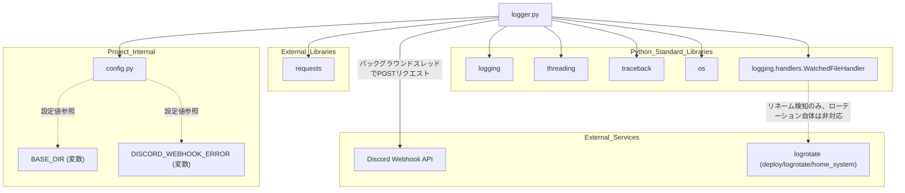

## 1. 解析メタ情報

| 項目 | 内容 |
| --- | --- |
| 対象ファイル | logger.py |
| 言語 | Python |
| 解析対象 | 提供されたコードのみ |
| 推測・補完 | 一切なし |

## 関連ドキュメント

* [config.md](./config.md) - `BASE_DIR`, `DISCORD_WEBHOOK_ERROR`等の設定値を提供
* [common.md](./common.md) - `setup_logging`を再エクスポートする呼び出し元(Facade)
* [nas_utils.md](./nas_utils.md) - `from core.logger import get_logger`で本ファイルの`get_logger`を利用する呼び出し元
* システム内のほぼ全モジュール(`line_handler.md`, `nas_monitor.md`, `sensor_service.md`等多数)が`setup_logging`の呼び出し元

## 2. ファイルの概要

システム全体のログ出力設定を管轄するモジュール。コンソールへの標準出力、ログファイル(`home_system.log`)への書き込み、およびエラー発生時（ERRORレベル以上のログ）にスタックトレースを含めてDiscordのWebhookへ自動通知する機能を提供する。ログファイルのローテーション自体は本ファイルでは行わず、`WatchedFileHandler`（書き込み専用）を用いて外部の`logrotate`にローテーション処理を一元化する設計になっている（`home_system.log`が`unified_server`・`monitors`・cronスクリプト等の複数プロセスから同時に開かれるため、各プロセスが独自にファイルをrenameする方式のハンドラではローテーションが壊れることを避けるための設計、63〜88行目のコメント参照）。Discord通知（`DiscordErrorHandler.emit`）は、Webhook送信中に呼び出し元のスレッドをブロックしないよう、バックグラウンドスレッド上で行われる。`setup_logging`とは別に、同名の呼び出しパターン(`from core.logger import get_logger`)を期待する呼び出し元向けの単純なエイリアス関数`get_logger`も提供する。
* 根拠: `[get_logger]` (行番号: 103〜105 / 抜粋: "def get_logger(name: str) -> logging.Logger:")

## 3. 外部依存関係

### インポート一覧

| 名称 | 種類 | 用途 | 根拠 |
| --- | --- | --- | --- |
| `logging` | 標準ライブラリ | ログ処理基盤および標準のハンドラ・フォーマッタ機能の提供 | 根拠: `[import logging]` (行番号: 1 / 抜粋: "import logging") |
| `threading` | 標準ライブラリ | Discord Webhook送信をバックグラウンドスレッドで実行し、`emit()`呼び出し元をブロックしないようにするため | 根拠: `[import threading]` (行番号: 2 / 抜粋: "import threading") |
| `traceback` | 標準ライブラリ | 例外情報およびコールスタックからのスタックトレース文字列生成 | 根拠: `[import traceback]` (行番号: 3 / 抜粋: "import traceback") |
| `os` | 標準ライブラリ | パス結合（`os.path.join`）およびディレクトリ作成（`os.makedirs`） | 根拠: `[import os]` (行番号: 4 / 抜粋: "import os") |
| `requests` | 外部ライブラリ | DiscordのWebhook URLに対するHTTP POSTリクエストの送信 | 根拠: `[import requests]` (行番号: 5 / 抜粋: "import requests") |
| `WatchedFileHandler` | 標準ライブラリ | ログファイルへの書き込み専用ハンドラ。ファイルのローテーション自体は行わず、外部の`logrotate`によるリネームを検知して出力先を追従する | 根拠: `[WatchedFileHandler]` (行番号: 6 / 抜粋: "from logging.handlers import WatchedFileHandler") |
| `config` | 内部モジュール（推測） | ログ保存先ディレクトリやWebhook URLなどのシステム設定値の提供 | 根拠: `[import config]` (行番号: 7 / 抜粋: "import config") |

### ブラックボックスとなる外部要素

| 名称 | 理由 | 根拠 |
| --- | --- | --- |
| `config.DISCORD_WEBHOOK_ERROR` | `config`モジュールの実装が提供されておらず、Webhook送信先の実際のURL文字列が不明であるため。 | 根拠: `[config.DISCORD_WEBHOOK_ERROR]` (行番号: 24 / 抜粋: "url = self.webhook_url or config.DISCORD_WEBHOOK_ERROR") |
| `config.BASE_DIR` | `config`モジュールの実装が提供されておらず、ログディレクトリが作成されるベースとなるルートパスが不明であるため。 | 根拠: `[config.BASE_DIR]` (行番号: 78 / 抜粋: "log_dir = os.path.join(config.BASE_DIR, \"logs\")") |

## 4. 主要要素の定義（関数 / エンドポイント / コンポーネント）

### `DiscordErrorHandler`

* **役割**: エラーログをDiscordに通知するカスタムハンドラ。`logging.Handler`を継承し、指定されたWebhook URLの保持を担う。`__init__`時に`webhook_url`を明示的に渡された場合はそれを、渡されなければ`emit()`実行時に`config.DISCORD_WEBHOOK_ERROR`をフォールバックとして使用する（コード内コメント「初期化時にWebhook URLを受け取れるようにする」「指定されたURLがあれば使い、なければデフォルト設定を使う」参照）。
* 根拠: `[DiscordErrorHandler]` (行番号: 10〜15 / 抜粋: "class DiscordErrorHandler(logging.Handler):\n    \"\"\"エラーログをDiscordに通知するハンドラ (スタックトレース対応版)\"\"\"\n    # ★追加: 初期化時にWebhook URLを受け取れるようにする\n    def __init__(self, webhook_url=None):")

* **引数/リクエスト**: `webhook_url` (型: 明示なし/デフォルト `None`。Discordの通知先URL)
* 根拠: `[__init__]` (行番号: 13 / 抜粋: "def __init__(self, webhook_url=None):")

* **戻り値/レスポンス**: なし
* 根拠: `[__init__]` (行番号: 13〜15 / 抜粋: "def __init__(self, webhook_url=None):\n        super().__init__()\n        self.webhook_url = webhook_url")

* **副作用**: なし
* 根拠: `[__init__]` (行番号: 15 / 抜粋: "self.webhook_url = webhook_url")

* **エラーハンドリング**: なし
* 根拠: `[__init__]` (行番号: 13〜15 / 抜粋: "def __init__(self, webhook_url=None):")

### `DiscordErrorHandler.emit`

* **役割**: ロガーから渡されたレコードがERRORレベル以上かつメッセージに"Discord"が含まれない場合、スタックトレース（最大1000文字）を付与したペイロードを組み立て、`_send_webhook`をバックグラウンドスレッドで起動してDiscordへ非同期に送信する。`record.msg`は例外オブジェクト等の非文字列が渡される場合もあるため、`str()`化してから`"Discord"`の包含チェックを行う（コード内コメント「record.msg は例外オブジェクト等の非文字列が渡される場合もあるため...」参照）。
* 根拠: `[emit]` (行番号: 18〜52 / 抜粋: "def emit(self, record):\n        # M-5-5(Low): record.msg は例外オブジェクト等の非文字列が渡される場合もあるため、\n        # str化してから比較する(\"Discord\" not in record.msg は非文字列だとTypeErrorになりうる)。\n        if record.levelno >= logging.ERROR and \"Discord\" not in str(record.msg):")
* **（Issue #361 で修正）** (1) スタックトレースは `record.exc_info` がある場合のみ付ける（以前は exc_info の無い ERROR でも `format_stack()` を常に付け、本文が約900字を超えると Discord の2000字制限で 400 になり通知が無言で消えていた）。(2) 本文は `DISCORD_CONTENT_LIMIT`（1900）−200 字で切り詰め、トレースは残り容量の範囲で末尾を付け、最終的な content は `_truncate_discord_content` で 1900 字以内に収める。(3) 送信スレッドは `_register_sender` で追跡し、生存数が `DISCORD_MAX_INFLIGHT_SENDERS`（16）以上なら送信をスキップする。
* 根拠: `if record.exc_info:` (行番号: 87〜88)、`body_limit = DISCORD_CONTENT_LIMIT - 200` (行番号: 92〜94)、`if _inflight_count() >= DISCORD_MAX_INFLIGHT_SENDERS:` (行番号: 110〜111)、`_register_sender(sender)` (行番号: 115)

* **引数/リクエスト**: `record` (型: 明示なし、暗黙的に`logging.LogRecord`。判定およびフォーマット対象のログレコード)
* 根拠: `[emit]` (行番号: 18 / 抜粋: "def emit(self, record):")

* **戻り値/レスポンス**: なし (URLが存在しない場合は早期 `return`)
* 根拠: `[return]` (行番号: 25〜26 / 抜粋: "if not url:\n                    return")

* **副作用**: 条件を満たす場合、`threading.Thread(target=self._send_webhook, ...)`を`daemon=True`で起動する（実際のDiscord Webhookへの外部API通信は`_send_webhook`側で行われる）。
* 根拠: `[threading.Thread起動とコメント]` (行番号: 44〜50 / 抜粋: "# M-5-5: emit()はログ出力のたびにリクエスト処理スレッド上で呼ばれるため、\n                # ここで同期的にrequests.postすると、Discord側が遅い/落ちている場合に\n                # そのスレッドをtimeout秒(最大5秒)ブロックしてしまう。バックグラウンド\n                # スレッドで送信し、emit()自体は即座に返すようにする。\n                threading.Thread(\n                    target=self._send_webhook, args=(url, payload), daemon=True\n                ).start()")

* **エラーハンドリング**: `try`ブロック全体（ペイロード組み立て・スレッド起動）で発生した全ての例外(`Exception`)をキャッチし、`logging.Handler`標準の`self.handleError(record)`に委譲する（`sys.stderr`へ直接書き出すのみでlogging機構を再度通らないため、無限ループにはならない）。
* 根拠: `[except Exception]` (行番号: 51〜54 / 抜粋: "except Exception:\n                # logging.Handler標準のhandleError()を使う。sys.stderrへ直接書き出すのみで\n                # 再度loggingを経由しないため、ここで失敗を握りつぶしても無限ループにはならない。\n                self.handleError(record)")

### `DiscordErrorHandler._send_webhook`（静的メソッド）

* **役割**: `emit`がバックグラウンドスレッドの実行対象として渡す静的メソッド。実際に`requests.post`でDiscord Webhookへペイロードを送信する処理を担う。
* 根拠: `[_send_webhook]` (行番号: 54〜59 / 抜粋: "@staticmethod\n    def _send_webhook(url, payload):\n        try:\n            requests.post(url, json=payload, timeout=5)\n        except Exception:\n            pass")

* **引数/リクエスト**: `url` (型: 明示なし。送信先のDiscord Webhook URL)、`payload` (型: 明示なし、`emit`が組み立てた`dict`。送信するJSONペイロード)
* 根拠: `[引数定義]` (行番号: 55 / 抜粋: "def _send_webhook(url, payload):")

* **戻り値/レスポンス**: なし
* 根拠: `[メソッド本体]` (行番号: 55〜59 / 抜粋: "def _send_webhook(url, payload):\n        try:\n            requests.post(url, json=payload, timeout=5)")

* **副作用**: `requests.post`によるDiscord Webhookへの外部API通信（タイムアウト5秒）。
* 根拠: `[requests.post]` (行番号: 57 / 抜粋: "requests.post(url, json=payload, timeout=5)")

* **エラーハンドリング**: `requests.post`実行中に発生した全ての例外(`Exception`)をキャッチし、`pass`で握りつぶす（バックグラウンドスレッド内の例外を静かに無視する設計）。
* 根拠: `[except Exception]` (行番号: 58〜59 / 抜粋: "except Exception:\n            pass")

### `flush_pending_discord_notifications` / `_truncate_discord_content`（Issue #361 で追加）

* **役割**: `flush_pending_discord_notifications(timeout=5.0)` は送信中の Discord 通知スレッドを最大 timeout 秒まで `join` する。モジュール読み込み時に `atexit.register` されており、cron 起動の短命プロセス（DDD の `newface_monitor.py` 等）で終了間際の ERROR 通知がデーモンスレッドごと殺されて届かなかった問題（D-M2）を防ぐ。`_truncate_discord_content(content, limit=1900)` は上限超過時に「…(切り詰め)」マーカー付きで切り詰める。
* 根拠: `def flush_pending_discord_notifications(timeout: float = DISCORD_ATEXIT_FLUSH_SECONDS) -> None:` (行番号: 39〜48)、`atexit.register(flush_pending_discord_notifications)` (行番号: 51)、`def _truncate_discord_content(content: str, limit: int = DISCORD_CONTENT_LIMIT) -> str:` (行番号: 54〜58)
* **引数/リクエスト**: `timeout: float` / `content: str, limit: int`
* 根拠: (行番号: 39, 54)
* **戻り値/レスポンス**: なし / `str`
* 根拠: (行番号: 39, 58)
* **副作用**: スレッドの join（プロセス終了を最大 timeout 秒遅らせる）
* 根拠: (行番号: 44〜48)
* **エラーハンドリング**: なし
* 根拠: (行番号: 39〜58)

### `setup_logging`

* **役割**: 指定された名前でロガーを初期化し、既存のハンドラをクリアした後、コンソール出力、ファイル出力、Discord通知の3種のハンドラを登録して返す。ロガーの`propagate`を`False`に設定し、rootロガーへの伝播を行わない。
* 根拠: `[setup_logging]` (行番号: 61〜64 / 抜粋: "def setup_logging(name: str, webhook_url: str = None) -> logging.Logger:\n    \"\"\"ロガーのセットアップ\"\"\"\n    logger = logging.getLogger(name)\n    logger.propagate = False")
* **（Issue #384 で修正）** ファイル出力先は `config.LOG_DIR`（書き込み失敗時のフォールバック解決済み）を使う。以前は `config.BASE_DIR/logs` 固定だったため、`LOG_DIR` が `temp_fallback/logs` に落ちた場合に `health_watch`/`log_analyzer` が読む場所と実際の出力先が食い違っていた。
* 根拠: `log_dir = getattr(config, "LOG_DIR", None) or os.path.join(config.BASE_DIR, "logs")` (行番号: 149)

* **引数/リクエスト**: `name` (型: `str`。取得するロガーの名前)、`webhook_url` (型: `str`、デフォルト `None`。Discord通知先URL)
* 根拠: `[setup_logging]` (行番号: 61 / 抜粋: "def setup_logging(name: str, webhook_url: str = None) -> logging.Logger:")

* **戻り値/レスポンス**: `logging.Logger` (セットアップが完了したロガーインスタンス)
* 根拠: `[戻り値の型アノテーションおよびreturn]` (行番号: 61, 100 / 抜粋: "-> logging.Logger:\n    ...\n    return logger")

* **副作用**: `os.makedirs`によるローカルファイルシステムのディレクトリ作成（存在しない場合）、およびログファイル（`home_system.log`）への書き込み用`WatchedFileHandler`の生成。ファイル自体のローテーションは行わず、外部の`logrotate`（`deploy/logrotate/home_system` → `/etc/logrotate.d/home_system`）に委譲する設計であることがコメントに明記されている。
* 根拠: `[os.makedirsとWatchedFileHandlerのコメント]` (行番号: 78〜86 / 抜粋: "log_dir = os.path.join(config.BASE_DIR, \"logs\")\n    os.makedirs(log_dir, exist_ok=True)\n    log_file = os.path.join(log_dir, \"home_system.log\")\n    # home_system.log は unified_server / monitors / cronスクリプト等の複数プロセスが\n    # 同時に開くため、各プロセスが独自にrenameするTimedRotatingFileHandlerでは\n    # ローテーションが壊れる(旧backupへ書き込み続ける)。書き込み専用の\n    # WatchedFileHandlerにし、ローテーションはlogrotate側\n    # (deploy/logrotate/home_system → /etc/logrotate.d/home_system)に一元化する。")

* **エラーハンドリング**: なし（明示的な例外捕捉は行われていない）
* 根拠: `[setup_logging関数全体]` (行番号: 61〜100 / 抜粋: "def setup_logging(name: str, webhook_url: str = None) -> logging.Logger:")

### `get_logger`

* **役割**: `setup_logging()`のエイリアス。`from core.logger import get_logger`という形で本関数を参照する呼び出し元向けに、`webhook_url`を渡さず`setup_logging(name)`をそのまま呼び出して結果を返す。
* 根拠: `[get_logger]` (行番号: 103〜105 / 抜粋: "def get_logger(name: str) -> logging.Logger:\n    \"\"\"setup_logging() のエイリアス。`from core.logger import get_logger` で参照される呼び出し元向け。\"\"\"\n    return setup_logging(name)")

* **引数/リクエスト**: `name` (型: `str`。取得するロガーの名前。`setup_logging`と異なり`webhook_url`引数は受け取らない)
* 根拠: `[関数シグネチャ]` (行番号: 103 / 抜粋: "def get_logger(name: str) -> logging.Logger:")

* **戻り値/レスポンス**: `logging.Logger` (`setup_logging(name)`の戻り値をそのまま返却)
* 根拠: `[return]` (行番号: 105 / 抜粋: "return setup_logging(name)")

* **副作用**: `setup_logging(name)`の呼び出しに伴う副作用（ハンドラの登録、ログディレクトリの作成等）と同一。
* 根拠: `[return setup_logging(name)]` (行番号: 105 / 抜粋: "return setup_logging(name)")

* **エラーハンドリング**: なし（`setup_logging`のエラーハンドリングに依存。`setup_logging`自体も明示的な例外捕捉を持たない）
* 根拠: `[get_logger関数全体]` (行番号: 103〜105 / 抜粋: "def get_logger(name: str) -> logging.Logger:")

## 5. 処理フロー図

```mermaid
flowchart TD
    subgraph setup_logging_Flow["setup_logging() 処理フロー"]
        S1["開始"] --> S2["ロガー取得 (プロパゲート無効化)"]
        S2 --> S3{"既存ハンドラがあるか"}
        S3 -- Yes --> S4["ハンドラをクリア"]
        S3 -- No --> S5["ログレベル(INFO)・フォーマッタ設定"]
        S4 --> S5
        S5 --> S6["コンソール出力用 StreamHandler 追加"]
        S6 --> S7["外部：os.makedirs(ディレクトリ作成)"]
        S7 --> S8["ファイル出力用 WatchedFileHandler 追加<br>(ローテーションはlogrotateへ委譲)"]
        S8 --> S9{"Discord通知用URL(引数 or config)が存在するか"}
        S9 -- Yes --> S10["DiscordErrorHandler 追加"]
        S9 -- No --> S11["設定済みロガーを返却"]
        S10 --> S11
        S11 --> S12["終了"]
    end

    subgraph emit_Flow["DiscordErrorHandler.emit() 処理フロー"]
        E1["開始: ログイベント検知"] --> E2{"レベルがERROR以上 かつ<br>str(msg)に'Discord'を含まないか"}
        E2 -- Yes --> E3["Webhook URL取得"]
        E2 -- No --> E13["終了 (無視)"]
        E3 --> E4{"URLが存在するか"}
        E4 -- Yes --> E5["ログのフォーマット"]
        E4 -- No --> E13
        E5 --> E6{"record.exc_info が存在するか"}
        E6 -- Yes --> E7["例外情報からスタックトレース生成"]
        E6 -- No --> E8{"レベルがERROR以上か"}
        E8 -- Yes --> E9["現在のスタックからトレース生成"]
        E8 -- No --> E10["スタックトレースなし"]
        E7 --> E11["送信ペイロード作成(最大1000文字のトレース付加)"]
        E9 --> E11
        E10 --> E11
        E11 --> E14["外部：threading.Threadでバックグラウンド起動<br>(daemon=True)"]
        E14 --> E13

        subgraph send_webhook_Flow["_send_webhook() (バックグラウンドスレッド)"]
            E15["開始"] --> E16["外部：requests.post() で送信 (timeout=5)"]
            E16 --> E17["終了 (例外はpassで握りつぶす)"]
        end
        E14 -.->|別スレッドで実行| E15
    end

```

## 6. 依存関係図

```mermaid
graph TD
    LoggerPY["logger.py"]
    
    subgraph Python_Standard_Libraries
        Logging["logging"]
        Threading["threading"]
        Traceback["traceback"]
        OS["os"]
        WatchedHandler["logging.handlers.WatchedFileHandler"]
    end
    
    subgraph External_Libraries
        Requests["requests"]
    end
    
    subgraph Project_Internal
        Config["config.py"]
        BaseDir["BASE_DIR (変数)"]
        DiscordWebhook["DISCORD_WEBHOOK_ERROR (変数)"]
    end
    
    subgraph External_Services
        DiscordAPI["Discord Webhook API"]
        Logrotate["logrotate (deploy/logrotate/home_system)"]
    end

    LoggerPY --> Logging
    LoggerPY --> Threading
    LoggerPY --> Traceback
    LoggerPY --> OS
    LoggerPY --> WatchedHandler
    LoggerPY --> Requests
    LoggerPY --> Config
    
    Config -.->|設定値参照| BaseDir
    Config -.->|設定値参照| DiscordWebhook
    
    LoggerPY -->|バックグラウンドスレッドでPOSTリクエスト| DiscordAPI
    WatchedHandler -.->|リネーム検知のみ、ローテーション自体は非対応| Logrotate

```

`LoggerPY`ノードは`setup_logging`と、それをそのまま呼び出す`get_logger`(103〜105行目)の両方を含むファイル全体を表す。`get_logger`は`setup_logging`と同じ外部依存関係(上記の各ノード)をそのまま利用するため、依存関係図としては別ノードを追加していない。

## 7. 次のステップ（リバースエンジニアリングの提案）

| 優先度 | ファイル名(推測可) | 理由 | 根拠 |
| --- | --- | --- | --- |
| 高 | `config.py` | `BASE_DIR`や`DISCORD_WEBHOOK_ERROR`など、システム構成の基幹となる設定値の具体的な内容を確認するため。 | 根拠: `[config.BASE_DIR, config.DISCORD_WEBHOOK_ERROR]` (行番号: 24, 78, 92 / 抜粋: "config.BASE_DIR") |
| 中 | `deploy/logrotate/home_system` | `WatchedFileHandler`が書き込み専用で、実際のログローテーション設定（保持期間・サイズ上限等）がこの外部設定ファイルに委譲されているため、具体的なローテーション条件を確認するには本ファイルの解析が必要。 | 根拠: `[WatchedFileHandler導入コメント]` (行番号: 81〜85 / 抜粋: "# WatchedFileHandlerにし、ローテーションはlogrotate側\n    # (deploy/logrotate/home_system → /etc/logrotate.d/home_system)に一元化する。") |

## 8. 保守上の注意点

* **例外の握りつぶし**: `_send_webhook` は `except Exception: pass` で囲まれており、Webhookの送信失敗（ネットワークエラー、レート制限、無効なURL等）が発生しても一切のログ・警告が出力されずに無視される。一方 `DiscordErrorHandler.emit` はペイロード組み立て・スレッド起動時の例外を `self.handleError(record)`（`logging.Handler`標準機構）に委譲するよう変更されており、`sys.stderr`へ出力されるため、ハンドラの不調自体は検知可能になっている（Issue #288）。
* **バックグラウンドスレッドでの送信**: `emit`は`_send_webhook`を`daemon=True`のバックグラウンドスレッドで起動して即座に返る設計のため、`emit()`が例外なく完了しても、実際のWebhook送信自体が成功したかどうかは呼び出し元からは分からない（`_send_webhook`内の例外も同様に握りつぶされる）。
* **無限ループ防止のハードコード**: メッセージ（`str()`化後）に `"Discord"` という文字列が含まれるとDiscord通知から除外される仕様となっている (`"Discord" not in str(record.msg)`)。他の無関係なログ（例: "Discordアカウントの連携が完了しました"）であってもERRORレベルの場合は通知されない可能性がある。
* **固定された設定値**: ログファイル名が `"home_system.log"`、タイムアウト値が `timeout=5` とコード内にハードコードされており、呼び出し元から変更できない。
* **後方互換性(getattr)**: `target_url`の取得時、`config`から`DISCORD_WEBHOOK_ERROR`を取得する際に `getattr(config, "DISCORD_WEBHOOK_ERROR", None)` を使用している箇所(92行目)と、`config.DISCORD_WEBHOOK_ERROR` と直接参照している箇所(24行目)が混在している。前者は属性がない場合に`None`となるが、後者は`AttributeError`でクラッシュする可能性がある（ただし後者は`DiscordErrorHandler`内で後から実行されるため、URLがない場合は設定されない前提かもしれないが、ロジック上の不整合がある）。

## 9. 不明事項一覧

| 項目 | 理由 | 必要なファイル |
| --- | --- | --- |
| `BASE_DIR` の実体パス | ディレクトリパスの起点となる変数の値が当ファイル内では定義されていないため。 | `config.py` |
| `DISCORD_WEBHOOK_ERROR` のURL値 | DiscordのWebhook送信先のエンドポイント文字列が当ファイル内では定義されていないため。（`config.py`は直接確認できたが、実値は環境変数由来のためリポジトリ内には存在せず解消不可） | `config.py` |
| `deploy/logrotate/home_system` の具体的なローテーション条件 | `WatchedFileHandler`はファイルのリネームを検知して出力先を追従するのみで、実際の保持期間・サイズ上限・ローテーション頻度は本ファイルには一切記述されていないため。 | `deploy/logrotate/home_system` |

## 相互参照による補足情報

| 元の不明事項 | 判明した内容 | 参照元ドキュメント |
| --- | --- | --- |
| `BASE_DIR` の実体パス | `MY_HOME_SYSTEM/config.py`220行目を直接確認した。`BASE_DIR: str = os.path.dirname(os.path.abspath(__file__))`と定義されており、`config.py`自身が配置されているディレクトリ、すなわち`MY_HOME_SYSTEM`ディレクトリの絶対パスであることを確認した。 | 直接ソース確認: `MY_HOME_SYSTEM/config.py:220` |
| `DISCORD_WEBHOOK_ERROR` のURL値 | `MY_HOME_SYSTEM/config.py`202行目を直接確認した。`DISCORD_WEBHOOK_ERROR: Optional[str] = os.getenv("DISCORD_WEBHOOK_ERROR")`と定義されており、環境変数から取得する`Optional[str]`型であることを確認した。実際のWebhook URL文字列そのものは環境変数由来のためリポジトリ内には存在しない。 | 直接ソース確認: `MY_HOME_SYSTEM/config.py:202` |

## 10. 自己検証結果

* [x] 推測・外部ファイルの仕様を一切含んでいない（完了）
* [x] 全関数・全クラス・全コンポーネントを列挙した（完了）
* [x] 全てのインポート要素を列挙した（完了）
* [x] すべての仕様説明に「根拠（行番号・抜粋）」を明記した（完了）
* [x] 根拠漏れが0件である（完了）
* [x] Mermaid構文にエラーの原因となる記号（エスケープ漏れ）がない（完了）
* [x] 不明事項を漏れなく列挙した（完了）
