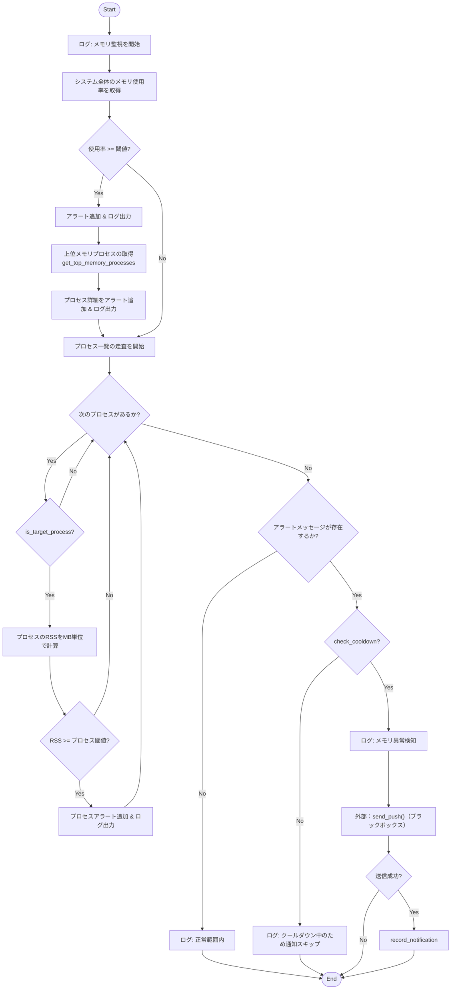
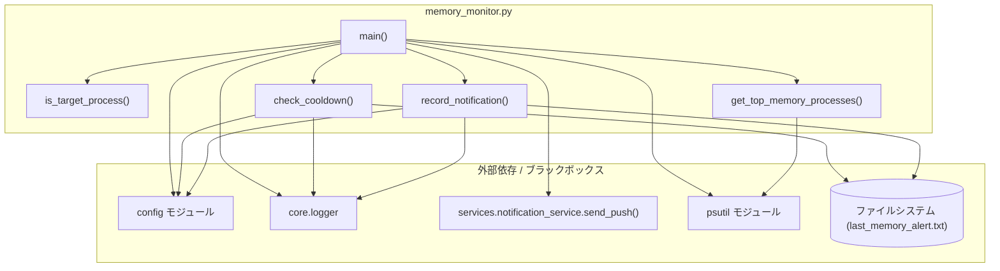

## 1. 解析メタ情報

| 項目 | 内容 |
| --- | --- |
| 対象ファイル | memory_monitor.py |
| 言語 | Python |
| 解析対象 | 提供されたコードのみ |
| 推測・補完 | 一切なし |

## 2. ファイルの概要

* システム全体のメモリ使用率、および特定の対象プロセス（MY_HOME_SYSTEM関連）のメモリ消費量を監視する。
* メモリ使用率や消費量が閾値（設定ファイルまたはデフォルト値）を超えた場合、プロセス情報を収集して外部へプッシュ通知を送信する。
* 頻回な通知を防ぐため、ファイルを用いたクールダウン機能を有する。

## 3. 外部依存関係

### インポート一覧

| 名称 | 種類 | 用途 | 根拠 |
| --- | --- | --- | --- |
| `os` | 標準ライブラリ | パス操作、ディレクトリ作成、ファイル存在確認 | `import os` (行番号: 1) |
| `sys` | 標準ライブラリ | システムパス (`sys.path`) へのプロジェクトルート追加 | `import sys` (行番号: 2) |
| `time` | 標準ライブラリ | 現在時刻の取得 (クールダウン判定・記録用) | `import time` (行番号: 3) |
| `typing` (`List`, `Dict`, `Any`, `Tuple`) | 標準ライブラリ | 型ヒントの定義 | `from typing import ...` (行番号: 4) |
| `psutil` | 外部ライブラリ | システム全体のメモリ情報やプロセス情報の取得 | `import psutil` (行番号: 6) |
| `config` | 内部モジュール | 各種設定値（閾値、クールダウン秒数、通知先等）の取得 | `import config` (行番号: 13) |
| `setup_logging` | 内部モジュール | ロガーの初期化 | `from core.logger import setup_logging` (行番号: 14) |
| `send_push` | 内部モジュール | 外部への通知送信 | `from services.notification_service import send_push` (行番号: 15) |

### ブラックボックスとなる外部要素

| 名称 | 理由 | 根拠 |
| --- | --- | --- |
| `config` モジュールの各設定値 | 具体的な設定値や環境変数からの読み込みロジックが現在のファイルには含まれていないため不明 | `getattr(config, "...", ...)` (行番号: 31, 32, 53, 90, 100, 120, 122) |
| `setup_logging` の実装 | ログの出力先、フォーマット等の詳細が不明 | `logger = setup_logging("memory_monitor")` (行番号: 17) |
| `send_push` の実装 | APIエンドポイント、通信リトライ処理の有無、エラーハンドリングの詳細が不明 | `success = send_push(...)` (行番号: 121) |

## 4. 主要要素の定義（関数 / エンドポイント / コンポーネント）

### `is_target_process`

* **役割**: コマンドライン引数を文字列結合して評価し、"python" を含み、かつ特定の文字列 ("my_home_system", "unified_server.py", "monitors/") を含むプロセスであるかを判定する。
* 根拠: `def is_target_process(cmdline: List[str]) -> bool:` (行番号: 19〜27 / 抜粋: `if "python" in cmd_str and...`)

* **引数/リクエスト**: `cmdline` (`List[str]`) プロセスの起動コマンドライン引数リスト。
* 根拠: `cmdline: List[str]` (行番号: 19 / 抜粋: `def is_target_process(cmdline:...`)

* **戻り値/レスポンス**: `bool` 対象プロセスであれば `True`、そうでなければ `False`。
* 根拠: `-> bool:` (行番号: 19 / 抜粋: `return True`, `return False`)

* **副作用**: なし
* 根拠: 該当関数内に外部状態を変更する処理なし (行番号: 19〜27)

* **エラーハンドリング**: `cmdline` が空または `None` の場合、即座に `False` を返す。
* 根拠: `if not cmdline: return False` (行番号: 21〜22)

### `check_cooldown`

* **役割**: 前回通知を送信した時刻が記録されたファイルを読み込み、現在時刻との差が設定されたクールダウン秒数を超えているか判定する。
* 根拠: `def check_cooldown() -> bool:` (行番号: 29〜49 / 抜粋: `if time.time() - last_time >...`)

* **引数/リクエスト**: なし
* 根拠: `def check_cooldown() -> bool:` (行番号: 29)

* **戻り値/レスポンス**: `bool` 通知可能（クールダウン経過済み、またはファイル非存在・エラー時）なら `True`、待機中なら `False`。
* 根拠: `-> bool:` (行番号: 29 / 抜粋: `return True`, `return False`)

* **副作用**: ファイルシステムへのリードアクセス（前回通知時刻ファイルの読み込み）。
* 根拠: `with open(last_notify_file, "r") as f:` (行番号: 38)

* **エラーハンドリング**: ファイルの読み込みやパース時に例外が発生した場合は、警告ログを出力した上で通知を優先するため `True` を返す。
* 根拠: `except Exception as e:` (行番号: 45〜47 / 抜粋: `return True # エラー時は通知を優先`)

### `record_notification`

* **役割**: 現在のUNIXタイムスタンプを文字列として記録ファイルに書き込む。
* 根拠: `def record_notification() -> None:` (行番号: 51〜59 / 抜粋: `f.write(str(time.time()))`)

* **引数/リクエスト**: なし
* 根拠: `def record_notification() -> None:` (行番号: 51)

* **戻り値/レスポンス**: `None`
* 根拠: `-> None:` (行番号: 51)

* **副作用**: ファイルシステムへのライトアクセス（ディレクトリの作成、ファイルへの書き込み）。
* 根拠: `os.makedirs(...)`, `with open(..., "w") as f:` (行番号: 55〜56)

* **エラーハンドリング**: ディレクトリ作成またはファイル書き込みに失敗した場合はエラーログを出力する（例外を上位へ送出しない）。
* 根拠: `except Exception as e:` (行番号: 58〜59 / 抜粋: `logger.error(...)`)

### `get_top_memory_processes`

* **役割**: 実行中の全プロセスからメモリ（RSS）使用量を取得し、上位 `limit` 件を降順でソートしてフォーマットされた文字列として返す。
* 根拠: `def get_top_memory_processes(limit: int = 5) -> str:` (行番号: 61〜83 / 抜粋: `process_list.sort(...)`, `top_procs = ...`)

* **引数/リクエスト**: `limit` (`int`) 取得する上位プロセスの数。デフォルト値は5。
* 根拠: `limit: int = 5` (行番号: 61)

* **戻り値/レスポンス**: `str` 上位プロセスのPID、プロセス名、メモリ使用量(MB)を含む複数行の文字列。
* 根拠: `-> str:` (行番号: 61 / 抜粋: `return "\n".join(lines)`)

* **副作用**: なし
* 根拠: `psutil` を用いた情報取得のみ (行番号: 61〜83)

* **エラーハンドリング**: ループ内でプロセス取得中に発生する `psutil.NoSuchProcess`, `psutil.AccessDenied`, `psutil.ZombieProcess` 例外を捕捉し、スキップする。
* 根拠: `except (psutil.NoSuchProcess, psutil.AccessDenied, psutil.ZombieProcess): continue` (行番号: 71〜73)

### `main`

* **役割**: システム全体のメモリ使用率チェックと、個別プロセスのメモリチェックを実行し、閾値を超過した場合はアラートメッセージを生成。アラートが存在し、かつクールダウン期間外であれば外部へ通知を送信し、通知時刻を記録する。
* 根拠: `def main() -> None:` (行番号: 85〜132 / 抜粋: `if mem_percent >= sys_threshold:`, `if check_cooldown():... send_push(...)`)

* **引数/リクエスト**: なし
* 根拠: `def main() -> None:` (行番号: 85)

* **戻り値/レスポンス**: `None`
* 根拠: `-> None:` (行番号: 85)

* **副作用**: 外部APIへの通信（`send_push`）、ログファイルへの書き込み（`logger`）、ファイルシステムへのアクセス（`check_cooldown`, `record_notification` の呼び出し）。
* 根拠: `send_push(...)` (行番号: 121〜126), `record_notification()` (行番号: 129)

* **エラーハンドリング**:
* プロセスごとのメモリチェックループ内で、プロセス状態に起因する例外（`NoSuchProcess` 等）を捕捉しスキップする。
* それ以外の予期せぬ例外は `Exception` で捕捉し、エラーログを出力する。
* 根拠: `except (psutil.NoSuchProcess, ...) as e:` (行番号: 111〜113), `except Exception as e:` (行番号: 114〜115 / 抜粋: `logger.error(...)`)

## 5. 処理フロー図

## 6. 依存関係図

## 7. 次のステップ（リバースエンジニアリングの提案）

| 優先度 | ファイル名(推測可) | 理由 | 根拠 |
| --- | --- | --- | --- |
| 高 | `config.py` または `.env` 等の設定ファイル | 各種閾値や通知先ID、記録ファイルのパスなど、動作の根幹となるパラメータが定義されているため。 | `getattr(config, "MEMORY_ALERT_PERCENT", 85.0)` 等 (行番号: 90 他) |
| 中 | `services/notification_service.py` | `send_push` 関数の詳細な実装（通知プラットフォームの仕様、リトライロジックなど）を確認するため。 | `from services.notification_service import send_push` (行番号: 15) |
| 低 | `core/logger.py` | ログの保存先、ローテーション、重要度の扱いなどの全体方針を把握するため。 | `from core.logger import setup_logging` (行番号: 14) |

## 8. 保守上の注意点

* `check_cooldown` 関数は、ファイル読み込み時やパース時に例外が発生した場合（ファイル破損、パーミッションエラー等）に `True` を返す設計となっている。これにより異常時でも通知が阻害されない Fail-Safe（通知優先）な挙動になっている。
* `record_notification` 関数はファイルの書き込みに失敗した場合にエラーログを出力するが、上位に例外を投げない。これにより通知処理自体は成功した扱いとしてメインプロセスは続行される。
* `psutil.process_iter` は OS 側でプロセスが終了・権限不足になった際に例外を投げるため、`except (psutil.NoSuchProcess, psutil.AccessDenied, psutil.ZombieProcess)` による Fail-Soft な処理が実装されている。
* `is_target_process` で判定するプロセス名の条件はハードコードされている（"my_home_system", "unified_server.py", "monitors/"）。監視対象プロセスが変更された場合は、この関数の修正が必要になる。

## 9. 不明事項一覧

| 項目 | 理由 | 必要なファイル |
| --- | --- | --- |
| `config`の各設定値の実態 | `getattr` の第2引数としてデフォルト値が設定されているものの、本番環境での実際の値や環境変数からのマッピング方法が不明 | `config.py` |
| `send_push`の通信成否条件 | 戻り値 `success` が `True` となる条件（HTTP 200 OK に限定されるか等）やエラー時の再送処理の有無が不明 | `services/notification_service.py` |

## 10. 自己検証結果

* [x] 完了: 推測・外部ファイルの仕様を一切含んでいない
* [x] 完了: 全関数・全クラス・全コンポーネントを列挙した
* [x] 完了: 全てのインポート要素を列挙した
* [x] 完了: すべての仕様説明に「根拠（行番号・抜粋）」を明記した
* [x] 完了: 根拠漏れが0件である
* [x] 完了: Mermaid構文にエラーの原因となる記号（エスケープ漏れ）がない
* [x] 完了: 不明事項を漏れなく列挙した