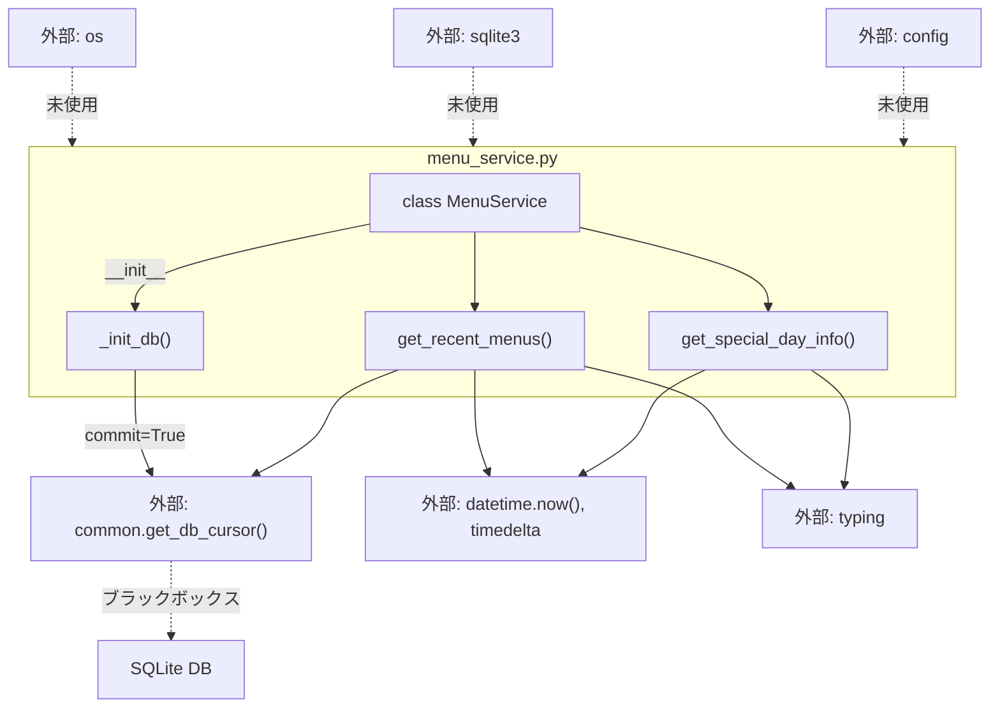

## 1. 解析メタ情報

| 項目 | 内容 |
| --- | --- |
| 対象ファイル | `menu_service.py` |
| 言語 | Python |
| 解析対象 | 提供されたコードのみ |
| 推測・補完 | 一切なし |

## 2. ファイルの概要

晩御飯のメニュー提案を支援するためのバックエンドサービス。SQLiteデータベースを用いた夕食履歴（直近n日間）の取得、および現在日時を基準とした特別な日（給料日やボーナス日）の判定処理を提供する。

## 3. 外部依存関係

### インポート一覧

| 名称 | 種類 | 用途 | 根拠 |
| --- | --- | --- | --- |
| `os` | 標準ライブラリ | 未使用（用途不明） | 根拠: import文 (行番号: 2 / 抜粋: `import os`) |
| `logging` | 標準ライブラリ | ロガーの取得およびエラー発生時のログ出力 | 根拠: import文、ロガー初期化 (行番号: 3, 13 / 抜粋: `logger = logging.getLogger('Me`) |
| `datetime` | 標準ライブラリ | 現在日時の取得 | 根拠: import文 (行番号: 4 / 抜粋: `from datetime import datetime,`) |
| `timedelta` | 標準ライブラリ | 過去日付（n日前）の計算 | 根拠: import文 (行番号: 4 / 抜粋: `from datetime import datetime,`) |
| `List`, `Optional`, `Tuple` | 標準ライブラリ | 型アノテーション | 根拠: import文 (行番号: 5 / 抜粋: `from typing import List, Optio`) |
| `sqlite3` | 標準ライブラリ | 未使用（DB操作は`common`モジュールに委譲） | 根拠: import文 (行番号: 6 / 抜粋: `import sqlite3`) |
| `common` | 自作モジュール | データベースカーソルの取得とリソース管理 | 根拠: import文 (行番号: 9 / 抜粋: `import common`) |
| `config` | 自作モジュール | 未使用（用途不明） | 根拠: import文 (行番号: 10 / 抜粋: `import config`) |

### ブラックボックスとなる外部要素

| 名称 | 理由 | 根拠 |
| --- | --- | --- |
| `common.get_db_cursor` | 接続先のデータベースパス、トランザクション管理（commit/rollback）の具体的な挙動、およびカーソル取得失敗時（`None`返却時）の詳細な条件が提供コード外のため判断不可。 | 根拠: 関数呼び出し (行番号: 33 / 抜粋: `with common.get_db_cursor(comm`) |

## 4. 主要要素の定義（関数 / エンドポイント / コンポーネント）

### `MenuService` (Class)

* **役割**: 晩御飯のメニュー提案支援サービスにおける主要なロジック（DB初期化、履歴取得、特別日判定）をカプセル化するクラス。
* 根拠: クラス定義 (行番号: 15〜100 / 抜粋: `class MenuService:`)

* **引数/リクエスト**: なし
* 根拠: クラス定義 (行番号: 15 / 抜粋: `class MenuService:`)

* **戻り値/レスポンス**: `MenuService` インスタンス
* 根拠: インスタンス化 (行番号: 105 / 抜粋: `service = MenuService()`)

* **副作用**: クラス変数として `PAYDAY_DAY` と `BONUS_DATES` をメモリ上に保持する。
* 根拠: クラス変数定義 (行番号: 23〜24 / 抜粋: `PAYDAY_DAY: int = 25`)

* **エラーハンドリング**: なし
* 根拠: クラス定義直下に例外処理なし (行番号: 15〜24 / 抜粋: `class MenuService:`)

### `__init__`

* **役割**: インスタンス生成時に呼び出され、データベースの初期化処理を実行する。
* 根拠: メソッド定義 (行番号: 26〜28 / 抜粋: `def __init__(self) -> None:`)

* **引数/リクエスト**: `self`
* 根拠: メソッド定義 (行番号: 26 / 抜粋: `def __init__(self) -> None:`)

* **戻り値/レスポンス**: `None`
* 根拠: 型アノテーション (行番号: 26 / 抜粋: `-> None:`)

* **副作用**: 内部で `_init_db()` を呼び出し、データベースの状態を変更する可能性がある。
* 根拠: メソッド呼び出し (行番号: 28 / 抜粋: `self._init_db()`)

* **エラーハンドリング**: なし（例外は `_init_db` 内で処理される）
* 根拠: メソッド内にtry-except文なし (行番号: 26〜28 / 抜粋: `self._init_db()`)

### `_init_db`

* **役割**: `food_records` テーブルが存在しない場合に新規作成するSQLを実行する。
* 根拠: メソッド定義 (行番号: 30〜45 / 抜粋: `CREATE TABLE IF NOT EXISTS foo`)

* **引数/リクエスト**: `self`
* 根拠: メソッド定義 (行番号: 30 / 抜粋: `def _init_db(self) -> None:`)

* **戻り値/レスポンス**: `None`
* 根拠: 型アノテーション (行番号: 30 / 抜粋: `-> None:`)

* **副作用**: `common.get_db_cursor` 経由でデータベースにテーブル（`food_records`）を作成する。
* 根拠: SQL実行 (行番号: 36〜43 / 抜粋: `cursor.execute('''`)

* **エラーハンドリング**: テーブル作成時の全ての `Exception` をキャッチし、ロガーでエラーメッセージ（`❌ DB初期化エラー: ...`）を出力する。
* 根拠: 例外処理 (行番号: 44〜45 / 抜粋: `except Exception as e:`)

### `get_recent_menus`

* **役割**: 実行時点から指定された日数前以降の夕食履歴（日付とメニュー名）をデータベースから降順で取得し、フォーマットして返す。
* 根拠: メソッド定義 (行番号: 47〜75 / 抜粋: `SELECT date, menu FROM food_re`)

* **引数/リクエスト**: `days` (`int` 型、デフォルト値: `7`)
* 根拠: 引数定義 (行番号: 47 / 抜粋: `def get_recent_menus(self, day`)

* **戻り値/レスポンス**: `List[str]` （"YYYY-MM-DD: メニュー名" の形式の文字列リスト。カーソル未取得時やエラー時は空リストを返す）
* 根拠: 戻り値生成 (行番号: 71 / 抜粋: `return [f"{r['date']}: {r['men`)

* **副作用**: データベースに対する読み取り処理（SELECT）。
* 根拠: SQL実行 (行番号: 65〜68 / 抜粋: `cursor.execute(`)

* **エラーハンドリング**: DB接続やクエリ実行時の全ての `Exception` をキャッチし、ロガーでエラーメッセージを出力した後、空のリスト `[]` を返す。
* 根拠: 例外処理 (行番号: 73〜75 / 抜粋: `except Exception as e:`)

### `get_special_day_info`

* **役割**: 実行時点の日付が、あらかじめ定義された給料日（25日）またはボーナス日（6月10日、12月10日）と一致するか判定し、該当する場合は特別な日の名称を返す。
* 根拠: メソッド定義 (行番号: 77〜100 / 抜粋: `def get_special_day_info(self)`)

* **引数/リクエスト**: `self`
* 根拠: メソッド定義 (行番号: 77 / 抜粋: `def get_special_day_info(self)`)

* **戻り値/レスポンス**: `Optional[str]` （条件に合致した場合は "給料日💰" や "ボーナス日🎉"、両方の場合は "&" で結合した文字列。該当しない場合は `None`）
* 根拠: 戻り値生成 (行番号: 98〜100 / 抜粋: `return " & ".join(special_mess`)

* **副作用**: なし
* 根拠: メソッド内に外部リソースへのアクセスなし (行番号: 77〜100 / 抜粋: `today = datetime.now()`)

* **エラーハンドリング**: なし
* 根拠: メソッド内に例外処理なし (行番号: 77〜100 / 抜粋: `if special_messages:`)

## 5. 処理フロー図

※ファイル実行時（`__name__ == "__main__"`）の全体の流れを示す。

```mermaid
flowchart TD
    Start([開始]) --> CheckMain{"__name__ == '__main__' ?"}
    
    CheckMain -- Yes --> InitLog["logging.basicConfig設定"]
    InitLog --> Instantiate["MenuService インスタンス生成"]
    Instantiate --> CallInitDB["内部：_init_db() 呼び出し"]
    CallInitDB --> GetCursor1["外部：common.get_db_cursor(commit=True)"]
    GetCursor1 --> CheckCursor1{"cursor != None ?"}
    CheckCursor1 -- Yes --> ExecDDL["CREATE TABLE文実行"]
    CheckCursor1 -- No --> CloseDB1["DB処理スキップ"]
    ExecDDL --> CloseDB1
    CloseDB1 --> CallSpecialDay["get_special_day_info() 呼び出し"]
    
    CallSpecialDay --> GetNow1["現在日時取得 (datetime.now)"]
    GetNow1 --> CheckPayday{"day == 25 ?"}
    CheckPayday -- Yes --> AddPaydayStr["'給料日💰' をリストに追加"]
    CheckPayday -- No --> CheckBonus{"(month, day) in [(6,10), (12,10)] ?"}
    AddPaydayStr --> CheckBonus
    CheckBonus -- Yes --> AddBonusStr["'ボーナス日🎉' をリストに追加"]
    CheckBonus -- No --> CheckList{"リストに要素あり ?"}
    AddBonusStr --> CheckList
    CheckList -- Yes --> JoinStr["文字列を '&' で結合して返却"]
    CheckList -- No --> ReturnNone["Noneを返却"]
    
    JoinStr --> PrintSpecialDay["標準出力: 特別な日情報"]
    ReturnNone --> PrintSpecialDay
    
    PrintSpecialDay --> CallRecentMenus["get_recent_menus() 呼び出し"]
    CallRecentMenus --> GetNow2["現在日時から対象日計算"]
    GetNow2 --> GetCursor2["外部：common.get_db_cursor()"]
    GetCursor2 --> CheckCursor2{"cursor != None ?"}
    CheckCursor2 -- Yes --> ExecSelect["SELECT文実行 & fetchall"]
    ExecSelect --> FormatRows["行データを文字列リストに変換"]
    CheckCursor2 -- No --> ReturnEmpty["空リスト返却"]
    FormatRows --> PrintRecentMenus["標準出力: 直近の履歴"]
    ReturnEmpty --> PrintRecentMenus
    PrintRecentMenus --> End([終了])
    
    CheckMain -- No --> End

```

## 6. 依存関係図

## 7. 次のステップ（リバースエンジニアリングの提案）

| 優先度 | ファイル名(推測可) | 理由 | 根拠 |
| --- | --- | --- | --- |
| 高 | `common.py` | データベースへの接続先情報、カーソルの返り値の型（辞書型アクセス`r['date']`が可能か等の仕様）、およびトランザクション処理の実装詳細を把握するため。 | 根拠: `common.get_db_cursor` (行番号: 33, 61) |
| 中 | データ登録処理を含むファイル（名称不明） | 本ファイルには `food_records` テーブルへの `INSERT` 処理が存在しないため、どのようにデータが登録されるかを特定するため。 | 根拠: `SELECT` と `CREATE TABLE` のみ実装 (行番号: 37, 66) |
| 低 | `config.py` | 本ファイルにインポートされているが未使用であるため、システム全体で意図されていた設定情報の役割を確認するため。 | 根拠: `import config` (行番号: 10) |

## 8. 保守上の注意点

* `os`, `sqlite3`, `config` モジュールがインポートされているが、コード内で一度も使用されていない（未使用コードの存在）。
* `_init_db` および `get_recent_menus` 内の例外処理が広範な `Exception` でキャッチされており、予期せぬエラー（例：メモリ不足等）も包含してログ出力のみで処理を続行または空リストを返却する設計となっている。
* データベースのスキーマにおいて、`date` と `created_at` カラムの型が `TEXT` であり、日付の厳密な制約がデータベースレベルで担保されていない。
* `PAYDAY_DAY` と `BONUS_DATES` がクラス変数としてハードコードされているため、条件変更時にはソースコードの直接編集が必要となる。

## 9. 不明事項一覧

| 項目 | 理由 | 必要なファイル |
| --- | --- | --- |
| DB接続・トランザクションの詳細仕様 | `common.get_db_cursor` 内部での接続・切断、エラー時のロールバック処理、およびカーソルオブジェクトの型（`sqlite3.Row` などの指定有無）が本ファイルからは読み取れないため。 | `common.py` |
| `config` モジュールの役割 | インポートされているが一切呼び出されていないため、環境変数やDBパスなど本来渡すべきだった設定情報の有無が判断できないため。 | `config.py` |
| 履歴データの登録元 | 本サービス内には `food_records` へのデータ挿入ロジックが存在しないため。 | 履歴データを登録している他のソースファイル |

## 10. 自己検証結果

* [x] 推測・外部ファイルの仕様を一切含んでいない
* [x] 全関数・全クラス・全コンポーネントを列挙した
* [x] 全てのインポート要素を列挙した
* [x] すべての仕様説明に「根拠（行番号・抜粋）」を明記した
* [x] 根拠漏れが0件である
* [x] Mermaid構文にエラーの原因となる記号（エスケープ漏れ）がない
* [x] 不明事項を漏れなく列挙した

完了