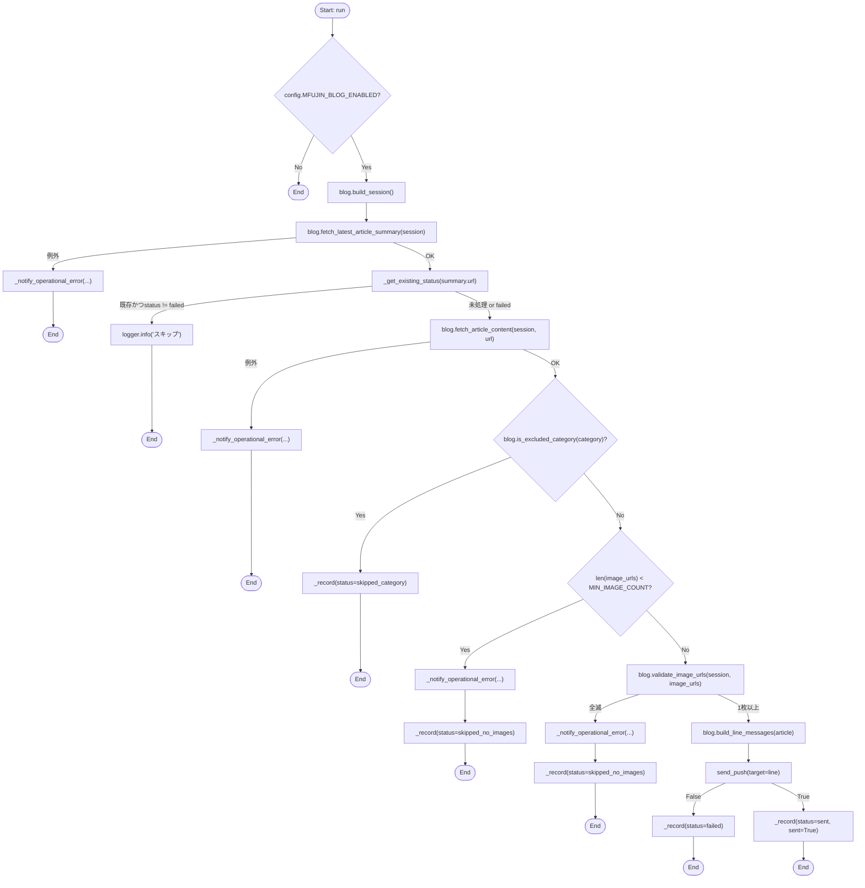
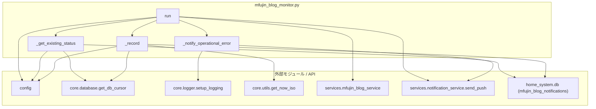

## 1. 解析メタ情報

| 項目 | 内容 |
| --- | --- |
| 対象ファイル | `mfujin_blog_monitor.py` |
| 言語 | Python |
| 解析対象 | 提供されたコードのみ |
| 推測・補完 | 一切なし |

## 関連ドキュメント

* [mfujin_blog_service.md](./mfujin_blog_service.md) - HTML取得・解析・LINEメッセージ組み立ての実体(`build_session`/`fetch_latest_article_summary`/`fetch_article_content`/`is_excluded_category`/`validate_image_urls`/`build_line_messages`)
* [config.md](./config.md) - `MFUJIN_BLOG_*`設定値・`SQLITE_TABLE_MFUJIN_NOTIFICATIONS`テーブル名定数を提供
* [database.md](./database.md) - `get_db_cursor`の実体
* [notification_service.md](./notification_service.md) - `send_push`の実体(LINE/Discord送信)
* [utils.md](./utils.md) - `get_now_iso`の実体
* [logger.md](./logger.md) - `setup_logging`の実体

## 2. ファイルの概要

「コミックエッセイ えむふじんがあらわれた」(https://mfujin.blog.jp/)の最新記事を巡回し、漫画記事と判定できた場合のみ本文中の漫画画像をLINEへ通知する個人用バッチのエントリーポイント。cronから1日数回(12:00頃の本実行・15:00頃の取りこぼし救済再実行)起動される想定で、`mfujin_blog_notifications`テーブル(`article_url`のUNIQUE制約)により同一記事の重複送信を防止する。HTML解析自体は`services/mfujin_blog_service.py`に委譲し、本ファイルはオーケストレーション(重複チェック→取得→除外カテゴリ判定→画像枚数判定→画像検証→LINE送信→DB記録)とDiscordへの運用エラー通知を担う。

## 3. 外部依存関係

### インポート一覧

| 名称 | 種類 | 用途 | 根拠 |
| --- | --- | --- | --- |
| `dataclasses` | 標準 | `dataclasses.replace`で検証済み画像URLに差し替えた`ArticleContent`を作る | 根拠: [インポート宣言] (行番号: 14 / 抜粋: "import dataclasses") |
| `sys` | 標準 | プロジェクトルートを`sys.path`へ追加 | 根拠: [インポート宣言] (行番号: 15 / 抜粋: "import sys") |
| `pathlib.Path` | 標準 | 自ファイルの親の親(プロジェクトルート)を解決 | 根拠: [インポート宣言] (行番号: 16 / 抜粋: "from pathlib import Path") |
| `typing.Optional` | 標準 | 型ヒント | 根拠: [インポート宣言] (行番号: 17 / 抜粋: "from typing import Optional") |
| `config` | 外部 | `MFUJIN_BLOG_*`設定値・`SQLITE_TABLE_MFUJIN_NOTIFICATIONS` | 根拠: [インポート宣言] (行番号: 20 / 抜粋: "import config") |
| `core.database.get_db_cursor` | 外部 | SQLite接続(WAL・ロックリトライ込み) | 根拠: [インポート宣言] (行番号: 22 / 抜粋: "from core.database import get_db_cursor") |
| `core.logger.setup_logging` | 外部 | ロガー初期化 | 根拠: [インポート宣言] (行番号: 23 / 抜粋: "from core.logger import setup_logging") |
| `core.utils.get_now_iso` | 外部 | 現在時刻(JST、ISO形式)取得 | 根拠: [インポート宣言] (行番号: 24 / 抜粋: "from core.utils import get_now_iso") |
| `services.mfujin_blog_service`(`blog`としてimport) | 外部 | サイト取得・解析・メッセージ組み立て | 根拠: [インポート宣言] (行番号: 25 / 抜粋: "from services import mfujin_blog_service as blog") |
| `services.notification_service.send_push` | 外部 | LINE/Discordへの実送信 | 根拠: [インポート宣言] (行番号: 26 / 抜粋: "from services.notification_service import send_push") |

### ブラックボックスとなる外部要素

| 名称 | 理由 | 根拠 |
| --- | --- | --- |
| `config.SQLITE_TABLE_MFUJIN_NOTIFICATIONS`等の設定値 | 実際の値は`config.py`側の定義次第 | 根拠: [変数参照] (行番号: 34, 55, 92, 120, 135 等) |
| `get_db_cursor`のリトライ・WAL挙動 | 実装詳細は`core/database.py`側 | 根拠: [関数呼び出し] (行番号: 32, 52) |
| `send_push`の実際の送信成否判定ロジック | 実装詳細は`services/notification_service.py`側 | 根拠: [関数呼び出し] (行番号: 84, 135) |

## 4. 主要要素の定義(関数 / エンドポイント / コンポーネント)

### `_get_existing_status`

* **役割**: `mfujin_blog_notifications`テーブルから、指定した`article_url`の既存レコードの`status`を取得する。レコードが無ければ`None`を返す。
* 根拠: [関数定義] (行番号: 31〜38 / 抜粋: "def _get_existing_status(article_url: str) -> Optional[str]:")

* **引数/リクエスト**: `article_url: str`
* 根拠: (行番号: 31)

* **戻り値/レスポンス**: `Optional[str]`(`status`の値、または`None`)
* 根拠: (行番号: 38 / 抜粋: 'return row["status"] if row else None')

* **副作用**: `mfujin_blog_notifications`テーブルへの読み取り専用SELECT(`get_db_cursor`経由、commitなし)。
* 根拠: (行番号: 32〜36)

* **エラーハンドリング**: なし(`get_db_cursor`側の例外はそのまま伝播する)。
* 根拠: (行番号: 31〜38)

### `_record`

* **役割**: `mfujin_blog_notifications`テーブルへ、記事の処理結果(`status`: sent/failed/skipped_category/skipped_no_images等)を`INSERT ... ON CONFLICT(article_url) DO UPDATE`でupsertする。`sent=True`のときのみ`sent_at`に現在時刻を設定し、それ以外は`NULL`のままにする(成功していないのに送信済みとして記録しないため)。
* 根拠: [関数定義] (行番号: 41〜77 / 抜粋: "def _record(...)")、[upsert SQL] (行番号: 53〜66)、[sent_at分岐] (行番号: 72 / 抜粋: "now if sent else None,")

* **引数/リクエスト**: `article_url: str`, `title: str`, `published_at: Optional[str]`, `status: str`, `image_count: int`, キーワード専用の`error_detail: Optional[str] = None`, `sent: bool = False`
* 根拠: (行番号: 41〜50)

* **戻り値/レスポンス**: `None`
* 根拠: (行番号: 41 / 抜粋: "-> None:")

* **副作用**: `mfujin_blog_notifications`テーブルへのINSERT/UPDATE(`get_db_cursor(commit=True)`経由)。
* 根拠: (行番号: 52〜77)

* **エラーハンドリング**: なし(`get_db_cursor`側の例外・ロールバックはそのまま伝播する)。
* 根拠: (行番号: 41〜77)

### `_notify_operational_error`

* **役割**: サイト構造の変化・通信エラー等の運用上の異常を、個人のLINEではなくDiscordのエラーチャンネル(`channel="error"`)へ通知する。まずERRORログを出力してから`send_push`を呼ぶ。
* 根拠: [関数定義] (行番号: 80〜88 / 抜粋: 'def _notify_operational_error(message: str) -> None:')

* **引数/リクエスト**: `message: str`
* 根拠: (行番号: 80)

* **戻り値/レスポンス**: `None`
* 根拠: (行番号: 80)

* **副作用**: `logger.error`呼び出し、および`send_push(target="discord", channel="error")`によるDiscord Webhookへの送信。
* 根拠: (行番号: 83〜88)

* **エラーハンドリング**: なし(`send_push`自体の戻り値は確認しない=Discord送信自体が失敗しても本関数は例外を出さない)。
* 根拠: (行番号: 80〜88)

### `run`

* **役割**: 本バッチの唯一のエントリーポイント。(1)`config.MFUJIN_BLOG_ENABLED`が偽なら即終了、(2)`blog.build_session`でセッション作成、(3)`blog.fetch_latest_article_summary`で最新記事を取得(失敗時は運用エラー通知して終了)、(4)`_get_existing_status`で重複チェック(既存かつ`status != "failed"`なら何もせず終了)、(5)`blog.fetch_article_content`で記事本文取得(失敗時は運用エラー通知して終了)、(6)`blog.is_excluded_category`で除外カテゴリなら`status="skipped_category"`でDB記録して終了(運用エラー通知はしない)、(7)画像枚数が`config.MFUJIN_BLOG_MIN_IMAGE_COUNT`未満なら運用エラー通知+`status="skipped_no_images"`でDB記録して終了、(8)`blog.validate_image_urls`で画像検証し全滅なら運用エラー通知+`status="skipped_no_images"`で終了、(9)`blog.build_line_messages`でメッセージ組み立て、(10)`send_push(target="line")`で送信し、失敗なら`status="failed"`で記録、成功なら`status="sent"`かつ`sent_at`付きで記録する。
* 根拠: [関数定義] (行番号: 91〜150 / 抜粋: "def run() -> None:")、各ステップ (行番号: 92〜94, 96, 98〜102, 104〜107, 109〜113, 115〜118, 120〜126, 128〜132, 134〜135, 137〜147, 149〜150)

* **引数/リクエスト**: なし
* 根拠: (行番号: 91)

* **戻り値/レスポンス**: `None`
* 根拠: (行番号: 91)

* **副作用**: HTTP通信(`blog`モジュール経由)、SQLiteへの読み書き(`_get_existing_status`/`_record`経由)、LINE/Discordへの通知送信(`send_push`経由)、ログ出力。
* 根拠: (行番号: 96〜150全体)

* **エラーハンドリング**: 最新記事一覧取得(行番号98〜102)・記事本文取得(行番号109〜113)はいずれも`except Exception as e`で捕捉し、`_notify_operational_error`を呼んで早期リターンする(例外を上位に伝播させない)。LINE送信失敗(`send_push`が`False`を返す場合、行番号137〜147)は`status="failed"`でDB記録しERRORログを出す(次回実行時に再送されるよう`sent_at`は設定しない)。
* 根拠: (行番号: 98〜102, 109〜113, 137〜147)

### モジュールレベル処理(`sys.path.append`)

* **役割**: 本ファイルの親の親ディレクトリ(`MY_HOME_SYSTEM/`)を`sys.path`へ追加し、`config`等のトップレベルモジュールをcron実行時にも解決できるようにする。
* 根拠: [モジュールレベル文] (行番号: 18 / 抜粋: "sys.path.append(str(Path(__file__).resolve().parent.parent))")

* **引数/リクエスト**: 該当なし
* 根拠: (行番号: 19)

* **戻り値/レスポンス**: 該当なし
* 根拠: (行番号: 19)

* **副作用**: `sys.path`へのパス追加(プロセス全体に影響するグローバルな副作用)。
* 根拠: (行番号: 19)

* **エラーハンドリング**: なし
* 根拠: (行番号: 19)

### `if __name__ == "__main__": run()`

* **役割**: スクリプトとして直接実行された場合(cronからの`python monitors/mfujin_blog_monitor.py`実行を含む)に`run()`を呼び出す。
* 根拠: [モジュールレベル文] (行番号: 153〜154 / 抜粋: 'if __name__ == "__main__":\n    run()')

* **引数/リクエスト**: 該当なし
* 根拠: (行番号: 153)

* **戻り値/レスポンス**: 該当なし
* 根拠: (行番号: 153)

* **副作用**: `run()`の全副作用
* 根拠: (行番号: 154)

* **エラーハンドリング**: なし(`run()`内で捕捉されない例外はプロセスをクラッシュさせ、`run_task.sh`側の失敗検知に委ねられる)
* 根拠: (行番号: 153〜154)

## 5. 処理フロー図

## 6. 依存関係図

## 7. 次のステップ(リバースエンジニアリングの提案)

| 優先度 | ファイル名 | 理由 | 根拠 |
| --- | --- | --- | --- |
| 高 | `services/mfujin_blog_service.py` | `run`が呼び出す`build_session`/`fetch_latest_article_summary`/`fetch_article_content`/`is_excluded_category`/`validate_image_urls`/`build_line_messages`の実装詳細を確認するため。 | 根拠: [インポート宣言] (行番号: 25) |
| 中 | `migrations/0021_add_mfujin_blog_notifications.sql` | `_get_existing_status`/`_record`が読み書きする`mfujin_blog_notifications`テーブルの正式なスキーマ定義を確認するため。 | 根拠: [テーブル名参照] (行番号: 34, 55) |
| 中 | `deploy/cron/crontab` | 本スクリプトが実際にどのスケジュールでcron起動されるかを確認するため。 | 根拠: モジュールdocstring (行番号: 6〜7) |

## 8. 保守上の注意点

* `_get_existing_status`/`_record`のSQL文はテーブル名を`config.SQLITE_TABLE_MFUJIN_NOTIFICATIONS`からf-stringで埋め込んでいる(`# nosec B608`コメント付き)。このパターンは`services/db_retention_service.py`・`services/quest/game_system.py`等、同リポジトリの既存コードでも使われている確立された慣習であり、値はユーザー入力ではなく固定の設定定数である。
* `run`は「除外カテゴリ判定(正常なスキップ、運用エラー通知なし)」と「画像0枚判定(異常の疑い、運用エラー通知あり)」を明確に区別している。除外カテゴリの判定は`blog.is_excluded_category`を先に呼んでから画像枚数判定を行う順序に依存しており、順序を入れ替えると本来正常なはずのPR記事等でも誤って運用エラー通知が飛ぶようになる。
* `existing_status != "failed"`の場合のみ再処理する設計のため、`status`列に`sent`/`skipped_category`/`skipped_no_images`/`failed`以外の値が入ると、その値が`"failed"`と一致しない限り(実質的に常に)再処理されなくなる。新しい`status`値を追加する場合はこの判定条件も見直すこと。
* `send_push(target="line", user_id=config.MFUJIN_BLOG_LINE_USER_ID)`は`channel`引数を指定していないため既定値`"notify"`が使われる(Discord向けの引数だがLINE送信では未使用)。

## 9. 不明事項一覧

| 項目 | 理由 | 必要なファイル |
| --- | --- | --- |
| `mfujin_blog_notifications`テーブルの正式な列定義・制約 | 本ファイルはSQL文中でしか列名を参照しておらず、マイグレーションファイル自体は未確認 | `migrations/0021_add_mfujin_blog_notifications.sql` |
| `run_task.sh`側の失敗時挙動(通知等) | `run()`内で捕捉されない例外(想定外のバグ等)がどう扱われるかは呼び出し元のcronラッパー次第 | `run_task.sh` |

## 10. 自己検証結果

* [x] 完了: 推測・外部ファイルの仕様を一切含んでいない
* [x] 完了: 全関数・全クラス・全コンポーネントを列挙した
* [x] 完了: 全てのインポート要素を列挙した
* [x] 完了: すべての仕様説明に「根拠(行番号・抜粋)」を明記した
* [x] 完了: 根拠漏れが0件である
* [x] 完了: Mermaid構文にエラーの原因となる記号(エスケープ漏れ)がない
* [x] 完了: 不明事項を漏れなく列挙した
