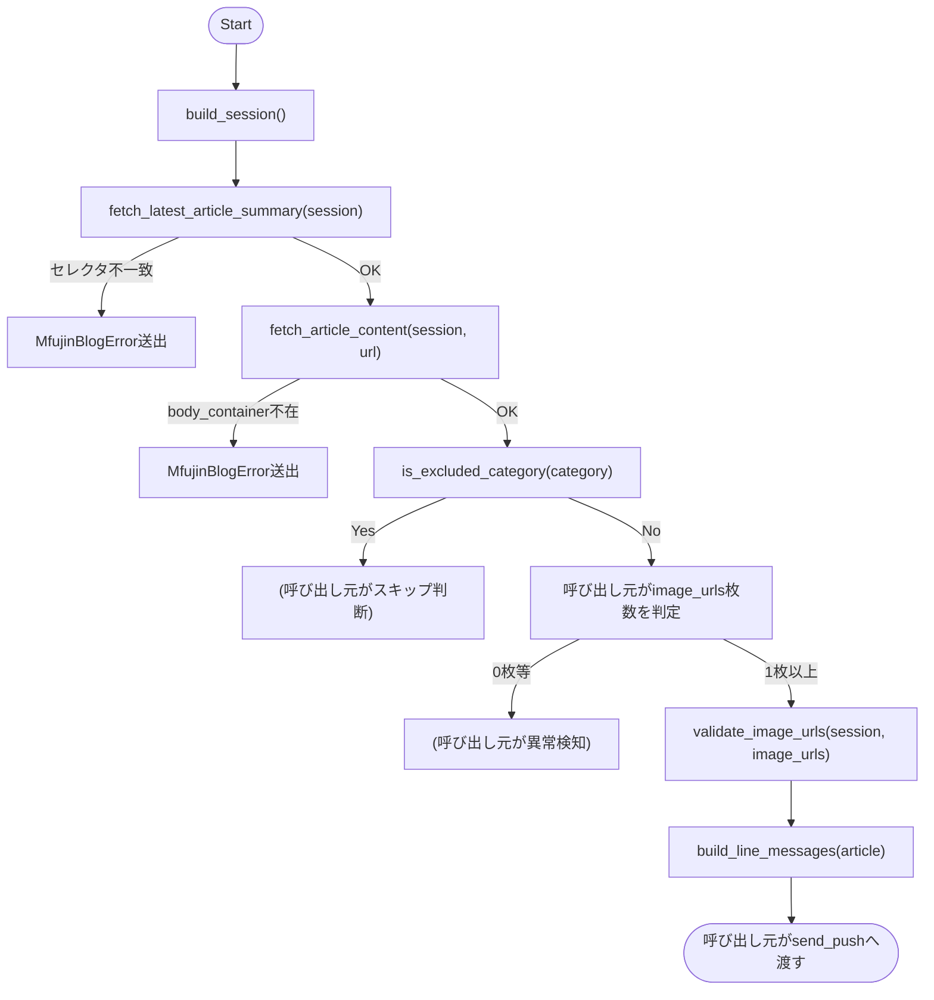

## 1. 解析メタ情報

| 項目 | 内容 |
| --- | --- |
| 対象ファイル | `mfujin_blog_service.py` |
| 言語 | Python |
| 解析対象 | 提供されたコードのみ |
| 推測・補完 | 一切なし |

## 関連ドキュメント

* [config.md](./config.md) - `MFUJIN_BLOG_*`設定値・`SQLITE_TABLE_MFUJIN_NOTIFICATIONS`を提供
* [logger.md](./logger.md) - `setup_logging`の実体
* [line_service.md](./line_service.md) - LINE Messaging APIの1メッセージ上限(`LINE_MAX_MESSAGES_PER_REPLY`)を同種の定数として持つ姉妹モジュール
* [notification_service.md](./notification_service.md) - 本モジュールが組み立てたメッセージを実際に送信する`send_push`の実体(呼び出し元は`mfujin_blog_monitor.md`)
* [mfujin_blog_monitor.md](./mfujin_blog_monitor.md) - 本モジュールの唯一の呼び出し元(cron駆動のオーケストレーション)

## 2. ファイルの概要

個人用ブログ「コミックエッセイ えむふじんがあらわれた」(https://mfujin.blog.jp/)の最新記事HTMLを取得・解析し、(1)最新記事のURL/タイトル抽出、(2)記事本文からの本編漫画画像URL抽出(広告・宣伝バナー・SNSボタン等の除外込み)、(3)カテゴリに基づく「漫画記事ではない」判定、(4)LINE Messaging APIへ送るメッセージ列の組み立て、を行う。サイト側のHTML構造(CSSセレクタ)は`Selectors`データクラス1箇所に集約しており、サイト側テンプレートが変わった場合はここだけを見直せばよい設計になっている。ネットワークI/O(HTTPセッション構築・GET/HEADリクエスト)も本ファイルが担うが、実際の送信先呼び出し(LINE API等)は`services/notification_service.py`に委譲する(本ファイルはメッセージ列を組み立てるだけで送信はしない)。

## 3. 外部依存関係

### インポート一覧

| 名称 | 種類 | 用途 | 根拠 |
| --- | --- | --- | --- |
| `dataclasses` | 標準 | `Selectors`/`ArticleSummary`/`ArticleContent`のデータクラス定義 | 根拠: [インポート宣言] (行番号: 19 / 抜粋: "import dataclasses") |
| `typing.List, typing.Optional` | 標準 | 型ヒント | 根拠: [インポート宣言] (行番号: 20 / 抜粋: "from typing import List, Optional") |
| `urllib.parse.urljoin` | 標準 | 相対パスの画像URLを記事URL基準で絶対URL化 | 根拠: [インポート宣言] (行番号: 20 / 抜粋: "from urllib.parse import urljoin") |
| `config` | 外部 | `MFUJIN_BLOG_*`設定値の取得 | 根拠: [インポート宣言] (行番号: 22 / 抜粋: "import config") |
| `requests` | 外部 | HTTPセッション・GET/HEADリクエスト | 根拠: [インポート宣言] (行番号: 23 / 抜粋: "import requests") |
| `bs4.BeautifulSoup` | 外部 | HTML解析 | 根拠: [インポート宣言] (行番号: 24 / 抜粋: "from bs4 import BeautifulSoup") |
| `bs4.element.Tag` | 外部 | `_is_manga_page_image`の引数型ヒント | 根拠: [インポート宣言] (行番号: 25 / 抜粋: "from bs4.element import Tag") |
| `core.logger.setup_logging` | 外部 | ロガー初期化 | 根拠: [インポート宣言] (行番号: 26 / 抜粋: "from core.logger import setup_logging") |
| `linebot.v3.messaging`(`FlexContainer`,`FlexMessage`,`ImageMessage`,`Message`,`TextMessage`) | 外部 | LINE Messaging API v3のメッセージオブジェクト | 根拠: [インポート宣言] (行番号: 28〜34 / 抜粋: "from linebot.v3.messaging import (\n    FlexContainer,\n    FlexMessage,\n    ImageMessage,\n    Message,\n    TextMessage,\n)") |
| `requests.adapters.HTTPAdapter` | 外部 | リトライ機構をセッションにマウント | 根拠: [インポート宣言] (行番号: 34 / 抜粋: "from requests.adapters import HTTPAdapter") |
| `urllib3.util.retry.Retry` | 外部 | リトライポリシー定義 | 根拠: [インポート宣言] (行番号: 35 / 抜粋: "from urllib3.util.retry import Retry") |

### ブラックボックスとなる外部要素

| 名称 | 理由 | 根拠 |
| --- | --- | --- |
| `config.MFUJIN_BLOG_TOP_URL` 等の各設定値 | 実際の値(既定値含む)は`config.py`側の定義次第 | 根拠: [変数参照] (行番号: 126, 186, 199, 208, 213, 221 等 / 抜粋: "config.MFUJIN_BLOG_TOP_URL", "config.MFUJIN_BLOG_EXCLUDED_CATEGORIES") |
| `setup_logging`関数 | ロガーの具体的な設定(出力先・レベル・フォーマット)が不明 | 根拠: [関数呼び出し] (行番号: 38 / 抜粋: 'logger = setup_logging("service.mfujin_blog")') |
| 実サイト(https://mfujin.blog.jp/)のHTML構造そのもの | 本ファイルは2026-09に確認済みのセレクタを前提にしているが、サイト側の将来のテンプレート変更まではコードから読み取れない | 根拠: [モジュールdocstring] (行番号: 10〜17) |

## 4. 主要要素の定義(関数 / エンドポイント / コンポーネント)

### `MfujinBlogError`

* **役割**: サイト取得・解析に関する回復不能なエラーを表す例外クラス。呼び出し元(`monitors/mfujin_blog_monitor.py`)がこれを捕捉してエラー通知の要否を判断する。
* 根拠: [クラス定義] (行番号: 54〜55 / 抜粋: 'class MfujinBlogError(Exception):\n    """サイト取得・解析に関する回復不能なエラー...')

* **引数/リクエスト**: `Exception`と同じ(メッセージ文字列)
* 根拠: (行番号: 54)

* **戻り値/レスポンス**: 該当なし
* 根拠: (行番号: 54)

* **副作用**: なし
* 根拠: (行番号: 54)

* **エラーハンドリング**: 該当なし(例外クラス自体)
* 根拠: (行番号: 54)

### `Selectors` / `SELECTORS`

* **役割**: サイトのHTML構造とCSSセレクタの対応をまとめたfrozenデータクラス。`article_title_link`(記事タイトル+リンク)、`body_container`(本文コンテナ)、`manga_image_candidate`(本編漫画画像の候補)、`category`(カテゴリ)、`published_time`(投稿日時)の5セレクタを保持する。モジュールロード時に`SELECTORS`としてインスタンス化される。
* 根拠: [クラス定義] (行番号: 58〜66 / 抜粋: '@dataclasses.dataclass(frozen=True)\nclass Selectors:')、[インスタンス化] (行番号: 68 / 抜粋: "SELECTORS = Selectors()")

* **引数/リクエスト**: 各フィールドは既定値を持つ文字列(CSSセレクタ)
* 根拠: (行番号: 62〜66 / 抜粋: 'article_title_link: str = "article.article h1.article-title a"' 等)

* **戻り値/レスポンス**: 該当なし(データ保持のみ)
* 根拠: (行番号: 58〜69)

* **副作用**: なし
* 根拠: (行番号: 58〜69)

* **エラーハンドリング**: なし(`frozen=True`により生成後の変更は`dataclasses.FrozenInstanceError`になるが、本ファイル内では変更を試みていない)
* 根拠: (行番号: 58)

### `ArticleSummary` / `ArticleContent`

* **役割**: `ArticleSummary`はトップページ一覧から取得できる最小情報(URL・タイトル)を保持する。`ArticleContent`は記事ページ全体から取得した情報(URL・タイトル・投稿日時・カテゴリ・本編漫画画像URLのリスト)を保持する。
* 根拠: [クラス定義] (行番号: 72〜75 / 抜粋: '@dataclasses.dataclass\nclass ArticleSummary:\n    url: str\n    title: str')、(行番号: 78〜84 / 抜粋: '@dataclasses.dataclass\nclass ArticleContent:\n    url: str\n    title: str\n    published_at: Optional[str]\n    category: Optional[str]\n    image_urls: List[str]')

* **引数/リクエスト**: `ArticleSummary(url, title)` / `ArticleContent(url, title, published_at, category, image_urls)`
* 根拠: (行番号: 73〜75, 80〜84)

* **戻り値/レスポンス**: 該当なし(データ保持のみ)
* 根拠: (行番号: 72〜84)

* **副作用**: なし
* 根拠: (行番号: 72〜84)

* **エラーハンドリング**: なし
* 根拠: (行番号: 72〜84)

### `build_session`

* **役割**: リトライ(合計3回、backoff_factor=1.0、対象ステータス500/502/503/504、対象メソッドGET/HEAD)・ブラウザ風User-Agentを設定した`requests.Session`を生成する。DDD/newface_monitor.pyの既存パターン(`requests.Session`+`urllib3.Retry`)に揃えている。
* 根拠: [関数定義] (行番号: 86〜110 / 抜粋: "def build_session() -> requests.Session:")、[Retry設定] (行番号: 93〜98 / 抜粋: "retries = Retry(\n        total=3,\n        backoff_factor=1.0,\n        status_forcelist=[500, 502, 503, 504],\n        allowed_methods=[\"GET\", \"HEAD\"],\n    )")

* **引数/リクエスト**: なし
* 根拠: (行番号: 87)

* **戻り値/レスポンス**: `requests.Session`(リトライアダプタとUser-Agentヘッダ設定済み)
* 根拠: (行番号: 110 / 抜粋: "return session")

* **副作用**: なし(セッションオブジェクトの生成のみ。実際のHTTP通信は行わない)
* 根拠: (行番号: 92〜111)

* **エラーハンドリング**: なし
* 根拠: (行番号: 87〜111)

### `parse_latest_article_summary`

* **役割**: トップページのHTML(`BeautifulSoup`オブジェクト)から、`SELECTORS.article_title_link`セレクタで最初に一致した要素(一覧の先頭=最新記事)のURL・タイトルを取得する。
* 根拠: [関数定義] (行番号: 113〜121 / 抜粋: "def parse_latest_article_summary(soup: BeautifulSoup) -> ArticleSummary:")

* **引数/リクエスト**: `soup: BeautifulSoup`
* 根拠: (行番号: 114)

* **戻り値/レスポンス**: `ArticleSummary`
* 根拠: (行番号: 121 / 抜粋: "return ArticleSummary(url=link[\"href\"].strip(), title=link.get_text(strip=True))")

* **副作用**: なし
* 根拠: (行番号: 114〜122)

* **エラーハンドリング**: セレクタに一致する要素が無い、または`href`属性が無い場合は`MfujinBlogError`を送出する(HTML構造変化の検知)。
* 根拠: (行番号: 117〜121 / 抜粋: 'if link is None or not link.get("href"):\n        raise MfujinBlogError(...)')

### `fetch_latest_article_summary`

* **役割**: `config.MFUJIN_BLOG_TOP_URL`へGETリクエストを送り、`raise_for_status()`でHTTPエラーを検知した後、`parse_latest_article_summary`で解析する。
* 根拠: [関数定義] (行番号: 124〜127 / 抜粋: "def fetch_latest_article_summary(session: requests.Session) -> ArticleSummary:")

* **引数/リクエスト**: `session: requests.Session`
* 根拠: (行番号: 125)

* **戻り値/レスポンス**: `ArticleSummary`
* 根拠: (行番号: 128 / 抜粋: 'return parse_latest_article_summary(BeautifulSoup(resp.content, "html.parser"))')

* **副作用**: `config.MFUJIN_BLOG_TOP_URL`への外部HTTP GETリクエスト(タイムアウト`config.MFUJIN_BLOG_REQUEST_TIMEOUT_SEC`)。
* 根拠: (行番号: 125 / 抜粋: "resp = session.get(config.MFUJIN_BLOG_TOP_URL, timeout=config.MFUJIN_BLOG_REQUEST_TIMEOUT_SEC)")

* **エラーハンドリング**: `resp.raise_for_status()`によりHTTPエラー(4xx/5xx)は`requests.HTTPError`として呼び出し元に伝播する(本関数内でキャッチしない)。
* 根拠: (行番号: 127 / 抜粋: "resp.raise_for_status()")

### `_is_manga_page_image`

* **役割**: 与えられた`img`タグが「本編の漫画ページ画像」かどうかを判定する。`src`が空、または`.gif`で終わる場合はFalse(ヘッダー/フッターの固定バナー除外)。`height`属性があり`400`未満の場合もFalse(副次チェック)。
* 根拠: [関数定義] (行番号: 130〜141 / 抜粋: "def _is_manga_page_image(img: Tag) -> bool:")

* **引数/リクエスト**: `img: Tag`(BeautifulSoupの``要素)
* 根拠: (行番号: 131)

* **戻り値/レスポンス**: `bool`
* 根拠: (行番号: 134, 139, 142 / 抜粋: "return False" x2, "return True")

* **副作用**: なし
* 根拠: (行番号: 131〜142)

* **エラーハンドリング**: `height`属性が数値に変換できない場合(`ValueError`)は判定材料が無いとみなし除外しない(黙って通す)。
* 根拠: (行番号: 137〜141 / 抜粋: 'try:\n            if int(height_attr) < _MIN_MANGA_IMAGE_HEIGHT_PX:\n                return False\n        except ValueError:\n            pass')

### `parse_article_content`

* **役割**: 記事ページのHTMLから、タイトル(`SELECTORS.article_title_link`)、投稿日時(`SELECTORS.published_time`の`datetime`属性)、カテゴリ(`SELECTORS.category`)、本編漫画画像URL一覧(`SELECTORS.body_container`配下の`SELECTORS.manga_image_candidate`のうち`_is_manga_page_image`がTrueのものだけ、DOM出現順を維持、`urljoin`で絶対URL化)を抽出し`ArticleContent`として返す。
* 根拠: [関数定義] (行番号: 144〜181 / 抜粋: "def parse_article_content(soup: BeautifulSoup, url: str) -> ArticleContent:")

* **引数/リクエスト**: `soup: BeautifulSoup`, `url: str`(記事の絶対URL。相対画像パスの解決基準になる)
* 根拠: (行番号: 145)

* **戻り値/レスポンス**: `ArticleContent`
* 根拠: (行番号: 176〜182 / 抜粋: "return ArticleContent(\n        url=url,\n        title=title,\n        published_at=published_at,\n        category=category,\n        image_urls=image_urls,\n    )")

* **副作用**: なし(HTML解析のみ)
* 根拠: (行番号: 145〜182)

* **エラーハンドリング**: `SELECTORS.body_container`に一致する要素が無い場合は`MfujinBlogError`を送出する。タイトル/投稿日時/カテゴリの各要素が無い場合はそれぞれ空文字列/`None`/`None`にフォールバックし、例外は送出しない(画像0枚の異常判定は呼び出し元に委ねる設計であることがdocstringに明記されている)。
* 根拠: (行番号: 161〜166 / 抜粋: 'if body is None:\n        raise MfujinBlogError(...)')、(行番号: 152〜153, 155〜156, 158〜159)、(行番号: 148〜150 / 抜粋: "画像が0枚になること自体はここではエラーにしない...")

### `fetch_article_content`

* **役割**: 記事URLへGETリクエストを送り、`raise_for_status()`の後`parse_article_content`で解析する。
* 根拠: [関数定義] (行番号: 184〜187 / 抜粋: "def fetch_article_content(session: requests.Session, url: str) -> ArticleContent:")

* **引数/リクエスト**: `session: requests.Session`, `url: str`
* 根拠: (行番号: 185)

* **戻り値/レスポンス**: `ArticleContent`
* 根拠: (行番号: 188 / 抜粋: 'return parse_article_content(BeautifulSoup(resp.content, "html.parser"), url)')

* **副作用**: `url`への外部HTTP GETリクエスト(タイムアウト`config.MFUJIN_BLOG_REQUEST_TIMEOUT_SEC`)。
* 根拠: (行番号: 186)

* **エラーハンドリング**: `resp.raise_for_status()`によりHTTPエラーは`requests.HTTPError`として伝播する。
* 根拠: (行番号: 187)

### `is_excluded_category`

* **役割**: カテゴリ文字列が`config.MFUJIN_BLOG_EXCLUDED_CATEGORIES`(完全一致のリスト)に含まれるかを判定する。
* 根拠: [関数定義] (行番号: 190〜198 / 抜粋: "def is_excluded_category(category: Optional[str]) -> bool:")

* **引数/リクエスト**: `category: Optional[str]`
* 根拠: (行番号: 191)

* **戻り値/レスポンス**: `bool`
* 根拠: (行番号: 198, 198 / 抜粋: "return False", "return category in config.MFUJIN_BLOG_EXCLUDED_CATEGORIES")

* **副作用**: なし
* 根拠: (行番号: 191〜199)

* **エラーハンドリング**: `category`が`None`の場合は除外しない(False)。
* 根拠: (行番号: 197〜198 / 抜粋: 'if category is None:\n        return False')

### `validate_image_urls`

* **役割**: 抽出済み画像URL一覧の各URLへHEADリクエストを送り、ステータスコード(400以上は除外)・`Content-Length`ヘッダ(`config.MFUJIN_BLOG_IMAGE_MAX_SIZE_MB`換算のバイト数を超えたら除外)を検証し、通過したURLのみのリストを返す。
* 根拠: [関数定義] (行番号: 201〜227 / 抜粋: "def validate_image_urls(session: requests.Session, image_urls: List[str]) -> List[str]:")

* **引数/リクエスト**: `session: requests.Session`, `image_urls: List[str]`
* 根拠: (行番号: 202)

* **戻り値/レスポンス**: `List[str]`(検証を通過したURLのみ)
* 根拠: (行番号: 227 / 抜粋: "return validated")

* **副作用**: 各画像URLへの外部HTTP HEADリクエスト(タイムアウト`config.MFUJIN_BLOG_REQUEST_TIMEOUT_SEC`、リダイレクト追従あり)。ステータス400以上・サイズ超過・例外発生時はWARNINGログを出力する。
* 根拠: (行番号: 212〜214, 216, 220〜223, 227)

* **エラーハンドリング**: `requests.RequestException`または`ValueError`(`Content-Length`が数値変換できない場合)を捕捉し、当該URLをWARNINGログとともに除外する(例外を上位に伝播させない)。
* 根拠: (行番号: 226〜227 / 抜粋: 'except (requests.RequestException, ValueError) as e:\n            logger.warning(...)')

### `build_line_messages`

* **役割**: `ArticleContent`からLINE Messaging APIへ送るメッセージ列(`List[Message]`)を組み立てる。「タイトル1通(`TextMessage`、【えむふじん 最新話】+タイトル+元記事URL) + 画像枚数」の合計が`_LINE_MAX_MESSAGES_PER_PUSH`(5)以下ならテキスト1通+`ImageMessage`(画像ごとに`originalContentUrl`/`previewImageUrl`とも画像URLをそのまま設定)というシンプルな構成にする。超える場合は、タイトル+元記事リンクボタンのバブルを先頭に、画像を`hero`画像とするバブルを`_FLEX_CAROUSEL_MAX_BUBBLES`(12)-1枚まで追加した`FlexMessage`(carousel)1通に切り替える(上限超過分は先頭から切り詰め、WARNINGログを出力)。
* 根拠: [関数定義] (行番号: 230〜296 / 抜粋: "def build_line_messages(article: ArticleContent) -> List[Message]:")、[シンプル分岐] (行番号: 241〜247)、[Flex分岐] (行番号: 249〜297)

* **引数/リクエスト**: `article: ArticleContent`
* 根拠: (行番号: 231)

* **戻り値/レスポンス**: `List[Message]`(`TextMessage`+`ImageMessage`の列、または`FlexMessage`1件のリスト)
* 根拠: (行番号: 247, 297)

* **副作用**: 画像枚数がFlex Carouselの上限を超える場合にWARNINGログを出力する。
* 根拠: (行番号: 277〜281)

* **エラーハンドリング**: なし(例外送出箇所なし)。
* 根拠: (行番号: 231〜297)

## 5. 処理フロー図

呼び出し元(`monitors/mfujin_blog_monitor.py`)から見た、記事1件を処理する際の主要関数の呼び出し順序です。

## 6. 依存関係図

```mermaid
graph TD
    subgraph "mfujin_blog_service.py"
        Selectors
        build_session
        parse_latest_article_summary
        fetch_latest_article_summary
        parse_article_content
        fetch_article_content
        is_excluded_category
        validate_image_urls
        build_line_messages
    end

    subgraph "外部モジュール / API"
        config
        setup_logging["core.logger.setup_logging"]
        requests
        bs4["bs4.BeautifulSoup"]
        linebot_api["linebot.v3.messaging"]
        mfujin_site["https://mfujin.blog.jp/ (外部サイト)"]
    end

    fetch_latest_article_summary --> config
    fetch_latest_article_summary --> requests
    fetch_latest_article_summary --> mfujin_site
    fetch_latest_article_summary --> parse_latest_article_summary
    parse_latest_article_summary --> Selectors
    parse_latest_article_summary --> bs4

    fetch_article_content --> config
    fetch_article_content --> requests
    fetch_article_content --> mfujin_site
    fetch_article_content --> parse_article_content
    parse_article_content --> Selectors
    parse_article_content --> bs4

    is_excluded_category --> config
    validate_image_urls --> requests
    validate_image_urls --> mfujin_site
    build_line_messages --> linebot_api

    build_session --> requests
```

## 7. 次のステップ(リバースエンジニアリングの提案)

| 優先度 | ファイル名 | 理由 | 根拠 |
| --- | --- | --- | --- |
| 高 | `monitors/mfujin_blog_monitor.py` | 本モジュールの唯一の呼び出し元。除外カテゴリ判定・画像枚数判定・DB記録・LINE送信の実際のオーケストレーションを確認するため。 | 根拠: モジュールdocstring (行番号: 12) |
| 高 | `config.py` | `MFUJIN_BLOG_*`各設定値の既定値・環境変数名を確認するため。 | 根拠: `config`からの変数参照多数 (行番号: 126, 186, 199等) |
| 中 | `services/notification_service.py` | `build_line_messages`が返す`List[Message]`を実際にLINEへ送信する`send_push`/`_send_line_push`の実装(特に`ImageMessage`が`isinstance(msg, Message)`分岐を通過することの確認)を見るため。 | 根拠: 本ファイルは送信自体を行わず`Message`オブジェクトを組み立てるのみ (行番号: 231〜297) |

## 8. 保守上の注意点

* `Selectors`データクラスの5フィールド(`article_title_link`/`body_container`/`manga_image_candidate`/`category`/`published_time`)がサイト側HTML構造との唯一の接点である。サイト側テンプレートが変わった場合はここだけを直せばよい設計だが、逆に言えばここが古いままだと`parse_latest_article_summary`/`parse_article_content`がいずれも`MfujinBlogError`を送出し続ける。
* `_is_manga_page_image`の判定(`.gif`拡張子除外+`height`が400px未満なら除外)は、2026-09時点で実際に確認した2記事のHTML構造に基づく経験則であり、将来サイト側の配信形式(画像フォーマットやサイズ)が変わった場合は誤判定(除外過多/漏れ)の可能性がある。
* `validate_image_urls`はHEADリクエストが使えない/失敗するサイトでは検証をほぼ素通りさせる設計(過度に厳格にして正常画像まで除外しないため)。画像サイズの上限超過を確実に検知したい場合、`Content-Length`ヘッダを返さないサーバーには効果がない。
* `build_line_messages`の「タイトル+画像5通以内はシンプル構成、それ以上はFlex Carousel」という閾値(`_LINE_MAX_MESSAGES_PER_PUSH=5`)は、LINE Messaging APIの1回のpush/reply上限に基づく。この定数は`services/line_service.py`の`LINE_MAX_MESSAGES_PER_REPLY`と値が重複しているが、モジュール分割の都合上、共有定数化はしていない。

## 9. 不明事項一覧

| 項目 | 理由 | 必要なファイル |
| --- | --- | --- |
| `config.MFUJIN_BLOG_*`各設定値の既定値 | 実際のデフォルト値・環境変数名の一覧は`config.py`側の定義次第 | `config.py` |
| `ImageMessage`が`services.notification_service._send_line_push`の`isinstance(msg, Message)`分岐を実際に通過し正しく送信されるか | 本ファイルは`Message`オブジェクトを組み立てるのみで、実際の送信処理・分岐ロジックは`notification_service.py`側にある | `services/notification_service.py` |

## 10. 自己検証結果

* [x] 完了: 推測・外部ファイルの仕様を一切含んでいない
* [x] 完了: 全関数・全クラス・全コンポーネントを列挙した
* [x] 完了: 全てのインポート要素を列挙した
* [x] 完了: すべての仕様説明に「根拠(行番号・抜粋)」を明記した
* [x] 完了: 根拠漏れが0件である
* [x] 完了: Mermaid構文にエラーの原因となる記号(エスケープ漏れ)がない
* [x] 完了: 不明事項を漏れなく列挙した
