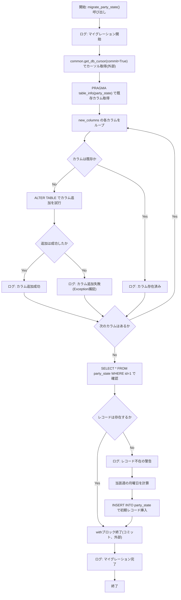
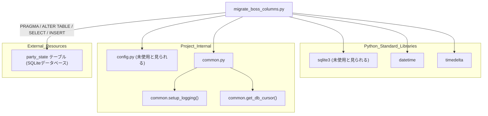

## 1. 解析メタ情報

| 項目 | 内容 |
| --- | --- |
| 対象ファイル | `migrate_boss_columns.py` |
| 言語 | Python |
| 解析対象 | 提供されたコードのみ |
| 推測・補完 | 一切なし |

## 関連ドキュメント

* [common.md](./common.md) - `setup_logging`および`get_db_cursor`を提供する呼び出し元モジュール
* [config.md](./config.md) - インポートされているが、本ファイル内では直接参照されていない設定モジュール
* [init_unified_db.md](./init_unified_db.md) - `party_state`テーブルを含むDBスキーマの初期構築を担うと推測される関連ドキュメント

## 2. ファイルの概要

`common.setup_logging`で取得したロガーを用いてログ出力を行いながら、`party_state`テーブルに`max_hp`・`week_start_date`・`is_defeated`・`total_damage`の4カラムを未追加のもののみ追加し、さらに`id=1`のレコードが存在しない場合は初期レコードを1件挿入する`migrate_party_state`関数を定義するスクリプト。モジュール直接実行時に`migrate_party_state()`が呼び出される。

* 根拠: `[ロガー設定]` (行番号: 7 / 抜粋: "logger = common.setup_logging(\"migration\")")
* 根拠: `[new_columns定義]` (行番号: 18〜23 / 抜粋: "new_columns = {\n            \"max_hp\": \"INTEGER DEFAULT 1000\",\n            \"week_start_date\": \"TEXT DEFAULT ''\",\n            \"is_defeated\": \"INTEGER DEFAULT 0\",\n            \"total_damage\": \"INTEGER DEFAULT 0\"\n        }")
* 根拠: `[初期レコード作成]` (行番号: 37〜45 / 抜粋: "cur.execute(\"SELECT * FROM party_state WHERE id = 1\")\n        if not cur.fetchone():\n            logger.info(\"⚠️ party_stateのレコードが存在しません。初期レコードを作成します。\")")
* 根拠: `[main実行部]` (行番号: 49〜50 / 抜粋: "if __name__ == \"__main__\":\n    migrate_party_state()")

## 3. 外部依存関係

### インポート一覧

| 名称 | 種類 | 用途 | 根拠 |
| --- | --- | --- | --- |
| `sqlite3` | 標準ライブラリ | インポートされているが、ファイル内で`sqlite3.`を用いた直接の呼び出し箇所が見当たらない（DBアクセスは`common.get_db_cursor`経由、未使用の可能性） | 根拠: `[import sqlite3]` (行番号: 1 / 抜粋: "import sqlite3") |
| `config` | 内部モジュール | インポートされているが、ファイル内で`config.`を用いた参照箇所が見当たらない（未使用の可能性） | 根拠: `[import config]` (行番号: 2 / 抜粋: "import config") |
| `common` | 内部モジュール | ロガー取得(`setup_logging`)およびDBカーソル取得(`get_db_cursor`)の提供元 | 根拠: `[import common]` (行番号: 3 / 抜粋: "import common") |
| `datetime` | 標準ライブラリ | 現在日時の取得（`datetime.now()`） | 根拠: `[from datetime import datetime, timedelta]` (行番号: 4 / 抜粋: "from datetime import datetime, timedelta") |
| `timedelta` | 標準ライブラリ | 「今週の月曜日」を計算するための日数差分計算 | 根拠: `[timedelta(days=today.weekday())]` (行番号: 41 / 抜粋: "monday = today - timedelta(days=today.weekday())") |

### ブラックボックスとなる外部要素

| 名称 | 理由 | 根拠 |
| --- | --- | --- |
| `common.setup_logging`の内部実装 | `common`モジュールのソースコードが当ファイル内に存在しないため、ログ出力先（コンソール/ファイル/Discord等）の具体的挙動が不明であるため。 | 根拠: `[common.setup_logging(\"migration\")]` (行番号: 7 / 抜粋: "logger = common.setup_logging(\"migration\")") |
| `common.get_db_cursor`の内部実装 | 接続先DB・`commit=True`時の挙動・`cur.fetchall()`が辞書アクセス（`info['name']`）可能な行オブジェクトを返す仕組み（`row_factory`設定等）が当ファイル内には存在しないため。 | 根拠: `[common.get_db_cursor(commit=True)]` (行番号: 12 / 抜粋: "with common.get_db_cursor(commit=True) as cur:") |
| `party_state`テーブルの完全なスキーマ | `current_boss_id`・`current_hp`等、`INSERT`文中に登場するが本ファイルでは定義されていないカラムを含む既存スキーマ全体が不明であるため。 | 根拠: `[INSERT INTO party_state]` (行番号: 42〜44 / 抜粋: "INSERT INTO party_state (id, current_boss_id, current_hp, max_hp, week_start_date, is_defeated, total_damage)") |

## 4. 主要要素の定義（関数 / エンドポイント / コンポーネント）

### `migrate_party_state`

* **役割**: `party_state`テーブルの既存カラムを確認し、未追加の`max_hp`・`week_start_date`・`is_defeated`・`total_damage`カラムを`ALTER TABLE`で追加した上で、`id=1`のレコードが存在しない場合は当該週の月曜日を`week_start_date`とする初期レコードを1件挿入する。
* 根拠: `[migrate_party_state定義]` (行番号: 9 / 抜粋: "def migrate_party_state():")
* 根拠: `[カラムループ処理]` (行番号: 25〜34 / 抜粋: "for col_name, col_def in new_columns.items():\n            if col_name not in columns:")

* **引数/リクエスト**: なし
* 根拠: `[関数シグネチャ]` (行番号: 9 / 抜粋: "def migrate_party_state():")

* **戻り値/レスポンス**: なし。処理の進行状況は`logger.info`／`logger.error`によりログ出力される。
* 根拠: `[ログ出力]` (行番号: 10, 30, 32, 34, 47 / 抜粋: "logger.info(\"🛡️ party_stateテーブルのマイグレーションを開始します...\")")

* **副作用**: `common.get_db_cursor(commit=True)`を介した`PRAGMA table_info`によるカラム情報取得、カラムごとの`ALTER TABLE`実行、`SELECT`によるレコード存在確認、条件次第で`INSERT INTO party_state`の実行、およびロガーへの複数回の書き込み。
* 根拠: `[ALTER TABLE実行]` (行番号: 28〜29 / 抜粋: "alter_query = f\"ALTER TABLE party_state ADD COLUMN {col_name} {col_def}\"\n                    cur.execute(alter_query)")
* 根拠: `[INSERT実行]` (行番号: 42〜45 / 抜粋: "cur.execute(\"\"\"\n                INSERT INTO party_state (id, current_boss_id, current_hp, max_hp, week_start_date, is_defeated, total_damage)\n                VALUES (1, 1, 1000, 1000, ?, 0, 0)\n            \"\"\", (str(monday),))")

* **エラーハンドリング**: カラム追加処理をカラムごとに個別の`try`/`except Exception`で囲んでおり、1カラムの追加に失敗しても`logger.error`でログ出力した上でループ処理は継続する（処理全体は中断しない）。関数全体を囲む`try`/`except`は存在しない。
* 根拠: `[カラムごとのexcept]` (行番号: 27〜32 / 抜粋: "try:\n                    alter_query = f\"ALTER TABLE party_state ADD COLUMN {col_name} {col_def}\"\n                    cur.execute(alter_query)\n                    logger.info(f\"✅ カラム追加: {col_name}\")\n                except Exception as e:\n                    logger.error(f\"❌ カラム追加失敗 ({col_name}): {e}\")")

## 5. 処理フロー図

## 6. 依存関係図

## 7. 次のステップ（リバースエンジニアリングの提案）

| 優先度 | ファイル名(推測可) | 理由 | 根拠 |
| --- | --- | --- | --- |
| 高 | `common.py` | `setup_logging`および`get_db_cursor`の実装（接続先DB、コミット挙動、行オブジェクトの辞書アクセス可否）を確認するため。 | 根拠: `[common.setup_logging / common.get_db_cursor]` (行番号: 7, 12 / 抜粋: "logger = common.setup_logging(\"migration\")") |
| 中 | `init_unified_db.py` | `party_state`テーブルの完全な初期スキーマ（`current_boss_id`・`current_hp`等の既存カラム）を確認するため。 | 根拠: `[INSERT INTO party_state (id, current_boss_id, current_hp, ...)]` (行番号: 43 / 抜粋: "INSERT INTO party_state (id, current_boss_id, current_hp, max_hp, week_start_date, is_defeated, total_damage)") |
| 低 | `config.py` | 本ファイルでインポートされているが未使用に見える`config`モジュールが、他の目的（副作用的な初期化等）で必要とされていないか確認するため。 | 根拠: `[import config]` (行番号: 2 / 抜粋: "import config") |

## 8. 保守上の注意点

* **未使用と見られるインポート**: `sqlite3`と`config`がインポートされているが、ファイル内で直接参照されている箇所が見当たらない。DBアクセスは`common.get_db_cursor`経由で行われている。
* 根拠: `[import sqlite3 / import config]` (行番号: 1〜2 / 抜粋: "import sqlite3\nimport config")
* **カラム追加失敗時に処理継続**: `new_columns`のループ内で個別に`except Exception`を用いているため、一部のカラム追加が失敗してもスクリプト全体は最後まで実行され、その後の初期レコード作成処理（`INSERT`）に進む。カラム追加失敗と初期レコード挿入の整合性はコード上保証されていない。
* 根拠: `[except Exceptionでログのみ]` (行番号: 31〜32 / 抜粋: "except Exception as e:\n                    logger.error(f\"❌ カラム追加失敗 ({col_name}): {e}\")")
* **`INSERT`文中に未追加カラムが混在する可能性**: 初期レコード作成の`INSERT INTO party_state`文では`current_boss_id`・`current_hp`カラムを参照しているが、これらは本ファイルの`new_columns`の追加対象には含まれておらず、既存のスキーマに存在する前提となっている。カラム追加が全て失敗した状態でもこの`INSERT`は実行されるため、`max_hp`等が存在しないままの`INSERT`は失敗し得る。
* 根拠: `[INSERT文とnew_columnsの不一致]` (行番号: 18〜23, 42〜45 / 抜粋: "new_columns = {\n            \"max_hp\": \"INTEGER DEFAULT 1000\"" / "INSERT INTO party_state (id, current_boss_id, current_hp, max_hp, ...")

## 9. 不明事項一覧

| 項目 | 理由 | 必要なファイル |
| --- | --- | --- |
| `common.get_db_cursor`および`common.setup_logging`の実装 | `common`モジュールのソースコードが当ファイル内に存在しないため。 | `common.py` |
| `party_state`テーブルの既存カラム構成（`current_boss_id`、`current_hp`等） | `INSERT`文に登場するが、当ファイル内でのテーブル定義自体が存在しないため。 | `init_unified_db.py`等のスキーマ定義ファイル |
| `config`モジュールが本ファイルで実際に必要とされる理由 | インポートされているが直接の参照箇所が見当たらず、真に不要なのか副作用目的なのか当ファイルからは判断できないため。 | `config.py` |

## 10. 自己検証結果

* [x] 推測・外部ファイルの仕様を一切含んでいない（完了）
* [x] 全関数・全クラス・全コンポーネントを列挙した（完了）
* [x] 全てのインポート要素を列挙した（完了）
* [x] すべての仕様説明に「根拠（行番号・抜粋）」を明記した（完了）
* [x] 根拠漏れが0件である（完了）
* [x] Mermaid構文にエラーの原因となる記号（エスケープ漏れ）がない（完了）
* [x] 不明事項を漏れなく列挙した（完了）
