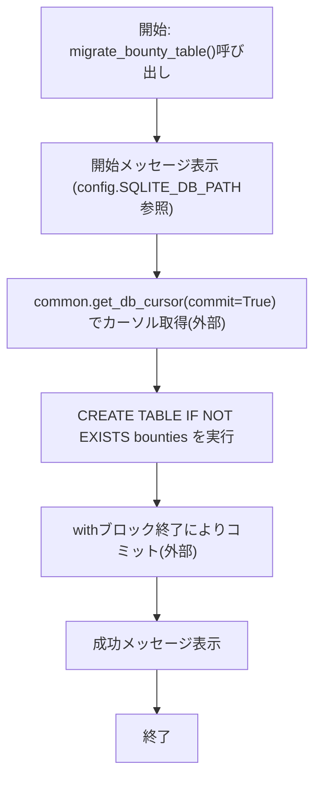
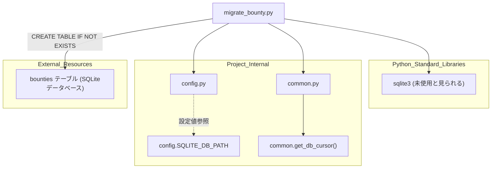

## 1. 解析メタ情報

| 項目 | 内容 |
| --- | --- |
| 対象ファイル | `migrate_bounty.py` |
| 言語 | Python |
| 解析対象 | 提供されたコードのみ |
| 推測・補完 | 一切なし |

## 関連ドキュメント

* [config.md](./config.md) - `SQLITE_DB_PATH`を提供する設定モジュール
* [common.md](./common.md) - `get_db_cursor`を提供する呼び出し元モジュール
* [init_unified_db.md](./init_unified_db.md) - コード内コメントで「init_unified_db.py と同じSQL」と明記される、同一の`bounties`テーブル定義を持つと推測されるモジュール
* [bounty_router.md](./bounty_router.md) - `bounties`テーブルを実際に利用するAPIルーターと推測される関連ドキュメント

## 2. ファイルの概要

`common.get_db_cursor`を用いてDBカーソルを取得し、`bounties`テーブルが存在しない場合にのみ作成する`migrate_bounty_table`関数を定義するスクリプト。コード内コメントにより、`init_unified_db.py`と同一のCREATE TABLE文を実行するものであることが明記されている。モジュール直接実行時に`migrate_bounty_table()`が呼び出される。

* 根拠: `[開始メッセージとconfig参照]` (行番号: 6 / 抜粋: "print(f\"📦 Migrating Bounty Table to {config.SQLITE_DB_PATH}...\")")
* 根拠: `[CREATE TABLE文とコメント]` (行番号: 9〜26 / 抜粋: "# init_unified_db.py と同じSQLを実行\n        cur.execute('''\n            CREATE TABLE IF NOT EXISTS bounties (")
* 根拠: `[main実行部]` (行番号: 29〜30 / 抜粋: "if __name__ == \"__main__\":\n    migrate_bounty_table()")

## 3. 外部依存関係

### インポート一覧

| 名称 | 種類 | 用途 | 根拠 |
| --- | --- | --- | --- |
| `sqlite3` | 標準ライブラリ | インポートされているが、ファイル内で`sqlite3.`を用いた直接の呼び出し箇所が見当たらない（DBアクセスは`common.get_db_cursor`経由、未使用の可能性） | 根拠: `[import sqlite3]` (行番号: 1 / 抜粋: "import sqlite3") |
| `config` | 内部モジュール | 開始メッセージ表示用の`SQLITE_DB_PATH`（DB接続先パス）の参照 | 根拠: `[config.SQLITE_DB_PATH]` (行番号: 6 / 抜粋: "print(f\"📦 Migrating Bounty Table to {config.SQLITE_DB_PATH}...\")") |
| `common` | 内部モジュール | DBカーソルをコンテキストマネージャとして取得する`get_db_cursor`の提供元 | 根拠: `[common.get_db_cursor(commit=True)]` (行番号: 8 / 抜粋: "with common.get_db_cursor(commit=True) as cur:") |

### ブラックボックスとなる外部要素

| 名称 | 理由 | 根拠 |
| --- | --- | --- |
| `config.SQLITE_DB_PATH` | `config`モジュールのソースコードが当ファイル内に存在せず、実際のDBパス文字列が不明であるため。 | 根拠: `[config.SQLITE_DB_PATH]` (行番号: 6 / 抜粋: "print(f\"📦 Migrating Bounty Table to {config.SQLITE_DB_PATH}...\")") |
| `common.get_db_cursor`の内部実装 | `common`モジュールのソースコードが当ファイル内に存在せず、`commit=True`時の具体的挙動が不明であるため。 | 根拠: `[common.get_db_cursor(commit=True)]` (行番号: 8 / 抜粋: "with common.get_db_cursor(commit=True) as cur:") |

## 4. 主要要素の定義（関数 / エンドポイント / コンポーネント）

### `migrate_bounty_table`

* **役割**: `bounties`テーブルが存在しない場合に、`id`・`title`・`description`・`reward_gold`・`reward_exp`・`target_type`・`target_user_id`・`status`・`created_by`・`assignee_id`・`created_at`・`updated_at`・`completed_at`の各カラムを持つテーブルとして作成する。
* 根拠: `[migrate_bounty_table定義とCREATE TABLE]` (行番号: 5, 11〜25 / 抜粋: "def migrate_bounty_table():" / "CREATE TABLE IF NOT EXISTS bounties (\n                id INTEGER PRIMARY KEY AUTOINCREMENT,")

* **引数/リクエスト**: なし
* 根拠: `[関数シグネチャ]` (行番号: 5 / 抜粋: "def migrate_bounty_table():")

* **戻り値/レスポンス**: なし。処理結果は`print`により標準出力へ表示されるのみ。
* 根拠: `[print出力]` (行番号: 6, 27 / 抜粋: "print(\"✅ 'bounties' table created successfully.\")")

* **副作用**: `common.get_db_cursor(commit=True)`を介した`CREATE TABLE IF NOT EXISTS`の実行およびコミット。
* 根拠: `[CREATE TABLE実行]` (行番号: 8〜26 / 抜粋: "with common.get_db_cursor(commit=True) as cur:\n        # init_unified_db.py と同じSQLを実行\n        cur.execute('''")

* **エラーハンドリング**: なし（明示的な`try`/`except`は存在しない）
* 根拠: `[関数全体]` (行番号: 5〜27 / 抜粋: "def migrate_bounty_table():\n    print(f\"📦 Migrating Bounty Table to {config.SQLITE_DB_PATH}...\")")

## 5. 処理フロー図

## 6. 依存関係図

## 7. 次のステップ（リバースエンジニアリングの提案）

| 優先度 | ファイル名(推測可) | 理由 | 根拠 |
| --- | --- | --- | --- |
| 高 | `init_unified_db.py` | コード内コメントで「同じSQLを実行」と明記されている`bounties`テーブルの本来の定義元を確認し、本ファイルとの差異の有無を検証するため。 | 根拠: `[init_unified_db.py と同じSQLを実行のコメント]` (行番号: 9 / 抜粋: "# init_unified_db.py と同じSQLを実行") |
| 中 | `common.py` | `get_db_cursor`の実装（接続先DB、`commit`引数の挙動）を確認するため。 | 根拠: `[common.get_db_cursor(commit=True)]` (行番号: 8 / 抜粋: "with common.get_db_cursor(commit=True) as cur:") |
| 中 | `config.py` | `SQLITE_DB_PATH`の実際の値を確認するため。 | 根拠: `[config.SQLITE_DB_PATH]` (行番号: 6 / 抜粋: "print(f\"📦 Migrating Bounty Table to {config.SQLITE_DB_PATH}...\")") |
| 低 | `bounty_router.py` | 作成される`bounties`テーブルが実際にどのようなAPIエンドポイントから利用されるかを確認するため。 | 根拠: `[bountiesテーブル名]` (行番号: 11 / 抜粋: "CREATE TABLE IF NOT EXISTS bounties (") |

## 8. 保守上の注意点

* **未使用と見られるインポート**: `sqlite3`がインポートされているが、ファイル内で直接参照されている箇所が見当たらない。DBアクセスは`common.get_db_cursor`経由で行われている。
* 根拠: `[import sqlite3]` (行番号: 1 / 抜粋: "import sqlite3")
* **`init_unified_db.py`との重複管理**: コメントで「`init_unified_db.py`と同じSQLを実行」と明記されている通り、テーブル定義が2箇所（本ファイルと`init_unified_db.py`）に重複して存在する可能性があり、片方のみを修正した場合にスキーマの不整合が生じるリスクがある。
* 根拠: `[コメント]` (行番号: 9 / 抜粋: "# init_unified_db.py と同じSQLを実行")
* **エラーハンドリングの欠如**: `try`/`except`が存在しないため、`CREATE TABLE`実行時に何らかのエラーが発生した場合、スタックトレースがそのまま表示されてプロセスが異常終了する（他の同系統スクリプトのような`Exception`捕捉によるエラーメッセージ表示は行われない）。
* 根拠: `[関数全体でtry/exceptなし]` (行番号: 5〜27 / 抜粋: "def migrate_bounty_table():\n    print(f\"📦 Migrating Bounty Table to {config.SQLITE_DB_PATH}...\")")

## 9. 不明事項一覧

| 項目 | 理由 | 必要なファイル |
| --- | --- | --- |
| `config.SQLITE_DB_PATH`の実際の値 | `config`モジュールのソースコードが当ファイル内に存在しないため。 | `config.py` |
| `common.get_db_cursor`の実装詳細 | `common`モジュールのソースコードが当ファイル内に存在しないため、接続先DBや`commit`引数の具体的挙動が不明。 | `common.py` |
| `init_unified_db.py`内の`bounties`テーブル定義との異同 | コメントで「同じSQL」と述べられているが、実際の`init_unified_db.py`の内容が当ファイル内には存在しないため一致を確認できない。 | `init_unified_db.py` |

## 相互参照による補足情報

| 元の不明事項 | 判明した内容 | 参照元ドキュメント |
| --- | --- | --- |
| `config.SQLITE_DB_PATH`の実際の値 | `MY_HOME_SYSTEM/config.py`220〜222行目を直接確認した。`SQLITE_DB_PATH: str = os.getenv("SQLITE_DB_PATH") or os.path.join(BASE_DIR, "home_system.db")`と定義されており、環境変数`SQLITE_DB_PATH`が設定されていればその値を、未設定であれば`config.py`が置かれたディレクトリ(`BASE_DIR`)直下の`home_system.db`をデフォルトのDBファイルパスとして使用することを確認した(220行目のコメントに「CI/テストからは環境変数`SQLITE_DB_PATH`でDBパスを上書きできるようにする」と明記)。 | 直接ソース確認: `MY_HOME_SYSTEM/config.py:220-222` |
| `common.get_db_cursor`の実装詳細 | `MY_HOME_SYSTEM/common.py`23行目で`core.database`の`get_db_cursor`を再エクスポートしているだけのFacadeであることを確認した上で、実体の`MY_HOME_SYSTEM/core/database.py`12〜50行目を直接確認した。`get_db_cursor(commit: bool = False)`は`sqlite3.connect(config.SQLITE_DB_PATH, timeout=30.0)`(21行目)で接続先を`config.SQLITE_DB_PATH`に固定し、`conn.row_factory = sqlite3.Row`(22行目)、`PRAGMA journal_mode=WAL`/`PRAGMA foreign_keys=ON`(23〜24行目)を設定するコンテキストマネージャである。`sqlite3.OperationalError`で`"locked"`を検知した場合は最大5回・1秒間隔でリトライし(19〜35行目)、`commit`引数が`True`の場合のみ`yield`後に`conn.commit()`を呼ぶ(28〜29行目)ため、本ファイル(`old/migrate_bounty.py`)8行目の`common.get_db_cursor(commit=True)`呼び出しは`CREATE TABLE`実行後に確実にコミットされる設計であることを確認した。 | 直接ソース確認: `MY_HOME_SYSTEM/common.py:23`, `MY_HOME_SYSTEM/core/database.py:12-50` |
| `init_unified_db.py`内の`bounties`テーブル定義との異同 | `MY_HOME_SYSTEM/init_unified_db.py`510〜527行目の`CREATE TABLE IF NOT EXISTS bounties`定義を直接確認した。列構成は`id INTEGER PRIMARY KEY AUTOINCREMENT, title TEXT NOT NULL, description TEXT, reward_gold INTEGER DEFAULT 0, reward_exp INTEGER DEFAULT 0, target_type TEXT NOT NULL, target_user_id TEXT, status TEXT DEFAULT 'OPEN', created_by TEXT NOT NULL, assignee_id TEXT, created_at DATETIME NOT NULL, updated_at DATETIME, completed_at DATETIME`であり、本ファイル(`old/migrate_bounty.py`)11〜25行目の`CREATE TABLE`文と列名・型・デフォルト値・順序まで完全に一致することを確認した。したがってコード内コメント「`init_unified_db.py`と同じSQLを実行」(本ファイル9行目)は正確であり、両者は同一スキーマを重複定義していることが確定した。 | 直接ソース確認: `MY_HOME_SYSTEM/init_unified_db.py:510-527`, `MY_HOME_SYSTEM/old/migrate_bounty.py:9-26` |

## 10. 自己検証結果

* [x] 推測・外部ファイルの仕様を一切含んでいない（完了）
* [x] 全関数・全クラス・全コンポーネントを列挙した（完了）
* [x] 全てのインポート要素を列挙した（完了）
* [x] すべての仕様説明に「根拠（行番号・抜粋）」を明記した（完了）
* [x] 根拠漏れが0件である（完了）
* [x] Mermaid構文にエラーの原因となる記号（エスケープ漏れ）がない（完了）
* [x] 不明事項を漏れなく列挙した（完了）
