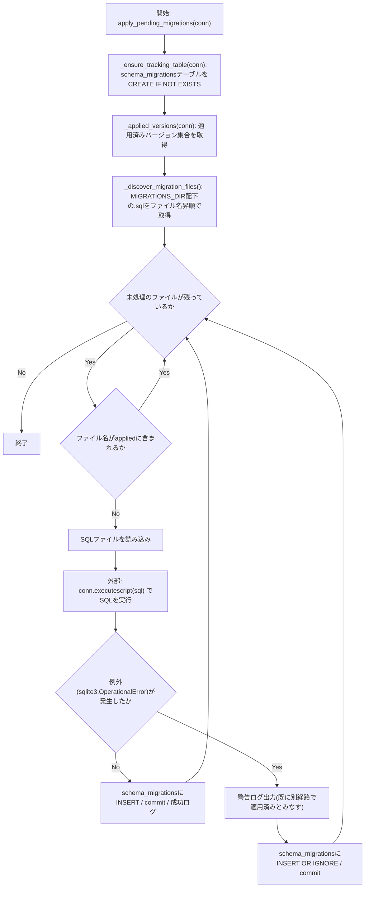
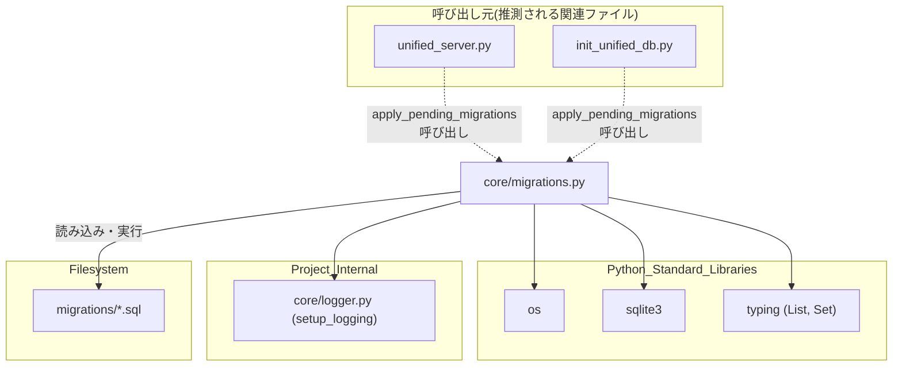

## 1. 解析メタ情報

| 項目 | 内容 |
| --- | --- |
| 対象ファイル | migrations.py |
| 言語 | Python |
| 解析対象 | 提供されたコードのみ |
| 推測・補完 | 一切なし |

## 関連ドキュメント

* [logger.md](./logger.md) - `setup_logging`を提供する`core/logger.py`。本ファイルのロガー初期化元
* [unified_server.md](./unified_server.md) - `apply_pending_migrations`をアプリ起動時に呼び出す呼び出し元
* [init_unified_db.md](./init_unified_db.md) - DB初期化処理の中で`apply_pending_migrations`を呼び出す呼び出し元
* [quest_service.md](./quest_service.md) - 本ファイルのモジュールdocstringで言及されている、従来の場当たり的なスキーマ変更(`sync_master_data()`内の実行時ALTER TABLE)を行っていたモジュール

## 2. ファイルの概要

`migrations/`ディレクトリ配下の`*.sql`ファイルをファイル名の昇順で適用し、適用済みバージョンを`schema_migrations`テーブルで管理する軽量なマイグレーションランナー。モジュールdocstringによれば、従来は`services/quest_service.py`の`sync_master_data()`内で「SELECTを試して失敗したらALTER TABLE」という実行時チェックとして場当たり的にスキーマ変更が追加されており、変更の追跡や複数プロセス同時実行時のレース懸念があったため、本モジュールが導入された(根拠: `[モジュールdocstring]` (行番号: 3〜15 / 抜粋: "これまでスキーマ変更は services/quest_service.py の sync_master_data() 内で"))。`MIGRATIONS_DIR`は本ファイル(`core/`配下)の親ディレクトリを基準に`migrations`サブディレクトリとして解決される(根拠: `[MIGRATIONS_DIR]` (行番号: 25 / 抜粋: "MIGRATIONS_DIR = os.path.join(os.path.dirname(os.path.dirname(os.path.abspath(__file__))), \"migrations\")"))。中心となる`apply_pending_migrations`は、追跡用テーブルの作成、適用済みバージョン一覧の取得、未適用の`.sql`ファイルの検出・順次実行という流れで処理を行い、`sqlite3.OperationalError`(例えば既に別経路で列が追加済みの場合の「duplicate column」等)を警告ログのみで許容し、適用済みとして記録したうえで処理を継続する設計になっている(根拠: `[apply_pending_migrations docstring]` (行番号: 50〜57 / 抜粋: "「duplicate column」のような sqlite3.OperationalError は、"))。

## 3. 外部依存関係

### インポート一覧

| 名称 | 種類 | 用途 | 根拠 |
| --- | --- | --- | --- |
| `os` | 標準ライブラリ | パス組み立て(`MIGRATIONS_DIR`)・ディレクトリ存在確認・ディレクトリ内ファイル一覧取得 | 根拠: `[import os]` (行番号: 17 / 抜粋: "import os") |
| `sqlite3` | 標準ライブラリ | SQLite接続オブジェクト(`sqlite3.Connection`)の型ヒント、および`sqlite3.OperationalError`の捕捉 | 根拠: `[import sqlite3]` (行番号: 18 / 抜粋: "import sqlite3") |
| `List`, `Set` | 標準ライブラリ(`typing`) | 関数の戻り値・型ヒント(`List[str]`, `Set[str]`)に使用 | 根拠: `[from typing import List, Set]` (行番号: 19 / 抜粋: "from typing import List, Set") |
| `setup_logging` | 内部モジュール(`core.logger`) | 本モジュール用ロガー(`core.migrations`)の初期化 | 根拠: `[from core.logger import setup_logging]` (行番号: 21 / 抜粋: "from core.logger import setup_logging") |

### ブラックボックスとなる外部要素

| 名称 | 理由 | 根拠 |
| --- | --- | --- |
| `migrations/*.sql`ファイルの内容 | 各マイグレーションファイル自体は本ファイルの解析範囲外であり、実際にどのようなDDL/DML(ALTER TABLE等)が実行されるかは提供されていないため。 | 根拠: `[sql読み込み・実行]` (行番号: 67〜72 / 抜粋: "with open(path, \"r\", encoding=\"utf-8\") as f:\n            sql = f.read()") |
| `conn`(呼び出し元から渡される`sqlite3.Connection`) | 接続オブジェクトがどのDBファイルに対して開かれているか、どのようなisolation_level等の設定かは呼び出し元の実装に依存し、本ファイルからは不明であるため。 | 根拠: `[apply_pending_migrations引数]` (行番号: 49 / 抜粋: "def apply_pending_migrations(conn: sqlite3.Connection) -> None:") |

## 4. 主要要素の定義（関数 / エンドポイント / コンポーネント）

### `_ensure_tracking_table`

* **役割**: マイグレーション適用履歴を記録する`schema_migrations`テーブルが存在しない場合に作成する。
* 根拠: `[_ensure_tracking_table]` (行番号: 28〜35 / 抜粋: "CREATE TABLE IF NOT EXISTS schema_migrations (\n            version TEXT PRIMARY KEY,\n            applied_at DATETIME DEFAULT CURRENT_TIMESTAMP\n        )")

* **引数/リクエスト**: `conn` (`sqlite3.Connection`。テーブル作成対象のDB接続)
* 根拠: `[関数シグネチャ]` (行番号: 28 / 抜粋: "def _ensure_tracking_table(conn: sqlite3.Connection) -> None:")

* **戻り値/レスポンス**: `None`
* 根拠: `[戻り値の型アノテーション]` (行番号: 28 / 抜粋: "-> None:")

* **副作用**: `CREATE TABLE IF NOT EXISTS`の実行および`conn.commit()`によるコミット。
* 根拠: `[conn.execute, conn.commit]` (行番号: 29〜35 / 抜粋: "conn.commit()")

* **エラーハンドリング**: なし(例外捕捉は行われていない)
* 根拠: `[関数本体]` (行番号: 28〜35 / 抜粋: "def _ensure_tracking_table(conn: sqlite3.Connection) -> None:")

### `_applied_versions`

* **役割**: `schema_migrations`テーブルから適用済みバージョン(ファイル名)の集合を取得する。
* 根拠: `[_applied_versions]` (行番号: 38〜40 / 抜粋: "rows = conn.execute(\"SELECT version FROM schema_migrations\").fetchall()\n    return {row[0] for row in rows}")

* **引数/リクエスト**: `conn` (`sqlite3.Connection`。問い合わせ対象のDB接続)
* 根拠: `[関数シグネチャ]` (行番号: 38 / 抜粋: "def _applied_versions(conn: sqlite3.Connection) -> Set[str]:")

* **戻り値/レスポンス**: `Set[str]`(適用済みマイグレーションファイル名の集合)
* 根拠: `[戻り値]` (行番号: 40 / 抜粋: "return {row[0] for row in rows}")

* **副作用**: なし(読み取り専用のクエリ実行)
* 根拠: `[関数本体]` (行番号: 38〜40 / 抜粋: "def _applied_versions(conn: sqlite3.Connection) -> Set[str]:")

* **エラーハンドリング**: なし
* 根拠: `[関数本体]` (行番号: 38〜40 / 抜粋: "def _applied_versions(conn: sqlite3.Connection) -> Set[str]:")

### `_discover_migration_files`

* **役割**: `MIGRATIONS_DIR`配下の`.sql`拡張子ファイルをファイル名昇順でリストアップする。ディレクトリが存在しない場合は空リストを返す。
* 根拠: `[_discover_migration_files]` (行番号: 43〜46 / 抜粋: "return sorted(f for f in os.listdir(MIGRATIONS_DIR) if f.endswith(\".sql\"))")

* **引数/リクエスト**: なし
* 根拠: `[関数シグネチャ]` (行番号: 43 / 抜粋: "def _discover_migration_files() -> List[str]:")

* **戻り値/レスポンス**: `List[str]`(ファイル名昇順の`.sql`ファイル名リスト、ディレクトリ不在時は`[]`)
* 根拠: `[戻り値]` (行番号: 44〜46 / 抜粋: "if not os.path.isdir(MIGRATIONS_DIR):\n        return []\n    return sorted(f for f in os.listdir(MIGRATIONS_DIR) if f.endswith(\".sql\"))")

* **副作用**: なし(ファイルシステムの読み取りのみ)
* 根拠: `[関数本体]` (行番号: 43〜46 / 抜粋: "def _discover_migration_files() -> List[str]:")

* **エラーハンドリング**: `MIGRATIONS_DIR`が存在しない場合は例外を発生させず空リストを返す。それ以外の例外(パーミッションエラー等)は捕捉されない。
* 根拠: `[os.path.isdir分岐]` (行番号: 44〜45 / 抜粋: "if not os.path.isdir(MIGRATIONS_DIR):\n        return []")

### `apply_pending_migrations`

* **役割**: 追跡テーブルの確保、適用済みバージョンの取得を行った上で、未適用の`.sql`ファイルをファイル名昇順で1件ずつ読み込み・実行し、成功時は`schema_migrations`に記録する。`sqlite3.OperationalError`発生時は警告ログを出したうえで適用済みとして記録し、処理を継続する。
* 根拠: `[apply_pending_migrations]` (行番号: 49〜82 / 抜粋: "def apply_pending_migrations(conn: sqlite3.Connection) -> None:")

* **引数/リクエスト**: `conn` (`sqlite3.Connection`。マイグレーションを適用する対象のDB接続)
* 根拠: `[関数シグネチャ]` (行番号: 49 / 抜粋: "def apply_pending_migrations(conn: sqlite3.Connection) -> None:")

* **戻り値/レスポンス**: `None`
* 根拠: `[戻り値の型アノテーション]` (行番号: 49 / 抜粋: "-> None:")

* **副作用**: `_ensure_tracking_table`によるテーブル作成、`conn.executescript`によるSQL実行(DDL/DML)、`schema_migrations`テーブルへのINSERT、`conn.commit()`によるコミット、`.sql`ファイル読み込み(`open`)、ログ出力(`logger.info`/`logger.warning`)。
* 根拠: `[副作用一式]` (行番号: 59, 67〜68, 72〜75, 81〜82 / 抜粋: "conn.executescript(sql)\n            conn.execute(\"INSERT INTO schema_migrations (version) VALUES (?)\", (filename,))\n            conn.commit()")

* **エラーハンドリング**: 各マイグレーションの実行を`try`ブロックで囲み、`sqlite3.OperationalError`のみを捕捉して`logger.warning`でログを出し、`INSERT OR IGNORE`で適用済みとして記録した上で次のファイルへ処理を継続する(起動を止めない設計)。`OperationalError`以外の例外については捕捉されず、呼び出し元に伝播する。
* 根拠: `[except sqlite3.OperationalError]` (行番号: 76〜82 / 抜粋: "except sqlite3.OperationalError as e:\n            logger.warning(\n                f\"⚠️ Migration '{filename}' could not be fully applied \"")

## 5. 処理フロー図

## 6. 依存関係図

## 7. 次のステップ（リバースエンジニアリングの提案）

| 優先度 | ファイル名(推測可) | 理由 | 根拠 |
| --- | --- | --- | --- |
| 高 | `migrations/0001_add_quest_users_role.sql`ほか`migrations/`配下の各`.sql`ファイル | 実際に適用されるDDL/DML内容を確認し、`apply_pending_migrations`が処理する対象の実体を把握するため。 | 根拠: `[sql読み込み]` (行番号: 66〜68 / 抜粋: "path = os.path.join(MIGRATIONS_DIR, filename)\n        with open(path, \"r\", encoding=\"utf-8\") as f:") |
| 高 | `unified_server.py` | `apply_pending_migrations`の実際の呼び出しタイミング(起動シーケンス上の位置)と渡される`conn`の生成元を確認するため。 | 根拠: `[モジュールdocstring, MIGRATIONS_DIR]` (行番号: 1〜15 / 抜粋: "本モジュールは migrations/ 配下の *.sql ファイルをファイル名の昇順で適用し") |
| 中 | `services/quest_service.py` | モジュールdocstringで言及されている、従来の場当たり的なスキーマ変更処理(`sync_master_data()`)との後方互換関係を確認するため。 | 根拠: `[モジュールdocstring]` (行番号: 5〜8, 12〜15 / 抜粋: "既存の quest_service.py 側の実行時チェックは、init_db() を経由しない\n既存の本番運用パス") |

## 8. 保守上の注意点

* **`OperationalError`の一律許容**: `apply_pending_migrations`は`sqlite3.OperationalError`を「既に別経路で適用済み」とみなして常に警告ログのみで処理を継続する設計であり、実際には別の原因(SQL構文エラー、テーブル不存在等)による`OperationalError`であっても同様に「適用済み」として記録されてしまう可能性がある。 根拠: `[except sqlite3.OperationalError]` (行番号: 76〜82 / 抜粋: "「既に別経路（旧来の実行時チェック等）で適用済み」とみなして警告ログのみ出力し")
* **`OperationalError`以外の例外は未捕捉**: マイグレーションSQL実行時に`sqlite3.IntegrityError`など`OperationalError`以外の例外が発生した場合は捕捉されず、そのまま呼び出し元(`unified_server.py`等の起動処理)に伝播し、起動処理自体を止める可能性がある。 根拠: `[except節がOperationalErrorのみ]` (行番号: 76 / 抜粋: "except sqlite3.OperationalError as e:")
* **旧来のスキーマ変更経路との併存**: モジュールdocstringで明言されている通り、`quest_service.py`側の実行時チェック(SELECT失敗時のALTER TABLE)は後方互換のためあえて残されており、スキーマ変更の経路が本モジュールと旧来の仕組みの2系統に分かれている。将来的な整合性維持には注意が必要。 根拠: `[モジュールdocstring]` (行番号: 12〜15 / 抜粋: "既存の quest_service.py 側の実行時チェックは、init_db() を経由しない\n既存の本番運用パス（sync_master_data の初回呼び出し時にのみ列が追加される\n運用）との後方互換のため、あえて残している。")
* **ファイル名の辞書式ソートに依存**: マイグレーションの適用順序は`sorted()`によるファイル名の辞書式ソートに完全依存しており(行番号46)、ファイル名の命名規則(`0001_`, `0002_`等の連番プレフィックス)が崩れると適用順序が意図と異なる可能性がある。 根拠: `[sorted]` (行番号: 46 / 抜粋: "return sorted(f for f in os.listdir(MIGRATIONS_DIR) if f.endswith(\".sql\"))")

## 9. 不明事項一覧

| 項目 | 理由 | 必要なファイル |
| --- | --- | --- |
| 各マイグレーションファイルの実際のSQL内容 | `migrations/`配下の`.sql`ファイル自体は本ファイルの解析範囲外であるため。 | `migrations/0001_add_quest_users_role.sql`ほか`migrations/`配下の各`.sql`ファイル |
| `apply_pending_migrations`の実際の呼び出しタイミング・渡される`conn`の生成方法 | 呼び出し元のコードは本ファイルに含まれていないため。 | `unified_server.py`、`init_unified_db.py` |
| `quest_service.py`側の実行時チェックとの具体的な整合性(競合の有無) | `quest_service.py`の実装内容自体は本ファイルの解析範囲外であるため。 | `services/quest_service.py` |

## 10. 自己検証結果

* [x] 推測・外部ファイルの仕様を一切含んでいない（完了）
* [x] 全関数・全クラス・全コンポーネントを列挙した（完了）
* [x] 全てのインポート要素を列挙した（完了）
* [x] すべての仕様説明に「根拠（行番号・抜粋）」を明記した（完了）
* [x] 根拠漏れが0件である（完了）
* [x] Mermaid構文にエラーの原因となる記号（エスケープ漏れ）がない（完了）
* [x] 不明事項を漏れなく列挙した（完了）
