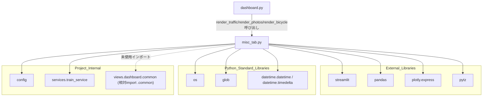

## 1. 解析メタ情報

| 項目 | 内容 |
| --- | --- |
| 対象ファイル | `views/dashboard/misc_tab.py` |
| 言語 | Python |
| 解析対象 | 提供されたコードのみ |
| 推測・補完 | 一切なし |

## 関連ドキュメント

* [train_service.md](./train_service.md) - `services.train_service`の実体。`get_jr_traffic_status`, `get_route_info`を提供
* [config.md](./config.md) - `config.ASSETS_DIR`を提供
* [dashboard_common.md](./dashboard_common.md) - `views.dashboard.common`の実体（相対インポート`.common`）。`render_status_card_html`を提供するが本ファイル内では未使用
* [dashboard.md](./dashboard.md) - 呼び出し元。`views.dashboard.misc_tab`をインポートし、電車遅延・防犯カメラ・駐輪場の3タブとして`render_traffic`, `render_photos`, `render_bicycle`を呼び出す

## 2. ファイルの概要

* Streamlitダッシュボードの「電車遅延」「防犯カメラ」「駐輪場」タブを描画するモジュール。公開関数`render_traffic`, `render_photos`, `render_bicycle`と、内部ヘルパー関数`_render_route_search`で構成される。
* 根拠: `def render_traffic():`, `def render_photos(df_security_log: pd.DataFrame):`, `def render_bicycle(df_bicycle: pd.DataFrame):` (行番号: 14, 89, 115 / 抜粋: "def render_traffic():")
* `render_traffic`は、JR宝塚線・神戸線の運行状況を`train_service.get_jr_traffic_status()`から取得し、遅延中(赤)・情報取得不可(グレー)・平常運転(緑)の3状態に応じて背景色を変えたHTMLカードで表示する。取得不可を平常運転と同じ緑色で表示しないための区別であり、さらに現在時刻に応じて出勤ルート（4〜11時台）または帰宅ルート（それ以外）の経路検索結果を表示する。
* 根拠: `jr_status = train_service.get_jr_traffic_status()` (行番号: 16 / 抜粋: "jr_status = train_service.get_jr_traffic_status()"), `elif line.get("is_unavailable"):` (行番号: 24 / 抜粋: "elif line.get(\"is_unavailable\"):"), `if 4 <= current_hour < 12:` (行番号: 45 / 抜粋: "if 4 <= current_hour < 12:")
* `_render_route_search`は、指定された出発駅・到着駅間のルート情報を`train_service.get_route_info`から取得し、乗換ステップをアイコン（⬇️/🔄）に応じたHTMLに整形して表示する。
* 根拠: `data = train_service.get_route_info(from_st, to_st)` (行番号: 56 / 抜粋: "data = train_service.get_route_info(from_st, to_st)")
* `render_photos`は、`config.ASSETS_DIR`配下の`snapshots`ディレクトリからJPEG画像を新しい順に取得しギャラリー表示（直近4枚+展開エリアで過去分）した上、渡された`df_security_log`（防犯ログ）を表形式で表示する。
* 根拠: `img_dir = os.path.join(config.ASSETS_DIR, "snapshots")` (行番号: 91 / 抜粋: "img_dir = os.path.join(config.ASSETS_DIR, \"snapshots\")")
* `render_bicycle`は、渡された`df_bicycle`（駐輪場データ）を特定3エリアに絞り込み、待機数の時系列推移を折れ線グラフで表示した上、各エリアの最新状況を表形式で表示する。
* 根拠: `target_areas = [...]` および `fig = px.line(df_target, ...)` (行番号: 121〜125, 132 / 抜粋: "target_areas = [")

## 3. 外部依存関係

### インポート一覧

| 名称 | 種類 | 用途 | 根拠 |
| --- | --- | --- | --- |
| `streamlit` | 外部ライブラリ | UI描画全般（サブヘッダー、カラム、Markdown、画像表示、データフレーム等） | `import streamlit as st` (行番号: 2 / 抜粋: "import streamlit as st") |
| `pandas` | 外部ライブラリ | `render_photos`, `render_bicycle`の引数型注釈（`pd.DataFrame`）およびフィルタ・整形処理 | `import pandas as pd` (行番号: 3 / 抜粋: "import pandas as pd") |
| `plotly.express` | 外部ライブラリ | 駐輪場待機数の折れ線グラフ生成 | `import plotly.express as px` (行番号: 4 / 抜粋: "import plotly.express as px") |
| `os` | 標準ライブラリ | パス結合(`os.path.join`)、ファイル名抽出(`os.path.basename`) | `import os` (行番号: 5 / 抜粋: "import os") |
| `glob` | 標準ライブラリ | スナップショット画像ファイルの検索(`glob.glob`) | `import glob` (行番号: 6 / 抜粋: "import glob") |
| `datetime`, `timedelta` | 標準ライブラリ | 現在時刻取得、出発時刻の20分後計算 | `from datetime import datetime, timedelta` (行番号: 7 / 抜粋: "from datetime import datetime, timedelta") |
| `pytz` | 外部ライブラリ | タイムゾーン（Asia/Tokyo）の処理 | `import pytz` (行番号: 8 / 抜粋: "import pytz") |
| `config` | 内部モジュール | 画像保存先ディレクトリ(`config.ASSETS_DIR`)の取得 | `import config` (行番号: 10 / 抜粋: "import config") |
| `train_service` | 内部モジュール | JR運行状況・経路検索データの取得 | `from services import train_service` (行番号: 11 / 抜粋: "from services import train_service") |
| `render_status_card_html` | 内部モジュール | `views.dashboard.common`（相対インポート`.common`）からインポートされているが、本ファイル内では使用されていない | `from .common import render_status_card_html` (行番号: 12 / 抜粋: "from .common import render_status_card_html") |

### ブラックボックスとなる外部要素

| 名称 | 理由 | 根拠 |
| --- | --- | --- |
| `train_service.get_jr_traffic_status()` | `services.train_service`の実装が提供されておらず、返却される辞書のキー（`宝塚線`, `神戸線`以下の`is_delay`, `is_unavailable`, `status`, `detail`）の取得元（スクレイピング/API等）が不明。 | `jr_status = train_service.get_jr_traffic_status()` (行番号: 16 / 抜粋: "jr_status = train_service.get_jr_traffic_status()") |
| `train_service.get_route_info()` | ルート検索データの取得元・`summary`, `details`, `departure`, `arrival`, `duration`, `cost`, `transfer`, `url`各フィールドの生成ロジックが不明。 | `data = train_service.get_route_info(from_st, to_st)` (行番号: 56 / 抜粋: "data = train_service.get_route_info(from_st, to_st)") |
| `config.ASSETS_DIR` | `config`モジュールの実装が提供されておらず、画像アセットのベースディレクトリの実際のパスが不明。 | `img_dir = os.path.join(config.ASSETS_DIR, "snapshots")` (行番号: 91 / 抜粋: "img_dir = os.path.join(config.ASSETS_DIR, \"snapshots\")") |

## 4. 主要要素の定義（関数 / エンドポイント / コンポーネント）

### `render_traffic`

* **役割**: JR宝塚線・神戸線の運行状況を、遅延中(赤)・情報取得不可(グレー)・平常運転(緑)の3状態に応じた背景色のカードで表示し、さらに現在時刻に応じた通勤/帰宅ルートの検索結果を表示する。
* 根拠: `def render_traffic():` (行番号: 14〜51 / 抜粋: "def render_traffic():"), `elif line.get("is_unavailable"):` (行番号: 24 / 抜粋: "elif line.get(\"is_unavailable\"):")

* **引数/リクエスト**: なし
* 根拠: `def render_traffic():` (行番号: 14 / 抜粋: "def render_traffic():")

* **戻り値/レスポンス**: なし
* 根拠: `def render_traffic():` (行番号: 14 / 抜粋: "def render_traffic():")

* **副作用**: `train_service.get_jr_traffic_status()`経由の外部データ取得。`st.subheader`, `st.columns`, `st.markdown`(HTML埋め込み), `st.caption`によるUI描画。内部で`_render_route_search`を呼び出す。
* 根拠: `st.markdown(f"""\n            <div style="background-color:{bg_color}; ...` (行番号: 30〜36 / 抜粋: "st.markdown(f\"\"\"")

* **エラーハンドリング**: なし（明示的な例外捕捉は行われていない）
* 根拠: `def render_traffic():` 全体 (行番号: 14〜51 / 抜粋: "def render_traffic():")

### `_render_route_search`

* **役割**: 指定区間（`from_st`から`to_st`）の経路情報を取得し、区切り線（⬇️）や乗換（🔄）を含む乗換ステップをHTMLに整形した「経路カード」として表示する。取得失敗時は警告を表示する。
* 根拠: `def _render_route_search(col, from_st: str, to_st: str, label_icon: str):` (行番号: 53〜87 / 抜粋: "def _render_route_search(col, from_st: str, to_st: str, label_icon: str):")

* **引数/リクエスト**: `col` (型: 明示なし。Streamlitのコンテナ/カラムオブジェクト)、`from_st` (型: `str`。出発駅名)、`to_st` (型: `str`。到着駅名)、`label_icon` (型: `str`。見出しに付与するアイコン付きラベル)
* 根拠: `def _render_route_search(col, from_st: str, to_st: str, label_icon: str):` (行番号: 53 / 抜粋: "def _render_route_search(col, from_st: str, to_st: str, label_icon: str):")

* **戻り値/レスポンス**: なし
* 根拠: `def _render_route_search(col, from_st: str, to_st: str, label_icon: str):` (行番号: 53 / 抜粋: "def _render_route_search(col, from_st: str, to_st: str, label_icon: str):")

* **副作用**: `train_service.get_route_info()`経由の外部データ取得。`st.markdown`(HTML埋め込み)、`st.link_button`、`st.warning`によるUI描画。
* 根拠: `data = train_service.get_route_info(from_st, to_st)` (行番号: 56 / 抜粋: "data = train_service.get_route_info(from_st, to_st)")

* **エラーハンドリング**: `data["summary"]`が`"取得成功"`以外の場合に`st.warning`を表示する分岐のみで、明示的な例外捕捉(`try/except`)は行われていない。
* 根拠: `if data["summary"] == "取得成功":` ... `else:\n            st.warning("ルート情報を取得できませんでした")` (行番号: 57, 86〜87 / 抜粋: "else:\n            st.warning(\"ルート情報を取得できませんでした\")")

### `render_photos`

* **役割**: `config.ASSETS_DIR`配下のスナップショット画像をギャラリー表示し、渡された防犯ログ（`df_security_log`）を検知種別・画像パス列を含めて表形式表示する。
* 根拠: `def render_photos(df_security_log: pd.DataFrame):` (行番号: 89〜113 / 抜粋: "def render_photos(df_security_log: pd.DataFrame):")

* **引数/リクエスト**: `df_security_log` (型: `pd.DataFrame`。`timestamp`, `friendly_name`列を必須とし、`classification`, `image_path`列を任意で含む防犯ログデータ)
* 根拠: `def render_photos(df_security_log: pd.DataFrame):` (行番号: 89 / 抜粋: "def render_photos(df_security_log: pd.DataFrame):")

* **戻り値/レスポンス**: なし
* 根拠: `def render_photos(df_security_log: pd.DataFrame):` (行番号: 89 / 抜粋: "def render_photos(df_security_log: pd.DataFrame):")

* **副作用**: `glob.glob`によるローカルファイルシステムの走査（画像一覧取得）。`st.columns`, `st.image`, `st.expander`, `st.dataframe`, `st.info`によるUI描画。
* 根拠: `images = sorted(glob.glob(os.path.join(img_dir, "*.jpg")), reverse=True)` (行番号: 92 / 抜粋: "images = sorted(glob.glob(os.path.join(img_dir, \"*.jpg\")), reverse=True)")

* **エラーハンドリング**: なし（明示的な例外捕捉は行われていない。画像・ログが空の場合は`st.info`でメッセージ表示するのみ）
* 根拠: `else:\n        st.info("写真なし")` (行番号: 101〜102 / 抜粋: "st.info(\"写真なし\")")

### `render_bicycle`

* **役割**: 渡された`df_bicycle`を特定の3駐輪場エリアに絞り込み、待機台数の時系列推移を折れ線グラフ表示し、直近の状況を表形式でも表示する。
* 根拠: `def render_bicycle(df_bicycle: pd.DataFrame):` (行番号: 115〜138 / 抜粋: "def render_bicycle(df_bicycle: pd.DataFrame):")

* **引数/リクエスト**: `df_bicycle` (型: `pd.DataFrame`。`area_name`, `timestamp`, `waiting_count`, `status_text`列を含む駐輪場データ)
* 根拠: `def render_bicycle(df_bicycle: pd.DataFrame):` (行番号: 115 / 抜粋: "def render_bicycle(df_bicycle: pd.DataFrame):")

* **戻り値/レスポンス**: なし（`df_bicycle`が空、または対象エリアに一致するデータが無い場合はメッセージ表示後に早期`return`）
* 根拠: `if df_bicycle.empty:\n        st.info("駐輪場データがまだありません。")\n        return` (行番号: 117〜119 / 抜粋: "if df_bicycle.empty:"), `if df_target.empty:\n        st.warning("指定されたエリアのデータが見つかりません。")\n        return` (行番号: 128〜130 / 抜粋: "if df_target.empty:")

* **副作用**: `st.title`, `st.info`, `st.warning`, `st.plotly_chart`, `st.subheader`, `st.dataframe`によるUI描画。
* 根拠: `st.plotly_chart(fig, width="stretch")` (行番号: 134 / 抜粋: "st.plotly_chart(fig, width=\"stretch\")")

* **エラーハンドリング**: なし（明示的な例外捕捉は行われていない）
* 根拠: `def render_bicycle(df_bicycle: pd.DataFrame):` 全体 (行番号: 115〜138 / 抜粋: "def render_bicycle(df_bicycle: pd.DataFrame):")

## 5. 処理フロー図

```mermaid
flowchart TD
    subgraph render_traffic_Flow["render_traffic() 処理フロー"]
        RTf1["開始"] --> RTf2["外部: train_service.get_jr_traffic_status()"]
        RTf2 --> RTf3["宝塚線・神戸線カードをHTML表示"]
        RTf3 --> RTf4["現在時刻(JST)取得"]
        RTf4 --> RTf5{"現在時刻の判定"}
        RTf5 -- "4時〜12時未満" --> RTf6["_render_route_search(伊丹→長岡京, 出勤)"]
        RTf5 -- "12時〜23時" --> RTf7["_render_route_search(長岡京→伊丹, 帰宅)"]
        RTf5 -- "それ以外(深夜)" --> RTf8["caption表示 + _render_route_search(長岡京→伊丹, 帰宅)"]
        RTf6 --> RTf9["終了"]
        RTf7 --> RTf9
        RTf8 --> RTf9
    end

    subgraph route_search_Flow["_render_route_search() 処理フロー"]
        RS1["開始"] --> RS2["外部: train_service.get_route_info()"]
        RS2 --> RS3{"summaryが取得成功か"}
        RS3 -- No --> RS4["st.warning表示"]
        RS3 -- Yes --> RS5["乗換ステップをHTML整形"]
        RS5 --> RS6["経路カードをst.markdownで表示"]
        RS6 --> RS7{"urlが存在するか"}
        RS7 -- Yes --> RS8["Yahoo!路線情報リンクボタン表示"]
        RS7 -- No --> RS9["終了"]
        RS8 --> RS9
        RS4 --> RS9
    end

    subgraph render_photos_Flow["render_photos() 処理フロー"]
        RP1["開始"] --> RP2["外部: glob.glob でsnapshots内*.jpgを検索"]
        RP2 --> RP3{"imagesが存在するか"}
        RP3 -- Yes --> RP4["直近4枚を表示 + expanderで過去分表示"]
        RP3 -- No --> RP5["写真なし表示"]
        RP4 --> RP6
        RP5 --> RP6["防犯ログ表示"]
        RP6 --> RP7{"df_security_logが空でないか"}
        RP7 -- Yes --> RP8["列を整形しdataframe表示"]
        RP7 -- No --> RP9["不審な検知なし表示"]
        RP8 --> RP10["終了"]
        RP9 --> RP10
    end

    subgraph render_bicycle_Flow["render_bicycle() 処理フロー"]
        RB1["開始"] --> RB2{"df_bicycleが空か"}
        RB2 -- Yes --> RB3["info表示 + return"]
        RB2 -- No --> RB4["対象3エリアで絞り込み"]
        RB4 --> RB5{"df_targetが空か"}
        RB5 -- Yes --> RB6["warning表示 + return"]
        RB5 -- No --> RB7["px.lineで折れ線グラフ生成・表示"]
        RB7 --> RB8["最新状況をdataframe表示"]
        RB8 --> RB9["終了"]
    end
```

## 6. 依存関係図

## 7. 次のステップ（リバースエンジニアリングの提案）

| 優先度 | ファイル名(推測可) | 理由 | 根拠 |
| --- | --- | --- | --- |
| 高 | `services/train_service.py` | `get_jr_traffic_status`, `get_route_info`が返す辞書の正確なスキーマとデータ取得方法（外部APIかスクレイピングか）を把握するため。 | `data = train_service.get_route_info(from_st, to_st)` (行番号: 56 / 抜粋: "data = train_service.get_route_info(from_st, to_st)") |
| 中 | `config.py` | `ASSETS_DIR`の実際のパスを把握し、スナップショット画像の保存構造を確認するため。 | `img_dir = os.path.join(config.ASSETS_DIR, "snapshots")` (行番号: 91 / 抜粋: "img_dir = os.path.join(config.ASSETS_DIR, \"snapshots\")") |
| 低 | `views/dashboard/common.py` | インポートされているが未使用の`render_status_card_html`が本来使われる予定だったか、削除漏れかを確認するため。 | `from .common import render_status_card_html` (行番号: 12 / 抜粋: "from .common import render_status_card_html") |

## 8. 保守上の注意点

* **未使用インポート**: `render_status_card_html`が`.common`からインポートされているが、本ファイル内のいずれの関数でも使用されていない。
* 根拠: `from .common import render_status_card_html` (行番号: 12 / 抜粋: "from .common import render_status_card_html")

* **HTMLインジェクションの潜在リスク**: `unsafe_allow_html=True`を伴う`st.markdown`呼び出しが複数箇所にあり、`train_service`から取得した`line['status']`, `line['detail']`, `data`内の各文字列がエスケープなしでHTMLに埋め込まれる。データ取得元が外部サイトのスクレイピング結果等である場合、想定外のHTML/スクリプトが混入するリスクがある。
* 根拠: `st.markdown(f"""...{line['status']}...""", unsafe_allow_html=True)` (行番号: 30〜36 / 抜粋: "st.markdown(f\"\"\""), `st.markdown(f"""...{data['departure']}...""", unsafe_allow_html=True)` (行番号: 67〜83 / 抜粋: "st.markdown(f\"\"\"")

* **時間帯判定のハードコード**: 出勤/帰宅ルートの切り替え条件（4〜12時、12〜23時、それ以外）が関数内にマジックナンバーとしてハードコードされており、設定変更にはコード修正が必要。
* 根拠: `if 4 <= current_hour < 12:` (行番号: 45 / 抜粋: "if 4 <= current_hour < 12:")

* **エラーハンドリングの欠如**: 本ファイル内のいずれの関数にも`try/except`による例外捕捉がなく（`_render_route_search`内の`summary`チェックのみで代替）、`train_service`や画像ファイルアクセスで例外が送出された場合はタブ全体の描画が中断する可能性がある。
* 根拠: `def render_traffic():` 以降の全関数定義 (行番号: 14〜138 / 抜粋: "def render_traffic():")

## 9. 不明事項一覧

| 項目 | 理由 | 必要なファイル |
| --- | --- | --- |
| `train_service.get_jr_traffic_status`, `get_route_info`の実装・データ取得元 | `services.train_service`の実装が提供されていないため。 | `services/train_service.py` |
| `config.ASSETS_DIR`の実際のパス | `config`モジュールの実装が提供されていないため。 | `config.py` |
| `render_status_card_html`が未使用インポートである理由 | 本ファイル単体では設計意図（将来使用予定か削除漏れか）が判断できないため。 | `views/dashboard/common.py` およびGitの変更履歴 |

## 相互参照による補足情報

| 元の不明事項 | 判明した内容 | 参照元ドキュメント |
| --- | --- | --- |
| `train_service.get_jr_traffic_status`, `get_route_info`の実装・データ取得元 | `MY_HOME_SYSTEM/services/train_service.py`を直接確認した。`get_jr_traffic_status()`(22〜70行目)は、まず結果辞書を「⚪ 情報取得不可」/`is_unavailable=True`で初期化する(33〜36行目。取得不可を「🟢 平常運転」と偽らないためのフェイルセーフ)。JR西日本の運行情報API(`JR_WEST_JSON_URL = "https://www.train-guide.westjr.co.jp/api/v3/area_kinki_trafficinfo.json"`、17行目)へ`requests.get(timeout=5)`し(39行目)、`status_code == 200`であれば各路線を一旦「🟢 平常運転」/`is_unavailable=False`にリセットした上で(44〜45行目)、レスポンスJSONの`lines`辞書のうち路線ID`"G"`(宝塚線)/`"A"`(神戸線)のみを対象に、ステータス文字列に「見合」または「運休」を含めば`is_suspended=True`とする(50〜63行目)。API呼び出しが例外を送出した場合は`except Exception`(65〜66行目)で捕捉するが、リセット処理を経ていないため結果辞書は初期値の「情報取得不可」/`is_unavailable=True`のまま返る(67〜68行目のコメントの通り「平常運転」と偽らない設計)。`get_route_info(from_station="伊丹(兵庫県)", to_station="長岡京")`(72行目〜)はYahoo!路線情報(`YAHOO_SEARCH_URL = "https://transit.yahoo.co.jp/search/result"`、20行目)を、現在時刻の20分後を出発時刻として`requests.get`し、`BeautifulSoup`で`#rsltlst li.el`または`.routeSummary`セレクタからHTMLをスクレイピングする設計であることを確認した(この関数自体は本コミットでは変更されていない)。 | 直接ソース確認: `MY_HOME_SYSTEM/services/train_service.py:17-70, 72-118` |
| `config.ASSETS_DIR`の実際のパス | `MY_HOME_SYSTEM/config.py`224〜227行目を直接確認した。`ASSETS_DIR: str = ensure_safe_path_with_backoff(os.path.join(NAS_PROJECT_ROOT, "assets"), "assets")`と定義されており、`NAS_PROJECT_ROOT`(217行目)は`os.path.join(NAS_MOUNT_POINT, "home_system")`(既定`NAS_MOUNT_POINT="/mnt/nas"`)であるため、本来のパスは`/mnt/nas/home_system/assets`である。`ensure_safe_path_with_backoff`(98〜136行目)は`verify_and_initialize_storage`によるNASマウント確認・初期化を試み(116行目)、失敗した場合は`config.py`と同じディレクトリ配下の`temp_fallback/assets`をローカルフォールバックとして作成・返却するフェイルソフト設計であることを確認した。 | 直接ソース確認: `MY_HOME_SYSTEM/config.py:98-136, 216-227` |
| `render_status_card_html`が未使用インポートである理由 | `MY_HOME_SYSTEM/views/dashboard/common.py`50〜57行目を直接確認した。`render_status_card_html(title, value, theme)`はステータスカードのHTML断片（`
...`）を返す関数であり、本ファイル(`misc_tab.py`)内では`from .common import render_status_card_html`(12行目)でインポートされているものの、`render_traffic`/`render_photos`/`render_bicycle`のいずれからも呼び出されていないことを再確認した。一方でリポジトリ内を検索したところ、同じ関数は`MY_HOME_SYSTEM/views/dashboard/summary.py`9行目でも同様にインポートされ、222〜234行目で「高砂」「伊丹」「車」「炊飯器」「電気代」「駐輪場待機」「JR運行情報」「サーバー」「NAS」の9件のステータスカード描画に実際に使用されていることを確認した。`misc_tab.py`と`summary.py`の両方に同一インポート文が存在することから、`summary.py`用に導入した共通関数を`misc_tab.py`側にもコピー（または将来の共通化を見越して先行追加）した後、`misc_tab.py`側では結局呼び出しコードを書かなかった（削除し忘れた）可能性が高いと考えられるが、`git log --oneline`で本ファイルの履歴を確認したところ記録されているコミットは2件（いずれもリポジトリ全体のリファクタリング・一括コミットで、本ファイル単体の変更意図を示す粒度のログではない）のみであり、真の設計意図（将来使用予定か削除漏れか）を示す記録は見つからず、確定的な結論には至らなかった。 | 直接ソース確認: `MY_HOME_SYSTEM/views/dashboard/common.py:50-57`, `MY_HOME_SYSTEM/views/dashboard/misc_tab.py:12`, `MY_HOME_SYSTEM/views/dashboard/summary.py:9, 222-234`（`git log --oneline -- MY_HOME_SYSTEM/views/dashboard/misc_tab.py`は2コミットのみで詳細な経緯の記録なしを確認） |

## 10. 自己検証結果

* [x] 推測・外部ファイルの仕様を一切含んでいない
* [x] 全関数・全クラス・全コンポーネントを列挙した
* [x] 全てのインポート要素を列挙した
* [x] すべての仕様説明に「根拠（行番号・抜粋）」を明記した
* [x] 根拠漏れが0件である
* [x] Mermaid構文にエラーの原因となる記号（エスケープ漏れ）がない
* [x] 不明事項を漏れなく列挙した
