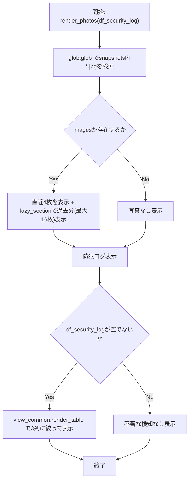
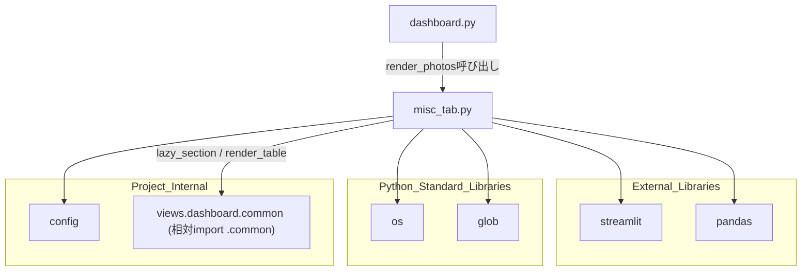

## 1. 解析メタ情報

| 項目 | 内容 |
| --- | --- |
| 対象ファイル | `views/dashboard/misc_tab.py` |
| 言語 | Python |
| 解析対象 | 提供されたコードのみ |
| 推測・補完 | 一切なし |

> **（2026-09-21 に大幅縮小）** 本ファイルが持っていた `render_traffic`（JR宝塚線・神戸線の運行状況）、`_render_route_search`（Yahoo!路線情報の出勤/帰宅ルート検索）、`render_bicycle`（駐輪場の待機数推移）は、いずれも使わなくなったためオーナー判断で機能ごと削除された。これらを束ねていた「🚃 おでかけ」タブも `dashboard.py` から撤去されている。削除された関数の解析内容は、本ファイルの git 履歴と [train_service.md](./train_service.md)（廃止notice付き）を参照。現在はカメラ関連（ギャラリーと防犯ログ）の `render_photos` だけが残り、「👀 見守り」タブから呼ばれる。

## 関連ドキュメント

* [dashboard_common.md](./dashboard_common.md) - `views.dashboard.common`の実体（相対インポート`.common`）。折りたたみ（`lazy_section`）・表描画（`render_table`）を提供
* [config.md](./config.md) - `config.ASSETS_DIR`を提供
* [dashboard.md](./dashboard.md) - 呼び出し元。「👀 見守り」タブで`render_photos`を呼び出す
* [train_service.md](./train_service.md) - **（廃止）** かつて`render_traffic`/`_render_route_search`が（`view_common`のキャッシュ付きラッパー経由で）使っていた運行情報・ルート検索の提供元。本ファイルからの削除と同時にソースごと退役した

## 2. ファイルの概要

* Streamlitダッシュボードの「👀 見守り」タブで、カメラのスナップショットギャラリーと防犯ログを描画するモジュール。公開関数は`render_photos`の1つだけで構成される。
* 根拠: `def render_photos(df_security_log: pd.DataFrame):` (行番号: 17 / 抜粋: "def render_photos(")
* `render_photos`は、`config.ASSETS_DIR`配下の`snapshots`ディレクトリからJPEG画像を新しい順に取得しギャラリー表示（直近4枚 + 折りたたみの中で過去分）した上、渡された`df_security_log`（防犯ログ）を表形式で表示する。
* 根拠: `img_dir = os.path.join(config.ASSETS_DIR, "snapshots")` (行番号: 19 / 抜粋: "img_dir = os.path.join(config.ASSETS_DIR, \"snapshots\")")
* モジュールのdocstringに、電車の運行情報・ルート検索・駐輪場の待機数がここにあった旨と、それらが退役した経緯が記録されている。
* 根拠: `"""「見守り」タブのカメラ関連(ギャラリーと防犯ログ)の描画。` (行番号: 2 / 抜粋: "\"\"\"「見守り」タブのカメラ関連(ギャラリーと防犯ログ)の描画。")

## 3. 外部依存関係

### インポート一覧

| 名称 | 種類 | 用途 | 根拠 |
| --- | --- | --- | --- |
| `streamlit` | 外部ライブラリ | UI描画全般（サブヘッダー、カラム、コンテナ、画像表示、情報メッセージ） | `import streamlit as st` (行番号: 8 / 抜粋: "import streamlit as st") |
| `pandas` | 外部ライブラリ | `render_photos`の引数型注釈（`pd.DataFrame`）と空判定 | `import pandas as pd` (行番号: 9 / 抜粋: "import pandas as pd") |
| `os` | 標準ライブラリ | パス結合(`os.path.join`)、ファイル名抽出(`os.path.basename`) | `import os` (行番号: 10 / 抜粋: "import os") |
| `glob` | 標準ライブラリ | スナップショット画像ファイルの検索(`glob.glob`) | `import glob` (行番号: 11 / 抜粋: "import glob") |
| `config` | 内部モジュール | 画像保存先ディレクトリ(`config.ASSETS_DIR`)の取得 | `import config` (行番号: 13 / 抜粋: "import config") |
| `views.dashboard.common` (`view_common`) | 内部モジュール | 折りたたみ(`lazy_section`)、表描画(`render_table`) | `from . import common as view_common` (行番号: 14 / 抜粋: "from . import common as view_common") |

**（2026-09-21 に削除）** `html`・`plotly.express`・`datetime`・`pytz` のインポートは、`render_traffic`/`_render_route_search`/`render_bicycle` の削除に伴い不要になった。

### ブラックボックスとなる外部要素

| 名称 | 理由 | 根拠 |
| --- | --- | --- |
| `config.ASSETS_DIR` | 画像アセットのベースディレクトリの実際のパスは[config.md](./config.md)側にある。 | `img_dir = os.path.join(config.ASSETS_DIR, "snapshots")` (行番号: 19 / 抜粋: "img_dir = os.path.join(config.ASSETS_DIR, \"snapshots\")") |
| `view_common.lazy_section` / `view_common.render_table` | 折りたたみの状態保持・表の列絞りの実装は[dashboard_common.md](./dashboard_common.md)側にある。 | `if view_common.lazy_section("📂 過去の写真", key="past_photos"):` (行番号: 29 / 抜粋: "if view_common.lazy_section(\"📂 過去の写真\", key=\"past_photos\"):") |

## 4. 主要要素の定義（関数 / エンドポイント / コンポーネント）

### `render_photos`

* **役割**: `config.ASSETS_DIR`配下のスナップショット画像をギャラリー表示し、渡された防犯ログ（`df_security_log`）を検知時刻・デバイス・検知種別の3列で表形式表示する。
* 根拠: `def render_photos(df_security_log: pd.DataFrame):` (行番号: 17〜48 / 抜粋: "def render_photos(")

* **引数/リクエスト**: `df_security_log` (型: `pd.DataFrame`。`timestamp`, `friendly_name`, `classification`列のうち実在するものが表に出る。**（スマホ対応で変更）** `image_path`（NAS上のフルパス）は表から落とした — 画面幅を大きく超えて横スクロールしないと検知時刻すら読めなかったため。画像は上のギャラリーで見る)
* 根拠: `{"timestamp": "検知時刻", "friendly_name": "デバイス", "classification": "検知種別"},` (行番号: 44 / 抜粋: "{\"timestamp\": \"検知時刻\", \"friendly_name\": \"デバイス\", \"classification\": \"検知種別\"},")

* **戻り値/レスポンス**: なし
* 根拠: `def render_photos(df_security_log: pd.DataFrame):` (行番号: 17 / 抜粋: "def render_photos(")

* **副作用**: `glob.glob`によるローカルファイルシステムの走査（画像一覧取得）。`st.subheader`, `st.columns`, `st.container`, `st.image`, `st.info`、`view_common.lazy_section`、`view_common.render_table`によるUI描画。**（スマホ対応で変更）** 「📂 過去の写真」は`st.expander`から`lazy_section`（`st.toggle`ベース）になった — `st.expander`は折りたたまれていても中身を実行するため、閉じたままでも過去16枚の画像読み込みが毎回走っていた。直近4枚と過去分はそれぞれ`st.container(key="camera_gallery"/"camera_gallery_past")`で囲み、スマホ幅でも2列で並ぶようCSS側から拾えるようにしている。
* 根拠: `images = sorted(glob.glob(os.path.join(img_dir, "*.jpg")), reverse=True)` (行番号: 20 / 抜粋: "images = sorted(glob.glob(os.path.join(img_dir, \"*.jpg\")), reverse=True)")

* **エラーハンドリング**: なし（明示的な例外捕捉は行われていない。画像・ログが空の場合は`st.info`でメッセージ表示するのみ）
* 根拠: `st.info("写真なし")` (行番号: 35 / 抜粋: "st.info(\"写真なし\")")

## 5. 処理フロー図

## 6. 依存関係図

## 7. 次のステップ（リバースエンジニアリングの提案）

| 優先度 | ファイル名(推測可) | 理由 | 根拠 |
| --- | --- | --- | --- |
| 高 | `views/dashboard/common.py` | `lazy_section`の開閉状態の持ち方と`render_table`の列絞り・相対時刻表示の実装を把握するため。 | `if view_common.lazy_section("📂 過去の写真", key="past_photos"):` (行番号: 29 / 抜粋: "if view_common.lazy_section(\"📂 過去の写真\", key=\"past_photos\"):") |
| 中 | `config.py` | `ASSETS_DIR`の実際のパスを把握し、スナップショット画像の保存構造を確認するため。 | `img_dir = os.path.join(config.ASSETS_DIR, "snapshots")` (行番号: 19 / 抜粋: "img_dir = os.path.join(config.ASSETS_DIR, \"snapshots\")") |

## 8. 保守上の注意点

* **モジュール名と中身が一致していない**: 電車・駐輪場の退役後に残ったのはカメラ関連だけだが、ファイル名は`misc_tab.py`のままである（改名すると本仕様書のパスも変わるため、削除と同じPRでは改名していない）。docstringに現在の役割を明記してある。
* 根拠: `"""「見守り」タブのカメラ関連(ギャラリーと防犯ログ)の描画。` (行番号: 2 / 抜粋: "\"\"\"「見守り」タブのカメラ関連(ギャラリーと防犯ログ)の描画。")

* **エラーハンドリングの欠如**: `render_photos`に`try/except`による例外捕捉がなく、画像ファイルアクセスで例外が送出された場合はセクションの描画が中断する（`dashboard.py`側の`safe_section`がセクション単位で隔離する）。
* 根拠: `def render_photos(df_security_log: pd.DataFrame):` (行番号: 17〜48 / 抜粋: "def render_photos(")

* **過去の写真は最大16枚**: 折りたたみを開いたときに読むのは`images[4:20]`で、それより古い画像は画面には出ない。
* 根拠: `for i, path in enumerate(images[4:20]):` (行番号: 32 / 抜粋: "for i, path in enumerate(images[4:20]):")

## 9. 不明事項一覧

| 項目 | 理由 | 必要なファイル |
| --- | --- | --- |
| `config.ASSETS_DIR`の実際のパス | `config`モジュールの実装が提供されていないため。 | `config.py` |
| `df_security_log`の取得元と列の並び | 引数として渡されるだけで、読み取り元のテーブル・整形処理は本ファイルからは見えないため。 | `dashboard.py`, `services/analysis_service.py` |

## 相互参照による補足情報

| 元の不明事項 | 判明した内容 | 参照元ドキュメント |
| --- | --- | --- |
| `config.ASSETS_DIR`の実際のパス | `MY_HOME_SYSTEM/config.py`224〜227行目を直接確認した。`ASSETS_DIR: str = ensure_safe_path_with_backoff(os.path.join(NAS_PROJECT_ROOT, "assets"), "assets")`と定義されており、`NAS_PROJECT_ROOT`(217行目)は`os.path.join(NAS_MOUNT_POINT, "home_system")`(既定`NAS_MOUNT_POINT="/mnt/nas"`)であるため、本来のパスは`/mnt/nas/home_system/assets`である。`ensure_safe_path_with_backoff`(98〜136行目)は`verify_and_initialize_storage`によるNASマウント確認・初期化を試み(116行目)、失敗した場合は`config.py`と同じディレクトリ配下の`temp_fallback/assets`をローカルフォールバックとして作成・返却するフェイルソフト設計であることを確認した。 | 直接ソース確認: `MY_HOME_SYSTEM/config.py:98-136, 216-227` |

## 10. 自己検証結果

* [x] 推測・外部ファイルの仕様を一切含んでいない
* [x] 全関数・全クラス・全コンポーネントを列挙した
* [x] 全てのインポート要素を列挙した
* [x] すべての仕様説明に「根拠（行番号・抜粋）」を明記した
* [x] 根拠漏れが0件である
* [x] Mermaid構文にエラーの原因となる記号（エスケープ漏れ）がない
* [x] 不明事項を漏れなく列挙した
