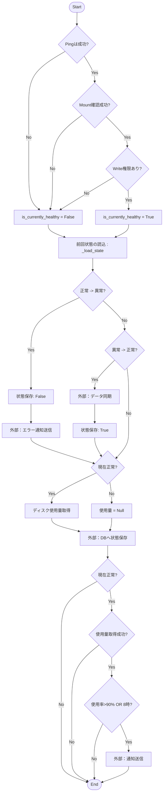
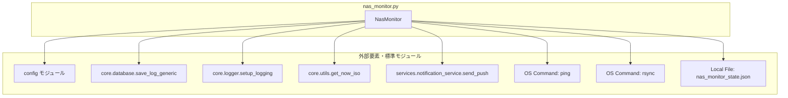

## 1. 解析メタ情報

| 項目 | 内容 |
| --- | --- |
| 対象ファイル | `nas_monitor.py` |
| 言語 | Python |
| 解析対象 | 提供されたコードのみ |
| 推測・補完 | 一切なし |

## 2. ファイルの概要

* NASの死活監視（Ping疎通確認、マウント確認、書き込み権限確認）、ディスク使用量の取得、障害時のフォールバックへの自動切替検知、およびNAS復旧時のフォールバックデータ自動同期と通知を行う。

## 3. 外部依存関係

### インポート一覧

| 名称 | 種類 | 用途 | 根拠 |
| --- | --- | --- | --- |
| `os` | 標準ライブラリ | ファイルパス操作、存在確認、削除など | 根拠: `import os` (行番号: 1 / 抜粋: "import os") |
| `json` | 標準ライブラリ | 状態を記録したJSONファイルの読み書き | 根拠: `import json` (行番号: 2 / 抜粋: "import json") |
| `shutil` | 標準ライブラリ | ディスク使用量の取得 | 根拠: `import shutil` (行番号: 3 / 抜粋: "import shutil") |
| `subprocess` | 標準ライブラリ | pingおよびrsyncコマンドの実行 | 根拠: `import subprocess` (行番号: 4 / 抜粋: "import subprocess") |
| `sys` | 標準ライブラリ | モジュール検索パスへの親ディレクトリ追加 | 根拠: `import sys` (行番号: 5 / 抜粋: "import sys") |
| `datetime` | 標準ライブラリ | 現在時刻の取得（レポート時間の判定） | 根拠: `from datetime import datetime` (行番号: 6 / 抜粋: "from datetime import datetime") |
| `Dict, Optional, Any` | 標準ライブラリ(typing) | 型アノテーション | 根拠: `from typing import Dict, Optional, Any` (行番号: 7 / 抜粋: "from typing import Dict...") |
| `config` | 自作モジュール | NASのIP、マウント先、LINE IDなどの設定値取得 | 根拠: `import config` (行番号: 11 / 抜粋: "import config") |
| `setup_logging` | 自作モジュール | ロガーの初期化と取得 | 根拠: `setup_logging` (行番号: 12 / 抜粋: "from core.logger import setup...") |
| `save_log_generic` | 自作モジュール | データベースへのログ保存 | 根拠: `save_log_generic` (行番号: 13 / 抜粋: "from core.database import sav...") |
| `get_now_iso` | 自作モジュール | 現在時刻のISOフォーマット取得 | 根拠: `get_now_iso` (行番号: 14 / 抜粋: "from core.utils import get_no...") |
| `send_push` | 自作モジュール | プッシュ通知の送信 | 根拠: `send_push` (行番号: 15 / 抜粋: "from services.notification...") |

### ブラックボックスとなる外部要素

| 名称 | 理由 | 根拠 |
| --- | --- | --- |
| `config`の各設定値 | 具体的な設定値や型、スキーマが不明 | 根拠: `config` (行番号: 11 / 抜粋: "import config") |
| `setup_logging` | ログの出力先、フォーマット等の詳細が不明 | 根拠: `setup_logging` (行番号: 12 / 抜粋: "from core.logger import setup...") |
| `save_log_generic` | データベースの接続情報やテーブルスキーマの詳細が不明 | 根拠: `save_log_generic` (行番号: 13 / 抜粋: "from core.database import sav...") |
| `get_now_iso` | タイムゾーンや出力される正確な文字列フォーマットが不明 | 根拠: `get_now_iso` (行番号: 14 / 抜粋: "from core.utils import get_no...") |
| `send_push` | 実際の送信先仕様（引数`LINE_USER_ID`と`target="discord"`の関連）が不明 | 根拠: `send_push` (行番号: 15 / 抜粋: "from services.notification...") |
| 外部コマンド`ping` | 実行環境に依存するためコマンドの正確な挙動が不明 | 根拠: `subprocess.run` (行番号: 46 / 抜粋: "cmd = ["ping", "-c", "1"...]") |
| 外部コマンド`rsync` | 実行環境に依存するためコマンドの正確な挙動が不明 | 根拠: `subprocess.run` (行番号: 85 / 抜粋: "cmd = ["rsync", "-av", "--r...]") |

## 4. 主要要素の定義（関数 / エンドポイント / コンポーネント）

### クラス `NasMonitor`

* **役割**: NASの状態監視、ディスク使用量確認、および障害復旧時の自動切り戻し処理をまとめたクラス。
* 根拠: `class NasMonitor:` (行番号: 19〜180 / 抜粋: "class NasMonitor:")

### 関数 `__init__`

* **役割**: クラス内の設定値（IP、パス、タイムアウト時間、ステータス保存ファイルなど）を`config`等から初期化する。
* 根拠: `def __init__(self) -> None:` (行番号: 22〜29 / 抜粋: "def **init**(self) -> None:")

* **引数/リクエスト**: なし
* 根拠: `def __init__(self) -> None:` (行番号: 22 / 抜粋: "def **init**(self) -> None:")

* **戻り値/レスポンス**: `None`
* 根拠: `def __init__(self) -> None:` (行番号: 22 / 抜粋: "def **init**(self) -> None:")

* **副作用**: クラスのインスタンス変数の定義。
* 根拠: `self.ip: str = getattr(config, "NAS_IP", "192.168.1.20")` (行番号: 23〜28 / 抜粋: "self.ip: str = getattr(co...")

* **エラーハンドリング**: なし
* 根拠: 関数内の処理全体 (行番号: 22〜29 / 抜粋: "def **init**(self) -> None:")

### 関数 `_load_state`

* **役割**: 前回の監視状態（正常/異常）をJSONファイルから読み込む。存在しない場合は正常として扱う。
* 根拠: `def _load_state(self) -> Dict[str, bool]:` (行番号: 31〜39 / 抜粋: "def _load_state(self) -> Di...")

* **引数/リクエスト**: なし
* 根拠: `def _load_state(self) -> Dict[str, bool]:` (行番号: 31 / 抜粋: "def _load_state(self) -> Di...")

* **戻り値/レスポンス**: `Dict[str, bool]`（状態辞書）
* 根拠: `return json.load(f)` および `return {"is_healthy": True}` (行番号: 35, 39 / 抜粋: "return {"is_healthy": True}")

* **副作用**: ローカルファイルの読み込み。
* 根拠: `with open(self.state_file, 'r', encoding='utf-8') as f:` (行番号: 34 / 抜粋: "with open(self.state_file...")

* **エラーハンドリング**: `Exception`を捕捉し、エラーログ出力後デフォルト値を返す。
* 根拠: `except Exception as e:` (行番号: 36〜37 / 抜粋: "except Exception as e:")

### 関数 `_save_state`

* **役割**: 現在の監視状態をJSONファイルとして保存する。
* 根拠: `def _save_state(self, state: Dict[str, bool]) -> None:` (行番号: 41〜46 / 抜粋: "def _save_state(self, state...")

* **引数/リクエスト**: `state`: `Dict[str, bool]`
* 根拠: `state: Dict[str, bool]` (行番号: 41 / 抜粋: "state: Dict[str, bool]")

* **戻り値/レスポンス**: `None`
* 根拠: `-> None:` (行番号: 41 / 抜粋: "-> None:")

* **副作用**: ローカルファイルへの書き込み。
* 根拠: `with open(self.state_file, 'w', encoding='utf-8') as f:` (行番号: 43〜44 / 抜粋: "json.dump(state, f)")

* **エラーハンドリング**: `Exception`を捕捉し、エラーログを出力する。
* 根拠: `except Exception as e:` (行番号: 45〜46 / 抜粋: "except Exception as e:")

### 関数 `check_ping`

* **役割**: `ping`コマンドを実行し、NASへのネットワーク疎通を確認する。
* 根拠: `def check_ping(self) -> bool:` (行番号: 48〜58 / 抜粋: "def check_ping(self) -> boo...")

* **引数/リクエスト**: なし
* 根拠: `def check_ping(self) -> bool:` (行番号: 48 / 抜粋: "def check_ping(self) -> boo...")

* **戻り値/レスポンス**: `bool`（成功時True）
* 根拠: `return res.returncode == 0` (行番号: 54 / 抜粋: "return res.returncode == 0")

* **副作用**: 外部プロセス(`ping`コマンド)の実行。
* 根拠: `subprocess.run(cmd, ...)` (行番号: 50〜53 / 抜粋: "res = subprocess.run(cmd...")

* **エラーハンドリング**: `Exception`を捕捉し、エラーログ出力後`False`を返す。
* 根拠: `except Exception as e:` (行番号: 55〜57 / 抜粋: "except Exception as e:")

### 関数 `check_mount`

* **役割**: マウントポイントがシステム上に存在し、かつ正しくマウントされているか判定する。
* 根拠: `def check_mount(self) -> bool:` (行番号: 60〜64 / 抜粋: "def check_mount(self) -> bo...")

* **引数/リクエスト**: なし
* 根拠: `def check_mount(self) -> bool:` (行番号: 60 / 抜粋: "def check_mount(self) -> bo...")

* **戻り値/レスポンス**: `bool`（マウントされていればTrue）
* 根拠: `return os.path.ismount(self.mount_point)` (行番号: 64 / 抜粋: "return os.path.ismount(self...")

* **副作用**: なし
* 根拠: 関数内の処理全体 (行番号: 60〜64 / 抜粋: "def check_mount(self) -> bo...")

* **エラーハンドリング**: なし
* 根拠: 関数内の処理全体 (行番号: 60〜64 / 抜粋: "def check_mount(self) -> bo...")

### 関数 `check_write_permission`

* **役割**: NASのマウント先にテストファイルを作成・削除し、書き込み権限を確認する。
* 根拠: `def check_write_permission(self) -> bool:` (行番号: 66〜75 / 抜粋: "def check_write_permission...")

* **引数/リクエスト**: なし
* 根拠: `def check_write_permission(self) -> bool:` (行番号: 66 / 抜粋: "def check_write_permission...")

* **戻り値/レスポンス**: `bool`（書き込み・削除成功時True）
* 根拠: `return True` または `return False` (行番号: 72, 75 / 抜粋: "return True")

* **副作用**: ファイルの作成および削除。
* 根拠: `with open(test_file, 'w') as f:` および `os.remove(test_file)` (行番号: 69〜71 / 抜粋: "os.remove(test_file)")

* **エラーハンドリング**: `IOError`を捕捉し、エラーログ出力後`False`を返す。
* 根拠: `except IOError as e:` (行番号: 73〜75 / 抜粋: "except IOError as e:")

### 関数 `sync_fallback_data`

* **役割**: フォールバックディレクトリのデータを`rsync`コマンドを利用してNASへ同期・移動し、空ディレクトリを削除の上、復旧通知を送信する。
* 根拠: `def sync_fallback_data(self) -> None:` (行番号: 77〜103 / 抜粋: "def sync_fallback_data(self...")

* **引数/リクエスト**: なし
* 根拠: `def sync_fallback_data(self) -> None:` (行番号: 77 / 抜粋: "def sync_fallback_data(self...")

* **戻り値/レスポンス**: `None`
* 根拠: `-> None:` (行番号: 77 / 抜粋: "-> None:")

* **副作用**: 外部プロセス(`rsync`コマンド)の実行、元ファイルの削除、外部APIによるプッシュ通知送信。
* 根拠: `subprocess.run(cmd, ...)` および `send_push(...)` (行番号: 90, 94〜98 / 抜粋: "res = subprocess.run(cmd...")

* **エラーハンドリング**: 同期失敗時(`returncode != 0`)のエラーログ出力。および`Exception`を捕捉してのエラーログ出力。
* 根拠: `if res.returncode == 0:` の `else:` ブロック、および `except Exception as e:` (行番号: 101〜103 / 抜粋: "except Exception as e:")

### 関数 `_cleanup_empty_dirs`

* **役割**: 指定されたディレクトリ配下の空ディレクトリを再帰的に削除する。
* 根拠: `def _cleanup_empty_dirs(self, path: str) -> None:` (行番号: 105〜113 / 抜粋: "def _cleanup_empty_dirs(sel...")

* **引数/リクエスト**: `path`: `str`
* 根拠: `path: str` (行番号: 105 / 抜粋: "path: str")

* **戻り値/レスポンス**: `None`
* 根拠: `-> None:` (行番号: 105 / 抜粋: "-> None:")

* **副作用**: ディレクトリの削除（ファイルシステム操作）。
* 根拠: `os.rmdir(dir_path)` (行番号: 110 / 抜粋: "os.rmdir(dir_path)")

* **エラーハンドリング**: `OSError`を捕捉し`pass`することで、空でないディレクトリの削除失敗を無視する。
* 根拠: `except OSError:` と `pass` (行番号: 111〜113 / 抜粋: "except OSError:\n pass")

### 関数 `get_disk_usage`

* **役割**: マウントポイントのディスク容量（全体、使用量、空き容量をGB単位）と使用率を計算する。
* 根拠: `def get_disk_usage(self) -> Optional[Dict[str, float]]:` (行番号: 115〜126 / 抜粋: "def get_disk_usage(self) ->...")

* **引数/リクエスト**: なし
* 根拠: `def get_disk_usage(self) -> Optional[Dict[str, float]]:` (行番号: 115 / 抜粋: "def get_disk_usage(self) ->...")

* **戻り値/レスポンス**: `Optional[Dict[str, float]]`（容量情報を含む辞書、失敗時はNone）
* 根拠: `return {...}` または `return None` (行番号: 118〜123, 126 / 抜粋: "return { "total_gb": ...}")

* **副作用**: なし
* 根拠: 関数内の処理全体 (行番号: 115〜126 / 抜粋: "def get_disk_usage(self) ->...")

* **エラーハンドリング**: `Exception`を捕捉し、エラーログ出力後`None`を返す。
* 根拠: `except Exception as e:` (行番号: 124〜126 / 抜粋: "except Exception as e:")

### 関数 `save_to_db`

* **役割**: NASの監視結果（Ping、マウント状態）とディスク使用率をデータベースに保存する。
* 根拠: `def save_to_db(self, ping_ok: bool, mount_ok: bool, usage: Optional[Dict[str, float]]) -> None:` (行番号: 128〜143 / 抜粋: "def save_to_db(self, ping_...")

* **引数/リクエスト**: `ping_ok: bool`, `mount_ok: bool`, `usage: Optional[Dict[str, float]]`
* 根拠: 定義部 (行番号: 128 / 抜粋: "def save_to_db(self, ping_...")

* **戻り値/レスポンス**: `None`
* 根拠: `-> None:` (行番号: 128 / 抜粋: "-> None:")

* **副作用**: 外部ファイル(`core.database`)の関数呼び出しによるデータベース書き込み。
* 根拠: `save_log_generic(...)` (行番号: 131〜143 / 抜粋: "save_log_generic(config.S...")

* **エラーハンドリング**: なし
* 根拠: 関数内の処理全体 (行番号: 128〜143 / 抜粋: "def save_to_db(self, ping_...")

### 関数 `run`

* **役割**: Ping、マウント、書き込み権限の確認を順に実行し、状態変化の判定と保存、データベースへの記録、および状況（容量不足・定時）に応じた通知を統括する。
* 根拠: `def run(self) -> None:` (行番号: 145〜192 / 抜粋: "def run(self) -> None:")

* **引数/リクエスト**: なし
* 根拠: `def run(self) -> None:` (行番号: 145 / 抜粋: "def run(self) -> None:")

* **戻り値/レスポンス**: `None`
* 根拠: `-> None:` (行番号: 145 / 抜粋: "-> None:")

* **副作用**: `save_to_db`呼び出し、`send_push`呼び出し、`sync_fallback_data`呼び出しによる外部影響およびステート保存。
* 根拠: `self.save_to_db(...)`, `send_push(...)`, `self.sync_fallback_data()` (行番号: 156, 166, 172, 188 / 抜粋: "send_push(config.LINE...")

* **エラーハンドリング**: 異常継続時および容量情報取得失敗時は早期リターンし処理を中断する。
* 根拠: `if not is_currently_healthy: return` および `if not usage: return` (行番号: 175〜176, 181〜182 / 抜粋: "if not is_currently_healthy...")

## 5. 処理フロー図

## 6. 依存関係図

## 7. 次のステップ（リバースエンジニアリングの提案）

| 優先度 | ファイル名(推測可) | 理由 | 根拠 |
| --- | --- | --- | --- |
| 高 | `config.py` | NASのIP、マウントポイント、LINE IDなどの初期設定値全体を把握するため。 | 根拠: `getattr(config, "NAS_IP", ...)` (行番号: 23 / 抜粋: "getattr(config, "NAS_IP"...") |
| 中 | `services/notification_service.py` | 引数として渡している`config.LINE_USER_ID`と、`target="discord"`が内部でどのように処理・分岐されているか特定するため。 | 根拠: `send_push(...)` (行番号: 94〜98 / 抜粋: "target="discord", channel="report"") |
| 中 | `core/database.py` | 引数で渡しているデータが実際にどのような型やテーブル構造で保存されているか確認するため。 | 根拠: `save_log_generic(...)` (行番号: 131〜143 / 抜粋: "save_log_generic(config.S...") |

## 8. 保守上の注意点

* `sync_fallback_data`関数内における`rsync --remove-source-files`の実行は、転送完了後に転送元のファイル群を削除する副作用を持つ。
* `_cleanup_empty_dirs`関数内の`os.rmdir`実行時、`OSError`が全て`pass`されており、ディレクトリが空でない以外の予期せぬ権限エラー等も握りつぶされる。
* `run`関数内において、`check_ping`、`check_mount`、`check_write_permission`はショートサーキット評価のように実装されており、前段が`False`の場合は後段は実行されず即座に`False`が代入される。
* `run`関数内において、`is_currently_healthy`が`False`となった場合、以降のディスク使用量取得およびレポート通知ロジックには到達せず処理を終了する（早期リターン）。

## 9. 不明事項一覧

| 項目 | 理由 | 必要なファイル |
| --- | --- | --- |
| 設定値の初期値と定義内容 | `config`モジュール内の変数が外部に依存しているため | `config.py` |
| プッシュ通知先の仕様 | `send_push`内で`target="discord"`と指定されているにも関わらず第1引数に`LINE_USER_ID`を渡しているため | `services/notification_service.py` |
| DBのカラムの型定義 | `save_log_generic`がブラックボックスであり、`percent`や`mount_ok`がどう保存されるか不明なため | `core/database.py` |
| ISO時刻のタイムゾーン | `get_now_iso`の戻り値のタイムゾーンの扱いが不明なため | `core/utils.py` |

## 10. 自己検証結果

* [x] 推測・外部ファイルの仕様を一切含んでいない
* [x] 全関数・全クラス・全コンポーネントを列挙した
* [x] 全てのインポート要素を列挙した
* [x] すべての仕様説明に「根拠（行番号・抜粋）」を明記した
* [x] 根拠漏れが0件である
* [x] Mermaid構文にエラーの原因となる記号（エスケープ漏れ）がない
* [x] 不明事項を漏れなく列挙した