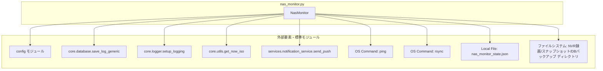

## 1. 解析メタ情報

| 項目 | 内容 |
| --- | --- |
| 対象ファイル | `nas_monitor.py` |
| 言語 | Python |
| 解析対象 | 提供されたコードのみ |
| 推測・補完 | 一切なし |
| 解析基準コミット | `7789bf6` |

## 関連ドキュメント

* [nas_utils.md](./nas_utils.md) - 類似目的の別モジュール(本ファイルはNAS死活監視・リテンション削除を担当、`nas_utils.py`は他モジュール向けのNASフォールバック管理ユーティリティを提供する役割分担と推測される)
* [config.md](./config.md) - `NAS_IP`, 各保持日数等の設定値を提供
* [database.md](./database.md) - `save_log_generic`の実体
* [notification_service.md](./notification_service.md) - `send_push`の実体
* [utils.md](./utils.md) - `get_now_iso`の実体
* [analysis_service.md](./analysis_service.md) - `save_to_db`が書き込む`nas_records`テーブルを`load_nas_status`で読み、ダッシュボードのNASステータスカード・NAS状態パネルへ供給する読み手側(Issue #168)

## 2. ファイルの概要

* NASの死活監視（Ping疎通確認、マウント確認、書き込み権限確認）、ディスク使用量の取得、障害時のフォールバックへの自動切替検知、およびNAS復旧時のフォールバックデータ自動同期と通知を行う。
* あわせて、NVR録画・カメラスナップショット・DBバックアップといった保持期間を超えたファイルを定期的（レポート時刻）に自動削除するリテンションクリーンアップ機能を持つ。

## 3. 外部依存関係

### インポート一覧

| 名称 | 種類 | 用途 | 根拠 |
| --- | --- | --- | --- |
| `os` | 標準ライブラリ | ファイルパス操作、存在確認、削除など | 根拠: `import os` (行番号: 1 / 抜粋: "import os") |
| `json` | 標準ライブラリ | 状態を記録したJSONファイルの読み書き | 根拠: `import json` (行番号: 2 / 抜粋: "import json") |
| `shutil` | 標準ライブラリ | ディスク使用量の取得 | 根拠: `import shutil` (行番号: 3 / 抜粋: "import shutil") |
| `subprocess` | 標準ライブラリ | pingおよびrsyncコマンドの実行 | 根拠: `import subprocess` (行番号: 4 / 抜粋: "import subprocess") |
| `sys` | 標準ライブラリ | モジュール検索パスへの親ディレクトリ追加 | 根拠: `import sys` (行番号: 5 / 抜粋: "import sys") |
| `time` | 標準ライブラリ | 保持期間の基準時刻（カットオフ）の計算 | 根拠: `import time` (行番号: 6 / 抜粋: "import time") |
| `datetime` | 標準ライブラリ | 現在時刻の取得（レポート時間の判定） | 根拠: `from datetime import datetime` (行番号: 7 / 抜粋: "from datetime import datetime") |
| `Dict, Optional, Any, Tuple` | 標準ライブラリ(typing) | 型アノテーション | 根拠: `from typing import Dict, Optional, Any, Tuple` (行番号: 8 / 抜粋: "from typing import Dict...") |
| `config` | 自作モジュール | NASのIP、マウント先、LINE ID、保持期間などの設定値取得 | 根拠: `import config` (行番号: 13 / 抜粋: "import config") |
| `setup_logging` | 自作モジュール | ロガーの初期化と取得 | 根拠: `setup_logging` (行番号: 14 / 抜粋: "from core.logger import setup...") |
| `save_log_generic` | 自作モジュール | データベースへのログ保存 | 根拠: `save_log_generic` (行番号: 15 / 抜粋: "from core.database import sav...") |
| `get_now_iso` | 自作モジュール | 現在時刻のISOフォーマット取得 | 根拠: `get_now_iso` (行番号: 16 / 抜粋: "from core.utils import get_no...") |
| `send_push` | 自作モジュール | プッシュ通知の送信 | 根拠: `send_push` (行番号: 17 / 抜粋: "from services.notification...") |

### ブラックボックスとなる外部要素

| 名称 | 理由 | 根拠 |
| --- | --- | --- |
| `config`の各設定値 | 具体的な設定値や型、スキーマ（NAS_IP、保持日数、バックアップ/録画ディレクトリ等）が不明 | 根拠: `config` (行番号: 13 / 抜粋: "import config") |
| `setup_logging` | ログの出力先、フォーマット等の詳細が不明 | 根拠: `setup_logging` (行番号: 14 / 抜粋: "from core.logger import setup...") |
| `save_log_generic` | データベースの接続情報やテーブルスキーマの詳細が不明 | 根拠: `save_log_generic` (行番号: 15 / 抜粋: "from core.database import sav...") |
| `get_now_iso` | タイムゾーンや出力される正確な文字列フォーマットが不明 | 根拠: `get_now_iso` (行番号: 16 / 抜粋: "from core.utils import get_no...") |
| `send_push` | 実際の送信先仕様（引数`LINE_USER_ID`と`target="discord"`の関連）が不明 | 根拠: `send_push` (行番号: 17 / 抜粋: "from services.notification...") |
| 外部コマンド`ping` | 実行環境に依存するためコマンドの正確な挙動が不明 | 根拠: `subprocess.run` (行番号: 54〜59 / 抜粋: "cmd = ["ping", "-c", "1"...]") |
| 外部コマンド`rsync` | 実行環境に依存するためコマンドの正確な挙動が不明 | 根拠: `subprocess.run` (行番号: 92〜99 / 抜粋: "cmd = [") |

## 4. 主要要素の定義（関数 / エンドポイント / コンポーネント）

### クラス `NasMonitor`

* **役割**: NASの状態監視、ディスク使用量確認、障害復旧時の自動切り戻し処理、および保持期間超過ファイルの自動削除をまとめたクラス。
* 根拠: `class NasMonitor:` (行番号: 22〜290 / 抜粋: "class NasMonitor:")

### 関数 `__init__`

* **役割**: クラス内の設定値（IP、パス、タイムアウト時間、書き込みチェックのリトライ回数、ステータス保存ファイルなど）を`config`等から初期化する。
* 根拠: `def __init__(self) -> None:` (行番号: 25〜39 / 抜粋: "def __init__(self) -> None:")

* **引数/リクエスト**: なし
* 根拠: `def __init__(self) -> None:` (行番号: 25 / 抜粋: "def __init__(self) -> None:")

* **戻り値/レスポンス**: `None`
* 根拠: `def __init__(self) -> None:` (行番号: 25 / 抜粋: "def __init__(self) -> None:")

* **副作用**: クラスのインスタンス変数の定義。`self.write_check_retries`は`config.NAS_WRITE_CHECK_RETRIES`（未設定時デフォルト3）から`check_write_permission`のリトライ回数として初期化される。
* 根拠: `self.ip: str = getattr(config, "NAS_IP", "192.168.1.20")` (行番号: 26〜30 / 抜粋: "self.ip: str = getattr(co...")、`self.write_check_retries: int = getattr(config, "NAS_WRITE_CHECK_RETRIES", 3)` (行番号: 30 / 抜粋: "self.write_check_retries: int = getattr(config, \"NAS_WRITE_CHECK_RETRIES\", 3)")

* **エラーハンドリング**: なし
* 根拠: 関数内の処理全体 (行番号: 25〜39 / 抜粋: "def __init__(self) -> None:")

### 関数 `_load_state`

* **役割**: 前回の監視状態（正常/異常）をJSONファイルから読み込む。存在しない場合は正常として扱う。
* 根拠: `def _load_state(self) -> Dict[str, bool]:` (行番号: 33〜41 / 抜粋: "def _load_state(self) -> Di...")

* **引数/リクエスト**: なし
* 根拠: `def _load_state(self) -> Dict[str, bool]:` (行番号: 33 / 抜粋: "def _load_state(self) -> Di...")

* **戻り値/レスポンス**: `Dict[str, bool]`（状態辞書）
* 根拠: `return json.load(f)` および `return {"is_healthy": True}` (行番号: 38, 41 / 抜粋: "return {"is_healthy": True}")

* **副作用**: ローカルファイルの読み込み。
* 根拠: `with open(self.state_file, 'r', encoding='utf-8') as f:` (行番号: 37 / 抜粋: "with open(self.state_file...")

* **エラーハンドリング**: `Exception`を捕捉し、エラーログ出力後デフォルト値を返す。
* 根拠: `except Exception as e:` (行番号: 39〜40 / 抜粋: "except Exception as e:")

### 関数 `_save_state`

* **役割**: 現在の監視状態をJSONファイルとして保存する。
* 根拠: `def _save_state(self, state: Dict[str, bool]) -> None:` (行番号: 43〜49 / 抜粋: "def _save_state(self, state...")

* **引数/リクエスト**: `state`: `Dict[str, bool]`
* 根拠: `state: Dict[str, bool]` (行番号: 43 / 抜粋: "state: Dict[str, bool]")

* **戻り値/レスポンス**: `None`
* 根拠: `-> None:` (行番号: 43 / 抜粋: "-> None:")

* **副作用**: ローカルファイルへの書き込み。
* 根拠: `with open(self.state_file, 'w', encoding='utf-8') as f:` (行番号: 46〜47 / 抜粋: "json.dump(state, f)")

* **エラーハンドリング**: `Exception`を捕捉し、エラーログを出力する。
* 根拠: `except Exception as e:` (行番号: 48〜49 / 抜粋: "except Exception as e:")

### 関数 `check_ping`

* **役割**: `ping`コマンドを実行し、NASへのネットワーク疎通を確認する。
* 根拠: `def check_ping(self) -> bool:` (行番号: 51〜63 / 抜粋: "def check_ping(self) -> boo...")

* **引数/リクエスト**: なし
* 根拠: `def check_ping(self) -> bool:` (行番号: 51 / 抜粋: "def check_ping(self) -> boo...")

* **戻り値/レスポンス**: `bool`（成功時True）
* 根拠: `return res.returncode == 0` (行番号: 60 / 抜粋: "return res.returncode == 0")

* **副作用**: 外部プロセス(`ping`コマンド)の実行。
* 根拠: `subprocess.run(cmd, ...)` (行番号: 55〜59 / 抜粋: "res = subprocess.run(")

* **エラーハンドリング**: `Exception`を捕捉し、エラーログ出力後`False`を返す。
* 根拠: `except Exception as e:` (行番号: 61〜63 / 抜粋: "except Exception as e:")

### 関数 `check_mount`

* **役割**: マウントポイントがシステム上に存在し、かつ正しくマウントされているか判定する。
* 根拠: `def check_mount(self) -> bool:` (行番号: 65〜69 / 抜粋: "def check_mount(self) -> bo...")

* **引数/リクエスト**: なし
* 根拠: `def check_mount(self) -> bool:` (行番号: 65 / 抜粋: "def check_mount(self) -> bo...")

* **戻り値/レスポンス**: `bool`（マウントされていればTrue）
* 根拠: `return os.path.ismount(self.mount_point)` (行番号: 69 / 抜粋: "return os.path.ismount(self...")

* **副作用**: なし
* 根拠: 関数内の処理全体 (行番号: 65〜69 / 抜粋: "def check_mount(self) -> bo...")

* **エラーハンドリング**: なし
* 根拠: 関数内の処理全体 (行番号: 65〜69 / 抜粋: "def check_mount(self) -> bo...")

### 関数 `check_write_permission`

* **役割**: NASのマウント先(`self.mount_point`直下の`.write_test`)に対し、別プロセス(`sys.executable -c`)でopen/write/close/removeを実行して書き込み権限を確認する。CIFSマウントのストールで本体プロセスが巻き込まれてハングしないよう、サブプロセスをタイムアウト付きで待ち受ける。タイムアウト発生時は最大`self.write_check_retries`回までExponential Backoff（`2 ** attempt`秒、0-indexed）で再試行する。
* 根拠: `def check_write_permission(self) -> bool:` (行番号: 80〜132 / 抜粋: "def check_write_permission(self) -> bool:")

* **引数/リクエスト**: なし
* 根拠: `def check_write_permission(self) -> bool:` (行番号: 80 / 抜粋: "def check_write_permission(self) -> bool:")

* **戻り値/レスポンス**: `bool`（書き込み・削除成功時True。全リトライを使い切ってタイムアウトした場合、または`CalledProcessError`/`OSError`発生時はFalse）
* 根拠: `return True` (行番号: 107)、`return False` (行番号: 129, 132) / 抜粋: "return True"

* **副作用**: サブプロセス(`sys.executable -c <script>`)の起動によるテストファイルの作成・削除。タイムアウト時は`time.sleep(wait_time)`によるリトライ待機。最終リトライでもタイムアウトした場合は診断のため`self.check_ping()`・`self.check_mount()`を追加で実行する。
* 根拠: `subprocess.run([sys.executable, "-c", script, test_file], timeout=self.timeout, check=True, capture_output=True)` (行番号: 101〜106)、`time.sleep(wait_time)` (行番号: 116)、`diag_ping_ok = self.check_ping()` / `diag_mount_ok = self.check_mount() if diag_ping_ok else False` (行番号: 122〜123)

* **エラーハンドリング**: `subprocess.TimeoutExpired`発生時は、最終試行でなければ`2 ** attempt`秒待機して再試行（警告ログ出力）。最終試行でタイムアウトした場合は`self.check_ping()`/`self.check_mount()`の結果を添えてエラーログを出力し`False`を返す。`subprocess.CalledProcessError`または`OSError`はリトライせずエラーログ出力後`False`を返す（この経路ではping/mount診断ログは出力されない）。
* 根拠: `except subprocess.TimeoutExpired:` (行番号: 108〜129)、`except (subprocess.CalledProcessError, OSError) as e:` (行番号: 130〜132)

### 関数 `sync_fallback_data`

* **役割**: フォールバックディレクトリ(`self.fallback_dir`)配下の`assets`サブディレクトリのみを対象に、`rsync`コマンドを利用してNAS側の`self.nas_project_root`配下`assets`(=`NAS_PROJECT_ROOT/assets`。通常のNAS疎通時に`config.ASSETS_DIR`が指すパスと同一)へ同期・移動し、空ディレクトリを削除の上、復旧通知を送信する。`fallback_dir`直下には`last_memory_alert.txt`(`memory_monitor.py`)・`last_tv_lock.txt`(`tv_lock_monitor.py`)など、本来ローカル専用でNASに属さない他モニターの状態ファイルも同居しているため、同期対象を`assets`サブディレクトリに明示的に限定し、これらを巻き込んで移動・削除しないようにしている。
* 根拠: `def sync_fallback_data(self) -> None:` (行番号: 157〜199 / 抜粋: "def sync_fallback_data(self...")、`fallback_assets_dir = os.path.join(self.fallback_dir, "assets")` (行番号: 165)、`nas_assets_dir = os.path.join(self.nas_project_root, "assets")` (行番号: 170)

* **引数/リクエスト**: なし
* 根拠: `def sync_fallback_data(self) -> None:` (行番号: 157 / 抜粋: "def sync_fallback_data(self...")

* **戻り値/レスポンス**: `None`
* 根拠: `-> None:` (行番号: 157 / 抜粋: "-> None:")

* **副作用**: 外部プロセス(`rsync`コマンド)の実行、元ファイル(`fallback_dir/assets`配下のみ)の削除、外部APIによるプッシュ通知送信。
* 根拠: `subprocess.run(cmd, ...)` および `send_push(...)` (行番号: 181, 186〜190 / 抜粋: "res = subprocess.run(cmd...")

* **エラーハンドリング**: 同期失敗時(`returncode != 0`)のエラーログ出力。`rsync`が120秒でタイムアウトした場合(`subprocess.TimeoutExpired`)専用のエラーログ出力。および想定外の`Exception`を捕捉してのエラーログ出力。
* 根拠: `if res.returncode == 0:` の `else:` ブロック (行番号: 194〜195)、`except subprocess.TimeoutExpired:` (行番号: 196〜197)、`except Exception as e:` (行番号: 198〜199)

### 関数 `_cleanup_empty_dirs`

* **役割**: 指定されたディレクトリ配下の空ディレクトリを再帰的に削除する。
* 根拠: `def _cleanup_empty_dirs(self, path: str) -> None:` (行番号: 119〜127 / 抜粋: "def _cleanup_empty_dirs(sel...")

* **引数/リクエスト**: `path`: `str`
* 根拠: `path: str` (行番号: 119 / 抜粋: "path: str")

* **戻り値/レスポンス**: `None`
* 根拠: `-> None:` (行番号: 119 / 抜粋: "-> None:")

* **副作用**: ディレクトリの削除（ファイルシステム操作）。
* 根拠: `os.rmdir(dir_path)` (行番号: 125 / 抜粋: "os.rmdir(dir_path)")

* **エラーハンドリング**: `OSError`を捕捉し`pass`することで、空でないディレクトリの削除失敗を無視する。
* 根拠: `except OSError:` と `pass` (行番号: 126〜127 / 抜粋: "except OSError:\n pass")

### 関数 `get_disk_usage`

* **役割**: マウントポイントのディスク容量（全体、使用量、空き容量をGB単位）と使用率を計算する。
* 根拠: `def get_disk_usage(self) -> Optional[Dict[str, float]]:` (行番号: 129〜141 / 抜粋: "def get_disk_usage(self) ->...")

* **引数/リクエスト**: なし
* 根拠: `def get_disk_usage(self) -> Optional[Dict[str, float]]:` (行番号: 129 / 抜粋: "def get_disk_usage(self) ->...")

* **戻り値/レスポンス**: `Optional[Dict[str, float]]`（容量情報を含む辞書、失敗時はNone）
* 根拠: `return {...}` または `return None` (行番号: 133〜138, 141 / 抜粋: "return { "total_gb": ...}")

* **副作用**: なし
* 根拠: 関数内の処理全体 (行番号: 129〜141 / 抜粋: "def get_disk_usage(self) ->...")

* **エラーハンドリング**: `Exception`を捕捉し、エラーログ出力後`None`を返す。
* 根拠: `except Exception as e:` (行番号: 139〜141 / 抜粋: "except Exception as e:")

### 関数 `cleanup_old_files`

* **役割**: 指定ディレクトリ配下を再帰的に走査し、保持日数（`retention_days`）を超えたファイルを削除し、削除件数と解放容量(GB)を返す。`extensions`が`None`の場合は拡張子で絞り込まず、ディレクトリ内の全ファイルを削除対象にする(Issue #191で追加。単一種類の成果物専用であることが保証されているディレクトリ向け)。
* 根拠: `def cleanup_old_files(self, directory: str, retention_days: int, extensions: Optional[Tuple[str, ...]]) -> Dict[str, Any]:` とdocstring (行番号: 225〜233 / 抜粋: "extensions が None の場合は拡張子で絞り込まず")

* **引数/リクエスト**: `directory` (`str`), `retention_days` (`int`), `extensions` (`Optional[Tuple[str, ...]]`。`None`可)
* 根拠: 定義部 (行番号: 225〜227 / 抜粋: "def cleanup_old_files(")

* **戻り値/レスポンス**: `Dict[str, Any]`（`{"deleted_count": int, "freed_gb": float}`。`directory`が未指定またはディレクトリでない場合は空の集計値を返す）
* 根拠: `return result` (行番号: 237, 257 / 抜粋: "return result")

* **副作用**: 保持期間を超えたファイルの削除（ファイルシステム操作）。
* 根拠: `os.remove(path)` (行番号: 250 / 抜粋: "os.remove(path)")

* **エラーハンドリング**: ファイルの`mtime`/`size`取得や削除時に発生した`OSError`を個別に捕捉し、警告ログを出力してそのファイルをスキップする（処理全体は継続）。
* 根拠: `except OSError as e:` (行番号: 253〜254 / 抜粋: "logger.warning(f"Cleanup skip...")

### 関数 `run_retention_cleanup`

* **役割**: NVR録画・カメラスナップショット・タイムラプス動画・DBバックアップの4種類のディレクトリそれぞれについて、設定された保持日数を超えたファイルを`cleanup_old_files`経由で削除し、1件以上削除があった場合はまとめて通知を送信する。タイムラプス動画の削除対象パスは以前`config.ASSETS_DIR/timelapse`(NAS側)を指しており、実際の生成先(`monitors/smart_timelapse_generator.py`の`setup_directories`)であるローカルの`config.BASE_DIR/assets/timelapse`と食い違っていたため、誰も書かないNAS側ディレクトリを掃除し、誰も掃除しないローカルディレクトリにファイルが無限蓄積していた(Issue #171)。生成先と同じローカルパスに修正済み。DBバックアップ対象は以前拡張子`.db`のみに限定していたが、`DB_BACKUPS_DIR`は`services/backup_service.py`のDBダンプ(`.db`)と`_backup_config_files`によるDB以外の設定ファイルコピー(`config.py`/`.env`/`devices.json`。拡張子は`.py`/なし/`.json`)の両方の出力専用ディレクトリであるため、`.db`限定では設定ファイルのバックアップコピーが一切削除されず無限蓄積していた(Issue #191)。`DB_BACKUPS_DIR`はバックアップ専用ディレクトリであることを踏まえ、`extensions=None`(拡張子で絞り込まず全ファイル対象)に修正した。
* 根拠: `def run_retention_cleanup(self) -> None:` (行番号: 259〜303 / 抜粋: "def run_retention_cleanup(sel...")
* 根拠: `("タイムラプス動画", os.path.join(getattr(config, "BASE_DIR", ""), "assets", "timelapse"), ...)` (行番号: 266〜273)
* 根拠: `("DBバックアップ", getattr(config, "DB_BACKUPS_DIR", None), ..., None)` とコメント (行番号: 274〜283 / 抜粋: "拡張子は .db に限らない")

* **引数/リクエスト**: なし
* 根拠: `def run_retention_cleanup(self) -> None:` (行番号: 259 / 抜粋: "def run_retention_cleanup(sel...")

* **戻り値/レスポンス**: `None`
* 根拠: `-> None:` (行番号: 259 / 抜粋: "-> None:")

* **副作用**: `cleanup_old_files`経由のファイル削除、および削除件数が1件以上あった場合の外部APIへのプッシュ通知送信。
* 根拠: `result = self.cleanup_old_files(...)` (行番号: 290), `send_push(...)` (行番号: 299〜303)

* **エラーハンドリング**: なし（対象ディレクトリが未設定(`falsy`)の場合は`continue`でその対象をスキップするのみ）。
* 根拠: `if not directory: continue` (行番号: 288〜289 / 抜粋: "if not directory:\n continue")

### 関数 `save_to_db`

* **役割**: NASの監視結果（Ping、マウント状態）とディスク使用率をデータベースに保存する。`config.SQLITE_TABLE_SENSOR`(=`device_records`)への書き込みに加えて、`config.SQLITE_TABLE_NAS`(=`nas_records`)へも書き込む(Issue #168)。以前は`device_records`にしか書き込んでおらず、ダッシュボードのNASステータスカード(`views/dashboard/summary.py`の`get_nas_status_simple`)・NAS状態パネル(`views/dashboard/log_tab.py`)が読む`analysis_service.load_nas_status`は`nas_records`テーブルを対象にしているため、これらの表示が常に「データなし」のままだった。`nas_records`側のスキーマ(`status_ping`/`status_mount`列は文字列`'OK'`/`'NG'`)に合わせ、bool引数`ping_ok`/`mount_ok`をそれぞれ`"OK"`/`"NG"`の文字列へ変換して書き込む。`usage`が`None`(NAS到達不能時)の場合、`total_gb`/`used_gb`/`free_gb`列には`None`を書き込む(`percent`列は`device_records`向けと同じく`usage`が`None`のとき`0`を使う既存のロジックをそのまま流用する)。
* 根拠: `def save_to_db(self, ping_ok: bool, mount_ok: bool, usage: Optional[Dict[str, float]]) -> None:` (行番号: 284〜321 / 抜粋: "def save_to_db(self, ping_...")
* 根拠: `save_log_generic(\n            getattr(config, "SQLITE_TABLE_NAS", "nas_records"),\n            ["timestamp", "device_name", "ip_address", "status_ping", "status_mount",\n             "total_gb", "used_gb", "free_gb", "percent"],\n            (\n                get_now_iso(),\n                self.device_name,\n                self.ip,\n                "OK" if ping_ok else "NG",\n                "OK" if mount_ok else "NG",\n                usage['total_gb'] if usage else None,\n                usage['used_gb'] if usage else None,\n                usage['free_gb'] if usage else None,\n                percent\n            )\n        )` (行番号: 306〜321)

* **引数/リクエスト**: `ping_ok: bool`, `mount_ok: bool`, `usage: Optional[Dict[str, float]]`
* 根拠: 定義部 (行番号: 284 / 抜粋: "def save_to_db(self, ping_...")

* **戻り値/レスポンス**: `None`
* 根拠: `-> None:` (行番号: 284 / 抜粋: "-> None:")

* **副作用**: 外部ファイル(`core.database`)の関数呼び出しによるデータベース書き込み(`device_records`・`nas_records`の2テーブルへ、それぞれ独立した`save_log_generic`呼び出しで書き込む)。
* 根拠: `save_log_generic(...)` (行番号: 287〜298, 306〜321)

* **エラーハンドリング**: なし
* 根拠: 関数内の処理全体 (行番号: 284〜321 / 抜粋: "def save_to_db(self, ping_...")

### 関数 `run`

* **役割**: Ping、マウント、書き込み権限の確認を順に実行し、状態変化（正常⇔異常）の判定と保存、DBへの記録を必ず行う。異常継続中はここで処理を終了し、正常時はさらに保持期間超過ファイルの自動削除（レポート時刻のみ）と、状況（容量不足・定時）に応じた通知を統括する。
* 根拠: `def run(self) -> None:` (行番号: 216〜286 / 抜粋: "def run(self) -> None:")

* **引数/リクエスト**: なし
* 根拠: `def run(self) -> None:` (行番号: 216 / 抜粋: "def run(self) -> None:")

* **戻り値/レスポンス**: `None`
* 根拠: `-> None:` (行番号: 216 / 抜粋: "-> None:")

* **副作用**: `save_to_db`呼び出し（毎回）、`send_push`呼び出し（異常検知時・容量不足時・定時レポート時）、`sync_fallback_data`呼び出し（復旧検知時）、`run_retention_cleanup`呼び出し（レポート時刻のみ、ファイル削除を伴う）、および`_save_state`によるステート保存。
* 根拠: `self.save_to_db(...)` (行番号: 245), `send_push(...)` (行番号: 230〜234, 282〜286), `self.sync_fallback_data()` (行番号: 240), `self.run_retention_cleanup()` (行番号: 264)

* **エラーハンドリング**: 異常継続時はDB記録後に早期リターンし、以降のレポート・クリーンアップ処理には到達しない。ディスク使用量取得に失敗した場合（`usage`が`None`）も早期リターンする。
* 根拠: `if not is_currently_healthy: return` (行番号: 248〜249) および `if not usage: return` (行番号: 254〜255)

## 5. 処理フロー図

```mermaid
flowchart TD
    Start([Start]) --> Ping{Pingは成功?}

    Ping -- Yes --> Mount{Mount確認成功?}
    Ping -- No --> Eval[is_currently_healthy = False]

    Mount -- Yes --> Write{Write権限あり?}
    Mount -- No --> Eval

    Write -- Yes --> Healthy[is_currently_healthy = True]
    Write -- No --> Eval

    Eval --> LoadState
    Healthy --> LoadState

    LoadState[前回状態の読込 : _load_state] --> CheckTransition1

    CheckTransition1{正常 -> 異常?}
    CheckTransition1 -- Yes --> SaveErr[状態保存: False]
    SaveErr --> PushErr[外部：エラー通知送信]
    PushErr --> GetUsage

    CheckTransition1 -- No --> CheckTransition2{異常 -> 正常?}
    CheckTransition2 -- Yes --> Sync[外部：データ同期 sync_fallback_data]
    Sync --> SaveOK[状態保存: True]
    SaveOK --> GetUsage
    CheckTransition2 -- No --> GetUsage

    GetUsage{現在正常?}
    GetUsage -- Yes --> CalcUsage[ディスク使用量取得]
    GetUsage -- No --> CalcUsageNull[使用量 = Null]

    CalcUsage --> SaveDB
    CalcUsageNull --> SaveDB

    SaveDB[DBへ状態保存: save_to_db] --> CheckStatus{現在正常?}

    CheckStatus -- No --> End([End])
    CheckStatus -- Yes --> UsageExist{使用量取得成功?}

    UsageExist -- No --> End
    UsageExist -- Yes --> CalcFlags[使用率>90%判定 & レポート時刻(8時)判定]

    CalcFlags --> ReportTimeCheck{レポート時刻?}
    ReportTimeCheck -- Yes --> RunRetention[保持期間超過ファイルの自動削除\nrun_retention_cleanup]
    ReportTimeCheck -- No --> CheckNotify
    RunRetention --> CheckNotify

    CheckNotify{使用率>90% OR レポート時刻?}
    CheckNotify -- Yes --> PushNotify[外部：状態通知送信]
    CheckNotify -- No --> End

    PushNotify --> End

```

## 6. 依存関係図

```mermaid
flowchart TD
    subgraph SubNasMonitor["nas_monitor.py"]
        NasMonitor["NasMonitor"]
    end

    subgraph SubExternal["外部要素・標準モジュール"]
        config["config モジュール"]
        db["core.database.save_log_generic"]
        logger["core.logger.setup_logging"]
        utils["core.utils.get_now_iso"]
        push["services.notification_service.send_push"]
        pingCmd["OS Command: ping"]
        rsyncCmd["OS Command: rsync"]
        stateFile["Local File: nas_monitor_state.json"]
        retentionDirs["ファイルシステム: NVR録画/スナップショット/DBバックアップ ディレクトリ"]
    end

    NasMonitor --> config
    NasMonitor --> db
    NasMonitor --> logger
    NasMonitor --> utils
    NasMonitor --> push
    NasMonitor --> pingCmd
    NasMonitor --> rsyncCmd
    NasMonitor --> stateFile
    NasMonitor --> retentionDirs

```

## 7. 次のステップ（リバースエンジニアリングの提案）

| 優先度 | ファイル名(推測可) | 理由 | 根拠 |
| --- | --- | --- | --- |
| 高 | `config.py` | NASのIP、マウントポイント、LINE ID、NVR録画/スナップショット/DBバックアップの各保持日数・ディレクトリなどの初期設定値全体を把握するため。 | 根拠: `getattr(config, "NAS_IP", ...)` (行番号: 26 / 抜粋: "getattr(config, "NAS_IP"...")、`getattr(config, "NVR_RECORD_DIR", ...)` (行番号: 173〜178) |
| 中 | `services/notification_service.py` | 引数として渡している`config.LINE_USER_ID`と、`target="discord"`が内部でどのように処理・分岐されているか特定するため。 | 根拠: `send_push(...)` (行番号: 104〜108 / 抜粋: "target="discord", channel="report"") |
| 中 | `core/database.py` | 引数で渡しているデータが実際にどのような型やテーブル構造で保存されているか確認するため。 | 根拠: `save_log_generic(...)` (行番号: 203〜214 / 抜粋: "save_log_generic(") |

## 8. 保守上の注意点

* `sync_fallback_data`関数内における`rsync --remove-source-files`の実行は、転送完了後に転送元のファイル群を削除する副作用を持つ。加えて`timeout=120`が設定されており、NASマウントが応答不能になった場合は`subprocess.TimeoutExpired`として専用のエラーログが出力される。
* `sync_fallback_data`の同期先は以前`self.mount_point`(=`config.NAS_MOUNT_POINT`直下、例`/mnt/nas/`)を直接指定しており、アプリが実際に読み書きする`NAS_PROJECT_ROOT`(=`NAS_MOUNT_POINT/home_system`)の1階層下に配置されないため退避データが参照されない場所へ移動されてしまい、さらに同期元も`self.fallback_dir`全体だったため`last_memory_alert.txt`(`memory_monitor.py`)・`last_tv_lock.txt`(`tv_lock_monitor.py`)などローカル専用の状態ファイルまで巻き込んで移動・削除していた(Issue #162)。修正により、`__init__`で新設された`self.nas_project_root`(=`getattr(config, "NAS_PROJECT_ROOT", ...)`、31〜33行目)配下の`assets`を同期先に、`self.fallback_dir`配下の`assets`サブディレクトリのみを同期元に限定している(165, 170行目)。
* `_cleanup_empty_dirs`関数内の`os.rmdir`実行時、`OSError`が全て`pass`されており、ディレクトリが空でない以外の予期せぬ権限エラー等も握りつぶされる。
* `cleanup_old_files`はファイルの`mtime`（更新日時）のみで削除対象を判定するため、意図的にタイムスタンプが古いまま保持したいファイルも保持日数を超えていれば削除対象となる点に注意が必要。
* `run_retention_cleanup`は`is_report_time`（毎日8時台）にのみ実行されるため、1日1回しか実行機会がない。8時台にスクリプトが実行されなかった場合、その日はクリーンアップがスキップされる。
* `run_retention_cleanup`の「DBバックアップ」対象は以前拡張子`.db`のみに限定していたが、同じ`DB_BACKUPS_DIR`には`services/backup_service.py`の`_backup_config_files`がコピーする設定ファイルのバックアップ(`config.py`/`.env`/`devices.json`。`.env`はコピー時に拡張子なしのファイル名になる)も置かれるため、`.db`限定では設定ファイルのバックアップコピーが一切削除対象にならず無限蓄積していた(Issue #191)。`DB_BACKUPS_DIR`がバックアップ専用ディレクトリであることを踏まえ、`extensions=None`(拡張子で絞り込まず全ファイル対象)に修正した。`cleanup_old_files`の`extensions`引数はこれに合わせて`Optional[Tuple[str, ...]]`となり、`None`の場合は拡張子チェックをスキップする。
* `run`関数内において、`check_ping`、`check_mount`、`check_write_permission`はショートサーキット評価のように実装されており、前段が`False`の場合は後段は実行されず即座に`False`が代入される。
* `run`関数内において、`save_to_db`は正常・異常を問わず毎回呼び出されるが、`is_currently_healthy`が`False`の場合はそこで早期リターンし、以降のリテンションクリーンアップおよびレポート通知ロジックには到達しない。
* `__init__`の`self.fallback_dir`は以前存在しない属性名`FALLBACK_DIR`を参照しており常に`getattr`のデフォルト値へフォールバックしていたが、`config.FALLBACK_ROOT`(実属性名)を参照するよう修正された(28行目)。ただし`config.FALLBACK_ROOT`の実際の値(`BASE_DIR/temp_fallback`)と`getattr`のフォールバック文字列(`"/tmp/temp_fallback"`)は異なるパスである点に注意。
* `save_to_db`が`device_records`テーブルへ書き込むNAS使用率は、以前は電池残量用に後付けされた`battery_level`列へ誤って流用されていたが、マイグレーション`migrations/0006_add_device_records_nas_usage_percent.sql`で新設された専用列`nas_usage_percent`へ書き込み先が切り替えられた(205行目)。過去に`battery_level`へ書き込まれた行はマイグレーション対象外でそのまま残る。
* `save_to_db`は以前`device_records`テーブルにしか書き込んでおらず、`nas_records`テーブル(`config.SQLITE_TABLE_NAS`)を読むダッシュボードのNASステータスカード・NAS状態パネルは常に「データなし」だった(Issue #168、`analysis_service.load_nas_status`参照)。修正後は`nas_records`へも独立した`save_log_generic`呼び出しで書き込む。`device_records`側の書き込みは、この修正時点で他にこの行を読む本番コードが見当たらなかったため、削除はせずそのまま残してある(両テーブルへ同じ監視結果を重複して記録する構成になった)。
* `check_write_permission`のリトライは`subprocess.TimeoutExpired`（108〜129行目）でのみ発動し、`subprocess.CalledProcessError`や`OSError`（130〜132行目、例: マウント未確立直後のENOENTでサブプロセス側の`open()`が失敗し非ゼロ終了コードになるケース）はリトライされず即座に`False`を返す。`config.py`の`verify_and_initialize_storage`が`(OSError, PermissionError, IOError)`を包括的にリトライ対象としているのとは非対称であり、両者のNAS I/Oリトライポリシーは別々に実装されたまま一元化されていない（`docs/reports/MY_HOME_SYSTEM/NAS_TIMEOUT_INVESTIGATION_2026-08-24.md`参照）。

## 9. 不明事項一覧

| 項目 | 理由 | 必要なファイル |
| --- | --- | --- |
| 設定値の初期値と定義内容 | `config`モジュール内の変数（`NAS_IP`、`NVR_RECORD_DIR`、`ASSETS_DIR`、`DB_BACKUPS_DIR`、各保持日数等）が外部に依存しているため | `config.py` |
| プッシュ通知先の仕様 | `send_push`内で`target="discord"`と指定されているにも関わらず第1引数に`LINE_USER_ID`を渡しているため | `services/notification_service.py` |
| DBのカラムの型定義 | `save_log_generic`がブラックボックスであり、`percent`や`mount_ok`がどう保存されるか不明なため | `core/database.py` |
| ISO時刻のタイムゾーン | `get_now_iso`の戻り値のタイムゾーンの扱いが不明なため | `core/utils.py` |

## 相互参照による補足情報

| 元の不明事項 | 判明した内容 | 参照元ドキュメント |
| --- | --- | --- |
| プッシュ通知先の仕様 | `MY_HOME_SYSTEM/services/notification_service.py`の`send_push(user_id, messages, image_data=None, target="both", channel="notify", filename="snapshot.jpg")`(116〜140行目)を直接確認した。`target`引数は`"discord"`/`"line"`/`"both"`のいずれかを取り、`"discord"`または`"both"`の場合のみ`_send_discord_webhook`(121〜124行目)が呼ばれて`channel`引数(error/report/notify)に応じたDiscord Webhook URLへ送信される。第一引数の`user_id`はLINE送信(`target`が`"line"`または`"both"`のとき、127〜138行目)にのみ使用されるため、本ファイル(`nas_monitor.py`)側で`target="discord"`を指定しつつ`config.LINE_USER_ID`を第一引数に渡している箇所(105, 195, 231, 283行目)は、`user_id`引数自体はDiscord送信経路では単に無視され、実害はないことを確認した。 | 直接ソース確認: `MY_HOME_SYSTEM/services/notification_service.py:116-140`（参考: `MY_HOME_SYSTEM/monitors/nas_monitor.py:105, 195, 231, 283`） |
| DBのカラムの型定義 | `MY_HOME_SYSTEM/core/database.py`の`save_log_generic(table, columns_list, values_list)`(67〜79行目)を直接確認した。テーブル名・カラムリスト・値タプルから`INSERT INTO {table} ({columns}) VALUES ({placeholders})`を動的に構築する汎用関数であり、カラムの型自体は本関数には定義がない。本ファイル(`nas_monitor.py`)の`save_to_db`(200〜214行目)は`config.SQLITE_TABLE_SENSOR`（実体`"device_records"`、`config.py`235行目）へ`["timestamp", "device_name", "device_id", "device_type", "contact_state", "nas_usage_percent"]`列でINSERTしており(205行目)、`mount_ok`は独立した列ではなく`contact_state`列に`"mounted"`/`"unmounted"`という文字列として、`percent`（NAS使用率）は`nas_usage_percent`列に格納する設計であることを確認した。以前は`battery_level`列（`MY_HOME_SYSTEM/old/db_fix.py`14行目の`ALTER TABLE device_records ADD COLUMN battery_level INTEGER;`という一回限りの修正スクリプトで後付けされた列。`init_unified_db.py`163〜178行目の`CREATE TABLE IF NOT EXISTS device_records`初期スキーマには含まれない）へ`percent`を誤って流用していたが、`MY_HOME_SYSTEM/migrations/0006_add_device_records_nas_usage_percent.sql`が`ALTER TABLE device_records ADD COLUMN nas_usage_percent REAL;`を実行して専用カラムを新設し、本ファイルの書き込み先も併せて切り替えられたことで、この列の混同は解消された。当該マイグレーションのコメントには「monitors/nas_monitor.py がNASのディスク使用率(%)を、電池残量用に後付けされた battery_level カラムへ誤って流用していたため、専用カラムを新設して分離する」「過去に battery_level へ書き込まれた行はそのまま残し、以後の書き込み先のみ切り替える」と明記されている。 | 直接ソース確認: `MY_HOME_SYSTEM/core/database.py:67-79`, `MY_HOME_SYSTEM/monitors/nas_monitor.py:200-214`, `MY_HOME_SYSTEM/config.py:235`, `MY_HOME_SYSTEM/init_unified_db.py:161-178`, `MY_HOME_SYSTEM/old/db_fix.py:14`, `MY_HOME_SYSTEM/migrations/0006_add_device_records_nas_usage_percent.sql:1-5` |
| ISO時刻のタイムゾーン | `MY_HOME_SYSTEM/core/utils.py`12〜13行目を直接確認した。`get_now_iso() -> str`は`return datetime.datetime.now(pytz.timezone("Asia/Tokyo")).isoformat()`という1行の実装であり、`pytz`ライブラリで明示的に"Asia/Tokyo"タイムゾーンを付与した現在時刻をISO 8601形式（オフセット付き、例: `2026-08-22T12:34:56.789012+09:00`）の文字列として返すことを確認した。 | 直接ソース確認: `MY_HOME_SYSTEM/core/utils.py:12-13` |
| 設定値の初期値と定義内容 | `MY_HOME_SYSTEM/monitors/nas_monitor.py`を直接確認したところ、本ファイルは`config`の値を`getattr(config, "属性名", デフォルト値)`で参照している(26〜29, 173〜178行目)。対応する`config.py`側の実体を直接確認した: `NAS_IP: str = os.getenv("NAS_IP", "192.168.1.20")`(408行目)、`NAS_CHECK_TIMEOUT: int = 5`(409行目、ハードコード)、`NVR_RECORD_DIR: str = os.path.join(NAS_MOUNT_POINT, "home_system", "nvr_recordings")`(436行目)、`RECORDING_RETENTION_DAYS: int = int(os.getenv("RECORDING_RETENTION_DAYS", "30"))`(442行目)、`DB_BACKUP_RETENTION_DAYS: int = int(os.getenv("DB_BACKUP_RETENTION_DAYS", "30"))`(444行目)、`DB_BACKUPS_DIR: str = os.path.join(NAS_PROJECT_ROOT, "db_backups")`(445行目)、`ASSETS_DIR`は224〜227行目で`ensure_safe_path_with_backoff(os.path.join(NAS_PROJECT_ROOT, "assets"), "assets")`(NAS到達不能時はローカルの`temp_fallback/assets`へフェイルソフト)。以前は`nas_monitor.py`28行目が存在しない属性名`FALLBACK_DIR`を参照しており常にデフォルト値へフォールバックしていたが、修正コミット(`fix quest data and config bugs`)により現在は`getattr(config, "FALLBACK_ROOT", "/tmp/temp_fallback")`(28行目)に変更され、`config.py`に実在する属性`FALLBACK_ROOT: str = os.path.join(BASE_DIR, "temp_fallback")`(213行目)を正しく参照するようになったことを確認した。ただし`config.FALLBACK_ROOT`の値(`BASE_DIR/temp_fallback`)と`getattr`のフォールバック文字列(`"/tmp/temp_fallback"`)は異なるパスであるため、両者が一致するとは限らない点は変わらず残る。 | 直接ソース確認: `MY_HOME_SYSTEM/config.py:213, 408-409, 436, 442-445`, `MY_HOME_SYSTEM/monitors/nas_monitor.py:26-29, 173-178`（`FALLBACK_ROOT`属性への参照に修正済みであることを確認） |

## 10. 自己検証結果

* [x] 推測・外部ファイルの仕様を一切含んでいない
* [x] 全関数・全クラス・全コンポーネントを列挙した
* [x] 全てのインポート要素を列挙した
* [x] すべての仕様説明に「根拠（行番号・抜粋）」を明記した
* [x] 根拠漏れが0件である
* [x] Mermaid構文にエラーの原因となる記号（エスケープ漏れ）がない
* [x] 不明事項を漏れなく列挙した

完了
