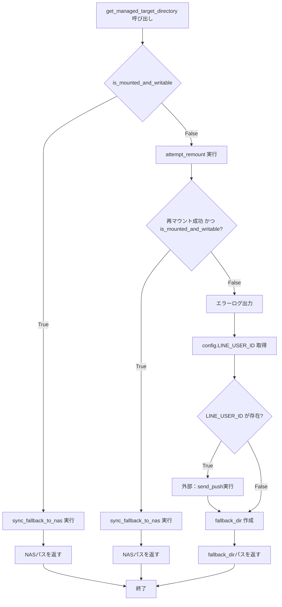
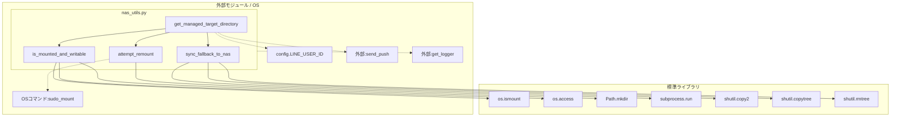

## 1. 解析メタ情報

| 項目 | 内容 |
| --- | --- |
| 対象ファイル | nas_utils.py |
| 言語 | Python |
| 解析対象 | 提供されたコードのみ |
| 推測・補完 | 一切なし |

## 2. ファイルの概要

NASディレクトリへのアクセス状態の確認、マウント外れ時の再マウント試行、アクセス不可時のローカルディレクトリへのフォールバック、および復旧時のフォールバックデータからNASへの同期機能を提供するユーティリティ。

## 3. 外部依存関係

### インポート一覧

| 名称 | 種類 | 用途 | 根拠 |
| --- | --- | --- | --- |
| `os` | 標準ライブラリ | マウント状態やアクセス権の確認 | `import os` (行番号: 1 / 抜粋: "import os") |
| `shutil` | 標準ライブラリ | ファイルやディレクトリのコピー・削除 | `import shutil` (行番号: 2 / 抜粋: "import shutil") |
| `subprocess` | 標準ライブラリ | OSコマンド(`mount`)の実行 | `import subprocess` (行番号: 3 / 抜粋: "import subprocess") |
| `pathlib.Path` | 標準ライブラリ | パス操作 | `from pathlib import Path` (行番号: 4 / 抜粋: "from pathlib import Path") |
| `config` | 外部モジュール | `LINE_USER_ID` の取得など | `import config` (行番号: 7 / 抜粋: "import config") |
| `core.logger.get_logger` | 外部関数 | ロガーの取得 | `from core.logger import get_logger` (行番号: 8 / 抜粋: "from core.logger import get_logger") |
| `services.notification_service.send_push` | 外部関数 | エラー時のプッシュ通知送信 | `from services.notification_service import send_push` (行番号: 9 / 抜粋: "from services.notification_service import...") |

### ブラックボックスとなる外部要素

| 名称 | 理由 | 根拠 |
| --- | --- | --- |
| `config` | 実装が提供されていないため、どのような変数が定義されているか不明（`LINE_USER_ID` 以外） | `import config` (行番号: 7 / 抜粋: "import config") |
| `get_logger` | 内部実装やログの出力先、フォーマットが不明（`core.logger` に依存のため要確認） | `from core.logger import get_logger` (行番号: 8 / 抜粋: "from core.logger import get_logger") |
| `send_push` | 通知の具体的な送信処理、対応プラットフォームなどの実装が不明（`services.notification_service` に依存のため要確認） | `from services.notification_service import send_push` (行番号: 9 / 抜粋: "from services.notification_service import...") |

## 4. 主要要素の定義（関数 / エンドポイント / コンポーネント）

### `attempt_remount`

* **役割**: OSの`mount`コマンドを`sudo`権限付きで実行し、指定されたマウントポイントの再マウントを試みる。
* 根拠: `attempt_remount` (行番号: 19〜40 / 抜粋: "res = subprocess.run...")

* **引数/リクエスト**: `mount_point: str` (対象のマウントポイント)
* 根拠: `attempt_remount`引数 (行番号: 19 / 抜粋: "def attempt_remount(mount_point: str) -> bool:")

* **戻り値/レスポンス**: `bool` (コマンドが正常終了(`returncode == 0`)した場合はTrue、それ以外はFalse)
* 根拠: `attempt_remount`戻り値 (行番号: 33, 36, 39 / 抜粋: "return True", "return False")

* **副作用**: OSコマンド(`sudo mount`)の実行、ログの出力
* 根拠: `attempt_remount`内処理 (行番号: 29, 27 / 抜粋: "res = subprocess.run...", "logger.info(...)")

* **エラーハンドリング**: `Exception`をキャッチし、エラーログを出力してFalseを返す。
* 根拠: `attempt_remount`例外処理 (行番号: 37〜39 / 抜粋: "except Exception as e:")

### `sync_fallback_to_nas`

* **役割**: ローカルのフォールバックディレクトリ内に存在するファイル・ディレクトリを、NASのターゲットディレクトリへコピーし、コピー成功後にローカル側の元データを削除する。
* 根拠: `sync_fallback_to_nas` (行番号: 41〜65 / 抜粋: "shutil.copy2(item, target_path)")

* **引数/リクエスト**: `local_dir: Path` (ローカルのフォールバックパス), `nas_dir: Path` (NASのターゲットパス)
* 根拠: `sync_fallback_to_nas`引数 (行番号: 41 / 抜粋: "def sync_fallback_to_nas(local_dir: Path, nas_dir: Path) -> None:")

* **戻り値/レスポンス**: `None`
* 根拠: `sync_fallback_to_nas`戻り値 (行番号: 41, 48 / 抜粋: "-> None:", "return")

* **副作用**: NASディレクトリへのファイル・ディレクトリ書き込み、ローカルディレクトリ内のデータ削除(`unlink`, `rmtree`)、ログの出力
* 根拠: `sync_fallback_to_nas`内処理 (行番号: 57, 58, 60, 61 / 抜粋: "item.unlink()", "shutil.rmtree(item)")

* **エラーハンドリング**: `Exception`をキャッチし、エラーログ(`exc_info=True`)を出力する。
* 根拠: `sync_fallback_to_nas`例外処理 (行番号: 64〜65 / 抜粋: "except Exception as e:")

### `is_mounted_and_writable`

* **役割**: 指定されたパスがマウントポイントであるかを確認し、ターゲットディレクトリの作成を試みた上で、書き込みおよび実行権限があるかを検証する。
* 根拠: `is_mounted_and_writable` (行番号: 67〜79 / 抜粋: "return os.access(target_dir, os.W_OK | os.X_OK)")

* **引数/リクエスト**: `target_dir: Path` (アクセス確認対象のディレクトリ), `mount_point: str` (マウントポイント)
* 根拠: `is_mounted_and_writable`引数 (行番号: 67 / 抜粋: "def is_mounted_and_writable(target_dir: Path, mount_point: str) -> bool:")

* **戻り値/レスポンス**: `bool` (マウントされており、かつアクセス権があればTrue、なければFalse)
* 根拠: `is_mounted_and_writable`戻り値 (行番号: 71, 76, 79 / 抜粋: "return False", "return os.access(...)")

* **副作用**: ターゲットディレクトリが存在しない場合、親ディレクトリを含めて作成(`mkdir`)する。
* 根拠: `is_mounted_and_writable`内処理 (行番号: 75 / 抜粋: "target_dir.mkdir(parents=True, exist_ok=True)")

* **エラーハンドリング**: ディレクトリ作成やアクセス確認時の`OSError`をキャッチし、Falseを返す。
* 根拠: `is_mounted_and_writable`例外処理 (行番号: 77〜79 / 抜粋: "except OSError:")

### `get_managed_target_directory`

* **役割**: NASディレクトリへのアクセスが可能か確認し、可能ならフォールバックデータを同期してNASパスを返す。不可の場合は再マウントを試み、成功すれば同期してNASパスを返す。復旧失敗時はエラー通知を行い、ローカルのフォールバックパスを返す。
* 根拠: `get_managed_target_directory` (行番号: 81〜118 / 抜粋: "if is_mounted_and_writable...", "return fallback_dir")

* **引数/リクエスト**: `nas_dir_str: str` (NASディレクトリパス), `fallback_dir_str: str` (フォールバックディレクトリパス), `mount_point: str` (デフォルト: "/mnt/nas")
* 根拠: `get_managed_target_directory`引数 (行番号: 81 / 抜粋: "def get_managed_target_directory(nas_dir_str: str, fallback_dir_str: str, mount_point: str = "/mnt/nas") -> Path:")

* **戻り値/レスポンス**: `Path` (最終的に利用可能なディレクトリパス。NASパスまたはフォールバックパス)
* 根拠: `get_managed_target_directory`戻り値 (行番号: 94, 99, 118 / 抜粋: "return nas_dir", "return fallback_dir")

* **副作用**: `sync_fallback_to_nas`の呼び出しによるファイル操作、`attempt_remount`によるOSコマンド実行、`send_push`による外部通知、フォールバックディレクトリの作成(`mkdir`)、ログ出力。
* 根拠: `get_managed_target_directory`内処理 (行番号: 93, 98, 110, 117 / 抜粋: "sync_fallback_to_nas(...)", "fallback_dir.mkdir(...)")

* **エラーハンドリング**: 外部通知前に`getattr`を用いて`config.LINE_USER_ID`の存在を安全に確認し、存在する場合のみ通知処理を行う。
* 根拠: `get_managed_target_directory`例外回避 (行番号: 107〜108 / 抜粋: "user_id = getattr(config, "LINE_USER_ID", None)")

## 5. 処理フロー図

## 6. 依存関係図

## 7. 次のステップ（リバースエンジニアリングの提案）

| 優先度 | ファイル名(推測可) | 理由 | 根拠 |
| --- | --- | --- | --- |
| 高 | `config.py` | `LINE_USER_ID` 以外のどのような設定値が定義されているか、システム全体の設定構造を把握するため | `import config` (行番号: 7) |
| 高 | `services/notification_service.py` | `send_push`関数の具体的な通知仕様（Discord, LINEなどへの実際の送信処理）を把握するため | `from services.notification_service import send_push` (行番号: 9) |
| 中 | `core/logger.py` | ログの出力先、ローテーション規則、フォーマットなどのログ管理仕様を把握するため | `from core.logger import get_logger` (行番号: 8) |

## 8. 保守上の注意点

* `attempt_remount` にて `sudo mount <mount_point>` を実行している。OS側（`sudoers`）で該当コマンドのパスワードなし実行が許可されていない場合、コマンドはハングする、もしくはエラーとなる。
* `sync_fallback_to_nas` にて、ディレクトリコピー時に `dirs_exist_ok=True` を使用している。コピー元と先で同名のディレクトリがある場合はマージされるが、その後コピー元ディレクトリごと `shutil.rmtree` で削除される。
* `is_mounted_and_writable` において、`target_dir.mkdir(parents=True, exist_ok=True)` が実行されるため、マウントポイントが書き込み不可であっても権限エラーが出ない限りディレクトリは生成される。
* グローバルスコープで `try...except ImportError` を用いて、`config` 等が存在しない場合にモック関数を定義している。これによりテスト等で単独実行は可能だが、本番環境で一部モジュールが読み込めなかった場合にエラーとならず沈黙して動作する可能性がある。

## 9. 不明事項一覧

| 項目 | 理由 | 必要なファイル |
| --- | --- | --- |
| `config`モジュールの全容 | 実装が提供されておらず、どのような変数が定義されているか不明 | `config.py` |
| `get_logger`の仕様 | 実装が提供されておらず、ログ出力先やフォーマットが不明 | `core/logger.py` |
| `send_push`の仕様 | 実装が提供されておらず、通知処理の成功可否やエラーハンドリングが不明 | `services/notification_service.py` |

## 10. 自己検証結果

* [完了] 推測・外部ファイルの仕様を一切含んでいない
* [完了] 全関数・全クラス・全コンポーネントを列挙した
* [完了] 全てのインポート要素を列挙した
* [完了] すべての仕様説明に「根拠（行番号・抜粋）」を明記した
* [完了] 根拠漏れが0件である
* [完了] Mermaid構文にエラーの原因となる記号（エスケープ漏れ）がない
* [完了] 不明事項を漏れなく列挙した