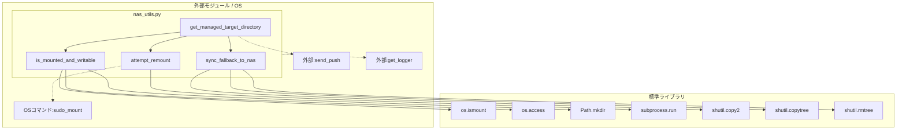

## 1. 解析メタ情報

| 項目 | 内容 |
| --- | --- |
| 対象ファイル | nas_utils.py |
| 言語 | Python |
| 解析対象 | 提供されたコードのみ |
| 推測・補完 | 一切なし |

## 関連ドキュメント

* [nas_monitor.md](./nas_monitor.md) - 類似目的の別モジュール(`nas_monitor.py`はNASの死活監視・リテンション削除を担当するのに対し、本ファイルは他モジュール向けの汎用フォールバック管理ユーティリティを提供)
* [config.md](./config.md) - `LINE_USER_ID`等の設定値を提供
* [logger.md](./logger.md) - `core.logger.get_logger`(`setup_logging`のエイリアス)の実装元。本ファイル8行目の`from core.logger import get_logger`はこのエイリアスにより正常にインポートできる（詳細は本ファイル「相互参照による補足情報」参照）
* [notification_service.md](./notification_service.md) - `send_push`の実体

## 2. ファイルの概要

NASディレクトリへのアクセス状態の確認、マウント外れ時の再マウント試行、アクセス不可時のローカルディレクトリへのフォールバック、および復旧時のフォールバックデータからNASへの同期機能を提供するユーティリティ。

## 3. 外部依存関係

### インポート一覧

| 名称 | 種類 | 用途 | 根拠 |
| --- | --- | --- | --- |
| `os` | 標準ライブラリ | マウント状態やアクセス権の確認 | `import os` (行番号: 1 / 抜粋: "import os") |
| `shutil` | 標準ライブラリ | ファイルやディレクトリのコピー・削除 | `import shutil` (行番号: 2 / 抜粋: "import shutil") |
| `subprocess` | 標準ライブラリ | OSコマンド(`mount`)の実行 | `import subprocess` (行番号: 3 / 抜粋: "import subprocess") |
| `pathlib.Path` | 標準ライブラリ | パス操作 | `from pathlib import Path` (行番号: 4 / 抜粋: "from pathlib import Path") |
| `config` | 外部モジュール | `LINE_USER_ID` の取得など。**Issue #111の修正**により、`import config`自体が失敗した場合のフォールバックとして`config = None`が明示的に定義されるようになった（以前はこのフォールバック節が`get_logger`/`send_push`のみを定義し`config`を定義していなかったため、`import config`が失敗すると`config`という名前自体が未束縛のままモジュールロードが完了し、`get_managed_target_directory`のNAS復旧失敗経路で`NameError`が送出されていた）。 | `import config` (行番号: 7 / 抜粋: "import config"), `config = None` (行番号: 19 / 抜粋: "config = None") |
| `core.logger.get_logger` | 外部関数 | ロガーの取得 | `from core.logger import get_logger` (行番号: 8 / 抜粋: "from core.logger import get_logger") |
| `services.notification_service.send_push` | 外部関数 | エラー時のプッシュ通知送信 | `from services.notification_service import send_push` (行番号: 9 / 抜粋: "from services.notification_service import...") |

### ブラックボックスとなる外部要素

| 名称 | 理由 | 根拠 |
| --- | --- | --- |
| `config` | 実装が提供されていないため、どのような変数が定義されているか不明（`LINE_USER_ID` 以外） | `import config` (行番号: 7 / 抜粋: "import config") |
| `get_logger` | 内部実装やログの出力先、フォーマットが不明（`core.logger` に依存のため要確認） | `from core.logger import get_logger` (行番号: 8 / 抜粋: "from core.logger import get_logger") |
| `send_push` | 通知の具体的な送信処理、対応プラットフォームなどの実装が不明（`services.notification_service` に依存のため要確認） | `from services.notification_service import send_push` (行番号: 9 / 抜粋: "from services.notification_service import...") |

## 4. 主要要素の定義（関数 / エンドポイント / コンポーネント）

### `attempt_remount`

* **役割**: OSの`mount`コマンドを`sudo`権限付きで実行し、指定されたマウントポイントの再マウントを試みる。
* 根拠: `attempt_remount` (行番号: 19〜45 / 抜粋: "res = subprocess.run...")

* **引数/リクエスト**: `mount_point: str` (対象のマウントポイント)
* 根拠: `attempt_remount`引数 (行番号: 19 / 抜粋: "def attempt_remount(mount_point: str) -> bool:")

* **戻り値/レスポンス**: `bool` (コマンドが正常終了(`returncode == 0`)した場合はTrue、それ以外はFalse)
* 根拠: `attempt_remount`戻り値 (行番号: 39, 42, 45 / 抜粋: "return True", "return False")

* **副作用**: OSコマンド(`sudo mount`)の実行、ログの出力
* 根拠: `attempt_remount`内処理 (行番号: 28, 31 / 抜粋: "res = subprocess.run...", "logger.info(...)")

* **エラーハンドリング**: `Exception`をキャッチし、エラーログを出力してFalseを返す。
* 根拠: `attempt_remount`例外処理 (行番号: 43〜45 / 抜粋: "except Exception as e:")

### `sync_fallback_to_nas`

* **役割**: ローカルのフォールバックディレクトリ内に存在するファイル・ディレクトリを、NASのターゲットディレクトリへコピーし、コピー成功後にローカル側の元データを削除する。
* 根拠: `sync_fallback_to_nas` (行番号: 47〜72 / 抜粋: "shutil.copy2(item, target_path)")

* **引数/リクエスト**: `local_dir: Path` (ローカルのフォールバックパス), `nas_dir: Path` (NASのターゲットパス)
* 根拠: `sync_fallback_to_nas`引数 (行番号: 47 / 抜粋: "def sync_fallback_to_nas(local_dir: Path, nas_dir: Path) -> None:")

* **戻り値/レスポンス**: `None`
* 根拠: `sync_fallback_to_nas`戻り値 (行番号: 47, 55 / 抜粋: "-> None:", "return")

* **副作用**: NASディレクトリへのファイル・ディレクトリ書き込み、ローカルディレクトリ内のデータ削除(`unlink`, `rmtree`)、ログの出力
* 根拠: `sync_fallback_to_nas`内処理 (行番号: 65, 68 / 抜粋: "item.unlink()", "shutil.rmtree(item)")

* **エラーハンドリング**: `Exception`をキャッチし、エラーログ(`exc_info=True`)を出力する。
* 根拠: `sync_fallback_to_nas`例外処理 (行番号: 71〜72 / 抜粋: "except Exception as e:")

### `is_mounted_and_writable`

* **役割**: 指定されたパスがマウントポイントであるかを確認し、ターゲットディレクトリの作成を試みた上で、書き込みおよび実行権限があるかを検証する。
* 根拠: `is_mounted_and_writable` (行番号: 74〜85 / 抜粋: "return os.access(target_dir, os.W_OK | os.X_OK)")

* **引数/リクエスト**: `target_dir: Path` (アクセス確認対象のディレクトリ), `mount_point: str` (マウントポイント)
* 根拠: `is_mounted_and_writable`引数 (行番号: 74 / 抜粋: "def is_mounted_and_writable(target_dir: Path, mount_point: str) -> bool:")

* **戻り値/レスポンス**: `bool` (マウントされており、かつアクセス権があればTrue、なければFalse)
* 根拠: `is_mounted_and_writable`戻り値 (行番号: 78, 83, 85 / 抜粋: "return False", "return os.access(...)")

* **副作用**: ターゲットディレクトリが存在しない場合、親ディレクトリを含めて作成(`mkdir`)する。
* 根拠: `is_mounted_and_writable`内処理 (行番号: 82 / 抜粋: "target_dir.mkdir(parents=True, exist_ok=True)")

* **エラーハンドリング**: ディレクトリ作成やアクセス確認時の`OSError`をキャッチし、Falseを返す。
* 根拠: `is_mounted_and_writable`例外処理 (行番号: 84〜85 / 抜粋: "except OSError:")

### `get_managed_target_directory`

* **役割**: NASディレクトリへのアクセスが可能か確認し、可能ならフォールバックデータを同期してNASパスを返す。不可の場合は再マウントを試み、成功すれば同期してNASパスを返す。復旧失敗時はエラー通知を行い、ローカルのフォールバックパスを返す。
* 根拠: `get_managed_target_directory` (行番号: 87〜126 / 抜粋: "if is_mounted_and_writable...", "return fallback_dir")

* **引数/リクエスト**: `nas_dir_str: str` (NASディレクトリパス), `fallback_dir_str: str` (フォールバックディレクトリパス), `mount_point: str` (デフォルト: "/mnt/nas")
* 根拠: `get_managed_target_directory`引数 (行番号: 87 / 抜粋: "def get_managed_target_directory(nas_dir_str: str, fallback_dir_str: str, mount_point: str = "/mnt/nas") -> Path:")

* **戻り値/レスポンス**: `Path` (最終的に利用可能なディレクトリパス。NASパスまたはフォールバックパス)
* 根拠: `get_managed_target_directory`戻り値 (行番号: 104, 109, 126 / 抜粋: "return nas_dir", "return fallback_dir")

* **副作用**: `sync_fallback_to_nas`の呼び出しによるファイル操作、`attempt_remount`によるOSコマンド実行、`send_push`による外部通知、フォールバックディレクトリの作成(`mkdir`)、ログ出力。
* 根拠: `get_managed_target_directory`内処理 (行番号: 103, 108, 118, 125 / 抜粋: "sync_fallback_to_nas(...)", "fallback_dir.mkdir(...)")

* **エラーハンドリング**: `send_push`は`target="discord"`のみで呼び出すため`user_id`引数は不要(Issue #289でsend_pushのシグネチャからLINE宛先解決を分離し、Discord専用呼び出しではuser_id自体が不要になった)。以前は`config.LINE_USER_ID`が未設定だとこの通知自体がスキップされてしまっていたが、現在は`config.LINE_USER_ID`の値に関わらず必ず通知が送信される。
  なお`import config`自体は依然として維持されている。これは**Issue #111の修正**で追加された、`import config`が失敗した場合に`config`という名前そのものが未束縛のままモジュールロードが完了してしまう問題（未束縛だと後続コードで`NameError`が送出され、`get_managed_target_directory`のFail-Softロジックに到達できない）を防ぐための「カナリア」importであり、`tests/test_nas_utils.py`がこの契約(`nas_utils.config is None`)を回帰テストしているため、本文中で`config`を直接参照しなくなった後も削除していない（`core/nas_utils.py`の`# noqa: F401`コメント参照）。
* 根拠: `send_push`呼び出し (行番号: 128〜131 / 抜粋: "send_push(\n        [{\"type\": \"text\", \"text\": error_msg}],\n        target=\"discord\", channel=\"error\"\n    )")
* 根拠: `config = None`フォールバック(Issue #111) / カナリアimport(Issue #289) (行番号: 6〜21 / 抜粋: "try:\n    import config  # noqa: F401 — Issue #111回帰テスト用の\"カナリア\"import")

## 5. 処理フロー図

```mermaid
flowchart TD
    Start[get_managed_target_directory 呼び出し] --> C1{is_mounted_and_writable}
    C1 -- True --> Sync1[sync_fallback_to_nas 実行]
    Sync1 --> ReturnNAS1[NASパスを返す]
    ReturnNAS1 --> End[終了]

    C1 -- False --> Remount[attempt_remount 実行]
    Remount --> C2{再マウント成功 かつ is_mounted_and_writable?}
    C2 -- True --> Sync2[sync_fallback_to_nas 実行]
    Sync2 --> ReturnNAS2[NASパスを返す]
    ReturnNAS2 --> End

    C2 -- False --> LogErr[エラーログ出力]
    LogErr --> Notify[外部：send_push実行(target=discord, user_id不要)]
    Notify --> MkdirFall[fallback_dir 作成]
    MkdirFall --> ReturnFall[fallback_dirパスを返す]
    ReturnFall --> End

```

## 6. 依存関係図

```mermaid
graph TD
    subgraph nas_utils.py
        get_managed_target_directory --> is_mounted_and_writable
        get_managed_target_directory --> attempt_remount
        get_managed_target_directory --> sync_fallback_to_nas
    end

    subgraph 標準ライブラリ
        is_mounted_and_writable --> os.ismount
        is_mounted_and_writable --> os.access
        is_mounted_and_writable --> Path.mkdir
        attempt_remount --> subprocess.run
        sync_fallback_to_nas --> shutil.copy2
        sync_fallback_to_nas --> shutil.copytree
        sync_fallback_to_nas --> shutil.rmtree
    end

    subgraph 外部モジュール / OS
        get_managed_target_directory -.-> 外部:send_push
        attempt_remount -.-> OSコマンド:sudo_mount
        nas_utils.py -.-> 外部:get_logger
    end

```

## 7. 次のステップ（リバースエンジニアリングの提案）

| 優先度 | ファイル名(推測可) | 理由 | 根拠 |
| --- | --- | --- | --- |
| 高 | `config.py` | `LINE_USER_ID` 以外のどのような設定値が定義されているか、システム全体の設定構造を把握するため | `import config` (行番号: 7) |
| 高 | `services/notification_service.py` | `send_push`関数の具体的な通知仕様（Discord, LINEなどへの実際の送信処理）を把握するため | `from services.notification_service import send_push` (行番号: 9) |
| 中 | `core/logger.py` | ログの出力先、ローテーション規則、フォーマットなどのログ管理仕様を把握するため | `from core.logger import get_logger` (行番号: 8) |

## 8. 保守上の注意点

* `attempt_remount` にて `sudo mount <mount_point>` を実行している。OS側（`sudoers`）で該当コマンドのパスワードなし実行が許可されていない場合、コマンドはハングする、もしくはエラーとなる。
* `sync_fallback_to_nas` にて、ディレクトリコピー時に `dirs_exist_ok=True` を使用している。コピー元と先で同名のディレクトリがある場合はマージされるが、その後コピー元ディレクトリごと `shutil.rmtree` で削除される。
* `is_mounted_and_writable` において、`target_dir.mkdir(parents=True, exist_ok=True)` が実行されるため、マウントポイントが書き込み不可であっても権限エラーが出ない限りディレクトリは生成される。
* グローバルスコープで `try...except ImportError` を用いて、`config` 等が存在しない場合にモック関数を定義している。これによりテスト等で単独実行は可能だが、本番環境で一部モジュールが読み込めなかった場合にエラーとならず沈黙して動作する可能性がある。

## 9. 不明事項一覧

| 項目 | 理由 | 必要なファイル |
| --- | --- | --- |
| `config`モジュールの全容 | 実装が提供されておらず、どのような変数が定義されているか不明 | `config.py` |
| `get_logger`の仕様 | 実装が提供されておらず、ログ出力先やフォーマットが不明 | `core/logger.py` |
| `send_push`の仕様 | 実装が提供されておらず、通知処理の成功可否やエラーハンドリングが不明 | `services/notification_service.py` |

## 相互参照による補足情報

| 元の不明事項 | 判明した内容 | 参照元ドキュメント |
| --- | --- | --- |
| `get_logger`の仕様 | `MY_HOME_SYSTEM/core/logger.py`を直接確認した。同ファイル103〜105行目に`def get_logger(name: str) -> logging.Logger: return setup_logging(name)`という、`setup_logging`のエイリアスとして`get_logger`が明示的に定義されている（Issue #126で修正: 過去の解析時点では未定義だったが、現在は定義済み）。したがって本ファイル(`core/nas_utils.py`)8行目の`from core.logger import get_logger`は正常にインポートに成功し、6〜9行目の`try`節がそのまま実行される。10〜21行目の`except ImportError`フォールバック（`def get_logger(name): return logging.getLogger(name)`という標準`logging`モジュールへの単純な委譲）は、`core`/`services`パッケージ自体がインポート不可能な環境（DDD単体デプロイ等）でのみ使用される設計であることを確認した。実際に使われる`core.logger.get_logger`は`setup_logging(name)`をそのまま呼び出すため、`propagate=False`・コンソール出力・`WatchedFileHandler`によるファイル出力・条件付きDiscord通知という`setup_logging`の全機能を伴う（詳細は[logger.md](./logger.md)参照）。 | 直接ソース確認: `MY_HOME_SYSTEM/core/logger.py:103-105`, `MY_HOME_SYSTEM/core/nas_utils.py:6-23`（参考: [logger.md](./logger.md)） |
| `send_push`の仕様 | `MY_HOME_SYSTEM/services/notification_service.py`の`send_push(messages, *, target="both", channel="notify", user_id=None, image_data=None, filename="snapshot.jpg")`(116〜163行目、Issue #289でシグネチャ再設計)を直接確認した。`success = True`で始まり、`target`が`"discord"`/`"both"`のとき`_send_discord_webhook`が失敗すれば`success = False`、`target`が`"line"`/`"both"`のとき`user_id`(省略時は`config.LINE_USER_ID`にフォールバック)が解決できなければエラーログを出して`success = False`、解決できれば`_send_line_push`を呼び出し失敗時はDiscordのerrorチャンネルへフォールバック通知する。戻り値は`bool`(163行目)であり、本ファイル(`core/nas_utils.py`)は`target="discord"`のみで呼び出すため`user_id`引数を渡していない(128〜131行目)ことを確認した。 | 直接ソース確認: `MY_HOME_SYSTEM/services/notification_service.py:116-163`（参考: `MY_HOME_SYSTEM/core/nas_utils.py:128-131`） |
| `config`モジュールの全容 | `MY_HOME_SYSTEM/core/nas_utils.py`を直接確認したところ、Issue #289で`send_push`呼び出しから`config.LINE_USER_ID`の参照を撤去した結果、本ファイルの実行時ロジックはもはや`config`のいかなる属性も参照しない(唯一の名残は7行目の`import config`で、これはIssue #111回帰テスト用のカナリアimportとして`# noqa: F401`付きで意図的に残されている)ことを確認した。対応する`MY_HOME_SYSTEM/config.py`193行目には`LINE_USER_ID: Optional[str] = os.getenv("LINE_USER_ID")`が定義されている。 | 直接ソース確認: `MY_HOME_SYSTEM/core/nas_utils.py:7,19,128-131`, `MY_HOME_SYSTEM/config.py:193` |

## 10. 自己検証結果

* [完了] 推測・外部ファイルの仕様を一切含んでいない
* [完了] 全関数・全クラス・全コンポーネントを列挙した
* [完了] 全てのインポート要素を列挙した
* [完了] すべての仕様説明に「根拠（行番号・抜粋）」を明記した
* [完了] 根拠漏れが0件である
* [完了] Mermaid構文にエラーの原因となる記号（エスケープ漏れ）がない
* [完了] 不明事項を漏れなく列挙した