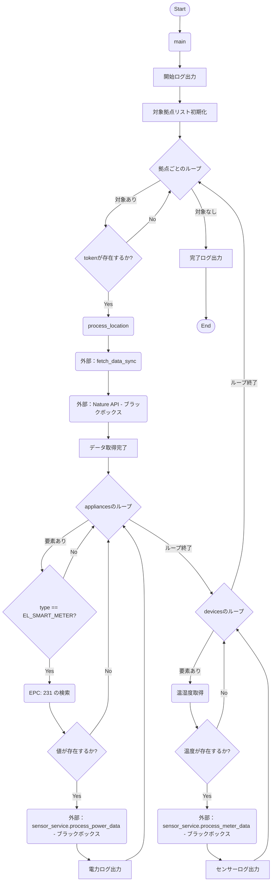
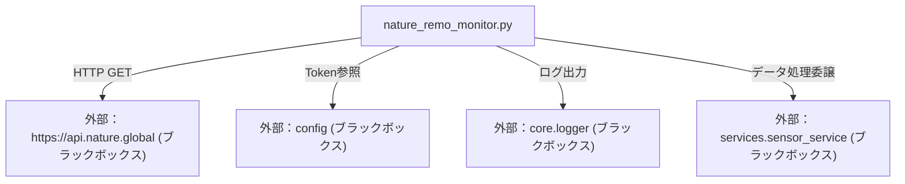

## 1. 解析メタ情報

| 項目 | 内容 |
| --- | --- |
| 対象ファイル | `nature_remo_monitor.py` |
| 言語 | Python |
| 解析対象 | 提供されたコードのみ |
| 推測・補完 | 一切なし |

## 2. ファイルの概要

このファイルは、指定された複数拠点（伊丹、高砂）のNature Remo APIへ定期的にリクエストを送信し、稼働中のアプライアンス（スマートメーター）の瞬時電力データと、デバイス（センサー）の温湿度データを取得する役割を担う。取得したデータは解析され、外部のセンサーデータ処理サービスへ非同期で委譲される。

## 3. 外部依存関係

### インポート一覧

| 名称 | 種類 | 用途 | 根拠 |
| --- | --- | --- | --- |
| `asyncio` | 標準ライブラリ | 非同期I/O処理および別スレッドへの処理委譲 | `[インポート]` (行番号: 2 / 抜粋: "import asyncio") |
| `sys` | 標準ライブラリ | モジュール検索パス（`sys.path`）の動的追加 | `[インポート]` (行番号: 3 / 抜粋: "import sys") |
| `os` | 標準ライブラリ | 実行ファイルの絶対パス取得とディレクトリパス操作 | `[インポート]` (行番号: 4 / 抜粋: "import os") |
| `requests` | 外部ライブラリ | 同期的なHTTP GETリクエストの実行 | `[インポート]` (行番号: 5 / 抜粋: "import requests") |
| `HTTPAdapter` | 外部ライブラリ | HTTP通信セッションへのリトライ設定の適用 | `[インポート]` (行番号: 6 / 抜粋: "from requests.adapters import ") |
| `Retry` | 外部ライブラリ | ステータスコードに応じたリトライロジックの定義 | `[インポート]` (行番号: 7 / 抜粋: "from urllib3.util.retry import") |
| `typing` (`Optional`, `List`, `Dict`, `Any`, `Tuple`) | 標準ライブラリ | 静的型解析のための型ヒント | `[インポート]` (行番号: 8 / 抜粋: "from typing import Optional, L") |
| `config` | 内部モジュール | 環境変数・アクセストークンの取得 | `[インポート]` (行番号: 13 / 抜粋: "import config") |
| `setup_logging` | 内部モジュール | ロガーオブジェクトの生成 | `[インポート]` (行番号: 14 / 抜粋: "from core.logger import setup_") |
| `sensor_service` | 内部モジュール | 抽出したデータの処理委譲 | `[インポート]` (行番号: 15 / 抜粋: "from services import sensor_se") |

### ブラックボックスとなる外部要素

| 名称 | 理由 | 根拠 |
| --- | --- | --- |
| `config.NATURE_REMO_ACCESS_TOKEN` | 環境変数または定数の実値が別ファイルに定義されているため不明。 | `[main]` (行番号: 143 / 抜粋: "("伊丹", config.NATURE_REMO_ACCE") |
| `config.NATURE_REMO_ACCESS_TOKEN_TAKASAGO` | 環境変数または定数の実値が別ファイルに定義されているため不明。 | `[main]` (行番号: 144 / 抜粋: "("高砂", config.NATURE_REMO_ACCE") |
| `core.logger.setup_logging` | ログの出力先（標準出力、ファイルなど）およびフォーマットの実装が不明。 | `[トップレベル]` (行番号: 18 / 抜粋: "logger = setup_logging("nature") |
| `sensor_service.process_power_data` | 電力データをどこに保存・送信するのか、具体的な処理ロジックが不明。 | `[process_location]` (行番号: 109 / 抜粋: "await sensor_service.process_p") |
| `sensor_service.process_meter_data` | 温湿度データをどこに保存・送信するのか、具体的な処理ロジックが不明。 | `[process_location]` (行番号: 131 / 抜粋: "await sensor_service.process_m") |
| `Nature Remo API` | `api.nature.global` の正確なレスポンススキーマの全容（コード上でアクセスしているキー以外）が不明。 | `[fetch_data_sync]` (行番号: 55 / 抜粋: "url_app = "[https://api.nature](https://www.google.com/search?q=https://api.nature).") |

## 4. 主要要素の定義（関数 / エンドポイント / コンポーネント）

### `create_session`

* **役割**: 最大3回のリトライロジック（対象ステータス: 500, 502, 503, 504）を組み込んだ HTTP `GET` 用の `requests.Session` を作成する。
* 根拠: `[create_session]` (行番号: 22〜33 / 抜粋: "def create_session() -> reques")

* **引数/リクエスト**: なし
* 根拠: `[create_session]` (行番号: 22 / 抜粋: "def create_session() -> reques")

* **戻り値/レスポンス**: `requests.Session` (リトライ設定がマウントされたセッションオブジェクト)
* 根拠: `[create_session]` (行番号: 22〜33 / 抜粋: "return session")

* **副作用**: なし
* 根拠: `[create_session]` (行番号: 22〜33 / 抜粋: "session.mount("https://", adap")

* **エラーハンドリング**: なし
* 根拠: `[create_session]` (行番号: 22〜33 / 抜粋: "def create_session() -> reques")

### `fetch_data_sync`

* **役割**: Nature Remo APIに対して同期的にHTTP GETリクエストを行い、`appliances` と `devices` のデータを取得する。
* 根拠: `[fetch_data_sync]` (行番号: 35〜70 / 抜粋: "def fetch_data_sync(location: ")

* **引数/リクエスト**: `location: str` (拠点名), `token: str` (APIアクセストークン)
* 根拠: `[fetch_data_sync]` (行番号: 35 / 抜粋: "def fetch_data_sync(location: ")

* **戻り値/レスポンス**: `Dict[str, List[Dict[str, Any]]]` (取得結果を格納した辞書。トークンが空の場合は空辞書を返す)
* 根拠: `[fetch_data_sync]` (行番号: 35〜70 / 抜粋: "return result")

* **副作用**: 外部API (`https://api.nature.global`) へのネットワーク通信。
* 根拠: `[fetch_data_sync]` (行番号: 56〜62 / 抜粋: "res_app = session.get(url_app,")

* **エラーハンドリング**: 通信エラーなどすべての例外を `Exception` としてキャッチし、ロガーにエラー内容を出力して、取得できた範囲のデータを返す。
* 根拠: `[fetch_data_sync]` (行番号: 66〜68 / 抜粋: "except Exception as e:")

### `process_location`

* **役割**: 拠点とトークンを受け取り、別スレッドでAPI通信を実行。取得したデータからスマートメーターの電力値 (`EPC: 231`) とセンサーの温湿度を抽出し、外部サービスへ非同期で委譲する。
* 根拠: `[process_location]` (行番号: 74〜135 / 抜粋: "async def process_location(loc")

* **引数/リクエスト**: `location: str` (拠点名), `token: str` (APIトークン)
* 根拠: `[process_location]` (行番号: 74 / 抜粋: "async def process_location(loc")

* **戻り値/レスポンス**: `None`
* 根拠: `[process_location]` (行番号: 74 / 抜粋: "async def process_location(loc")

* **副作用**: 外部サービス (`sensor_service.process_power_data`, `sensor_service.process_meter_data`) の非同期呼び出し、ログへの出力。
* 根拠: `[process_location]` (行番号: 109〜131 / 抜粋: "await sensor_service.process_p")

* **エラーハンドリング**: なし（例外は上位に伝播するが、通信エラーは `fetch_data_sync` 内部で処理されるため辞書操作時のキーエラー等以外は発生しにくい）。
* 根拠: `[process_location]` (行番号: 74〜135 / 抜粋: "async def process_location(loc")

### `main`

* **役割**: 伊丹と高砂の2つの拠点情報・トークンを定義し、トークンが存在する拠点についてのみ `process_location` を順次実行する。
* 根拠: `[main]` (行番号: 138〜151 / 抜粋: "async def main() -> None:")

* **引数/リクエスト**: なし
* 根拠: `[main]` (行番号: 138 / 抜粋: "async def main() -> None:")

* **戻り値/レスポンス**: `None`
* 根拠: `[main]` (行番号: 138 / 抜粋: "async def main() -> None:")

* **副作用**: `process_location` の呼び出し。
* 根拠: `[main]` (行番号: 149 / 抜粋: "await process_location(loc, to")

* **エラーハンドリング**: なし
* 根拠: `[main]` (行番号: 138〜151 / 抜粋: "async def main() -> None:")

### `__main__` (エントリーポイント)

* **役割**: スクリプトが直接実行された際、イベントループを起動して `main()` 関数を実行する。
* 根拠: `[__main__]` (行番号: 153〜159 / 抜粋: "if **name** == "**main**":")

* **引数/リクエスト**: なし
* 根拠: `[__main__]` (行番号: 153 / 抜粋: "if **name** == "**main**":")

* **戻り値/レスポンス**: なし
* 根拠: `[__main__]` (行番号: 153〜159 / 抜粋: "asyncio.run(main())")

* **副作用**: 非同期イベントループの開始。
* 根拠: `[__main__]` (行番号: 155 / 抜粋: "asyncio.run(main())")

* **エラーハンドリング**: `KeyboardInterrupt` をキャッチして INFO ログを出力。その他の予期せぬ例外 (`Exception`) をキャッチし、CRITICAL ログを出力する。
* 根拠: `[__main__]` (行番号: 156〜159 / 抜粋: "except KeyboardInterrupt:")

## 5. 処理フロー図

## 6. 依存関係図

## 7. 次のステップ（リバースエンジニアリングの提案）

| 優先度 | ファイル名(推測可) | 理由 | 根拠 |
| --- | --- | --- | --- |
| 高 | `services/sensor_service.py` | 抽出された電力データや温湿度データが最終的にどのようにDBに保存されるか、あるいは別システムに送信されるかを確認するため。 | `[process_location]` (行番号: 109, 131) |
| 中 | `config.py` | 利用されている Nature Remo のアクセストークンの設定方法と、その他の環境変数の依存関係を把握するため。 | `[main]` (行番号: 143, 144) |
| 低 | `core/logger.py` | ログの永続化先（ファイルローテーションの有無など）やフォーマット規則を把握するため。 | `[トップレベル]` (行番号: 18) |

## 8. 保守上の注意点

* `sys.path.append` を利用して `__file__` の2階層上のディレクトリをモジュール検索パスに強制追加しているため、ファイルの配置ディレクトリ（`/monitors`）を変更すると実行時エラーになる可能性が高い。
* `fetch_data_sync` にて、外部API通信時に発生した例外を広範な `Exception` でキャッチしエラーログのみ出力しているため、プログラムは停止せず空のリストで処理が続行される。
* 瞬時電力の抽出判定において、EPCの値がマジックナンバーの `231` （16進数 `0xE7` の十進数表現）としてハードコードされている。
* `requests.get` のタイムアウト時間が `timeout=10`（10秒）でハードコードされている。
* データのパース時、温度 (`te_val`) が存在する場合のみ湿度の処理（委譲）に進み、温度が存在せず湿度だけが存在するパターンのデータは破棄されるロジックとなっている。

## 9. 不明事項一覧

| 項目 | 理由 | 必要なファイル |
| --- | --- | --- |
| 外部委譲されたデータの永続化処理 | `sensor_service` がデータを受け取った後の挙動が本ファイル内には記載されていないため。 | `services/sensor_service.py` |
| APIトークンの管理とスコープ | `config` モジュールから読み取っているトークンがどのような権限を持っているのか、本ファイルからは判断不可。 | `config.py` または環境変数定義ファイル |
| ロギング機構の詳細 | ログがコンソールのみに出力されるのか、ファイルにも保存されるのか、外部に転送されるのかが不明。 | `core/logger.py` |
| APIの完全なデータ構造 | 取得結果 `res_app.json()` および `res_dev.json()` のうち、本ファイルで参照していないキーが含まれているか不明。 | 実際のAPIレスポンスログ または Nature Remo API仕様書 |

## 10. 自己検証結果

* [x] 推測・外部ファイルの仕様を一切含んでいない
* [x] 全関数・全クラス・全コンポーネントを列挙した
* [x] 全てのインポート要素を列挙した
* [x] すべての仕様説明に「根拠（行番号・抜粋）」を明記した
* [x] 根拠漏れが0件である
* [x] Mermaid構文にエラーの原因となる記号（エスケープ漏れ）がない
* [x] 不明事項を漏れなく列挙した
* [x] 完了