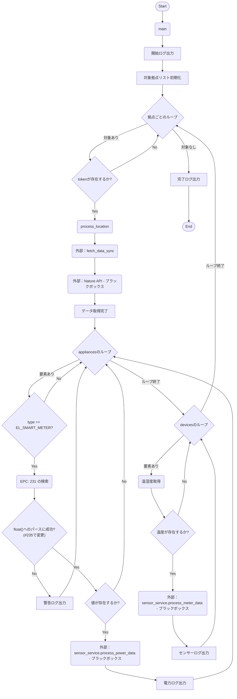
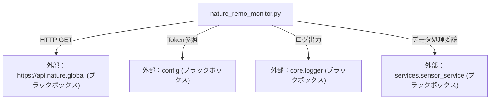

## 1. 解析メタ情報

| 項目 | 内容 |
| --- | --- |
| 対象ファイル | `nature_remo_monitor.py` |
| 言語 | Python |
| 解析対象 | 提供されたコードのみ |
| 推測・補完 | 一切なし |

## 関連ドキュメント

* [sensor_service.md](./sensor_service.md) - データ処理の委譲先(`process_power_data`, `process_meter_data`)
* [config.md](./config.md) - アクセストークン設定値の提供元
* [logger.md](./logger.md) - `setup_logging`の実体

## 2. ファイルの概要

このファイルは、指定された複数拠点（伊丹、高砂）のNature Remo APIへ定期的にリクエストを送信し、稼働中のアプライアンス（スマートメーター）の瞬時電力データと、デバイス（センサー）の温湿度データを取得する役割を担う。取得したデータは解析され、外部のセンサーデータ処理サービスへ非同期で委譲される。

## 3. 外部依存関係

### インポート一覧

| 名称 | 種類 | 用途 | 根拠 |
| --- | --- | --- | --- |
| `asyncio` | 標準ライブラリ | 非同期I/O処理および別スレッドへの処理委譲 | `[インポート]` (行番号: 2 / 抜粋: "import asyncio") |
| `sys` | 標準ライブラリ | モジュール検索パス（`sys.path`）の動的追加 | `[インポート]` (行番号: 3 / 抜粋: "import sys") |
| `os` | 標準ライブラリ | 実行ファイルの絶対パス取得とディレクトリパス操作 | `[インポート]` (行番号: 4 / 抜粋: "import os") |
| `requests` | 外部ライブラリ | 同期的なHTTP GETリクエストの実行 | `[インポート]` (行番号: 5 / 抜粋: "import requests") |
| `HTTPAdapter` | 外部ライブラリ | HTTP通信セッションへのリトライ設定の適用 | `[インポート]` (行番号: 6 / 抜粋: "from requests.adapters import ") |
| `Retry` | 外部ライブラリ | ステータスコードに応じたリトライロジックの定義 | `[インポート]` (行番号: 7 / 抜粋: "from urllib3.util.retry import") |
| `typing` (`Optional`, `List`, `Dict`, `Any`, `Tuple`) | 標準ライブラリ | 静的型解析のための型ヒント | `[インポート]` (行番号: 8 / 抜粋: "from typing import Optional, L") |
| `config` | 内部モジュール | 環境変数・アクセストークンの取得 | `[インポート]` (行番号: 13 / 抜粋: "import config") |
| `setup_logging` | 内部モジュール | ロガーオブジェクトの生成 | `[インポート]` (行番号: 14 / 抜粋: "from core.logger import setup_") |
| `sensor_service` | 内部モジュール | 抽出したデータの処理委譲 | `[インポート]` (行番号: 15 / 抜粋: "from services import sensor_se") |

### ブラックボックスとなる外部要素

| 名称 | 理由 | 根拠 |
| --- | --- | --- |
| `config.NATURE_REMO_ACCESS_TOKEN` | 環境変数または定数の実値が別ファイルに定義されているため不明。 | `[main]` (行番号: 147 / 抜粋: "("伊丹", config.NATURE_REMO_ACCE") |
| `config.NATURE_REMO_ACCESS_TOKEN_TAKASAGO` | 環境変数または定数の実値が別ファイルに定義されているため不明。 | `[main]` (行番号: 148 / 抜粋: "("高砂", config.NATURE_REMO_ACCE") |
| `core.logger.setup_logging` | ログの出力先（標準出力、ファイルなど）およびフォーマットの実装が不明。 | `[トップレベル]` (行番号: 18 / 抜粋: "logger = setup_logging("nature") |
| `sensor_service.process_power_data` | 電力データをどこに保存・送信するのか、具体的な処理ロジックが不明。 | `[process_location]` (行番号: 113 / 抜粋: "await sensor_service.process_p") |
| `sensor_service.process_meter_data` | 温湿度データをどこに保存・送信するのか、具体的な処理ロジックが不明。 | `[process_location]` (行番号: 135 / 抜粋: "await sensor_service.process_m") |
| `Nature Remo API` | `api.nature.global` の正確なレスポンススキーマの全容（コード上でアクセスしているキー以外）が不明。 | `[fetch_data_sync]` (行番号: 59 / 抜粋: "url_app = "[https://api.nature](https://www.google.com/search?q=https://api.nature).") |

## 4. 主要要素の定義（関数 / エンドポイント / コンポーネント）

### `create_session`

* **役割**: 最大3回のリトライロジック（対象ステータス: 500, 502, 503, 504）を組み込んだ HTTP `GET` 用の `requests.Session` を作成する。
* 根拠: `[create_session]` (行番号: 22〜33 / 抜粋: "def create_session() -> reques")

* **引数/リクエスト**: なし
* 根拠: `[create_session]` (行番号: 22 / 抜粋: "def create_session() -> reques")

* **戻り値/レスポンス**: `requests.Session` (リトライ設定がマウントされたセッションオブジェクト)
* 根拠: `[create_session]` (行番号: 22〜33 / 抜粋: "return session")

* **副作用**: なし
* 根拠: `[create_session]` (行番号: 22〜33 / 抜粋: "session.mount("https://", adap")

* **エラーハンドリング**: なし
* 根拠: `[create_session]` (行番号: 22〜33 / 抜粋: "def create_session() -> reques")

### `fetch_data_sync`

* **役割**: Nature Remo APIに対して同期的にHTTP GETリクエストを行い、`appliances` と `devices` のデータを取得する。
* 根拠: `[fetch_data_sync]` (行番号: 35〜74 / 抜粋: "def fetch_data_sync(location: ")

* **引数/リクエスト**: `location: str` (拠点名), `token: str` (APIアクセストークン)
* 根拠: `[fetch_data_sync]` (行番号: 35 / 抜粋: "def fetch_data_sync(location: ")

* **戻り値/レスポンス**: `Dict[str, List[Dict[str, Any]]]` (取得結果を格納した辞書。トークンが空の場合は空辞書を返す)
* 根拠: `[fetch_data_sync]` (行番号: 35〜74 / 抜粋: "return result")

* **副作用**: 外部API (`https://api.nature.global`) へのネットワーク通信。
* 根拠: `[fetch_data_sync]` (行番号: 59〜68 / 抜粋: "res_app = session.get(url_app,")

* **エラーハンドリング**: 通信エラーなどすべての例外を `Exception` としてキャッチし、ロガーにエラー内容を出力して、取得できた範囲のデータを返す。
* 根拠: `[fetch_data_sync]` (行番号: 70〜72 / 抜粋: "except Exception as e:")

### `process_location`

* **役割**: 拠点とトークンを受け取り、別スレッドでAPI通信を実行。取得したデータからスマートメーターの電力値 (`EPC: 231`) とセンサーの温湿度を抽出し、外部サービスへ非同期で委譲する。**（Issue #235で修正）** 電力値のパースは以前`val_str.isdigit()`で数字文字列かどうかを判定していたが、`str.isdigit()`は符号付き文字列(例: `"-120"`)に対して`False`を返すPython仕様のため、太陽光発電等による逆潮流(売電)時の負の瞬時電力値が警告も無く無条件に破棄されていた。`float(val_str)`への直接パースを`try/except`で試み、失敗時のみ警告ログを出す方式に変更した。
* 根拠: `[process_location]` (行番号: 78〜145 / 抜粋: "async def process_location(loc")、電力値パース処理 (行番号: 99〜111 / 抜粋: "try: power_val = float(val_str)")

* **引数/リクエスト**: `location: str` (拠点名), `token: str` (APIトークン)
* 根拠: `[process_location]` (行番号: 78 / 抜粋: "async def process_location(loc")

* **戻り値/レスポンス**: `None`
* 根拠: `[process_location]` (行番号: 78 / 抜粋: "async def process_location(loc")

* **副作用**: 外部サービス (`sensor_service.process_power_data`, `sensor_service.process_meter_data`) の非同期呼び出し、ログへの出力。電力値のパースに失敗した場合(`None`や数値に変換できない文字列)は`logger.warning`で警告ログを出力する(Issue #235で追加)。
* 根拠: `[process_location]` (行番号: 109〜111, 120, 142 / 抜粋: "logger.warning(", "await sensor_service.process_p")

* **エラーハンドリング**: 電力値(`EPC: 231`)のパース失敗(`TypeError`/`ValueError`)はその場で`try/except`により捕捉し警告ログを出力、`power_val`は`None`のまま次の家電へ処理を継続する(Issue #235で追加。修正前はこのケースを`str.isdigit()`で無警告に判定していた)。それ以外の例外は上位に伝播するが、通信エラーは `fetch_data_sync` 内部で処理されるため辞書操作時のキーエラー等以外は発生しにくい。
* 根拠: `[process_location]` (行番号: 108〜111 / 抜粋: "except (TypeError, ValueError):")

### `main`

* **役割**: 伊丹と高砂の2つの拠点情報・トークンを定義し、トークンが存在する拠点についてのみ `process_location` を順次実行する。
* 根拠: `[main]` (行番号: 142〜155 / 抜粋: "async def main() -> None:")

* **引数/リクエスト**: なし
* 根拠: `[main]` (行番号: 142 / 抜粋: "async def main() -> None:")

* **戻り値/レスポンス**: `None`
* 根拠: `[main]` (行番号: 142 / 抜粋: "async def main() -> None:")

* **副作用**: `process_location` の呼び出し。
* 根拠: `[main]` (行番号: 153 / 抜粋: "await process_location(loc, to")

* **エラーハンドリング**: なし
* 根拠: `[main]` (行番号: 142〜155 / 抜粋: "async def main() -> None:")

### `__main__` (エントリーポイント)

* **役割**: スクリプトが直接実行された際、イベントループを起動して `main()` 関数を実行する。
* 根拠: `[__main__]` (行番号: 157〜163 / 抜粋: "if __name__ == "__main__":")

* **引数/リクエスト**: なし
* 根拠: `[__main__]` (行番号: 157 / 抜粋: "if __name__ == "__main__":")

* **戻り値/レスポンス**: なし
* 根拠: `[__main__]` (行番号: 157〜163 / 抜粋: "asyncio.run(main())")

* **副作用**: 非同期イベントループの開始。
* 根拠: `[__main__]` (行番号: 159 / 抜粋: "asyncio.run(main())")

* **エラーハンドリング**: `KeyboardInterrupt` をキャッチして INFO ログを出力。その他の予期せぬ例外 (`Exception`) をキャッチし、CRITICAL ログを出力する。
* 根拠: `[__main__]` (行番号: 160〜163 / 抜粋: "except KeyboardInterrupt:")

## 5. 処理フロー図

```mermaid
flowchart TD
    Start([Start]) --> Main(main)
    Main --> InitLog[開始ログ出力]
    InitLog --> InitList[対象拠点リスト初期化]
    InitList --> LoopStart{拠点ごとのループ}
    LoopStart -- 対象あり --> CheckToken{tokenが存在するか?}
    CheckToken -- Yes --> ProcessLoc(process_location)
    ProcessLoc --> Fetch(外部：fetch_data_sync)
    Fetch --> API(外部：Nature API - ブラックボックス)
    API --> FetchEnd[データ取得完了]
    FetchEnd --> ParseApp{appliancesのループ}
    ParseApp -- 要素あり --> CheckMeter{type == EL_SMART_METER?}
    CheckMeter -- Yes --> ParseEpc(EPC: 231 の検索)
    ParseEpc --> TryParse{"float()へのパースに成功?(#235で変更)"}
    TryParse -- No --> LogParseWarn[警告ログ出力] --> ParseApp
    TryParse -- Yes --> CheckEpc{値が存在するか?}
    CheckEpc -- Yes --> SendPwr(外部：sensor_service.process_power_data - ブラックボックス)
    CheckEpc -- No --> ParseApp
    SendPwr --> LogPwr[電力ログ出力]
    LogPwr --> ParseApp
    CheckMeter -- No --> ParseApp
    ParseApp -- ループ終了 --> ParseDev{devicesのループ}
    ParseDev -- 要素あり --> ParseSens(温湿度取得)
    ParseSens --> CheckSens{温度が存在するか?}
    CheckSens -- Yes --> SendSens(外部：sensor_service.process_meter_data - ブラックボックス)
    CheckSens -- No --> ParseDev
    SendSens --> LogSens[センサーログ出力]
    LogSens --> ParseDev
    ParseDev -- ループ終了 --> LoopStart
    CheckToken -- No --> LoopStart
    LoopStart -- 対象なし --> EndLog[完了ログ出力]
    EndLog --> End([End])

```

## 6. 依存関係図

```mermaid
graph TD
    ThisFile["nature_remo_monitor.py"]
    NatureAPI["外部：https://api.nature.global (ブラックボックス)"]
    Config["外部：config (ブラックボックス)"]
    Logger["外部：core.logger (ブラックボックス)"]
    SensorService["外部：services.sensor_service (ブラックボックス)"]

    ThisFile -->|HTTP GET| NatureAPI
    ThisFile -->|Token参照| Config
    ThisFile -->|ログ出力| Logger
    ThisFile -->|データ処理委譲| SensorService

```

## 7. 次のステップ（リバースエンジニアリングの提案）

| 優先度 | ファイル名(推測可) | 理由 | 根拠 |
| --- | --- | --- | --- |
| 高 | `services/sensor_service.py` | 抽出された電力データや温湿度データが最終的にどのようにDBに保存されるか、あるいは別システムに送信されるかを確認するため。 | `[process_location]` (行番号: 113, 135) |
| 中 | `config.py` | 利用されている Nature Remo のアクセストークンの設定方法と、その他の環境変数の依存関係を把握するため。 | `[main]` (行番号: 147, 148) |
| 低 | `core/logger.py` | ログの永続化先（ファイルローテーションの有無など）やフォーマット規則を把握するため。 | `[トップレベル]` (行番号: 18) |

## 8. 保守上の注意点

* `sys.path.append` を利用して `__file__` の2階層上のディレクトリをモジュール検索パスに強制追加しているため、ファイルの配置ディレクトリ（`/monitors`）を変更すると実行時エラーになる可能性が高い。
* `fetch_data_sync` にて、外部API通信時に発生した例外を広範な `Exception` でキャッチしエラーログのみ出力しているため、プログラムは停止せず空のリストで処理が続行される。
* 瞬時電力の抽出判定において、EPCの値がマジックナンバーの `231` （16進数 `0xE7` の十進数表現）としてハードコードされている。
* `requests.get` のタイムアウト時間が `timeout=10`（10秒）でハードコードされている。
* データのパース時、温度 (`te_val`) が存在する場合のみ湿度の処理（委譲）に進み、温度が存在せず湿度だけが存在するパターンのデータは破棄されるロジックとなっている。
* Issue #235修正前は瞬時電力値(EPC: 231)のパースに`val_str.isdigit()`を用いており、`str.isdigit()`は符号付き文字列(例: `"-120"`)に対して`False`を返すPython言語仕様のため、太陽光発電等による逆潮流(売電)時の負の瞬時電力値が警告ログも無く無条件に破棄されていた。修正後は`float(val_str)`への直接パースを`try/except`で試み、失敗時のみ`logger.warning`を出す方式にした。数値文字列かどうかを事前チェックする実装(`isdigit`, `isnumeric`等)を新規に書く際は、符号付き数値・小数を正しく扱えるか(=`float()`/`int()`への実パースで検証する方が安全)を確認すること。

| 項目 | 理由 | 必要なファイル |
| --- | --- | --- |
| 外部委譲されたデータの永続化処理 | `sensor_service` がデータを受け取った後の挙動が本ファイル内には記載されていないため。 | `services/sensor_service.py` |
| APIトークンの管理とスコープ | `config` モジュールから読み取っているトークンがどのような権限を持っているのか、本ファイルからは判断不可。（`config.py`側の格納方法はリポジトリ内で確認できたが、Nature Remo Cloud側で当該トークンに実際に付与されている権限範囲・スコープ自体はリポジトリ内に記録がなく、解消不可） | `config.py` または環境変数定義ファイル |
| ロギング機構の詳細 | ログがコンソールのみに出力されるのか、ファイルにも保存されるのか、外部に転送されるのかが不明。 | `core/logger.py` |
| APIの完全なデータ構造 | 取得結果 `res_app.json()` および `res_dev.json()` のうち、本ファイルで参照していないキーが含まれているか不明。（リポジトリ内を`nature`関連ファイル名・実際のAPIレスポンスログで検索したが、Nature Remo APIのレスポンスサンプルや仕様書に相当するファイルはリポジトリ内に存在せず、解消不可。Nature Remo公式APIドキュメントというリポジトリ外部の情報を要する） | 実際のAPIレスポンスログ または Nature Remo API仕様書 |

## 相互参照による補足情報

| 元の不明事項 | 判明した内容 | 参照元ドキュメント |
| --- | --- | --- |
| 外部委譲されたデータの永続化処理 | `MY_HOME_SYSTEM/services/sensor_service.py`を直接確認した。`process_meter_data(device_id, device_name, temp, humidity)`(135〜147行目)は`save_log_async(config.SQLITE_TABLE_SWITCHBOT_LOGS, ["device_id", "device_name", "temperature", "humidity", "timestamp"], ...)`で温湿度データをDBへ保存するのみ（通知処理なし）。`process_power_data(device_id, device_name, wattage, notify_settings)`(149行目〜)は、まず`common.get_db_cursor()`で`config.SQLITE_TABLE_POWER_USAGE`テーブルから当該`device_id`の直近`wattage`を取得し(158〜177行目)、続いて`save_log_async`で現在値を保存(180〜184行目)した後、`notify_settings.get("threshold")`(188行目)を用いて前回値と現在値が閾値をまたいだかを判定し通知する設計であることを確認した（188行目以降のロジックまで確認）。 | 直接ソース確認: `MY_HOME_SYSTEM/services/sensor_service.py:135-189` |
| ロギング機構の詳細 | `MY_HOME_SYSTEM/core/logger.py`の`setup_logging(name, webhook_url=None)`(46〜86行目)を直接確認した。(1) コンソール出力用の`logging.StreamHandler`(58〜60行目)、(2) `TimedRotatingFileHandler`による`logs/home_system.log`への日次ローテーションファイル出力（`when='midnight', interval=1, backupCount=7`、62〜74行目）、(3) `webhook_url`引数または`config.DISCORD_WEBHOOK_ERROR`が設定されていれば、ERRORレベル以上のログのみをDiscordへ転送する`DiscordErrorHandler`(9〜44行目、76〜84行目)、の3種のハンドラを登録する設計であることを確認した。本ファイル(`monitors/nature_remo_monitor.py`)は`setup_logging("nature_remo_monitor")`のように`webhook_url`を省略して呼び出しているため、Discord転送は`config.DISCORD_WEBHOOK_ERROR`が設定されている場合のみ有効になる。 | 直接ソース確認: `MY_HOME_SYSTEM/core/logger.py:9-86` |
| APIトークンの管理とスコープ（判明した範囲） | `MY_HOME_SYSTEM/config.py`180〜181行目を直接確認した。`NATURE_REMO_ACCESS_TOKEN: Optional[str] = os.getenv("NATURE_REMO_ACCESS_TOKEN")`、`NATURE_REMO_ACCESS_TOKEN_TAKASAGO: Optional[str] = os.getenv("NATURE_REMO_ACCESS_TOKEN_TAKASAGO")`と定義されており、いずれも環境変数から読み込む単純な文字列（未設定時は`None`）で、本ファイル147〜148行目で伊丹用・高砂用の2トークンとしてそれぞれ`process_location`に渡されていることを確認した。ただしトークン自体に付与されている権限スコープ（Nature Remo Cloud API側の設定）はリポジトリ内のどこにも記録がなく、これ以上は解消できなかった。 | 直接ソース確認: `MY_HOME_SYSTEM/config.py:180-181`（参考: `MY_HOME_SYSTEM/monitors/nature_remo_monitor.py:147-148`） |

## 10. 自己検証結果

* [x] 推測・外部ファイルの仕様を一切含んでいない
* [x] 全関数・全クラス・全コンポーネントを列挙した
* [x] 全てのインポート要素を列挙した
* [x] すべての仕様説明に「根拠（行番号・抜粋）」を明記した
* [x] 根拠漏れが0件である
* [x] Mermaid構文にエラーの原因となる記号（エスケープ漏れ）がない
* [x] 不明事項を漏れなく列挙した
* [x] 完了