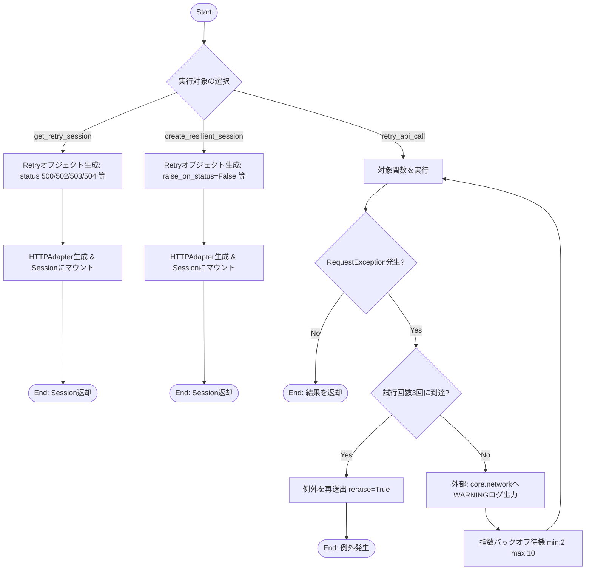
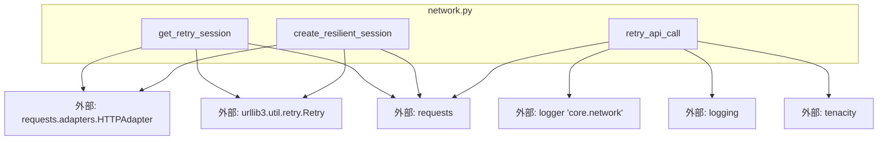

## 1. 解析メタ情報

| 項目 | 内容 |
| --- | --- |
| 対象ファイル | network.py |
| 言語 | Python |
| 解析対象 | 提供されたコードのみ |
| 推測・補完 | 一切なし |

## 2. ファイルの概要

API通信時の障害に対する耐性を持たせるため、HTTPエラーに対するリトライ設定を組み込んだHTTPセッション（`requests.Session`）の構築機能、および特定のAPI呼び出し関数に対して例外発生時のリトライ処理を付与するデコレータを提供する。

## 3. 外部依存関係

### インポート一覧

| 名称 | 種類 | 用途 | 根拠 |
| --- | --- | --- | --- |
| `requests` | 外部モジュール | HTTPセッションの作成と例外の参照 | 根拠: `import requests` (行番号: 1 / 抜粋: "import requests") |
| `logging` | 標準ライブラリ | ロガーの取得とログレベルの指定 | 根拠: `import logging` (行番号: 2 / 抜粋: "import logging") |
| `tenacity` | 外部モジュール | リトライ前のログ出力設定の参照 | 根拠: `import tenacity` (行番号: 3 / 抜粋: "import tenacity") |
| `retry`, `stop_after_attempt`, `wait_exponential`, `retry_if_exception_type` | 外部モジュール（`tenacity`） | デコレータによるリトライ条件、待機時間、停止条件の制御 | 根拠: `from tenacity import retry...` (行番号: 4 / 抜粋: "from tenacity import retry, st") |
| `HTTPAdapter` | 外部モジュール（`requests.adapters`） | セッションへのリトライ設定の適用（マウント） | 根拠: `from requests.adapters import ...` (行番号: 5 / 抜粋: "from requests.adapters import ") |
| `Retry` | 外部モジュール（`urllib3.util.retry`） | HTTPリクエストにおけるリトライ戦略・条件の定義 | 根拠: `from urllib3.util.retry import ...` (行番号: 6 / 抜粋: "from urllib3.util.retry import") |

### ブラックボックスとなる外部要素

| 名称 | 理由 | 根拠 |
| --- | --- | --- |
| `core.network`ロガー | ロガーの出力先、フォーマット、ログレベル等の設定内容が当該ファイル内に存在しないため。 | 根拠: `logging.getLogger` (行番号: 45 / 抜粋: "logging.getLogger("core.netwo") |

## 4. 主要要素の定義（関数 / エンドポイント / コンポーネント）

### `get_retry_session`

* **役割**: 指定されたリトライ回数とバックオフ係数に基づき、特定のエラーコード（500, 502, 503, 504）とHTTPメソッドで再試行を行う`requests.Session`を作成し返す。
* 根拠: `get_retry_session` (行番号: 8〜20 / 抜粋: "def get_retry_session(retries=")

* **引数/リクエスト**: `retries` (デフォルト: 3), `backoff_factor` (デフォルト: 1.0)
* 根拠: `get_retry_session` (行番号: 8 / 抜粋: "def get_retry_session(retries=")

* **戻り値/レスポンス**: `requests.Session`オブジェクト
* 根拠: `session` (行番号: 20 / 抜粋: "return session")

* **副作用**: なし
* 根拠: `get_retry_session` (行番号: 8〜20 / 抜粋: "def get_retry_session(retries=")

* **エラーハンドリング**: 関数内で明示的な例外のキャッチ処理はないが、`Retry`設定によりHTTP通信時の特定エラーステータスに対してリトライが行われる。
* 根拠: `retry` (行番号: 11〜16 / 抜粋: "retry = Retry(")

### `create_resilient_session`

* **役割**: （旧API互換）`get_retry_session`とは異なるデフォルト値と許可メソッドを持ち、さらにHTTPエラーステータスによる例外発生を抑制（`raise_on_status=False`）する`requests.Session`を作成し返す。
* 根拠: `create_resilient_session` (行番号: 22〜35 / 抜粋: "def create_resilient_session(r")

* **引数/リクエスト**: `retries` (デフォルト: 3), `backoff_factor` (デフォルト: 2), `status_forcelist` (デフォルト: `(500, 502, 504)`)
* 根拠: `create_resilient_session` (行番号: 22 / 抜粋: "def create_resilient_session(r")

* **戻り値/レスポンス**: `requests.Session`オブジェクト
* 根拠: `session` (行番号: 35 / 抜粋: "return session")

* **副作用**: なし
* 根拠: `create_resilient_session` (行番号: 22〜35 / 抜粋: "def create_resilient_session(r")

* **エラーハンドリング**: `raise_on_status=False`により、リトライ回数超過後にエラーステータスコードが返却されても例外（`HTTPError`）を発生させない。
* 根拠: `retry_strategy` (行番号: 30 / 抜粋: "raise_on_status=False")

### `retry_api_call`

* **役割**: API呼び出し用関数に適用するデコレータ。`requests.exceptions.RequestException`発生時に、指数バックオフ（最小2秒、最大10秒）で最大3回まで実行を再試行する。
* 根拠: `retry_api_call` (行番号: 37〜47 / 抜粋: "def retry_api_call(func):")

* **引数/リクエスト**: `func` (呼び出し可能な関数オブジェクト)
* 根拠: `retry_api_call` (行番号: 37 / 抜粋: "def retry_api_call(func):")

* **戻り値/レスポンス**: リトライ機能が付与されたデコレート済みの関数
* 根拠: `retry` (行番号: 39〜47 / 抜粋: "return retry(")

* **副作用**: リトライの待機に入る直前（`before_sleep`）に、外部ロガー`core.network`に対して`WARNING`レベルのログを出力する。
* 根拠: `before_sleep` (行番号: 45 / 抜粋: "before_sleep=tenacity.before_s")

* **エラーハンドリング**: `requests.exceptions.RequestException`をキャッチしてリトライを実施。最大試行回数に到達した場合は、元の例外を再度送出（`reraise=True`）する。
* 根拠: `reraise` (行番号: 46 / 抜粋: "reraise=True")

## 5. 処理フロー図

## 6. 依存関係図

## 7. 次のステップ（リバースエンジニアリングの提案）

| 優先度 | ファイル名(推測可) | 理由 | 根拠 |
| --- | --- | --- | --- |
| 高 | `core/network.py` などの設定関連ファイル | `logging.getLogger("core.network")`が参照されており、実際のログ出力先やフォーマットの挙動を特定するため。 | 根拠: `logging.getLogger("core.network")` (行番号: 45 / 抜粋: "logging.getLogger("core.netwo") |
| 中 | API呼び出しを実行している各種サービスクラス・関数群 | 提供された3つの機能（Session生成・デコレータ）が実際にどのエンドポイント・処理に対して使用されているか影響範囲を特定するため。 | 根拠: 全体 (行番号: 1〜47 / 抜粋: "def get_retry_session(retries=") |

## 8. 保守上の注意点

* `get_retry_session`と`create_resilient_session`において、リトライ対象となるHTTPステータスコード（`503`の有無）や許可されるHTTPメソッド（`PUT`, `DELETE`, `TRACE`の有無）、バックオフ係数のデフォルト値が異なるため、用途の混同に注意が必要である。
* `create_resilient_session`には`raise_on_status=False`が指定されているため、リトライ上限到達後もHTTPエラーに応じた例外が自動送出されず、呼び出し元でレスポンスのステータスコード確認が必要となる。
* `retry_api_call`デコレータ内のロガー取得（`logging.getLogger("core.network")`）はモジュールインポート時ではなく関数呼び出し（リトライ発生）時に実行される設計となっている。これはコメントにある通り循環参照回避を目的としている。

## 9. 不明事項一覧

| 項目 | 理由 | 必要なファイル |
| --- | --- | --- |
| `core.network`ロガーの設定詳細 | モジュール内でロガーの設定（出力レベルの閾値、ハンドラ、フォーマット）が定義されておらず、外部に依存しているため。 | ログ設定ファイルまたは`core/network.py`周辺の初期化スクリプト |
| 対象システムの全体的なAPI依存先 | 本ファイルは汎用的なネットワーク機能を提供しているだけであり、実際にどの外部APIと通信しているかが不明なため。 | `requests.Session`や`retry_api_call`を使用しているファイル群 |

## 10. 自己検証結果

* [x] 推測・外部ファイルの仕様を一切含んでいない
* [x] 全関数・全クラス・全コンポーネントを列挙した
* [x] 全てのインポート要素を列挙した
* [x] すべての仕様説明に「根拠（行番号・抜粋）」を明記した
* [x] 根拠漏れが0件である
* [x] Mermaid構文にエラーの原因となる記号（エスケープ漏れ）がない
* [x] 不明事項を漏れなく列挙した