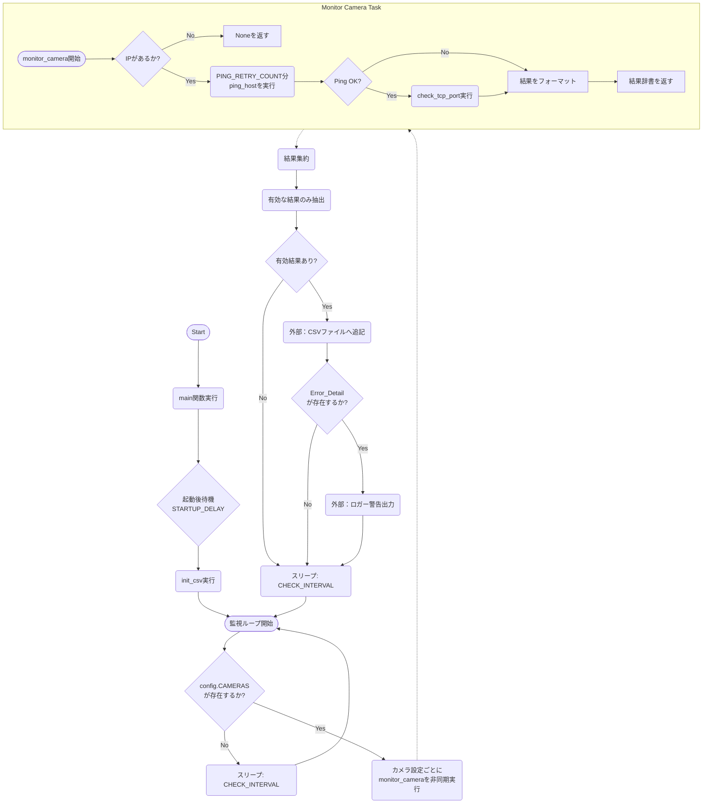
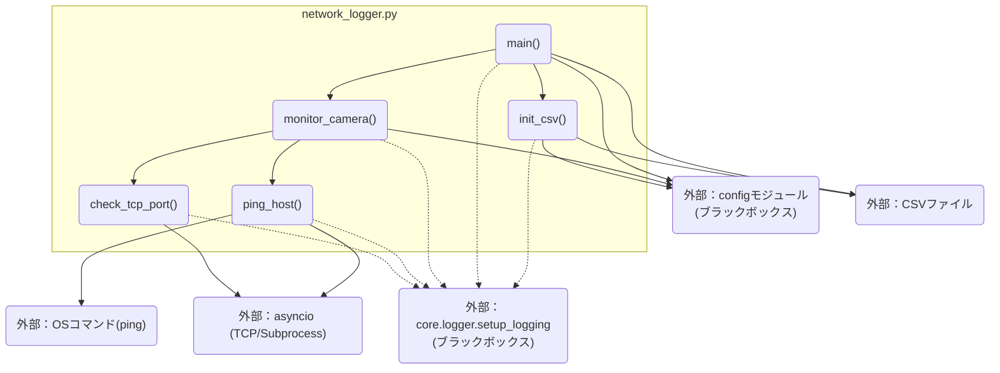

## 1. 解析メタ情報

| 項目 | 内容 |
| --- | --- |
| 対象ファイル | `network_logger.py` |
| 言語 | Python |
| 解析対象 | 提供されたコードのみ |
| 推測・補完 | 一切なし |

## 2. ファイルの概要

指定されたカメラのIPアドレスに対し、定期的にICMP Pingによる死活監視とRTSPポートへのTCP接続（ハンドシェイク）試行を行い、レイテンシとステータスを計測してCSVファイルに記録するネットワーク監視機能を提供している。

## 3. 外部依存関係

### インポート一覧

| 名称 | 種類 | 用途 | 根拠 |
| --- | --- | --- | --- |
| `asyncio` | 標準ライブラリ | 非同期処理、サブプロセス実行、TCP接続、スリープ待機に使用。 | `import asyncio` (行番号: 1 / 抜粋: "import asyncio") |
| `csv` | 標準ライブラリ | 監視結果を記録するCSVファイルの作成、書き込みに使用。 | `import csv` (行番号: 2 / 抜粋: "import csv") |
| `datetime` | 標準ライブラリ | ログのタイムスタンプ取得に使用。 | `import datetime` (行番号: 3 / 抜粋: "import datetime") |
| `os` | 標準ライブラリ | ファイルパスの操作とディレクトリ・ファイル作成に使用。 | `import os` (行番号: 4 / 抜粋: "import os") |
| `sys` | 標準ライブラリ | モジュール検索パス (`sys.path`) へのディレクトリ追加に使用。 | `import sys` (行番号: 5 / 抜粋: "import sys") |
| `time` | 標準ライブラリ | 処理時間（レイテンシ）の計測に使用。 | `import time` (行番号: 6 / 抜粋: "import time") |
| `typing` | 標準ライブラリ | 型ヒント（Dict, Any, List, Optional）の定義に使用。 | `from typing import Dict, Any` (行番号: 7 / 抜粋: "from typing import Dict, Any") |
| `config` | カスタムモジュール | カメラ設定一覧、ログ保存先ディレクトリパスの取得に使用。 | `import config` (行番号: 14 / 抜粋: "import config") |
| `core.logger` | カスタムモジュール | ロガー設定関数 (`setup_logging`) の読み込みに使用。 | `from core.logger import setup_...` (行番号: 15 / 抜粋: "from core.logger import setup_") |

### ブラックボックスとなる外部要素

| 名称 | 理由 | 根拠 |
| --- | --- | --- |
| `config` | `CAMERAS`の構造や`LOG_DIR`のパスなど、実体となる設定値の定義が本ファイル内に存在しないため。 | `os.path.join(config.LOG_DIR...` (行番号: 26 / 抜粋: "config.LOG_DIR, "network_stats") |
| `core.logger.setup_logging` | 関数の実装内容、出力先のログレベル、フォーマットなどが本ファイル内に存在しないため。 | `setup_logging("network_monito` (行番号: 25 / 抜粋: "setup_logging("network_monitor")") |

## 4. 主要要素の定義（関数 / エンドポイント / コンポーネント）

### `ping_host`

* **役割**: Linuxシステムの `ping` コマンドを非同期サブプロセスで実行し、指定されたIPアドレスの到達確認とレイテンシ計測を行う。
* 根拠: `ping_host` 関数定義とコメント (行番号: 38-40 / 抜粋: "ICMP Pingを実行し、到達確認とレイテンシ計測を行")

* **引数/リクエスト**: `ip: str` (対象のIPアドレス)
* 根拠: `ping_host` 関数定義 (行番号: 38 / 抜粋: "async def ping_host(ip: str)")

* **戻り値/レスポンス**: `Dict[str, Any]` (ステータス、レイテンシ、エラー内容を含む辞書)
* 根拠: `ping_host` 関数定義と返却値 (行番号: 38 / 抜粋: "-> Dict[str, Any]:")

* **副作用**: サブプロセス（OSコマンド）の実行。
* 根拠: `asyncio.create_subprocess_exec` 呼び出し (行番号: 48 / 抜粋: "asyncio.create_subprocess_exec")

* **エラーハンドリング**: サブプロセス起動・実行時の例外をキャッチし、エラーログ出力およびエラーステータス（"ERROR"）を返却する。
* 根拠: `except Exception as e:` ブロック (行番号: 64-66 / 抜粋: "logger.error(f"Ping execution")

### `check_tcp_port`

* **役割**: 指定されたIPアドレスとポートに対して非同期TCP接続（ハンドシェイク）を試行し、結果とレイテンシを計測する。
* 根拠: `check_tcp_port` 関数定義とコメント (行番号: 69-70 / 抜粋: "指定されたポートへのTCP接続（ハンドシェイク）を試行")

* **引数/リクエスト**: `ip: str` (対象IPアドレス), `port: int` (対象ポート番号)
* 根拠: `check_tcp_port` 関数定義 (行番号: 69 / 抜粋: "def check_tcp_port(ip: str, p")

* **戻り値/レスポンス**: `Dict[str, Any]` (ステータスとレイテンシを含む辞書)
* 根拠: `check_tcp_port` 関数定義と返却値 (行番号: 69 / 抜粋: "-> Dict[str, Any]:")

* **副作用**: TCPソケットの作成と通信試行。
* 根拠: `asyncio.open_connection` 呼び出し (行番号: 81 / 抜粋: "future = asyncio.open_connecti")

* **エラーハンドリング**: `TimeoutError`, `ConnectionRefusedError`, `OSError` などの接続失敗をキャッチして対応するステータスを返却。例外発生時も明示的にwriterリソースを解放 (`finally`) する。
* 根拠: `except` / `finally` ブロック (行番号: 92-106 / 抜粋: "except asyncio.TimeoutError:")

### `monitor_camera`

* **役割**: 単一のカメラ設定情報を受け取り、Pingチェック（再試行含む）とTCPポートチェック（Ping成功時のみ）を実行、ログ保存用の辞書データを作成する。IPが存在しない場合は処理をスキップする。
* 根拠: `monitor_camera` 関数内処理 (行番号: 110-143 / 抜粋: "1. Ping Check (with Retry)")

* **引数/リクエスト**: `cam_config: Dict[str, Any]` (カメラ設定の辞書)
* 根拠: `monitor_camera` 関数定義 (行番号: 110 / 抜粋: "cam_config: Dict[str, Any]")

* **戻り値/レスポンス**: `Optional[Dict[str, Any]]` (監視結果のデータ辞書。IPがない場合はNone)
* 根拠: `monitor_camera` 返却値 (行番号: 110 / 抜粋: "Optional[Dict[str, Any]]:")

* **副作用**: なし。
* 根拠: 外部リソース変更なし (行番号: 110-160 / 抜粋: "return { "Timestamp": datetime")

* **エラーハンドリング**: 引数の辞書に "ip" キーがない場合、警告ログを出力しNoneを返して終了する。
* 根拠: `if not ip:` ブロック (行番号: 121-123 / 抜粋: "logger.warning(f"Skipping came")

### `init_csv`

* **役割**: ログ保存先のディレクトリとCSVファイルが存在しない場合、それらを作成してヘッダーを書き込む。
* 根拠: `init_csv` 関数内処理 (行番号: 163-172 / 抜粋: "ディレクトリがない場合は作成（念のため）")

* **引数/リクエスト**: なし。
* 根拠: `init_csv` 関数定義 (行番号: 163 / 抜粋: "def init_csv() -> None:")

* **戻り値/レスポンス**: なし (`None`)。
* 根拠: `init_csv` 関数定義 (行番号: 163 / 抜粋: "-> None:")

* **副作用**: ファイルシステムへのディレクトリおよびファイル作成、書き込みアクセス。
* 根拠: `os.makedirs` および `open(CSV_FILE, 'w')` (行番号: 166-170 / 抜粋: "os.makedirs(os.path.dirname(CS")

* **エラーハンドリング**: 初期化失敗の例外をキャッチし、ログを記録するがプロセスは停止させない。
* 根拠: `except Exception as e:` ブロック (行番号: 173-175 / 抜粋: "logger.critical(f"Failed to in")

### `main`

* **役割**: 起動待機後、CSV初期化を行い、定期的な監視ループ (`CHECK_INTERVAL`) を実行する。複数カメラの監視を非同期で並列実行し、結果をCSVへ追記し異常時には警告ログを出力する。
* 根拠: `main` 関数内のループおよび非同期タスク並列処理 (行番号: 178-223 / 抜粋: "メイン監視ループ。")

* **引数/リクエスト**: なし。
* 根拠: `main` 関数定義 (行番号: 178 / 抜粋: "async def main() -> None:")

* **戻り値/レスポンス**: なし (`None`)。
* 根拠: `main` 関数定義 (行番号: 178 / 抜粋: "-> None:")

* **副作用**: CSVファイルへの追記書き込み処理。
* 根拠: `open(CSV_FILE, 'a')` (行番号: 206 / 抜粋: "with open(CSV_FILE, 'a', newli")

* **エラーハンドリング**: CSV書き込み失敗時、およびメインループ内での予期せぬエラー時に例外をキャッチしログ出力する。キーボード割込 (`KeyboardInterrupt`) はファイル末尾でハンドリング。
* 根拠: `try-except` ブロック群 (行番号: 205-223 / 抜粋: "except Exception as e:")

## 5. 処理フロー図

## 6. 依存関係図

## 7. 次のステップ（リバースエンジニアリングの提案）

| 優先度 | ファイル名(推測可) | 理由 | 根拠 |
| --- | --- | --- | --- |
| 高 | `config.py` | 監視対象となるカメラの情報（IP、名前など）のデータ構造と、出力先ディレクトリパスの設定内容を把握するため。 | `import config` (行番号: 14 / 抜粋: "import config") |
| 中 | `core/logger.py` | ログファイルの出力先やフォーマット、エラー時の通知設定（もしあれば）を確認するため。 | `from core.logger import setup_...` (行番号: 15 / 抜粋: "from core.logger import setup_") |

## 8. 保守上の注意点

* `main` 関数内のCSV書き込み処理 (`open(CSV_FILE, 'a')`) は非同期対応 (aiofilesなど) されておらず、I/O処理によるブロッキングが発生する可能性がある。
* `ping_host` 関数内でOSの `ping` コマンドを引数指定で直接呼び出している。Linux向けの引数 (`-c`, `-W`) がハードコードされているため、Windowsなどの別OSで実行すると動作しない可能性がある。
* `monitor_camera` 内のTCPポートチェックはPingが成功した場合のみ実行される仕様となっている。

## 9. 不明事項一覧

| 項目 | 理由 | 必要なファイル |
| --- | --- | --- |
| 設定値の詳細構造 | `config.CAMERAS`の要素が持つキー（"name", "ip"以外に何があるか）や`LOG_DIR`の値が不明。 | `config.py` |
| ロガーの仕様 | `setup_logging`関数がどのような設定（出力先、ローテーション、フォーマット等）でロガーを初期化しているか不明。 | `core/logger.py` |

## 10. 自己検証結果

* [x] 推測・外部ファイルの仕様を一切含んでいない
* [x] 全関数・全クラス・全コンポーネントを列挙した
* [x] 全てのインポート要素を列挙した
* [x] すべての仕様説明に「根拠（行番号・抜粋）」を明記した
* [x] 根拠漏れが0件である
* [x] Mermaid構文にエラーの原因となる記号（エスケープ漏れ）がない
* [x] 不明事項を漏れなく列挙した
完了