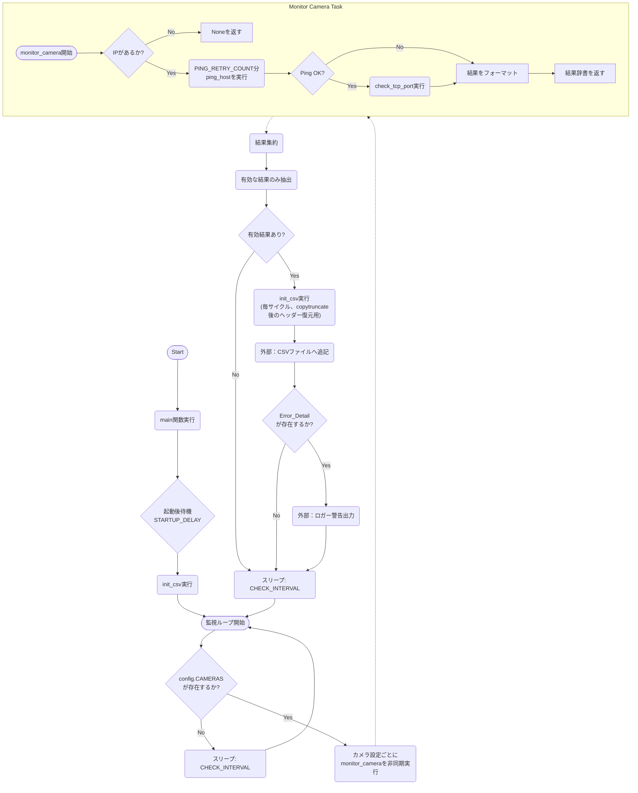
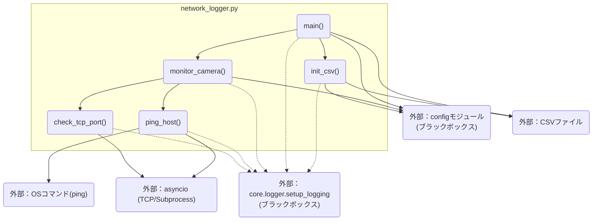

## 1. 解析メタ情報

| 項目 | 内容 |
| --- | --- |
| 対象ファイル | `network_logger.py` |
| 言語 | Python |
| 解析対象 | 提供されたコードのみ |
| 推測・補完 | 一切なし |

## 関連ドキュメント

* [config.md](./config.md) - `LOG_DIR`, カメラ設定(`CAMERAS`)の提供元
* [logger.md](./logger.md) - `setup_logging`の実体
* [camera_monitor.md](./camera_monitor.md) - 同じ`config.CAMERAS`設定を参照する別モジュール(ONVIF動体検知を担当。本ファイルはPing/TCP死活監視を担当という役割分担と推測される)

## 2. ファイルの概要

指定されたカメラのIPアドレスに対し、定期的にICMP Pingによる死活監視とRTSPポートへのTCP接続（ハンドシェイク）試行を行い、レイテンシとステータスを計測してCSVファイルに記録するネットワーク監視機能を提供している。

## 3. 外部依存関係

### インポート一覧

| 名称 | 種類 | 用途 | 根拠 |
| --- | --- | --- | --- |
| `asyncio` | 標準ライブラリ | 非同期処理、サブプロセス実行、TCP接続、スリープ待機に使用。 | `import asyncio` (行番号: 1 / 抜粋: "import asyncio") |
| `csv` | 標準ライブラリ | 監視結果を記録するCSVファイルの作成、書き込みに使用。 | `import csv` (行番号: 2 / 抜粋: "import csv") |
| `datetime` | 標準ライブラリ | ログのタイムスタンプ取得に使用。 | `import datetime` (行番号: 3 / 抜粋: "import datetime") |
| `os` | 標準ライブラリ | ファイルパスの操作とディレクトリ・ファイル作成に使用。 | `import os` (行番号: 4 / 抜粋: "import os") |
| `re` | 標準ライブラリ | Issue #190: `ping`コマンド出力から実測RTT (`time=X ms`) を抽出する正規表現に使用。 | `import re` (行番号: 5 / 抜粋: "import re") |
| `sys` | 標準ライブラリ | モジュール検索パス (`sys.path`) へのディレクトリ追加に使用。 | `import sys` (行番号: 6 / 抜粋: "import sys") |
| `time` | 標準ライブラリ | 処理時間（レイテンシ）の計測に使用。 | `import time` (行番号: 7 / 抜粋: "import time") |
| `typing` | 標準ライブラリ | 型ヒント（Dict, Any, List, Optional）の定義に使用。 | `from typing import Dict, Any` (行番号: 8 / 抜粋: "from typing import Dict, Any") |
| `config` | カスタムモジュール | カメラ設定一覧、ログ保存先ディレクトリパスの取得に使用。 | `import config` (行番号: 16 / 抜粋: "import config") |
| `core.logger` | カスタムモジュール | ロガー設定関数 (`setup_logging`) の読み込みに使用。 | `from core.logger import setup_...` (行番号: 17 / 抜粋: "from core.logger import setup_") |

### ブラックボックスとなる外部要素

| 名称 | 理由 | 根拠 |
| --- | --- | --- |
| `config` | `CAMERAS`の構造や`LOG_DIR`のパスなど、実体となる設定値の定義が本ファイル内に存在しないため。 | `os.path.join(config.LOG_DIR...` (行番号: 28 / 抜粋: "config.LOG_DIR, "network_stats") |
| `core.logger.setup_logging` | 関数の実装内容、出力先のログレベル、フォーマットなどが本ファイル内に存在しないため。 | `setup_logging("network_monito` (行番号: 27 / 抜粋: "setup_logging("network_monitor")") |

## 4. 主要要素の定義（関数 / エンドポイント / コンポーネント）

### `_parse_ping_latency_ms`

* **役割**: `ping` コマンドの標準出力から実測RTT（`time=X ms` または `time<X ms`形式）を抽出する内部ヘルパー関数。**（Issue #190で追加）** `ping_host`が以前サブプロセスの起動〜終了までの壁時計時間をレイテンシとして記録しており、OSのプロセス生成オーバーヘッドが系統的に上乗せされ実RTTより大きい値になっていた問題への対応として、`ping`コマンド自身が報告する実測値を優先的に使うために追加された。
* 根拠: `def _parse_ping_latency_ms(ping_stdout: str) -> Optional[float]:` (行番号: 40〜52 / 抜粋: "# Issue #190: pingコマンド自体が報告する実測RTT("64 bytes from ...: ... time=0.055 ms")")

* **引数/リクエスト**: `ping_stdout: str` (`ping`コマンドの標準出力デコード済み文字列)
* 根拠: (行番号: 47 / 抜粋: "def _parse_ping_latency_ms(ping_stdout: str) -> Optional[float]:")

* **戻り値/レスポンス**: `Optional[float]` (抽出できた実測RTT(ms)、抽出できない場合は`None`)
* 根拠: (行番号: 47, 50〜52 / 抜粋: "if m:\n        return float(m.group(1))\n    return None")

* **副作用**: なし。
* **エラーハンドリング**: なし（正規表現がマッチしない場合は例外を送出せず`None`を返す）。

### `ping_host`

* **役割**: Linuxシステムの `ping` コマンドを非同期サブプロセスで実行し、指定されたIPアドレスの到達確認とレイテンシ計測を行う。**（Issue #190で修正）** 以前はサブプロセスの起動(fork/exec)〜終了までの壁時計時間(`time.perf_counter()`差分)をそのままレイテンシとして記録しており、OSのプロセス生成オーバーヘッドが系統的に上乗せされ実RTTより大きい値が記録され続けていた。`_parse_ping_latency_ms`で`ping`コマンド自身が報告する実測RTTを抽出し優先的に使うよう修正し、パースに失敗した場合のみ従来どおりの壁時計時間へフォールバックする。
* 根拠: `ping_host` 関数定義とコメント (行番号: 55-99 / 抜粋: "ICMP Pingを実行し、到達確認とレイテンシ計測を行")、実測RTT優先ロジック (行番号: 79〜89 / 抜粋: "# #190: pingコマンド自身が報告する実測RTTを優先する。パースに失敗した")

* **引数/リクエスト**: `ip: str` (対象のIPアドレス)
* 根拠: `ping_host` 関数定義 (行番号: 55 / 抜粋: "async def ping_host(ip: str)")

* **戻り値/レスポンス**: `Dict[str, Any]` (ステータス、レイテンシ、エラー内容を含む辞書)
* 根拠: `ping_host` 関数定義と返却値 (行番号: 55 / 抜粋: "-> Dict[str, Any]:")

* **副作用**: サブプロセス（OSコマンド）の実行。RTTパース失敗時は警告ログを出力する。
* 根拠: `asyncio.create_subprocess_exec` 呼び出し (行番号: 67 / 抜粋: "asyncio.create_subprocess_exec")、パース失敗時の警告ログ (行番号: 84 / 抜粋: "logger.warning(f"Failed to parse ping RTT")

* **エラーハンドリング**: サブプロセス起動・実行時の例外をキャッチし、エラーログ出力およびエラーステータス（"ERROR"）を返却する。
* 根拠: `except Exception as e:` ブロック (行番号: 97-99 / 抜粋: "logger.error(f"Ping execution")

### `check_tcp_port`

* **役割**: 指定されたIPアドレスとポートに対して非同期TCP接続（ハンドシェイク）を試行し、結果とレイテンシを計測する。
* 根拠: `check_tcp_port` 関数定義とコメント (行番号: 102-142 / 抜粋: "指定されたポートへのTCP接続（ハンドシェイク）を試行")

* **引数/リクエスト**: `ip: str` (対象IPアドレス), `port: int` (対象ポート番号)
* 根拠: `check_tcp_port` 関数定義 (行番号: 102 / 抜粋: "def check_tcp_port(ip: str, p")

* **戻り値/レスポンス**: `Dict[str, Any]` (ステータスとレイテンシを含む辞書)
* 根拠: `check_tcp_port` 関数定義と返却値 (行番号: 102 / 抜粋: "-> Dict[str, Any]:")

* **副作用**: TCPソケットの作成と通信試行。
* 根拠: `asyncio.open_connection` 呼び出し (行番号: 116 / 抜粋: "future = asyncio.open_connecti")

* **エラーハンドリング**: `TimeoutError`, `ConnectionRefusedError`, `OSError` などの接続失敗をキャッチして対応するステータスを返却。例外発生時も明示的にwriterリソースを解放 (`finally`) する。
* 根拠: `except` / `finally` ブロック (行番号: 126-142 / 抜粋: "except asyncio.TimeoutError:")

### `monitor_camera`

* **役割**: 単一のカメラ設定情報を受け取り、Pingチェック（再試行含む）とTCPポートチェック（Ping成功時のみ）を実行、ログ保存用の辞書データを作成する。IPが存在しない場合は処理をスキップする。
* 根拠: `monitor_camera` 関数内処理 (行番号: 145-200 / 抜粋: "1. Ping Check (with Retry)")

* **引数/リクエスト**: `cam_config: Dict[str, Any]` (カメラ設定の辞書)
* 根拠: `monitor_camera` 関数定義 (行番号: 145 / 抜粋: "cam_config: Dict[str, Any]")

* **戻り値/レスポンス**: `Optional[Dict[str, Any]]` (監視結果のデータ辞書。IPがない場合はNone)
* 根拠: `monitor_camera` 返却値 (行番号: 145 / 抜粋: "Optional[Dict[str, Any]]:")

* **副作用**: なし。
* 根拠: 外部リソース変更なし (行番号: 145-200 / 抜粋: "return { "Timestamp": datetime")

* **エラーハンドリング**: 引数の辞書に "ip" キーがない場合、警告ログを出力しNoneを返して終了する。
* 根拠: `if not ip:` ブロック (行番号: 158-160 / 抜粋: "logger.warning(f"Skipping came")

### `init_csv`

* **役割**: ログ保存先のディレクトリを作成し、CSVファイルが「存在しない」または「存在するが空」の場合にヘッダーを書き込んで初期化する。Issue #190: logrotateの`copytruncate`（`deploy/logrotate/home_system`参照）はファイルを削除せず0バイトへ切り詰めるため、以前の「存在しない場合のみ」ヘッダーを書く実装ではローテーション後にヘッダー無しのままデータ行が追記され続けていた。空ファイル判定を追加し、`main`のループから毎サイクル呼び出す（後述）ことで、ローテーション直後の次回書き込みサイクルで確実にヘッダーが復元されるようにした。
* 根拠: `init_csv` 関数定義のdocstringと関数内処理 (行番号: 203-224 / 抜粋: "logrotateがcopytruncateでローテーションすると")

* **引数/リクエスト**: なし。
* 根拠: `init_csv` 関数定義 (行番号: 203 / 抜粋: "def init_csv() -> None:")

* **戻り値/レスポンス**: なし (`None`)。
* 根拠: `init_csv` 関数定義 (行番号: 203 / 抜粋: "-> None:")

* **副作用**: ファイルシステムへのディレクトリ作成、および「ファイル不在、またはサイズ0バイト」の場合のヘッダー書き込み（新規作成/上書き）。
* 根拠: `os.makedirs` と `os.path.getsize(CSV_FILE) == 0` を含む存在・空判定、`open(CSV_FILE, 'w')` (行番号: 215-221 / 抜粋: "if not os.path.exists(CSV_FILE) or os.path.getsize(CSV_FILE) == 0:")

* **エラーハンドリング**: 初期化失敗の例外をキャッチし、ログを記録するがプロセスは停止させない。
* 根拠: `except Exception as e:` ブロック (行番号: 222-224 / 抜粋: "logger.critical(f"Failed to in")

### `main`

* **役割**: 起動待機後、CSV初期化を行い、定期的な監視ループ (`CHECK_INTERVAL`) を実行する。複数カメラの監視を非同期で並列実行し、結果をCSVへ追記し異常時には警告ログを出力する。Issue #190: ループ起動前の1回だけでなく、有効な結果がある毎サイクルでも `init_csv()` を呼び出すようになった。これはlogrotateの`copytruncate`によりCSVが稼働中に0バイトへ切り詰められても、次回の書き込み前にヘッダーが復元されるようにするための変更である。
* 根拠: `main` 関数内のループおよび非同期タスク並列処理 (行番号: 227-276 / 抜粋: "メイン監視ループ。")

* **引数/リクエスト**: なし。
* 根拠: `main` 関数定義 (行番号: 227 / 抜粋: "async def main() -> None:")

* **戻り値/レスポンス**: なし (`None`)。
* 根拠: `main` 関数定義 (行番号: 227 / 抜粋: "-> None:")

* **副作用**: 有効な結果がある毎サイクルでの `init_csv()` 呼び出し（ヘッダー復元）と、CSVファイルへの追記書き込み処理。
* 根拠: `init_csv()` 呼び出しと `open(CSV_FILE, 'a')` (行番号: 254, 258 / 抜粋: "with open(CSV_FILE, 'a', newli")

* **エラーハンドリング**: CSV書き込み失敗時、およびメインループ内での予期せぬエラー時に例外をキャッチしログ出力する。キーボード割込 (`KeyboardInterrupt`) はファイル末尾でハンドリング。
* 根拠: `try-except` ブロック群 (行番号: 257-262, 272-273, 280-283 / 抜粋: "except Exception as e:")

## 5. 処理フロー図

```mermaid
flowchart TD
    Start([Start]) --> MainCall("main関数実行")
    MainCall --> Delay{"起動後待機<br>STARTUP_DELAY"}
    Delay --> InitCSV("init_csv実行")
    
    InitCSV --> LoopStart(["監視ループ開始"])
    LoopStart --> CheckConfig{"config.CAMERAS<br>が存在するか?"}
    CheckConfig -->|"No"| SleepConfig("スリープ: CHECK_INTERVAL")
    SleepConfig --> LoopStart
    
    CheckConfig -->|"Yes"| GatherTasks("カメラ設定ごとに<br>monitor_cameraを非同期実行")
    
    subgraph SubMonitor["Monitor Camera Task"]
        MCStart(["monitor_camera開始"]) --> CheckIP{"IPがあるか?"}
        CheckIP -->|"No"| ReturnNone["Noneを返す"]
        CheckIP -->|"Yes"| PingRetry("PING_RETRY_COUNT分<br>ping_hostを実行")
        PingRetry --> PingResult{"Ping OK?"}
        PingResult -->|"No"| FormatData["結果をフォーマット"]
        PingResult -->|"Yes"| CheckTCP("check_tcp_port実行")
        CheckTCP --> FormatData
        FormatData --> ReturnDict["結果辞書を返す"]
    end
    
    GatherTasks -.-> SubMonitor
    SubMonitor -.-> GatherResults("結果集約")
    
    GatherResults --> ExtractValid("有効な結果のみ抽出")
    ExtractValid --> ValidExist{"有効結果あり?"}
    ValidExist -->|"No"| SleepMain("スリープ: CHECK_INTERVAL")
    
    ValidExist -->|"Yes"| InitCSVLoop("init_csv実行<br>(毎サイクル、copytruncate後のヘッダー復元用)")
    InitCSVLoop --> WriteCSV("外部：CSVファイルへ追記")
    WriteCSV --> CheckError{"Error_Detail<br>が存在するか?"}
    CheckError -->|"Yes"| LogWarn("外部：ロガー警告出力")
    CheckError -->|"No"| SleepMain
    LogWarn --> SleepMain
    
    SleepMain --> LoopStart

```

## 6. 依存関係図

```mermaid
graph TD
    subgraph network_logger.py
        Main("main()")
        InitCSV("init_csv()")
        MonitorCamera("monitor_camera()")
        PingHost("ping_host()")
        CheckTCP("check_tcp_port()")
    end

    Main --> InitCSV
    Main --> MonitorCamera
    MonitorCamera --> PingHost
    MonitorCamera --> CheckTCP

    %% 外部依存
    ConfigMod("外部：configモジュール\n(ブラックボックス)")
    LoggerMod("外部：core.logger.setup_logging\n(ブラックボックス)")
    SysOS("外部：OSコマンド(ping)")
    FileSys("外部：CSVファイル")
    Async("外部：asyncio (TCP/Subprocess)")

    Main --> ConfigMod
    MonitorCamera --> ConfigMod
    InitCSV --> ConfigMod
    Main --> FileSys
    InitCSV --> FileSys
    PingHost --> SysOS
    PingHost --> Async
    CheckTCP --> Async
    
    InitCSV -.-> LoggerMod
    Main -.-> LoggerMod
    MonitorCamera -.-> LoggerMod
    PingHost -.-> LoggerMod
    CheckTCP -.-> LoggerMod

```

## 7. 次のステップ（リバースエンジニアリングの提案）

| 優先度 | ファイル名(推測可) | 理由 | 根拠 |
| --- | --- | --- | --- |
| 高 | `config.py` | 監視対象となるカメラの情報（IP、名前など）のデータ構造と、出力先ディレクトリパスの設定内容を把握するため。 | `import config` (行番号: 16 / 抜粋: "import config") |
| 中 | `core/logger.py` | ログファイルの出力先やフォーマット、エラー時の通知設定（もしあれば）を確認するため。 | `from core.logger import setup_...` (行番号: 17 / 抜粋: "from core.logger import setup_") |

## 8. 保守上の注意点

* `main` 関数内のCSV書き込み処理 (`open(CSV_FILE, 'a')`) は非同期対応 (aiofilesなど) されておらず、I/O処理によるブロッキングが発生する可能性がある。
* `ping_host` 関数内でOSの `ping` コマンドを引数指定で直接呼び出している。Linux向けの引数 (`-c`, `-W`) がハードコードされているため、Windowsなどの別OSで実行すると動作しない可能性がある。
* `monitor_camera` 内のTCPポートチェックはPingが成功した場合のみ実行される仕様となっている。
* Issue #190: `logs/network_stats.csv` のローテーション・削除は `network_logger.py` 自身では行わず、`deploy/logrotate/home_system` の `copytruncate` 設定に一元化されている。`init_csv()` は「ファイル不在、またはサイズ0バイト」を検知してヘッダーを再作成するだけで、古いローテーション済みファイル(`.csv.1`, `.csv.2.gz`等)の管理はlogrotate側の責務である。
* Issue #190: `_parse_ping_latency_ms` がpingコマンドの出力形式 (`time=X ms`) をパースできない場合、`ping_host` は例外にせず壁時計時間 (サブプロセス起動オーバーヘッドを含み、実RTTより系統的に大きくなりうる) へフォールバックする。可用性を優先した設計であり、稀にこのフォールバック経路を通ると記録値の精度が下がる。

## 9. 不明事項一覧

| 項目 | 理由 | 必要なファイル |
| --- | --- | --- |
| 設定値の詳細構造 | `config.CAMERAS`の要素が持つキー（"name", "ip"以外に何があるか）や`LOG_DIR`の値が不明。 | `config.py` |
| ロガーの仕様 | `setup_logging`関数がどのような設定（出力先、ローテーション、フォーマット等）でロガーを初期化しているか不明。 | `core/logger.py` |

## 相互参照による補足情報

| 元の不明事項 | 判明した内容 | 参照元ドキュメント |
| --- | --- | --- |
| ロガーの仕様 | `MY_HOME_SYSTEM/core/logger.py`の`setup_logging(name, webhook_url=None)`(46〜86行目)を直接確認した。(1)コンソール出力用の`logging.StreamHandler`(58〜60行目)、(2)`config.BASE_DIR/logs/home_system.log`への`TimedRotatingFileHandler(when='midnight', interval=1, backupCount=7)`(63〜74行目)、(3)`webhook_url`引数または`config.DISCORD_WEBHOOK_ERROR`が設定されていればERRORレベル以上を対象とする`DiscordErrorHandler`(76〜84行目)、の3種のハンドラを登録する設計であることを確認した。フォーマットは共通で`'%(asctime)s [%(levelname)s] %(name)s: %(message)s'`(55行目)。`DiscordErrorHandler.emit`(17〜44行目)はメッセージに`"Discord"`を含む場合は通知をスキップし、Webhook送信自体が失敗しても例外を握りつぶす(43〜44行目)フェイルソフト設計であることも確認した。 | 直接ソース確認: `MY_HOME_SYSTEM/core/logger.py:46-86` |
| 設定値の詳細構造 | `MY_HOME_SYSTEM/config.py`を直接確認した。`CameraConfig`(144〜153行目)は`id, name, nas_folder(任意), location, ip, port(既定2020), user(任意), password(エイリアス"pass", 任意), rtsp_url(任意)`の8フィールドを持ち、`config.CAMERAS`(297〜305行目)は`devices.json`の`"cameras"`配列を`CameraConfig(**c).model_dump(by_alias=True)`で検証・変換した辞書のリストであることを確認した。すなわち`"name"`, `"ip"`以外に`id`, `nas_folder`, `location`, `port`, `user`, `pass`, `rtsp_url`が存在しうる。`LOG_DIR`(228〜231行目)は`ensure_safe_path_with_backoff(os.path.join(BASE_DIR, "logs"), "logs")`の戻り値であり、通常は`{BASE_DIR}/logs`となる。 | 直接ソース確認: `MY_HOME_SYSTEM/config.py:144-153, 228-231, 297-305` |

## 10. 自己検証結果

* [x] 推測・外部ファイルの仕様を一切含んでいない
* [x] 全関数・全クラス・全コンポーネントを列挙した
* [x] 全てのインポート要素を列挙した
* [x] すべての仕様説明に「根拠（行番号・抜粋）」を明記した
* [x] 根拠漏れが0件である
* [x] Mermaid構文にエラーの原因となる記号（エスケープ漏れ）がない
* [x] 不明事項を漏れなく列挙した
完了