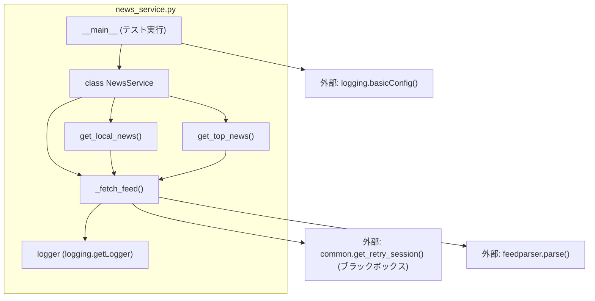

## 1. 解析メタ情報

| 項目 | 内容 |
| --- | --- |
| 対象ファイル | `news_service.py` |
| 言語 | Python |
| 解析対象 | 提供されたコードのみ |
| 推測・補完 | 一切なし |

## 2. ファイルの概要

Google NewsのRSSフィードを利用して、特定の地域（兵庫県伊丹市、奈良県）のローカルニュースおよび全国トップニュースを取得し、パース・整形した上でリスト形式として提供する機能を持つファイル。

## 3. 外部依存関係

### インポート一覧

| 名称 | 種類 | 用途 | 根拠 |
| --- | --- | --- | --- |
| `feedparser` | 外部ライブラリ | HTTP通信で得たRSSコンテンツのパース処理 | `import feedparser` (行番号: 1 / 抜粋: "import feedparser") |
| `logging` | 標準ライブラリ | ファイル内のエラーおよび警告のログ出力 | `import logging` (行番号: 2 / 抜粋: "import logging") |
| `requests` | 外部ライブラリ | インポートされているが、ファイル内で直接使用されていない | `import requests` (行番号: 3 / 抜粋: "import requests") |
| `common` | 内部/外部モジュール | リトライ機能付きのHTTPセッション取得 | `import common` (行番号: 4 / 抜粋: "import common") |

### ブラックボックスとなる外部要素

| 名称 | 理由 | 根拠 |
| --- | --- | --- |
| `common.get_retry_session()` | 提供されたソースコード内に実装が存在せず、セッションの具体的な仕様（リトライ回数・インターバルなど）が読み取れないため | `session = common.get_retry_session()` (行番号: 23 / 抜粋: "session = common.get_retry_ses...") |

## 4. 主要要素の定義（関数 / エンドポイント / コンポーネント）

### `NewsService` (クラス)

* **役割**: 各種RSSのURLやリクエストヘッダを定数として保持し、ニュースを取得する各種メソッドを提供する。
* 根拠: `class NewsService:` (行番号: 8 / 抜粋: "class NewsService:")


---

### `_fetch_feed`

* **役割**: `common`から取得したセッションを用いて指定されたURLへGETリクエストを送り、ステータスが200であれば`feedparser`でパースして返す。ステータスが200以外、または通信例外が発生した場合はログを出力して`None`を返す。
* 根拠: `def _fetch_feed(self, url):` 内の一連の処理 (行番号: 20〜32 / 抜粋: "def _fetch_feed(self, url):")


* **引数/リクエスト**: `url` (型アノテーションなし: URL文字列)
* 根拠: `def _fetch_feed(self, url):` (行番号: 20 / 抜粋: "def _fetch_feed(self, url):")


* **戻り値/レスポンス**: パース済みのフィードオブジェクト（型アノテーションなし） または `None`
* 根拠: `return feedparser.parse(res.content)` および `return None` (行番号: 26, 29, 32 / 抜粋: "return feedparser.parse(res.co...")


* **副作用**: `common.get_retry_session().get()` を経由した外部へのネットワーク通信。`logger` による標準出力等へのログ書き込み。
* 根拠: `res = session.get(...)` および `logger.warning(...)` (行番号: 24, 28, 31 / 抜粋: "res = session.get(url, headers...")


* **エラーハンドリング**: 汎用例外 `Exception` をキャッチし、`logger.error` で出力後に `None` を返す。
* 根拠: `except Exception as e:` (行番号: 30〜32 / 抜粋: "except Exception as e:")


### `get_local_news`

* **役割**: 兵庫県（伊丹市）と奈良県のRSSフィードからそれぞれ最大2件のニュースを取得し、タイトルに地域プレフィックス（`[伊丹/兵庫]`, `[奈良]`）を付与して結合後、指定された上限件数（デフォルト3）でスライスして返す。
* 根拠: `def get_local_news(self, limit=3) -> list:` (行番号: 34〜51 / 抜粋: "def get_local_news(self, limit...")


* **引数/リクエスト**: `limit` (int型推測, デフォルト値: 3)
* 根拠: `def get_local_news(self, limit=3) -> list:` (行番号: 34 / 抜粋: "def get_local_news(self, limit...")


* **戻り値/レスポンス**: `list` (要素は `{"title": 文字列, "link": 文字列}` の辞書)
* 根拠: `-> list:` および `return news_list[:limit]` (行番号: 34, 51 / 抜粋: "return news_list[:limit]")


* **副作用**: `self._fetch_feed` の呼び出しによる外部ネットワーク通信。
* 根拠: `feed_h = self._fetch_feed(self.RSS_HYOGO_ITAMI)` (行番号: 39, 45 / 抜粋: "feed_h = self._fetch_feed(self...")


* **エラーハンドリング**: 明示的な例外キャッチはないが、取得結果が `None` または要素が空の場合を `if feed_h and feed_h.entries:` 等の条件分岐で安全に回避している。
* 根拠: `if feed_h and feed_h.entries:` (行番号: 40, 46 / 抜粋: "if feed_h and feed_h.entries:")


### `get_top_news`

* **役割**: 全国トップニュースのRSSフィードを取得し、各記事の `title` と `link` を辞書化したリストを、指定された上限件数（デフォルト3）まで抽出して返す。
* 根拠: `def get_top_news(self, limit=3) -> list:` (行番号: 53〜58 / 抜粋: "def get_top_news(self, limit=3...")


* **引数/リクエスト**: `limit` (int型推測, デフォルト値: 3)
* 根拠: `def get_top_news(self, limit=3) -> list:` (行番号: 53 / 抜粋: "def get_top_news(self, limit=3...")


* **戻り値/レスポンス**: `list` (要素は `{"title": 文字列, "link": 文字列}` の辞書。フィード取得失敗時は空のリスト)
* 根拠: `-> list:` および `return [...]` (行番号: 53, 57, 58 / 抜粋: "return [{"title": e.title, "l...")


* **副作用**: `self._fetch_feed` の呼び出しによる外部ネットワーク通信。
* 根拠: `feed = self._fetch_feed(self.RSS_TOP)` (行番号: 55 / 抜粋: "feed = self._fetch_feed(self.R...")


* **エラーハンドリング**: 明示的な例外キャッチはないが、取得結果が不正な場合は空リストを返すフェイルセーフな分岐を持つ。
* 根拠: `if feed and feed.entries:` および `return []` (行番号: 56, 58 / 抜粋: "return []")


### `__main__` 実行ブロック

* **役割**: 本ファイルが直接実行された際、ログの出力レベルをINFOに設定し、`NewsService` をインスタンス化。ローカルニュースとトップニュースを取得し、コンソールにタイトルを標準出力する。
* 根拠: `if __name__ == "__main__":` 以下のブロック (行番号: 60〜73 / 抜粋: "if **name** == "**main**":")


* **引数/リクエスト**: 該当なし
* 根拠: 引数受け取り処理なし (行番号: 60〜73 / 抜粋: "if **name** == "**main**":")


* **戻り値/レスポンス**: 該当なし
* 根拠: 戻り値定義なし (行番号: 60〜73 / 抜粋: "if **name** == "**main**":")


* **副作用**: ログ設定の変更、外部ネットワーク通信、標準出力への文字出力。
* 根拠: `logging.basicConfig(level=logging.INFO)` および `print(...)` (行番号: 62, 65, 68, 70, 73 / 抜粋: "logging.basicConfig(level=logg...")


* **エラーハンドリング**: なし
* 根拠: 例外処理なし (行番号: 60〜73 / 抜粋: "if **name** == "**main**":")


## 5. 処理フロー図

以下のフロー図は、本ファイル内で最もロジックが複雑な `get_local_news` の処理フローを示します。

```mermaid
flowchart TD
    Start([Start: get_local_news]) --> InitList[news_list = 空のリストを作成]
    InitList --> FetchHyogo{外部: _fetch_feed HYOGO_ITAMI}
    
    FetchHyogo -->|フィード取得成功 かつ entriesが存在| LoopHyogo[先頭最大2件を処理]
    LoopHyogo --> FormatHyogo[タイトルに '[伊丹/兵庫]' を付与し news_list に追加]
    FormatHyogo --> FetchNara
    
    FetchHyogo -->|フィード取得失敗 または entriesなし| FetchNara{外部: _fetch_feed NARA}
    
    FetchNara -->|フィード取得成功 かつ entriesが存在| LoopNara[先頭最大2件を処理]
    LoopNara --> FormatNara[タイトルに '[奈良]' を付与し news_list に追加]
    FormatNara --> SliceList
    
    FetchNara -->|フィード取得失敗 または entriesなし| SliceList[news_list を limit 件数でスライス]
    
    SliceList --> End([End: 結合したリストを返却])

```

## 6. 依存関係図



## 7. 次のステップ（リバースエンジニアリングの提案）

| 優先度 | ファイル名(推測可) | 理由 | 根拠 |
| --- | --- | --- | --- |
| 高 | `common.py` | `get_retry_session()`の実装内容を特定するため。リトライ回数、バックオフ制御の有無、タイムアウトのデフォルト挙動などが不明なままだと、ネットワーク障害時のシステム全体の影響範囲が把握できないため。 | `session = common.get_retry_session()` (行番号: 23 / 抜粋: "session = common.get_retry_ses...") |

## 8. 保守上の注意点

* `_fetch_feed` にて `Exception` という極めて広いスコープで例外を捕捉して `None` を返しているため、ネットワークエラーだけでなく、タイポ等の構文起因のエラー（`AttributeError` 等）が発生した際も握りつぶされ、バグの発見が遅れる可能性がある。
* `requests` モジュールがインポートされているが、ファイル内では一度も利用されていない（未使用インポート）。
* `_fetch_feed` 内部の `session.get` 呼び出しで `timeout=10` がハードコードされている。
* `get_local_news` は兵庫・奈良でそれぞれ上限を `[:2]` と固定スライスしているため、引数 `limit` に `5` 以上を指定しても最大4件しか返却されない仕様となっている。

## 9. 不明事項一覧

| 項目 | 理由 | 必要なファイル |
| --- | --- | --- |
| セッションの具体的な振る舞い | `common.get_retry_session()` の戻り値が持つ実装（リトライのトリガーとなるHTTPステータスコード、リトライ間隔など）が現在のファイル内には存在しないため。 | `common.py` |
| レスポンスオブジェクトの構造 | `feedparser.parse` が返すオブジェクトの正確なプロパティ定義が不明なため（`e.title` や `e.link` の存在は推測できるが、欠損時の挙動が不明）。 | 対象外部ライブラリのドキュメント |

## 10. 自己検証結果

* [x] 完了: 推測・外部ファイルの仕様を一切含んでいない
* [x] 完了: 全関数・全クラス・全コンポーネントを列挙した
* [x] 完了: 全てのインポート要素を列挙した
* [x] 完了: すべての仕様説明に「根拠（行番号・抜粋）」を明記した
* [x] 完了: 根拠漏れが0件である
* [x] 完了: Mermaid構文にエラーの原因となる記号（エスケープ漏れ）がない
* [x] 完了: 不明事項を漏れなく列挙した