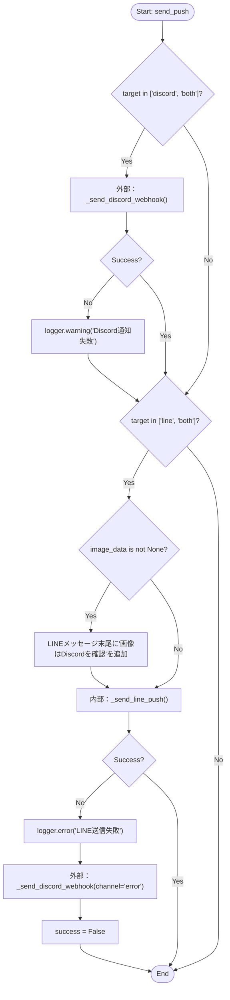
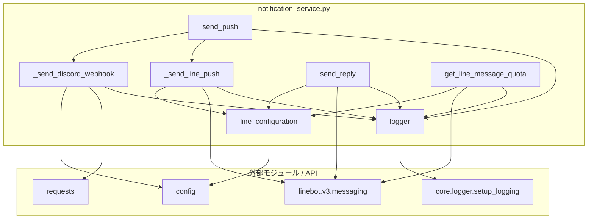

## 1. 解析メタ情報

| 項目 | 内容 |
| --- | --- |
| 対象ファイル | `notification_service.py` |
| 言語 | Python |
| 解析対象 | 提供されたコードのみ |
| 推測・補完 | 一切なし |

## 2. ファイルの概要

DiscordおよびLINEプラットフォームへのメッセージ（テキスト・画像）通知を行うためのサービスモジュール。WebhookやPush API/Reply APIを利用し、指定されたプラットフォームへメッセージを送信する責務を持つ。LINE送信失敗時にDiscordへフォールバックする統合通知機能も備えている。

## 3. 外部依存関係

### インポート一覧

| 名称 | 種類 | 用途 | 根拠 |
| --- | --- | --- | --- |
| `json` | 標準 | 未使用 | 根拠: [インポート宣言] (行番号: 2 / 抜粋: "import json") |
| `logging` | 標準 | 未使用 | 根拠: [インポート宣言] (行番号: 3 / 抜粋: "import logging") |
| `requests` | 外部 | HTTPリクエスト送信 | 根拠: [インポート宣言] (行番号: 4 / 抜粋: "import requests") |
| `typing` | 標準 | 型ヒントの提供 | 根拠: [インポート宣言] (行番号: 5 / 抜粋: "from typing import List...") |
| `linebot.v3.messaging` | 外部 | LINE API v3のクライアント | 根拠: [インポート宣言] (行番号: 8〜18 / 抜粋: "from linebot.v3.messaging...") |
| `config` | 外部 | 設定値（トークンやURL）の取得 | 根拠: [インポート宣言] (行番号: 20 / 抜粋: "import config") |
| `core.logger` | 外部 | ロガーのセットアップ | 根拠: [インポート宣言] (行番号: 21 / 抜粋: "from core.logger import setup_logging") |

### ブラックボックスとなる外部要素

| 名称 | 理由 | 根拠 |
| --- | --- | --- |
| `config`の各変数 | トークン(`LINE_CHANNEL_ACCESS_TOKEN`)やURL(`DISCORD_WEBHOOK_ERROR`等)の具体的な値が不明。 | 根拠: [変数参照] (行番号: 27, 33等 / 抜粋: "config.LINE_CHANNEL_ACCESS_TOKEN") |
| `setup_logging`関数 | ロガーの具体的な設定（出力先、ログレベル、フォーマット）が不明。 | 根拠: [関数呼び出し] (行番号: 23 / 抜粋: "logger = setup_logging(...)") |

## 4. 主要要素の定義（関数 / エンドポイント / コンポーネント）

### `logger`

* **役割**: "service.notification" という名前でロガーを初期化し保持する。
* 根拠: [変数宣言] (行番号: 23 / 抜粋: 'logger = setup_logging("service.notification")')

* **引数/リクエスト**: 該当なし
* 根拠: [変数宣言] (行番号: 23 / 抜粋: 'logger = setup_logging("service.notification")')

* **戻り値/レスポンス**: 該当なし
* 根拠: [変数宣言] (行番号: 23 / 抜粋: 'logger = setup_logging("service.notification")')

* **副作用**: なし
* 根拠: [変数宣言] (行番号: 23 / 抜粋: 'logger = setup_logging("service.notification")')

* **エラーハンドリング**: なし
* 根拠: [変数宣言] (行番号: 23 / 抜粋: 'logger = setup_logging("service.notification")')

### `line_configuration`

* **役割**: `config`から読み込んだアクセストークンを用いてLINE APIの設定オブジェクトを初期化し保持する。
* 根拠: [変数宣言] (行番号: 26〜28 / 抜粋: "line_configuration = Configuration(...)")

* **引数/リクエスト**: 該当なし
* 根拠: [変数宣言] (行番号: 26〜28 / 抜粋: "line_configuration = Configuration(...)")

* **戻り値/レスポンス**: 該当なし
* 根拠: [変数宣言] (行番号: 26〜28 / 抜粋: "line_configuration = Configuration(...)")

* **副作用**: なし
* 根拠: [変数宣言] (行番号: 26〜28 / 抜粋: "line_configuration = Configuration(...)")

* **エラーハンドリング**: なし
* 根拠: [変数宣言] (行番号: 26〜28 / 抜粋: "line_configuration = Configuration(...)")

### `_send_discord_webhook`

* **役割**: Discordの指定チャンネル(error, report, notify)に対応するWebhook URLへテキストおよび画像データを含めたメッセージを送信する。
* 根拠: [関数定義] (行番号: 30〜65 / 抜粋: "def _send_discord_webhook(...)")

* **引数/リクエスト**: `messages: List[Any]`, `image_data: Optional[bytes] = None`, `channel: str = "notify"`
* 根拠: [関数定義] (行番号: 30 / 抜粋: "def _send_discord_webhook(messages...")

* **戻り値/レスポンス**: `bool` (HTTPステータスコードが200または204の場合にTrue)
* 根拠: [戻り値] (行番号: 62 / 抜粋: "return res.status_code in [200, 204]")

* **副作用**: 外部のDiscord Webhook URLへのHTTP POSTリクエストの実行。
* 根拠: [外部通信] (行番号: 58, 60 / 抜粋: "res = requests.post(url...")

* **エラーハンドリング**: リクエスト時に例外が発生した場合、エラーログを出力してFalseを返す。URLが設定されていない場合は早期リターンでFalseを返す。
* 根拠: [例外処理] (行番号: 63〜65 / 抜粋: "except Exception as e: ... return False")

### `_send_line_push`

* **役割**: LINE Messaging API (v3) を利用し、指定ユーザーIDに対してプッシュメッセージを送信する。辞書型で渡されたメッセージをv3用オブジェクト(`TextMessage`等)に変換する互換性維持処理を含む。
* 根拠: [関数定義] (行番号: 67〜108 / 抜粋: "def _send_line_push(user_id: str...")

* **引数/リクエスト**: `user_id: str`, `messages: List[Any]`
* 根拠: [関数定義] (行番号: 67 / 抜粋: "def _send_line_push(user_id: str...")

* **戻り値/レスポンス**: `bool` (送信成功時にTrue)
* 根拠: [戻り値] (行番号: 104, 108 / 抜粋: "return True ... return False")

* **副作用**: LINE APIへのHTTP POSTリクエスト実行。
* 根拠: [外部通信] (行番号: 98〜103 / 抜粋: "line_bot_api.push_message(...)")

* **エラーハンドリング**: 送信対象のメッセージがない場合は警告ログを出力しFalse。送信処理中に例外が発生した場合はエラーログを出力しFalseを返す。
* 根拠: [例外処理] (行番号: 106〜108 / 抜粋: "except Exception as e: ... return False")

### `send_push`

* **役割**: 指定されたターゲット(discord, line, both)に応じてメッセージを各プラットフォームへ統合送信する。LINEに画像は送信せず注記を付与し、LINEの送信に失敗した場合はDiscordのerrorチャンネルへフォールバック通知を行う。
* 根拠: [関数定義] (行番号: 110〜132 / 抜粋: "def send_push(user_id: str...")

* **引数/リクエスト**: `user_id: str`, `messages: List[Any]`, `image_data: Optional[bytes] = None`, `target: str = "both"`, `channel: str = "notify"`
* 根拠: [関数定義] (行番号: 110 / 抜粋: "def send_push(user_id: str...")

* **戻り値/レスポンス**: `bool`
* 根拠: [戻り値] (行番号: 132 / 抜粋: "return success")

* **副作用**: `_send_discord_webhook` および `_send_line_push` の呼び出し。
* 根拠: [関数呼び出し] (行番号: 115, 126 / 抜粋: "_send_discord_webhook(...)")

* **エラーハンドリング**: 各送信関数の戻り値を確認し、失敗時はログ出力を行い `success` フラグをFalseにする。LINE失敗時はDiscordへフォールバック送信を実行する。
* 根拠: [条件分岐] (行番号: 127〜130 / 抜粋: "logger.error('LINE送信失敗...')")

### `send_reply`

* **役割**: LINE Messaging API (v3) を利用し、受け取ったリプライトークンに対して返信メッセージを送信する。
* 根拠: [関数定義] (行番号: 134〜155 / 抜粋: "def send_reply(reply_token: str...")

* **引数/リクエスト**: `reply_token: str`, `messages: List[Any]`
* 根拠: [関数定義] (行番号: 134 / 抜粋: "def send_reply(reply_token: str...")

* **戻り値/レスポンス**: `bool`
* 根拠: [戻り値] (行番号: 151, 155 / 抜粋: "return True ... return False")

* **副作用**: LINE APIへのHTTP POSTリクエスト実行。
* 根拠: [外部通信] (行番号: 145〜150 / 抜粋: "line_bot_api.reply_message(...)")

* **エラーハンドリング**: 例外発生時にエラーログを出力しFalseを返す。
* 根拠: [例外処理] (行番号: 153〜155 / 抜粋: "except Exception as e: ... return False")

### `get_line_message_quota`

* **役割**: LINE Messaging API (v3) を利用し、LINEの当月のメッセージ送信可能枠を取得する。
* 根拠: [関数定義] (行番号: 157〜165 / 抜粋: "def get_line_message_quota() ->...")

* **引数/リクエスト**: なし
* 根拠: [関数定義] (行番号: 157 / 抜粋: "def get_line_message_quota() ->...")

* **戻り値/レスポンス**: `Optional[Any]`
* 根拠: [戻り値] (行番号: 162, 165 / 抜粋: "return line_bot_api.get_message_quota()")

* **副作用**: LINE APIへのHTTP GETリクエスト実行。
* 根拠: [外部通信] (行番号: 162 / 抜粋: "return line_bot_api.get_message_quota()")

* **エラーハンドリング**: 例外発生時にエラーログを出力しNoneを返す。
* 根拠: [例外処理] (行番号: 163〜165 / 抜粋: "except Exception as e: ... return None")

## 5. 処理フロー図

以下は主要な統合関数である `send_push` のフローチャートです。

## 6. 依存関係図

## 7. 次のステップ（リバースエンジニアリングの提案）

| 優先度 | ファイル名(推測可) | 理由 | 根拠 |
| --- | --- | --- | --- |
| 高 | `config.py` | 使用されている各種Webhook URLやLINEアクセストークンなどの設定値の全体像を把握するため。 | 根拠: `config`からの変数読み込み (行番号: 20, 27, 33等) |
| 中 | `core/logger.py` | システム全体のログフォーマットや出力先（ファイル出力の有無など）の仕様を確認するため。 | 根拠: `setup_logging`のインポート (行番号: 21) |
| 中 | このモジュールを呼び出す各種サービス/コントローラー | `send_push`や`send_reply`に渡される`messages`オブジェクトの実体（v3 SDKオブジェクトなのか辞書型なのか）を特定するため。 | 根拠: 呼び出し元でオブジェクト化を推奨するコメント (行番号: 87) |

## 8. 保守上の注意点

* `json` および `logging` がインポートされているが使用されていない。
* `_send_line_push` 内で、`type` が `"flex"` の辞書型メッセージの変換処理が `pass` となっており未実装である（呼び出し元でのオブジェクト化を前提としている）。
* `_send_discord_webhook` ではリクエストに `timeout=10` がハードコードされている。
* `send_push` 関数において、LINE送信失敗時にDiscordへのフォールバック通知を同期的に行っているため、レスポンスタイムが遅延する可能性がある。
* LINEの設定 (`line_configuration`) はグローバル変数として保持されており、`config.LINE_CHANNEL_ACCESS_TOKEN` が無い場合は `None` のままとなる。

## 9. 不明事項一覧

| 項目 | 理由 | 必要なファイル |
| --- | --- | --- |
| 環境変数・定数群の定義 | `LINE_CHANNEL_ACCESS_TOKEN`, `DISCORD_WEBHOOK_ERROR`, `DISCORD_WEBHOOK_REPORT`, `DISCORD_WEBHOOK_NOTIFY`, `DISCORD_WEBHOOK_URL` の実際の値や取得元が不明。 | `config.py` または `.env` ファイル等 |
| ロガーの実装詳細 | `setup_logging` 関数がどのような設定（コンソール出力、ファイル出力など）を行っているか不明。 | `core/logger.py` |

## 10. 自己検証結果

* [x] 完了: 推測・外部ファイルの仕様を一切含んでいない
* [x] 完了: 全関数・全クラス・全コンポーネントを列挙した
* [x] 完了: 全てのインポート要素を列挙した
* [x] 完了: すべての仕様説明に「根拠（行番号・抜粋）」を明記した
* [x] 完了: 根拠漏れが0件である
* [x] 完了: Mermaid構文にエラーの原因となる記号（エスケープ漏れ）がない
* [x] 完了: 不明事項を漏れなく列挙した