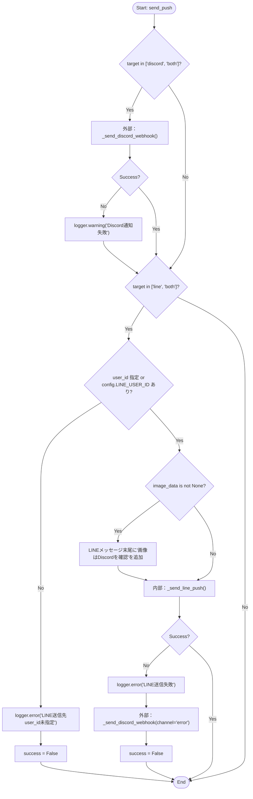
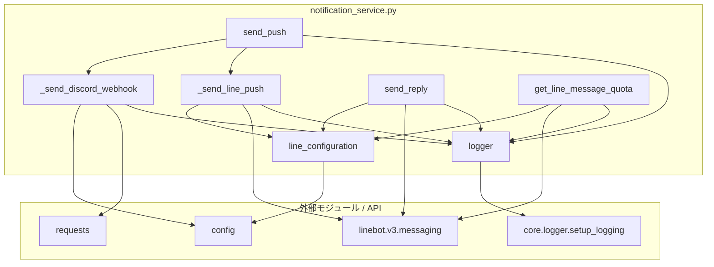

## 1. 解析メタ情報

| 項目 | 内容 |
| --- | --- |
| 対象ファイル | `notification_service.py` |
| 言語 | Python |
| 解析対象 | 提供されたコードのみ |
| 推測・補完 | 一切なし |

## 関連ドキュメント

* [config.md](./config.md) - `LINE_CHANNEL_ACCESS_TOKEN`, `DISCORD_WEBHOOK_*`等の設定値を提供
* [logger.md](./logger.md) - `setup_logging`の実体
* [common.md](./common.md) - `send_push`, `send_reply`等を再エクスポートするFacade
* 呼び出し元多数: [memory_monitor.md](./memory_monitor.md), [nas_monitor.md](./nas_monitor.md), [nas_utils.md](./nas_utils.md), [sensor_service.md](./sensor_service.md), [post_boot_health_check.md](./post_boot_health_check.md), [quest_service.md](./quest_service.md)(`InventoryService.use_item`経由)

## 2. ファイルの概要

DiscordおよびLINEプラットフォームへのメッセージ（テキスト・画像）通知を行うためのサービスモジュール。WebhookやPush API/Reply APIを利用し、指定されたプラットフォームへメッセージを送信する責務を持つ。LINE送信失敗時にDiscordへフォールバックする統合通知機能も備えている。

## 3. 外部依存関係

### インポート一覧

| 名称 | 種類 | 用途 | 根拠 |
| --- | --- | --- | --- |
| `json` | 標準 | 未使用 | 根拠: [インポート宣言] (行番号: 2 / 抜粋: "import json") |
| `logging` | 標準 | 未使用 | 根拠: [インポート宣言] (行番号: 3 / 抜粋: "import logging") |
| `requests` | 外部 | HTTPリクエスト送信 | 根拠: [インポート宣言] (行番号: 4 / 抜粋: "import requests") |
| `typing` | 標準 | 型ヒントの提供 | 根拠: [インポート宣言] (行番号: 5 / 抜粋: "from typing import List...") |
| `linebot.v3.messaging` | 外部 | LINE API v3のクライアント | 根拠: [インポート宣言] (行番号: 8〜18 / 抜粋: "from linebot.v3.messaging...") |
| `config` | 外部 | 設定値（トークンやURL）の取得 | 根拠: [インポート宣言] (行番号: 20 / 抜粋: "import config") |
| `core.logger` | 外部 | ロガーのセットアップ | 根拠: [インポート宣言] (行番号: 21 / 抜粋: "from core.logger import setup_logging") |

### ブラックボックスとなる外部要素

| 名称 | 理由 | 根拠 |
| --- | --- | --- |
| `config`の各変数 | トークン(`LINE_CHANNEL_ACCESS_TOKEN`)やURL(`DISCORD_WEBHOOK_ERROR`等)の具体的な値が不明。 | 根拠: [変数参照] (行番号: 27, 33等 / 抜粋: "config.LINE_CHANNEL_ACCESS_TOKEN") |
| `setup_logging`関数 | ロガーの具体的な設定（出力先、ログレベル、フォーマット）が不明。 | 根拠: [関数呼び出し] (行番号: 23 / 抜粋: "logger = setup_logging(...)") |

## 4. 主要要素の定義（関数 / エンドポイント / コンポーネント）

### `logger`

* **役割**: "service.notification" という名前でロガーを初期化し保持する。
* 根拠: [変数宣言] (行番号: 23 / 抜粋: 'logger = setup_logging("service.notification")')

* **引数/リクエスト**: 該当なし
* 根拠: [変数宣言] (行番号: 23 / 抜粋: 'logger = setup_logging("service.notification")')

* **戻り値/レスポンス**: 該当なし
* 根拠: [変数宣言] (行番号: 23 / 抜粋: 'logger = setup_logging("service.notification")')

* **副作用**: なし
* 根拠: [変数宣言] (行番号: 23 / 抜粋: 'logger = setup_logging("service.notification")')

* **エラーハンドリング**: なし
* 根拠: [変数宣言] (行番号: 23 / 抜粋: 'logger = setup_logging("service.notification")')

### `line_configuration`

* **役割**: `config`から読み込んだアクセストークンを用いてLINE APIの設定オブジェクトを初期化し保持する。
* 根拠: [変数宣言] (行番号: 26〜28 / 抜粋: "line_configuration = Configuration(...)")

* **引数/リクエスト**: 該当なし
* 根拠: [変数宣言] (行番号: 26〜28 / 抜粋: "line_configuration = Configuration(...)")

* **戻り値/レスポンス**: 該当なし
* 根拠: [変数宣言] (行番号: 26〜28 / 抜粋: "line_configuration = Configuration(...)")

* **副作用**: なし
* 根拠: [変数宣言] (行番号: 26〜28 / 抜粋: "line_configuration = Configuration(...)")

* **エラーハンドリング**: なし
* 根拠: [変数宣言] (行番号: 26〜28 / 抜粋: "line_configuration = Configuration(...)")

### `_send_discord_webhook`

* **役割**: Discordの指定チャンネル(error, report, notify)に対応するWebhook URLへテキストおよび画像データを含めたメッセージを送信する。画像添付時はファイル名を指定してアップロードする。
* 根拠: [関数定義] (行番号: 30〜71 / 抜粋: "def _send_discord_webhook(...)")

* **引数/リクエスト**: `messages: List[Any]`, `image_data: Optional[bytes] = None`, `channel: str = "notify"`, `filename: str = "snapshot.jpg"`
* 根拠: [関数定義] (行番号: 30 / 抜粋: "def _send_discord_webhook(messages: List[Any], image_data: Optional[bytes] = None, channel: str = "notify", filename: str = "snapshot.jpg") -> bool:")

* **戻り値/レスポンス**: `bool` (HTTPステータスコードが200または204の場合にTrue、それ以外はFalse)
* 根拠: [戻り値] (行番号: 64, 66, 68 / 抜粋: "if res.status_code not in [200, 204]:", "return False", "return True")

* **副作用**: 外部のDiscord Webhook URLへのHTTP POSTリクエストの実行（画像添付時は`files`パラメータで`filename`を指定してアップロード、タイムアウト60秒。テキストのみの場合はJSON送信、タイムアウト10秒）。
* 根拠: [外部通信] (行番号: 58〜59, 61 / 抜粋: "files = {'file': (filename, image_data)}", "res = requests.post(url, files=files...")

* **エラーハンドリング**: HTTPステータスコードが200/204以外の場合、レスポンス内容を含めたエラーログを出力してFalseを返す。リクエスト時に例外が発生した場合も、エラーログを出力してFalseを返す。URLが設定されていない場合は早期リターンでFalseを返す。
* 根拠: [ステータスコード判定] (行番号: 64〜66 / 抜粋: "logger.error(f"Discord API エラー: {res.status_code} - {res.text}")")、[例外処理] (行番号: 69〜71 / 抜粋: "except Exception as e: ... return False")

### `_send_line_push`

* **役割**: LINE Messaging API (v3) を利用し、指定ユーザーIDに対してプッシュメッセージを送信する。辞書型で渡されたメッセージをv3用オブジェクト(`TextMessage`等)に変換する互換性維持処理を含む。
* 根拠: [関数定義] (行番号: 73〜114 / 抜粋: "def _send_line_push(user_id: str...")

* **引数/リクエスト**: `user_id: str`, `messages: List[Any]`
* 根拠: [関数定義] (行番号: 73 / 抜粋: "def _send_line_push(user_id: str...")

* **戻り値/レスポンス**: `bool` (送信成功時にTrue)
* 根拠: [戻り値] (行番号: 110, 114 / 抜粋: "return True ... return False")

* **副作用**: LINE APIへのHTTP POSTリクエスト実行。
* 根拠: [外部通信] (行番号: 102〜109 / 抜粋: "line_bot_api.push_message(...)")

* **エラーハンドリング**: 送信対象のメッセージがない場合は警告ログを出力しFalse。送信処理中に例外が発生した場合はエラーログを出力しFalseを返す。
* 根拠: [例外処理] (行番号: 97〜99, 112〜114 / 抜粋: "except Exception as e: ... return False")

### `send_push`

* **役割**: 指定されたターゲット(discord, line, both)に応じてメッセージを各プラットフォームへ統合送信する。LINEに画像は送信せず注記を付与し、LINEの送信に失敗した場合はDiscordのerrorチャンネルへフォールバック通知を行う。`filename`はDiscord送信時にそのまま`_send_discord_webhook`へ引き継がれる。Issue #289で、LINE宛先(`user_id`)の解決をこの関数に一元化するようシグネチャを再設計した: `messages`のみが位置引数として渡せ、それ以外はすべてキーワード専用(`*`以降)。`user_id`は target に "line"/"both" を含む場合のみ使われ、省略時は`config.LINE_USER_ID`にフォールバックする。`target="discord"`のみの呼び出しでは`user_id`は一切不要になった。
* 根拠: [関数定義] (行番号: 116〜163 / 抜粋: "def send_push(\n    messages: List[Any],\n    *,\n    target: str = \"both\",\n    channel: str = \"notify\",\n    user_id: Optional[str] = None,\n    image_data: Optional[bytes] = None,\n    filename: str = \"snapshot.jpg\",\n) -> bool:")

* **引数/リクエスト**: `messages: List[Any]`（唯一の位置引数）、以降キーワード専用で `target: str = "both"`, `channel: str = "notify"`, `user_id: Optional[str] = None`, `image_data: Optional[bytes] = None`, `filename: str = "snapshot.jpg"`
* 根拠: [関数定義] (行番号: 116〜124 / 抜粋: "def send_push(\n    messages: List[Any],\n    *,\n    target: str = \"both\",\n    channel: str = \"notify\",\n    user_id: Optional[str] = None,\n    image_data: Optional[bytes] = None,\n    filename: str = \"snapshot.jpg\",\n) -> bool:")

* **戻り値/レスポンス**: `bool`
* 根拠: [戻り値] (行番号: 163 / 抜粋: "return success")

* **副作用**: `_send_discord_webhook`（通常送信時および失敗時のフォールバック送信の計2箇所）および `_send_line_push` の呼び出し。
* 根拠: [関数呼び出し] (行番号: 140, 156, 160 / 抜粋: "_send_discord_webhook(...)")

* **エラーハンドリング**: 各送信関数の戻り値を確認し、失敗時はログ出力を行い `success` フラグをFalseにする。LINE送信が必要な場合に`user_id`も`config.LINE_USER_ID`も解決できなければエラーログを出力して`success`をFalseにする(LINE送信自体は試みない)。LINE失敗時はDiscordへフォールバック送信を実行する。
* 根拠: [条件分岐] (行番号: 146〜161 / 抜粋: "resolved_user_id = user_id or getattr(config, \"LINE_USER_ID\", None)\n        if not resolved_user_id:\n            logger.error(...)")

### `send_reply`

* **役割**: LINE Messaging API (v3) を利用し、受け取ったリプライトークンに対して返信メッセージを送信する。
* 根拠: [関数定義] (行番号: 142〜165 / 抜粋: "def send_reply(reply_token: str...")

* **引数/リクエスト**: `reply_token: str`, `messages: List[Any]`
* 根拠: [関数定義] (行番号: 142 / 抜粋: "def send_reply(reply_token: str...")

* **戻り値/レスポンス**: `bool`
* 根拠: [戻り値] (行番号: 162, 165 / 抜粋: "return True ... return False")

* **副作用**: LINE APIへのHTTP POSTリクエスト実行。
* 根拠: [外部通信] (行番号: 154〜161 / 抜粋: "line_bot_api.reply_message(...)")

* **エラーハンドリング**: 例外発生時にエラーログを出力しFalseを返す。
* 根拠: [例外処理] (行番号: 163〜165 / 抜粋: "except Exception as e: ... return False")

### `get_line_message_quota`

* **役割**: LINE Messaging API (v3) を利用し、LINEの当月のメッセージ送信可能枠を取得する。
* 根拠: [関数定義] (行番号: 167〜176 / 抜粋: "def get_line_message_quota() ->...")

* **引数/リクエスト**: なし
* 根拠: [関数定義] (行番号: 167 / 抜粋: "def get_line_message_quota() ->...")

* **戻り値/レスポンス**: `Optional[Any]`
* 根拠: [戻り値] (行番号: 173, 176 / 抜粋: "return line_bot_api.get_message_quota()")

* **副作用**: LINE APIへのHTTP GETリクエスト実行。
* 根拠: [外部通信] (行番号: 173 / 抜粋: "return line_bot_api.get_message_quota()")

* **エラーハンドリング**: 例外発生時にエラーログを出力しNoneを返す。
* 根拠: [例外処理] (行番号: 174〜176 / 抜粋: "except Exception as e: ... return None")

## 5. 処理フロー図

以下は主要な統合関数である `send_push` のフローチャートです。

```mermaid
flowchart TD
    Start([Start: send_push]) --> TargetCheckDiscord{"target in ['discord', 'both']?"}
    
    TargetCheckDiscord -- Yes --> DiscordSend["外部：_send_discord_webhook()"]
    DiscordSend --> DiscordSuccessCheck{"Success?"}
    DiscordSuccessCheck -- No --> DiscordLogWarning["logger.warning('Discord通知失敗')"]
    DiscordLogWarning --> TargetCheckLine
    DiscordSuccessCheck -- Yes --> TargetCheckLine
    
    TargetCheckDiscord -- No --> TargetCheckLine{"target in ['line', 'both']?"}
    
    TargetCheckLine -- Yes --> ResolveUserId{"user_id 指定 or<br/>config.LINE_USER_ID あり?"}
    ResolveUserId -- No --> LogNoUserId["logger.error('LINE送信先user_id未指定')"]
    LogNoUserId --> SetSuccessFalseNoUserId["success = False"]
    SetSuccessFalseNoUserId --> End([End])

    ResolveUserId -- Yes --> ImageDataCheck{"image_data is not None?"}
    ImageDataCheck -- Yes --> AddNote["LINEメッセージ末尾に'画像はDiscordを確認'を追加"]
    AddNote --> LineSend["内部：_send_line_push()"]
    ImageDataCheck -- No --> LineSend
    
    LineSend --> LineSuccessCheck{"Success?"}
    LineSuccessCheck -- No --> LineLogError["logger.error('LINE送信失敗')"]
    LineLogError --> FallbackSend["外部：_send_discord_webhook(channel='error')"]
    FallbackSend --> SetSuccessFalse["success = False"]
    SetSuccessFalse --> End
    LineSuccessCheck -- Yes --> End
    
    TargetCheckLine -- No --> End

```

## 6. 依存関係図

```mermaid
graph TD
    subgraph "notification_service.py"
        logger
        line_configuration
        _send_discord_webhook
        _send_line_push
        send_push
        send_reply
        get_line_message_quota
    end
    
    subgraph "外部モジュール / API"
        config
        setup_logging["core.logger.setup_logging"]
        requests
        linebot_api["linebot.v3.messaging"]
    end
    
    logger --> setup_logging
    line_configuration --> config
    
    _send_discord_webhook --> config
    _send_discord_webhook --> requests
    _send_discord_webhook --> logger
    
    _send_line_push --> line_configuration
    _send_line_push --> linebot_api
    _send_line_push --> logger
    
    send_push --> _send_discord_webhook
    send_push --> _send_line_push
    send_push --> logger
    
    send_reply --> line_configuration
    send_reply --> linebot_api
    send_reply --> logger
    
    get_line_message_quota --> line_configuration
    get_line_message_quota --> linebot_api
    get_line_message_quota --> logger

```

## 7. 次のステップ（リバースエンジニアリングの提案）

| 優先度 | ファイル名(推測可) | 理由 | 根拠 |
| --- | --- | --- | --- |
| 高 | `config.py` | 使用されている各種Webhook URLやLINEアクセストークンなどの設定値の全体像を把握するため。 | 根拠: `config`からの変数読み込み (行番号: 20, 27, 33等) |
| 中 | `core/logger.py` | システム全体のログフォーマットや出力先（ファイル出力の有無など）の仕様を確認するため。 | 根拠: `setup_logging`のインポート (行番号: 21) |
| 中 | このモジュールを呼び出す各種サービス/コントローラー | `send_push`や`send_reply`に渡される`messages`オブジェクトの実体（v3 SDKオブジェクトなのか辞書型なのか）を特定するため。 | 根拠: 呼び出し元でオブジェクト化を推奨するコメント (行番号: 92〜93) |

## 8. 保守上の注意点

* `json` および `logging` がインポートされているが使用されていない。
* `_send_line_push` 内で、`type` が `"flex"` の辞書型メッセージの変換処理が `pass` となっており未実装である（呼び出し元でのオブジェクト化を前提としている）。
* `_send_discord_webhook` のタイムアウトは送信内容によって異なる（画像添付時: `timeout=60`、テキストのみ: `timeout=10`）。いずれもハードコードされている。
* `_send_discord_webhook` はHTTPステータスコードが200/204以外の場合、`res.text`を含めたエラー内容をログに出力してからFalseを返す（Discord API側のエラー原因特定を目的とした挙動）。
* `send_push`および`_send_discord_webhook`には`filename`引数（デフォルト`"snapshot.jpg"`）があり、画像添付時のアップロードファイル名を呼び出し元から指定できる。MIMEタイプは明示せず、Discord側の拡張子判定に委ねている。
* `send_push` 関数において、LINE送信失敗時にDiscordへのフォールバック通知を同期的に行っているため、レスポンスタイムが遅延する可能性がある。
* LINEの設定 (`line_configuration`) はグローバル変数として保持されており、`config.LINE_CHANNEL_ACCESS_TOKEN` が無い場合は `None` のままとなる。

## 9. 不明事項一覧

| 項目 | 理由 | 必要なファイル |
| --- | --- | --- |
| 環境変数・定数群の定義 | `LINE_CHANNEL_ACCESS_TOKEN`, `DISCORD_WEBHOOK_ERROR`, `DISCORD_WEBHOOK_REPORT`, `DISCORD_WEBHOOK_NOTIFY`, `DISCORD_WEBHOOK_URL` の実際の値や取得元が不明。 | `config.py` または `.env` ファイル等 |
| ロガーの実装詳細 | `setup_logging` 関数がどのような設定（コンソール出力、ファイル出力など）を行っているか不明。 | `core/logger.py` |

## 相互参照による補足情報

| 元の不明事項 | 判明した内容 | 参照元ドキュメント |
| --- | --- | --- |
| ロガーの実装詳細 | `MY_HOME_SYSTEM/core/logger.py`の`setup_logging(name, webhook_url=None)`(46〜86行目)を直接確認した。(1)コンソール出力用の`logging.StreamHandler`(58〜60行目)、(2)`config.BASE_DIR/logs/home_system.log`への`TimedRotatingFileHandler(when='midnight', interval=1, backupCount=7)`(63〜74行目)、(3)`webhook_url`引数または`config.DISCORD_WEBHOOK_ERROR`が設定されていればERRORレベル以上を対象とする`DiscordErrorHandler`(76〜84行目、メッセージに`"Discord"`を含む場合はスキップ)、の3種のハンドラを登録する設計であることを確認した。 | 直接ソース確認: `MY_HOME_SYSTEM/core/logger.py:46-86` |
| 環境変数・定数群の定義 | `MY_HOME_SYSTEM/config.py`を直接確認した。139行目で`load_dotenv()`により`.env`ファイルから環境変数を読み込み、183行目で`LINE_CHANNEL_ACCESS_TOKEN = os.getenv("LINE_CHANNEL_ACCESS_TOKEN")`、194〜198行目で`DISCORD_WEBHOOK_ERROR = os.getenv("DISCORD_WEBHOOK_ERROR")`、`DISCORD_WEBHOOK_ERROR_CAM = os.getenv("DISCORD_WEBHOOK_ERROR_CAM")`、`DISCORD_WEBHOOK_REPORT = os.getenv("DISCORD_WEBHOOK_REPORT")`、`DISCORD_WEBHOOK_NOTIFY = os.getenv("DISCORD_WEBHOOK_NOTIFY")`、`DISCORD_WEBHOOK_URL = DISCORD_WEBHOOK_NOTIFY or os.getenv("DISCORD_WEBHOOK_URL")`とそれぞれ定義されていることを確認した。ただし実際の`.env`ファイルはリポジトリ内に存在せず(`.gitignore`13行目の`.env`規則により追跡対象外)、`MY_HOME_SYSTEM/.env.example`（プレースホルダのみ）にもこれらのキーは含まれていないため、各値そのものは確認できなかった。 | 直接ソース確認: `MY_HOME_SYSTEM/config.py:139, 183, 194-198`（`.env`は`.gitignore:13`により追跡対象外、`.env.example`にも当該キーの記載なし） |

## 10. 自己検証結果

* [x] 完了: 推測・外部ファイルの仕様を一切含んでいない
* [x] 完了: 全関数・全クラス・全コンポーネントを列挙した
* [x] 完了: 全てのインポート要素を列挙した
* [x] 完了: すべての仕様説明に「根拠（行番号・抜粋）」を明記した
* [x] 完了: 根拠漏れが0件である
* [x] 完了: Mermaid構文にエラーの原因となる記号（エスケープ漏れ）がない
* [x] 完了: 不明事項を漏れなく列挙した