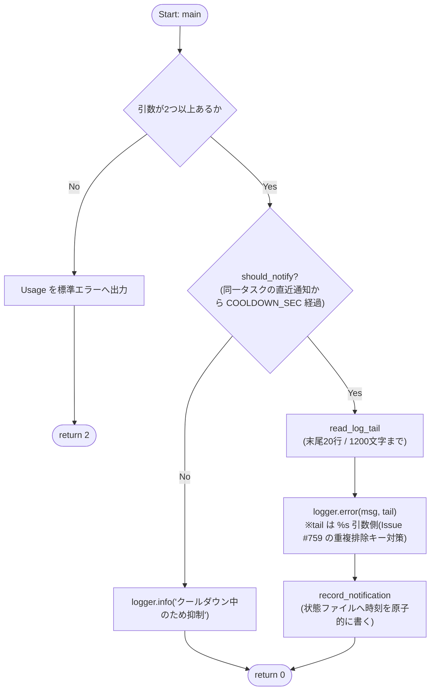
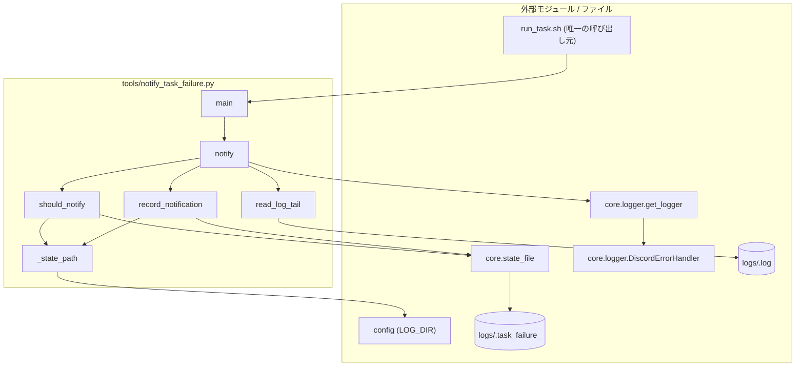

## 1. 解析メタ情報

| 項目 | 内容 |
| --- | --- |
| 対象ファイル | `tools/notify_task_failure.py` |
| 言語 | Python |
| 解析対象 | 提供されたコードのみ |
| 推測・補完 | 一切なし |
| 解析基準コミット | Issue #751 (AUDIT-022) での新規追加時点 |

## 関連ドキュメント

* [run_task.md](./run_task.md) - 唯一の呼び出し元。cron タスクの終了コードが `0` 以外のときに本スクリプトを起動する
* [logger.md](./logger.md) - `get_logger` の実体。通知の実体は `logger.error` で、`DiscordErrorHandler` が error チャンネルへ送る。重複排除キーがフォーマット**前**の `record.msg` で決まる点（Issue #759）が本ファイルのメッセージ設計の前提になっている
* [state_file.md](./state_file.md) - クールダウン状態ファイルの原子的な読み書き（flock + tmp + `os.replace`）の実体
* [config.md](./config.md) - 状態ファイルの置き場となる `LOG_DIR` の提供元
* [memory_monitor.md](./memory_monitor.md) - 同じ「クールダウン状態ファイル」方式の先行実装（`check_cooldown` / `record_notification`）
* [health_watch.md](./health_watch.md) - 自前で通知する cron タスクの例（本ファイルの対象外＝既に救われている側）

## 2. ファイルの概要

`run_task.sh` 経由で実行された cron タスクが失敗したとき、その事実を Discord へ通知する小さな CLI。

**Issue #751 (AUDIT-022)**: `run_task.sh` は失敗を exit code とログファイルに書くだけで通知していなかった。`deploy/cron/crontab` には `MAILTO=` も無く、全エントリの出力がログファイルへリダイレクトされているため cron のメール通知も機能しない。つまり**自前で通知しないタスクの失敗は完全に無音**だった（自前で通知しているのは `backup_service` / `health_watch` / `memory_monitor` / `server_watchdog` の4つだけ）。`logger.error` を出して終了する Python スクリプトは `core.logger.DiscordErrorHandler` 経由で救われており、救われていないのは**Python が起動する前に失敗する場合**（`ImportError`・`.venv` の破損・ファイル不在）である。Issue #736 の依存欠落（`yt-dlp` / `curl_cffi` が `.venv` に入らない）はまさにこれに該当し、「数か月気づかない」が現実的なシナリオだった。

通知量の制御はタスクごとのクールダウン状態ファイルで行う。`core.logger.DiscordErrorHandler` 側の重複排除（Issue #759）は**プロセスローカル**で、cron は毎回新しいプロセスを起こすため効かない。

* 根拠: モジュールdocstring (行番号: 2〜32 / 抜粋: "cron タスク(run_task.sh 経由)の失敗を Discord へ通知する小さなCLI。")

## 3. 外部依存関係

### インポート一覧

| 名称 | 種類 | 用途 | 根拠 |
| --- | --- | --- | --- |
| `os` | 標準 | パス組み立て・ファイル存在確認 | 根拠: [インポート宣言] (行番号: 34 / 抜粋: "import os") |
| `sys` | 標準 | `sys.path` への親ディレクトリ追加・引数取得・終了コード返却 | 根拠: [インポート宣言] (行番号: 35 / 抜粋: "import sys") |
| `time` | 標準 | 現在時刻（クールダウン判定の基準） | 根拠: [インポート宣言] (行番号: 36 / 抜粋: "import time") |
| `config` | 自作 | 状態ファイルの置き場 `LOG_DIR` | 根拠: [インポート宣言] (行番号: 40 / 抜粋: "import config") |
| `core.state_file` | 自作 | クールダウン状態ファイルの原子的な読み書き | 根拠: [インポート宣言] (行番号: 41 / 抜粋: "from core import state_file") |
| `core.logger.get_logger` | 自作 | ロガー取得。`DiscordErrorHandler` はここで付く | 根拠: [インポート宣言] (行番号: 42 / 抜粋: "from core.logger import get_logger") |

インポートに先立ち親ディレクトリを `sys.path` へ追加している（根拠: [パス操作] (行番号: 38 / 抜粋: "sys.path.append(os.path.abspath(os.path.join(os.path.dirname(__file__), \"..\")))")）。

### ブラックボックスとなる外部要素

| 名称 | 理由 | 根拠 |
| --- | --- | --- |
| `config.LOG_DIR` | 外部ファイルで定義されており具体的な値が不明。 | 根拠: [変数参照] (行番号: 57 / 抜粋: "os.path.join(config.LOG_DIR, f\".task_failure_{safe}\")") |
| `core.logger.get_logger` が返すロガーに付くハンドラ構成 | Discord へ実際に送るかどうかは `config.DISCORD_WEBHOOK_ERROR` の有無に依存し、本ファイルからは読み取れない。 | 根拠: [ロガー取得] (行番号: 44 / 抜粋: "logger = get_logger(\"run_task\")") |
| 第1引数で渡される `script_name` | 実行時に `run_task.sh` から動的に渡される。 | 根拠: [引数取得] (行番号: 119 / 抜粋: "script_name, exit_code = args[0], args[1]") |

## 4. 主要要素の定義（関数 / エンドポイント / コンポーネント）

### モジュール定数群

* **役割**: `COOLDOWN_SEC`（3600）は同一タスクの失敗を再通知するまでの最短間隔。`tools/keep_alive_anker.sh` は5分毎に動くため、失敗し続けると1日288通になるのを1時間に1通へ抑える。`LOG_TAIL_LIMIT`（1200）と `LOG_TAIL_LINES`（20）は通知に載せるログ末尾の上限（文字数・行数）。
* 根拠: [定数定義] (行番号: 42, 44, 46 / 抜粋: "COOLDOWN_SEC: int = 3600", "LOG_TAIL_LIMIT: int = 1200", "LOG_TAIL_LINES: int = 20")

### `_state_path`

* **役割**: タスクごとのクールダウン状態ファイルのパスを返す。スクリプト名にはディレクトリ区切りが含まれる（`monitors/log_analyzer.py` 等）ため、`/`・`os.sep`・`.` を `_` へ潰してファイル名として安全な形にする。
* 根拠: [関数定義] (行番号: 49〜57 / 抜粋: "def _state_path(script_name: str) -> str:")
* **引数/リクエスト**: `script_name: str`
* 根拠: [関数定義] (行番号: 49)
* **戻り値/レスポンス**: `str`（`config.LOG_DIR` 配下の `.task_failure_<正規化した名前>`）
* 根拠: [戻り値] (行番号: 57 / 抜粋: "return os.path.join(config.LOG_DIR, f\".task_failure_{safe}\")")
* **副作用**: なし
* 根拠: [関数本体] (行番号: 56〜57)
* **エラーハンドリング**: なし
* 根拠: [関数本体] (行番号: 49〜57)

### `should_notify`

* **役割**: そのタスクの失敗を今回通知してよいか（クールダウンを過ぎているか）を判定する。状態ファイルが無い・読めない・数値として解釈できない場合はいずれも**通知する側へ倒す**（`memory_monitor.check_cooldown` と同じ方針。抑制の誤りで無音になるより多めに通知するほうが安全）。
* 根拠: [関数定義・docstring] (行番号: 59〜74 / 抜粋: "def should_notify(script_name: str, now: float) -> bool:")
* **引数/リクエスト**: `script_name: str`, `now: float`（`time.time()` 基準の現在時刻）
* 根拠: [関数定義] (行番号: 59)
* **戻り値/レスポンス**: `bool`
* 根拠: [戻り値] (行番号: 74 / 抜粋: "return now - last > COOLDOWN_SEC")
* **副作用**: 状態ファイルの読み取りのみ（書き込みはしない）
* 根拠: [読み取り] (行番号: 67 / 抜粋: "raw = state_file.read_text(_state_path(script_name))")
* **エラーハンドリング**: `float()` の `ValueError` を捕捉し `True`（通知する）を返す
* 根拠: [例外処理] (行番号: 71〜73 / 抜粋: "except ValueError:")

### `record_notification`

* **役割**: 通知した時刻を状態ファイルへ原子的に記録する。書き込みに失敗した場合は警告ログにとどめる（通知そのものは既に済んでいるため、処理を止めない）。
* 根拠: [関数定義] (行番号: 76〜78 / 抜粋: "def record_notification(script_name: str, now: float) -> None:")
* **引数/リクエスト**: `script_name: str`, `now: float`
* 根拠: [関数定義] (行番号: 76)
* **戻り値/レスポンス**: `None`
* 根拠: [関数定義] (行番号: 76 / 抜粋: "-> None:")
* **副作用**: 状態ファイルへの書き込み、失敗時の `logger.warning`
* 根拠: [書き込み] (行番号: 77〜78 / 抜粋: "if not state_file.write_text_atomic(_state_path(script_name), str(now)):")
* **エラーハンドリング**: `write_text_atomic` の戻り値（`bool`）を確認して警告ログを出す
* 根拠: [戻り値確認] (行番号: 77〜78)

### `read_log_tail`

* **役割**: 対象タスクのログファイルの末尾（`LOG_TAIL_LINES` 行かつ `LOG_TAIL_LIMIT` 文字まで）を読む。ファイルが無い・パスが空なら空文字を返し、読み取りに失敗したら理由を含む文字列を返す（**通知自体は続行する**）。
* 根拠: [関数定義・docstring] (行番号: 81〜91 / 抜粋: "def read_log_tail(log_file: str) -> str:")
* **引数/リクエスト**: `log_file: str`
* 根拠: [関数定義] (行番号: 81)
* **戻り値/レスポンス**: `str`
* 根拠: [戻り値] (行番号: 91 / 抜粋: "return \"\".join(lines[-LOG_TAIL_LINES:])[-LOG_TAIL_LIMIT:]")
* **副作用**: ログファイルの読み取りのみ
* 根拠: [ファイル読み取り] (行番号: 87〜88 / 抜粋: "with open(log_file, \"r\", encoding=\"utf-8\", errors=\"replace\") as f:")
* **エラーハンドリング**: `OSError` を捕捉して理由を含む文字列を返す。デコード不能なバイトは `errors="replace"` で潰す
* 根拠: [例外処理] (行番号: 89〜90 / 抜粋: "except OSError as e:")

### `notify`

* **役割**: 失敗を通知する。クールダウン中なら `logger.info` を出して `False` を返す。通知する場合は `logger.error` を出し、状態ファイルへ時刻を記録して `True` を返す。
* **メッセージの形**: **変動するログ末尾を `%s` の引数側に置く**。`DiscordErrorHandler` の重複排除キーはフォーマット**前**の `record.msg` で決まる（Issue #759）ため、ログ末尾を f-string へ埋め込むと毎回別のキーになり束ねられない。現在の形ではキーが「スクリプト名 + 終了コード」で安定する。
* 根拠: [関数定義・docstring] (行番号: 93〜111 / 抜粋: "def notify(script_name: str, exit_code: str, log_file: str, now: float) -> bool:")、[メッセージ組み立て] (行番号: 105〜108 / 抜粋: "f\"🚨 cron タスクが失敗しました: {script_name} (exit={exit_code})\\nログ末尾:\\n%s\",")
* **引数/リクエスト**: `script_name: str`, `exit_code: str`, `log_file: str`, `now: float`
* 根拠: [関数定義] (行番号: 93)
* **戻り値/レスポンス**: `bool`（通知したら `True`、抑制したら `False`）
* 根拠: [戻り値] (行番号: 102, 110 / 抜粋: "return False", "return True")
* **副作用**: `logger.info` / `logger.error`（後者は `DiscordErrorHandler` 経由で Discord の error チャンネルへ送られる）、ログファイルの読み取り、状態ファイルへの書き込み
* 根拠: [ログ出力と記録] (行番号: 101, 105〜109 / 抜粋: "record_notification(script_name, now)")
* **エラーハンドリング**: 本関数内に `try`/`except` は無い（読み取り側の例外は `read_log_tail`、書き込み側は `record_notification` が扱う）
* 根拠: [関数本体] (行番号: 99〜110)

### `main`

* **役割**: CLI のエントリポイント。`<script_name> <exit_code> [log_file]` を受け取り `notify` を呼ぶ。引数が2つ未満なら Usage を標準エラーへ出して `2` を返す。
* **役割（終了コード）**: 通知の成否で**戻り値を変えない**（常に `0`）。cron タスク自体の終了コードは呼び出し元の `run_task.sh` が返すものであり、ここは「最後の砦」であって本処理ではないため。
* 根拠: [関数定義] (行番号: 114〜125 / 抜粋: "def main(argv=None) -> int:")、[終了コードのコメント] (行番号: 122〜125 / 抜粋: "# 通知の成否で cron タスク自体の終了コードを変えない(呼び出し元が本来の")
* **引数/リクエスト**: `argv`（省略時は `sys.argv[1:]`。テストから直接渡せるようにしてある）
* 根拠: [関数定義] (行番号: 114〜115 / 抜粋: "args = list(sys.argv[1:] if argv is None else argv)")
* **戻り値/レスポンス**: `int`（Usage エラーは `2`、それ以外は `0`）
* 根拠: [戻り値] (行番号: 118, 125 / 抜粋: "return 2", "return 0")
* **副作用**: `notify` の副作用、Usage の標準エラー出力
* 根拠: [呼び出し] (行番号: 121 / 抜粋: "notify(script_name, exit_code, log_file, time.time())")
* **エラーハンドリング**: 引数不足のみを扱う
* 根拠: [引数チェック] (行番号: 116〜118 / 抜粋: "if len(args) < 2:")

### `__main__` ブロック

* **役割**: スクリプト直接実行時に `main()` の戻り値を終了コードとしてプロセスを終了する。
* 根拠: [エントリーポイント] (行番号: 128〜129 / 抜粋: "sys.exit(main())")
* **引数/リクエスト**: なし
* 根拠: [エントリーポイント] (行番号: 128〜129)
* **戻り値/レスポンス**: プロセス終了コード
* 根拠: [エントリーポイント] (行番号: 129)
* **副作用**: `main()` の実行
* 根拠: [エントリーポイント] (行番号: 129)
* **エラーハンドリング**: なし
* 根拠: [エントリーポイント] (行番号: 128〜129)

## 5. 処理フロー図

## 6. 依存関係図

## 7. 次のステップ（リバースエンジニアリングの提案）

| 優先度 | ファイル名 | 理由 | 根拠 |
| --- | --- | --- | --- |
| 高 | `run_task.sh` | 唯一の呼び出し元であり、どの引数で呼ばれるかが本ファイルの前提になっている | [呼び出し元](./run_task.md) |
| 高 | `core/logger.py` | 通知が実際に Discord へ届くかは `DiscordErrorHandler` の付与条件と重複排除に依存する | [ロガー取得] (行番号: 44 / 抜粋: "logger = get_logger(\"run_task\")") |
| 中 | `core/state_file.py` | クールダウン状態の読み書きの原子性の実体 | [読み書き] (行番号: 67, 77) |
| 中 | `deploy/cron/crontab` | どのタスクが `run_task.sh` 経由か＝本ファイルの恩恵を受ける範囲を確定するため | [run_task.md の相互参照節](./run_task.md) |

## 8. 保守上の注意点

* **通知自体が `.venv` に依存する。** `run_task.sh` は `VENV_PYTHON` で本ファイルを起動するため、`.venv` が完全に壊れている場合は通知も失敗する。`run_task.sh` 側は `|| true` で握ってタスク本来の終了コードを保つ。より堅牢にするなら `curl` で Webhook を直接叩く方法があるが、`.env` から URL を読む必要がありシェルでの秘密情報の扱いに注意が要る（未対応）。
* **`run_task.sh` を経由しない cron エントリは対象外。** `monitors/daily_timelapse_job.py` × 2・`DDD/newface_monitor.py`・`tools/keep_alive_*.sh` は `.venv/bin/python` 等を直接叩くため、この通知の恩恵を受けない（[run_task.md](./run_task.md) の保守上の注意点も参照）。
* **クールダウンはタスクごと・ファイルベース。** `core.logger.DiscordErrorHandler` の重複排除（Issue #759）はプロセスローカルで、cron のように毎回新しいプロセスを起こす経路では効かない。両者は目的が重なるが層が違う点に注意すること。
* **メッセージの形を変えるときは `%s` の位置に注意する。** ログ末尾を f-string へ埋め込むと `DiscordErrorHandler` の重複排除キーが毎回変わり、抑制が効かなくなる。回帰テストは `tests/test_notify_task_failure.py::TestMessageShape::test_variable_log_tail_goes_into_the_format_args`。
* 状態ファイルは `config.LOG_DIR` 配下の `.task_failure_*` に置く。`logs/` は logrotate の対象だが、ドット始まりのこれらは対象外である（`MY_HOME_SYSTEM/deploy/logrotate/` の設定を変更する際は影響を確認すること）。

## 9. 不明事項一覧

| 項目 | 理由 | 必要なファイル |
| --- | --- | --- |
| 通知が実際に Discord へ届くか | `config.DISCORD_WEBHOOK_ERROR` の設定有無に依存し、本ファイルからは判断できない（未設定なら `DiscordErrorHandler` 自体が付かず、ログファイルへの記録だけになる） | 実機の `.env` |
| `COOLDOWN_SEC = 3600` が運用上妥当か | 実際の失敗頻度の実測が無い。`keep_alive_anker.sh`（5分毎）を想定した値だが、日次タスクには長すぎる可能性がある | 実機の運用実績 |

## 10. 自己検証結果

* [x] 推測・外部ファイルの仕様を一切含んでいない
* [x] 全関数・全クラス・全コンポーネントを列挙した
* [x] 全てのインポート要素を列挙した
* [x] すべての仕様説明に「根拠（行番号・抜粋）」を明記した
* [x] 根拠漏れが0件である
* [x] Mermaid構文にエラーの原因となる記号（エスケープ漏れ）がない
* [x] 不明事項を漏れなく列挙した
