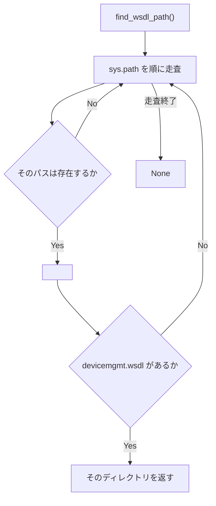
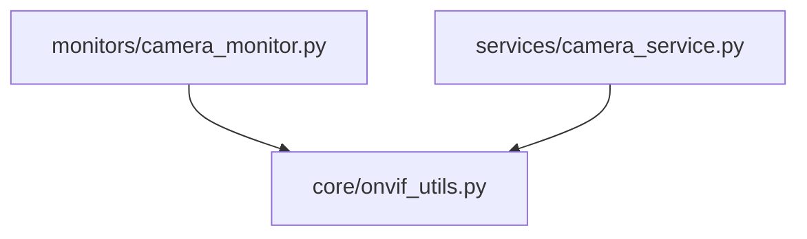

## 1. 解析メタ情報

| 項目 | 内容 |
| --- | --- |
| 対象ファイル | core/onvif_utils.py |
| 解析基準コミット | Issue #661 での新規作成時点(2026-09-16) |
| 言語 | Python |
| 解析対象 | 提供されたコードのみ |
| 推測・補完 | 一切なし |

## 関連ドキュメント

* [camera_monitor.md](./camera_monitor.md) - 呼び出し元(モジュール読み込み時に `WSDL_DIR` を解決する)
* [camera_service.md](./camera_service.md) - 呼び出し元(ONVIF 接続時に都度呼ぶ)

## 2. ファイルの概要

ONVIF 関連の小さな共通ユーティリティ。Issue #661 の時点で `find_wsdl_path()` が `services/camera_service.py` と `monitors/camera_monitor.py` に一字一句同じ形で重複しており(片方の docstring は「camera_monitor.py と同等の」と書かれていた)、探索規則を変えるときに片方だけ直す事故が起きうる状態だったため、実体をここへ移した。

## 3. 外部依存関係

### インポート一覧

| 名称 | 種類 | 用途 | 根拠 |
| --- | --- | --- | --- |
| `os` | 標準ライブラリ | パスの結合と存在確認 | `import os` (行番号: 12) |
| `sys` | 標準ライブラリ | `sys.path` の走査 | `import sys` (行番号: 13) |

### ブラックボックスとなる外部要素

| 項目 | 理由 |
| --- | --- |
| `onvif_zeep` パッケージの配置 | 環境(venv / システム Python / パッケージのバージョン)により `<site-packages>/onvif/wsdl` と `<site-packages>/wsdl` のどちらになるかが変わるため、実行環境に依存する。 |

## 4. 主要要素の定義（関数 / エンドポイント / コンポーネント）

### `find_wsdl_path`

* **役割**: `sys.path` を走査し、`onvif/wsdl` または `wsdl` サブディレクトリに `devicemgmt.wsdl` が実在する方のディレクトリパスを返す。見つからなければ `None`。
* **引数/リクエスト**: なし
* **戻り値/レスポンス**: `Optional[str]`
* **副作用**: なし(ファイルシステムの読み取りのみ)
* **エラーハンドリング**: 例外は投げない。存在しないパスは読み飛ばす。
* 根拠: `find_wsdl_path` (行番号: 16 / 抜粋: "def find_wsdl_path() -> Optional[str]:")

## 5. 処理フロー図

## 6. 依存関係図

## 7. 次のステップ（リバースエンジニアリングの提案）

| 優先度 | ファイル名 | 理由 |
| --- | --- | --- |
| 低 | `monitors/camera_monitor.py` | `WSDL_DIR` が `None` のときの挙動(`main` が即座にエラー終了する)との関係を確認するため。 |

## 8. 保守上の注意点

* **探索規則を変えるときはここだけを直す**: 重複を解消した目的がこれ。呼び出し側(`camera_monitor` / `camera_service`)は import するだけで、実装を持たない。
* **モジュール読み込み時に1回だけ解決される経路がある**: `camera_monitor` は `WSDL_DIR` をモジュールレベルで解決するため、実行中に仮想環境を入れ替えても反映されない。

## 9. 不明事項一覧

| 項目 | 理由 | 必要なファイル |
| --- | --- | --- |
| 実機の `onvif_zeep` の配置 | 実行環境依存のため、リポジトリ内のコードからは確定できない。 | 実機の `.venv` |

## 10. 自己検証結果

* 行番号・シグネチャは `core/onvif_utils.py` の現物と照合済み。
* 両呼び出し元が同一の関数オブジェクトを参照していることは `tests/test_core_shared_helpers.py::TestOnvifUtils::test_camera_modules_share_the_same_implementation` で検証している。
