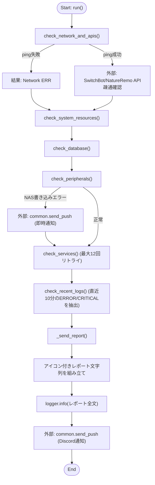

## 1. 解析メタ情報

| 項目 | 内容 |
| --- | --- |
| 対象ファイル | `post_boot_health_check.py` |
| 言語 | Python |
| 解析対象 | 提供されたコードのみ |
| 推測・補完 | 一切なし |

## 関連ドキュメント

* [common.md](./common.md) - `common.setup_logging`/`common.send_push`を提供するFacadeモジュール(実体は`core.logger`/`services.notification_service`)
* [logger.md](./logger.md) - `setup_logging`の実体。コンソール出力・日次ローテーションファイル出力・ERRORレベルのDiscord通知(`DiscordErrorHandler`)を提供
* [notification_service.md](./notification_service.md) - `common.send_push`の実体。Discord/LINEへの統合通知処理
* [config.md](./config.md) - `LOG_DIR`, `SQLITE_DB_PATH`, `BACKEND_URL`等の設定値を提供する`config.py`の解析結果
* [database.md](./database.md), [init_unified_db.md](./init_unified_db.md) - チェック対象DBの接続・初期化・スキーマ検証を行うモジュール
* [unified_server.md](./unified_server.md) - `check_services`がチェックする「Backend Server」に相当すると推測されるFastAPIサーバー
* [switchbot_service.md](./switchbot_service.md) - `check_network_and_apis`が疎通確認するSwitchBot APIのクライアント実装

## 2. ファイルの概要

* システム起動直後にハードウェア・ネットワーク・データベース・周辺機器・各種サービス・直近ログの健全性を一括チェックするスクリプト。
* チェック結果は `CheckResult` データクラスのリストとして `PostBootHealthCheck` インスタンスに蓄積され、最終的に1件のレポートとしてDiscordへ送信（`common.send_push`）される。
* サービス起動待ち（`check_services`）では、対象ポート/HTTPエンドポイントが応答するまで最大12回・10秒間隔でリトライするポーリング処理を持つ。
* NASの書き込み権限エラー検知時（`check_peripherals`）は、レポート集約を待たずにその場で即時Discord通知を行う特別処理を持つ。
* `config` と `common` のインポートに失敗した場合は、標準エラー出力にメッセージを表示してプロセスを終了する（起動時ガード）。

## 3. 外部依存関係

### インポート一覧

| 名称 | 種類 | 用途 | 根拠 |
| --- | --- | --- | --- |
| `os` | 標準ライブラリ | パス操作、ファイル存在確認、マウント確認、一時ファイル削除 | `import os` (行番号: 1 / 抜粋: "import os") |
| `sys` | 標準ライブラリ | `sys.path` 操作、標準エラー出力、プロセス終了（`sys.exit`） | `import sys` (行番号: 2 / 抜粋: "import sys") |
| `time` | 標準ライブラリ | サービス起動待ちのリトライ間隔（`sleep`） | `import time` (行番号: 3 / 抜粋: "import time") |
| `socket` | 標準ライブラリ | TCPポート疎通確認 | `import socket` (行番号: 4 / 抜粋: "import socket") |
| `subprocess` | 標準ライブラリ | `vcgencmd`, `ping`, `tail`, `aplay`, `bluetoothctl` 等の外部コマンド実行 | `import subprocess` (行番号: 5 / 抜粋: "import subprocess") |
| `shutil` | 標準ライブラリ | ディスク使用量取得（`disk_usage`） | `import shutil` (行番号: 6 / 抜粋: "import shutil") |
| `requests` | 外部ライブラリ | HTTPヘルスチェック、外部API疎通確認 | `import requests` (行番号: 7 / 抜粋: "import requests") |
| `sqlite3` | 標準ライブラリ | DBファイルの整合性チェック接続 | `import sqlite3` (行番号: 8 / 抜粋: "import sqlite3") |
| `typing.List` | 標準ライブラリ | `results` フィールドの型ヒント | `from typing import List` (行番号: 9 / 抜粋: "from typing import List") |
| `dataclasses.dataclass` | 標準ライブラリ | `CheckResult` クラスの定義 | `from dataclasses import dataclass` (行番号: 10 / 抜粋: "from dataclasses import dataclass") |
| `datetime`, `timedelta` | 標準ライブラリ | ログの時刻フィルタリング（直近10分判定） | `from datetime import datetime, timedelta` (行番号: 11 / 抜粋: "from datetime import datetime, timedelta") |
| `config` | 内部モジュール | 各種設定値（`LOG_DIR`, `SQLITE_DB_PATH`, `BACKEND_URL`, `FRONTEND_URL`, `NAS_IP`, `NAS_MOUNT_POINT`, `CAMERAS`, `LINE_USER_ID`）の取得 | `import config` (行番号: 18 / 抜粋: "import config") |
| `common` | 内部モジュール | ロガー生成（`setup_logging`）、通知送信（`send_push`） | `import common` (行番号: 19 / 抜粋: "import common") |

### ブラックボックスとなる外部要素

| 名称 | 理由 | 根拠 |
| --- | --- | --- |
| `common.setup_logging` | 生成されるロガーの出力先・フォーマット・ログレベルの詳細が不明。 | `logger = common.setup_logging("health_check")` (行番号: 25 / 抜粋: "logger = common.setup_logging("health_check")") |
| `common.send_push` | 通知の実際の送信方式や失敗時の挙動（例外送出の有無等）が不明。 | `common.send_push(` (行番号: 222 / 抜粋: "common.send_push(") |
| `config` の各設定値 | `LOG_DIR`, `SQLITE_DB_PATH`, `BACKEND_URL`, `FRONTEND_URL`, `NAS_IP`, `NAS_MOUNT_POINT`, `CAMERAS`, `LINE_USER_ID` の実際の値・存在有無が不明（すべて `getattr` によるデフォルト値付きアクセス）。 | `getattr(config, 'LOG_DIR', os.path.join(BASE_DIR, 'logs'))` (行番号: 50 / 抜粋: "log_dir = getattr(config, 'LOG_DIR', os.path.join(BASE_DIR, 'logs'))") |
| `vcgencmd`, `ping`, `tail`, `aplay`, `bluetoothctl` コマンド | 実行環境（Raspberry Pi等）にこれらのコマンドが存在する前提のコードだが、コマンドの実装自体は本ファイル外。 | `subprocess.check_output(["vcgencmd", "measure_temp"])` (行番号: 85 / 抜粋: "res = subprocess.check_output(["vcgencmd", "measure_temp"]).decode("utf-8")") |
| SwitchBot / NatureRemo API | 外部APIの実際の応答仕様（本コードでは疎通確認のみで内容は見ていない）は不明。 | `("SwitchBot", "https://api.switch-bot.com/v1.0/devices")` (行番号: 124 / 抜粋: "("SwitchBot", "https://api.switch-bot.com/v1.0/devices"),") |

## 4. 主要要素の定義（関数 / エンドポイント / コンポーネント）

### モジュール初期化処理（パス設定・`config`/`common` インポートガード）

* **役割**: スクリプト自身のディレクトリを `BASE_DIR` として算出し `sys.path` に追加した上で、`config` と `common` モジュールをインポートする。インポートに失敗した場合は標準エラー出力にメッセージを表示しプロセスを終了する。
* 根拠: `BASE_DIR = os.path.dirname(os.path.abspath(__file__))` 〜 `sys.exit(1)` (行番号: 14〜22 / 抜粋: "try:\n    import config\n    import common\nexcept ImportError as e:")

* **引数/リクエスト**: なし
* 根拠: (行番号: 14〜22 / 抜粋: "sys.path.append(BASE_DIR)")

* **戻り値/レスポンス**: なし
* 根拠: (行番号: 14〜22 / 抜粋: "import config")

* **副作用**: `sys.path` へのパス追加、失敗時の標準エラー出力・プロセス終了。
* 根拠: `sys.path.append(BASE_DIR)` (行番号: 15 / 抜粋: "sys.path.append(BASE_DIR)")

* **エラーハンドリング**: `ImportError` を捕捉し、エラーメッセージを `sys.stderr` に出力後 `sys.exit(1)` でプロセスを終了する。
* 根拠: `except ImportError as e:` (行番号: 20〜22 / 抜粋: "except ImportError as e:\n    print(f"Error: Failed to import config or common modules. {e}", file=sys.stderr)\n    sys.exit(1)")

### `logger` (モジュールレベル変数)

* **役割**: `common.setup_logging` を用いて `"health_check"` 名のロガーインスタンスを生成する。
* 根拠: `logger = common.setup_logging("health_check")` (行番号: 25 / 抜粋: "logger = common.setup_logging("health_check")")

* **引数/リクエスト**: なし
* 根拠: (行番号: 25 / 抜粋: "logger = common.setup_logging("health_check")")

* **戻り値/レスポンス**: なし（グローバル変数への代入）
* 根拠: (行番号: 25 / 抜粋: "logger = common.setup_logging("health_check")")

* **副作用**: モジュール変数 `logger` の生成。
* 根拠: (行番号: 25 / 抜粋: "logger = common.setup_logging("health_check")")

* **エラーハンドリング**: なし
* 根拠: (行番号: 25 / 抜粋: "logger = common.setup_logging("health_check")")

### `CheckResult`

* **役割**: 1件のヘルスチェック結果（項目名・ステータス・メッセージ）を保持するデータクラス。
* 根拠: `@dataclass\nclass CheckResult:` (行番号: 38〜42 / 抜粋: "class CheckResult:\n    name: str\n    status: str\n    message: str")

* **引数/リクエスト**: `name: str`, `status: str`, `message: str`
* 根拠: (行番号: 40〜42 / 抜粋: "name: str\n    status: str\n    message: str")

* **戻り値/レスポンス**: `CheckResult` インスタンス
* 根拠: `@dataclass` (行番号: 38 / 抜粋: "@dataclass")

* **副作用**: なし
* 根拠: (行番号: 38〜42 / 抜粋: "class CheckResult:")

* **エラーハンドリング**: なし（型ヒントのみで実行時バリデーションはなし）
* 根拠: (行番号: 38〜42 / 抜粋: "class CheckResult:")

### `PostBootHealthCheck` (クラス概要)

* **役割**: システム起動直後の健全性チェックをまとめて実行するメインクラス。リソース・ネットワーク・DB・サービス・周辺機器・ログの各チェックメソッドと、結果集約・通知送信メソッドを持つ。
* 根拠: `class PostBootHealthCheck:` (行番号: 44〜371 / 抜粋: "class PostBootHealthCheck:")

* **引数/リクエスト**: なし（コンストラクタは引数なし）
* 根拠: `def __init__(self):` (行番号: 45 / 抜粋: "def __init__(self):")

* **戻り値/レスポンス**: 該当なし（クラス定義）
* 根拠: (行番号: 44 / 抜粋: "class PostBootHealthCheck:")

* **副作用**: 該当なし（クラス定義自体には副作用なし。各メソッド参照）
* 根拠: (行番号: 44 / 抜粋: "class PostBootHealthCheck:")

* **エラーハンドリング**: 該当なし（各メソッド参照）
* 根拠: (行番号: 44 / 抜粋: "class PostBootHealthCheck:")

### `PostBootHealthCheck.__init__`

* **役割**: リトライ回数・間隔、結果リスト、ログファイルパスを初期化する。
* 根拠: `def __init__(self):` (行番号: 45〜51 / 抜粋: "def __init__(self):\n        self.max_retries = 12       \n        self.retry_interval = 10    \n        self.results: List[CheckResult] = []")

* **引数/リクエスト**: `self` のみ
* 根拠: (行番号: 45 / 抜粋: "def __init__(self):")

* **戻り値/レスポンス**: なし
* 根拠: (行番号: 45 / 抜粋: "def __init__(self):")

* **副作用**: `self.max_retries=12`, `self.retry_interval=10`, `self.results=[]`, `self.log_file_path` の各インスタンス属性を設定する。
* 根拠: `self.log_file_path = os.path.join(log_dir, "home_system.log")` (行番号: 51 / 抜粋: "self.log_file_path = os.path.join(log_dir, "home_system.log")")

* **エラーハンドリング**: なし
* 根拠: (行番号: 45〜51 / 抜粋: "self.results: List[CheckResult] = []")

### `PostBootHealthCheck._check_port`

* **役割**: 指定ホスト・ポートへのTCP接続を試み、疎通可否を判定する。
* 根拠: `def _check_port(self, host: str, port: int, timeout=3) -> bool:` (行番号: 54〜59 / 抜粋: "def _check_port(self, host: str, port: int, timeout=3) -> bool:")

* **引数/リクエスト**: `host: str`, `port: int`, `timeout=3`
* 根拠: (行番号: 54 / 抜粋: "def _check_port(self, host: str, port: int, timeout=3) -> bool:")

* **戻り値/レスポンス**: `bool`（接続成功時 `True`、失敗時 `False`）
* 根拠: `return True` / `return False` (行番号: 57, 59 / 抜粋: "return True")

* **副作用**: なし（ソケット接続を確立しコンテキスト終了時に自動クローズ）
* 根拠: `with socket.create_connection((host, port), timeout=timeout):` (行番号: 56 / 抜粋: "with socket.create_connection((host, port), timeout=timeout):")

* **エラーハンドリング**: `socket.timeout`, `ConnectionRefusedError`, `OSError` を捕捉し `False` を返す。
* 根拠: `except (socket.timeout, ConnectionRefusedError, OSError):` (行番号: 58 / 抜粋: "except (socket.timeout, ConnectionRefusedError, OSError):")

### `PostBootHealthCheck._check_http`

* **役割**: 指定URLへHTTP GETリクエストを送信し、ステータスコードが200〜399の範囲かを判定する。
* 根拠: `def _check_http(self, url: str, timeout=5) -> bool:` (行番号: 61〜66 / 抜粋: "def _check_http(self, url: str, timeout=5) -> bool:")

* **引数/リクエスト**: `url: str`, `timeout=5`
* 根拠: (行番号: 61 / 抜粋: "def _check_http(self, url: str, timeout=5) -> bool:")

* **戻り値/レスポンス**: `bool`
* 根拠: `return 200 <= res.status_code < 400` (行番号: 64 / 抜粋: "return 200 <= res.status_code < 400")

* **副作用**: 外部へのHTTP GETリクエスト送信。
* 根拠: `res = requests.get(url, timeout=timeout)` (行番号: 63 / 抜粋: "res = requests.get(url, timeout=timeout)")

* **エラーハンドリング**: 任意の `Exception` を捕捉し `False` を返す。
* 根拠: `except Exception:` (行番号: 65 / 抜粋: "except Exception:")

### `PostBootHealthCheck._get_uptime`

* **役割**: `/proc/uptime` を読み取り、システム稼働時間を「秒」「分」「時間+分」の形式で文字列化する。
* 根拠: `def _get_uptime(self) -> str:` (行番号: 68〜79 / 抜粋: "def _get_uptime(self) -> str:")

* **引数/リクエスト**: `self` のみ
* 根拠: (行番号: 68 / 抜粋: "def _get_uptime(self) -> str:")

* **戻り値/レスポンス**: `str`（例: `"5秒"`, `"3分"`, `"1時間20分"`。失敗時は `"不明"`）
* 根拠: `return f"{int(uptime_seconds)}秒"` および `return "不明"` (行番号: 73, 79 / 抜粋: "return "不明"")

* **副作用**: `/proc/uptime` ファイルの読み取り。
* 根拠: `with open('/proc/uptime', 'r') as f:` (行番号: 70 / 抜粋: "with open('/proc/uptime', 'r') as f:")

* **エラーハンドリング**: 無条件の `except:`（bare except）で全例外を捕捉し `"不明"` を返す。
* 根拠: `except:` (行番号: 78 / 抜粋: "except:")

### `PostBootHealthCheck.check_system_resources`

* **役割**: CPU温度（`vcgencmd measure_temp`）とディスク使用率（`shutil.disk_usage`）を取得し、閾値（温度75°C、ディスク使用率90%）に基づきステータスを判定して結果に追加する。
* 根拠: `def check_system_resources(self):` (行番号: 82〜112 / 抜粋: "def check_system_resources(self):")

* **引数/リクエスト**: `self` のみ
* 根拠: (行番号: 82 / 抜粋: "def check_system_resources(self):")

* **戻り値/レスポンス**: なし（`self.results` へ `CheckResult` を追加）
* 根拠: `self.results.append(CheckResult(\n            "System Resource", final_status, f"CPU: {temp_msg} / Disk: {disk_msg}"\n        ))` (行番号: 110〜112 / 抜粋: "self.results.append(CheckResult(")

* **副作用**: `vcgencmd` サブプロセス実行、`shutil.disk_usage` によるディスク情報取得、`self.results` への追加。
* 根拠: `res = subprocess.check_output(["vcgencmd", "measure_temp"]).decode("utf-8")` (行番号: 85 / 抜粋: "res = subprocess.check_output(["vcgencmd", "measure_temp"]).decode("utf-8")")

* **エラーハンドリング**: 温度取得・ディスク取得それぞれを個別の `try/except:`（bare except）で保護し、失敗時は `STATUS_WARN` と `"Unknown"` を設定して処理を継続する。
* 根拠: `except:` (行番号: 89, 102 / 抜粋: "except:\n            temp_status = STATUS_WARN\n            temp_msg = "Unknown"")

### `PostBootHealthCheck.check_network_and_apis`

* **役割**: `8.8.8.8` へのping疎通確認を行い、失敗時はネットワークエラーとして即座に結果を追加し処理を打ち切る。成功時はSwitchBot / NatureRemo APIへの疎通も確認し結果を追加する。
* 根拠: `def check_network_and_apis(self):` (行番号: 114〜137 / 抜粋: "def check_network_and_apis(self):")

* **引数/リクエスト**: `self` のみ
* 根拠: (行番号: 114 / 抜粋: "def check_network_and_apis(self):")

* **戻り値/レスポンス**: なし（`self.results` へ追加。ping失敗時は途中で `return` して以降のAPIチェックを行わない）
* 根拠: `self.results.append(CheckResult("Network", STATUS_ERR, "Offline (Ping NG)"))\n            return` (行番号: 119〜120 / 抜粋: "return ")

* **副作用**: `ping` コマンドのサブプロセス実行、SwitchBot/NatureRemo APIへのHTTP GETリクエスト、`self.results` への追加。
* 根拠: `subprocess.check_call(["ping", "-c", "1", "-W", "2", "8.8.8.8"], stdout=subprocess.DEVNULL)` (行番号: 117 / 抜粋: "subprocess.check_call(["ping", "-c", "1", "-W", "2", "8.8.8.8"], stdout=subprocess.DEVNULL)")

* **エラーハンドリング**: ping失敗時（bare except）は `STATUS_ERR` を追加して即 `return`。個々のAPI呼び出し失敗は `except Exception:` で捕捉し `api_ngs` リストに追加、全体としては処理を継続する。
* 根拠: `except:` (行番号: 118 / 抜粋: "except:"), `except Exception:` (行番号: 131 / 抜粋: "except Exception:")

### `PostBootHealthCheck.check_database`

* **役割**: SQLite DBファイルの存在確認と `PRAGMA quick_check` による整合性チェックを行う。
* 根拠: `def check_database(self):` (行番号: 140〜161 / 抜粋: "def check_database(self):")

* **引数/リクエスト**: `self` のみ
* 根拠: (行番号: 140 / 抜粋: "def check_database(self):")

* **戻り値/レスポンス**: なし（`self.results` へ追加。ファイル不在時は途中で `return`）
* 根拠: `self.results.append(CheckResult("Database", STATUS_ERR, "File Not Found"))\n            return` (行番号: 146〜147 / 抜粋: "return")

* **副作用**: 読み取り専用モード（`mode=ro`）でのSQLite接続・クエリ実行・接続クローズ、`self.results` への追加。
* 根拠: `conn = sqlite3.connect(f"file:{db_path}?mode=ro", uri=True, timeout=5)` (行番号: 150 / 抜粋: "conn = sqlite3.connect(f"file:{db_path}?mode=ro", uri=True, timeout=5)")

* **エラーハンドリング**: DBファイル不在時は `STATUS_ERR` を追加して `return`。接続・クエリ実行中の任意の `Exception` を捕捉し `STATUS_ERR` とエラー内容を結果に追加する。
* 根拠: `except Exception as e:` (行番号: 160 / 抜粋: "except Exception as e:")

### `PostBootHealthCheck.check_services`

* **役割**: バックエンドサーバー、Family Quest（フロントエンド）、ダッシュボードの各サービスが起動するまで、最大 `max_retries` 回・`retry_interval` 秒間隔でポート/HTTP疎通を再試行し、結果を判定する。
* 根拠: `def check_services(self):` (行番号: 164〜199 / 抜粋: "def check_services(self):")

* **引数/リクエスト**: `self` のみ
* 根拠: (行番号: 164 / 抜粋: "def check_services(self):")

* **戻り値/レスポンス**: なし（`self.results` へ各サービスの `CheckResult` を追加）
* 根拠: `self.results.append(CheckResult(target["name"], status, msg))` (行番号: 199 / 抜粋: "self.results.append(CheckResult(target["name"], status, msg))")

* **副作用**: 各対象への `_check_port` / `_check_http` 呼び出し、リトライ間の `time.sleep(self.retry_interval)`、`logger.info` によるログ出力、`self.results` への追加。
* 根拠: `time.sleep(self.retry_interval)` (行番号: 186 / 抜粋: "time.sleep(self.retry_interval)")

* **エラーハンドリング**: 明示的な例外捕捉はなし。`critical=True` の対象（Backend Server, Family Quest）が全リトライ失敗した場合は `STATUS_ERR`、`critical=False`（Dashboard）の場合は `STATUS_WARN` として結果に反映する。
* 根拠: `if target["critical"]:\n                    status = STATUS_ERR\n                    msg = "Failed"\n                else:\n                    status = STATUS_WARN` (行番号: 192〜196 / 抜粋: "if target["critical"]:")

### `PostBootHealthCheck.check_peripherals`

* **役割**: NASのマウント状況と書き込み権限、防犯カメラ群のポート疎通、スピーカー（サウンドカードまたはBluetooth接続）の状態をチェックする。NAS書き込み権限エラー時は即座にDiscord通知を送信する。
* 根拠: `def check_peripherals(self) -> None:` (行番号: 202〜281 / 抜粋: "def check_peripherals(self) -> None:")

* **引数/リクエスト**: `self` のみ
* 根拠: (行番号: 202 / 抜粋: "def check_peripherals(self) -> None:")

* **戻り値/レスポンス**: `None`（`self.results` へNAS・カメラ・スピーカーの各 `CheckResult` を追加）
* 根拠: `-> None:` および `self.results.append(CheckResult("Speaker", spk_status, spk_msg))` (行番号: 202, 281 / 抜粋: "-> None:")

* **副作用**: `os.path.ismount` によるマウント確認、テストファイルの書き込み・削除（NAS書き込みテスト）、`logger.error` 出力、`common.send_push` によるDiscord即時通知（権限エラー時）、カメラへのポート疎通確認、`aplay -l` / `bluetoothctl info` のサブプロセス実行、`self.results` への3件（NAS, Cameras, Speaker）の追加。
* 根拠: `common.send_push(\n                    user_id=getattr(config, "LINE_USER_ID", None),` (行番号: 222〜223 / 抜粋: "common.send_push(")

* **エラーハンドリング**: NAS書き込みテストで `IOError`, `PermissionError` を捕捉し `STATUS_ERR` を設定・エラーログ出力・即時Discord通知を行う。カメラ・サウンドカード・Bluetooth関連の処理は個別に bare `except:` で保護されている。
* 根拠: `except (IOError, PermissionError) as e:` (行番号: 217 / 抜粋: "except (IOError, PermissionError) as e:"), `except: pass` (行番号: 262 / 抜粋: "except: pass")

### `PostBootHealthCheck.check_recent_logs`

* **役割**: ログファイルの末尾200行を取得し、直近10分以内に出力された `ERROR` または `CRITICAL` を含む行のみを抽出して結果を判定する。
* 根拠: `def check_recent_logs(self):` (行番号: 284〜324 / 抜粋: "def check_recent_logs(self):")

* **引数/リクエスト**: `self` のみ
* 根拠: (行番号: 284 / 抜粋: "def check_recent_logs(self):")

* **戻り値/レスポンス**: なし（`self.results` へ `CheckResult` を追加。ログファイル未存在時は途中で `return`）
* 根拠: `self.results.append(CheckResult("Logs", STATUS_WARN, "No log file yet"))\n            return` (行番号: 287〜288 / 抜粋: "return")

* **副作用**: `tail -n 200` サブプロセス実行によるログファイル読み取り、`logger.error` 出力（`tail` 失敗時）、`self.results` への追加。
* 根拠: `res = subprocess.check_output(["tail", "-n", "200", self.log_file_path]).decode("utf-8", errors="ignore")` (行番号: 295 / 抜粋: "res = subprocess.check_output(["tail", "-n", "200", self.log_file_path]).decode("utf-8", errors="ignore")")

* **エラーハンドリング**: ログファイル未存在時は `STATUS_WARN` を追加して `return`。各行の日時パース失敗（`ValueError`）はその行をスキップ。`tail` コマンド実行失敗など全体の `Exception` は捕捉しログ出力のみ行う（結果には反映されず、`error_lines` が空のまま以降の判定に進む）。
* 根拠: `except ValueError:` (行番号: 307 / 抜粋: "except ValueError:"), `except Exception as e:` (行番号: 315 / 抜粋: "except Exception as e:")

### `PostBootHealthCheck.run`

* **役割**: 各チェックメソッド（ネットワーク・システムリソース・DB・周辺機器・サービス・ログ）を順に実行し、最後にレポート送信を行う。
* 根拠: `def run(self):` (行番号: 327〜335 / 抜粋: "def run(self):")

* **引数/リクエスト**: `self` のみ
* 根拠: (行番号: 327 / 抜粋: "def run(self):")

* **戻り値/レスポンス**: なし
* 根拠: (行番号: 327〜335 / 抜粋: "def run(self):")

* **副作用**: `logger.info` によるログ出力、各チェックメソッドの実行、`self._send_report()` の呼び出し。
* 根拠: `self.check_network_and_apis()` 〜 `self._send_report()` (行番号: 329〜335 / 抜粋: "self._send_report()")

* **エラーハンドリング**: なし（各チェックメソッド内部で個別に処理される前提）
* 根拠: (行番号: 327〜335 / 抜粋: "def run(self):")

### `PostBootHealthCheck._send_report`

* **役割**: `self.results` の内容からステータスアイコン付きのレポート文字列を組み立て、ログ出力とDiscord通知を行う。
* 根拠: `def _send_report(self):` (行番号: 337〜371 / 抜粋: "def _send_report(self):")

* **引数/リクエスト**: `self` のみ
* 根拠: (行番号: 337 / 抜粋: "def _send_report(self):")

* **戻り値/レスポンス**: なし
* 根拠: (行番号: 337〜371 / 抜粋: "def _send_report(self):")

* **副作用**: `self._get_uptime()` の呼び出し、`logger.info` によるレポート全文のログ出力、`common.send_push` によるDiscord通知送信。
* 根拠: `common.send_push(\n            user_id=getattr(config, "LINE_USER_ID", None),\n            messages=[{"type": "text", "text": f"{title}\n\n{body}"}],\n            target="discord",\n            channel="report"\n        )` (行番号: 366〜371 / 抜粋: "common.send_push(")

* **エラーハンドリング**: なし
* 根拠: (行番号: 337〜371 / 抜粋: "def _send_report(self):")

### モジュールレベル実行部（`if __name__ == "__main__":`）

* **役割**: スクリプトを直接実行した場合に `PostBootHealthCheck` をインスタンス化し `run()` を呼び出す。
* 根拠: `if __name__ == "__main__":\n    checker = PostBootHealthCheck()\n    checker.run()` (行番号: 373〜375 / 抜粋: "if __name__ == "__main__":")

* **引数/リクエスト**: なし
* 根拠: (行番号: 373〜375 / 抜粋: "checker = PostBootHealthCheck()")

* **戻り値/レスポンス**: なし
* 根拠: (行番号: 373〜375 / 抜粋: "checker.run()")

* **副作用**: `PostBootHealthCheck` インスタンスの生成、`run()` を通じた全チェックの実行とレポート送信。
* 根拠: `checker = PostBootHealthCheck()\n    checker.run()` (行番号: 374〜375 / 抜粋: "checker.run()")

* **エラーハンドリング**: なし
* 根拠: (行番号: 373〜375 / 抜粋: "if __name__ == "__main__":")

## 5. 処理フロー図

`run()` を起点とした全体のチェック実行フローを示します。

## 6. 依存関係図

```mermaid
graph TD
    subgraph "post_boot_health_check.py"
        logger["logger (Global)"]
        CheckResult["CheckResult (dataclass)"]
        PostBootHealthCheck["PostBootHealthCheck"]
        init["__init__()"]
        check_port["_check_port()"]
        check_http["_check_http()"]
        get_uptime["_get_uptime()"]
        check_system_resources["check_system_resources()"]
        check_network_and_apis["check_network_and_apis()"]
        check_database["check_database()"]
        check_services["check_services()"]
        check_peripherals["check_peripherals()"]
        check_recent_logs["check_recent_logs()"]
        run["run()"]
        send_report["_send_report()"]
    end

    subgraph "外部依存"
        config["config"]
        common["common"]
        requests_lib["requests"]
        subprocess_lib["subprocess"]
        socket_lib["socket"]
        sqlite3_lib["sqlite3"]
        shutil_lib["shutil"]
    end

    logger --> common
    PostBootHealthCheck --> init
    PostBootHealthCheck --> check_port
    PostBootHealthCheck --> check_http
    PostBootHealthCheck --> get_uptime
    PostBootHealthCheck --> check_system_resources
    PostBootHealthCheck --> check_network_and_apis
    PostBootHealthCheck --> check_database
    PostBootHealthCheck --> check_services
    PostBootHealthCheck --> check_peripherals
    PostBootHealthCheck --> check_recent_logs
    PostBootHealthCheck --> run
    PostBootHealthCheck --> send_report

    init --> config
    check_system_resources --> subprocess_lib
    check_system_resources --> shutil_lib
    check_network_and_apis --> subprocess_lib
    check_network_and_apis --> requests_lib
    check_database --> sqlite3_lib
    check_database --> config
    check_services --> check_port
    check_services --> check_http
    check_services --> config
    check_peripherals --> config
    check_peripherals --> common
    check_peripherals --> check_port
    check_peripherals --> subprocess_lib
    check_recent_logs --> subprocess_lib
    run --> check_network_and_apis
    run --> check_system_resources
    run --> check_database
    run --> check_peripherals
    run --> check_services
    run --> check_recent_logs
    run --> send_report
    send_report --> get_uptime
    send_report --> common
    send_report --> config
```

## 7. 次のステップ（リバースエンジニアリングの提案）

| 優先度 | ファイル名(推測可) | 理由 | 根拠 |
| --- | --- | --- | --- |
| 高 | `common.py` | `setup_logging` と `send_push` の実装が本ファイルの全チェック結果通知・NAS権限エラー即時通知の挙動を左右するため。 | `import common` (行番号: 19 / 抜粋: "import common") |
| 高 | `config.py` | `LOG_DIR`, `SQLITE_DB_PATH`, `BACKEND_URL`, `FRONTEND_URL`, `NAS_IP`, `NAS_MOUNT_POINT`, `CAMERAS`, `LINE_USER_ID` の実値を把握し、どの環境を対象としたヘルスチェックかを確認するため。 | `getattr(config, "SQLITE_DB_PATH", "home_system.db")` (行番号: 141 / 抜粋: "db_path = getattr(config, "SQLITE_DB_PATH", "home_system.db")") |
| 中 | `home_system.db`（対象DBファイル） | `PRAGMA quick_check` の対象となるDBのスキーマ・データ構造を把握し、健全性チェックの意味を正確に理解するため。 | `conn = sqlite3.connect(f"file:{db_path}?mode=ro", uri=True, timeout=5)` (行番号: 150 / 抜粋: "conn = sqlite3.connect(f"file:{db_path}?mode=ro", uri=True, timeout=5)") |

## 8. 保守上の注意点

* **多数の bare `except:`**: `_get_uptime`（78行目）、`check_system_resources`（89, 102行目）、`check_network_and_apis`（118行目）、`check_peripherals`（262, 272, 274行目）で無条件の `except:` が使われており、`KeyboardInterrupt` や `SystemExit` を含むあらゆる例外を捕捉してしまう可能性がある（Python 3ではこれらは `BaseException` 派生であり、bare exceptで捕捉されうる）。
* **`check_recent_logs` のログ判定タイミング**: `Exception` を捕捉した場合（315行目）でも `error_lines` が空のまま後続の判定に進み `STATUS_OK` として「Clean」と報告される可能性がある。ログ取得自体の失敗と「エラーなし」が区別されない。
* **`TARGET_BLUETOOTH_MAC = None`（30行目）が未設定固定値**: Bluetoothスピーカーの接続確認機能はこの変数が `None` のままだと `has_card` によるサウンドカード判定にフォールバックするため、Bluetooth経路は事実上使われない設計になっている。
* **NAS権限エラー時の二重通知の可能性**: `check_peripherals` 内で権限エラー検知時に即時 `send_push` を行うが（222〜227行目）、この結果もその後 `self.results` に追加され `_send_report` で改めてレポートに含まれ通知される。同一の障害について2回Discord通知が飛ぶ可能性がある。
* **`check_services` のブロッキング待機**: 各サービスにつき最大12回×10秒（最大2分/サービス）の同期的な `time.sleep` が発生し、対象が複数（3つ）ある場合は最悪ケースで合計6分間スクリプトがブロックされる。

## 9. 不明事項一覧

| 項目 | 理由 | 必要なファイル |
| --- | --- | --- |
| `common.setup_logging` / `common.send_push` の実装 | ロガーの出力先や、Discord通知の実際の送信方式・失敗時の挙動が本ファイルからは不明。 | `common.py` |
| `config` の各設定値の実体 | `LOG_DIR`, `SQLITE_DB_PATH`, `BACKEND_URL`, `FRONTEND_URL`, `NAS_IP`, `NAS_MOUNT_POINT`, `CAMERAS`, `LINE_USER_ID` の実際の値が不明。 | `config.py` |
| 実行環境の前提 | `vcgencmd`, `bluetoothctl`, `aplay` 等のコマンドが利用可能なOS・ハードウェア（Raspberry Pi等）を前提としているかは本ファイルのみからは断定できない。（`start_all.sh`を直接確認したが`vcgencmd`/`bluetoothctl`/`aplay`への言及はなし。ただし`MY_HOME_SYSTEM/old/README.md`4行目に`- **Raspberry Pi IP**: Fixed (Static IP) via NetworkManager.`という記載を発見し、Raspberry Pi上で運用されている旨は別ファイルから確認できた） | 実行環境のセットアップ資料 or `start_all.sh` 等の起動スクリプト |
| DBスキーマ | `PRAGMA quick_check` の対象となるSQLite DBの構造・想定サイズが不明。 | `config.SQLITE_DB_PATH` が指すDBファイル、または `current_schema.sql` |

## 相互参照による補足情報

| 元の不明事項 | 判明した内容 | 参照元ドキュメント |
| --- | --- | --- |
| `common.setup_logging` / `common.send_push` の実装 | `MY_HOME_SYSTEM/common.py`15行目・31〜37行目を直接確認したところ、`setup_logging`は`core.logger`から、`send_push`は`services.notification_service`からそのまま再エクスポートされるFacadeであることを確認した。実体の`core/logger.py`の`setup_logging(name, webhook_url=None)`(46〜86行目)はコンソール出力・`config.BASE_DIR/logs/home_system.log`への日次ローテーションファイル出力・ERRORレベルログのDiscord通知(`DiscordErrorHandler`)の3種のハンドラを登録する。実体の`services/notification_service.py`の`send_push(user_id, messages, image_data=None, target="both", channel="notify", filename="snapshot.jpg")`(116〜140行目)は`target`に応じてDiscord Webhook(`_send_discord_webhook`)およびLINE Messaging API(`_send_line_push`)へ送信し、LINE送信失敗時は135〜137行目で`_send_discord_webhook(fallback, None, 'error')`によりDiscordのエラーチャンネルへフォールバック通知する設計であることを確認した。 | 直接ソース確認: `MY_HOME_SYSTEM/common.py:15, 31-37`, `MY_HOME_SYSTEM/core/logger.py:46-86`, `MY_HOME_SYSTEM/services/notification_service.py:116-140` |
| `config` の各設定値の実体 | `MY_HOME_SYSTEM/config.py`を直接確認した。`LOG_DIR`(228〜231行目)は`ensure_safe_path_with_backoff(os.path.join(BASE_DIR, "logs"), "logs")`の戻り値(通常`{BASE_DIR}/logs`)。`SQLITE_DB_PATH`(222行目)は`os.getenv("SQLITE_DB_PATH") or os.path.join(BASE_DIR, "home_system.db")`。`NAS_IP`(408行目)は既定`"192.168.1.20"`(環境変数`NAS_IP`で上書き可)。`NAS_MOUNT_POINT`(216行目)は既定`"/mnt/nas"`。`FRONTEND_URL`(414行目)は既定`"http://192.168.1.200:8000/quest"`。`CAMERAS`(297〜305行目)は`devices.json`の`"cameras"`配列を`CameraConfig`で検証したリスト。`LINE_USER_ID`(185行目)は`os.getenv("LINE_USER_ID")`で値そのものは`.env`(gitignore対象)依存のため未確認。なお`BACKEND_URL`は`config.py`内に定義が一切存在せず、`post_boot_health_check.py`165行目の`getattr(config, "BACKEND_URL", "http://localhost:8000")`により常に既定値`"http://localhost:8000"`が使われることを確認した。 | 直接ソース確認: `MY_HOME_SYSTEM/config.py:185, 216, 222, 228-231, 297-305, 408, 414`（参考: `MY_HOME_SYSTEM/post_boot_health_check.py:165`） |
| DBスキーマ | `config.SQLITE_DB_PATH`(既定`{BASE_DIR}/home_system.db`)の初期化を担う`MY_HOME_SYSTEM/init_unified_db.py`、および実際のスキーマダンプである`MY_HOME_SYSTEM/current_schema.sql`(全346行)を直接確認した。`current_schema.sql`には`device_records`, `ohayo_records`, `daily_records`, `health_records`, `quest_users`, `quest_master`, `quest_history`, `reward_master`, `switchbot_meter_logs`, `power_usage`等、計36個の`CREATE TABLE`文が存在することを確認した。本ファイルの`PRAGMA quick_check;`(152行目)はテーブル単位ではなくDBファイル全体の整合性チェックであり、対象サイズそのものはDBファイルの実データ量に依存するため本ファイル・スキーマ定義からは判断できない。 | 直接ソース確認: `MY_HOME_SYSTEM/current_schema.sql:1-346`（参考: `MY_HOME_SYSTEM/post_boot_health_check.py:141-160`, `MY_HOME_SYSTEM/init_unified_db.py`） |
| 実行環境の前提 | `MY_HOME_SYSTEM/start_all.sh`(全75行)を直接確認したが`vcgencmd`/`bluetoothctl`/`aplay`への言及やハードウェア種別の明記はなかった。ただし`MY_HOME_SYSTEM/old/README.md`4行目に`- **Raspberry Pi IP**: Fixed (Static IP) via NetworkManager.`という記載があることを直接確認し、本システムがRaspberry Pi上で運用されていることが別ファイルから判明した(ただし`post_boot_health_check.py`自体との直接的な結び付きを示す記述ではない)。 | 直接ソース確認: `MY_HOME_SYSTEM/old/README.md:4`（参考: `MY_HOME_SYSTEM/start_all.sh:1-75`） |

## 10. 自己検証結果

* [x] 推測・外部ファイルの仕様を一切含んでいない
* [x] 全関数・全クラス・全コンポーネントを列挙した
* [x] 全てのインポート要素を列挙した
* [x] すべての仕様説明に「根拠（行番号・抜粋）」を明記した
* [x] 根拠漏れが0件である
* [x] Mermaid構文にエラーの原因となる記号（エスケープ漏れ）がない
* [x] 不明事項を漏れなく列挙した

完了
