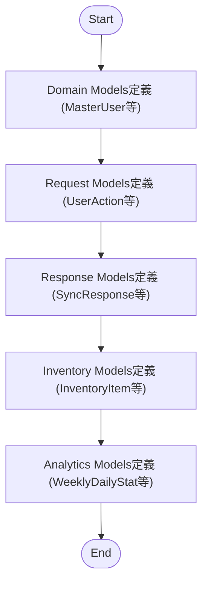
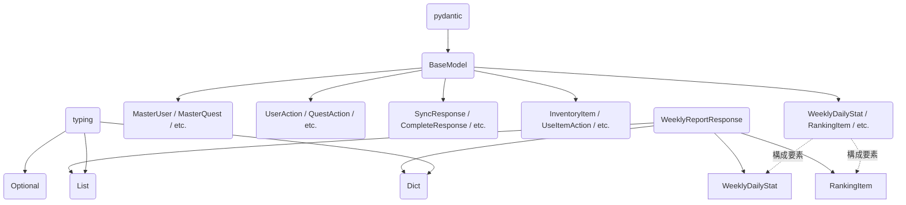

## 1. 解析メタ情報

| 項目 | 内容 |
| --- | --- |
| 対象ファイル | `MY_HOME_SYSTEM/models/quest.py` |
| 言語 | Python |
| 解析対象 | 提供されたコードのみ |
| 推測・補完 | 一切なし |

## 2. ファイルの概要

* このファイルは、システム内で使用される各種データ構造（ドメインモデル、リクエストモデル、レスポンスモデル、インベントリモデル、分析モデル）を定義する責務を持っている。
* 実行可能なロジックや関数は存在せず、`pydantic`の`BaseModel`を継承したクラスの定義のみで構成されている。

## 3. 外部依存関係

### インポート一覧

| 名称 | 種類 | 用途 | 根拠 |
| --- | --- | --- | --- |
| `BaseModel` | クラス | データモデル定義の親クラスとして使用 | `from pydantic import BaseModel` (行番号: 2 / 抜粋: "from pydantic import BaseModel") |
| `Optional` | 型ヒント | 任意（null許容）フィールドの型定義に使用 | `from typing import Optional` (行番号: 3, 4 / 抜粋: "from typing import Optional") |
| `List` | 型ヒント | リスト構造の型定義に使用 | `from typing import Optional, List, Dict` (行番号: 4 / 抜粋: "from typing import ... List...") |
| `Dict` | 型ヒント | 辞書構造の型定義に使用 | `from typing import Optional, List, Dict` (行番号: 4 / 抜粋: "from typing import ... Dict") |

### ブラックボックスとなる外部要素

| 名称 | 理由 | 根拠 |
| --- | --- | --- |
| 各モデルの利用先 | 本ファイルは定義のみであり、これらのモデルがどのAPIエンドポイントやDB操作で使用されるかについては、このファイルから読み取れないため。 | 処理ロジックやルーターの定義が存在しない (行番号: 全体 / 抜粋: "class ... (BaseModel):") |

## 4. 主要要素の定義（関数 / エンドポイント / コンポーネント）

※本ファイルには関数やエンドポイントは存在しないため、定義されているすべてのPydanticクラス（データモデル）を列挙します。

### `MasterUser`

* **役割**: Domain Modelsとしてユーザーの基本情報を定義する。
* 根拠: クラス名と継承元 (行番号: 10 / 抜粋: "class MasterUser(BaseModel):")

* **引数/リクエスト (フィールド)**: `user_id` (str), `name` (str), `job_class` (str), `level` (int, 初期値: 1), `exp` (int, 初期値: 0), `gold` (int, 初期値: 50), `avatar` (str, 初期値: '🙂'), `role` (Optional[str], 初期値: None)
* 根拠: フィールド定義 (行番号: 11〜18 / 抜粋: "level: int = 1" など)

* **戻り値/レスポンス**: 該当なし
* 根拠: データモデル定義のため (行番号: 10 / 抜粋: "class MasterUser(BaseModel):")

* **副作用**: なし
* 根拠: 処理ロジックを含まないため (行番号: 10〜18 / 抜粋: "class MasterUser(BaseModel):")

* **エラーハンドリング**: なし（明示的なバリデーション処理なし）
* 根拠: クラス内に例外処理の記述がないため (行番号: 10〜18 / 抜粋: "class MasterUser(BaseModel):")

### `MasterQuest`

* **役割**: Domain Modelsとしてクエスト情報を定義する。
* 根拠: クラス名と継承元 (行番号: 20 / 抜粋: "class MasterQuest(BaseModel):")

* **引数/リクエスト (フィールド)**: `id` (int), `title` (str), `desc` (Optional[str], 初期値: None), `type` (str), `target` (str, 初期値: 'all'), `exp` (int), `gold` (int), `icon` (str), `days` (Optional[str], 初期値: None), `start_date` (Optional[str], 初期値: None), `end_date` (Optional[str], 初期値: None), `chance` (Optional[float], 初期値: 1.0), `start_time` (Optional[str], 初期値: None), `end_time` (Optional[str], 初期値: None), `pre_requisite_quest_id` (Optional[int], 初期値: None), `reset_period` (Optional[str], 初期値: 'daily')
* 根拠: フィールド定義 (行番号: 21〜36 / 抜粋: "target: str = 'all'" など)

* **戻り値/レスポンス**: 該当なし
* 根拠: データモデル定義のため (行番号: 20 / 抜粋: "class MasterQuest(BaseModel):")

* **副作用**: なし
* 根拠: 処理ロジックを含まないため (行番号: 20〜36 / 抜粋: "class MasterQuest(BaseModel):")

* **エラーハンドリング**: なし
* 根拠: クラス内に例外処理の記述がないため (行番号: 20〜36 / 抜粋: "class MasterQuest(BaseModel):")

### `MasterReward`

* **役割**: Domain Modelsとして報酬情報を定義する。
* 根拠: クラス名と継承元 (行番号: 38 / 抜粋: "class MasterReward(BaseModel):")

* **引数/リクエスト (フィールド)**: `id` (int), `title` (str), `category` (str), `cost_gold` (int), `icon_key` (str), `desc` (Optional[str], 初期値: None), `target` (str, 初期値: "all")
* 根拠: フィールド定義 (行番号: 39〜45 / 抜粋: "target: str = "all"" など)

* **戻り値/レスポンス**: 該当なし
* 根拠: データモデル定義のため (行番号: 38 / 抜粋: "class MasterReward(BaseModel):")

* **副作用**: なし
* 根拠: 処理ロジックを含まないため (行番号: 38〜45 / 抜粋: "class MasterReward(BaseModel):")

* **エラーハンドリング**: なし
* 根拠: クラス内に例外処理の記述がないため (行番号: 38〜45 / 抜粋: "class MasterReward(BaseModel):")

### `MasterEquipment`

* **役割**: Domain Modelsとして装備情報を定義する。
* 根拠: クラス名と継承元 (行番号: 47 / 抜粋: "class MasterEquipment(BaseModel):")

* **引数/リクエスト (フィールド)**: `id` (int), `name` (str), `type` (str), `power` (int), `cost` (int), `icon` (str)
* 根拠: フィールド定義 (行番号: 48〜53 / 抜粋: "power: int" など)

* **戻り値/レスポンス**: 該当なし
* 根拠: データモデル定義のため (行番号: 47 / 抜粋: "class MasterEquipment(BaseModel):")

* **副作用**: なし
* 根拠: 処理ロジックを含まないため (行番号: 47〜53 / 抜粋: "class MasterEquipment(BaseModel):")

* **エラーハンドリング**: なし
* 根拠: クラス内に例外処理の記述がないため (行番号: 47〜53 / 抜粋: "class MasterEquipment(BaseModel):")

### `UserAction`

* **役割**: Request Modelsとしてユーザー固有のアクションリクエストを定義する。
* 根拠: コメントとクラス名 (行番号: 55〜56 / 抜粋: "# Request Models", "class UserAction(BaseModel):")

* **引数/リクエスト (フィールド)**: `user_id` (str)
* 根拠: フィールド定義 (行番号: 57 / 抜粋: "user_id: str")

* **戻り値/レスポンス**: 該当なし
* 根拠: データモデル定義のため (行番号: 56 / 抜粋: "class UserAction(BaseModel):")

* **副作用**: なし
* 根拠: 処理ロジックを含まないため (行番号: 56〜57 / 抜粋: "class UserAction(BaseModel):")

* **エラーハンドリング**: なし
* 根拠: クラス内に例外処理の記述がないため (行番号: 56〜57 / 抜粋: "class UserAction(BaseModel):")

### `QuestAction`

* **役割**: Request Modelsとしてクエストに関するアクションリクエストを定義する。
* 根拠: クラス名と継承元 (行番号: 59 / 抜粋: "class QuestAction(BaseModel):")

* **引数/リクエスト (フィールド)**: `user_id` (str), `quest_id` (int)
* 根拠: フィールド定義 (行番号: 60〜61 / 抜粋: "quest_id: int" など)

* **戻り値/レスポンス**: 該当なし
* 根拠: データモデル定義のため (行番号: 59 / 抜粋: "class QuestAction(BaseModel):")

* **副作用**: なし
* 根拠: 処理ロジックを含まないため (行番号: 59〜61 / 抜粋: "class QuestAction(BaseModel):")

* **エラーハンドリング**: なし
* 根拠: クラス内に例外処理の記述がないため (行番号: 59〜61 / 抜粋: "class QuestAction(BaseModel):")

### `RewardAction`

* **役割**: Request Modelsとして報酬に関するアクションリクエストを定義する。
* 根拠: クラス名と継承元 (行番号: 63 / 抜粋: "class RewardAction(BaseModel):")

* **引数/リクエスト (フィールド)**: `user_id` (str), `reward_id` (int)
* 根拠: フィールド定義 (行番号: 64〜65 / 抜粋: "reward_id: int" など)

* **戻り値/レスポンス**: 該当なし
* 根拠: データモデル定義のため (行番号: 63 / 抜粋: "class RewardAction(BaseModel):")

* **副作用**: なし
* 根拠: 処理ロジックを含まないため (行番号: 63〜65 / 抜粋: "class RewardAction(BaseModel):")

* **エラーハンドリング**: なし
* 根拠: クラス内に例外処理の記述がないため (行番号: 63〜65 / 抜粋: "class RewardAction(BaseModel):")

### `EquipAction`

* **役割**: Request Modelsとして装備に関するアクションリクエストを定義する。
* 根拠: クラス名と継承元 (行番号: 67 / 抜粋: "class EquipAction(BaseModel):")

* **引数/リクエスト (フィールド)**: `user_id` (str), `equipment_id` (int)
* 根拠: フィールド定義 (行番号: 68〜69 / 抜粋: "equipment_id: int" など)

* **戻り値/レスポンス**: 該当なし
* 根拠: データモデル定義のため (行番号: 67 / 抜粋: "class EquipAction(BaseModel):")

* **副作用**: なし
* 根拠: 処理ロジックを含まないため (行番号: 67〜69 / 抜粋: "class EquipAction(BaseModel):")

* **エラーハンドリング**: なし
* 根拠: クラス内に例外処理の記述がないため (行番号: 67〜69 / 抜粋: "class EquipAction(BaseModel):")

### `HistoryAction`

* **役割**: Request Modelsとして履歴に関するアクションリクエストを定義する。
* 根拠: クラス名と継承元 (行番号: 71 / 抜粋: "class HistoryAction(BaseModel):")

* **引数/リクエスト (フィールド)**: `user_id` (str), `history_id` (int)
* 根拠: フィールド定義 (行番号: 72〜73 / 抜粋: "history_id: int" など)

* **戻り値/レスポンス**: 該当なし
* 根拠: データモデル定義のため (行番号: 71 / 抜粋: "class HistoryAction(BaseModel):")

* **副作用**: なし
* 根拠: 処理ロジックを含まないため (行番号: 71〜73 / 抜粋: "class HistoryAction(BaseModel):")

* **エラーハンドリング**: なし
* 根拠: クラス内に例外処理の記述がないため (行番号: 71〜73 / 抜粋: "class HistoryAction(BaseModel):")

### `ApproveAction`

* **役割**: Request Modelsとして承認に関するアクションリクエストを定義する。
* 根拠: クラス名と継承元 (行番号: 75 / 抜粋: "class ApproveAction(BaseModel):")

* **引数/リクエスト (フィールド)**: `approver_id` (str), `history_id` (int)
* 根拠: フィールド定義 (行番号: 76〜77 / 抜粋: "approver_id: str" など)

* **戻り値/レスポンス**: 該当なし
* 根拠: データモデル定義のため (行番号: 75 / 抜粋: "class ApproveAction(BaseModel):")

* **副作用**: なし
* 根拠: 処理ロジックを含まないため (行番号: 75〜77 / 抜粋: "class ApproveAction(BaseModel):")

* **エラーハンドリング**: なし
* 根拠: クラス内に例外処理の記述がないため (行番号: 75〜77 / 抜粋: "class ApproveAction(BaseModel):")

### `UpdateUserAction`

* **役割**: Request Modelsとしてユーザー情報更新のアクションリクエストを定義する。
* 根拠: クラス名と継承元 (行番号: 79 / 抜粋: "class UpdateUserAction(BaseModel):")

* **引数/リクエスト (フィールド)**: `user_id` (str), `avatar_url` (str)
* 根拠: フィールド定義 (行番号: 80〜81 / 抜粋: "avatar_url: str" など)

* **戻り値/レスポンス**: 該当なし
* 根拠: データモデル定義のため (行番号: 79 / 抜粋: "class UpdateUserAction(BaseModel):")

* **副作用**: なし
* 根拠: 処理ロジックを含まないため (行番号: 79〜81 / 抜粋: "class UpdateUserAction(BaseModel):")

* **エラーハンドリング**: なし
* 根拠: クラス内に例外処理の記述がないため (行番号: 79〜81 / 抜粋: "class UpdateUserAction(BaseModel):")

### `SoundTestRequest`

* **役割**: Request Modelsとしてサウンドテスト用のリクエストを定義する。
* 根拠: クラス名と継承元 (行番号: 83 / 抜粋: "class SoundTestRequest(BaseModel):")

* **引数/リクエスト (フィールド)**: `sound_key` (str)
* 根拠: フィールド定義 (行番号: 84 / 抜粋: "sound_key: str")

* **戻り値/レスポンス**: 該当なし
* 根拠: データモデル定義のため (行番号: 83 / 抜粋: "class SoundTestRequest(BaseModel):")

* **副作用**: なし
* 根拠: 処理ロジックを含まないため (行番号: 83〜84 / 抜粋: "class SoundTestRequest(BaseModel):")

* **エラーハンドリング**: なし
* 根拠: クラス内に例外処理の記述がないため (行番号: 83〜84 / 抜粋: "class SoundTestRequest(BaseModel):")

### `SyncResponse`

* **役割**: Response Modelsとして同期処理のレスポンスを定義する。
* 根拠: コメントとクラス名 (行番号: 86〜87 / 抜粋: "# Response Models", "class SyncResponse(BaseModel):")

* **引数/リクエスト (フィールド)**: `status` (str), `message` (str)
* 根拠: フィールド定義 (行番号: 88〜89 / 抜粋: "status: str" など)

* **戻り値/レスポンス**: 該当なし
* 根拠: データモデル定義のため (行番号: 87 / 抜粋: "class SyncResponse(BaseModel):")

* **副作用**: なし
* 根拠: 処理ロジックを含まないため (行番号: 87〜89 / 抜粋: "class SyncResponse(BaseModel):")

* **エラーハンドリング**: なし
* 根拠: クラス内に例外処理の記述がないため (行番号: 87〜89 / 抜粋: "class SyncResponse(BaseModel):")

### `CompleteResponse`

* **役割**: Response Modelsとして完了時のレスポンスを定義する。
* 根拠: クラス名と継承元 (行番号: 91 / 抜粋: "class CompleteResponse(BaseModel):")

* **引数/リクエスト (フィールド)**: `status` (str), `leveledUp` (bool), `newLevel` (int), `earnedGold` (int), `earnedExp` (int), `earnedMedals` (int, 初期値: 0), `message` (Optional[str], 初期値: None), `bossEffect` (Optional[dict], 初期値: None)
* 根拠: フィールド定義 (行番号: 92〜99 / 抜粋: "bossEffect: Optional[dict] = None" など)

* **戻り値/レスポンス**: 該当なし
* 根拠: データモデル定義のため (行番号: 91 / 抜粋: "class CompleteResponse(BaseModel):")

* **副作用**: なし
* 根拠: 処理ロジックを含まないため (行番号: 91〜99 / 抜粋: "class CompleteResponse(BaseModel):")

* **エラーハンドリング**: なし
* 根拠: クラス内に例外処理の記述がないため (行番号: 91〜99 / 抜粋: "class CompleteResponse(BaseModel):")

### `CancelResponse`

* **役割**: Response Modelsとしてキャンセル時のレスポンスを定義する。
* 根拠: クラス名と継承元 (行番号: 101 / 抜粋: "class CancelResponse(BaseModel):")

* **引数/リクエスト (フィールド)**: `status` (str)
* 根拠: フィールド定義 (行番号: 102 / 抜粋: "status: str")

* **戻り値/レスポンス**: 該当なし
* 根拠: データモデル定義のため (行番号: 101 / 抜粋: "class CancelResponse(BaseModel):")

* **副作用**: なし
* 根拠: 処理ロジックを含まないため (行番号: 101〜102 / 抜粋: "class CancelResponse(BaseModel):")

* **エラーハンドリング**: なし
* 根拠: クラス内に例外処理の記述がないため (行番号: 101〜102 / 抜粋: "class CancelResponse(BaseModel):")

### `PurchaseResponse`

* **役割**: Response Modelsとして購入時のレスポンスを定義する。
* 根拠: クラス名と継承元 (行番号: 104 / 抜粋: "class PurchaseResponse(BaseModel):")

* **引数/リクエスト (フィールド)**: `status` (str), `newGold` (int)
* 根拠: フィールド定義 (行番号: 105〜106 / 抜粋: "newGold: int" など)

* **戻り値/レスポンス**: 該当なし
* 根拠: データモデル定義のため (行番号: 104 / 抜粋: "class PurchaseResponse(BaseModel):")

* **副作用**: なし
* 根拠: 処理ロジックを含まないため (行番号: 104〜106 / 抜粋: "class PurchaseResponse(BaseModel):")

* **エラーハンドリング**: なし
* 根拠: クラス内に例外処理の記述がないため (行番号: 104〜106 / 抜粋: "class PurchaseResponse(BaseModel):")

### `AdminBossUpdate`

* **役割**: 管理者によるボス情報の更新データを定義する。
* 根拠: クラス名と継承元 (行番号: 108 / 抜粋: "class AdminBossUpdate(BaseModel):")

* **引数/リクエスト (フィールド)**: `max_hp` (Optional[int], 初期値: None), `current_hp` (Optional[int], 初期値: None), `is_defeated` (Optional[bool], 初期値: None)
* 根拠: フィールド定義 (行番号: 109〜111 / 抜粋: "is_defeated: Optional[bool] = None" など)

* **戻り値/レスポンス**: 該当なし
* 根拠: データモデル定義のため (行番号: 108 / 抜粋: "class AdminBossUpdate(BaseModel):")

* **副作用**: なし
* 根拠: 処理ロジックを含まないため (行番号: 108〜111 / 抜粋: "class AdminBossUpdate(BaseModel):")

* **エラーハンドリング**: なし
* 根拠: クラス内に例外処理の記述がないため (行番号: 108〜111 / 抜粋: "class AdminBossUpdate(BaseModel):")

### `FamilyMileageUpdate`

* **役割**: 家族マイレージの更新データを定義する。
* 根拠: クラス名と継承元 (行番号: 113 / 抜粋: "class FamilyMileageUpdate(BaseModel):")

* **引数/リクエスト (フィールド)**: `target_name` (str), `target_exp` (int)
* 根拠: フィールド定義 (行番号: 114〜115 / 抜粋: "target_exp: int" など)

* **戻り値/レスポンス**: 該当なし
* 根拠: データモデル定義のため (行番号: 113 / 抜粋: "class FamilyMileageUpdate(BaseModel):")

* **副作用**: なし
* 根拠: 処理ロジックを含まないため (行番号: 113〜115 / 抜粋: "class FamilyMileageUpdate(BaseModel):")

* **エラーハンドリング**: なし
* 根拠: クラス内に例外処理の記述がないため (行番号: 113〜115 / 抜粋: "class FamilyMileageUpdate(BaseModel):")

### `InventoryItem`

* **役割**: Inventory Modelsとしてインベントリ内のアイテム情報を定義する。
* 根拠: コメントとクラス名 (行番号: 117〜118 / 抜粋: "# Inventory Models", "class InventoryItem(BaseModel):")

* **引数/リクエスト (フィールド)**: `id` (int), `reward_id` (int), `title` (str), `desc` (Optional[str], 初期値: None), `icon` (str), `status` (str), `purchased_at` (str), `used_at` (Optional[str], 初期値: None)
* 根拠: フィールド定義 (行番号: 119〜126 / 抜粋: "status: str         # owned, pending, consumed" など)

* **戻り値/レスポンス**: 該当なし
* 根拠: データモデル定義のため (行番号: 118 / 抜粋: "class InventoryItem(BaseModel):")

* **副作用**: なし
* 根拠: 処理ロジックを含まないため (行番号: 118〜126 / 抜粋: "class InventoryItem(BaseModel):")

* **エラーハンドリング**: なし
* 根拠: クラス内に例外処理の記述がないため (行番号: 118〜126 / 抜粋: "class InventoryItem(BaseModel):")

### `UseItemResponse`

* **役割**: Inventory Modelsとしてアイテム使用時のレスポンスを定義する。
* 根拠: クラス名と継承元 (行番号: 128 / 抜粋: "class UseItemResponse(BaseModel):")

* **引数/リクエスト (フィールド)**: `status` (str), `message` (str)
* 根拠: フィールド定義 (行番号: 129〜130 / 抜粋: "message: str" など)

* **戻り値/レスポンス**: 該当なし
* 根拠: データモデル定義のため (行番号: 128 / 抜粋: "class UseItemResponse(BaseModel):")

* **副作用**: なし
* 根拠: 処理ロジックを含まないため (行番号: 128〜130 / 抜粋: "class UseItemResponse(BaseModel):")

* **エラーハンドリング**: なし
* 根拠: クラス内に例外処理の記述がないため (行番号: 128〜130 / 抜粋: "class UseItemResponse(BaseModel):")

### `UseItemAction`

* **役割**: Inventory Modelsとしてアイテム使用時のアクションリクエストを定義する。
* 根拠: クラス名と継承元 (行番号: 132 / 抜粋: "class UseItemAction(BaseModel):")

* **引数/リクエスト (フィールド)**: `user_id` (str), `inventory_id` (int)
* 根拠: フィールド定義 (行番号: 133〜134 / 抜粋: "inventory_id: int" など)

* **戻り値/レスポンス**: 該当なし
* 根拠: データモデル定義のため (行番号: 132 / 抜粋: "class UseItemAction(BaseModel):")

* **副作用**: なし
* 根拠: 処理ロジックを含まないため (行番号: 132〜134 / 抜粋: "class UseItemAction(BaseModel):")

* **エラーハンドリング**: なし
* 根拠: クラス内に例外処理の記述がないため (行番号: 132〜134 / 抜粋: "class UseItemAction(BaseModel):")

### `ConsumeItemAction`

* **役割**: Inventory Modelsとしてアイテム消費時のアクションリクエスト（親の承認等）を定義する。
* 根拠: クラス名とフィールドコメント (行番号: 136〜137 / 抜粋: "class ConsumeItemAction(BaseModel):", "approver_id: str    # 親のID")

* **引数/リクエスト (フィールド)**: `approver_id` (str), `inventory_id` (int)
* 根拠: フィールド定義 (行番号: 137〜138 / 抜粋: "inventory_id: int" など)

* **戻り値/レスポンス**: 該当なし
* 根拠: データモデル定義のため (行番号: 136 / 抜粋: "class ConsumeItemAction(BaseModel):")

* **副作用**: なし
* 根拠: 処理ロジックを含まないため (行番号: 136〜138 / 抜粋: "class ConsumeItemAction(BaseModel):")

* **エラーハンドリング**: なし
* 根拠: クラス内に例外処理の記述がないため (行番号: 136〜138 / 抜粋: "class ConsumeItemAction(BaseModel):")

### `WeeklyDailyStat`

* **役割**: Analytics Modelsとして週次/日次の統計情報を定義する。
* 根拠: コメントとクラス名 (行番号: 140〜141 / 抜粋: "# Analytics Models", "class WeeklyDailyStat(BaseModel):")

* **引数/リクエスト (フィールド)**: `date` (str), `day_label` (str), `users` (Dict[str, Dict[str, int]])
* 根拠: フィールド定義 (行番号: 142〜144 / 抜粋: "users: Dict[str, Dict[str, int]]" など)

* **戻り値/レスポンス**: 該当なし
* 根拠: データモデル定義のため (行番号: 141 / 抜粋: "class WeeklyDailyStat(BaseModel):")

* **副作用**: なし
* 根拠: 処理ロジックを含まないため (行番号: 141〜144 / 抜粋: "class WeeklyDailyStat(BaseModel):")

* **エラーハンドリング**: なし
* 根拠: クラス内に例外処理の記述がないため (行番号: 141〜144 / 抜粋: "class WeeklyDailyStat(BaseModel):")

### `RankingItem`

* **役割**: Analytics Modelsとしてランキングの各項目情報を定義する。
* 根拠: クラス名と継承元 (行番号: 146 / 抜粋: "class RankingItem(BaseModel):")

* **引数/リクエスト (フィールド)**: `user_id` (str), `user_name` (str), `avatar` (str), `value` (int), `label` (str)
* 根拠: フィールド定義 (行番号: 147〜151 / 抜粋: "label: str          # 表示用単位など" など)

* **戻り値/レスポンス**: 該当なし
* 根拠: データモデル定義のため (行番号: 146 / 抜粋: "class RankingItem(BaseModel):")

* **副作用**: なし
* 根拠: 処理ロジックを含まないため (行番号: 146〜151 / 抜粋: "class RankingItem(BaseModel):")

* **エラーハンドリング**: なし
* 根拠: クラス内に例外処理の記述がないため (行番号: 146〜151 / 抜粋: "class RankingItem(BaseModel):")

### `WeeklyReportResponse`

* **役割**: Analytics Modelsとして週次レポートのレスポンスを定義する。
* 根拠: クラス名と継承元 (行番号: 153 / 抜粋: "class WeeklyReportResponse(BaseModel):")

* **引数/リクエスト (フィールド)**: `startDate` (str), `endDate` (str), `dailyStats` (List[WeeklyDailyStat]), `rankings` (Dict[str, List[RankingItem]]), `mvp` (Optional[RankingItem], 初期値: None), `mostPopularQuest` (Optional[str], 初期値: None)
* 根拠: フィールド定義 (行番号: 154〜159 / 抜粋: "dailyStats: List[WeeklyDailyStat]" など)

* **戻り値/レスポンス**: 該当なし
* 根拠: データモデル定義のため (行番号: 153 / 抜粋: "class WeeklyReportResponse(BaseModel):")

* **副作用**: なし
* 根拠: 処理ロジックを含まないため (行番号: 153〜159 / 抜粋: "class WeeklyReportResponse(BaseModel):")

* **エラーハンドリング**: なし
* 根拠: クラス内に例外処理の記述がないため (行番号: 153〜159 / 抜粋: "class WeeklyReportResponse(BaseModel):")

---

## 5. 処理フロー図

※本ファイルはクラスの宣言のみで実行されるロジックを持たないため、モデル定義がロードされる静的なフローを示します。

## 6. 依存関係図

## 7. 次のステップ（リバースエンジニアリングの提案）

| 優先度 | ファイル名(推測可) | 理由 | 根拠 |
| --- | --- | --- | --- |
| 高 | APIルーターファイル (例: `routers/quest.py`, `main.py`) | これらのRequest/Responseモデルがどのエンドポイントで実際に送受信されているかを特定するため。 | 本ファイル内にAPIのエンドポイント定義が存在しないため。 |
| 高 | DB操作ファイル (例: `crud.py`, `database.py` またはORMモデル) | Domain Models (例: `MasterUser`) がデータベースのどのテーブル・カラムと紐づいているか、またデータの永続化方法を特定するため。 | 本ファイルはPydanticのデータ検証モデルのみであり、DB接続やクエリ発行の記述がないため。 |

## 8. 保守上の注意点

* 多くのフィールドで `Optional` が使用されており、初期値として `None` が許容されている。データを扱うロジック側で null 安全性（`None` チェック）を確保しないと、`AttributeError` が発生する可能性がある。
* `typing.Optional` のインポートがファイルの3行目と4行目で重複して記述されている（`from typing import Optional` と `from typing import Optional, List, Dict`）。動作に影響はないが、整理の余地がある。
* バリデーター (`@validator` など) が一切定義されていないため、例えば `gold: int` に負の値が入るなど、Pydanticの型チェック（文字列から数値への暗黙的キャスト等）は通過してしまう。ビジネスロジック側での値の整合性チェックに依存している構造となっている。

## 9. 不明事項一覧

| 項目 | 理由 | 必要なファイル |
| --- | --- | --- |
| モデルの実際の使用箇所 | このファイルはデータ構造の定義のみであり、どのルーターや関数から呼び出されているか読み取れない。 | これらをインポートしているFastAPIのエンドポイントファイルやサービス層のファイル |
| データベーススキーマとのマッピング | SQLAlchemyなどのORMモデルが存在するか、あるいはこれらのPydanticモデルをそのままNoSQL等に保存しているかが不明。 | データベースモデル定義ファイルやCRUD操作の実装ファイル |
| Enumの未利用理由 | `status` (例: "owned, pending, consumed") や `reset_period` (例: "daily") が単なる `str` として定義されている。システム全体の仕様として固定文字列の検証をどこで行っているか不明。 | バリデーション処理やビジネスロジックを実装しているファイル |

## 10. 自己検証結果

* [x] 完了: 推測・外部ファイルの仕様を一切含んでいない
* [x] 完了: 全関数・全クラス・全コンポーネントを列挙した
* [x] 完了: 全てのインポート要素を列挙した
* [x] 完了: すべての仕様説明に「根拠（行番号・抜粋）」を明記した
* [x] 完了: 根拠漏れが0件である
* [x] 完了: Mermaid構文にエラーの原因となる記号（エスケープ漏れ）がない
* [x] 完了: 不明事項を漏れなく列挙した