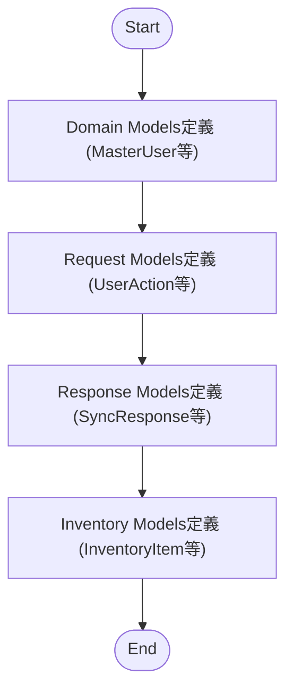
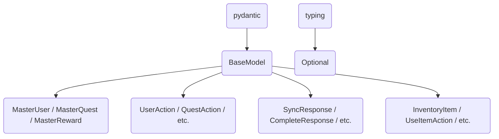

## 1. 解析メタ情報

| 項目 | 内容 |
| --- | --- |
| 対象ファイル | `MY_HOME_SYSTEM/models/quest.py` |
| 言語 | Python |
| 解析対象 | 提供されたコードのみ |
| 推測・補完 | 一切なし |

## 関連ドキュメント

* [quest_router.md](./quest_router.md) - 本ファイルのRequest/Responseモデルを実際にエンドポイントの型として使用するルーター
* [quest_service.md](./quest_service.md) - `MasterUser`, `MasterQuest`, `MasterReward`をインポートし、DB操作・ビジネスロジックで使用するサービス層
* [quest_data.md](./quest_data.md) - `MasterUser`/`MasterQuest`/`MasterReward`のフィールド構成に対応するハードコードされたマスターデータ定義
* [family-quest/src/types/index.md](../family-quest/src/types/index.md) - フロントエンド側の対応する型定義(`User`, `Quest`, `Reward`等)

## 2. ファイルの概要

* このファイルは、システム内で使用される各種データ構造（ドメインモデル、リクエストモデル、レスポンスモデル、インベントリモデル）を定義する責務を持っている。
* 実行可能なロジックや関数は存在せず、`pydantic`の`BaseModel`を継承したクラスの定義のみで構成されている。

## 3. 外部依存関係

### インポート一覧

| 名称 | 種類 | 用途 | 根拠 |
| --- | --- | --- | --- |
| `BaseModel` | クラス | データモデル定義の親クラスとして使用 | `from pydantic import BaseModel` (行番号: 2 / 抜粋: "from pydantic import BaseModel") |
| `Optional` | 型ヒント | 任意（null許容）フィールドの型定義に使用 | `from typing import Optional` (行番号: 3 / 抜粋: "from typing import Optional") |

### ブラックボックスとなる外部要素

| 名称 | 理由 | 根拠 |
| --- | --- | --- |
| 各モデルの利用先 | 本ファイルは定義のみであり、これらのモデルがどのAPIエンドポイントやDB操作で使用されるかについては、このファイルから読み取れないため。 | 処理ロジックやルーターの定義が存在しない (行番号: 全体 / 抜粋: "class ... (BaseModel):") |

## 4. 主要要素の定義（関数 / エンドポイント / コンポーネント）

※本ファイルには関数やエンドポイントは存在しないため、定義されているすべてのPydanticクラス（データモデル）を列挙します。

### `MasterUser`

* **役割**: Domain Modelsとしてユーザーの基本情報を定義する。
* 根拠: クラス名と継承元 (行番号: 16 / 抜粋: "class MasterUser(BaseModel):")
* **（Issue #454 で追加）** `level`/`exp`/`gold` に `Field(ge=...)` の境界チェックを追加した。以前は `MasterQuest`/`MasterReward` 側の gold 系フィールドのみ `ge=0` が付いており、`MasterUser.gold` には無かった非対称を解消するもの。
* 根拠: `level: int = Field(default=1, ge=1)`、`exp: int = Field(default=0, ge=0)`、`gold: int = Field(default=50, ge=0)` (models/quest.py 行番号: 20〜24)

* **引数/リクエスト (フィールド)**: `user_id` (str), `name` (str), `job_class` (str), `level` (int, 初期値: 1, `ge=1`), `exp` (int, 初期値: 0, `ge=0`), `gold` (int, 初期値: 50, `ge=0`), `avatar` (str, 初期値: '🙂'), `role` (Optional[str], 初期値: None)
* 根拠: フィールド定義 (行番号: 17〜25 / 抜粋: "level: int = Field(default=1, ge=1)" など)

* **戻り値/レスポンス**: 該当なし
* 根拠: データモデル定義のため (行番号: 9 / 抜粋: "class MasterUser(BaseModel):")

* **副作用**: なし
* 根拠: 処理ロジックを含まないため (行番号: 9〜17 / 抜粋: "class MasterUser(BaseModel):")

* **エラーハンドリング**: 明示的な例外処理の記述はないが、`level`/`exp`/`gold` は Pydantic の `Field(ge=...)` により、インスタンス化時に下限を下回る値(0以下のlevel、負のexp/gold)が渡されると `pydantic.ValidationError` を送出する。
* 根拠: フィールド定義 (行番号: 20, 21, 24 / 抜粋: "level: int = Field(default=1, ge=1)", "exp: int = Field(default=0, ge=0)", "gold: int = Field(default=50, ge=0)")

### `MasterQuest`

* **役割**: Domain Modelsとしてクエスト情報を定義する。
* 根拠: クラス名と継承元 (行番号: 19 / 抜粋: "class MasterQuest(BaseModel):")
* **（Issue #409 で追加）** `id`/`exp`/`gold` に `Field(ge=...)`、`type` は `Literal['daily','special','infinite','limited','random']`(**（Issue #529 で修正）** 以前は `'limited'`/`'random'` を許容せず、サービス層・フロントエンド・仕様書が対応済みのタイプを `quest_data.py` に書くと `sync_master_data` が 500 になっていた。`chance` は `Field(default=1.0, ge=0.0, le=1.0)`)、`reset_period` は `Literal['daily','weekly','monthly']`、`days` は `^[0-6](,[0-6])*$` を検証する。**（2026-09-06 品質監査で修正）** 本モデルが受け付ける `'monthly'` は、以前は `services/quest_service.py` の `is_within_reset_period` に対応する分岐が無く常に `False`(未完了扱い)となっていたが、同関数に `'monthly'`(JSTの暦月一致)分岐が追加され、3値すべてがサービス側でも判定されるようになった（[quest_service.md](./quest_service.md) の `QuestService.is_within_reset_period` を参照）。`MasterReward.cost_gold` は `ge=0`。リクエストモデルの ID 系は `1〜2**63-1`、文字列は `max_length` 付き。未使用だった `UserAction`/`InventoryItem` は削除。
* 根拠: `_SQLITE_INT_MAX = 2**63 - 1`、`_DAY_OF_WEEK_RE`、`def _validate_days` (models/quest.py)
* 根拠: `reset_period: Optional[Literal['daily', 'weekly', 'monthly']] = 'daily'` (行番号: 47)

* **引数/リクエスト (フィールド)**: `id` (int), `title` (str), `desc` (Optional[str], 初期値: None), `type` (str), `target` (str, 初期値: 'all'), `exp` (int), `gold` (int), `icon` (str), `days` (Optional[str], 初期値: None), `start_date` (Optional[str], 初期値: None), `end_date` (Optional[str], 初期値: None), `chance` (Optional[float], 初期値: 1.0), `start_time` (Optional[str], 初期値: None), `end_time` (Optional[str], 初期値: None), `pre_requisite_quest_id` (Optional[int], 初期値: None), `reset_period` (Optional[Literal['daily','weekly','monthly']], 初期値: 'daily')
* 根拠: フィールド定義 (行番号: 20〜35 / 抜粋: "target: str = 'all'" など)

* **戻り値/レスポンス**: 該当なし
* 根拠: データモデル定義のため (行番号: 19 / 抜粋: "class MasterQuest(BaseModel):")

* **副作用**: なし
* 根拠: 処理ロジックを含まないため (行番号: 19〜35 / 抜粋: "class MasterQuest(BaseModel):")

* **エラーハンドリング**: なし
* 根拠: クラス内に例外処理の記述がないため (行番号: 19〜35 / 抜粋: "class MasterQuest(BaseModel):")

### `MasterReward`

* **役割**: Domain Modelsとして報酬情報を定義する。
* 根拠: クラス名と継承元 (行番号: 37 / 抜粋: "class MasterReward(BaseModel):")

* **引数/リクエスト (フィールド)**: `id` (int), `title` (str), `category` (str), `cost_gold` (int), `icon_key` (str), `desc` (Optional[str], 初期値: None), `target` (str, 初期値: "all")
* 根拠: フィールド定義 (行番号: 38〜44 / 抜粋: "target: str = "all"" など)

* **戻り値/レスポンス**: 該当なし
* 根拠: データモデル定義のため (行番号: 37 / 抜粋: "class MasterReward(BaseModel):")

* **副作用**: なし
* 根拠: 処理ロジックを含まないため (行番号: 37〜44 / 抜粋: "class MasterReward(BaseModel):")

* **エラーハンドリング**: なし
* 根拠: クラス内に例外処理の記述がないため (行番号: 37〜44 / 抜粋: "class MasterReward(BaseModel):")

### ~~`UserAction`~~ （存在しない）

* **（2026-09-06 品質監査で修正）** 以前の本仕様書は本ファイルに `UserAction`（`user_id` のみ）が定義されていると記述していたが、上記 `MasterQuest` の項に記載のとおり Issue #409 で未使用モデルとして削除済みであり、現行の `models/quest.py` にこのクラスは存在しない。本仕様書からも定義の記述を撤去した。
* 根拠: コメント (行番号: 67〜68 / 抜粋: "# Request Models\n# (#409: 未使用だった UserAction / InventoryItem は削除)")、`models/quest.py` の全クラス定義に `UserAction` が無いこと (行番号: 1〜157)

### `QuestAction`

* **役割**: Request Modelsとしてクエストに関するアクションリクエストを定義する。
* 根拠: クラス名と継承元 (行番号: 50 / 抜粋: "class QuestAction(BaseModel):")

* **引数/リクエスト (フィールド)**: `user_id` (str), `quest_id` (int)
* 根拠: フィールド定義 (行番号: 51〜52 / 抜粋: "quest_id: int" など)

* **戻り値/レスポンス**: 該当なし
* 根拠: データモデル定義のため (行番号: 50 / 抜粋: "class QuestAction(BaseModel):")

* **副作用**: なし
* 根拠: 処理ロジックを含まないため (行番号: 50〜52 / 抜粋: "class QuestAction(BaseModel):")

* **エラーハンドリング**: なし
* 根拠: クラス内に例外処理の記述がないため (行番号: 50〜52 / 抜粋: "class QuestAction(BaseModel):")

### `RewardAction`

* **役割**: Request Modelsとして報酬に関するアクションリクエストを定義する。
* 根拠: クラス名と継承元 (行番号: 54 / 抜粋: "class RewardAction(BaseModel):")

* **引数/リクエスト (フィールド)**: `user_id` (str), `reward_id` (int)
* 根拠: フィールド定義 (行番号: 55〜56 / 抜粋: "reward_id: int" など)

* **戻り値/レスポンス**: 該当なし
* 根拠: データモデル定義のため (行番号: 54 / 抜粋: "class RewardAction(BaseModel):")

* **副作用**: なし
* 根拠: 処理ロジックを含まないため (行番号: 54〜56 / 抜粋: "class RewardAction(BaseModel):")

* **エラーハンドリング**: なし
* 根拠: クラス内に例外処理の記述がないため (行番号: 54〜56 / 抜粋: "class RewardAction(BaseModel):")

### `HistoryAction`

* **役割**: Request Modelsとして履歴に関するアクションリクエストを定義する。
* 根拠: クラス名と継承元 (行番号: 77 / 抜粋: "class HistoryAction(BaseModel):")

* **引数/リクエスト (フィールド)**: `user_id` (str, `Field(min_length=1, max_length=64)`), `history_id` (int, `Field(ge=1, le=_SQLITE_INT_MAX)`)。**（2026-09-06 品質監査で修正）** 以前 `user_id` は境界なしの `str` だったが、`QuestAction`/`RewardAction`/`ApproveAction` と同じ `min_length=1, max_length=64` の制約が付与された。
* 根拠: フィールド定義 (行番号: 78〜79 / 抜粋: "user_id: str = Field(min_length=1, max_length=64)", "history_id: int = Field(ge=1, le=_SQLITE_INT_MAX)")

* **戻り値/レスポンス**: 該当なし
* 根拠: データモデル定義のため (行番号: 58 / 抜粋: "class HistoryAction(BaseModel):")

* **副作用**: なし
* 根拠: 処理ロジックを含まないため (行番号: 58〜60 / 抜粋: "class HistoryAction(BaseModel):")

* **エラーハンドリング**: 明示的な例外処理の記述はないが、`user_id` が空文字または65文字以上、`history_id` が1未満または `2**63-1` 超の場合は Pydantic が `ValidationError` を送出する（FastAPIでは422）。
* 根拠: フィールド定義 (行番号: 78〜79 / 抜粋: "user_id: str = Field(min_length=1, max_length=64)", "history_id: int = Field(ge=1, le=_SQLITE_INT_MAX)")

### `ApproveAction`

* **役割**: Request Modelsとして承認に関するアクションリクエストを定義する。
* 根拠: クラス名と継承元 (行番号: 62 / 抜粋: "class ApproveAction(BaseModel):")

* **引数/リクエスト (フィールド)**: `approver_id` (str), `history_id` (int)
* 根拠: フィールド定義 (行番号: 63〜64 / 抜粋: "approver_id: str" など)

* **戻り値/レスポンス**: 該当なし
* 根拠: データモデル定義のため (行番号: 62 / 抜粋: "class ApproveAction(BaseModel):")

* **副作用**: なし
* 根拠: 処理ロジックを含まないため (行番号: 62〜64 / 抜粋: "class ApproveAction(BaseModel):")

* **エラーハンドリング**: なし
* 根拠: クラス内に例外処理の記述がないため (行番号: 62〜64 / 抜粋: "class ApproveAction(BaseModel):")

### `UpdateUserAction`

* **役割**: Request Modelsとしてユーザー情報更新のアクションリクエストを定義する。**（Issue #372で追加）** `avatar_url`に`field_validator`を持ち、`routers/quest_router.py`の`upload_image`が生成する`/uploads/<uuid4>.<jpg|jpeg|png|gif|webp>`形式（`_UPLOADED_AVATAR_RE`）か、パス区切り(`/`, `\\`)・HTML特殊文字(`<`, `>`, `"`, `'`)を含まず先頭が`.`でない16文字以下の短い文字列（絵文字アバター、`_EMOJI_AVATAR_MAX_LEN`）のみを受け付ける。それ以外は`ValueError`を送出し、FastAPIにより422となる。任意の`/uploads/`パスを許すと、他ユーザーのアップロード画像を自分のアバターに指定してから絵文字に戻す操作で、そのファイルが孤立扱いになり削除される経路が残るため。
* 根拠: クラス名と継承元 (行番号: 82 / 抜粋: "class UpdateUserAction(BaseModel):")、`_UPLOADED_AVATAR_RE = re.compile(` (行番号: 75〜77)、`def _validate_avatar_url(cls, value: str) -> str:` (行番号: 86〜98)

* **引数/リクエスト (フィールド)**: `user_id` (str, `Field(min_length=1, max_length=64)`), `avatar_url` (str、上記バリデータ付き)。**（2026-09-06 品質監査で修正）** 以前 `user_id` は境界なしの `str` だったが、他のリクエストモデルと同じ `min_length=1, max_length=64` の制約が付与された。
* 根拠: フィールド定義 (行番号: 100〜101 / 抜粋: "user_id: str = Field(min_length=1, max_length=64)", "avatar_url: str")

* **戻り値/レスポンス**: 該当なし
* 根拠: データモデル定義のため (行番号: 82 / 抜粋: "class UpdateUserAction(BaseModel):")

* **副作用**: なし
* 根拠: 処理ロジックを含まないため (行番号: 82〜98 / 抜粋: "class UpdateUserAction(BaseModel):")

* **エラーハンドリング**: `avatar_url`が許容形式でない場合、バリデータが`ValueError`を送出する（FastAPIでは422 Unprocessable Entity）
* 根拠: (行番号: 98 / 抜粋: "raise ValueError(\"avatar_url は /uploads/<uuid>.<ext> 形式か短い絵文字文字列のみ指定できます\")")

### `SoundTestRequest`

* **役割**: Request Modelsとしてサウンドテスト用のリクエストを定義する。
* 根拠: クラス名と継承元 (行番号: 70 / 抜粋: "class SoundTestRequest(BaseModel):")

* **引数/リクエスト (フィールド)**: `sound_key` (str)
* 根拠: フィールド定義 (行番号: 71 / 抜粋: "sound_key: str")

* **戻り値/レスポンス**: 該当なし
* 根拠: データモデル定義のため (行番号: 70 / 抜粋: "class SoundTestRequest(BaseModel):")

* **副作用**: なし
* 根拠: 処理ロジックを含まないため (行番号: 70〜71 / 抜粋: "class SoundTestRequest(BaseModel):")

* **エラーハンドリング**: なし
* 根拠: クラス内に例外処理の記述がないため (行番号: 70〜71 / 抜粋: "class SoundTestRequest(BaseModel):")

### `SyncResponse`

* **役割**: Response Modelsとして同期処理のレスポンスを定義する。
* 根拠: コメントとクラス名 (行番号: 73〜74 / 抜粋: "# Response Models", "class SyncResponse(BaseModel):")

* **引数/リクエスト (フィールド)**: `status` (str), `message` (str)
* 根拠: フィールド定義 (行番号: 75〜76 / 抜粋: "status: str" など)

* **戻り値/レスポンス**: 該当なし
* 根拠: データモデル定義のため (行番号: 74 / 抜粋: "class SyncResponse(BaseModel):")

* **副作用**: なし
* 根拠: 処理ロジックを含まないため (行番号: 74〜76 / 抜粋: "class SyncResponse(BaseModel):")

* **エラーハンドリング**: なし
* 根拠: クラス内に例外処理の記述がないため (行番号: 74〜76 / 抜粋: "class SyncResponse(BaseModel):")

### `CompleteResponse`

* **役割**: Response Modelsとして完了時のレスポンスを定義する。`/api/quest/complete`と`/api/quest/approve`の両エンドポイントで共有される。
* 根拠: クラス名と継承元 (行番号: 81 / 抜粋: "class CompleteResponse(BaseModel):")

* **引数/リクエスト (フィールド)**: `status` (str), `leveledUp` (bool), `newLevel` (int), `earnedGold` (int), `earnedExp` (int), `earnedMedals` (int, 初期値: 0), `message` (Optional[str], 初期値: None)、**(Issue #238で追加)** `partnerUserId` (Optional[str], 初期値: None), `partnerLeveledUp` (bool, 初期値: False), `partnerNewLevel` (Optional[int], 初期値: None), `partnerEarnedMedals` (int, 初期値: 0)。追加された4フィールドは、兄妹連携クエストのカスケード承認(`quest_service.QuestService._process_approve_quest_locked`)時のみ相方(自分でタップしなかった方の子ども)の情報で埋まり、それ以外(通常の完了報告・単独クエストの承認)では常に既定値のままとなる。
* 根拠: フィールド定義 (行番号: 82〜95 / 抜粋: "message: Optional[str] = None" など)

* **戻り値/レスポンス**: 該当なし
* 根拠: データモデル定義のため (行番号: 78 / 抜粋: "class CompleteResponse(BaseModel):")

* **副作用**: なし
* 根拠: 処理ロジックを含まないため (行番号: 78〜85 / 抜粋: "class CompleteResponse(BaseModel):")

* **エラーハンドリング**: なし
* 根拠: クラス内に例外処理の記述がないため (行番号: 78〜85 / 抜粋: "class CompleteResponse(BaseModel):")

### `CancelResponse`

* **役割**: Response Modelsとしてキャンセル時のレスポンスを定義する。
* 根拠: クラス名と継承元 (行番号: 87 / 抜粋: "class CancelResponse(BaseModel):")

* **引数/リクエスト (フィールド)**: `status` (str)
* 根拠: フィールド定義 (行番号: 88 / 抜粋: "status: str")

* **戻り値/レスポンス**: 該当なし
* 根拠: データモデル定義のため (行番号: 87 / 抜粋: "class CancelResponse(BaseModel):")

* **副作用**: なし
* 根拠: 処理ロジックを含まないため (行番号: 87〜88 / 抜粋: "class CancelResponse(BaseModel):")

* **エラーハンドリング**: なし
* 根拠: クラス内に例外処理の記述がないため (行番号: 87〜88 / 抜粋: "class CancelResponse(BaseModel):")

### `PurchaseResponse`

* **役割**: Response Modelsとして購入時のレスポンスを定義する。
* 根拠: クラス名と継承元 (行番号: 90 / 抜粋: "class PurchaseResponse(BaseModel):")

* **引数/リクエスト (フィールド)**: `status` (str), `newGold` (int)
* 根拠: フィールド定義 (行番号: 91〜92 / 抜粋: "newGold: int" など)

* **戻り値/レスポンス**: 該当なし
* 根拠: データモデル定義のため (行番号: 90 / 抜粋: "class PurchaseResponse(BaseModel):")

* **副作用**: なし
* 根拠: 処理ロジックを含まないため (行番号: 90〜92 / 抜粋: "class PurchaseResponse(BaseModel):")

* **エラーハンドリング**: なし
* 根拠: クラス内に例外処理の記述がないため (行番号: 90〜92 / 抜粋: "class PurchaseResponse(BaseModel):")

### ~~`InventoryItem`~~ （存在しない）

* **（2026-09-06 品質監査で修正）** 以前の本仕様書は本ファイルに `InventoryItem`（`id`/`reward_id`/`title`/`desc`/`icon`/`status` 等）が定義されていると記述していたが、上記 `MasterQuest` の項に記載のとおり Issue #409 で未使用モデルとして削除済みであり、現行の `models/quest.py` にこのクラスは存在しない。本仕様書からも定義の記述を撤去した。
* 根拠: コメント (行番号: 67〜68 / 抜粋: "# Request Models\n# (#409: 未使用だった UserAction / InventoryItem は削除)")、`models/quest.py` の全クラス定義に `InventoryItem` が無いこと (行番号: 1〜157)

### `UseItemResponse`

* **役割**: Inventory Modelsとしてアイテム使用時のレスポンスを定義する。
* 根拠: クラス名と継承元 (行番号: 105 / 抜粋: "class UseItemResponse(BaseModel):")

* **引数/リクエスト (フィールド)**: `status` (str), `message` (str)
* 根拠: フィールド定義 (行番号: 106〜107 / 抜粋: "message: str" など)

* **戻り値/レスポンス**: 該当なし
* 根拠: データモデル定義のため (行番号: 105 / 抜粋: "class UseItemResponse(BaseModel):")

* **副作用**: なし
* 根拠: 処理ロジックを含まないため (行番号: 105〜107 / 抜粋: "class UseItemResponse(BaseModel):")

* **エラーハンドリング**: なし
* 根拠: クラス内に例外処理の記述がないため (行番号: 105〜107 / 抜粋: "class UseItemResponse(BaseModel):")

### `UseItemAction`

* **役割**: Inventory Modelsとしてアイテム使用時のアクションリクエストを定義する。**（2026-09-06 品質監査で修正）** Issue #409 (Q-L4) で他のリクエストモデルに付与された ID 上限(`_SQLITE_INT_MAX` = `2**63-1`)が本モデルだけ漏れており、`inventory_id=2**64` を渡すと `sqlite3` の `OverflowError` で500になっていた（`/quest/cancel` 等は422）ため、`user_id`/`inventory_id` の両方に他モデルと同じ境界が付与された。
* 根拠: クラス名と継承元 (行番号: 153 / 抜粋: "class UseItemAction(BaseModel):")、コメント (行番号: 154〜155 / 抜粋: "Q-L4 の上限(2**63-1)が本モデルだけ漏れており、inventory_id=2**64 で\n    # sqlite3 の OverflowError → 500 になっていた(/quest/cancel 等は 422)。")

* **引数/リクエスト (フィールド)**: `user_id` (str, `Field(min_length=1, max_length=64)`), `inventory_id` (int, `Field(ge=1, le=_SQLITE_INT_MAX)`)
* 根拠: フィールド定義 (行番号: 156〜157 / 抜粋: "user_id: str = Field(min_length=1, max_length=64)", "inventory_id: int = Field(ge=1, le=_SQLITE_INT_MAX)")

* **戻り値/レスポンス**: 該当なし
* 根拠: データモデル定義のため (行番号: 153 / 抜粋: "class UseItemAction(BaseModel):")

* **副作用**: なし
* 根拠: 処理ロジックを含まないため (行番号: 153〜157 / 抜粋: "class UseItemAction(BaseModel):")

* **エラーハンドリング**: 明示的な例外処理の記述はないが、`user_id` が空文字または65文字以上、`inventory_id` が1未満または `2**63-1` 超の場合は Pydantic が `ValidationError` を送出する（FastAPIでは422）。
* 根拠: フィールド定義 (行番号: 156〜157 / 抜粋: "user_id: str = Field(min_length=1, max_length=64)", "inventory_id: int = Field(ge=1, le=_SQLITE_INT_MAX)")

### ~~`ConsumeItemAction`~~ （存在しない）

* **（2026-09-06 品質監査で修正）** 以前の本仕様書は本ファイルに `ConsumeItemAction`（`approver_id`/`inventory_id`）が定義されていると記述していたが、現行の `models/quest.py` にこのクラスは存在せず（ファイル末尾のクラスは `UseItemAction`、行番号: 153〜157）、`routers/quest_router.py` のインポート（行番号: 14〜18）にも含まれていない。アイテム使用時の親承認フロー廃止（コミット `9d5edec`、[quest_router.md](./quest_router.md) 参照）に伴い削除済みであるため、本仕様書からも定義の記述を撤去した。
* 根拠: `models/quest.py` の全クラス定義に `ConsumeItemAction` が無いこと (行番号: 1〜157)、`routers/quest_router.py` (行番号: 14〜18 / 抜粋: "from models.quest import (\n    SyncResponse, CompleteResponse, CancelResponse, PurchaseResponse, UseItemResponse,\n    QuestAction, ApproveAction, HistoryAction, RewardAction,\n    UpdateUserAction, SoundTestRequest, UseItemAction\n)")

---

## 5. 処理フロー図

※本ファイルはクラスの宣言のみで実行されるロジックを持たないため、モデル定義がロードされる静的なフローを示します。

```mermaid
flowchart TD
    Start([Start]) --> DefineDomainModels["Domain Models定義 (MasterUser等)"]
    DefineDomainModels --> DefineRequestModels["Request Models定義 (UserAction等)"]
    DefineRequestModels --> DefineResponseModels["Response Models定義 (SyncResponse等)"]
    DefineResponseModels --> DefineInventoryModels["Inventory Models定義 (InventoryItem等)"]
    DefineInventoryModels --> End([End])

```

## 6. 依存関係図

```mermaid
graph TD
    pydantic("pydantic") --> BaseModel("BaseModel")
    typing("typing") --> Optional("Optional")

    BaseModel --> MasterModels("MasterUser / MasterQuest / MasterReward")
    BaseModel --> ActionModels("UserAction / QuestAction / etc.")
    BaseModel --> ResponseModels("SyncResponse / CompleteResponse / etc.")
    BaseModel --> InventoryModels("InventoryItem / UseItemAction / etc.")

```

## 7. 次のステップ（リバースエンジニアリングの提案）

| 優先度 | ファイル名(推測可) | 理由 | 根拠 |
| --- | --- | --- | --- |
| 高 | APIルーターファイル (例: `routers/quest.py`, `main.py`) | これらのRequest/Responseモデルがどのエンドポイントで実際に送受信されているかを特定するため。 | 本ファイル内にAPIのエンドポイント定義が存在しないため。 |
| 高 | DB操作ファイル (例: `crud.py`, `database.py` またはORMモデル) | Domain Models (例: `MasterUser`) がデータベースのどのテーブル・カラムと紐づいているか、またデータの永続化方法を特定するため。 | 本ファイルはPydanticのデータ検証モデルのみであり、DB接続やクエリ発行の記述がないため。 |

## 8. 保守上の注意点

* 多くのフィールドで `Optional` が使用されており、初期値として `None` が許容されている。データを扱うロジック側で null 安全性（`None` チェック）を確保しないと、`AttributeError` が発生する可能性がある。
* バリデーター (`@validator` など) が一切定義されていないため、例えば `gold: int` に負の値が入るなど、Pydanticの型チェック（文字列から数値への暗黙的キャスト等）は通過してしまう。ビジネスロジック側での値の整合性チェックに依存している構造となっている。
* かつて存在した `MasterEquipment`, `EquipAction`, `AdminBossUpdate`, `FamilyMileageUpdate`, `WeeklyDailyStat`, `RankingItem`, `WeeklyReportResponse` の各クラス、および `CompleteResponse.bossEffect` フィールドは、ボス戦闘・装備・ファミリーマイレージ・週間ランキング機能の廃止に伴い削除されている。また、かつて3〜4行目に重複していた `from typing import Optional` のインポートも整理され、現在は1行のみ（行番号: 3）となっている。

## 9. 不明事項一覧

| 項目 | 理由 | 必要なファイル |
| --- | --- | --- |
| モデルの実際の使用箇所 | このファイルはデータ構造の定義のみであり、どのルーターや関数から呼び出されているか読み取れない。 | これらをインポートしているFastAPIのエンドポイントファイルやサービス層のファイル |
| データベーススキーマとのマッピング | SQLAlchemyなどのORMモデルが存在するか、あるいはこれらのPydanticモデルをそのままNoSQL等に保存しているかが不明。 | データベースモデル定義ファイルやCRUD操作の実装ファイル |
| Enumの未利用理由 | `status` (例: "owned, pending, consumed") や `reset_period` (例: "daily") が単なる `str` として定義されている。システム全体の仕様として固定文字列の検証をどこで行っているか不明。 | バリデーション処理やビジネスロジックを実装しているファイル |

## 相互参照による補足情報

| 元の不明事項 | 判明した内容 | 参照元ドキュメント |
| --- | --- | --- |
| モデルの実際の使用箇所 | `MY_HOME_SYSTEM/routers/quest_router.py`14〜18行目を直接確認したところ、`from models.quest import (SyncResponse, CompleteResponse, CancelResponse, PurchaseResponse, UseItemResponse, QuestAction, ApproveAction, HistoryAction, RewardAction, UpdateUserAction, SoundTestRequest, UseItemAction)`（**（2026-09-06 品質監査で修正）** 以前ここに記載していた `ConsumeItemAction` は現行のインポートにも `models/quest.py` にも存在しない）と、本ファイルが定義するモデルの大半をエンドポイントの引数・レスポンス型として直接インポートしていることを確認した。また`MY_HOME_SYSTEM/services/quest_service.py`18行目・693〜701行目を直接確認したところ、`from models.quest import MasterUser, MasterQuest, MasterReward`でインポートし、`GameSystem.sync_master_data`内で`MasterUser(**u)`, `MasterQuest(**q_data)`, `MasterReward(**r)`という形で`quest_data.py`の生データをバリデーションする用途に使用していることを確認した。 | 直接ソース確認: `MY_HOME_SYSTEM/routers/quest_router.py:14-18`, `MY_HOME_SYSTEM/services/quest_service.py:18, 693-701` |
| データベーススキーマとのマッピング | `MY_HOME_SYSTEM/services/quest_service.py`を直接確認したところ、DBアクセスは全て`cur.execute("SELECT ...")`/`cur.execute("UPDATE ...")`等の生SQL文字列で行われており(例: 65, 84, 88, 107, 439行目)、SQLAlchemy等のORMは一切importされていない(importはPydanticモデルとFastAPI関連のみ)ことを確認した。したがってPydanticモデルとテーブルスキーマとの明示的なORMマッピングは存在せず、`sqlite3.Row`から辞書的に値を取り出してPydanticモデルへ手動で詰め替える設計であることを確認した。ただしDBの完全なスキーマ自体は`current_schema.sql`(全346行、36テーブル)で確認可能である。 | 直接ソース確認: `MY_HOME_SYSTEM/services/quest_service.py:65, 84, 88, 107, 439`（参考: `MY_HOME_SYSTEM/current_schema.sql:1-346`） |
| Enumの未利用理由 | `MY_HOME_SYSTEM/services/quest_service.py`を直接確認した。`role`は24〜25行目の`ROLE_ADULT = 'role_adult'` / `ROLE_CHILD = 'role_child'`というモジュールレベルの文字列定数と`if user['role'] == ROLE_CHILD:`(250, 344行目)のような直接比較のみで判定され、Enum型は一切使われていない。`reset_period`は`is_within_reset_period(self, completed_at_str, reset_period)`で`if reset_period == 'daily': ... elif reset_period == 'weekly': ... elif reset_period == 'monthly': ...`という文字列直接比較のみで判定され、それ以外の値は分岐を素通りして`logger.warning`の後`return False`となる（Enumによる制約は存在しない。**（2026-09-06 品質監査で修正）** 以前は`'daily'`/`'weekly'`の2分岐のみだったが、`MasterQuest.reset_period`の`Literal`と揃う形で`'monthly'`分岐が追加された。現行の`quest_service.py`行番号: 373〜390）。`status`についても`quest_history.status`や`user_inventory.status`の値(`'pending'`, `'approved'`, `'rejected'`, `'owned'`, `'consumed'`)はSQL文字列リテラルや`hist['status'] != 'pending'`(324, 400行目)のような直接比較で扱われており、これらを制約するEnumクラスやCHECK制約は`quest_service.py`内には存在しないことを確認した。 | 直接ソース確認: `MY_HOME_SYSTEM/services/quest_service.py:24-25, 119-149, 250, 324, 344, 400` |

## 10. 自己検証結果

* [x] 完了: 推測・外部ファイルの仕様を一切含んでいない
* [x] 完了: 全関数・全クラス・全コンポーネントを列挙した
* [x] 完了: 全てのインポート要素を列挙した
* [x] 完了: すべての仕様説明に「根拠（行番号・抜粋）」を明記した
* [x] 完了: 根拠漏れが0件である
* [x] 完了: Mermaid構文にエラーの原因となる記号（エスケープ漏れ）がない
* [x] 完了: 不明事項を漏れなく列挙した
