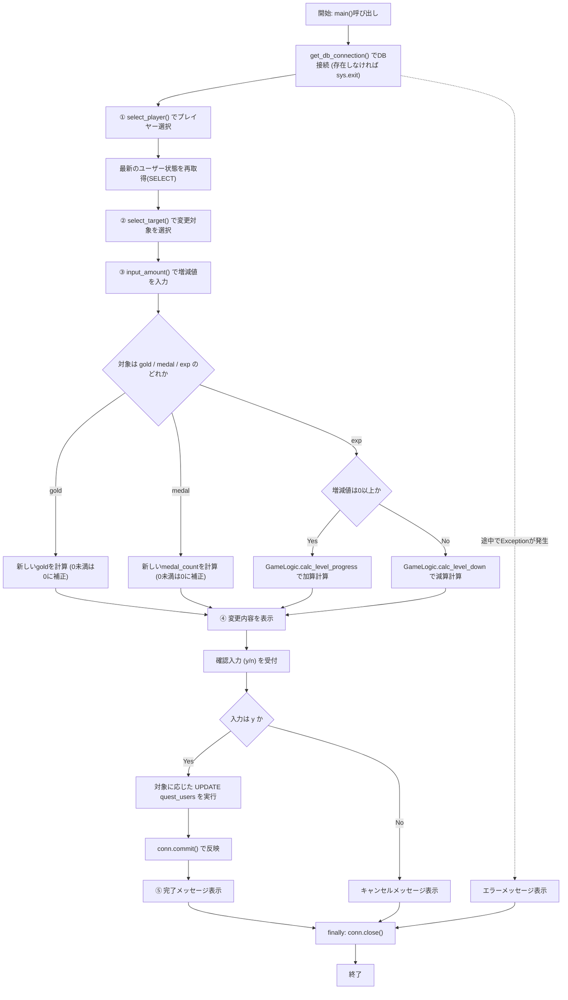
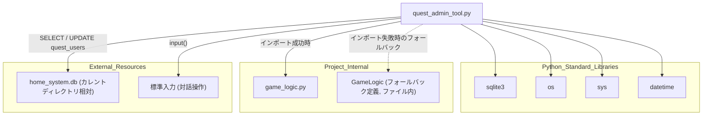

## 1. 解析メタ情報

| 項目 | 内容 |
| --- | --- |
| 対象ファイル | `quest_admin_tool.py` |
| 言語 | Python |
| 解析対象 | 提供されたコードのみ |
| 推測・補完 | 一切なし |

## 関連ドキュメント

* [game_logic.md](./game_logic.md) - `GameLogic.calc_level_progress`・`GameLogic.calc_level_down`を提供する本来のインポート元（インポート失敗時はファイル内にフォールバック実装を持つ）
* [quest_service.md](./quest_service.md) - `quest_users`テーブル（`gold`・`exp`・`level`・`medal_count`等）を扱う本番サービス側モジュールと推測され、本ツールが更新するデータの利用先として関連
* [init_unified_db.md](./init_unified_db.md) - `quest_users`テーブルを含むDBスキーマの初期構築を担うと推測される関連ドキュメント

## 2. ファイルの概要

対話式のコマンドライン管理ツール。`home_system.db`に直接接続し、標準入力(`input`)を通じてプレイヤー（`quest_users`）を選択し、変更対象（所持金`gold`／経験値`exp`／メダル`medal_count`）を選択し、増減値を入力させ、内容確認後にDBへ反映する一連の対話フローを`main`関数として実装する。`game_logic`モジュールが見つからない場合に備えたフォールバック用の簡易`GameLogic`クラスも定義している。

* 根拠: `[game_logicインポートとフォールバック]` (行番号: 9〜18 / 抜粋: "try:\n    from game_logic import GameLogic\nexcept ImportError:\n    print(\"⚠️ 警告: game_logic.py が見つかりません。...")
* 根拠: `[DB_PATH定義]` (行番号: 21 / 抜粋: "DB_PATH = \"home_system.db\"")
* 根拠: `[mainの対話フロー]` (行番号: 93〜108 / 抜粋: "user = select_player(cursor)" ... "target = select_target()" ... "amount = input_amount(target['label'])")
* 根拠: `[DB反映]` (行番号: 149〜163 / 抜粋: "if confirm == 'y':\n            now = datetime.datetime.now().isoformat()")

## 3. 外部依存関係

### インポート一覧

| 名称 | 種類 | 用途 | 根拠 |
| --- | --- | --- | --- |
| `sqlite3` | 標準ライブラリ | SQLiteデータベースへの接続・カーソル生成・SQL実行 | 根拠: `[import sqlite3]` (行番号: 1 / 抜粋: "import sqlite3") |
| `os` | 標準ライブラリ | 実行ファイルの絶対パス・ディレクトリ取得（`sys.path`への追加用） | 根拠: `[os.path.dirname(os.path.abspath(__file__))]` (行番号: 7 / 抜粋: "sys.path.append(os.path.dirname(os.path.abspath(__file__)))") |
| `sys` | 標準ライブラリ | モジュール検索パスへのカレントディレクトリ追加、および異常終了(`sys.exit`) | 根拠: `[sys.path.append / sys.exit]` (行番号: 7, 26, 36 / 抜粋: "sys.path.append(os.path.dirname(os.path.abspath(__file__)))") |
| `datetime` | 標準ライブラリ | 更新日時(`updated_at`)としてのISO形式現在時刻の生成 | 根拠: `[datetime.datetime.now().isoformat()]` (行番号: 150 / 抜粋: "now = datetime.datetime.now().isoformat()") |
| `GameLogic` | 内部モジュール（`game_logic`、インポート失敗時はファイル内フォールバック定義） | 経験値加算時のレベル進行計算(`calc_level_progress`)およびレベル減少計算(`calc_level_down`)の提供 | 根拠: `[from game_logic import GameLogic]` (行番号: 10 / 抜粋: "from game_logic import GameLogic") |

### ブラックボックスとなる外部要素

| 名称 | 理由 | 根拠 |
| --- | --- | --- |
| `game_logic.GameLogic`の本来の実装（インポート成功時） | `game_logic`モジュールのソースコードが当ファイル内に存在しないため、`calc_level_progress`・`calc_level_down`の本来のレベル計算ロジックが不明であるため（フォールバック実装のみ当ファイル内で確認可能）。 | 根拠: `[from game_logic import GameLogic]` (行番号: 10 / 抜粋: "from game_logic import GameLogic") |
| `quest_users`テーブルの完全なスキーマ | `user_id`・`name`・`level`・`gold`・`medal_count`・`exp`・`updated_at`以外のカラム構成が当ファイル内には存在しないため。 | 根拠: `[SELECT文]` (行番号: 31 / 抜粋: "cursor.execute(\"SELECT user_id, name, level, gold, medal_count FROM quest_users\")") |

## 4. 主要要素の定義（関数 / エンドポイント / コンポーネント）

### `GameLogic`（フォールバック定義、`game_logic`インポート失敗時のみ有効）

* **役割**: `game_logic`モジュールが見つからない場合に使用される簡易的な代替クラス。経験値加算・減算に伴うレベル計算のダミー実装を提供する。
* 根拠: `[GameLogicクラス定義]` (行番号: 13〜18 / 抜粋: "# フォールバック用の簡易ロジック\n    class GameLogic:\n        @staticmethod\n        def calc_level_progress(lvl, exp, add): return lvl, exp + add, False\n        @staticmethod\n        def calc_level_down(lvl, exp, rem): return lvl, max(0, exp - rem)")

* **引数/リクエスト**: `calc_level_progress(lvl, exp, add)` - 現在レベル・現在経験値・加算量。`calc_level_down(lvl, exp, rem)` - 現在レベル・現在経験値・減算量。
* 根拠: `[静的メソッドのシグネチャ]` (行番号: 16, 18 / 抜粋: "def calc_level_progress(lvl, exp, add): return lvl, exp + add, False" / "def calc_level_down(lvl, exp, rem): return lvl, max(0, exp - rem)")

* **戻り値/レスポンス**: `calc_level_progress`は`(lvl, exp + add, False)`のタプル（レベルは変化させず、経験値のみ加算し、レベルアップフラグは常に`False`）。`calc_level_down`は`(lvl, max(0, exp - rem))`のタプル（レベルは変化させず、経験値のみ0を下限に減算）。
* 根拠: `[戻り値]` (行番号: 16, 18 / 抜粋: "return lvl, exp + add, False" / "return lvl, max(0, exp - rem)")

* **副作用**: なし
* 根拠: `[メソッド本体]` (行番号: 16, 18 / 抜粋: "return lvl, exp + add, False")

* **エラーハンドリング**: なし
* 根拠: `[メソッド本体]` (行番号: 16, 18 / 抜粋: "return lvl, exp + add, False")

### `get_db_connection`

* **役割**: `DB_PATH`（`home_system.db`）が存在するか確認し、存在しなければエラーメッセージを表示して終了、存在すればSQLite接続を返す。
* 根拠: `[get_db_connection定義]` (行番号: 23〜27 / 抜粋: "def get_db_connection():\n    if not os.path.exists(DB_PATH):")

* **引数/リクエスト**: なし
* 根拠: `[関数シグネチャ]` (行番号: 23 / 抜粋: "def get_db_connection():")

* **戻り値/レスポンス**: `sqlite3.Connection`（DBファイルが存在する場合）
* 根拠: `[return文]` (行番号: 27 / 抜粋: "return sqlite3.connect(DB_PATH)")

* **副作用**: DBファイル不在時に`sys.exit(1)`によるプロセス終了。
* 根拠: `[sys.exit(1)]` (行番号: 25〜26 / 抜粋: "print(f\"❌ エラー: データベース ({DB_PATH}) が見つかりません。MY_HOME_SYSTEMフォルダ内で実行してください。\")\n        sys.exit(1)")

* **エラーハンドリング**: 例外の`try`/`except`は用いず、`os.path.exists`による事前チェックと`sys.exit`で異常系を処理する。
* 根拠: `[os.path.exists判定]` (行番号: 24 / 抜粋: "if not os.path.exists(DB_PATH):")

### `select_player`

* **役割**: `quest_users`テーブルから全ユーザーを取得し番号付きで一覧表示、標準入力でユーザーの選択番号を受け付け、対応するレコードのタプルを返す。有効な番号が入力されるまで再入力を促す。
* 根拠: `[select_player定義とSELECT文]` (行番号: 29〜31 / 抜粋: "def select_player(cursor):\n    \"\"\"① プレイヤーを選択\"\"\"\n    cursor.execute(\"SELECT user_id, name, level, gold, medal_count FROM quest_users\")")

* **引数/リクエスト**: `cursor` (型: 明示なし、暗黙的に`sqlite3.Cursor`。`quest_users`を検索するためのDBカーソル)
* 根拠: `[関数シグネチャ]` (行番号: 29 / 抜粋: "def select_player(cursor):")

* **戻り値/レスポンス**: 選択された1ユーザーのタプル `(user_id, name, level, gold, medal_count)`。ユーザーが1件も存在しない場合は`sys.exit()`によりプロセスを終了するため関数として値を返さない。
* 根拠: `[return文]` (行番号: 48 / 抜粋: "return users[idx]")
* 根拠: `[ユーザー不在時のsys.exit]` (行番号: 34〜36 / 抜粋: "if not users:\n        print(\"ユーザーが見つかりません。\")\n        sys.exit()")

* **副作用**: 標準出力へのユーザー一覧表示、標準入力(`input`)によるブロッキング待機。
* 根拠: `[input呼び出し]` (行番号: 45 / 抜粋: "choice = input(\"\\n番号を入力してください: \")")

* **エラーハンドリング**: `int(choice)`変換時の`ValueError`を捕捉して`pass`し、無効な番号が入力された場合はメッセージを表示して`while True`ループにより再入力を促す（無限ループで正しい入力を待つ）。
* 根拠: `[except ValueError]` (行番号: 49〜51 / 抜粋: "except ValueError:\n            pass\n        print(\"無効な番号です。もう一度入力してください。\")")

### `select_target`

* **役割**: 変更可能な対象項目（所持金・経験値・ちいさなメダル）の一覧を定義・表示し、標準入力で選択番号を受け付け、対応する対象定義の辞書を返す。有効な番号が入力されるまで再入力を促す。
* 根拠: `[select_target定義とtargets定義]` (行番号: 53〜59 / 抜粋: "def select_target():\n    \"\"\"② 対象を選択\"\"\"\n    targets = [\n        {\"key\": \"gold\", \"label\": \"所持金 (Gold)\", \"column\": \"gold\", \"unit\": \"G\"},")

* **引数/リクエスト**: なし
* 根拠: `[関数シグネチャ]` (行番号: 53 / 抜粋: "def select_target():")

* **戻り値/レスポンス**: 選択された対象を表す辞書（キー: `key`・`label`・`column`・`unit`）
* 根拠: `[return文]` (行番号: 70 / 抜粋: "return targets[idx]")

* **副作用**: 標準出力への選択肢一覧表示、標準入力(`input`)によるブロッキング待機。
* 根拠: `[input呼び出し]` (行番号: 67 / 抜粋: "choice = input(\"\\n番号を入力してください: \")")

* **エラーハンドリング**: `int(choice)`変換時の`ValueError`を捕捉して`pass`し、無効な番号が入力された場合はメッセージを表示して再入力を促す。
* 根拠: `[except ValueError]` (行番号: 71〜73 / 抜粋: "except ValueError:\n            pass\n        print(\"無効な番号です。\")")

### `input_amount`

* **役割**: 指定ラベルの増減値入力プロンプトを表示し、標準入力から整数値を受け付け返す。整数変換に失敗した場合は再入力を促す。
* 根拠: `[input_amount定義]` (行番号: 75〜77 / 抜粋: "def input_amount(target_label):\n    \"\"\"③ 増減値を入力\"\"\"\n    print(f\"\\n--- ③ 増減値の入力 ({target_label}) ---\")")

* **引数/リクエスト**: `target_label` (型: 明示なし、暗黙的に`str`。プロンプトに表示する対象項目のラベル)
* 根拠: `[関数シグネチャ]` (行番号: 75 / 抜粋: "def input_amount(target_label):")

* **戻り値/レスポンス**: 入力された整数値（`int`）
* 根拠: `[return文]` (行番号: 84 / 抜粋: "return int(val)")

* **副作用**: 標準出力へのプロンプト表示、標準入力(`input`)によるブロッキング待機。
* 根拠: `[input呼び出し]` (行番号: 83 / 抜粋: "val = input(\"値を入力してください: \")")

* **エラーハンドリング**: `int(val)`変換時の`ValueError`を捕捉し、「整数を入力してください。」と表示して`while True`ループで再入力を促す。
* 根拠: `[except ValueError]` (行番号: 85〜86 / 抜粋: "except ValueError:\n            print(\"整数を入力してください。\")")

### `main`

* **役割**: DB接続を確立し、プレイヤー選択(①)→対象選択(②)→増減値入力(③)→変更内容の確認表示(④)→ユーザーの`y/n`確認に基づくDB反映(⑤)という一連の対話フローを制御する、本ツールのエントリーポイント。
* 根拠: `[main定義とフロー全体]` (行番号: 88〜163 / 抜粋: "def main():\n    conn = get_db_connection()\n    cursor = conn.cursor()")

* **引数/リクエスト**: なし
* 根拠: `[関数シグネチャ]` (行番号: 88 / 抜粋: "def main():")

* **戻り値/レスポンス**: なし。処理結果は全て標準出力への`print`表示。
* 根拠: `[print出力]` (行番号: 138〜144, 163, 165 / 抜粋: "print(\"\\n\" + \"=\"*40)\n        print(\"   ④ 変更内容の確認\")")

* **副作用**: `select_player`・`select_target`・`input_amount`の呼び出しによる標準入力の読み取り、選択された対象（`gold`/`medal_count`/`level`と`exp`）に応じた`UPDATE quest_users`の実行、`conn.commit()`によるDB永続化、`conn.close()`による接続クローズ。
* 根拠: `[UPDATE文の分岐]` (行番号: 152〜160 / 抜粋: "if target['key'] == 'gold':\n                cursor.execute(\"UPDATE quest_users SET gold=?, updated_at=? WHERE user_id=?\",")
* 根拠: `[commit/close]` (行番号: 162, 170 / 抜粋: "conn.commit()" / "conn.close()")

* **エラーハンドリング**: 処理全体を`try`ブロックで囲み、`Exception`を捕捉してエラーメッセージを`print`表示する（再送出なし）。`finally`節で常に`conn.close()`を実行する。ユーザーが確認プロンプトで`'y'`以外を入力した場合はDB更新をキャンセルする分岐処理を持つ。
* 根拠: `[except Exception]` (行番号: 167〜168 / 抜粋: "except Exception as e:\n        print(f\"\\n❌ エラーが発生しました: {e}\")")
* 根拠: `[finally節]` (行番号: 169〜170 / 抜粋: "finally:\n        conn.close()")
* 根拠: `[キャンセル分岐]` (行番号: 164〜165 / 抜粋: "else:\n            print(\"\\n❌ キャンセルしました。変更は行われませんでした。\")")

## 5. 処理フロー図

## 6. 依存関係図

## 7. 次のステップ（リバースエンジニアリングの提案）

| 優先度 | ファイル名(推測可) | 理由 | 根拠 |
| --- | --- | --- | --- |
| 高 | `game_logic.py` | `GameLogic.calc_level_progress`・`calc_level_down`の本来のレベル計算ロジック（フォールバック実装との差異）を確認するため。 | 根拠: `[from game_logic import GameLogic]` (行番号: 10 / 抜粋: "from game_logic import GameLogic") |
| 中 | `quest_service.py` | `quest_users`テーブルの`gold`・`exp`・`level`・`medal_count`が本番サービス側でどのように参照されるかを確認するため。 | 根拠: `[quest_usersへのSELECT/UPDATE]` (行番号: 31, 153, 156, 159 / 抜粋: "cursor.execute(\"SELECT user_id, name, level, gold, medal_count FROM quest_users\")") |
| 低 | `init_unified_db.py` | `quest_users`テーブルの完全なスキーマを確認するため。 | 根拠: `[quest_usersテーブル名]` (行番号: 31 / 抜粋: "FROM quest_users") |

## 8. 保守上の注意点

* **広範な例外の握りつぶし**: `main`関数の`except Exception as e`が処理全体を捕捉しメッセージ表示のみに留め、再送出しないため、想定外のエラー発生時も原因の詳細な追跡が困難。
* 根拠: `[except Exception]` (行番号: 167〜168 / 抜粋: "except Exception as e:\n            print(f\"\\n❌ エラーが発生しました: {e}\")")
* **相対パスによるDB指定**: `DB_PATH = \"home_system.db\"`が相対パスであり、実行時カレントディレクトリに依存する。エラーメッセージでも「MY_HOME_SYSTEMフォルダ内で実行してください」と明示的に案内しており、誤った場所からの実行が想定される運用上のリスクとして意識されている。
* 根拠: `[DB_PATHおよびエラーメッセージ]` (行番号: 21, 25 / 抜粋: "DB_PATH = \"home_system.db\"" / "print(f\"❌ エラー: データベース ({DB_PATH}) が見つかりません。MY_HOME_SYSTEMフォルダ内で実行してください。\")")
* **`select_player`・`select_target`・`input_amount`の無限入力ループ**: いずれも`while True`ループで有効な入力が得られるまで再入力を要求する構造であり、対話的実行以外（自動化スクリプト等からの呼び出し）では正常終了しない可能性がある。
* 根拠: `[while Trueループ]` (行番号: 43, 65, 81 / 抜粋: "while True:\n        try:\n            choice = input(\"\\n番号を入力してください: \")")
* **フォールバック`GameLogic`のレベル計算が簡易的**: `calc_level_progress`はレベルアップ判定を常に`False`固定で返し、`calc_level_down`もレベルは変化させない実装であるため、`game_logic.py`が見つからない環境ではレベル変動を伴う経験値計算が正しく行われない（コード内コメントでも明示的に警告されている）。
* 根拠: `[フォールバック実装とコメント]` (行番号: 12, 16, 18 / 抜粋: "print(\"⚠️ 警告: game_logic.py が見つかりません。経験値のレベル計算が正しく動作しない可能性があります。\")" / "def calc_level_progress(lvl, exp, add): return lvl, exp + add, False")

## 9. 不明事項一覧

| 項目 | 理由 | 必要なファイル |
| --- | --- | --- |
| `game_logic.GameLogic`本来の実装 | `game_logic`モジュールのソースコードが当ファイル内に存在せず、フォールバック実装との挙動差異が不明であるため。 | `game_logic.py` |
| `quest_users`テーブルの完全なスキーマ | `user_id`・`name`・`level`・`gold`・`medal_count`・`exp`・`updated_at`以外のカラム構成が当ファイル内には存在しないため。 | `init_unified_db.py`等のスキーマ定義ファイル |
| 本ツールの想定実行者・実行頻度 | 対話式CLIツールとしての運用ルール（誰が、どのような場面で実行するか）が当ファイル内に記述されていないため。（リポジトリ内を`quest_admin_tool`で検索したところ`docs/specifications/MY_HOME_SYSTEM/README.md`に概要説明があるのみで、運用ルール（実行者・実行頻度）を定めた文書は見つからず、解消不可） | 運用手順書 |

## 相互参照による補足情報

| 元の不明事項 | 判明した内容 | 参照元ドキュメント |
| --- | --- | --- |
| `game_logic.GameLogic`本来の実装 | `MY_HOME_SYSTEM/game_logic.py`を直接確認した。`GameLogic`クラス(6〜79行目)は`calc_level_progress(current_level, current_exp, added_exp)`(23〜40行目、`total_exp = current_exp + added_exp`を`calculate_next_level_exp(level) = floor(100 * 1.2^(level-1))`が返す閾値と比較しながらレベルアップを判定し`(new_level, new_exp, leveled_up)`を返す)と`calc_level_down(current_level, current_exp, removed_exp)`(43〜61行目、経験値がマイナスになった場合にレベルを1まで下げつつ前レベルの必要経験値を繰り戻す)を持つ、DB接続を行わない純粋な計算クラスであることを確認した。`quest_admin_tool.py`10〜14行目のフォールバック実装（`import`失敗時に警告を出すダミークラス）とは異なり、実体は本物のレベル計算式を持つことを確認した。 | 直接ソース確認: `MY_HOME_SYSTEM/game_logic.py:6-61` |
| `quest_users`テーブルの完全なスキーマ | `MY_HOME_SYSTEM/current_schema.sql`164〜171行目の`CREATE TABLE quest_users`を直接確認した。`user_id TEXT PRIMARY KEY, name TEXT, job_class TEXT, level INTEGER DEFAULT 1, exp INTEGER DEFAULT 0, gold INTEGER DEFAULT 0, updated_at DATETIME, avatar TEXT DEFAULT '🙂', medal_count INTEGER DEFAULT 0, role TEXT`という10カラム構成であり、`quest_admin_tool.py`が参照する`user_id`・`name`・`level`・`gold`・`medal_count`・`exp`・`updated_at`に加えて`job_class`, `avatar`, `role`カラムが存在することを確認した。 | 直接ソース確認: `MY_HOME_SYSTEM/current_schema.sql:164-171` |

## 10. 自己検証結果

* [x] 推測・外部ファイルの仕様を一切含んでいない（完了）
* [x] 全関数・全クラス・全コンポーネントを列挙した（完了）
* [x] 全てのインポート要素を列挙した（完了）
* [x] すべての仕様説明に「根拠（行番号・抜粋）」を明記した（完了）
* [x] 根拠漏れが0件である（完了）
* [x] Mermaid構文にエラーの原因となる記号（エスケープ漏れ）がない（完了）
* [x] 不明事項を漏れなく列挙した（完了）
