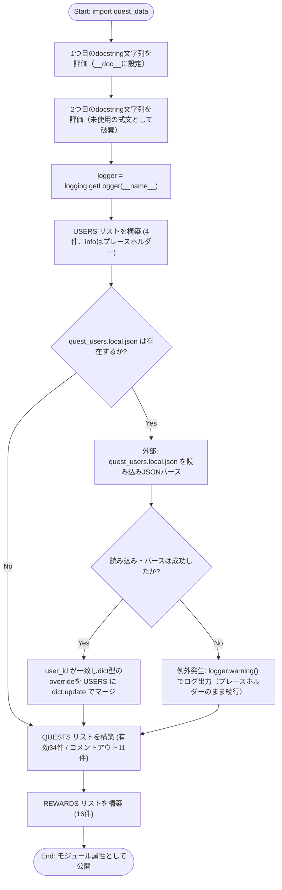
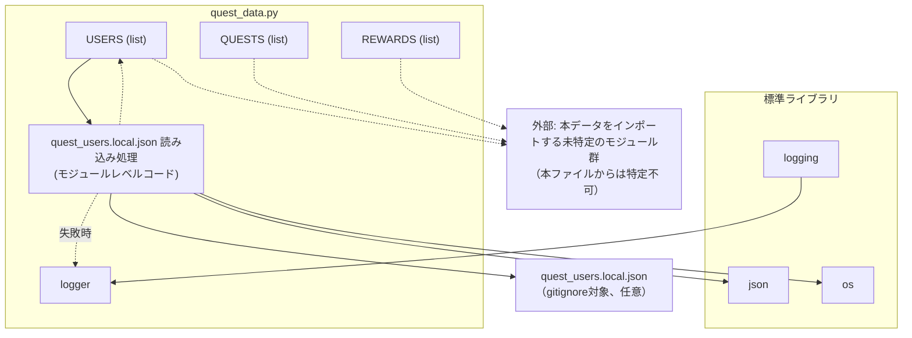

## 1. 解析メタ情報

| 項目 | 内容 |
| --- | --- |
| 対象ファイル | `quest_data.py` |
| 言語 | Python |
| 解析対象 | 提供されたコードのみ |
| 推測・補完 | 一切なし |
| 解析基準コミット | `eee72ac` (+同一ブランチ内で**大人用「きょうのすごろく」へのデイリークエスト移設・実態に合わせたクエスト整理・パパのリセット系2件のすごろくへの移設**を追加修正) |

## 関連ドキュメント

* [quest_service.md](./quest_service.md) - `USERS`/`QUESTS`/`REWARDS`を読み込みDBと同期する`GameSystem.sync_master_data`、および`target: 'siblings'`のカスケード処理(`_process_coop_quest_completion`等)を実装するサービス層
* [quest.md](./quest.md) - `MasterUser`/`MasterQuest`/`MasterReward`として本データの型を定義するモデル
* [game_logic.md](./game_logic.md) - `USERS`の`level`/`exp`/`gold`に対する計算ロジック(`calc_level_progress`等)
* [reset_game.md](./reset_game.md) - `quest_users`テーブルの`user_id`(dad/mom/son/daughter)を対象にゲームデータをリセットするスクリプト
* [family-quest/src/lib/masterData.md](../family-quest/src/lib/masterData.md) - フロントエンド側のフォールバック用マスターデータ(`INITIAL_USERS`, `MASTER_QUESTS`, `MASTER_REWARDS`)
* [routine_data.md](./routine_data.md)（大人用すごろくへのクエスト移設で追加） - `QUESTS`から退役させた`id: 21`「夕食を作る」の移設先。ママ用の「きょうのすごろく」フロー(`MOM_ROUTINE_FLOWS`)の`cook_dinner`ステップが、このクエストと同額の`gold`/`exp`をステップ個別報酬として持つ。パパの`work`「お仕事」ステップは報酬を持たず、`id: 10`「会社勤務 (通常)」と併存する
* [config.md](./config.md) - `USERS[].info`のプレースホルダー化＋`quest_users.local.json`によるローカル上書き(30〜33, 57〜73行目)は、`config.py`の`FAMILY_SETTINGS`/`family_members.local.json`と同じ設計方針を踏襲している

## 2. ファイルの概要

* 「Family Quest」システムのマスターデータを定義するモジュール。大部分は実行ロジックを持たない静的なリスト定数だが、モジュールロード時に`quest_users.local.json`（存在すれば）を読み込んで`USERS`の一部フィールドを上書きする条件分岐・例外処理を含む点で、純粋なデータ定義のみのファイルではなくなっている。
* 根拠: `if os.path.exists(_QUEST_USERS_LOCAL_PATH):` (行番号: 64 / 抜粋: "if os.path.exists(_QUEST_USERS_LOCAL_PATH):")
* 家族4人のユーザー情報（`USERS`）、日課・特別クエストの定義（`QUESTS`）、ゴールドと交換できる報酬（`REWARDS`）の3つのリスト定数を中心に構成される。
* `USERS[].info`は、年齢や住宅ローン残高など個人を特定しうる情報を含まないプレースホルダー文字列としてtracked source上に定義されており、Git管理対象外（gitignore対象）の`quest_users.local.json`が存在すればuser_id単位で上書きされる。`config.py`の`FAMILY_SETTINGS`/`family_members.local.json`と同じ設計方針であることがコメントで明記されている。
* 根拠: `# 注意: info は年齢・具体的な金額など個人を特定しうる情報を含みうるため、` (行番号: 30 / 抜粋: "info は年齢・具体的な金額など個人を特定しうる情報を含みうるため"), `# config.py の FAMILY_SETTINGS / family_members.local.json と同じ方針。` (行番号: 33 / 抜粋: "config.py の FAMILY_SETTINGS / family_members.local.json と同じ方針。")
* ファイル冒頭に2つの独立したモジュールdocstring（改訂履歴コメント）が存在し、更新履歴（Phase 4.1, Phase 5.1）が記述されている。
* 一部のクエスト定義行はコメントアウトされており、過去に存在した／将来復活しうるクエストが無効化された状態で残されている。
* **（画面の実行可能クエスト過多を受けた整理で変更）** 兄妹連携クエスト（`target: 'siblings'`）の id: 1040「いっしょにおかたづけ」・id: 1041「きょうだいでお手伝い」は、`quest_history`の実績データで導入から一度も完了報告が無かった(0件)ため廃止された。両方ともコメントアウトではなく行自体を削除し、削除理由をその位置のコメントに残す形になっている。
* 根拠: 削除理由コメント (行番号: 169 / 抜粋: "# id=1040「いっしょにおかたづけ」は、quest_historyで導入から一度も完了報告が無い"), (行番号: 256 / 抜粋: "# id=1041「きょうだいでお手伝い」は、id=1040と同様にquest_historyで完了報告が一度も無い")
* **（同整理で変更、2026-09-23にさらに廃止）** 「九九」学習用クエストは、以前は id: 1030「今日の九九タイム」(`type: 'daily'`)と id: 1031「九九チャレンジ」(`type: 'infinite'`)の2件に分かれていたが、画面上で九九系が2枚並び子どもから見て紛らわしいという指摘と、両方とも実績が少なかったこと(2026-09導入、今日の九九タイム3件・九九チャレンジ1件)を受けて id: 1031 の`infinite`クエスト1本に統合された。`exp`/`gold`は統合前の`daily`側の額(60/60、統合前は`infinite`側が40/30)を引き継ぎ、説明文も「毎日の練習」と「何度でも挑戦」の両方の意味を持たせている。その後も id: 1031 自体の完了実績が伸びず(2026-09導入から1回のみ)、智矢の選択肢過多を解消する2026-09-23の整理で id: 31「プリント」へさらに統合・廃止された（詳細は保守上の注意点を参照）。
* 根拠: 統合理由コメント (行番号: 146〜150 / 抜粋: "# id=1030「今日の九九タイム」(daily)は、id=1031「九九チャレンジ」(infinite)に統合し廃止した"), id=1031自体の廃止コメント (行番号: 225〜228 / 抜粋: "# 選択肢過多で「結局どれもやらない」を避けるための整理(2026-09-23)。\n    # id=1031「九九チャレンジ」は、どちらも「学習系のプリント学習」で内容が重なり、\n    # 導入(2026-09)から1回しか完了されていなかったため、このid=31へ統合し廃止した。\n    # 九九の練習もここでカバーする想定で説明文に追記している。")
* **（大人クエストの実績に基づく整理、2026-09-23）** A-3（通常：ママ）の id: 1007「習い事の連絡帳記入」と B-3（特別：ママ）の id: 1011「女神のメンテナンス」が、実績データ(`quest_history`)を踏まえて廃止された。id: 1007 は2026-03/04に2回完了して以降、日曜日(`days: '6'`)の出現日を迎えても約5ヶ月間一度も完了報告が無く、id: 1006「幼稚園の連絡帳記入」と同様「現在行っていない」実態と判断された。id: 1011 は2026-02-13に1回完了して以降7ヶ月以上完了報告が無い。
* **（同整理で追加、要件確認済み）** パパ側の B-2（特別：パパ）の id: 65「洗車」(実績3回、月1回までのセルフ運用前提)・id: 502「寝室の布団上げ＆掃除」(実績4回)・id: 14「体重計測 (健康管理)」(実績15回)・id: 61「夕食を作る」・id: 501「昨夜の寝かしつけ」(実績1回)も、同じ2026-09-23の大人クエストの整理でユーザーからの明示的な指示により廃止された。あわせてB-3（特別：ママ）の id: 500「昨夜の寝かしつけ」(実績157回)も廃止された。
* **（同整理、target変更・移設）** B-1（特別：共通）の id: 7「ルンバの水交換」・id: 901「食器の片付け」（元`target: 'all'`）と、B-2（特別：パパ）の id: 60「お風呂掃除」（元`target: 'dad'`）は、いずれも`target`が`'son'`へ変更され、智矢(ともや)専用クエストとしてB-4（特別：智矢）セクションへ移設された。定義内容（`exp`/`gold`/`type`等）は変更されていない。
* **（同整理、統合）** B-2（特別：パパ）の洗濯クエスト3件（id: 15「洗濯物を干す」・id: 16「洗濯物を畳む」・id: 17「洗濯物をしまう」）は、id: 15に1件へ統合された（`title`を「洗濯物ミッション (干す/畳む/しまう)」に変更）。報酬は3件合計（`exp: 120`/`gold: 80`）を引き継ぎ、id: 16/id: 17は廃止された。ママ側の同種クエスト（id: 505/506/507）は統合対象外で、3件のまま残されている。
* 「智矢 (Son)」向けには通常クエスト（平日: id 1021、`days: '0,1,2,3,4'`、`reset_period`未指定＝既定の`'daily'`）に加え、`days: '4,5,6'`（金・土・日）かつ`reset_period: 'weekly'`を明示指定した週末専用クエスト（id: 1023、「土日の宿題」）が定義されている。`reset_period: 'weekly'`は`services/quest/quest_service.py`の`is_within_reset_period`が「その週の月曜日以降に完了済みか」で判定するため、金・土・日のいずれかで一度完了報告すれば、同じ週の残りの出現対象日（土・日）ではカードが「完了済み」表示のまま再度は出現しない（翌週の月曜以降にリセットされる）。
* 根拠: `{'id': 1023, 'title': '土日の宿題', ... 'days': '4,5,6', 'reset_period': 'weekly', ...}` (行番号: 147 / 抜粋: "'days': '4,5,6', 'reset_period': 'weekly'"), 直前のコメント (行番号: 145〜146 / 抜粋: "金・土・日のいずれかで完了報告すればよく、reset_period='weekly'により\n    # その週(月曜起点)の残りの表示対象日でも既に達成済みとして扱われ、カードは再度表示されない。")

## 3. 外部依存関係

### インポート一覧

| 名称 | 種類 | 用途 | 根拠 |
| --- | --- | --- | --- |
| `json` | 標準 | `quest_users.local.json`のパース(`json.load`) | 根拠: [インポート宣言] (行番号: 1 / 抜粋: "import json") |
| `logging` | 標準 | `logger`の初期化(`logging.getLogger`)、ローカルオーバーライド読み込み失敗時の警告ログ出力 | 根拠: [インポート宣言] (行番号: 2 / 抜粋: "import logging") |
| `os` | 標準 | `quest_users.local.json`のパス解決(`os.environ.get`, `os.path.join`, `os.path.dirname`, `os.path.abspath`)およびファイル存在確認(`os.path.exists`) | 根拠: [インポート宣言] (行番号: 3 / 抜粋: "import os") |

### ブラックボックスとなる外部要素

| 名称 | 理由 | 根拠 |
| --- | --- | --- |
| `quest_users.local.json`（既定パス。`QUEST_USERS_LOCAL_PATH`環境変数で差し替え可能） | Git管理対象外（`*.local.json`としてgitignore対象）の外部ファイルであり、`USERS`の各フィールドがどのような値・構造で実際に上書きされるか、本ファイル単体からは不明なため。 | 根拠: [外部ファイル読み込み] (行番号: 60〜67 / 抜粋: "_QUEST_USERS_LOCAL_PATH = os.environ.get(\n    \"QUEST_USERS_LOCAL_PATH\",") |

## 4. 主要要素の定義（関数 / エンドポイント / コンポーネント）

### モジュールdocstring（二重定義）

* **役割**: ファイル冒頭に更新履歴を記したdocstringが2つ連続して記述されている。Pythonの仕様上、モジュールの実際の `__doc__` になるのは最初の文字列リテラルのみであり、2つ目は単なる評価済みの式文（未使用の文字列リテラル）として扱われる。
* 根拠: 1つ目 (行番号: 5〜11 / 抜粋: "\"\"\"\nFamily Quest Master Data - Phase 4.1 (Complete Descriptions)\n[2026-01-14 更新]"), 2つ目 (行番号: 12〜18 / 抜粋: "\"\"\"\nFamily Quest Master Data - Phase 5.1 (Boss Expansion & Price Adjustment)\n[2026-01-24 更新]")

* **引数/リクエスト**: 該当なし（静的な文字列リテラル）
* 根拠: (行番号: 5〜18 / 抜粋: "\"\"\"")

* **戻り値/レスポンス**: 該当なし
* 根拠: (行番号: 5〜18 / 抜粋: "\"\"\"")

* **副作用**: 1つ目のdocstringはモジュールの `__doc__` 属性として保持される。2つ目は評価はされるが、いかなる変数にも代入されず破棄される。
* 根拠: (行番号: 12 / 抜粋: "\"\"\"\nFamily Quest Master Data - Phase 5.1 (Boss Expansion & Price Adjustment)")

* **エラーハンドリング**: なし
* 根拠: (行番号: 5〜18 / 抜粋: "\"\"\"")

### `logger`

* **役割**: `__name__`（`"quest_data"`）を名前としてPython標準の`logging.getLogger`でロガーを初期化する。`notification_service.py`等が使う`core.logger.setup_logging`とは異なり、標準の`logging.getLogger`のみを使用している。
* 根拠: [変数宣言] (行番号: 20 / 抜粋: "logger = logging.getLogger(__name__)")

* **引数/リクエスト**: 該当なし
* 根拠: (行番号: 20 / 抜粋: "logger = logging.getLogger(__name__)")

* **戻り値/レスポンス**: 該当なし
* 根拠: (行番号: 20 / 抜粋: "logger = logging.getLogger(__name__)")

* **副作用**: なし（`quest_users.local.json`読み込み失敗時に`logger.warning`を呼び出す消費元として後続コードから参照される）
* 根拠: (行番号: 73 / 抜粋: "logger.warning(f\"quest_users.local.json の読み込みに失敗しました（プレースホルダーで続行します）: {_e}\")")

* **エラーハンドリング**: なし
* 根拠: (行番号: 20 / 抜粋: "logger = logging.getLogger(__name__)")

### `USERS`

* **役割**: 家族4人（dad, mom, son, daughter）の初期ユーザー情報（`user_id`, `name`, `job_class`, `level`, `exp`, `gold`, `avatar`, `role`, `info`）を定義するリスト。`role`は各ユーザーに`role_adult`（dad, mom）または`role_child`（son, daughter）を明示する（H-2で追加。`services/quest_service.py`の`sync_master_data`が持つ`INSERT ... ON CONFLICT DO UPDATE`は元々`role`をDBへ反映する実装だったが、マスタ側に`role`キーが無かったため新規/空DBでの初回INSERT時に常に`NULL`となり、`_process_complete_quest_locked`の`user['role'] == ROLE_CHILD`判定が全員`False`になって子供も大人扱いで承認スキップの即時報酬付与になる不具合があった）。`info`の値は年齢等の個人情報を含まないプレースホルダー文字列であり（M-9-1）、後続の`quest_users.local.json`読み込み処理により実行時に上書きされうる。
* 根拠: `USERS = [` (行番号: 34〜55 / 抜粋: "USERS = [\n    {\n        'user_id': 'dad', 'name': 'まさひろ', 'job_class': '会社員',\n        'level': 1, 'exp': 0, 'gold': 0, 'avatar': '⚔️', 'role': 'role_adult',"), `'info': '家族の生活基盤を守る冒険者'` (行番号: 38 / 抜粋: "'info': '家族の生活基盤を守る冒険者'")

* **引数/リクエスト**: 該当なし（静的データ定義）
* 根拠: (行番号: 34 / 抜粋: "USERS = [")

* **戻り値/レスポンス**: `list[dict]`。4件のユーザー辞書（dad, mom, son, daughter）を含む。各辞書は `user_id`, `name`, `job_class`, `level`, `exp`, `gold`, `avatar`, `role`, `info` キーを持つ。`role`の値はdad/momが`'role_adult'`、son/daughterが`'role_child'`。
* 根拠: `'user_id': 'daughter', 'name': 'すずか', 'job_class': '遊び人',` (行番号: 51 / 抜粋: "'user_id': 'daughter', 'name': 'すずか', 'job_class': '遊び人',"), `'role': 'role_child'` (行番号: 52 / 抜粋: "'level': 1, 'exp': 0, 'gold': 0, 'avatar': '👶', 'role': 'role_child',")

* **副作用**: モジュールインポート時にメモリ上へリストが構築される。直後の`quest_users.local.json`読み込み処理（下記参照）から、この段階で構築された各辞書がin-placeで更新（`dict.update`）されうる。
* 根拠: (行番号: 34〜55 / 抜粋: "USERS = ["), (行番号: 71 / 抜粋: "_users_by_id[_user_id].update(_overrides)")

* **エラーハンドリング**: なし（バリデーションロジックを含まない）
* 根拠: (行番号: 34〜55 / 抜粋: "USERS = [")

### `quest_users.local.json` 読み込み処理（モジュールレベルコード）

* **役割**: `QUEST_USERS_LOCAL_PATH`環境変数（未設定時はファイルと同じディレクトリの`quest_users.local.json`）が指すファイルが存在すれば、その内容をJSONとして読み込み、`user_id`をキーに`USERS`内の対応する辞書を`dict.update`で上書きする。ファイルが存在しなければ何もせず、`USERS`はプレースホルダーのまま維持される。
* 根拠: [モジュールレベルコード] (行番号: 60〜73 / 抜粋: "_QUEST_USERS_LOCAL_PATH = os.environ.get(\n    \"QUEST_USERS_LOCAL_PATH\",")

* **引数/リクエスト**: 該当なし（関数ではないモジュールレベルコード）。実質的な入力は環境変数`QUEST_USERS_LOCAL_PATH`（テスト用のパス差し替えに使用）と、ファイルシステム上の`quest_users.local.json`の内容。
* 根拠: (行番号: 60〜63 / 抜粋: "_QUEST_USERS_LOCAL_PATH = os.environ.get(\n    \"QUEST_USERS_LOCAL_PATH\",\n    os.path.join(os.path.dirname(os.path.abspath(__file__)), \"quest_users.local.json\"),\n)")

* **戻り値/レスポンス**: 該当なし。副作用として`USERS`内の辞書がin-placeで更新される。
* 根拠: (行番号: 68〜71 / 抜粋: "_users_by_id = {_u['user_id']: _u for _u in USERS}\n        for _user_id, _overrides in _quest_users_overrides.items():\n            if _user_id in _users_by_id and isinstance(_overrides, dict):\n                _users_by_id[_user_id].update(_overrides)")

* **副作用**: ファイルが存在する場合、JSONパース結果のうち`USERS`に存在する`user_id`かつ値が`dict`である要素についてのみ、対応するユーザー辞書へ`update`をマージする（未知の`user_id`や非dict値は無視される）。読み込み失敗時は`logger.warning`でログ出力する。
* 根拠: (行番号: 69〜70 / 抜粋: "if _user_id in _users_by_id and isinstance(_overrides, dict):"), (行番号: 73 / 抜粋: "logger.warning(f\"quest_users.local.json の読み込みに失敗しました（プレースホルダーで続行します）: {_e}\")")

* **エラーハンドリング**: `open`・`json.load`・マージ処理全体を`try/except Exception`で包み、あらゆる例外（ファイル破損、JSON構文エラー等）を捕捉して`logger.warning`を出力するのみで、モジュールのロード自体は継続する（例外を再送出しない）。
* 根拠: [例外処理] (行番号: 65〜66, 72〜73 / 抜粋: "try:\n        with open(_QUEST_USERS_LOCAL_PATH, \"r\", encoding=\"utf-8\") as _f:", "except Exception as _e:\n        logger.warning(...)")

### `QUESTS`

* **役割**: 「通常クエスト（daily）」と「特別クエスト（special / infinite）」の全定義を保持するリスト。各要素は `id`, `title`, `type`, `target`, `category`, `difficulty`, `exp`, `gold`, `icon`, `desc` を基本キーとし、任意で `days`（曜日指定）, `start_time`, `end_time`, `chance`, `reset_period` を持つ。`target` には従来の `'all'`, `'dad'`, `'mom'`, `'son'`, `'daughter'` に加え、兄妹連携クエスト用の `'siblings'` が新設されている。**（2026-09-23 要件追加）** 全クエストが `required`（bool）キーを明示する。「毎日の必須クエスト」（常時表示）は `True`、「ボーナスクエスト」（折りたたみ表示）は `False` で、`type`（出現頻度）とは独立の分類である。ファイル冒頭のコメント(行番号80)にある通り、本ファイル時点では `type: 'daily'` のクエストを `True`、`type` が `'infinite'`/`'special'`/`'limited'`/`'random'` のクエストを `False` として値を揃えている。B-5（特別：涼花）セクションには、id: 306（自分のおもちゃの片付け）、id: 307（なぞり書きプリント）が定義され、いずれも`type: 'infinite'`（何度でも挑戦できる）・`required: False`である。**（2026-09-23 要件変更）** 同セクションに以前あった id: 305「ママ・パパのおてつだい」は、すずか(daughter)にはまだお手伝いが難しいため削除され、理由コメントに置き換えられている。A-4（通常：智矢）セクションには、`days: '4,5,6'`（金・土・日）かつ`reset_period: 'weekly'`を明示指定した週末専用クエスト（id: 1023「土日の宿題」）が追加されている。**[新規] 大人用すごろくへのクエスト移設と実態に合わせた整理**: A-3（通常：ママ）の`id: 21`「夕食を作る」が、ママ用の「きょうのすごろく」(`routine_data.py`の`MOM_ROUTINE_FLOWS`の`cook_dinner`ステップ)へ移設されたため削除され、経緯を説明するコメントに置き換えられている。A-3の`id: 1006`「幼稚園の連絡帳記入」は現在行っていないため単純に廃止された（すごろくにも載せていない）。**[更新] A-2（通常：パパ）の`id: 12`「キッチンリセット」・`id: 13`「リビングリセット」は、いったん`days`を`'5,6'`（土日）へ変更してクエストに残していたが、パパ用すごろくの土日ステップへ移設されたため削除された**（詳細は保守上の注意点を参照）。
* 根拠: required分類のコメント (行番号: 80〜82 / 抜粋: "# required: 毎日の必須クエスト(常時表示)は True、ボーナスクエスト(折りたたみ表示)は False。"), 大人用すごろくへの移設コメント (行番号: 114〜117 / 抜粋: "# id=21「夕食を作る」は、ママ用の「きょうのすごろく」(routine_data.py\n    # MOM_ROUTINE_FLOWS の pm フロー、'cook_dinner'ステップ)へ移設したため廃止。"), 連絡帳の廃止コメント (行番号: 125〜127 / 抜粋: "# id=1006「幼稚園の連絡帳記入」は現在行っていないため廃止(要件確認済み)。\n    # すごろく(routine_data.py MOM_ROUTINE_FLOWS)にも載せていない。"), `QUESTS = [` (行番号: 84〜258 / 抜粋: "QUESTS = [\n    # ==========================================\n    # 【A】 通常クエスト (Daily Quests)"), `'target': 'siblings'` の用例 (行番号: 87), すずかの必須クエスト3件 (行番号: 162〜164 / 抜粋: "{'id': 301, 'title': '朝ごはんを食べる (完食)', 'type': 'daily', 'required': True, 'target': 'daughter', ...}"), すずかのボーナスクエスト・お手伝い削除コメント (行番号: 247〜251 / 抜粋: "{'id': 302, 'title': 'トイレでおしっこ成功', 'type': 'infinite', 'required': False, 'target': 'daughter', ...}\n    # id=305「ママ・パパのおてつだい」は、すずかにはまだお手伝いは難しいため2026-09-23に\n    # 廃止した(要件確認済み)。\n    {'id': 306, 'title': 'じぶんのおもちゃをおかたづけ', 'type': 'infinite', 'required': False, 'target': 'daughter', ...}\n    {'id': 307, 'title': 'なぞり書きプリント', 'type': 'infinite', 'required': False, 'target': 'daughter', ...}"), 週末宿題クエスト (行番号: 147 / 抜粋: "{'id': 1023, 'title': '土日の宿題', 'type': 'daily', 'required': True, 'target': 'son', ... 'days': '4,5,6', 'reset_period': 'weekly', ...}")

* **引数/リクエスト**: 該当なし（静的データ定義）
* 根拠: (行番号: 84 / 抜粋: "QUESTS = [")

* **戻り値/レスポンス**: `list[dict]`。有効（コメントアウトされていない）なクエスト定義が34件（**大人用すごろくへのクエスト移設・実態に合わせた整理で`id: 21`/`id: 1006`/`id: 12`/`id: 13`の4件が削除され56件から52件へ減り、就寝ミッションの移設で`id: 1105`が削除され51件になり、実行可能クエスト過多を受けた整理で兄妹連携2件(`id: 1040`/`id: 1041`)と九九クエストの統合で1件(`id: 1030`)の計3件が削除され48件になり、智矢の選択肢過多を解消する整理(2026-09-23)で`id: 43`「一人で30分間 本を読む」・`id: 49`「パパのお手伝い」・`id: 1031`「九九チャレンジ」の3件が統合・廃止され45件になり、同日の大人クエストの整理で`id: 1007`「習い事の連絡帳記入」・`id: 1011`「女神のメンテナンス」の2件が廃止され43件になり、同日追加で`id: 65`「洗車」・`id: 502`「寝室の布団上げ＆掃除」・`id: 14`「体重計測 (健康管理)」の3件が廃止され40件になり、さらに同日のユーザー指示による追加整理で`id: 61`「夕食を作る」・`id: 501`「昨夜の寝かしつけ」(パパ)・`id: 500`「昨夜の寝かしつけ」(ママ)の3件が廃止され、洗濯クエスト3件(`id: 15`/`id: 16`/`id: 17`)が`id: 15`1件へ統合(2件減)されて35件になり、同日さらにすずか(daughter)の「ママ・パパのおてつだい」(`id: 305`)がまだお手伝いは難しいという理由で廃止され34件になった**）、コメントアウトされ無効化された定義が11件存在する（本ファイル中のテキストとしては残存するがPythonの実行時にはリストへ含まれない。上記の削除は全てコメントアウトではなく`id: 21`等と同じ「行自体を削除し説明コメントに置き換える」方式のため、この11件には含まれない）。かつて先頭に存在した`id: 1100`（【朝】毎朝ミッション）と、それに続いていた`id: 1105`（【夜】就寝ミッション）は、どちらも内容が「きょうのすごろく」（routine_data.py）と重複していたため削除され、説明コメントに置き換えられている。前者は朝の準備がamフローの順不同チェックリストへ統合されたことによるもので報酬はチェックポイント通過ボーナスが担い、後者は寝る準備チェックリストとの重複によるもので報酬（exp50/gold70）はpmフローの「就寝」ステップへ移設された（詳細は保守上の注意点を参照）。`target` キーの値は `'all'`, `'dad'`, `'mom'`, `'son'`, `'daughter'`, `'siblings'` のいずれか。`type` キーの値は `'daily'`, `'special'`, `'infinite'` のいずれかが確認できる。全34件が `required`（bool）キーを持つ。
* 根拠: 先頭の削除コメント (行番号: 89〜92 / 抜粋: "# id=1100「【朝】毎朝ミッション」は、朝の準備がroutine_data.py(「きょうのすごろく」am\n    # フローの順不同チェックリスト)へ統合されたため廃止(要件確認済み)。"), 就寝ミッションの削除コメント (行番号: 93〜97 / 抜粋: "# id=1105「【夜】就寝ミッション」(exp50/gold70)も、内容が「きょうのすごろく」pmフローの\n    # 寝る準備チェックリスト(晩ごはん・お風呂・着替え・歯磨き)と丸かぶりで、同じことを\n    # クエストとすごろくで二重に報告させていたため廃止(要件確認済み)。"), コメントアウトされた要素の例 (行番号: 140 / 抜粋: "# {'id': 1101, 'title': '登校タイムアタック (07:50)', 'type': 'daily', 'target': 'son', 'category': 'life', 'difficulty': 'B', 'exp': 100, 'gold': 50, 'icon': '⏱️', 'start_time': '07:00', 'end_time': '07:50', 'desc': '7:50までに靴を履いて玄関に立てたら成功！'},"), 兄妹連携クエストの削除コメント (行番号: 169 / 抜粋: "# id=1040「いっしょにおかたづけ」は、quest_historyで導入から一度も完了報告が無い"), 九九クエスト統合コメント (行番号: 146〜150 / 抜粋: "# id=1030「今日の九九タイム」(daily)は、id=1031「九九チャレンジ」(infinite)に統合し廃止した"), 涼花向けに追加された3件 (行番号: 208〜210), 週末宿題クエスト (行番号: 126 / 抜粋: "{'id': 1023, 'title': '土日の宿題', ...}")

* **副作用**: モジュールインポート時にメモリ上へリストが構築される。
* 根拠: (行番号: 81〜216 / 抜粋: "QUESTS = [")

* **エラーハンドリング**: なし（バリデーションロジックを含まない。またコメント行78〜79に `category` と `difficulty` の凡例が記されているのみで、実行時の値チェックは行われていない）
* 根拠: `# category: life(生活), study(学習), house(家事), work(仕事), health(健康), moral(徳育), sport(体育)` (行番号: 78 / 抜粋: "# category: life(生活), study(学習), house(家事), work(仕事), health(健康), moral(徳育), sport(体育)")

### `REWARDS`

* **役割**: ゴールド（`cost_gold`）と交換できる報酬アイテムの定義リスト。各要素は `id`, `title`, `category`, `cost_gold`, `icon_key`, `desc` を基本キーとし、任意で `target`（対象者制限）を持つ。**[新規]** 実機の`reward_history`テーブルを集計し、出品開始(2026年1〜2月頃)から2026-09-23時点まで購入実績が0件だった8件（`id: 24`「好きなおもちゃ」・`id: 30`「ローラースケート場チケット」・`id: 31`「キッズランドチケット」・`id: 32`「いちご狩り」・`id: 33`「しいたけ狩り」・`id: 100`「ホテルに宿泊(家族旅行)」・`id: 102`「SHARP ヘルシオ ホットクック」・`id: 104`「鈴鹿サーキットのチケット」）が、`QUESTS`側の`id: 1006`等と同じ「行自体を削除し理由コメントに置き換える」方式で廃止された（詳細は保守上の注意点を参照）。あわせて`id: 101`「映画のチケット」の`target`が、子どもにも表示させるため`'mom'`から`'all'`へ変更されている。
* 根拠: `REWARDS = [` (行番号: 245〜288 / 抜粋: "REWARDS = [\n    # --- Small (消費型) ---\n    {'id': 1, 'title': 'コンビニスイーツ購入権', 'category': 'food', 'cost_gold': 300, 'icon_key': '🍦', 'desc': '頑張った自分へのご褒美デザート'},"), 廃止コメント (行番号: 280〜281 / 抜粋: "# id=30「ローラースケート場チケット」・id=31「キッズランドチケット」は、\n    # 出品から半年以上(2026-02〜)購入実績が0件だったため2026-09-23に廃止(reward_historyで確認済み)。"), (行番号: 290〜291 / 抜粋: "# id=24「好きなおもちゃ」・id=32「いちご狩り」・id=33「しいたけ狩り」も、\n    # 同様に購入実績0件のため2026-09-23に廃止。"), (行番号: 298〜299 / 抜粋: "# id=100「ホテルに宿泊(家族旅行)」・id=102「SHARP ヘルシオ ホットクック」・\n    # id=104「鈴鹿サーキットのチケット」も、同様に購入実績0件のため2026-09-23に廃止。"), target変更 (行番号: 304〜305 / 抜粋: "# 変更: 映画のチケット単体に変更 (2000G)。2026-09-23: 子どもにも表示するため target を 'all' に変更。\n    {'id': 101, 'title': '映画のチケット', 'category': 'medium', 'cost_gold': 2000, 'icon_key': '🎥', 'desc': '好きな映画を見てリフレッシュ。ポップコーン代は別。', 'target': 'all'},")

* **引数/リクエスト**: 該当なし（静的データ定義）
* 根拠: (行番号: 263 / 抜粋: "REWARDS = [")

* **戻り値/レスポンス**: `list[dict]`。有効な報酬定義16件を含む（**低使用報酬8件の廃止により23件から15件へ減少した後、2026-09-23に智矢(son)専用ごほうび「たまごっち」(`id: 122`)が追加され16件になった**）。`cost_gold` は 50〜1,100,000 まで幅広く設定されている（最高額は "アルハンブラ" の1,100,000）。
* 根拠: `{'id': 999, 'title': 'アルハンブラ (Van Cleef & Arpels)', 'category': 'special', 'cost_gold': 1100000, 'icon_key': '🍀', 'desc': '四つ葉のクローバーが象徴する幸運。ママへの究極の感謝状', 'target': 'mom'},` (行番号: 302 / 抜粋: "{'id': 999, 'title': 'アルハンブラ (Van Cleef & Arpels)', 'category': 'special', 'cost_gold': 1100000,")

* **副作用**: モジュールインポート時にメモリ上へリストが構築される。
* 根拠: (行番号: 245〜288 / 抜粋: "REWARDS = [")

* **エラーハンドリング**: なし
* 根拠: (行番号: 245〜288 / 抜粋: "REWARDS = [")

## 5. 処理フロー図

本ファイルには関数呼び出しの分岐処理は存在しないため、Pythonインタプリタによる「モジュールロード時の評価順序」を処理フローとして示します。

## 6. 依存関係図

## 7. 次のステップ（リバースエンジニアリングの提案）

| 優先度 | ファイル名(推測可) | 理由 | 根拠 |
| --- | --- | --- | --- |
| 高 | `game_logic.py` | 同ディレクトリ内に存在するファイルであり、`QUESTS` の `type`（daily/special/infinite）や `USERS` の `level`/`exp`/`gold` 等、ゲーム進行ロジックが必要とするキーが本ファイルに定義されているため、これらを消費する実装が存在すると推測される。 | `'level': 1, 'exp': 0, 'gold': 0` (行番号: 37 / 抜粋: "'level': 1, 'exp': 0, 'gold': 0, 'avatar': '⚔️',") |
| 高 | `services/quest_service.py` | 同ディレクトリの `services/` 配下に存在するファイルであり、命名から `QUESTS`/`REWARDS` データを用いたクエスト管理サービスである可能性が高い。`target: 'siblings'` を消費する兄妹連携ロジックの実体を確認する必要がある。 | `QUESTS = [` (行番号: 84 / 抜粋: "QUESTS = ["), `'target': 'siblings'` (行番号: 144) |
| 中 | `views/dashboard/quest_tab.py` | `dashboard.py` の解析より、クエストタブの描画を担当するモジュールであることが判明しており、本データがどう画面表示に使われるかを確認するため。 | `QUESTS = [` (行番号: 84 / 抜粋: "QUESTS = [")（`quest_data.py` 自体からの直接参照ではなく、周辺ファイル調査から得た推測） |
| 低 | `current_schema.sql` | `USERS` の `user_id`, `level`, `exp`, `gold` 等がDBの `quest_users` テーブル等と対応している可能性があり、データモデルの一致を確認するため。 | `'user_id': 'dad'` (行番号: 36 / 抜粋: "'user_id': 'dad', 'name': 'まさひろ',") |

## 8. 保守上の注意点

* **二重docstringによる無駄な式文**: ファイル冒頭に2つの独立したdocstringが連続して記述されており（5〜11行目、12〜18行目）、Pythonの言語仕様上、実際にモジュールの `__doc__` として保持されるのは最初の1つのみである。2つ目（Phase 5.1の更新履歴）は評価されるだけで破棄され、実質的に「無視される」ドキュメントコメントとなっている。
* **[新規] `id: 1100`「毎朝ミッション」の削除**: 従来 `QUESTS` の先頭（旧89行目）に存在した `id: 1100`「【朝】毎朝ミッション」は、朝の準備が `routine_data.py` の「きょうのすごろく」`am`フロー側の順不同チェックリスト（`meal`/`clothes`/`wash`/`teeth`/`toilet`の5項目）へ統合されたため削除され、経緯を説明する4行のコメント（89〜92行目）に置き換えられている。全項目達成時にTVの電源をONにする処理（旧・本クエスト承認時の`config.TV_UNLOCK_QUEST_IDS`経由の処理）も、`services/routine_service.py`側（`_toggle_checklist_step`から`services/switchbot_service.py`の`trigger_tv_unlock`を呼ぶ形）へ移設されている。
* **[新規] `id: 1105`「就寝ミッション」の削除と報酬の移設**: `id: 1105`「【夜】就寝ミッション」（`target='all'`、exp50/gold70、19:00〜21:00、「お風呂・トイレ・歯磨き・お片付け完了。全部できたらクリア！」）は、内容が `routine_data.py` の`pm`フローの寝る準備チェックリスト（`dinner`/`bath`/`nightclothes`/`nightteeth`）と重複しており、同じことをクエストとすごろくで二重に報告させていたため削除された。`id: 1100` と異なり単純に削除するだけでは報酬が消える（寝る準備チェックリストはチェックポイント通過**後**にあり、`_eligible_done_ratio` の按分対象外なのでチェックしても通過ボーナスは一切増えない — [routine_service.md](./routine_service.md) 参照）ため、`id: 21`/`id: 12`/`id: 13` と同じ「クエストを退役させ報酬をすごろくのステップへ寄せる」方式で、exp50/gold70 を`pm`フローの「就寝」ステップ（`sleep`）の `gold`/`exp` へ移設している。就寝は寝る準備チェックリストを全項目終えないと着手できないため、元クエストの「全部できたらクリア！」と同じ条件になる。元クエストが `target='all'` だったことに対応して、子ども用フロー（`ROUTINE_FLOWS`）と大人用フロー（`_build_adult_flows`）の両方の `sleep` に付けてある。
  根拠: [削除コメント] (行番号: 93〜97 / 抜粋: "# id=1105「【夜】就寝ミッション」(exp50/gold70)も、内容が「きょうのすごろく」pmフローの")
* **[新規] `id: 21`「夕食を作る」の大人用すごろくへの移設**: ママの`id: 21`は、ママ用「きょうのすごろく」の`cook_dinner`ステップ(`routine_data.py`の`MOM_ROUTINE_FLOWS`)へ移設されたため`QUESTS`から削除され、経緯を説明するコメント（109〜115行目）に置き換えられている。クエストとすごろくの両方に出て同じ作業で二重に報酬を得られる状態を避けるための退役であり、報酬額（`exp: 150`/`gold: 150`）と毎日行う点（`days`指定なし＝すごろく側の`weekend_skip: False`）はステップ個別報酬としてそのまま引き継がれている。ただしこの対応関係はコード上の同期機構ではなく双方のコメントによる申し合わせに過ぎないため、ここでこのクエストを復活させると同じ作業に対して報酬が二重に入る。また、元クエストが持っていた`start_time: '16:00'`/`end_time: '20:00'`の時間帯制限はすごろく側に同等の仕組みが無く、チェックポイント（18:00）までという条件に置き換わっている点が挙動の差になる。パパ側の同名クエスト`id: 61`（`special`）は当時はそのまま残っていたが、2026-09-23のユーザー指示による追加の大人クエスト整理で廃止された（詳細は本節末尾の該当箇所を参照）。なお、ママ向けの他のデイリークエスト（`id: 20`「昼食を作る」・`id: 23`「日中の家庭運営」・`id: 1000`〜`1002`「ゴミ捨て」）は、曜日や時間帯で内容が変わるという理由で移設対象から外され、`QUESTS`に残されている。
* **[新規] `id: 1006`「幼稚園の連絡帳記入」の廃止**: 現在行っていない作業のため削除された（120〜121行目のコメント）。上記の`id: 21`と異なり「移設」ではないため、すごろく側にも対応するステップは存在せず、報酬の引き継ぎ先も無い。
* **[更新] `id: 12`/`13` のリセット系クエストのすごろくへの移設**: パパの`id: 12`「キッチンリセット」・`id: 13`「リビングリセット」は、まず平日には行わないため`days`が`'0,1,2,3,4'`から`'5,6'`（土日）へ変更され、続いてパパ用すごろく（`routine_data.py`の`DAD_ROUTINE_FLOWS`、`weekday_skip: True`の2ステップ）へ移設されて`QUESTS`から削除された。移設の理由は「パパの平日の昼を『お仕事』だけにしたことで土日のステップが無くなり、何もせずに満額ボーナスが入る状態になるのを避けるため」で、報酬額（`exp: 80`/`gold: 50`）と土日のみという条件はステップ個別報酬として引き継がれている。`id: 21` と同じく、この対応関係はコード上の同期機構ではなくコメントによる申し合わせに過ぎないため、ここで復活させると二重に報酬が入る。
* **[新規] パパの`id: 10`「会社勤務 (通常)」とすごろくの`work`ステップの併存**: パパ用すごろくの`work`「お仕事」ステップは`gold`/`exp`を持たない表示専用のステップであり、報酬はこのクエストが持ち続ける。したがって同じ「お仕事」が両方に現れるが、二重計上にはならない（詳細は[routine_data.md](./routine_data.md)参照）。
* **`sync_master_data`によるDB側の削除**: `QUESTS`から要素を削除すると、`services/quest/game_system.py`の`sync_master_data`が`DELETE FROM quest_master WHERE quest_id NOT IN (...)`により`quest_master`側の行も削除する。したがって上記のような移設・退役を行う際は、対象クエストの未承認の`quest_history`（承認待ち行）が残っていないかに注意が必要である（詳細は[quest_service.md](./quest_service.md)参照）。
* **コメントアウトされたクエストの残存**: `QUESTS` 内に9件のコメントアウトされた要素（例: 119〜122行目、190行目、197〜198行目）が残っており、有効なクエストと無効なクエストが同一ファイル内に混在している。将来のメンテナンス時にコメントを外し忘れる／意図せず有効化するリスクがある。
* **[修正済み] `id` の重複**: かつて `QUESTS` 内で `id: 15/16/17`（洗濯物関連クエスト）が `target: 'dad'`（167〜169行目）と `target: 'mom'`（176〜178行目）の双方に同じ `id` で重複しており、`sync_master_data`側の`quest_id`主キー競合で`dad`向けの定義が`mom`向けの定義に上書きされ実質無効化される不具合があったが、`mom`側は `id: 505/506/507` に採番し直され（176〜178行目）、重複は解消されている。`id` の一意性がグローバル（`QUESTS`全体で一意）であるべきという前提がこの修正から確認できる。
* **バリデーションの不在**: `category`, `difficulty`, `type`, `target` 等の値がコメント（25, 78〜79行目）で列挙された想定値と一致しているかを検証する仕組みはファイル内に存在しない。誤字や想定外の値が入っても実行時エラーにはならない。
* **ハードコードされた金額バランス**: 報酬の `cost_gold` が50から1,100,000まで大きく開きがあり（245〜288行目）、ゲームバランスの調整はすべて本ファイルの手動編集に依存している。
* **[新規] 低使用報酬8件の廃止(2026-09-23)**: 実機の`reward_history`テーブル（購入履歴）を集計したところ、出品開始(2026年1〜2月頃)から2026-09-23時点まで一度も購入されていなかった8件 — `id: 24`「好きなおもちゃ」・`id: 30`「ローラースケート場チケット」・`id: 31`「キッズランドチケット」・`id: 32`「いちご狩り」・`id: 33`「しいたけ狩り」・`id: 100`「ホテルに宿泊(家族旅行)」・`id: 102`「SHARP ヘルシオ ホットクック」・`id: 104`「鈴鹿サーキットのチケット」 — が廃止された。`QUESTS`の`id: 1006`等と同じく、コメントアウトではなく行自体を削除し理由コメントに置き換える方式が踏襲されている。有効な報酬件数は23件から15件に減った。`QUESTS`の削除時と同様、`services/quest/game_system.py`の`sync_master_data`が`strict`モードで`reward_master`側の対応行も削除するため、デプロイ時のマスタ同期(`sync_strict.py --if-stale`、`start_all.sh`のPhase 2.5およびgit post-mergeフックで自動実行)が実機へ反映させる前提となる。
  根拠: (行番号: 280〜281 / 抜粋: "# id=30「ローラースケート場チケット」・id=31「キッズランドチケット」は、\n    # 出品から半年以上(2026-02〜)購入実績が0件だったため2026-09-23に廃止(reward_historyで確認済み)。"), (行番号: 290〜291 / 抜粋: "# id=24「好きなおもちゃ」・id=32「いちご狩り」・id=33「しいたけ狩り」も、\n    # 同様に購入実績0件のため2026-09-23に廃止。"), (行番号: 298〜299 / 抜粋: "# id=100「ホテルに宿泊(家族旅行)」・id=102「SHARP ヘルシオ ホットクック」・\n    # id=104「鈴鹿サーキットのチケット」も、同様に購入実績0件のため2026-09-23に廃止。")
* **[新規] `id: 101`「映画のチケット」の`target`変更(2026-09-23)**: 子どもにも表示させるため、対象者制限が`'mom'`単独から`'all'`（家族全員）へ変更された。
  根拠: (行番号: 304〜305 / 抜粋: "# 変更: 映画のチケット単体に変更 (2000G)。2026-09-23: 子どもにも表示するため target を 'all' に変更。\n    {'id': 101, 'title': '映画のチケット', 'category': 'medium', 'cost_gold': 2000, 'icon_key': '🎥', 'desc': '好きな映画を見てリフレッシュ。ポップコーン代は別。', 'target': 'all'},")
* **[新規] 智矢(son/ともや)専用ごほうび「たまごっち」の追加(2026-09-23、要件確認済み)**: `id: 122`「たまごっち」(`category: 'item'`、`cost_gold: 8000`、`target: 'son'`)が追加された。ユーザーの指示が「ともやのご褒美に」であったため、`target`は智矢(son)専用として`'son'`が指定されている。
  根拠: (行番号: 315〜316 / 抜粋: "# 追加: たまごっち (8000G、ともや専用、要件確認済み)\n    {'id': 122, 'title': 'たまごっち', 'category': 'item', 'cost_gold': 8000, 'icon_key': '🥚', 'desc': '育てて遊べる携帯育成ゲーム。', 'target': 'son'},")
* **[新規] すずか(daughter)のごほうび一覧からの除外(2026-09-23、要件確認済み)**: 4件のごほうびについて、すずかの一覧から外すための`target`変更が行われた。`id: 13`「湯の華廊 チケット」・`id: 121`「Switchのゲーム(45分)」は、元`target: 'children'`(智矢+すずか)から`'son'`へ変更し、すずかだけを厳密に除外した(智矢の表示は維持)。`id: 23`「夕飯リクエスト権」・`id: 25`「回転寿司に行く権」は、元`target: 'all'`(家族4人)だったが、現在の`target`の値は`'all'`/`'children'`/`'adults'`/特定の`user_id`の4種類のみで「特定の1人だけ除外」を表現できないため、ユーザーの選択により`'adults'`(パパ・ママのみ)へ変更した。結果として、この2件は智矢(son)の表示対象からも外れている。
  根拠: (行番号: 277〜278 / 抜粋: "# id=13「湯の華廊 チケット」は、すずか(daughter)のごほうび一覧から外すため2026-09-23に\n    # target を 'children' から 'son' へ変更した(要件確認済み)。"), (行番号: 273〜274 / 抜粋: "# id=23は、すずか(daughter)のごほうび一覧から外すため2026-09-23にtargetを'all'から\n    # 'adults'へ変更した(要件確認済み。智矢(son)も対象外になる)。")
* **[修正済み] 兄妹連携クエスト (`target: 'siblings'`) の未使用の2件を廃止**: かつて `id: 1040`「いっしょにおかたづけ」・`id: 1041`「きょうだいでお手伝い」の2件が定義されていたが、`quest_history`の実績データで導入から一度も完了報告が無かった(0件)ため、両方とも廃止された(行番号: 163, 238のコメント参照)。廃止後も`target: 'siblings'`自体の仕組み(どちらか一方が完了報告すると2人とも報酬を得る、`services/quest_service.py`側のカスケード処理)は`QUESTS`からは呼び出し元が無くなっただけで健在であり、将来また`siblings`向けクエストを追加すれば同じ仕組みで動く。
* **[修正済み] 九九クエストをid: 1031の`infinite`1本に統合**: 以前は`id: 1030`「今日の九九タイム」(`daily`)と`id: 1031`「九九チャレンジ」(`infinite`)の2件に分かれていたが、画面上で九九系が2枚並び紛らわしいという指摘と実績の少なさ(統合前でいずれも2026-09導入かつ数件)を受けて`id: 1031`側へ統合し、`id: 1030`は廃止された(行番号: 146〜150のコメント参照)。段階分けの実験として2件に分けていた経緯自体は`id: 1031`直前のコメント(行番号: 214〜216)に引き続き残っている。
* **[新規] 智矢の選択肢過多を解消する整理(2026-09-23)**: 智矢向けの「特別」クエストが多く並び「結局どれもやらない」状態を招いていたため、内容が重複する3件を統合・廃止した。`id: 1031`「九九チャレンジ」(2026-09導入から完了1回のみ)は同じ学習系プリントの`id: 31`「プリント」へ統合し、後者の説明文に九九の練習を含む旨を追記した。`id: 43`「一人で30分間 本を読む」は、時間違いの`id: 44`「一人で45分間 本を読む」と選択肢が重複するため廃止し、完了実績で優勢だった`id: 44`(35回 対 14回)に一本化した。`id: 48`「ママのお手伝い」・`id: 49`「パパのお手伝い」は、頼む親が違うだけで内容が同じ「お手伝い」だったため統合し、`id: 48`を「おうちのおてつだい」に改称のうえ`id: 49`が持っていた土日限定(`days: '5,6'`)を外して毎日行える任務にし、報酬は高い方(`exp: 50`/`gold: 50`、`id: 49`相当)を採用した(`id: 49`自体は削除)。統合後も有効なクエスト件数は48件から45件に減っている。
* **[新規] 大人(ママ)クエストの実績に基づく廃止(2026-09-23)**: 智矢向けの整理と同日、実績データ(`quest_history`)を踏まえてママ向けクエスト2件を廃止した。`id: 1007`「習い事の連絡帳記入」(A-3、`days: '6'`で日曜日限定)は2026-03/04に2回完了して以降、日曜日の出現日を迎えても約5ヶ月間一度も完了報告が無く、`id: 1006`「幼稚園の連絡帳記入」と同じく実態と合わなくなったと判断した(行番号: 127〜130のコメント参照)。`id: 1011`「女神のメンテナンス」(B-3)は2026-02-13に1回完了して以降、7ヶ月以上完了報告が無かった(行番号: 201〜202のコメント参照)。ママ側の`id: 500`「昨夜の寝かしつけ」(157回)とパパ側の`id: 501`(1回)のように、同種クエストで完了回数が大きく偏っている例もあるが、これは実際の家事・育児分担の実態を反映したものである可能性があり、実績データのみでは「クエストの不備」か「役割分担の実態」かを判別できないため、この整理では変更を保留した。有効なクエスト件数は45件から43件に減っている。
* **[新規] 大人(パパ)クエストの実績に基づく廃止(2026-09-23、要件確認済み)**: 上記のママ向け整理に続けて、B-2（特別：パパ）の `id: 65`「洗車」・`id: 502`「寝室の布団上げ＆掃除」・`id: 14`「体重計測 (健康管理)」の3件も廃止された(行番号: 187〜188、191のコメント参照)。`id: 65` は実績3回(説明文に「月1回までのセルフ運用」とある通り元々低頻度が前提だったクエスト)、`id: 502` は実績4回、`id: 14` は実績15回で、いずれも上記のママ向け2件(数ヶ月単位で完了報告が皆無)ほど明確な廃止基準には届いていなかったが、ユーザーからの明示的な指示により廃止された。有効なクエスト件数は43件から40件に減っている。
* **[新規] ユーザー指示による追加の大人クエスト整理(2026-09-23、要件確認済み)**: 上記2件の整理に続けて、実績データに関わらずユーザーからの明示的な指示に基づき以下を行った。(1) B-2（特別：パパ）の `id: 61`「夕食を作る」を廃止した。(2) B-2の `id: 501`「昨夜の寝かしつけ」(パパ、実績1回)とB-3（特別：ママ）の `id: 500`「昨夜の寝かしつけ」(ママ、実績157回)を、実績の有無に関わらずどちらも廃止した。(3) B-2の洗濯クエスト3件 `id: 15`「洗濯物を干す」・`id: 16`「洗濯物を畳む」・`id: 17`「洗濯物をしまう」を `id: 15` 1件(`title`を「洗濯物ミッション (干す/畳む/しまう)」に変更、`exp`/`gold`は3件合計の120/80)へ統合し、`id: 16`/`id: 17`を廃止した。ママ側の同種クエスト(`id: 505`/`506`/`507`)はこの整理の対象外で3件のまま残っている。(4) B-1（特別：共通）の `id: 7`「ルンバの水交換」・`id: 901`「食器の片付け」(いずれも元`target: 'all'`)とB-2の `id: 60`「お風呂掃除」(元`target: 'dad'`)を、`target`を`'son'`へ変更したうえでB-4（特別：智矢）セクションへ移設した(定義内容は不変)。有効なクエスト件数は40件から35件に減っている。
  根拠: `id: 61`廃止コメント (行番号: 190 / 抜粋: "# id=61「夕食を作る」は、大人クエストの整理(2026-09-23、要件確認済み)で廃止する。"), `id: 501`廃止コメント (行番号: 193 / 抜粋: "# id=501「昨夜の寝かしつけ」は、大人クエストの整理(2026-09-23、要件確認済み)で廃止する。"), `id: 500`廃止コメント (行番号: 208 / 抜粋: "# id=500「昨夜の寝かしつけ」は、大人クエストの整理(2026-09-23、要件確認済み)で廃止する。"), 洗濯統合コメントと定義 (行番号: 194〜196 / 抜粋: "{'id': 15, 'title': '洗濯物ミッション (干す/畳む/しまう)', 'type': 'special', 'target': 'dad',"), B-4移設定義 (行番号: 216〜218 / 抜粋: "{'id': 7, 'title': 'ルンバの水交換', 'type': 'special', 'target': 'son',")
* **[新規] クエストの必須/ボーナス分類と、すずかの「お手伝い」削除(2026-09-23、要件確認済み)**: 上記の整理と同日、`QUESTS`の全要素に`required`（bool）キーが追加された。`type`（出現頻度）とは独立に、「毎日の必須クエスト」（常時表示）を`True`、「ボーナスクエスト」（折りたたみ表示）を`False`とする分類で、本ファイル時点では`type: 'daily'`のクエストを`True`、それ以外(`infinite`/`special`)を`False`として値を揃えている（行番号: 80〜82のコメント参照）。あわせて、すずか(daughter)の`id: 305`「ママ・パパのおてつだい」(B-5)は、すずかにはまだお手伝いが難しいという理由で廃止された(行番号: 248〜249のコメント参照)。有効なクエスト件数は35件から34件に減っている。フロントエンド側の折りたたみ表示は[QuestList.md](../family-quest/src/features/quest/components/QuestList.md)、DB側の`quest_master.required`列は[quest_game_system.md](./quest_game_system.md)・[quest_master_sync_sql.md](./quest_master_sync_sql.md)を参照。
  根拠: required分類のコメント (行番号: 80〜82 / 抜粋: "# required: 毎日の必須クエスト(常時表示)は True、ボーナスクエスト(折りたたみ表示)は False。"), `id: 305`廃止コメント (行番号: 248〜249 / 抜粋: "# id=305「ママ・パパのおてつだい」は、すずかにはまだお手伝いは難しいため2026-09-23に\n    # 廃止した(要件確認済み)。")
  根拠: `id: 1007`廃止コメント (行番号: 130〜133 / 抜粋: "# id=1007「習い事の連絡帳記入」は、id=1006「幼稚園の連絡帳記入」と同様に実態と合わなくなって\n    # いるため大人クエストの整理(2026-09-23)で廃止する。実績データでは2026-03/04に2回完了した\n    # のみで、以降(2026-04-26〜今日まで約5ヶ月)は日曜日(days: '6')の出現日を迎えても一度も\n    # 完了報告が無い。"), `id: 1011`廃止コメント (行番号: 206〜207 / 抜粋: "# id=1011「女神のメンテナンス」は、大人クエストの整理(2026-09-23)で廃止する。実績データでは\n    # 2026-02-13に1回完了して以降、7ヶ月以上(今日まで)一度も完了報告が無い。")
  根拠: 統合理由コメント (行番号: 225〜228 / 抜粋: "# 選択肢過多で「結局どれもやらない」を避けるための整理(2026-09-23)。\n    # id=1031「九九チャレンジ」は、どちらも「学習系のプリント学習」で内容が重なり、\n    # 導入(2026-09)から1回しか完了されていなかったため、このid=31へ統合し廃止した。\n    # 九九の練習もここでカバーする想定で説明文に追記している。"), 読書統合コメント (行番号: 232〜233 / 抜粋: "# id=43「一人で30分間 本を読む」は、同じ「一人読書」で時間だけ違うid=44と選択肢が\n    # 重複するため2026-09-23に廃止し、完了実績で優勢だったid=44(45分)に一本化した。"), お手伝い統合コメント (行番号: 235〜237 / 抜粋: "# id=48「ママのお手伝い」・id=49「パパのお手伝い」は、頼む親で分かれていただけで\n    # 内容は同じ「お手伝い」だったため2026-09-23に統合。曜日制限(id=49は土日のみ)は外し、\n    # 毎日おこなえる任務にしたうえで報酬は高い方(exp50/gold50、id=49相当)を採用した。"), 統合後のid=48定義 (行番号: 235 / 抜粋: "{'id': 48, 'title': 'おうちのおてつだい', 'type': 'infinite', 'target': 'son', 'category': 'house', 'difficulty': 'C', 'exp': 50, 'gold': 50, 'icon': '🛠️', 'desc': 'ママでもパパでも、頼まれたことをやろう'},")
* **週末宿題クエスト (`id: 1023`) の `reset_period: 'weekly'` は本ファイル内で唯一の使用例**: `days`（曜日限定）と `reset_period: 'weekly'` を併用する組み合わせは、他のクエスト定義（例: `id: 1008`「朝の会 開催」は`days: '5,6'`だが`reset_period`は未指定＝既定の`'daily'`のまま）には存在せず、`id: 1023`（行番号: 126）が本ファイル内で唯一の実例である。両者の組み合わせの実際の意味（曜日限定の出現期間内で「週内一度」の完了とみなす）は`services/quest/quest_service.py`の`is_within_reset_period`/`_is_quest_currently_active`側のロジックに依存しており、本ファイル単体からは読み取れない。
* **かつて存在した `EQUIPMENTS` / `BOSSES` リストの削除**: 旧バージョンに存在した装備品定義 (`EQUIPMENTS`) およびボスモンスター定義 (`BOSSES`) のリストは、ボス戦闘・装備機能の廃止に伴い本ファイルから削除されている。
* **`USERS[].info` のプレースホルダー化とローカルオーバーライド（M-9-1）**: かつて `USERS[].info` に実年齢や住宅ローン残高（「5,400万」等）が直接ハードコードされていたが、個人情報保護のためtracked source上はプレースホルダー文字列に置き換えられ（30〜33, 36〜54行目）、実データは`quest_users.local.json`（gitignore対象。サンプルとして`quest_users.local.json.example`が存在する）から読み込んで上書きする方式に変更された（57〜73行目）。読み込み失敗は`try/except Exception`で広く捕捉され`logger.warning`のみでモジュールロードは継続するため（65, 72〜73行目）、ファイルが破損していても起動は妨げられない一方、上書きが黙って効かなくなるリスクがある。`QUEST_USERS_LOCAL_PATH`環境変数でパスを差し替え可能（60〜63行目、テスト用）。

## 9. 不明事項一覧

| 項目 | 理由 | 必要なファイル |
| --- | --- | --- |
| このデータを消費するロジックの実体 | 本ファイルは `json`/`logging`/`os` の標準ライブラリ以外の他モジュールを一切importしておらず、`USERS`/`QUESTS`/`REWARDS` がどのファイルでどのように読み込まれ、DBとどう同期されるかが不明。 | `game_logic.py`, `services/quest_service.py`, `views/dashboard/quest_tab.py` 等の消費側ファイル |
| `id` の一意性制約の仕様 | `QUESTS` 内で同一 `id` が異なる `target` に対して重複して存在するが、これが意図した設計か単なる見落としかは本ファイルのみからは判断できない。 | 消費側ロジック（`id` を主キーとして扱っているファイル） |
| DBスキーマとの対応関係 | `USERS` の `user_id` が `reset_game.py` で言及される `quest_users` テーブルの `user_id` と対応するかは、本ファイル単体からは確認できるが、テーブルの完全なスキーマ（`medal_count` 等）は不明。 | `current_schema.sql`, `init_unified_db.py` |
| コメントアウトされたクエストの無効化理由 | 各コメントアウト行（例: 116〜122, 184, 191〜192行目）がなぜ無効化されたか（バランス調整、廃止、一時停止等）の理由は記載されていない。（`git blame`で該当行を確認したところ、いずれも同一コミット`16bdea7`(コミットメッセージ「一旦コミットします」、2026-06-28)由来であり、既にコメントアウトされた状態でリポジトリに追加されていることが判明した。それ以前の状態を示す履歴は本リポジトリのgit履歴からは追跡できず、無効化理由そのものは解消不可） | 変更履歴（Git blame）またはプロジェクト外のドキュメント |
| `target: 'siblings'` の実処理 | 「どちらか一方が完了報告すると2人とも報酬を得る」という挙動を実現する具体的なロジック（対象ユーザーの解決方法、保留行の作成・カスケード処理等）は本ファイルからは読み取れない。 | `services/quest_service.py` |
| `quest_users.local.json` の実際のスキーマ・内容 | Git管理対象外（gitignore対象）であり、実際にどのユーザーのどのフィールドがどのような値で上書きされるかは本ファイルからは判別できない。 | `quest_users.local.json`（gitignore対象。`quest_users.local.json.example`が参考になる可能性） |

## 相互参照による補足情報

| 元の不明事項 | 判明した内容 | 参照元ドキュメント |
| --- | --- | --- |
| このデータを消費するロジックの実体 | **（Issue #550で`services/quest/`パッケージへ分割。旧`services/quest_service.py`は現在121行の再エクスポートシム）** 実体は`MY_HOME_SYSTEM/services/quest/game_system.py`の`GameSystem.sync_master_data`(23〜166行目)である。`importlib.reload(quest_data)`(34行目)で再読み込みした上で、`quest_data.USERS`を`[MasterUser(**u) for u in quest_data.USERS]`(35行目)、`quest_data.QUESTS`を`MasterQuest(**q_data)`(37〜43行目)、`quest_data.REWARDS`を`[MasterReward(**r) for r in quest_data.REWARDS]`(45行目)でそれぞれPydanticモデルにバリデーションした後、`quest_users`/`quest_master`テーブルへ`INSERT ... ON CONFLICT DO UPDATE`で同期する設計であることを確認した。一方`MY_HOME_SYSTEM/game_logic.py`と`MY_HOME_SYSTEM/views/dashboard/quest_tab.py`を直接確認したが、いずれも`quest_data`を一切importしておらず、`quest_data`を直接消費するのは`services/quest/game_system.py`のみであることを確認した(`game_logic.py`は純粋な計算ロジックのみ、`quest_tab.py`は`game_system.get_all_view_data()`経由でDB化後のデータを参照する設計)。なお`game_system.py`は`quest_data`をモジュールグローバルとして束縛せず、呼び出しのたびに`from services import quest_service as _quest_service_shim`(30行目)でシム経由の現在値を読む — テストが`monkeypatch.setattr(qs, "quest_data", fake)`で差し替える経路を維持するためである(24〜29行目のコメント)。 | 直接ソース確認: `MY_HOME_SYSTEM/services/quest/game_system.py:23-45`（`MY_HOME_SYSTEM/game_logic.py`, `MY_HOME_SYSTEM/views/dashboard/quest_tab.py`は`quest_data`のimportなしを確認。参考: [quest_game_system.md](./quest_game_system.md)） |
| [修正済み] `id` の一意性制約の仕様 | `MY_HOME_SYSTEM/quest_data.py`のQUESTS配列(81〜220行目)を直接確認した。かつては`id: 15`(167行目`target: 'dad'`, 旧`target: 'mom'`、いずれも「洗濯物を干す」)、`id: 16`(168行目`dad`, 旧`mom`、「洗濯物を畳む」)、`id: 17`(169行目`dad`, 旧`mom`、「洗濯物をしまう」)が、それぞれ異なる`target`で重複して存在していた。DB側は`MY_HOME_SYSTEM/current_schema.sql`331〜332行目で`quest_master.quest_id INTEGER PRIMARY KEY AUTOINCREMENT`であり、`sync_master_data`(`services/quest/game_system.py`88〜111行目)は`INSERT INTO quest_master (quest_id, ...) VALUES (...) ON CONFLICT(quest_id) DO UPDATE SET ...`という形でリスト順に処理するため、同一`id`の2件目(`target: 'mom'`側、ファイル内でより後方に定義)が1件目(`target: 'dad'`側)を上書きし、DB上には後勝ちで1行しか残らず`dad`向けの「洗濯物を干す/畳む/しまう」クエストが実質的に無効化される不具合だった。現在は`mom`側が`id: 505/506/507`(179〜181行目)に採番し直されており、この重複・上書きは解消されている。したがって`id`はQUESTS配列全体でグローバルに一意であるべき、という設計意図が確認できる。 | 直接ソース確認: `MY_HOME_SYSTEM/quest_data.py:167-169, 179-181`, `MY_HOME_SYSTEM/services/quest/game_system.py:88-111`, `MY_HOME_SYSTEM/current_schema.sql:331-332` |
| DBスキーマとの対応関係 | `MY_HOME_SYSTEM/current_schema.sql`223〜233行目の`CREATE TABLE quest_users`を直接確認した。`user_id TEXT PRIMARY KEY, name TEXT, job_class TEXT, level INTEGER DEFAULT 1, exp INTEGER DEFAULT 0, gold INTEGER DEFAULT 0, medal_count INTEGER DEFAULT 0, avatar TEXT DEFAULT '🙂', updated_at DATETIME, role TEXT`という10カラム構成であることを確認した(`role`は`migrations/0001_add_quest_users_role.sql`による後付け列のため、ダンプ上は末尾にカンマ区切りで連結された形で現れる)。`quest_data.py`の`USERS`(34〜55行目)の`user_id`キーはこのテーブルの`user_id`列と一致し、`sync_master_data`(`services/quest/game_system.py`60〜69行目)の`INSERT INTO quest_users (user_id, name, job_class, level, exp, gold, avatar, role, updated_at) VALUES (...) ON CONFLICT(user_id) DO UPDATE ...`で実際に同期されることを直接確認した(`ON CONFLICT`側が更新するのは`name`/`job_class`/`role`のみで、`level`/`exp`/`gold`は既存ユーザーでは上書きされない)。 | 直接ソース確認: `MY_HOME_SYSTEM/current_schema.sql:223-233`, `MY_HOME_SYSTEM/services/quest/game_system.py:60-69` |
| `quest_users.local.json` の実際のスキーマ・内容 | 実体の`quest_users.local.json`はリポジトリ内に存在しない(`.gitignore`の`*.local.json`規則により追跡対象外)が、サンプルファイル`MY_HOME_SYSTEM/quest_users.local.json.example`(全6行)を直接確認した。内容は`{"dad": {"info": "35歳 / INTJ"}, "mom": {"info": "32歳"}, "son": {"info": "5歳"}, "daughter": {"info": "2歳"}}`という、`USERS`の`user_id`をキーとし値に上書き対象フィールドを持つ辞書を持つフラットな構造であることが判明した。この構造は`quest_data.py`64〜73行目の読み込みロジック(`_users_by_id[_user_id].update(_overrides)`)が期待する形式と一致し、`user_id`が一致すれば`info`等のキーのみが上書きされる設計であることを確認した。 | 直接ソース確認: `MY_HOME_SYSTEM/quest_users.local.json.example`, `MY_HOME_SYSTEM/quest_data.py:64-73` |
| `target: 'siblings'` の実処理 | **（Issue #550で`services/quest/quest_service.py`へ移設）** `_get_sibling_partner_id(self, cur, user_id)`(308〜317行目)は`cur.execute("SELECT user_id FROM quest_users WHERE role = ?", (ROLE_CHILD,))`(313行目)により`role = 'role_child'`のユーザーがちょうど2人(315行目`len(child_ids) != 2`で検証、それ以外は`HTTPException(400)`)であることを前提に相方の`user_id`を解決する設計であることを確認した。`_process_coop_quest_completion(self, cur, user, quest, now_iso, total_exp, total_gold)`(319〜349行目)は、報告者本人の`quest_history`行(状態`pending`)を`INSERT`(327行目〜)した後、相方分の`quest_history`行を`linked_history_id`付きで`INSERT`(333行目〜)し、さらに報告者側の行にも相手の`id`を`UPDATE`で書き戻す(338行目)ことで双方向にリンクする設計であることを確認した。承認処理`process_approve_quest`(388〜396行目)とその本体`_process_approve_quest_locked`(397〜456行目)では`hist['linked_history_id'] is not None`の場合に`_approve_linked_history`(457〜478行目)で連結先も同一トランザクション内でカスケード承認することを確認した。 | 直接ソース確認: `MY_HOME_SYSTEM/services/quest/quest_service.py:308-349, 388-478`（参考: [quest_quest_service.md](./quest_quest_service.md)） |

## 10. 自己検証結果

* [x] 完了: 推測・外部ファイルの仕様を一切含んでいない
* [x] 完了: 全関数・全クラス・全コンポーネントを列挙した
* [x] 完了: 全てのインポート要素を列挙した
* [x] 完了: すべての仕様説明に「根拠（行番号・抜粋）」を明記した
* [x] 完了: 根拠漏れが0件である
* [x] 完了: Mermaid構文にエラーの原因となる記号（エスケープ漏れ）がない
* [x] 完了: 不明事項を漏れなく列挙した
