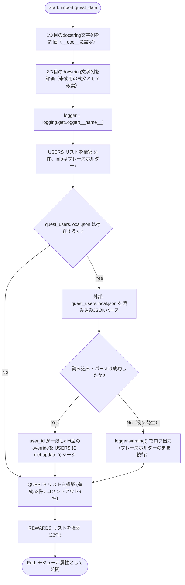
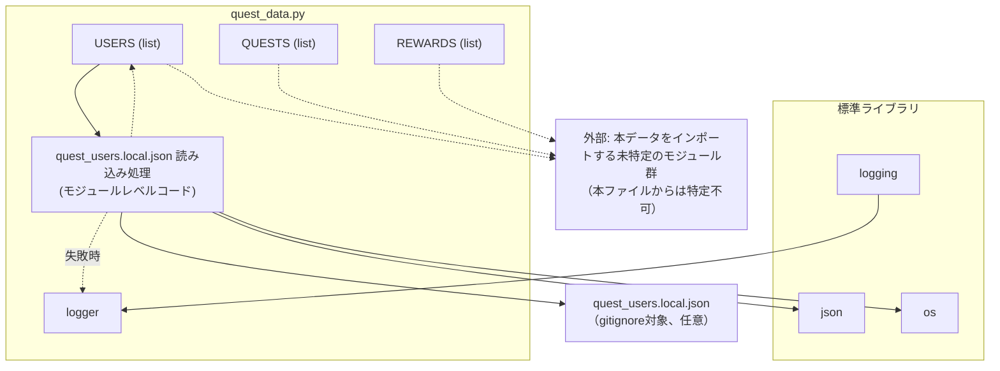

## 1. 解析メタ情報

| 項目 | 内容 |
| --- | --- |
| 対象ファイル | `quest_data.py` |
| 言語 | Python |
| 解析対象 | 提供されたコードのみ |
| 推測・補完 | 一切なし |

## 関連ドキュメント

* [quest_service.md](./quest_service.md) - `USERS`/`QUESTS`/`REWARDS`を読み込みDBと同期する`GameSystem.sync_master_data`、および`target: 'siblings'`のカスケード処理(`_process_coop_quest_completion`等)を実装するサービス層
* [quest.md](./quest.md) - `MasterUser`/`MasterQuest`/`MasterReward`として本データの型を定義するモデル
* [game_logic.md](./game_logic.md) - `USERS`の`level`/`exp`/`gold`に対する計算ロジック(`calc_level_progress`等)
* [reset_game.md](./reset_game.md) - `quest_users`テーブルの`user_id`(dad/mom/son/daughter)を対象にゲームデータをリセットするスクリプト
* [family-quest/src/lib/masterData.md](../family-quest/src/lib/masterData.md) - フロントエンド側のフォールバック用マスターデータ(`INITIAL_USERS`, `MASTER_QUESTS`, `MASTER_REWARDS`)
* [config.md](./config.md) - `USERS[].info`のプレースホルダー化＋`quest_users.local.json`によるローカル上書き(30〜33, 57〜73行目)は、`config.py`の`FAMILY_SETTINGS`/`family_members.local.json`と同じ設計方針を踏襲している

## 2. ファイルの概要

* 「Family Quest」システムのマスターデータを定義するモジュール。大部分は実行ロジックを持たない静的なリスト定数だが、モジュールロード時に`quest_users.local.json`（存在すれば）を読み込んで`USERS`の一部フィールドを上書きする条件分岐・例外処理を含む点で、純粋なデータ定義のみのファイルではなくなっている。
* 根拠: `if os.path.exists(_QUEST_USERS_LOCAL_PATH):` (行番号: 64 / 抜粋: "if os.path.exists(_QUEST_USERS_LOCAL_PATH):")
* 家族4人のユーザー情報（`USERS`）、日課・特別クエストの定義（`QUESTS`）、ゴールドと交換できる報酬（`REWARDS`）の3つのリスト定数を中心に構成される。
* `USERS[].info`は、年齢や住宅ローン残高など個人を特定しうる情報を含まないプレースホルダー文字列としてtracked source上に定義されており、Git管理対象外（gitignore対象）の`quest_users.local.json`が存在すればuser_id単位で上書きされる。`config.py`の`FAMILY_SETTINGS`/`family_members.local.json`と同じ設計方針であることがコメントで明記されている。
* 根拠: `# 注意: info は年齢・具体的な金額など個人を特定しうる情報を含みうるため、` (行番号: 30 / 抜粋: "info は年齢・具体的な金額など個人を特定しうる情報を含みうるため"), `# config.py の FAMILY_SETTINGS / family_members.local.json と同じ方針。` (行番号: 33 / 抜粋: "config.py の FAMILY_SETTINGS / family_members.local.json と同じ方針。")
* ファイル冒頭に2つの独立したモジュールdocstring（改訂履歴コメント）が存在し、更新履歴（Phase 4.1, Phase 5.1）が記述されている。
* 一部のクエスト定義行はコメントアウトされており、過去に存在した／将来復活しうるクエストが無効化された状態で残されている。
* `QUESTS` には、兄妹どちらか一方が完了報告すると2人とも報酬を得る「兄妹連携」クエスト（`target: 'siblings'`、id: 1040, 1041）と、「九九」学習用クエスト（id: 1030, 1031）が定義されている。
* 根拠: `{'id': 1040, 'title': 'いっしょにおかたづけ', ... 'target': 'siblings', ...}` (行番号: 138 / 抜粋: "'target': 'siblings'"), `{'id': 1030, 'title': '今日の九九タイム', ...}` (行番号: 126 / 抜粋: "今日の九九タイム")

## 3. 外部依存関係

### インポート一覧

| 名称 | 種類 | 用途 | 根拠 |
| --- | --- | --- | --- |
| `json` | 標準 | `quest_users.local.json`のパース(`json.load`) | 根拠: [インポート宣言] (行番号: 1 / 抜粋: "import json") |
| `logging` | 標準 | `logger`の初期化(`logging.getLogger`)、ローカルオーバーライド読み込み失敗時の警告ログ出力 | 根拠: [インポート宣言] (行番号: 2 / 抜粋: "import logging") |
| `os` | 標準 | `quest_users.local.json`のパス解決(`os.environ.get`, `os.path.join`, `os.path.dirname`, `os.path.abspath`)およびファイル存在確認(`os.path.exists`) | 根拠: [インポート宣言] (行番号: 3 / 抜粋: "import os") |

### ブラックボックスとなる外部要素

| 名称 | 理由 | 根拠 |
| --- | --- | --- |
| `quest_users.local.json`（既定パス。`QUEST_USERS_LOCAL_PATH`環境変数で差し替え可能） | Git管理対象外（`*.local.json`としてgitignore対象）の外部ファイルであり、`USERS`の各フィールドがどのような値・構造で実際に上書きされるか、本ファイル単体からは不明なため。 | 根拠: [外部ファイル読み込み] (行番号: 60〜67 / 抜粋: "_QUEST_USERS_LOCAL_PATH = os.environ.get(\n    \"QUEST_USERS_LOCAL_PATH\",") |

## 4. 主要要素の定義（関数 / エンドポイント / コンポーネント）

### モジュールdocstring（二重定義）

* **役割**: ファイル冒頭に更新履歴を記したdocstringが2つ連続して記述されている。Pythonの仕様上、モジュールの実際の `__doc__` になるのは最初の文字列リテラルのみであり、2つ目は単なる評価済みの式文（未使用の文字列リテラル）として扱われる。
* 根拠: 1つ目 (行番号: 5〜11 / 抜粋: "\"\"\"\nFamily Quest Master Data - Phase 4.1 (Complete Descriptions)\n[2026-01-14 更新]"), 2つ目 (行番号: 12〜18 / 抜粋: "\"\"\"\nFamily Quest Master Data - Phase 5.1 (Boss Expansion & Price Adjustment)\n[2026-01-24 更新]")

* **引数/リクエスト**: 該当なし（静的な文字列リテラル）
* 根拠: (行番号: 5〜18 / 抜粋: "\"\"\"")

* **戻り値/レスポンス**: 該当なし
* 根拠: (行番号: 5〜18 / 抜粋: "\"\"\"")

* **副作用**: 1つ目のdocstringはモジュールの `__doc__` 属性として保持される。2つ目は評価はされるが、いかなる変数にも代入されず破棄される。
* 根拠: (行番号: 12 / 抜粋: "\"\"\"\nFamily Quest Master Data - Phase 5.1 (Boss Expansion & Price Adjustment)")

* **エラーハンドリング**: なし
* 根拠: (行番号: 5〜18 / 抜粋: "\"\"\"")

### `logger`

* **役割**: `__name__`（`"quest_data"`）を名前としてPython標準の`logging.getLogger`でロガーを初期化する。`notification_service.py`等が使う`core.logger.setup_logging`とは異なり、標準の`logging.getLogger`のみを使用している。
* 根拠: [変数宣言] (行番号: 20 / 抜粋: "logger = logging.getLogger(__name__)")

* **引数/リクエスト**: 該当なし
* 根拠: (行番号: 20 / 抜粋: "logger = logging.getLogger(__name__)")

* **戻り値/レスポンス**: 該当なし
* 根拠: (行番号: 20 / 抜粋: "logger = logging.getLogger(__name__)")

* **副作用**: なし（`quest_users.local.json`読み込み失敗時に`logger.warning`を呼び出す消費元として後続コードから参照される）
* 根拠: (行番号: 73 / 抜粋: "logger.warning(f\"quest_users.local.json の読み込みに失敗しました（プレースホルダーで続行します）: {_e}\")")

* **エラーハンドリング**: なし
* 根拠: (行番号: 20 / 抜粋: "logger = logging.getLogger(__name__)")

### `USERS`

* **役割**: 家族4人（dad, mom, son, daughter）の初期ユーザー情報（`user_id`, `name`, `job_class`, `level`, `exp`, `gold`, `avatar`, `role`, `info`）を定義するリスト。`role`は各ユーザーに`role_adult`（dad, mom）または`role_child`（son, daughter）を明示する（H-2で追加。`services/quest_service.py`の`sync_master_data`が持つ`INSERT ... ON CONFLICT DO UPDATE`は元々`role`をDBへ反映する実装だったが、マスタ側に`role`キーが無かったため新規/空DBでの初回INSERT時に常に`NULL`となり、`_process_complete_quest_locked`の`user['role'] == ROLE_CHILD`判定が全員`False`になって子供も大人扱いで承認スキップの即時報酬付与になる不具合があった）。`info`の値は年齢等の個人情報を含まないプレースホルダー文字列であり（M-9-1）、後続の`quest_users.local.json`読み込み処理により実行時に上書きされうる。
* 根拠: `USERS = [` (行番号: 34〜55 / 抜粋: "USERS = [\n    {\n        'user_id': 'dad', 'name': 'まさひろ', 'job_class': '会社員',\n        'level': 1, 'exp': 0, 'gold': 0, 'avatar': '⚔️', 'role': 'role_adult',"), `'info': '家族の生活基盤を守る冒険者'` (行番号: 38 / 抜粋: "'info': '家族の生活基盤を守る冒険者'")

* **引数/リクエスト**: 該当なし（静的データ定義）
* 根拠: (行番号: 34 / 抜粋: "USERS = [")

* **戻り値/レスポンス**: `list[dict]`。4件のユーザー辞書（dad, mom, son, daughter）を含む。各辞書は `user_id`, `name`, `job_class`, `level`, `exp`, `gold`, `avatar`, `role`, `info` キーを持つ。`role`の値はdad/momが`'role_adult'`、son/daughterが`'role_child'`。
* 根拠: `'user_id': 'daughter', 'name': 'すずか', 'job_class': '遊び人',` (行番号: 51 / 抜粋: "'user_id': 'daughter', 'name': 'すずか', 'job_class': '遊び人',"), `'role': 'role_child'` (行番号: 52 / 抜粋: "'level': 1, 'exp': 0, 'gold': 0, 'avatar': '👶', 'role': 'role_child',")

* **副作用**: モジュールインポート時にメモリ上へリストが構築される。直後の`quest_users.local.json`読み込み処理（下記参照）から、この段階で構築された各辞書がin-placeで更新（`dict.update`）されうる。
* 根拠: (行番号: 34〜55 / 抜粋: "USERS = ["), (行番号: 71 / 抜粋: "_users_by_id[_user_id].update(_overrides)")

* **エラーハンドリング**: なし（バリデーションロジックを含まない）
* 根拠: (行番号: 34〜55 / 抜粋: "USERS = [")

### `quest_users.local.json` 読み込み処理（モジュールレベルコード）

* **役割**: `QUEST_USERS_LOCAL_PATH`環境変数（未設定時はファイルと同じディレクトリの`quest_users.local.json`）が指すファイルが存在すれば、その内容をJSONとして読み込み、`user_id`をキーに`USERS`内の対応する辞書を`dict.update`で上書きする。ファイルが存在しなければ何もせず、`USERS`はプレースホルダーのまま維持される。
* 根拠: [モジュールレベルコード] (行番号: 60〜73 / 抜粋: "_QUEST_USERS_LOCAL_PATH = os.environ.get(\n    \"QUEST_USERS_LOCAL_PATH\",")

* **引数/リクエスト**: 該当なし（関数ではないモジュールレベルコード）。実質的な入力は環境変数`QUEST_USERS_LOCAL_PATH`（テスト用のパス差し替えに使用）と、ファイルシステム上の`quest_users.local.json`の内容。
* 根拠: (行番号: 60〜63 / 抜粋: "_QUEST_USERS_LOCAL_PATH = os.environ.get(\n    \"QUEST_USERS_LOCAL_PATH\",\n    os.path.join(os.path.dirname(os.path.abspath(__file__)), \"quest_users.local.json\"),\n)")

* **戻り値/レスポンス**: 該当なし。副作用として`USERS`内の辞書がin-placeで更新される。
* 根拠: (行番号: 68〜71 / 抜粋: "_users_by_id = {_u['user_id']: _u for _u in USERS}\n        for _user_id, _overrides in _quest_users_overrides.items():\n            if _user_id in _users_by_id and isinstance(_overrides, dict):\n                _users_by_id[_user_id].update(_overrides)")

* **副作用**: ファイルが存在する場合、JSONパース結果のうち`USERS`に存在する`user_id`かつ値が`dict`である要素についてのみ、対応するユーザー辞書へ`update`をマージする（未知の`user_id`や非dict値は無視される）。読み込み失敗時は`logger.warning`でログ出力する。
* 根拠: (行番号: 69〜70 / 抜粋: "if _user_id in _users_by_id and isinstance(_overrides, dict):"), (行番号: 73 / 抜粋: "logger.warning(f\"quest_users.local.json の読み込みに失敗しました（プレースホルダーで続行します）: {_e}\")")

* **エラーハンドリング**: `open`・`json.load`・マージ処理全体を`try/except Exception`で包み、あらゆる例外（ファイル破損、JSON構文エラー等）を捕捉して`logger.warning`を出力するのみで、モジュールのロード自体は継続する（例外を再送出しない）。
* 根拠: [例外処理] (行番号: 65, 72〜73 / 抜粋: "try:\n        with open(_QUEST_USERS_LOCAL_PATH, \"r\", encoding=\"utf-8\") as _f:", "except Exception as _e:\n        logger.warning(...)")

### `QUESTS`

* **役割**: 「通常クエスト（daily）」と「特別クエスト（special / infinite）」の全定義を保持するリスト。各要素は `id`, `title`, `type`, `target`, `category`, `difficulty`, `exp`, `gold`, `icon`, `desc` を基本キーとし、任意で `days`（曜日指定）, `start_time`, `end_time`, `chance` を持つ。`target` には従来の `'all'`, `'dad'`, `'mom'`, `'son'`, `'daughter'` に加え、兄妹連携クエスト用の `'siblings'` が新設されている。
* 根拠: `QUESTS = [` (行番号: 81〜207 / 抜粋: "QUESTS = [\n    # ==========================================\n    # 【A】 通常クエスト (Daily Quests)"), `'target': 'siblings'` (行番号: 138, 206 / 抜粋: "'target': 'siblings'")

* **引数/リクエスト**: 該当なし（静的データ定義）
* 根拠: (行番号: 81 / 抜粋: "QUESTS = [")

* **戻り値/レスポンス**: `list[dict]`。有効（コメントアウトされていない）なクエスト定義が53件、コメントアウトされ無効化された定義が9件存在する（本ファイル中のテキストとしては残存するがPythonの実行時にはリストへ含まれない）。`target` キーの値は `'all'`, `'dad'`, `'mom'`, `'son'`, `'daughter'`, `'siblings'` のいずれか。`type` キーの値は `'daily'`, `'special'`, `'infinite'` のいずれかが確認できる。
* 根拠: 最初の要素 (行番号: 89 / 抜粋: "{'id': 1100, 'title': '【朝】毎朝ミッション', 'type': 'daily', 'target': 'all', 'category': 'life', 'difficulty': 'C', 'exp': 80, 'gold': 120, 'icon': '🌅', 'start_time': '06:00', 'end_time': '09:30', 'desc': 'トイレ・洗顔・着替え・朝ごはん・歯磨き'},"), コメントアウトされた要素の例 (行番号: 116 / 抜粋: "# {'id': 1101, 'title': '登校タイムアタック (07:50)', 'type': 'daily', 'target': 'son', 'category': 'life', 'difficulty': 'B', 'exp': 100, 'gold': 50, 'icon': '⏱️', 'start_time': '07:00', 'end_time': '07:50', 'desc': '7:50までに靴を履いて玄関に立てたら成功！'},"), 兄妹連携クエストの例 (行番号: 138 / 抜粋: "{'id': 1040, 'title': 'いっしょにおかたづけ', 'type': 'daily', 'target': 'siblings', ...}"), 九九クエストの例 (行番号: 126 / 抜粋: "{'id': 1030, 'title': '今日の九九タイム', ...}")

* **副作用**: モジュールインポート時にメモリ上へリストが構築される。
* 根拠: (行番号: 81〜207 / 抜粋: "QUESTS = [")

* **エラーハンドリング**: なし（バリデーションロジックを含まない。またコメント行78〜79に `category` と `difficulty` の凡例が記されているのみで、実行時の値チェックは行われていない）
* 根拠: `# category: life(生活), study(学習), house(家事), work(仕事), health(健康), moral(徳育), sport(体育)` (行番号: 78 / 抜粋: "# category: life(生活), study(学習), house(家事), work(仕事), health(健康), moral(徳育), sport(体育)")

### `REWARDS`

* **役割**: ゴールド（`cost_gold`）と交換できる報酬アイテムの定義リスト。各要素は `id`, `title`, `category`, `cost_gold`, `icon_key`, `desc` を基本キーとし、任意で `target`（対象者制限）を持つ。
* 根拠: `REWARDS = [` (行番号: 212〜257 / 抜粋: "REWARDS = [\n    # --- Small (消費型) ---\n    {'id': 1, 'title': 'コンビニスイーツ購入権', 'category': 'food', 'cost_gold': 300, 'icon_key': '🍦', 'desc': '頑張った自分へのご褒美デザート'},")

* **引数/リクエスト**: 該当なし（静的データ定義）
* 根拠: (行番号: 212 / 抜粋: "REWARDS = [")

* **戻り値/レスポンス**: `list[dict]`。有効な報酬定義23件を含む。`cost_gold` は 50〜1,100,000 まで幅広く設定されている（最高額は "アルハンブラ" の1,100,000）。
* 根拠: `{'id': 999, 'title': 'アルハンブラ (Van Cleef & Arpels)', 'category': 'special', 'cost_gold': 1100000, 'icon_key': '🍀', 'desc': '四つ葉のクローバーが象徴する幸運。ママへの究極の感謝状', 'target': 'mom'},` (行番号: 247 / 抜粋: "{'id': 999, 'title': 'アルハンブラ (Van Cleef & Arpels)', 'category': 'special', 'cost_gold': 1100000,")

* **副作用**: モジュールインポート時にメモリ上へリストが構築される。
* 根拠: (行番号: 212〜257 / 抜粋: "REWARDS = [")

* **エラーハンドリング**: なし
* 根拠: (行番号: 212〜257 / 抜粋: "REWARDS = [")

## 5. 処理フロー図

本ファイルには関数呼び出しの分岐処理は存在しないため、Pythonインタプリタによる「モジュールロード時の評価順序」を処理フローとして示します。

## 6. 依存関係図

## 7. 次のステップ（リバースエンジニアリングの提案）

| 優先度 | ファイル名(推測可) | 理由 | 根拠 |
| --- | --- | --- | --- |
| 高 | `game_logic.py` | 同ディレクトリ内に存在するファイルであり、`QUESTS` の `type`（daily/special/infinite）や `USERS` の `level`/`exp`/`gold` 等、ゲーム進行ロジックが必要とするキーが本ファイルに定義されているため、これらを消費する実装が存在すると推測される。 | `'level': 1, 'exp': 0, 'gold': 0` (行番号: 37 / 抜粋: "'level': 1, 'exp': 0, 'gold': 0, 'avatar': '⚔️',") |
| 高 | `services/quest_service.py` | 同ディレクトリの `services/` 配下に存在するファイルであり、命名から `QUESTS`/`REWARDS` データを用いたクエスト管理サービスである可能性が高い。`target: 'siblings'` を消費する兄妹連携ロジックの実体を確認する必要がある。 | `QUESTS = [` (行番号: 81 / 抜粋: "QUESTS = ["), `'target': 'siblings'` (行番号: 138) |
| 中 | `views/dashboard/quest_tab.py` | `dashboard.py` の解析より、クエストタブの描画を担当するモジュールであることが判明しており、本データがどう画面表示に使われるかを確認するため。 | `QUESTS = [` (行番号: 81 / 抜粋: "QUESTS = [")（`quest_data.py` 自体からの直接参照ではなく、周辺ファイル調査から得た推測） |
| 低 | `current_schema.sql` | `USERS` の `user_id`, `level`, `exp`, `gold` 等がDBの `quest_users` テーブル等と対応している可能性があり、データモデルの一致を確認するため。 | `'user_id': 'dad'` (行番号: 36 / 抜粋: "'user_id': 'dad', 'name': 'まさひろ',") |

## 8. 保守上の注意点

* **二重docstringによる無駄な式文**: ファイル冒頭に2つの独立したdocstringが連続して記述されており（5〜11行目、12〜18行目）、Pythonの言語仕様上、実際にモジュールの `__doc__` として保持されるのは最初の1つのみである。2つ目（Phase 5.1の更新履歴）は評価されるだけで破棄され、実質的に「無視される」ドキュメントコメントとなっている。
* **コメントアウトされたクエストの残存**: `QUESTS` 内に9件のコメントアウトされた要素（例: 116〜122行目、184行目、191〜192行目）が残っており、有効なクエストと無効なクエストが同一ファイル内に混在している。将来のメンテナンス時にコメントを外し忘れる／意図せず有効化するリスクがある。
* **`id` の重複（修正済み）**: かつて `QUESTS` 内で `id: 15/16/17`（洗濯物関連クエスト）が `target: 'dad'`（161〜163行目）と `target: 'mom'`（173〜175行目）の双方に同じ `id` で重複しており、`sync_master_data`側の`quest_id`主キー競合で`dad`向けの定義が`mom`向けの定義に上書きされ実質無効化される不具合があったが、`mom`側は `id: 505/506/507` に採番し直され（173〜175行目）、重複は解消されている。`id` の一意性がグローバル（`QUESTS`全体で一意）であるべきという前提がこの修正から確認できる。
* **バリデーションの不在**: `category`, `difficulty`, `type`, `target` 等の値がコメント（25, 78〜79行目）で列挙された想定値と一致しているかを検証する仕組みはファイル内に存在しない。誤字や想定外の値が入っても実行時エラーにはならない。
* **ハードコードされた金額バランス**: 報酬の `cost_gold` が50から1,100,000まで大きく開きがあり（212〜257行目）、ゲームバランスの調整はすべて本ファイルの手動編集に依存している。
* **兄妹連携クエスト (`target: 'siblings'`)**: `id: 1040`（行番号: 138）と `id: 1041`（行番号: 206）の2件が定義されている。コメント（行番号: 136, 204）に「どちらか一方が完了報告すると2人とも報酬を得る」と明記されているが、その実処理（片方の完了で両者へ保留行を作成しカスケード承認する等のロジック）は本ファイルには存在せず、消費側（推定: `services/quest_service.py`）に委ねられている。
* **九九クエストの段階分け見送り**: `id: 1031`（行番号: 196）直前のコメント（行番号: 193〜195）に、前提クエストによる段階連結方式を採用しない理由（「当日中の完了」しか判定できない実装のため複数日にまたがる進行チェーンに不向き）が明記されている。
* **かつて存在した `EQUIPMENTS` / `BOSSES` リストの削除**: 旧バージョンに存在した装備品定義 (`EQUIPMENTS`) およびボスモンスター定義 (`BOSSES`) のリストは、ボス戦闘・装備機能の廃止に伴い本ファイルから削除されている。
* **`USERS[].info` のプレースホルダー化とローカルオーバーライド（M-9-1）**: かつて `USERS[].info` に実年齢や住宅ローン残高（「5,400万」等）が直接ハードコードされていたが、個人情報保護のためtracked source上はプレースホルダー文字列に置き換えられ（30〜33, 36〜54行目）、実データは`quest_users.local.json`（gitignore対象。サンプルとして`quest_users.local.json.example`が存在する）から読み込んで上書きする方式に変更された（57〜73行目）。読み込み失敗は`try/except Exception`で広く捕捉され`logger.warning`のみでモジュールロードは継続するため（65, 72〜73行目）、ファイルが破損していても起動は妨げられない一方、上書きが黙って効かなくなるリスクがある。`QUEST_USERS_LOCAL_PATH`環境変数でパスを差し替え可能（60〜63行目、テスト用）。

## 9. 不明事項一覧

| 項目 | 理由 | 必要なファイル |
| --- | --- | --- |
| このデータを消費するロジックの実体 | 本ファイルは `json`/`logging`/`os` の標準ライブラリ以外の他モジュールを一切importしておらず、`USERS`/`QUESTS`/`REWARDS` がどのファイルでどのように読み込まれ、DBとどう同期されるかが不明。 | `game_logic.py`, `services/quest_service.py`, `views/dashboard/quest_tab.py` 等の消費側ファイル |
| `id` の一意性制約の仕様 | `QUESTS` 内で同一 `id` が異なる `target` に対して重複して存在するが、これが意図した設計か単なる見落としかは本ファイルのみからは判断できない。 | 消費側ロジック（`id` を主キーとして扱っているファイル） |
| DBスキーマとの対応関係 | `USERS` の `user_id` が `reset_game.py` で言及される `quest_users` テーブルの `user_id` と対応するかは、本ファイル単体からは確認できるが、テーブルの完全なスキーマ（`medal_count` 等）は不明。 | `current_schema.sql`, `init_unified_db.py` |
| コメントアウトされたクエストの無効化理由 | 各コメントアウト行（例: 116〜122, 184, 191〜192行目）がなぜ無効化されたか（バランス調整、廃止、一時停止等）の理由は記載されていない。（`git blame`で該当行を確認したところ、いずれも同一コミット`16bdea7`(コミットメッセージ「一旦コミットします」、2026-06-28)由来であり、既にコメントアウトされた状態でリポジトリに追加されていることが判明した。それ以前の状態を示す履歴は本リポジトリのgit履歴からは追跡できず、無効化理由そのものは解消不可） | 変更履歴（Git blame）またはプロジェクト外のドキュメント |
| `target: 'siblings'` の実処理 | 「どちらか一方が完了報告すると2人とも報酬を得る」という挙動を実現する具体的なロジック（対象ユーザーの解決方法、保留行の作成・カスケード処理等）は本ファイルからは読み取れない。 | `services/quest_service.py` |
| `quest_users.local.json` の実際のスキーマ・内容 | Git管理対象外（gitignore対象）であり、実際にどのユーザーのどのフィールドがどのような値で上書きされるかは本ファイルからは判別できない。 | `quest_users.local.json`（gitignore対象。`quest_users.local.json.example`が参考になる可能性） |

## 相互参照による補足情報

| 元の不明事項 | 判明した内容 | 参照元ドキュメント |
| --- | --- | --- |
| このデータを消費するロジックの実体 | `MY_HOME_SYSTEM/services/quest_service.py`の`GameSystem.sync_master_data`(688〜704行目)を直接確認した。`importlib.reload(quest_data)`(692行目)で再読み込みした上で、`quest_data.USERS`を`[MasterUser(**u) for u in quest_data.USERS]`(693行目)、`quest_data.QUESTS`を`MasterQuest(**q_data)`(694〜699行目)、`quest_data.REWARDS`を`[MasterReward(**r) for r in quest_data.REWARDS]`(701行目)でそれぞれPydanticモデルにバリデーションした後、`quest_users`/`quest_master`テーブルへ`INSERT ... ON CONFLICT DO UPDATE`で同期する設計であることを確認した。一方`MY_HOME_SYSTEM/game_logic.py`と`MY_HOME_SYSTEM/views/dashboard/quest_tab.py`を直接確認したが、いずれも`quest_data`を一切importしておらず、`quest_data`を直接消費するのは`quest_service.py`のみであることを確認した(`game_logic.py`は純粋な計算ロジックのみ、`quest_tab.py`は`game_system.get_all_view_data()`経由でDB化後のデータを参照する設計)。 | 直接ソース確認: `MY_HOME_SYSTEM/services/quest_service.py:688-704`（`MY_HOME_SYSTEM/game_logic.py`, `MY_HOME_SYSTEM/views/dashboard/quest_tab.py`は`quest_data`のimportなしを確認） |
| `id` の一意性制約の仕様（修正済み） | `MY_HOME_SYSTEM/quest_data.py`のQUESTS配列(53〜179行目)を直接確認した。かつては`id: 15`(133行目`target: 'dad'`, 旧145行目`target: 'mom'`、いずれも「洗濯物を干す」)、`id: 16`(134行目`dad`, 旧146行目`mom`、「洗濯物を畳む」)、`id: 17`(135行目`dad`, 旧147行目`mom`、「洗濯物をしまう」)が、それぞれ異なる`target`で重複して存在していた。DB側は`MY_HOME_SYSTEM/current_schema.sql`174行目で`quest_master.quest_id INTEGER PRIMARY KEY AUTOINCREMENT`であり、`sync_master_data`(`services/quest_service.py`744〜761行目)は`INSERT INTO quest_master (quest_id, ...) VALUES (...) ON CONFLICT(quest_id) DO UPDATE SET ...`という形でリスト順に処理するため、同一`id`の2件目(`target: 'mom'`側、ファイル内でより後方に定義)が1件目(`target: 'dad'`側)を上書きし、DB上には後勝ちで1行しか残らず`dad`向けの「洗濯物を干す/畳む/しまう」クエストが実質的に無効化される不具合だった。現在は`mom`側が`id: 505/506/507`(145〜147行目)に採番し直されており、この重複・上書きは解消されている。したがって`id`はQUESTS配列全体でグローバルに一意であるべき、という設計意図が確認できる。 | 直接ソース確認: `MY_HOME_SYSTEM/quest_data.py:133-135, 145-147`, `MY_HOME_SYSTEM/services/quest_service.py:737-761`, `MY_HOME_SYSTEM/current_schema.sql:174` |
| DBスキーマとの対応関係 | `MY_HOME_SYSTEM/current_schema.sql`164〜171行目の`CREATE TABLE quest_users`を直接確認した。`user_id TEXT PRIMARY KEY, name TEXT, job_class TEXT, level INTEGER DEFAULT 1, exp INTEGER DEFAULT 0, gold INTEGER DEFAULT 0, updated_at DATETIME, avatar TEXT DEFAULT '🙂', medal_count INTEGER DEFAULT 0, role TEXT`という10カラム構成であることを確認した。`quest_data.py`の`USERS`(24〜52行目)の`user_id`キーはこのテーブルの`user_id`列と一致し、`sync_master_data`(`services/quest_service.py`726〜735行目)の`INSERT INTO quest_users (user_id, name, job_class, level, exp, gold, avatar, role, updated_at) VALUES (...) ON CONFLICT(user_id) DO UPDATE ...`で実際に同期されることを直接確認した。 | 直接ソース確認: `MY_HOME_SYSTEM/current_schema.sql:164-171`, `MY_HOME_SYSTEM/services/quest_service.py:726-735` |
| `target: 'siblings'` の実処理 | `MY_HOME_SYSTEM/services/quest_service.py`を直接確認した。`_get_sibling_partner_id(self, cur, user_id)`(274〜283行目)は`cur.execute("SELECT user_id FROM quest_users WHERE role = ?", (ROLE_CHILD,))`(279行目)により`role = 'role_child'`のユーザーがちょうど2人(281行目`len(child_ids) != 2`で検証、それ以外は`HTTPException(400)`)であることを前提に相方の`user_id`を解決する設計であることを確認した。`_process_coop_quest_completion(self, cur, user, quest, now_iso, total_exp, total_gold)`(285〜314行目)は、報告者本人の`quest_history`行(状態`pending`)を`INSERT`(292〜296行目)した後、相方分の`quest_history`行を`linked_history_id`付きで`INSERT`(298〜302行目)し、さらに報告者側の行にも相手の`id`を`UPDATE`で書き戻す(304行目)ことで双方向にリンクする設計であることを確認した。承認処理`process_approve_quest`(316〜340行目)では`hist['linked_history_id'] is not None`の場合に`_approve_linked_history`(339〜340行目)で連結先も同一トランザクション内でカスケード承認することを確認した。 | 直接ソース確認: `MY_HOME_SYSTEM/services/quest_service.py:274-340` |

## 10. 自己検証結果

* [x] 完了: 推測・外部ファイルの仕様を一切含んでいない
* [x] 完了: 全関数・全クラス・全コンポーネントを列挙した
* [x] 完了: 全てのインポート要素を列挙した
* [x] 完了: すべての仕様説明に「根拠（行番号・抜粋）」を明記した
* [x] 完了: 根拠漏れが0件である
* [x] 完了: Mermaid構文にエラーの原因となる記号（エスケープ漏れ）がない
* [x] 完了: 不明事項を漏れなく列挙した
