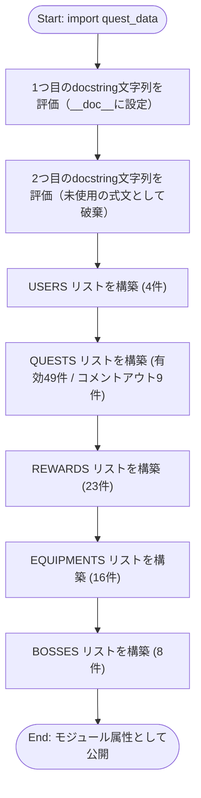
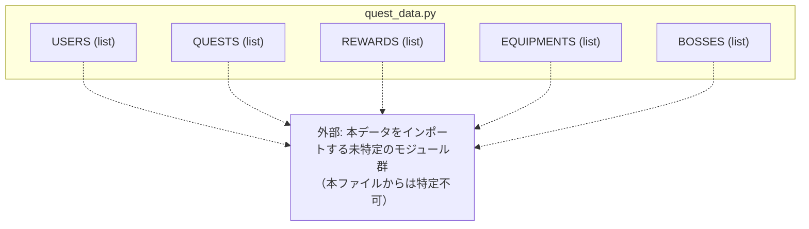

## 1. 解析メタ情報

| 項目 | 内容 |
| --- | --- |
| 対象ファイル | `quest_data.py` |
| 言語 | Python |
| 解析対象 | 提供されたコードのみ |
| 推測・補完 | 一切なし |

## 2. ファイルの概要

* 「Family Quest」システムのマスターデータを定義する、実行ロジックを一切含まない純粋なデータ定義モジュール。
* 家族4人のユーザー情報（`USERS`）、日課・特別クエストの定義（`QUESTS`）、ゴールドと交換できる報酬（`REWARDS`）、RPG風の装備品（`EQUIPMENTS`）、生活習慣を擬人化したボスモンスター（`BOSSES`）の5つのリスト定数のみで構成される。
* ファイル冒頭に2つの独立したモジュールdocstring（改訂履歴コメント）が存在し、更新履歴（Phase 4.1, Phase 5.1）が記述されている。
* 一部のクエスト定義行はコメントアウトされており、過去に存在した／将来復活しうるクエストが無効化された状態で残されている。

## 3. 外部依存関係

### インポート一覧

| 名称 | 種類 | 用途 | 根拠 |
| --- | --- | --- | --- |
| （なし） | — | 本ファイルには `import` 文が一切存在しない。 | ファイル全体 (行番号: 1〜257 / 抜粋: ファイル中に "import" という文字列を含む行が存在しない) |

### ブラックボックスとなる外部要素

| 名称 | 理由 | 根拠 |
| --- | --- | --- |
| （なし） | 本ファイルは外部モジュール・外部API・DB等への参照を一切持たない、静的なリスト・辞書リテラルのみで構成されるデータファイルであるため、ブラックボックスとなる外部要素は存在しない。 | ファイル全体 (行番号: 1〜257 / 抜粋: "USERS = [" / "QUESTS = [" / "REWARDS = [" / "EQUIPMENTS = [" / "BOSSES = [") |

## 4. 主要要素の定義（関数 / エンドポイント / コンポーネント）

### モジュールdocstring（二重定義）

* **役割**: ファイル冒頭に更新履歴を記したdocstringが2つ連続して記述されている。Pythonの仕様上、モジュールの実際の `__doc__` になるのは最初の文字列リテラルのみであり、2つ目は単なる評価済みの式文（未使用の文字列リテラル）として扱われる。
* 根拠: 1つ目 (行番号: 1〜7 / 抜粋: "\"\"\"\nFamily Quest Master Data - Phase 4.1 (Complete Descriptions)\n[2026-01-14 更新]"), 2つ目 (行番号: 8〜14 / 抜粋: "\"\"\"\nFamily Quest Master Data - Phase 5.1 (Boss Expansion & Price Adjustment)\n[2026-01-24 更新]")

* **引数/リクエスト**: 該当なし（静的な文字列リテラル）
* 根拠: (行番号: 1〜14 / 抜粋: "\"\"\"")

* **戻り値/レスポンス**: 該当なし
* 根拠: (行番号: 1〜14 / 抜粋: "\"\"\"")

* **副作用**: 1つ目のdocstringはモジュールの `__doc__` 属性として保持される。2つ目は評価はされるが、いかなる変数にも代入されず破棄される。
* 根拠: (行番号: 8 / 抜粋: "\"\"\"\nFamily Quest Master Data - Phase 5.1 (Boss Expansion & Price Adjustment)")

* **エラーハンドリング**: なし
* 根拠: (行番号: 1〜14 / 抜粋: "\"\"\"")

### `USERS`

* **役割**: 家族4人（dad, mom, son, daughter）の初期ユーザー情報（`user_id`, `name`, `job_class`, `level`, `exp`, `gold`, `avatar`, `info`）を定義するリスト。
* 根拠: `USERS = [` (行番号: 24〜45 / 抜粋: "USERS = [\n    {\n        'user_id': 'dad', 'name': 'まさひろ', 'job_class': '会社員', \n        'level': 1, 'exp': 0, 'gold': 0, 'avatar': '⚔️',")

* **引数/リクエスト**: 該当なし（静的データ定義）
* 根拠: (行番号: 24 / 抜粋: "USERS = [")

* **戻り値/レスポンス**: `list[dict]`。4件のユーザー辞書（dad, mom, son, daughter）を含む。各辞書は `user_id`, `name`, `job_class`, `level`, `exp`, `gold`, `avatar`, `info` キーを持つ。
* 根拠: `'user_id': 'daughter', 'name': 'すずか', 'job_class': '遊び人',` (行番号: 41 / 抜粋: "'user_id': 'daughter', 'name': 'すずか', 'job_class': '遊び人', ")

* **副作用**: モジュールインポート時にメモリ上へリストが構築される。
* 根拠: (行番号: 24〜45 / 抜粋: "USERS = [")

* **エラーハンドリング**: なし（バリデーションロジックを含まない）
* 根拠: (行番号: 24〜45 / 抜粋: "USERS = [")

### `QUESTS`

* **役割**: 「通常クエスト（daily）」と「特別クエスト（special / infinite）」の全定義を保持するリスト。各要素は `id`, `title`, `type`, `target`, `category`, `difficulty`, `exp`, `gold`, `icon`, `desc` を基本キーとし、任意で `days`（曜日指定）, `start_time`, `end_time`, `chance` を持つ。
* 根拠: `QUESTS = [` (行番号: 53〜163 / 抜粋: "QUESTS = [\n    # ==========================================\n    # 【A】 通常クエスト (Daily Quests)")

* **引数/リクエスト**: 該当なし（静的データ定義）
* 根拠: (行番号: 53 / 抜粋: "QUESTS = [")

* **戻り値/レスポンス**: `list[dict]`。有効（コメントアウトされていない）なクエスト定義が49件、コメントアウトされ無効化された定義が9件存在する（本ファイル中のテキストとしては残存するがPythonの実行時にはリストへ含まれない）。`target` キーの値は `'all'`, `'dad'`, `'mom'`, `'son'`, `'daughter'` のいずれか。`type` キーの値は `'daily'`, `'special'`, `'infinite'` のいずれかが確認できる。
* 根拠: 最初の要素 (行番号: 61 / 抜粋: "{'id': 1100, 'title': '【朝】毎朝ミッション', 'type': 'daily', 'target': 'all', 'category': 'life', 'difficulty': 'C', 'exp': 80, 'gold': 120, 'icon': '🌅', 'start_time': '06:00', 'end_time': '09:30', 'desc': 'トイレ・洗顔・着替え・朝ごはん・歯磨き'},"), コメントアウトされた要素の例 (行番号: 88 / 抜粋: "# {'id': 1101, 'title': '登校タイムアタック (07:50)', 'type': 'daily', 'target': 'son', 'category': 'life', 'difficulty': 'B', 'exp': 100, 'gold': 50, 'icon': '⏱️', 'start_time': '07:00', 'end_time': '07:50', 'desc': '7:50までに靴を履いて玄関に立てたら成功！'},")

* **副作用**: モジュールインポート時にメモリ上へリストが構築される。
* 根拠: (行番号: 53〜163 / 抜粋: "QUESTS = [")

* **エラーハンドリング**: なし（バリデーションロジックを含まない。またコメント行50〜51に `category` と `difficulty` の凡例が記されているのみで、実行時の値チェックは行われていない）
* 根拠: `# category: life(生活), study(学習), house(家事), work(仕事), health(健康), moral(徳育), sport(体育)` (行番号: 50 / 抜粋: "# category: life(生活), study(学習), house(家事), work(仕事), health(健康), moral(徳育), sport(体育)")

### `REWARDS`

* **役割**: ゴールド（`cost_gold`）と交換できる報酬アイテムの定義リスト。各要素は `id`, `title`, `category`, `cost_gold`, `icon_key`, `desc` を基本キーとし、任意で `target`（対象者制限）を持つ。
* 根拠: `REWARDS = [` (行番号: 168〜213 / 抜粋: "REWARDS = [\n    # --- Small (消費型) ---\n    {'id': 1, 'title': 'コンビニスイーツ購入権', 'category': 'food', 'cost_gold': 300, 'icon_key': '🍦', 'desc': '頑張った自分へのご褒美デザート'},")

* **引数/リクエスト**: 該当なし（静的データ定義）
* 根拠: (行番号: 168 / 抜粋: "REWARDS = [")

* **戻り値/レスポンス**: `list[dict]`。有効な報酬定義23件を含む。`cost_gold` は 50〜1,100,000 まで幅広く設定されている（最高額は "アルハンブラ" の1,100,000）。
* 根拠: `{'id': 999, 'title': 'アルハンブラ (Van Cleef & Arpels)', 'category': 'special', 'cost_gold': 1100000, 'icon_key': '🍀', 'desc': '四つ葉のクローバーが象徴する幸運。ママへの究極の感謝状', 'target': 'mom'},` (行番号: 203 / 抜粋: "{'id': 999, 'title': 'アルハンブラ (Van Cleef & Arpels)', 'category': 'special', 'cost_gold': 1100000,")

* **副作用**: モジュールインポート時にメモリ上へリストが構築される。
* 根拠: (行番号: 168〜213 / 抜粋: "REWARDS = [")

* **エラーハンドリング**: なし
* 根拠: (行番号: 168〜213 / 抜粋: "REWARDS = [")

### `EQUIPMENTS`

* **役割**: RPG風の武器（`weapon`）・防具（`armor`）の定義リスト。各要素は `id`, `name`, `type`, `power`, `cost`, `icon`, `desc` を持つ。
* 根拠: `EQUIPMENTS = [` (行番号: 218〜238 / 抜粋: "EQUIPMENTS = [\n    # --- 武器 (Weapon) ---\n    {'id': 1, 'name': 'ひのきのぼう', 'type': 'weapon', 'power': 2, 'cost': 30, 'icon': '🪵', 'desc': '旅立ちの第一歩。安い。'},")

* **引数/リクエスト**: 該当なし（静的データ定義）
* 根拠: (行番号: 218 / 抜粋: "EQUIPMENTS = [")

* **戻り値/レスポンス**: `list[dict]`。武器8件・防具8件の計16件を含む。`power` は 2〜100、`cost` は 30〜15,000 の範囲。
* 根拠: `{'id': 8, 'name': 'メタルキングの剣', 'type': 'weapon', 'power': 100, 'cost': 15000, 'icon': '👑', 'desc': '最強の破壊力。'},` (行番号: 227 / 抜粋: "{'id': 8, 'name': 'メタルキングの剣', 'type': 'weapon', 'power': 100, 'cost': 15000,")

* **副作用**: モジュールインポート時にメモリ上へリストが構築される。
* 根拠: (行番号: 218〜238 / 抜粋: "EQUIPMENTS = [")

* **エラーハンドリング**: なし
* 根拠: (行番号: 218〜238 / 抜粋: "EQUIPMENTS = [")

### `BOSSES`

* **役割**: 家庭内の悪習慣を擬人化したボスモンスターの定義リスト。各要素は `id`, `name`, `hp`, `exp`, `gold`, `icon`, `desc` を持つ。
* 根拠: `BOSSES = [` (行番号: 244〜256 / 抜粋: "BOSSES = [\n    {'id': 1, 'name': 'ホコリ・スライム', 'hp': 200, 'exp': 100, 'gold': 100, 'icon': '🦠', 'desc': '部屋の隅から生まれた魔物。弱い。'},")

* **引数/リクエスト**: 該当なし（静的データ定義）
* 根拠: (行番号: 244 / 抜粋: "BOSSES = [")

* **戻り値/レスポンス**: `list[dict]`。8件のボス定義を含む。`hp` は 200〜10,000 の範囲（最大は「魔王カジ・ホウキ」の10,000）。
* 根拠: `{'id': 5, 'name': '魔王カジ・ホウキ', 'hp': 10000, 'exp': 10000, 'gold': 10000, 'icon': '😈', 'desc': '家事の根源にしてラスボス。'},` (行番号: 250 / 抜粋: "{'id': 5, 'name': '魔王カジ・ホウキ', 'hp': 10000, 'exp': 10000, 'gold': 10000,")

* **副作用**: モジュールインポート時にメモリ上へリストが構築される。
* 根拠: (行番号: 244〜256 / 抜粋: "BOSSES = [")

* **エラーハンドリング**: なし
* 根拠: (行番号: 244〜256 / 抜粋: "BOSSES = [")

## 5. 処理フロー図

本ファイルには関数呼び出しの分岐処理は存在しないため、Pythonインタプリタによる「モジュールロード時の評価順序」を処理フローとして示します。

## 6. 依存関係図

## 7. 次のステップ（リバースエンジニアリングの提案）

| 優先度 | ファイル名(推測可) | 理由 | 根拠 |
| --- | --- | --- | --- |
| 高 | `game_logic.py` | 同ディレクトリ内に存在するファイルであり、`QUESTS` の `type`（daily/special/infinite）や `USERS` の `level`/`exp`/`gold` 等、ゲーム進行ロジックが必要とするキーが本ファイルに定義されているため、これらを消費する実装が存在すると推測される。 | `'level': 1, 'exp': 0, 'gold': 0` (行番号: 27 / 抜粋: "'level': 1, 'exp': 0, 'gold': 0, 'avatar': '⚔️',") |
| 高 | `services/quest_service.py` | 同ディレクトリの `services/` 配下に存在するファイルであり、命名から `QUESTS`/`REWARDS` データを用いたクエスト管理サービスである可能性が高い。 | `QUESTS = [` (行番号: 53 / 抜粋: "QUESTS = [") |
| 中 | `views/dashboard/quest_tab.py` | `dashboard.py` の解析より、クエストタブの描画を担当するモジュールであることが判明しており、本データがどう画面表示に使われるかを確認するため。 | `QUESTS = [` (行番号: 53 / 抜粋: "QUESTS = [")（`quest_data.py` 自体からの直接参照ではなく、周辺ファイル調査から得た推測） |
| 低 | `current_schema.sql` | `USERS` の `user_id`, `level`, `exp`, `gold` 等がDBの `quest_users` テーブル等と対応している可能性があり、データモデルの一致を確認するため。 | `'user_id': 'dad'` (行番号: 26 / 抜粋: "'user_id': 'dad', 'name': 'まさひろ',") |

## 8. 保守上の注意点

* **二重docstringによる無駄な式文**: ファイル冒頭に2つの独立したdocstringが連続して記述されており（1〜7行目、8〜14行目）、Pythonの言語仕様上、実際にモジュールの `__doc__` として保持されるのは最初の1つのみである。2つ目（Phase 5.1の更新履歴）は評価されるだけで破棄され、実質的に「無視される」ドキュメントコメントとなっている。
* **コメントアウトされたクエストの残存**: `QUESTS` 内に9件のコメントアウトされた要素（例: 88〜94行目、149行目、156〜157行目）が残っており、有効なクエストと無効なクエストが同一ファイル内に混在している。将来のメンテナンス時にコメントを外し忘れる／意図せず有効化するリスクがある。
* **`id` の重複**: `id` フィールドはリスト内で必ずしもグローバルに一意ではない。例えば `QUESTS` 内で `id: 15/16/17`（洗濯物関連クエスト）が `target: 'dad'`（126〜128行目）と `target: 'mom'`（138〜140行目）の双方に同じ `id` で重複して存在する。`id` の一意性がどの範囲（グローバル／対象者ごと）で保証されるべきかはコードコメントからは読み取れない。
* **バリデーションの不在**: `category`, `difficulty`, `type`, `target` 等の値がコメント（19, 50〜51行目）で列挙された想定値と一致しているかを検証する仕組みはファイル内に存在しない。誤字や想定外の値が入っても実行時エラーにはならない。
* **ハードコードされた金額バランス**: 報酬の `cost_gold` が50から1,100,000まで大きく開きがあり（168〜213行目）、ゲームバランスの調整はすべて本ファイルの手動編集に依存している。

## 9. 不明事項一覧

| 項目 | 理由 | 必要なファイル |
| --- | --- | --- |
| このデータを消費するロジックの実体 | 本ファイルは他モジュールを一切importしておらず、`USERS`/`QUESTS`/`REWARDS`/`EQUIPMENTS`/`BOSSES` がどのファイルでどのように読み込まれ、DBとどう同期されるかが不明。 | `game_logic.py`, `services/quest_service.py`, `views/dashboard/quest_tab.py` 等の消費側ファイル |
| `id` の一意性制約の仕様 | `QUESTS` 内で同一 `id` が異なる `target` に対して重複して存在するが、これが意図した設計か単なる見落としかは本ファイルのみからは判断できない。 | 消費側ロジック（`id` を主キーとして扱っているファイル） |
| DBスキーマとの対応関係 | `USERS` の `user_id` が `reset_game.py` で言及される `quest_users` テーブルの `user_id` と対応するかは、本ファイル単体からは確認できるが、テーブルの完全なスキーマ（`medal_count` 等）は不明。 | `current_schema.sql`, `init_unified_db.py` |
| コメントアウトされたクエストの無効化理由 | 各コメントアウト行（例: 88〜94, 149, 156〜157行目）がなぜ無効化されたか（バランス調整、廃止、一時停止等）の理由は記載されていない。 | 変更履歴（Git blame）またはプロジェクト外のドキュメント |

## 10. 自己検証結果

* [x] 推測・外部ファイルの仕様を一切含んでいない
* [x] 全関数・全クラス・全コンポーネントを列挙した
* [x] 全てのインポート要素を列挙した
* [x] すべての仕様説明に「根拠（行番号・抜粋）」を明記した
* [x] 根拠漏れが0件である
* [x] Mermaid構文にエラーの原因となる記号（エスケープ漏れ）がない
* [x] 不明事項を漏れなく列挙した

完了
