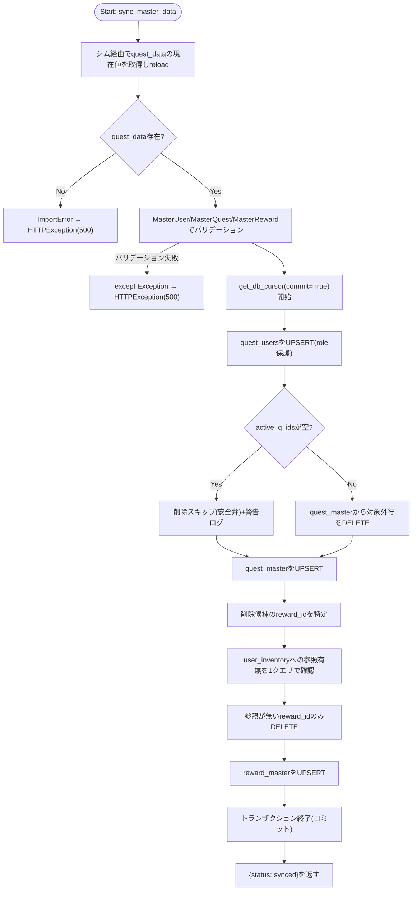
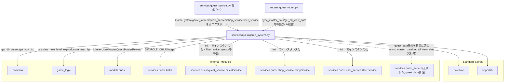

## 1. 解析メタ情報

| 項目 | 内容 |
| --- | --- |
| 対象ファイル | `MY_HOME_SYSTEM/services/quest/game_system.py`（フルパス, disambiguation目的） |
| 言語 | Python (FastAPI関連) |
| 解析対象 | 提供されたコードのみ |
| 推測・補完 | 一切なし |

同名衝突の注意: `services/quest/quest_service.py`と`services/quest_service.py`（下位互換シム）がファイル名`quest_service`で衝突するため、`services/quest/`配下の6ファイルはいずれも`quest_`を接頭辞とした名前で区別している（`dashboard_common.md`と同じ命名規約）。本ファイルは`game_system.py`という単独の基底名のため実際には衝突しないが、命名一貫性のため`quest_game_system.md`とした。

## 関連ドキュメント

* [quest_service.md](./quest_service.md) - `services/quest_service.py`（下位互換シム）。`from services.quest.game_system import (GameSystem, game_system, quest_service, shop_service, user_service)`として本ファイルのクラス・4つのモジュールレベルシングルトンを再エクスポートする。また本ファイルの`sync_master_data`/`get_all_view_data`が`quest_data`モジュールの現在値を読むために逆に依存する（後述）
* [quest_locks.md](./quest_locks.md) - `JST`/`ROLE_CHILD`/`logger`の提供元
* [quest_quest_service.md](./quest_quest_service.md) - `GameSystem.__init__`が`QuestService()`インスタンスを保持し、`filter_active_quests`/`_compute_boost_from_last_completed`/`is_within_reset_period`を呼び出す
* [quest_shop_service.md](./quest_shop_service.md) - `GameSystem.__init__`が`ShopService()`インスタンスを保持する（本ファイル内で`self.shop_service`のメソッドは直接呼ばれないが、`shop_service = game_system.shop_service`としてモジュールレベルへ公開する）
* [quest_user_service.md](./quest_user_service.md) - `GameSystem.__init__`が`UserService()`インスタンスを保持する
* [common.md](./common.md) - `common.get_db_cursor`/`common.get_now_iso`を提供するモジュール
* [game_logic.md](./game_logic.md) - `game_logic.GameLogic.calculate_next_level_exp`/`calculate_max_hp`の実装
* [quest.md](./quest.md) - `models.quest.MasterUser`/`MasterQuest`/`MasterReward`モデル定義
* [quest_data.md](./quest_data.md) - `sync_master_data`が読み込むマスターデータ(`USERS`/`QUESTS`/`REWARDS`)の実体（下位互換シム`services/quest_service.py`の`quest_data`属性経由でアクセスされる）
* [quest_router.md](./quest_router.md) - `sync_master_data`/`get_all_view_data`の呼び出し元と推測されるFastAPIルーター（下位互換シム経由でimportしている）

## 2. ファイルの概要

マスターデータ(`quest_data.USERS`/`QUESTS`/`REWARDS`)とDBの同期(`sync_master_data`)、および画面表示用の集約データ生成(`get_all_view_data`)を担う`GameSystem`クラス1つを定義するファイル。`GameSystem.__init__`は`QuestService`/`UserService`/`ShopService`の3インスタンスを合成し(`InventoryService`は含まない)、ファイル末尾でこれら3サービスと`GameSystem`自身のシングルトンをモジュールレベルの変数(`game_system`/`quest_service`/`shop_service`/`user_service`)として公開する。`sync_master_data`/`get_all_view_data`はいずれも、`quest_data`モジュールをこのファイル自身ではモジュールグローバルとしてimportせず、実行のたびに下位互換シム(`services/quest_service.py`)を`from services import quest_service as _quest_service_shim`として動的にimportし、`_quest_service_shim.quest_data`を経由して現在値を読む設計になっている。これは、テストが`monkeypatch.setattr(services.quest_service, "quest_data", fake)`という形でシム側の属性を差し替える前提のためである。
根拠: `class GameSystem:` (行番号: 17)、`def __init__(self):\n        self.quest_service = QuestService()\n        self.user_service = UserService()\n        self.shop_service = ShopService()` (行番号: 18〜21)
根拠: `from services import quest_service as _quest_service_shim` (行番号: 30, 171)、コメント (行番号: 25〜29 / 抜粋: "quest_data は互換シム(services/quest_service.py)側でimportされ、テストが\n        # `from services import quest_service as qs; monkeypatch.setattr(qs, \"quest_data\", fake)`\n        # という形で差し替える(Issue #529等)。")
根拠: `game_system = GameSystem()\nquest_service = game_system.quest_service\nshop_service = game_system.shop_service\nuser_service = game_system.user_service` (行番号: 341〜344)

## 3. 外部依存関係

### インポート一覧

| 名称 | 種類 | 用途 | 根拠 |
| --- | --- | --- | --- |
| `datetime` | 標準ライブラリ | `get_all_view_data`の周期判定における日付演算 | `import datetime` (行番号: 2) |
| `importlib` | 標準ライブラリ | `sync_master_data`が`quest_data`モジュールを再読み込みする(`importlib.reload`) | `import importlib` (行番号: 3) |
| `typing` (`Any`, `Dict`, `List`, `Optional`) | 標準ライブラリ | 型ヒント | `from typing import Any, Dict, List, Optional` (行番号: 4) |
| `fastapi.HTTPException` | 外部ライブラリ | マスターデータ検証失敗時のエラーレスポンス生成 | `from fastapi import HTTPException` (行番号: 6) |
| `common` | 内部モジュール | DBカーソル取得、現在時刻(ISO)取得 | `import common` (行番号: 8) |
| `game_logic` | 内部モジュール | `GameLogic.calculate_next_level_exp`/`calculate_max_hp`の呼び出し | `import game_logic` (行番号: 9) |
| `models.quest` (`MasterQuest`, `MasterReward`, `MasterUser`) | 内部モジュール | マスターデータの型定義(Pydanticモデル)によるバリデーション | `from models.quest import MasterQuest, MasterReward, MasterUser` (行番号: 10) |
| `services.quest.locks` (`JST`, `ROLE_CHILD`, `logger`) | 内部モジュール | JST定数・子供ロール定数・ロガーの共有基盤 | `from services.quest.locks import JST, ROLE_CHILD, logger` (行番号: 11) |
| `services.quest.quest_service.QuestService` | 内部モジュール | `GameSystem.__init__`が保持する`self.quest_service`の型。`filter_active_quests`/`_compute_boost_from_last_completed`/`is_within_reset_period`の呼び出し元 | `from services.quest.quest_service import QuestService` (行番号: 12) |
| `services.quest.shop_service.ShopService` | 内部モジュール | `GameSystem.__init__`が保持する`self.shop_service`の型 | `from services.quest.shop_service import ShopService` (行番号: 13) |
| `services.quest.user_service.UserService` | 内部モジュール | `GameSystem.__init__`が保持する`self.user_service`の型 | `from services.quest.user_service import UserService` (行番号: 14) |
| `services.quest_service`（下位互換シム、`sync_master_data`/`get_all_view_data`内でのローカルimport） | 内部モジュール | `quest_data`モジュールの現在値をシム経由で読むため | `from services import quest_service as _quest_service_shim` (行番号: 30, 171) |

### ブラックボックスとなる外部要素

| 名称 | 理由 | 根拠 |
| --- | --- | --- |
| `common.get_db_cursor()` / `common.get_now_iso()` | トランザクションスコープや接続の詳細、生成されるISO文字列のフォーマットが本ファイルからは不明 | `with common.get_db_cursor(commit=True) as cur:` (行番号: 53) |
| `game_logic.GameLogic.calculate_next_level_exp` / `calculate_max_hp` | 計算式の詳細仕様が不明 | `game_logic.GameLogic.calculate_next_level_exp(u['level'])` (行番号: 190) |
| `quest_data.USERS` / `.QUESTS` / `.REWARDS` の構造 | 定義ファイルの実体は本ファイルからは確認できず、辞書のキー構成は本ファイルの参照(`q_data['start_time']`等)からのみ推測可能 | `valid_users = [MasterUser(**u) for u in quest_data.USERS]` (行番号: 35) |
| `models.quest.MasterUser` / `MasterQuest` / `MasterReward` | フィールドのバリデーションルールが本ファイルからは不明 | `MasterQuest(**q_data)` (行番号: 43) |
| DBの各テーブルスキーマ | カラムの型、制約(UNIQUE, NOT NULL, 外部キー等)が本ファイルからは不明 | `cur.execute("SELECT * FROM quest_users")` (行番号: 174) |

## 4. 主要要素の定義（関数 / エンドポイント / コンポーネント）

### `GameSystem.__init__`

* **役割**: `QuestService`/`UserService`/`ShopService`の3インスタンスを生成し、それぞれ`self.quest_service`/`self.user_service`/`self.shop_service`へ格納する。`InventoryService`はここに含まれない。
* 根拠: `def __init__(self):\n        self.quest_service = QuestService()\n        self.user_service = UserService()\n        self.shop_service = ShopService()` (行番号: 18〜21)
* **引数/リクエスト**: なし
* 根拠: (行番号: 18)
* **戻り値/レスポンス**: なし
* **副作用**: インスタンスプロパティの割り当て（`self.quest_service`, `self.user_service`, `self.shop_service`）
* 根拠: (行番号: 19〜21)
* **エラーハンドリング**: なし

### `GameSystem.sync_master_data`

* **役割**: `quest_data`モジュール(下位互換シム経由で取得した現在値を`importlib.reload`)の`USERS`/`QUESTS`/`REWARDS`をそれぞれ`MasterUser`/`MasterQuest`/`MasterReward`でバリデーションし、DBへUPSERT/DELETEで反映する。ユーザーは`ON CONFLICT DO UPDATE`で`name`/`job_class`を更新し`role`は`COALESCE(excluded.role, quest_users.role)`で新しい値が`None`なら既存値を保持する。クエストは`active_q_ids`に含まれない行を`DELETE`してから全件を`ON CONFLICT DO UPDATE`でUPSERTするが、`quest_data.QUESTS`が空の場合はDELETE自体をスキップする安全弁を持つ。報酬は、マスタから削除された`reward_id`のうち`user_inventory`に参照が残っているものを削除対象から除外したうえで、残りを`DELETE`してから全件をUPSERTする。
* 根拠: `def sync_master_data(self) -> Dict[str, str]:` (行番号: 23〜166)
* 根拠: `ON CONFLICT(user_id) DO UPDATE SET\n                        name = excluded.name,\n                        job_class = excluded.job_class,\n                        role = COALESCE(excluded.role, quest_users.role)` (行番号: 65〜68)
* 根拠: `if active_q_ids:\n                ph = ','.join(['?'] * len(active_q_ids))\n                cur.execute(f"DELETE FROM quest_master WHERE quest_id NOT IN ({ph})", active_q_ids)  # nosec B608\n            else:\n                logger.warning(\n                    "⚠️ quest_data.QUESTSが空のため、quest_masterへの全削除操作を"\n                    "スキップしました(意図しない全消去を防ぐための安全弁)。"\n                )` (行番号: 72〜86)
* 根拠: `for stale_reward_id in stale_reward_ids:\n                if stale_reward_id in referenced_reward_ids:\n                    logger.warning(\n                        f"⚠️ reward_id={stale_reward_id} はマスタから削除されましたが、"\n                        "user_inventoryに参照が残っているため削除をスキップします。"\n                    )\n                    continue\n                cur.execute("DELETE FROM reward_master WHERE reward_id = ?", (stale_reward_id,))` (行番号: 143〜150)
* **引数/リクエスト**: なし（`self`のみ）
* 根拠: (行番号: 23)
* **戻り値/レスポンス**: `Dict[str, str]`（`{"status": "synced", "message": "Master data updated."}`）
* 根拠: (行番号: 166)
* **副作用**: `quest_data`モジュールの`importlib.reload`、DB更新/削除（`quest_users`, `quest_master`, `reward_master`）、DB参照（`user_inventory`の参照確認）、ログ出力
* 根拠: (行番号: 34, 60〜163)
* **エラーハンドリング**: `quest_data`が`None`(下位互換シム側のimport失敗時)の場合`ImportError`を送出しログ出力。Pydanticバリデーション失敗を含む例外全般を`except Exception as e:`で捕捉し`HTTPException(status_code=500, detail=f"Master Data Error: {str(e)}")`を送出する。
* 根拠: `else:\n                logger.error("Quest data module not available for sync.")\n                raise ImportError("quest_data module missing")\n        except Exception as e:\n            logger.error(f"❌ Master Data Validation failed: {e}")\n            raise HTTPException(status_code=500, detail=f"Master Data Error: {str(e)}")` (行番号: 46〜51)

### `GameSystem.get_all_view_data`

* **役割**: `family-quest`フロントエンドのメイン画面向けに、ユーザー一覧・クエスト一覧・報酬一覧・完了済みクエスト・最近のログ・承認待ち一覧を1つの辞書にまとめて返す。`quest_users`の取得結果は、SQLiteのデフォルト順序(主キーのアルファベット順)ではなく`quest_data.USERS`の宣言順に並べ替える(`canonical_order`)。各クエストには`quest_service._compute_boost_from_last_completed`によるボーナス(`bonus_gold`/`bonus_exp`)を付与し、この際に必要な「対象ユーザー×クエストの直近の非rejected完了日時」を、クエストごとに個別SELECTするのではなく`GROUP BY user_id, quest_id`の1クエリでまとめて取得してN+1クエリを避ける(`last_completed_map`)。`target_user`が実在ユーザーでない(`'all'`/`'siblings'`等)場合は、閲覧中のユーザー(`viewer_user_id`)または兄妹の代表ユーザーをボーナス算出の代表として使う。過去1ヶ月の`quest_history`(`status='approved'`)から、`quest_service.is_within_reset_period`で現在の周期内と判定されたものだけを`completedQuests`として集約する(`infinite`型は全件、それ以外はユーザーごとに最新1件のみ評価)。
* 根拠: `def get_all_view_data(self, viewer_user_id: Optional[str] = None) -> Dict[str, Any]:` (行番号: 168〜318)
* 根拠: `if _quest_service_shim.quest_data:\n                canonical_order = {u['user_id']: i for i, u in enumerate(_quest_service_shim.quest_data.USERS)}\n                users.sort(key=lambda u: canonical_order.get(u['user_id'], len(canonical_order)))` (行番号: 185〜187)
* 根拠: `last_completed_map: Dict[tuple, str] = {\n                (row['user_id'], row['quest_id']): row['last_completed_at']\n                for row in cur.execute("""\n                    SELECT user_id, quest_id, MAX(completed_at) AS last_completed_at\n                    FROM quest_history\n                    WHERE status != 'rejected'\n                    GROUP BY user_id, quest_id\n                """)\n            }` (行番号: 222〜230)
* 根拠: `if q['target_user'] == 'all' or not q['target_user']:\n                    boost_user_id = viewer_user_id\n                elif q['target_user'] == 'siblings' and sibling_child_ids:\n                    boost_user_id = sibling_child_ids[0]\n                else:\n                    boost_user_id = q['target_user'] if q['target_user'] in known_user_ids else viewer_user_id` (行番号: 236〜241)
* 根拠: `if is_infinite:\n                    for c in recent_completed:\n                        if c['quest_id'] == q_id:\n                            if self.quest_service.is_within_reset_period(c['completed_at'], reset_period):\n                                valid_completed.append(c)\n                else:\n                    users_processed = set()\n                    for c in recent_completed:\n                        ...` (行番号: 282〜298)
* **引数/リクエスト**: `viewer_user_id: Optional[str] = None`
* 根拠: (行番号: 168)
* **戻り値/レスポンス**: `Dict[str, Any]`（`users`, `quests`, `rewards`, `completedQuests`, `logs`, `pendingQuests`）
* 根拠: (行番号: 314〜318)
* **副作用**: DB参照（`quest_users`, `quest_master`, `reward_master`, `quest_history`）、`_fetch_recent_logs`の呼び出し
* 根拠: (行番号: 174, 194, 251, 266〜269, 271〜273, 312)
* **エラーハンドリング**: なし
* 根拠: (行番号: 168〜318)

### `GameSystem._fetch_recent_logs`

* **役割**: `quest_history`(`status='approved' AND quest_id != 0`、`id`降順、最大20件)と`reward_history`(`id`降順、最大20件)を取得しマージ、`ts`降順で先頭20件に切り詰めたうえで、`quest_users`から取得したユーザー名を付与し表示テキストと日付文字列を整形して返す。ユーザーが見つからない場合は`'誰か'`のプレースホルダを使う。
* 根拠: `def _fetch_recent_logs(self, cur) -> List[dict]:` (行番号: 320〜338)
* 根拠: `q_logs = cur.execute("""\n            SELECT id, user_id, quest_title as title, 'quest' as type, completed_at as ts\n            FROM quest_history WHERE status='approved' AND quest_id != 0 ORDER BY id DESC LIMIT 20\n        """).fetchall()` (行番号: 321〜324)
* **引数/リクエスト**: `cur`（呼び出し元のトランザクション内で使うDBカーソル）
* 根拠: (行番号: 320)
* **戻り値/レスポンス**: `List[dict]`（各要素は`id`, `text`, `dateStr`, `timestamp`）
* 根拠: (行番号: 337〜338)
* **副作用**: DB参照（`quest_history`, `reward_history`, `quest_users`）
* 根拠: (行番号: 321, 325, 330)
* **エラーハンドリング**: なし
* 根拠: (行番号: 320〜338)

### `game_system` / `quest_service` / `shop_service` / `user_service` (モジュールレベル変数)

* **役割**: `GameSystem`のシングルトンインスタンス`game_system`と、その内部に保持される`quest_service`/`shop_service`/`user_service`をモジュールレベルの変数として公開する。下位互換シム(`services/quest_service.py`)がこれらをそのまま再エクスポートし、`routers/quest_router.py`がシム経由でimportして使用する。
* 根拠: `game_system = GameSystem()\nquest_service = game_system.quest_service\nshop_service = game_system.shop_service\nuser_service = game_system.user_service` (行番号: 341〜344)
* **引数/リクエスト・戻り値/レスポンス・副作用・エラーハンドリング**: 該当なし（モジュールレベルの変数代入。`GameSystem()`のインスタンス化自体は`__init__`の副作用を参照）
* 根拠: (行番号: 341)

## 5. 処理フロー図

## 6. 依存関係図

## 7. 次のステップ（リバースエンジニアリングの提案）

| 優先度 | ファイル名 | 理由 | 根拠 |
| --- | --- | --- | --- |
| 高 | `quest_data.py`（[quest_data.md](./quest_data.md)） | `sync_master_data`で読み込まれる`USERS`/`QUESTS`/`REWARDS`の実データの型・値が、DBテーブルの各カラム仕様に直接影響するため。 | `quest_data.USERS`/`.QUESTS`/`.REWARDS` (行番号: 35, 37, 45) |
| 高 | `services/quest_service.py`（[quest_service.md](./quest_service.md)） | `_quest_service_shim.quest_data`が実際にどう束縛・差し替えられるか(互換シムの`try: import quest_data`のフォールバック挙動)を確認するため。 | `from services import quest_service as _quest_service_shim` (行番号: 30, 171) |
| 中 | `models/quest.py`（[quest.md](./quest.md)） | `MasterUser`/`MasterQuest`/`MasterReward`のバリデーションルール(`role`フィールドの扱い等)を確認するため。 | `role_val = getattr(u, 'role', None)` (行番号: 61) |
| 中 | `services/quest/quest_service.py`（[quest_quest_service.md](./quest_quest_service.md)） | `filter_active_quests`/`_compute_boost_from_last_completed`/`is_within_reset_period`の詳細な判定ロジックを確認するため。 | `self.quest_service.filter_active_quests(all_quests)` (行番号: 195) |

## 8. 保守上の注意点

* **`quest_data`をモジュールグローバルとしてimportしない設計**: `sync_master_data`/`get_all_view_data`はいずれも実行のたびに`from services import quest_service as _quest_service_shim`をローカルimportし、`_quest_service_shim.quest_data`経由で現在値を読む。これは、テストが下位互換シム側の`quest_data`属性を`monkeypatch`で差し替える前提を尊重するためのコメント付きの意図的な設計であり、通常の`import quest_data`に書き換えると差し替えが本ファイルの実行結果に反映されなくなる。
* 根拠: `from services import quest_service as _quest_service_shim` (行番号: 30, 171)、コメント (行番号: 25〜29, 169〜170)
* **`sync_master_data`のクエストマスタ全削除に対する安全弁**: `quest_data.QUESTS`が空の場合、`quest_master`への`DELETE`自体をスキップする(意図しない全消去防止)。一方、報酬(`reward_master`)側は`REWARDS`が空でも`DELETE`自体はスキップされず、`user_inventory`から参照が残っている行のみが個別に保護される非対称な実装になっている。
* 根拠: `else:\n                logger.warning(\n                    "⚠️ quest_data.QUESTSが空のため、quest_masterへの全削除操作を"\n                    "スキップしました(意図しない全消去を防ぐための安全弁)。"\n                )` (行番号: 83〜86)、`else:\n                stale_rewards = cur.execute("SELECT reward_id FROM reward_master").fetchall()` (行番号: 120〜121)
* **`get_all_view_data`のユーザー順序はSQLiteのデフォルト順に依存しない**: `quest_data.USERS`の宣言順で明示的にソートし直しているため、DBの内部的な返却順が変わっても`family-quest`側の`users[currentUserIdx]`という配列インデックス対応が崩れないよう配慮されている。ただし`_quest_service_shim.quest_data`が`None`(import失敗時)の場合、このソート自体がスキップされDBのデフォルト順のまま返る。
* 根拠: `if _quest_service_shim.quest_data:\n                canonical_order = ...` (行番号: 185〜187)
* **N+1クエリ対策はクエストのボーナス計算のみに適用**: `last_completed_map`によるまとめ取得は`_compute_boost_from_last_completed`のためのものであり、`completedQuests`集約処理(`recent_completed`のループ)は各クエスト×各履歴をPython側でループする実装のままである。
* 根拠: (行番号: 222〜230, 277〜298)

## 9. 不明事項一覧

| 項目 | 理由 | 必要なファイル |
| --- | --- | --- |
| DB各テーブルのスキーマ | `quest_users`/`quest_master`/`reward_master`/`quest_history`/`user_inventory`の各カラムの型・制約が本ファイルからは不明。 | DBのDDL、マイグレーション定義ファイル |
| `quest_data.USERS`/`.QUESTS`/`.REWARDS`の実データ | 定義ファイルの実体は本ファイルからは確認できず、辞書のキー構成は本ファイルの参照からのみ推測可能。 | `quest_data.py`（[quest_data.md](./quest_data.md)） |
| `common.get_now_iso`の形式 | ミリ秒・タイムゾーン情報の有無が本ファイルからは不明。 | `common.py` |
| `MasterUser`/`MasterQuest`/`MasterReward`のバリデーションルール詳細 | `role`フィールドが`Optional[str]`であること以外の制約は本ファイルからは不明。 | `models/quest.py`（[quest.md](./quest.md)） |

## 10. 自己検証結果

* [x] 完了: 推測・外部ファイルの仕様を一切含んでいない
* [x] 完了: 全関数・全クラス・全メソッド・モジュールレベル変数を列挙した
* [x] 完了: 全てのインポート要素を列挙した
* [x] 完了: すべての仕様説明に「根拠（行番号・抜粋）」を明記した
* [x] 完了: 根拠漏れが0件である
* [x] 完了: Mermaid構文にエラーの原因となる記号（エスケープ漏れ）がない
* [x] 完了: 不明事項を漏れなく列挙した
