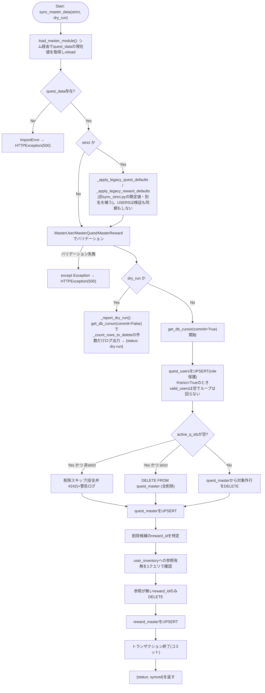
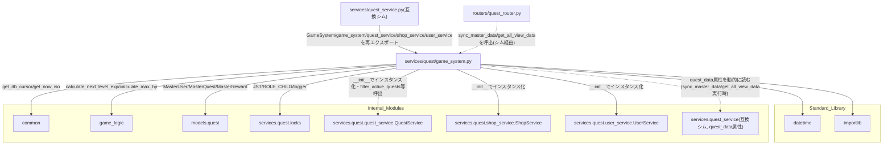

## 1. 解析メタ情報

| 項目 | 内容 |
| --- | --- |
| 対象ファイル | `MY_HOME_SYSTEM/services/quest/game_system.py`（フルパス, disambiguation目的） |
| 言語 | Python (FastAPI関連) |
| 解析対象 | 提供されたコードのみ |
| 推測・補完 | 一切なし |
| 解析基準コミット | `a1d2738` |

同名衝突の注意: `services/quest/quest_service.py`と`services/quest_service.py`（下位互換シム）がファイル名`quest_service`で衝突するため、`services/quest/`配下の6ファイルはいずれも`quest_`を接頭辞とした名前で区別している（`dashboard_common.md`と同じ命名規約）。本ファイルは`game_system.py`という単独の基底名のため実際には衝突しないが、命名一貫性のため`quest_game_system.md`とした。

## 関連ドキュメント

* [quest_service.md](./quest_service.md) - `services/quest_service.py`（下位互換シム）。`from services.quest.game_system import (GameSystem, approval_service, game_system, quest_service, shop_service, user_service)`として本ファイルのクラス・4つのモジュールレベルシングルトンを再エクスポートする。また本ファイルの`sync_master_data`/`get_all_view_data`が`quest_data`モジュールの現在値を読むために逆に依存する（後述）
* [quest_locks.md](./quest_locks.md) - `JST`/`ROLE_CHILD`/`logger`の提供元
* [quest_quest_service.md](./quest_quest_service.md) - `GameSystem.__init__`が`QuestService()`インスタンスを保持し、`filter_active_quests`/`_compute_boost_from_last_completed`/`is_within_reset_period`を呼び出す
* [quest_shop_service.md](./quest_shop_service.md) - `GameSystem.__init__`が`ShopService()`インスタンスを保持する（本ファイル内で`self.shop_service`のメソッドは直接呼ばれないが、`shop_service = game_system.shop_service`としてモジュールレベルへ公開する）
* [quest_user_service.md](./quest_user_service.md) - `GameSystem.__init__`が`UserService()`インスタンスを保持する
* [common.md](./common.md) — **Issue #664 で `common.py` ごと廃止された Deprecated Facade**（本ファイルは実体を直importするようになった。仕様書は履歴として残っている）
* [game_logic.md](./game_logic.md) - `game_logic.GameLogic.calculate_next_level_exp`/`calculate_max_hp`の実装
* [quest.md](./quest.md) - `models.quest.MasterUser`/`MasterQuest`/`MasterReward`モデル定義
* [quest_master_sync_sql.md](./quest_master_sync_sql.md) - `sync_master_data`が使うUPSERT文とパラメータ組み立ての一元管理（Issue #664）
* [sync_strict.md](./sync_strict.md) - **（Issue #664 で変更）** 手動実行CLI。同期の実体は本ファイルの`sync_master_data(strict=True)`へ統合され、あちらには引数解析と安全ガードだけが残っている
* [quest_data.md](./quest_data.md) - `sync_master_data`が読み込むマスターデータ(`USERS`/`QUESTS`/`REWARDS`)の実体（下位互換シム`services/quest_service.py`の`quest_data`属性経由でアクセスされる）
* [quest_router.md](./quest_router.md) - `sync_master_data`/`get_all_view_data`の呼び出し元と推測されるFastAPIルーター（下位互換シム経由でimportしている）

## 2. ファイルの概要

* **（Issue #662 で最適化）** `get_all_view_data` の「表示対象クエスト × 直近30日の承認済み履歴」の二重ループを、`quest_id` をキーにした索引(`collections.defaultdict`)を1度作る形に変えた。計算量は O(Q×H) から O(Q+H) になる。履歴は `completed_at` の降順で取得しており、索引への追加もその順序を保つため、「ユーザーごとに最新の履歴を先に評価する」という既存の判定はそのまま成り立つ(挙動は変えていない)。

マスターデータ(`quest_data.USERS`/`QUESTS`/`REWARDS`)とDBの同期(`sync_master_data`)、および画面表示用の集約データ生成(`get_all_view_data`)を担う`GameSystem`クラス1つを定義するファイル。`GameSystem.__init__`は`QuestService`/`ApprovalService`/`UserService`/`ShopService`の4インスタンスを合成し(`InventoryService`は含まない)、ファイル末尾でこれら4サービスと`GameSystem`自身のシングルトンをモジュールレベルの変数(`game_system`/`quest_service`/`approval_service`/`shop_service`/`user_service`)として公開する。**（Issue #662で追加）** `ApprovalService`/`approval_service`は、`QuestService`から承認・却下・取消を分離した際に加わった。`sync_master_data`/`get_all_view_data`はいずれも、`quest_data`モジュールをこのファイル自身ではモジュールグローバルとしてimportせず、実行のたびに下位互換シム(`services/quest_service.py`)を`from services import quest_service as _quest_service_shim`として動的にimportし、`_quest_service_shim.quest_data`を経由して現在値を読む設計になっている。これは、テストが`monkeypatch.setattr(services.quest_service, "quest_data", fake)`という形でシム側の属性を差し替える前提のためである。
根拠: `class GameSystem:` (行番号: 96)、`def __init__(self):\n        self.quest_service = QuestService()\n        self.user_service = UserService()\n        self.shop_service = ShopService()` (行番号: 97〜101)
根拠: `from services import quest_service as _quest_service_shim` (行番号: 30, 171)、コメント (行番号: 25〜29 / 抜粋: "quest_data は互換シム(services/quest_service.py)側でimportされ、テストが\n        # `from services import quest_service as qs; monkeypatch.setattr(qs, \"quest_data\", fake)`\n        # という形で差し替える(Issue #529等)。")
根拠: `game_system = GameSystem()\nquest_service = game_system.quest_service\nshop_service = game_system.shop_service\nuser_service = game_system.user_service` (行番号: 341〜344)

## 3. 外部依存関係

### インポート一覧

| 名称 | 種類 | 用途 | 根拠 |
| --- | --- | --- | --- |
| `datetime` | 標準ライブラリ | `get_all_view_data`の周期判定における日付演算 | `import datetime` (行番号: 2) |
| `importlib` | 標準ライブラリ | `sync_master_data`が`quest_data`モジュールを再読み込みする(`importlib.reload`) | `import importlib` (行番号: 3) |
| `typing` (`Any`, `Dict`, `List`, `Optional`) | 標準ライブラリ | 型ヒント | `from typing import Any, Dict, List, Optional` (行番号: 4) |
| `fastapi.HTTPException` | 外部ライブラリ | マスターデータ検証失敗時のエラーレスポンス生成 | `from fastapi import HTTPException` (行番号: 6) |
| `core.utils.get_now_iso` | ローカルモジュール | **（Issue #664 で変更）** 以前は Deprecated Facade である `common` 経由で参照していた。`common.py` の廃止に伴い実体を直接importする | 根拠: `from core.utils import get_now_iso` (行番号: 9 / 抜粋: "from core.utils import get_now_iso") |
| `core.database.get_db_cursor` | ローカルモジュール | **（Issue #664 で変更）** 以前は Deprecated Facade である `common` 経由で参照していた。`common.py` の廃止に伴い実体を直接importする | 根拠: `from core.database import get_db_cursor` (行番号: 10 / 抜粋: "from core.database import get_db_cursor") |
| `game_logic` | 内部モジュール | `GameLogic.calculate_next_level_exp`/`calculate_max_hp`の呼び出し | `import game_logic` (行番号: 9) |
| `models.quest` (`MasterQuest`, `MasterReward`, `MasterUser`) | 内部モジュール | マスターデータの型定義(Pydanticモデル)によるバリデーション | `from models.quest import MasterQuest, MasterReward, MasterUser` (行番号: 10) |
| `services.quest.locks` (`JST`, `ROLE_CHILD`, `logger`) | 内部モジュール | JST定数・子供ロール定数・ロガーの共有基盤 | `from services.quest.locks import JST, ROLE_CHILD, logger` (行番号: 11) |
| `services.quest.quest_service.QuestService` | 内部モジュール | `GameSystem.__init__`が保持する`self.quest_service`の型。`filter_active_quests`/`_compute_boost_from_last_completed`/`is_within_reset_period`の呼び出し元 | `from services.quest.quest_service import QuestService` (行番号: 12) |
| `services.quest.shop_service.ShopService` | 内部モジュール | `GameSystem.__init__`が保持する`self.shop_service`の型 | `from services.quest.shop_service import ShopService` (行番号: 13) |
| `services.quest.user_service.UserService` | 内部モジュール | `GameSystem.__init__`が保持する`self.user_service`の型 | `from services.quest.user_service import UserService` (行番号: 14) |
| `services.quest.approval_service.ApprovalService` | 内部モジュール | `GameSystem.__init__`が保持する`self.approval_service`の型 | `from services.quest.approval_service import ApprovalService` (行番号: 22) |
| `services.quest.master_sync_sql` (`QUEST_UPSERT_SQL`, `REWARD_UPSERT_SQL`, `quest_upsert_params`, `reward_upsert_params`) | 内部モジュール | `quest_master`/`reward_master`へのUPSERT文と値タプルの組み立て（Issue #664で一元化） | `from services.quest.master_sync_sql import (` (行番号: 14〜19) |
| `services.quest_service`（下位互換シム、`load_master_module`/`get_all_view_data`内でのローカルimport） | 内部モジュール | `quest_data`モジュールの現在値をシム経由で読むため | `from services import quest_service as _quest_service_shim` (行番号: 39, 300) |

### ブラックボックスとなる外部要素

| 名称 | 理由 | 根拠 |
| --- | --- | --- |
| `core.database.get_db_cursor()` / `core.utils.get_now_iso()` | トランザクションスコープや接続の詳細、生成されるISO文字列のフォーマットが本ファイルからは不明 | `with core.database.get_db_cursor(commit=True) as cur:` (行番号: 53) |
| `game_logic.GameLogic.calculate_next_level_exp` / `calculate_max_hp` | 計算式の詳細仕様が不明 | `game_logic.GameLogic.calculate_next_level_exp(u['level'])` (行番号: 190) |
| `quest_data.USERS` / `.QUESTS` / `.REWARDS` の構造 | 定義ファイルの実体は本ファイルからは確認できず、辞書のキー構成は本ファイルの参照(`q_data['start_time']`等)からのみ推測可能 | `valid_users = [MasterUser(**u) for u in quest_data.USERS]` (行番号: 35) |
| `models.quest.MasterUser` / `MasterQuest` / `MasterReward` | フィールドのバリデーションルールが本ファイルからは不明 | `MasterQuest(**q_data)` (行番号: 43) |
| DBの各テーブルスキーマ | カラムの型、制約(UNIQUE, NOT NULL, 外部キー等)が本ファイルからは不明 | `cur.execute("SELECT * FROM quest_users")` (行番号: 174) |

## 4. 主要要素の定義（関数 / エンドポイント / コンポーネント）

### `load_master_module` (モジュールレベル関数)

* **役割**: **（Issue #664 で追加）** 下位互換シム(`services/quest_service.py`)経由で`quest_data`モジュールの現在値を取得し、`importlib.reload`してから返す。シムの`quest_data`が`None`(import失敗時)ならログを出して`ImportError`を送出する。`sync_master_data`と、手動CLI`sync_strict.py`の安全ガードの両方がここからマスタを読むことで、「ガードが数えたマスタ」と「実際に同期されるマスタ」が必ず一致する。
* 根拠: `def load_master_module():` (行番号: 26〜45)
* **引数/リクエスト**: なし
* 根拠: (行番号: 26)
* **戻り値/レスポンス**: `quest_data`モジュールオブジェクト
* 根拠: (行番号: 45 / 抜粋: "return quest_data")
* **副作用**: `importlib.reload(quest_data)`、`quest_data`が`None`のときの`logger.error`
* 根拠: (行番号: 40〜44)
* **エラーハンドリング**: `quest_data`が`None`の場合に`ImportError("quest_data module missing")`を送出する。捕捉は呼び出し元(`sync_master_data`の`try`)に委ねる
* 根拠: (行番号: 41〜44 / 抜粋: "raise ImportError(\"quest_data module missing\")")

### `_apply_legacy_quest_defaults` (モジュールレベル関数)

* **役割**: **（Issue #664 で追加）** `strict`経路(手動CLI)の後方互換のため、クエストの生dictに統合前の`sync_strict.py`と同じ既定値を埋めてから返す。`type`→`'daily'`、`target`→`'all'`、`chance`→`1.0`を欠損時に補い、`exp`/`gold`/`icon`はレガシー別名(`exp_gain`/`gold_gain`/`icon_key`)を優先して解決する(いずれも無ければ`0`/`0`/`'📝'`)。元のdictは変更しない。
* 根拠: `def _apply_legacy_quest_defaults(q: Dict[str, Any]) -> Dict[str, Any]:` (行番号: 48〜64)
* **引数/リクエスト**: `q: Dict[str, Any]`(`quest_data.QUESTS`の1要素)
* 根拠: (行番号: 48)
* **戻り値/レスポンス**: `Dict[str, Any]`(既定値を埋めた新しいdict)
* 根拠: (行番号: 57〜64 / 抜粋: "data = dict(q)")
* **副作用**: なし(引数のdictはコピーしてから編集する)
* 根拠: (行番号: 57 / 抜粋: "data = dict(q)")
* **エラーハンドリング**: なし
* 根拠: (行番号: 48〜64、try-exceptなし)

### `_apply_legacy_reward_defaults` (モジュールレベル関数)

* **役割**: **（Issue #664 で追加）** 上記のリワード版。`category`→`'small'`、`target`→`'all'`、`desc`→`''`を欠損時に補い、`cost_gold`/`icon_key`はレガシー別名(`cost`/`icon`)を優先して解決する(いずれも無ければ`0`/`'🎁'`)。`desc`の既定値を空文字にするのは統合前の`sync_strict.py`の挙動で、`MasterReward`の既定値(`None`)とは異なる。
* 根拠: `def _apply_legacy_reward_defaults(r: Dict[str, Any]) -> Dict[str, Any]:` (行番号: 67〜79)
* **引数/リクエスト**: `r: Dict[str, Any]`(`quest_data.REWARDS`の1要素)
* 根拠: (行番号: 67)
* **戻り値/レスポンス**: `Dict[str, Any]`(既定値を埋めた新しいdict)
* 根拠: (行番号: 73〜79 / 抜粋: "data = dict(r)")
* **副作用**: なし
* 根拠: (行番号: 73 / 抜粋: "data = dict(r)")
* **エラーハンドリング**: なし
* 根拠: (行番号: 67〜79、try-exceptなし)

### `_count_rows_to_delete` (モジュールレベル関数)

* **役割**: **（Issue #664 で `sync_strict.py` から移設）** `dry_run`時に、マスタに存在しないため削除対象になる行数を実際には削除せずカウントする。`master_ids`が空の場合はテーブルの全件数を返す。
* 根拠: `def _count_rows_to_delete(cur, table: str, id_column: str, master_ids: List[Any]) -> int:` (行番号: 82〜93)
* **引数/リクエスト**: `cur`(DBカーソル), `table: str`(対象テーブル名), `id_column: str`(ID列名), `master_ids: List[Any]`(マスタ側に存在するIDのリスト)
* 根拠: (行番号: 82)
* **戻り値/レスポンス**: `int`(削除対象になる行数)
* 根拠: (行番号: 93 / 抜粋: "return row['c'] if row else 0")
* **副作用**: DB参照(`SELECT COUNT(*)`)のみ。更新・削除は行わない
* 根拠: (行番号: 84〜92)
* **エラーハンドリング**: なし
* 根拠: (行番号: 82〜93、try-exceptなし)

### `GameSystem.__init__`

* **役割**: `QuestService`/`UserService`/`ShopService`の3インスタンスを生成し、それぞれ`self.quest_service`/`self.user_service`/`self.shop_service`へ格納する。`InventoryService`はここに含まれない。
* 根拠: `def __init__(self):\n        self.quest_service = QuestService()\n        self.user_service = UserService()\n        self.shop_service = ShopService()` (行番号: 97〜101)
* **引数/リクエスト**: なし
* 根拠: (行番号: 18)
* **戻り値/レスポンス**: なし
* **副作用**: インスタンスプロパティの割り当て（`self.quest_service`, `self.user_service`, `self.shop_service`）
* 根拠: (行番号: 19〜21)
* **エラーハンドリング**: なし

### `GameSystem.sync_master_data_as_admin`（Issue #739 / AUDIT-009 で追加）

* **役割**: HTTP経由のマスタ同期（`POST /api/quest/sync_master` / `POST /api/quest/seed`）の入口。`admin_id`が親(`role_adult`)であることを`services/quest/locks.py`の`_require_adult`で検証したうえで、引数なしの`sync_master_data()`へ委譲する。この2エンドポイントは`DELETE FROM quest_master WHERE quest_id NOT IN (...)`を含む破壊的な管理操作でありながら認可チェックを持たず、`role_adult`を要求する`POST /api/quest/admin/reset_user`（#547）との間で認可モデルが不整合だった。手動CLI`sync_strict.py`はサーバーとは別プロセスのローカル実行でHTTPを経由せず`sync_master_data(strict=True)`を直接呼ぶため、この認可の対象外のまま従来どおり動作する（起動時・post-mergeの`--if-stale`を含む）。
* 根拠: `def sync_master_data_as_admin(self, admin_id: str) -> Dict[str, str]:` (行番号: 103〜118)

* **引数/リクエスト**: `admin_id` (str) — ルーターが`SyncMasterAction`として受け取った値
* **戻り値/レスポンス**: `Dict[str, str]`（`sync_master_data()`の戻り値をそのまま返す）
* **副作用**: 認可通過後は`sync_master_data()`と同じ（`quest_users`/`quest_master`/`reward_master`のUPSERT・DELETE）
* **エラーハンドリング**: `admin_id`が`quest_users`に存在しない、または`role`が`role_adult`でない場合、`_require_adult`が`HTTPException(status_code=403, detail="マスタ同期の権限がありません")`を送出する（同期は一切実行されない）。

### `GameSystem.sync_master_data`

* **役割**: `quest_data`モジュール(`load_master_module()`が下位互換シム経由で取得し`importlib.reload`した現在値)の`USERS`/`QUESTS`/`REWARDS`をそれぞれ`MasterUser`/`MasterQuest`/`MasterReward`でバリデーションし、DBへUPSERT/DELETEで反映する。ユーザーは`ON CONFLICT DO UPDATE`で`name`/`job_class`を更新し`role`は`COALESCE(excluded.role, quest_users.role)`で新しい値が`None`なら既存値を保持する。クエストは`active_q_ids`に含まれない行を`DELETE`してから全件を`ON CONFLICT DO UPDATE`でUPSERTする。報酬は、マスタから削除された`reward_id`のうち`user_inventory`に参照が残っているものを削除対象から除外したうえで、残りを`DELETE`してから全件をUPSERTする。UPSERT文と値タプルの組み立ては`services/quest/master_sync_sql.py`（[quest_master_sync_sql.md](./quest_master_sync_sql.md)）に一元化されている（Issue #664）。
* 根拠: `def sync_master_data(self, strict: bool = False, dry_run: bool = False) -> Dict[str, str]:` (行番号: 120〜286)

**（Issue #664 改善案2 で変更）** 手動実行CLI`sync_strict.py`にあったもう1つの「マスタ→DB同期」の実装が本メソッドへ統合され、**マスタ同期の実装はリポジトリ内でここ1箇所だけになった**。統合前は両者に`DELETE ... NOT IN ({placeholders})`とUPSERTのループが別々に書かれており、列リストが食い違う事故が#100（`reset_period`欠落）・#164（時間帯/期間/出現率/前提クエスト欠落）・#165（`description`欠落）と3度起きていた。CLI固有の差分は`strict`/`dry_run`の2引数で表現され、`sync_strict.py`には引数解析と破壊的操作の安全ガードだけが残る。
* 根拠: docstring (行番号: 104〜126 / 抜粋: "Issue #664: 以前はこれと同じ「マスタ→DB同期」が手動CLIの `sync_strict.py` にも")

`strict`による分岐は次の3点である。
* **マスタのクエストが空のときの扱い**: `strict=False`は`quest_master`への`DELETE`自体をスキップする安全弁（#242。API経路には確認プロンプトが無いため）。`strict=True`は`DELETE FROM quest_master`で全削除する（事故を防ぐ役割はCLI側の`--allow-empty-master`と確認プロンプトが担う）。報酬側は`strict`によらず、`user_inventory`から参照が残っている行のみが個別に保護される非対称な実装のまま。
* 根拠: `elif strict:` (行番号: 187〜201 / 抜粋: "Deleted ALL quests (Master is empty)")
* **`quest_users`の同期**: `strict=True`のとき`valid_users`は空リストとなり、ユーザーのUPSERTループは一切回らない。CLIの対象は一貫して`quest_master`/`reward_master`の2テーブルである。
* 根拠: `valid_users = [] if strict else [MasterUser(**u) for u in quest_data.USERS]` (行番号: 143〜145)
* **マスタ各エントリの欠損キーの扱い**: `strict=True`のとき、`_apply_legacy_quest_defaults`/`_apply_legacy_reward_defaults`が統合前の`sync_strict.py`と同じ既定値（`type='daily'`/`target='all'`/`icon='📝'`/`chance=1.0`、報酬は`category='small'`/`cost_gold=0`/`icon_key='🎁'`/`target='all'`/`desc=''`）とレガシー別名（`exp_gain`/`gold_gain`/`icon_key`、報酬の`cost`/`icon`）を適用してからPydantic検証にかける。`strict=False`は従来どおり生のdictをそのまま`MasterQuest`/`MasterReward`へ渡す。
* 根拠: `q_data = _apply_legacy_quest_defaults(q) if strict else q.copy()` (行番号: 146〜152)
* 根拠: `ON CONFLICT(user_id) DO UPDATE SET\n                        name = excluded.name,\n                        job_class = excluded.job_class,\n                        role = COALESCE(excluded.role, quest_users.role)` (行番号: 213〜216)
* 根拠: `if active_q_ids:\n                ph = ','.join(['?'] * len(active_q_ids))\n                cur.execute(f"DELETE FROM quest_master WHERE quest_id NOT IN ({ph})", active_q_ids)  # nosec B608\n            else:\n                logger.warning(\n                    "⚠️ quest_data.QUESTSが空のため、quest_masterへの全削除操作を"\n                    "スキップしました(意図しない全消去を防ぐための安全弁)。"\n                )` (行番号: 182〜201)
* 根拠: `for stale_reward_id in stale_reward_ids:\n                if stale_reward_id in referenced_reward_ids:\n                    logger.warning(\n                        f"⚠️ reward_id={stale_reward_id} はマスタから削除されましたが、"\n                        "user_inventoryに参照が残っているため削除をスキップします。"\n                    )\n                    continue\n                cur.execute("DELETE FROM reward_master WHERE reward_id = ?", (stale_reward_id,))` (行番号: 253〜261)
* **引数/リクエスト**: `strict: bool = False`（上記の3分岐を有効にする。手動CLI`sync_strict.py`のみが`True`を渡す）、`dry_run: bool = False`（DBを変更せず件数のみログに出す）
* 根拠: (行番号: 103)
* **戻り値/レスポンス**: `Dict[str, str]`。通常は`{"status": "synced", "message": "Master data updated."}`、`dry_run=True`のときは`_report_dry_run`が返す`{"status": "dry-run", "message": "No changes were made."}`
* 根拠: (行番号: 268〜269), (行番号: 156〜157 / 抜粋: "return self._report_dry_run(valid_quests, valid_rewards, strict=strict)")
* **副作用**: `quest_data`モジュールの`importlib.reload`（`load_master_module`経由）、DB更新/削除（`quest_users`, `quest_master`, `reward_master`）、DB参照（`user_inventory`の参照確認）、ログ出力。`dry_run=True`のときはDBへの変更を一切行わない
* 根拠: (行番号: 141〜269)
* **エラーハンドリング**: `quest_data`が`None`(下位互換シム側のimport失敗時)の場合`ImportError`を送出しログ出力。Pydanticバリデーション失敗を含む例外全般を`except Exception as e:`で捕捉し`HTTPException(status_code=500, detail=f"Master Data Error: {str(e)}")`を送出する。
* 根拠: `except Exception as e:` (行番号: 154〜156 / 抜粋: "raise HTTPException(status_code=500, detail=f\"Master Data Error: {str(e)}\")"), `raise ImportError("quest_data module missing")` (行番号: 44〜46)

### `GameSystem._report_dry_run`

* **役割**: **（Issue #664 で追加）** `dry_run=True`のときにDBを変更せず、削除・更新される件数だけをログに出す。`get_db_cursor(commit=False)`を開き、`_count_rows_to_delete`のSELECTのみを実行する。クエスト側の削除見込み件数は`strict`の方針に従い、`strict=False`かつマスタが空の場合は(削除自体をスキップするため)0件として報告する。
* 根拠: `def _report_dry_run(` (行番号: 289〜315)
* **引数/リクエスト**: `valid_quests: List[Any]`, `valid_rewards: List[Any]`, `strict: bool`
* 根拠: (行番号: 271〜273)
* **戻り値/レスポンス**: `Dict[str, str]`（`{"status": "dry-run", "message": "No changes were made."}`）
* 根拠: (行番号: 315 / 抜粋: "return {\"status\": \"dry-run\", \"message\": \"No changes were made.\"}")
* **副作用**: `get_db_cursor(commit=False)`によるDB参照(`SELECT COUNT(*)`)とログ出力のみ。コミットしないためDBへの変更は残らない
* 根拠: (行番号: 281〜295)
* **エラーハンドリング**: なし(`get_db_cursor`の挙動に依存)
* 根拠: (行番号: 271〜297、try-exceptなし)

### `GameSystem.get_all_view_data`

* **役割**: `family-quest`フロントエンドのメイン画面向けに、ユーザー一覧・クエスト一覧・報酬一覧・完了済みクエスト・最近のログ・承認待ち一覧を1つの辞書にまとめて返す。`quest_users`の取得結果は、SQLiteのデフォルト順序(主キーのアルファベット順)ではなく`quest_data.USERS`の宣言順に並べ替える(`canonical_order`)。各クエストには`quest_service._compute_boost_from_last_completed`によるボーナス(`bonus_gold`/`bonus_exp`)を付与し、この際に必要な「対象ユーザー×クエストの直近の非rejected完了日時」を、クエストごとに個別SELECTするのではなく`GROUP BY user_id, quest_id`の1クエリでまとめて取得してN+1クエリを避ける(`last_completed_map`)。`target_user`が実在ユーザーでない(`'all'`/`'siblings'`等)場合は、閲覧中のユーザー(`viewer_user_id`)または兄妹の代表ユーザーをボーナス算出の代表として使う。過去1ヶ月の`quest_history`(`status='approved'`)から、`quest_service.is_within_reset_period`で現在の周期内と判定されたものだけを`completedQuests`として集約する(`infinite`型は全件、それ以外はユーザーごとに最新1件のみ評価)。
* 根拠: `def get_all_view_data(self, viewer_user_id: Optional[str] = None) -> Dict[str, Any]:` (行番号: 317〜475)
* 根拠: `if _quest_service_shim.quest_data:\n                canonical_order = {u['user_id']: i for i, u in enumerate(_quest_service_shim.quest_data.USERS)}\n                users.sort(key=lambda u: canonical_order.get(u['user_id'], len(canonical_order)))` (行番号: 313〜315)
* 根拠: `last_completed_map: Dict[tuple, str] = {\n                (row['user_id'], row['quest_id']): row['last_completed_at']\n                for row in cur.execute("""\n                    SELECT user_id, quest_id, MAX(completed_at) AS last_completed_at\n                    FROM quest_history\n                    WHERE status != 'rejected'\n                    GROUP BY user_id, quest_id\n                """)\n            }` (行番号: 222〜230)
* 根拠: `if q['target_user'] == 'all' or not q['target_user']:\n                    boost_user_id = viewer_user_id\n                elif q['target_user'] == 'siblings' and sibling_child_ids:\n                    boost_user_id = sibling_child_ids[0]\n                else:\n                    boost_user_id = q['target_user'] if q['target_user'] in known_user_ids else viewer_user_id` (行番号: 236〜241)
* 根拠: `if is_infinite:\n                    for c in recent_completed:\n                        if c['quest_id'] == q_id:\n                            if self.quest_service.is_within_reset_period(c['completed_at'], reset_period):\n                                valid_completed.append(c)\n                else:\n                    users_processed = set()\n                    for c in recent_completed:\n                        ...` (行番号: 282〜298)
* **引数/リクエスト**: `viewer_user_id: Optional[str] = None`
* 根拠: (行番号: 168)
* **戻り値/レスポンス**: `Dict[str, Any]`（`users`, `quests`, `rewards`, `completedQuests`, `logs`, `pendingQuests`）
* 根拠: (行番号: 314〜318)
* **副作用**: DB参照（`quest_users`, `quest_master`, `reward_master`, `quest_history`）、`_fetch_recent_logs`の呼び出し
* 根拠: (行番号: 174, 194, 251, 266〜269, 271〜273, 312)
* **エラーハンドリング**: なし
* 根拠: (行番号: 168〜318)

### `GameSystem._fetch_recent_logs`

* **役割**: `quest_history`(`status='approved' AND quest_id != 0`、`id`降順、最大20件)と`reward_history`(`id`降順、最大20件)を取得しマージ、`ts`降順で先頭20件に切り詰めたうえで、`quest_users`から取得したユーザー名を付与し表示テキストと日付文字列を整形して返す。ユーザーが見つからない場合は`'誰か'`のプレースホルダを使う。
* 根拠: `def _fetch_recent_logs(self, cur) -> List[dict]:` (行番号: 477〜495)
* 根拠: `q_logs = cur.execute("""\n            SELECT id, user_id, quest_title as title, 'quest' as type, completed_at as ts\n            FROM quest_history WHERE status='approved' AND quest_id != 0 ORDER BY id DESC LIMIT 20\n        """).fetchall()` (行番号: 321〜324)
* **引数/リクエスト**: `cur`（呼び出し元のトランザクション内で使うDBカーソル）
* 根拠: (行番号: 320)
* **戻り値/レスポンス**: `List[dict]`（各要素は`id`, `text`, `dateStr`, `timestamp`）
* 根拠: (行番号: 337〜338)
* **副作用**: DB参照（`quest_history`, `reward_history`, `quest_users`）
* 根拠: (行番号: 321, 325, 330)
* **エラーハンドリング**: なし
* 根拠: (行番号: 320〜338)

### `game_system` / `quest_service` / `approval_service` / `shop_service` / `user_service` (モジュールレベル変数)

* **役割**: `GameSystem`のシングルトンインスタンス`game_system`と、その内部に保持される`quest_service`/`approval_service`/`shop_service`/`user_service`をモジュールレベルの変数として公開する。下位互換シム(`services/quest_service.py`)がこれらをそのまま再エクスポートし、`routers/quest_router.py`がシム経由でimportして使用する。
* 根拠: `game_system = GameSystem()\nquest_service = game_system.quest_service\nshop_service = game_system.shop_service\nuser_service = game_system.user_service` (行番号: 341〜344)
* **引数/リクエスト・戻り値/レスポンス・副作用・エラーハンドリング**: 該当なし（モジュールレベルの変数代入。`GameSystem()`のインスタンス化自体は`__init__`の副作用を参照）
* 根拠: (行番号: 341)

## 5. 処理フロー図

## 6. 依存関係図

## 7. 次のステップ（リバースエンジニアリングの提案）

| 優先度 | ファイル名 | 理由 | 根拠 |
| --- | --- | --- | --- |
| 高 | `quest_data.py`（[quest_data.md](./quest_data.md)） | `sync_master_data`で読み込まれる`USERS`/`QUESTS`/`REWARDS`の実データの型・値が、DBテーブルの各カラム仕様に直接影響するため。 | `quest_data.USERS`/`.QUESTS`/`.REWARDS` (行番号: 35, 37, 45) |
| 高 | `services/quest_service.py`（[quest_service.md](./quest_service.md)） | `_quest_service_shim.quest_data`が実際にどう束縛・差し替えられるか(互換シムの`try: import quest_data`のフォールバック挙動)を確認するため。 | `from services import quest_service as _quest_service_shim` (行番号: 30, 171) |
| 中 | `models/quest.py`（[quest.md](./quest.md)） | `MasterUser`/`MasterQuest`/`MasterReward`のバリデーションルール(`role`フィールドの扱い等)を確認するため。 | `role_val = getattr(u, 'role', None)` (行番号: 61) |
| 中 | `services/quest/quest_service.py`（[quest_quest_service.md](./quest_quest_service.md)） | `filter_active_quests`/`_compute_boost_from_last_completed`/`is_within_reset_period`の詳細な判定ロジックを確認するため。 | `self.quest_service.filter_active_quests(all_quests)` (行番号: 195) |

## 8. 保守上の注意点

* **`quest_data`をモジュールグローバルとしてimportしない設計**: `load_master_module`/`get_all_view_data`はいずれも実行のたびに`from services import quest_service as _quest_service_shim`をローカルimportし、`_quest_service_shim.quest_data`経由で現在値を読む。これは、テストが下位互換シム側の`quest_data`属性を`monkeypatch`で差し替える前提を尊重するためのコメント付きの意図的な設計であり、通常の`import quest_data`に書き換えると差し替えが本ファイルの実行結果に反映されなくなる。
* 根拠: `from services import quest_service as _quest_service_shim` (行番号: 39, 300)、docstring (行番号: 27〜36)
* **`sync_master_data`のクエストマスタ全削除に対する安全弁は`strict=False`だけのもの**: `quest_data.QUESTS`が空の場合、`strict=False`(API経路)は`quest_master`への`DELETE`自体をスキップする(意図しない全消去防止 #242)が、`strict=True`(手動CLI)は全削除する。一方、報酬(`reward_master`)側は`strict`によらず`REWARDS`が空でも`DELETE`自体はスキップされず、`user_inventory`から参照が残っている行のみが個別に保護される非対称な実装になっている。
* 根拠: `elif strict:` (行番号: 187〜201)、`else:\n                stale_rewards = cur.execute("SELECT reward_id FROM reward_master").fetchall()` (行番号: 225〜227)
* **（Issue #664）マスタ同期の実装をここ以外に増やさないこと**: 以前は手動CLI`sync_strict.py`にも同等の`DELETE ... NOT IN`+UPSERTがあり、列リストが食い違う事故が#100・#164・#165と3度起きた。新しい列の追加や削除方針の変更は本メソッド(+`services/quest/master_sync_sql.py`)だけで行う。`tests/test_sync_strict.py`の`TestMasterSyncSqlIsSharedWithGameSystem`が`sync_strict.py`側に同期の再実装が現れないことを、`TestStrictFlagPreservesLegacySyncStrictBehaviour`が`strict`の3分岐を固定している。
* 根拠: docstring (行番号: 104〜126 / 抜粋: "Issue #664: 以前はこれと同じ「マスタ→DB同期」が手動CLIの `sync_strict.py` にも")
* **`strict=True`の欠損キー補完は後方互換のためだけに存在する**: `_apply_legacy_quest_defaults`/`_apply_legacy_reward_defaults`は、統合前の`sync_strict.py`が生dictを直接UPSERTしていたときの緩さを再現するためのもので、`quest_data.py`の実データはこれらのキーをすべて持っている(つまり通常は何も補われない)。ここを削ると、キーの一部を欠いたマスタでCLIを実行したときの結果が統合前と変わる。
* 根拠: `def _apply_legacy_quest_defaults(q: Dict[str, Any]) -> Dict[str, Any]:` (行番号: 48〜64 / 抜粋: "統合にあたって検証は `MasterQuest` に一本化したが、**CLI の受理範囲は")
* **`get_all_view_data`のユーザー順序はSQLiteのデフォルト順に依存しない**: `quest_data.USERS`の宣言順で明示的にソートし直しているため、DBの内部的な返却順が変わっても`family-quest`側の`users[currentUserIdx]`という配列インデックス対応が崩れないよう配慮されている。ただし`_quest_service_shim.quest_data`が`None`(import失敗時)の場合、このソート自体がスキップされDBのデフォルト順のまま返る。
* 根拠: `if _quest_service_shim.quest_data:\n                canonical_order = ...` (行番号: 313〜315)
* **N+1クエリ対策はクエストのボーナス計算のみに適用**: `last_completed_map`によるまとめ取得は`_compute_boost_from_last_completed`のためのものであり、`completedQuests`集約処理(`recent_completed`のループ)は各クエスト×各履歴をPython側でループする実装のままである。
* 根拠: (行番号: 350〜358, 405〜426)

## 9. 不明事項一覧

| 項目 | 理由 | 必要なファイル |
| --- | --- | --- |
| DB各テーブルのスキーマ | `quest_users`/`quest_master`/`reward_master`/`quest_history`/`user_inventory`の各カラムの型・制約が本ファイルからは不明。 | DBのDDL、マイグレーション定義ファイル |
| `quest_data.USERS`/`.QUESTS`/`.REWARDS`の実データ | 定義ファイルの実体は本ファイルからは確認できず、辞書のキー構成は本ファイルの参照からのみ推測可能。 | `quest_data.py`（[quest_data.md](./quest_data.md)） |
| `core.utils.get_now_iso`の形式 | ミリ秒・タイムゾーン情報の有無が本ファイルからは不明。 | `common.py` |
| `MasterUser`/`MasterQuest`/`MasterReward`のバリデーションルール詳細 | `role`フィールドが`Optional[str]`であること以外の制約は本ファイルからは不明。 | `models/quest.py`（[quest.md](./quest.md)） |

## 相互参照による補足情報

| 元の不明事項 | 判明した内容 | 参照元ドキュメント |
| --- | --- | --- |
| DB各テーブルのスキーマ | スキーマの唯一の定義元である`MY_HOME_SYSTEM/migrations/`から生成された`MY_HOME_SYSTEM/current_schema.sql`を直接確認した。`quest_users(user_id TEXT PRIMARY KEY, name TEXT, job_class TEXT, level INTEGER DEFAULT 1, exp INTEGER DEFAULT 0, gold INTEGER DEFAULT 0, medal_count INTEGER DEFAULT 0, avatar TEXT DEFAULT '🙂', updated_at DATETIME, role TEXT)`、`quest_master(quest_id INTEGER PRIMARY KEY AUTOINCREMENT, title TEXT NOT NULL, description TEXT, quest_type TEXT DEFAULT 'daily', exp_gain INTEGER DEFAULT 10, gold_gain INTEGER DEFAULT 5, icon_key TEXT, day_of_week TEXT, target_user TEXT DEFAULT 'all', start_date TEXT, end_date TEXT, occurrence_chance REAL DEFAULT 1.0, start_time TEXT, end_time TEXT, days TEXT, pre_requisite_quest_id INTEGER DEFAULT NULL, reset_period TEXT DEFAULT 'daily')`、`reward_master(reward_id INTEGER PRIMARY KEY AUTOINCREMENT, title TEXT NOT NULL, cost_gold INTEGER, category TEXT, icon_key TEXT, desc TEXT, target TEXT DEFAULT 'all', description TEXT)`、`quest_history(...linked_history_id INTEGER DEFAULT NULL, medals_earned INTEGER DEFAULT 0)`、`user_inventory(... FOREIGN KEY(reward_id) REFERENCES reward_master(reward_id))`。重要な点として、**`quest_users`に`ORDER BY`の根拠となる列(表示順・作成順)が存在しない**ため、本ファイルが`quest_data.USERS`の宣言順で明示的に再ソートしている実装(176〜187行目のコメント)はDB側では代替できない。`reward_master`の`desc`/`description`併存も`sync_strict.py`による移行の名残であり、本ファイルが`r.pop('desc', None)`で`description`のみを正とする処理の背景がスキーマから裏付けられる。 | 直接ソース確認: `MY_HOME_SYSTEM/current_schema.sql`（`MY_HOME_SYSTEM/migrations/`から`python init_unified_db.py --dump-schema`で生成。参考: [init_unified_db.md](./init_unified_db.md)） |
| `quest_data.USERS`/`.QUESTS`/`.REWARDS`の実データ | `MY_HOME_SYSTEM/quest_data.py`を直接確認した。`USERS`(34〜55行目)は4件(`dad`/`mom`/`son`/`daughter`の順に宣言)で、各要素のキーは`user_id`/`name`/`job_class`/`level`/`exp`/`gold`/`avatar`/`role`/`info`。`role`は`'role_adult'`(dad・mom)と`'role_child'`(son・daughter)の2値のみで、本ファイルの`sibling_child_ids`抽出(`role == ROLE_CHILD`)がちょうど2件になる前提が裏付けられる。`QUESTS`(81〜220行目)の各要素は`id`/`title`/`type`/`target`/`category`/`difficulty`/`exp`/`gold`/`icon`/`desc`を基本キーとし、任意で`days`/`start_time`/`end_time`/`start_date`/`end_date`/`chance`/`pre_requisite_quest_id`/`reset_period`を持つ。`REWARDS`(221〜266行目)は`id`/`title`/`category`/`cost_gold`/`icon_key`/`desc`/`target`。`target`の実出現値は`'all'`/`'children'`/`'adults'`/`'dad'`/`'mom'`/`'son'`/`'daughter'`/`'siblings'`の8種類。なお`USERS`は`quest_users.local.json`(gitignore対象)が存在すれば年齢等の表示専用データで`user_id`単位に上書きされるが、`user_id`/`role`の構成自体は変わらない。 | 直接ソース確認: `MY_HOME_SYSTEM/quest_data.py:34-266`（参考: [quest_data.md](./quest_data.md)） |
| `core.utils.get_now_iso`の形式 | `MY_HOME_SYSTEM/common.py`16行目の`from core.utils import get_now_iso`による再エクスポートであり、実体は`MY_HOME_SYSTEM/core/utils.py`14〜15行目の`return datetime.datetime.now(pytz.timezone("Asia/Tokyo")).isoformat()`である。戻り値は**JSTのタイムゾーン情報付き(`+09:00`)・マイクロ秒6桁を含むISO 8601文字列**(例: `2026-09-16T07:30:00.123456+09:00`)。固定長・ゼロ埋めのため文字列比較・`MAX()`が時系列順と一致し、`_seconds_since_iso_timestamp`が`fromisoformat`でそのままパースできる。 | 直接ソース確認: `MY_HOME_SYSTEM/core/utils.py:14-15`, `MY_HOME_SYSTEM/common.py:16`（参考: [utils.md](./utils.md)・[common.md](./common.md)） |
| `MasterUser`/`MasterQuest`/`MasterReward`のバリデーションルール詳細 | `MY_HOME_SYSTEM/models/quest.py`(16〜70行目)を直接確認した。`MasterUser`: `user_id`/`name`/`job_class`は制約なしの`str`、`level: int = Field(default=1, ge=1)`、`exp: int = Field(default=0, ge=0)`、`gold: int = Field(default=50, ge=0)`(Issue #454で境界追加)、`avatar: str = '🙂'`、`role: Optional[str] = None`(**`'role_adult'`/`'role_child'`への`Literal`制約は無い**=タイポは検出されない)。`MasterQuest`: `id: int = Field(ge=1, le=_SQLITE_INT_MAX)`、`title: str = Field(min_length=1, max_length=200)`、`type: Literal['daily', 'special', 'infinite', 'limited', 'random']`(Issue #529で`limited`/`random`を追加)、`target: str = 'all'`(制約なし)、`exp`/`gold`は`ge=0`、`icon: str`必須、`chance: Optional[float] = Field(default=1.0, ge=0.0, le=1.0)`、`reset_period: Optional[Literal['daily','weekly','monthly']] = 'daily'`、`days`は`@field_validator`(53〜60行目)が`_DAY_OF_WEEK_RE`で`'0,3'`形式(0〜6のカンマ区切り)を検証し、空文字/`None`は`None`へ正規化する(Issue #409)。`MasterReward`: `id`(`ge=1, le=_SQLITE_INT_MAX`)、`title`(`min_length=1, max_length=200`)、`category: str`必須、`cost_gold: int = Field(ge=0)`、`icon_key: str`必須、`desc: Optional[str] = None`、`target: Optional[str] = "all"`(制約なし)。したがって`role`と`target`だけは**Pydantic層では一切検証されず**、本ファイルの`ROLE_CHILD`比較・`target`分岐がタイポに対する唯一の防衛線である。 | 直接ソース確認: `MY_HOME_SYSTEM/models/quest.py:16-70`（参考: [quest.md](./quest.md)） |

## 10. 自己検証結果

* [x] 完了: 推測・外部ファイルの仕様を一切含んでいない
* [x] 完了: 全関数・全クラス・全メソッド・モジュールレベル変数を列挙した
* [x] 完了: 全てのインポート要素を列挙した
* [x] 完了: すべての仕様説明に「根拠（行番号・抜粋）」を明記した
* [x] 完了: 根拠漏れが0件である
* [x] 完了: Mermaid構文にエラーの原因となる記号（エスケープ漏れ）がない
* [x] 完了: 不明事項を漏れなく列挙した
