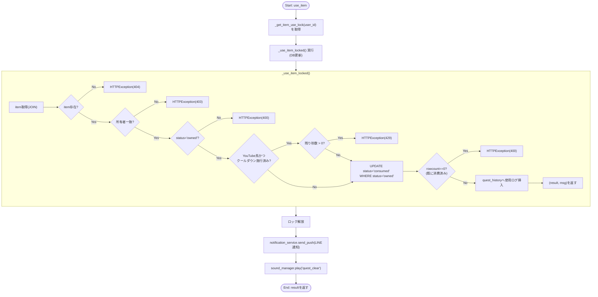
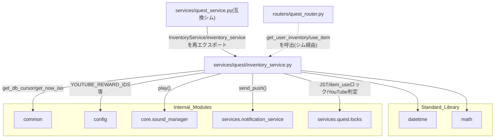

## 1. 解析メタ情報

| 項目 | 内容 |
| --- | --- |
| 対象ファイル | `MY_HOME_SYSTEM/services/quest/inventory_service.py`（フルパス, disambiguation目的） |
| 言語 | Python |
| 解析対象 | 提供されたコードのみ |
| 推測・補完 | 一切なし |

同名衝突の注意: `services/quest/quest_service.py`と`services/quest_service.py`（下位互換シム）がファイル名`quest_service`で衝突するため、`services/quest/`配下の6ファイルはいずれも`quest_`を接頭辞とした名前で区別している（`dashboard_common.md`と同じ命名規約）。本ファイルは`inventory_service.py`という単独の基底名のため実際には衝突しないが、命名一貫性のため`quest_inventory_service.md`とした。

## 関連ドキュメント

* [quest_service.md](./quest_service.md) - `services/quest_service.py`（下位互換シム）。`from services.quest.inventory_service import InventoryService, inventory_service`として本ファイルのクラス・シングルトンを再エクスポートする
* [quest_locks.md](./quest_locks.md) - `JST`/`_get_item_use_lock`/`_get_youtube_cooldown_remaining_seconds`/`_is_youtube_cooldown_enforced`の提供元
* [common.md](./common.md) - `common.get_db_cursor`/`common.get_now_iso`を提供するモジュール
* [config.md](./config.md) - `config.YOUTUBE_REWARD_IDS`/`config.YOUTUBE_REWARD_COOLDOWN_ENFORCE_FROM`/`config.LINE_USER_ID`の提供元
* [sound_manager.md](./sound_manager.md) - `core.sound_manager.play`の実体
* [notification_service.md](./notification_service.md) - `services.notification_service.send_push`の実体
* [quest_router.md](./quest_router.md) - `get_user_inventory`/`use_item`の呼び出し元と推測されるFastAPIルーター（下位互換シム経由でimportしている）
* [InventoryList.md](../family-quest/src/features/shop/components/InventoryList.md) - `GET /api/quest/inventory/{user_id}`のレスポンス形状(`items`/`youtube_cooldown_remaining_seconds`/`is_youtube_reward`/`youtube_cooldown_announcement`)を消費するフロントエンドコンポーネント

## 2. ファイルの概要

購入済みアイテム(`user_inventory`)の一覧取得(`get_user_inventory`)と使用確定(`use_item`/`_use_item_locked`)を担う`InventoryService`クラス1つを定義するファイル。アイテム使用は`'pending'`状態での申請と`ROLE_ADULT`による承認を経る2段階フローではなく、所有者・所有状態(`'owned'`)確認後に即座に消費を確定する単一ステップの処理である。YouTube系ごほうび券(`config.YOUTUBE_REWARD_IDS`)については、連続視聴による目の負担を防ぐため15分のクールダウンを課す機構を持ち、`config.YOUTUBE_REWARD_COOLDOWN_ENFORCE_FROM`を迎えるまでは実際には拒否せず予告バナー用の情報を返すのみに留める。ファイル末尾で`InventoryService`のシングルトンインスタンス`inventory_service`を生成しており、コメントによれば「Family Quest内で唯一`GameSystem`(quest/user/shop_service)の合成に含まれないシングルトン」である。
根拠: `class InventoryService:` (行番号: 20)、`def use_item(self, user_id: str, inventory_id: int) -> Dict[str, str]:` (行番号: 64〜81)、`def _use_item_locked(self, user_id: str, inventory_id: int) -> Tuple[Dict[str, str], str]:` (行番号: 83〜141)、コメント (行番号: 144〜145 / 抜粋: "アイテム使用は承認フローを介さず即時確定する、Family Quest内で唯一\n# GameSystem(quest/user/shop_service)の合成に含まれないシングルトン。")

## 3. 外部依存関係

### インポート一覧

| 名称 | 種類 | 用途 | 根拠 |
| --- | --- | --- | --- |
| `datetime` | 標準ライブラリ | `get_user_inventory`が`youtube_cooldown_announcement`の`days_remaining`を算出するための日付演算 | `import datetime` (行番号: 2) |
| `math` | 標準ライブラリ | `_use_item_locked`がクールダウン残り秒数を分単位に切り上げる(`math.ceil`) | `import math` (行番号: 3) |
| `typing` (`Any`, `Dict`, `Tuple`) | 標準ライブラリ | 型ヒント（`_use_item_locked`の戻り値型`Tuple[Dict[str, str], str]`を含む） | `from typing import Any, Dict, Tuple` (行番号: 4) |
| `fastapi.HTTPException` | 外部ライブラリ | エラーレスポンス生成 | `from fastapi import HTTPException` (行番号: 6) |
| `common` | 内部モジュール | DBカーソル取得、現在時刻(ISO)取得 | `import common` (行番号: 8) |
| `config` | 内部モジュール | `YOUTUBE_REWARD_IDS`/`YOUTUBE_REWARD_COOLDOWN_ENFORCE_FROM`/`LINE_USER_ID`の参照 | `import config` (行番号: 9) |
| `core.sound_manager` | 内部モジュール | 音声再生イベント発行(`use_item`) | `from core import sound_manager` (行番号: 10) |
| `services.notification_service` | 内部モジュール | LINEへのプッシュ通知(`use_item`) | `from services import notification_service` (行番号: 11) |
| `services.quest.locks` (`JST`, `_get_item_use_lock`, `_get_youtube_cooldown_remaining_seconds`, `_is_youtube_cooldown_enforced`) | 内部モジュール | 定数・ロック・YouTubeクールダウン判定の共有基盤（詳細は[quest_locks.md](./quest_locks.md)参照） | `from services.quest.locks import (\n    JST,\n    _get_item_use_lock,\n    _get_youtube_cooldown_remaining_seconds,\n    _is_youtube_cooldown_enforced,\n)` (行番号: 12〜17) |

### ブラックボックスとなる外部要素

| 名称 | 理由 | 根拠 |
| --- | --- | --- |
| `common.get_db_cursor()` / `common.get_now_iso()` | トランザクションスコープや接続の詳細、生成されるISO文字列のフォーマットが本ファイルからは不明 | `with common.get_db_cursor() as cur:` (行番号: 22) |
| `config.YOUTUBE_REWARD_IDS`/`config.YOUTUBE_REWARD_COOLDOWN_ENFORCE_FROM`/`config.LINE_USER_ID`の実際の値 | `config.py`側の定義・実値が本ファイルからは不明 | `item['reward_id'] in config.YOUTUBE_REWARD_IDS` (行番号: 37) |
| `notification_service.send_push`の完全な仕様 | 送信先・リトライ仕様等が本ファイルからは不明 | `notification_service.send_push(user_id=config.LINE_USER_ID, messages=[...])` (行番号: 75〜78) |
| `sound_manager.play`の実体 | 再生される音声・失敗時の挙動が本ファイルからは不明 | `sound_manager.play("quest_clear")` (行番号: 79) |
| DBの各テーブルスキーマ | `user_inventory`/`reward_master`/`quest_users`/`quest_history`の各カラムの型・制約は本ファイルからは不明 | `sql = """SELECT ui.id, ...FROM user_inventory ui..."""` (行番号: 23〜30) |

## 4. 主要要素の定義（関数 / エンドポイント / コンポーネント）

### `InventoryService.get_user_inventory`

* **役割**: `user_id`の`status = 'owned'`な`user_inventory`行を`reward_master`とJOINして取得し、`purchased_at`降順で返す。各アイテムに`is_youtube_reward`(`reward_id`が`config.YOUTUBE_REWARD_IDS`に含まれるか)を付与する。`_is_youtube_cooldown_enforced()`が`True`(施行日以降)であれば`_get_youtube_cooldown_remaining_seconds`で実際の残り秒数を算出し、`False`(施行日前)であれば`0`とし、代わりに`youtube_cooldown_announcement`(施行開始日`starts_on`と残り日数`days_remaining`)を組み立てて予告バナー用の情報として返す。
* 根拠: `def get_user_inventory(self, user_id: str) -> Dict[str, Any]:` (行番号: 21〜62)
* 根拠: `item['is_youtube_reward'] = item['reward_id'] in config.YOUTUBE_REWARD_IDS` (行番号: 37)
* 根拠: `cooldown_enforced = _is_youtube_cooldown_enforced()\n            youtube_cooldown_remaining_seconds = (\n                _get_youtube_cooldown_remaining_seconds(cur, user_id) if cooldown_enforced else 0\n            )` (行番号: 40〜43)
* 根拠: `if not cooldown_enforced and config.YOUTUBE_REWARD_IDS:\n                days_remaining = (\n                    config.YOUTUBE_REWARD_COOLDOWN_ENFORCE_FROM - datetime.datetime.now(JST).date()\n                ).days\n                youtube_cooldown_announcement = {\n                    "starts_on": config.YOUTUBE_REWARD_COOLDOWN_ENFORCE_FROM.isoformat(),\n                    "days_remaining": max(0, days_remaining),\n                }` (行番号: 49〜56)
* **引数/リクエスト**: `user_id: str`
* 根拠: (行番号: 21)
* **戻り値/レスポンス**: `Dict[str, Any]`（`items: List[dict]`, `youtube_cooldown_remaining_seconds: int`, `youtube_cooldown_announcement: Optional[dict]`）
* 根拠: (行番号: 58〜62)
* **副作用**: DB参照（`user_inventory` JOIN `reward_master`。`_get_youtube_cooldown_remaining_seconds`経由で`user_inventory`への追加SELECTも発生しうる）
* 根拠: (行番号: 23〜31, 42)
* **エラーハンドリング**: なし
* 根拠: (行番号: 21〜62)

### `InventoryService.use_item`

* **役割**: `_get_item_use_lock(user_id)`を取得したうえでDB更新部分を`_use_item_locked`に委譲する。ロックの保持範囲はDB更新(コミット)までに限定し、外部副作用(LINE送信・効果音)はロック解放後に実行する。これは、以前`_use_item_locked`の末尾で同期のLINE push(最大15秒)まで実行していたため、LINEが遅い/タイムアウトした場合に同一ユーザーの次の`use_item`がその往復の間直列化されていた問題への対策である。
* 根拠: `def use_item(self, user_id: str, inventory_id: int) -> Dict[str, str]:` (行番号: 64〜81)
* 根拠: `with _get_item_use_lock(user_id):\n            result, msg = self._use_item_locked(user_id, inventory_id)\n\n        notification_service.send_push(\n            user_id=config.LINE_USER_ID,\n            messages=[{"type": "text", "text": msg}]\n        )\n        sound_manager.play("quest_clear")\n\n        return result` (行番号: 69〜81)
* **引数/リクエスト**: `user_id: str`, `inventory_id: int`
* 根拠: (行番号: 64)
* **戻り値/レスポンス**: `Dict[str, str]`（`_use_item_locked`が返す`result`をそのまま返却。実体は`{"status": "consumed", "message": "つかいました！"}`）
* 根拠: (行番号: 70, 81, 141)
* **副作用**: `_get_item_use_lock`によるロック取得・解放、`_use_item_locked`呼び出し（DB更新）、`notification_service.send_push`によるLINE通知（ロック解放後）、`sound_manager.play("quest_clear")`（ロック解放後）
* 根拠: (行番号: 69〜79)
* **エラーハンドリング**: なし（`_use_item_locked`から送出される`HTTPException`はそのまま伝播）
* 根拠: (行番号: 64〜81)

### `InventoryService._use_item_locked`

* **役割**: アイテムを使用し即座に消費を確定する(親の承認は不要)。`user_inventory`と`reward_master`・`quest_users`をJOINして対象アイテムを取得し、所有者一致・`status == 'owned'`を確認する。対象がYouTube系ごほうび券かつクールダウンが施行済みであれば、`_get_youtube_cooldown_remaining_seconds`で残り秒数を確認し、正の値であれば429エラー(残り分数をメッセージに含める)を送出する。`UPDATE ... SET status = 'consumed' ... WHERE id = ? AND status = 'owned'`という条件付きUPDATEで消費を確定し、`rowcount == 0`(先行リクエストが既に消費済み)なら400エラーとすることで、連打による二重使用を防ぐ。成功後、`quest_history`に`quest_id=0`・`status='approved'`のアイテム使用ログを挿入する。戻り値は`(APIレスポンス, 通知メッセージ)`のタプルで、通知の送信自体は呼び出し元(`use_item`)がロック解放後に行う。
* 根拠: `def _use_item_locked(self, user_id: str, inventory_id: int) -> Tuple[Dict[str, str], str]:` (行番号: 83〜141)
* 根拠: `if item['reward_id'] in config.YOUTUBE_REWARD_IDS and _is_youtube_cooldown_enforced():\n                cooldown_remaining = _get_youtube_cooldown_remaining_seconds(cur, user_id)\n                if cooldown_remaining > 0:\n                    remaining_minutes = math.ceil(cooldown_remaining / 60)\n                    raise HTTPException(\n                        429,\n                        f"YouTubeのごほうび券は、目を休めるためあと{remaining_minutes}分ほど使えません",\n                    )` (行番号: 110〜117)
* 根拠: `cur.execute("""\n                UPDATE user_inventory\n                SET status = 'consumed', used_at = ?\n                WHERE id = ? AND status = 'owned'\n            """, (now_iso, inventory_id))\n            if cur.rowcount == 0:\n                raise HTTPException(400, "Cannot use this item")` (行番号: 125〜131)
* 根拠: `cur.execute("""\n                INSERT INTO quest_history (user_id, quest_id, quest_title, exp_earned, gold_earned, completed_at, status)\n                VALUES (?, 0, ?, 0, 0, ?, 'approved')\n            """, (item['user_id'], log_title, now_iso))` (行番号: 134〜137)
* **引数/リクエスト**: `user_id: str`, `inventory_id: int`
* 根拠: (行番号: 83)
* **戻り値/レスポンス**: `Tuple[Dict[str, str], str]`（`({"status": "consumed", "message": "つかいました！"}, msg)`）
* 根拠: (行番号: 141)
* **副作用**: DB参照/更新（`user_inventory`, `reward_master`, `quest_users`のJOIN参照、`user_inventory.status`のUPDATE、`quest_history`への挿入）
* 根拠: (行番号: 90〜97, 125〜129, 134〜137)
* **エラーハンドリング**: アイテム不在時`HTTPException(404, "Item not found")`。所有者不一致`HTTPException(403, "Not your item")`。`status != 'owned'`(未所有時)`HTTPException(400, "Cannot use this item")`。YouTubeクールダウン中`HTTPException(429, ...)`。UPDATE後の`rowcount == 0`(既に消費済み、連打対策)`HTTPException(400, "Cannot use this item")`。
* 根拠: (行番号: 99〜104, 114〜117, 130〜131)

### `inventory_service` (モジュールレベル変数)

* **役割**: `InventoryService`のシングルトンインスタンス。コメントによれば「Family Quest内で唯一`GameSystem`(quest/user/shop_service)の合成に含まれないシングルトン」であり、`services/quest/game_system.py`の`GameSystem`は`InventoryService`を保持しない。
* 根拠: `inventory_service = InventoryService()` (行番号: 146)、コメント (行番号: 144〜145)
* **引数/リクエスト・戻り値/レスポンス・副作用・エラーハンドリング**: 該当なし（モジュールレベルのインスタンス生成）
* 根拠: (行番号: 146)

## 5. 処理フロー図

## 6. 依存関係図

## 7. 次のステップ（リバースエンジニアリングの提案）

| 優先度 | ファイル名 | 理由 | 根拠 |
| --- | --- | --- | --- |
| 高 | `services/quest/locks.py`（[quest_locks.md](./quest_locks.md)） | `_is_youtube_cooldown_enforced`/`_get_youtube_cooldown_remaining_seconds`の実装詳細と、`_get_item_use_lock`のレースコンディション対策を確認するため。 | `from services.quest.locks import (...)` (行番号: 12〜17) |
| 中 | `config.py`（[config.md](./config.md)） | `YOUTUBE_REWARD_IDS`/`YOUTUBE_REWARD_COOLDOWN_ENFORCE_FROM`/`LINE_USER_ID`の実際の値を確認するため。 | `config.YOUTUBE_REWARD_IDS` (行番号: 37) |
| 低 | `family-quest/src/features/shop/components/InventoryList.tsx` | `is_youtube_reward`/`youtube_cooldown_remaining_seconds`/`youtube_cooldown_announcement`の実際のUI表現を確認するため。 | 関連ドキュメント欄参照 |

## 8. 保守上の注意点

* **`use_item`の通知は`LINE_USER_ID`宛に1回のみ**: アイテム使用に親の承認は不要なため、承認待ちを知らせる通知や承認権限を持つユーザー個別への「承認待ちがある」というプッシュ通知は存在しない。
* 根拠: `notification_service.send_push(user_id=config.LINE_USER_ID, messages=[{"type": "text", "text": msg}])` (行番号: 75〜78)
* **`_is_youtube_cooldown_enforced`と`YOUTUBE_REWARD_COOLDOWN_SECONDS`は独立した2つの判定軸**: 前者はクールダウンをいつから実際に強制するか（施行日）、後者はクールダウンの長さ（15分）を扱う。`get_user_inventory`と`_use_item_locked`の両方がこの2つを組み合わせて「施行前は予告のみ・施行後は拒否」という挙動を実現している。
* 根拠: (行番号: 40〜56, 110〜117)
* **`use_item`のロック解放後に行う外部副作用は失敗しても`use_item`のレスポンスに影響しない**: `notification_service.send_push`/`sound_manager.play`はいずれも戻り値を確認しておらず、これらが例外を送出した場合は`use_item`全体が失敗する構造になっている（`try/except`で囲われていないため）点に注意。
* 根拠: (行番号: 75〜79、`try`ブロックが存在しない)
* **`_use_item_locked`のYouTube判定は`item['reward_id']`が`config.YOUTUBE_REWARD_IDS`に含まれるかのみで行われる**: `reward_master.category`等の他のフィールドは判定に使われない。
* 根拠: `if item['reward_id'] in config.YOUTUBE_REWARD_IDS and _is_youtube_cooldown_enforced():` (行番号: 110)

## 9. 不明事項一覧

| 項目 | 理由 | 必要なファイル |
| --- | --- | --- |
| DB各テーブルのスキーマ | `user_inventory`/`reward_master`/`quest_users`/`quest_history`の各カラムの型・制約が本ファイルからは不明。 | DBのDDL、マイグレーション定義ファイル |
| `config.YOUTUBE_REWARD_IDS`/`config.YOUTUBE_REWARD_COOLDOWN_ENFORCE_FROM`/`config.LINE_USER_ID`の実際の値 | `.env`依存の実値は本ファイルからは確認できない。 | `config.py`, `.env`（gitignore対象） |
| `notification_service.send_push`の完全な仕様 | リトライ・失敗時の挙動が本ファイルからは不明。 | `services/notification_service.py`（[notification_service.md](./notification_service.md)） |

## 10. 自己検証結果

* [x] 完了: 推測・外部ファイルの仕様を一切含んでいない
* [x] 完了: 全関数・全クラス・全メソッド・モジュールレベル変数を列挙した
* [x] 完了: 全てのインポート要素を列挙した
* [x] 完了: すべての仕様説明に「根拠（行番号・抜粋）」を明記した
* [x] 完了: 根拠漏れが0件である
* [x] 完了: Mermaid構文にエラーの原因となる記号（エスケープ漏れ）がない
* [x] 完了: 不明事項を漏れなく列挙した
