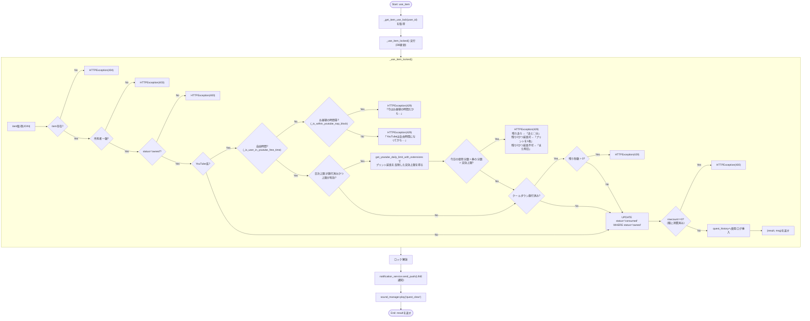
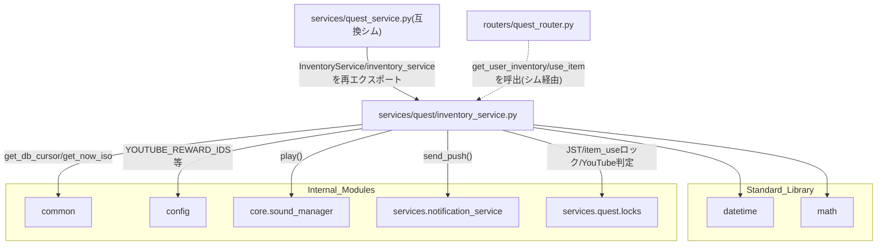

## 1. 解析メタ情報

| 項目 | 内容 |
| --- | --- |
| 対象ファイル | `MY_HOME_SYSTEM/services/quest/inventory_service.py`（フルパス, disambiguation目的） |
| 言語 | Python |
| 解析対象 | 提供されたコードのみ |
| 推測・補完 | 一切なし |
| 解析基準コミット | `a1d2738` |

同名衝突の注意: `services/quest/quest_service.py`と`services/quest_service.py`（下位互換シム）がファイル名`quest_service`で衝突するため、`services/quest/`配下の6ファイルはいずれも`quest_`を接頭辞とした名前で区別している（`dashboard_common.md`と同じ命名規約）。本ファイルは`inventory_service.py`という単独の基底名のため実際には衝突しないが、命名一貫性のため`quest_inventory_service.md`とした。

## 関連ドキュメント

* [quest_service.md](./quest_service.md) - `services/quest_service.py`（下位互換シム）。`from services.quest.inventory_service import InventoryService, inventory_service`として本ファイルのクラス・シングルトンを再エクスポートする
* [quest_locks.md](./quest_locks.md) - `JST`/`_get_item_use_lock`/`_get_youtube_cooldown_remaining_seconds`/`_is_youtube_cooldown_enforced`/`_is_youtube_daily_limit_enforced`/`can_extend_youtube_limit_now`/`get_youtube_daily_limit_minutes`/`get_youtube_daily_limit_with_extensions`/`get_youtube_reward_duration_minutes`/`get_youtube_used_minutes_today`の提供元
* [common.md](./common.md) — **Issue #664 で `common.py` ごと廃止された Deprecated Facade**（本ファイルは実体を直importするようになった。仕様書は履歴として残っている）
* [config.md](./config.md) - `config.YOUTUBE_REWARD_IDS`/`config.YOUTUBE_REWARD_COOLDOWN_ENFORCE_FROM`/`config.YOUTUBE_DAILY_LIMIT_ENFORCE_FROM`/`config.YOUTUBE_EXTENSION_QUEST_IDS`/`config.YOUTUBE_EXTENSION_MINUTES_PER_QUEST`/`config.LINE_USER_ID`/`config.YOUTUBE_HOME_CARE_USER_IDS`/`config.YOUTUBE_NAP_BLOCK_START`/`config.YOUTUBE_NAP_BLOCK_END`の提供元
* [sound_manager.md](./sound_manager.md) - `core.sound_manager.play`の実体
* [notification_service.md](./notification_service.md) - `services.notification_service.send_push`の実体
* [quest_router.md](./quest_router.md) - `get_user_inventory`/`use_item`の呼び出し元と推測されるFastAPIルーター（下位互換シム経由でimportしている）
* [InventoryList.md](../family-quest/src/features/shop/components/InventoryList.md) - `GET /api/quest/inventory/{user_id}`のレスポンス形状(`items`/`youtube_cooldown_remaining_seconds`/`is_youtube_reward`/`youtube_duration_minutes`/`youtube_cooldown_announcement`/`youtube_daily_limit_minutes`/`youtube_daily_used_minutes`/`youtube_daily_limit_announcement`/`youtube_extension`)を消費するフロントエンドコンポーネント

## 2. ファイルの概要

購入済みアイテム(`user_inventory`)の一覧取得(`get_user_inventory`)と使用確定(`use_item`/`_use_item_locked`)を担う`InventoryService`クラス1つを定義するファイル。アイテム使用は`'pending'`状態での申請と`ROLE_ADULT`による承認を経る2段階フローではなく、所有者・所有状態(`'owned'`)確認後に即座に消費を確定する単一ステップの処理である。YouTube系ごほうび券(`config.YOUTUBE_REWARD_IDS`)については、連続視聴による目の負担を防ぐため2つの制限を課す機構を持つ。1つは「券の視聴分数 + 休憩15分」のクールダウン、もう1つはJSTの1日で使える合計視聴分数の上限で、それぞれ`config.YOUTUBE_REWARD_COOLDOWN_ENFORCE_FROM`/`config.YOUTUBE_DAILY_LIMIT_ENFORCE_FROM`という**別々の**施行日を持ち、施行日を迎えるまでは実際には拒否せず予告バナー用の情報を返すのみに留める。日次上限については、使い切った後に追加でプリント(`config.YOUTUBE_EXTENSION_QUEST_IDS`)をやると上限が延びる仕組みも持ち、実効上限の算出は`get_youtube_daily_limit_with_extensions`に委譲する。**（Issue報告、2026-09-24で追加）** これらに加え、モジュールレベル関数`_is_user_in_youtube_free_time`が「自由時間かどうか」の最終判定を担う。これは`routine_service.is_user_currently_in_free_time`(登校/下校を前提としたルーティンフローの状態)をそのまま使うのではなく、(1)`config.YOUTUBE_NAP_BLOCK_START`〜`YOUTUBE_NAP_BLOCK_END`のお昼寝の時間帯は誰であっても常に不可、(2)`config.YOUTUBE_HOME_CARE_USER_IDS`(今年度自宅保育で登校しない涼花)に含まれるユーザーはroutine_serviceのゲート自体を適用せず常に可、という2つのルールをこの順で先に適用してから、それ以外のユーザーだけ`routine_service.is_user_currently_in_free_time`に委ねる。ファイル末尾で`InventoryService`のシングルトンインスタンス`inventory_service`を生成しており、コメントによれば「Family Quest内で唯一`GameSystem`(quest/user/shop_service)の合成に含まれないシングルトン」である。
根拠: `class InventoryService:` (行番号: 69)、`def use_item(self, user_id: str, inventory_id: int) -> Dict[str, str]:` (行番号: 162〜179)、`def _use_item_locked(self, user_id: str, inventory_id: int) -> Tuple[Dict[str, str], str]:` (行番号: 181〜282)、コメント (行番号: 285〜286 / 抜粋: "アイテム使用は承認フローを介さず即時確定する、Family Quest内で唯一\n# GameSystem(quest/user/shop_service)の合成に含まれないシングルトン。")、`def _is_user_in_youtube_free_time(user_id: str, now: datetime.datetime | None = None) -> bool:` (行番号: 40〜54)

## 3. 外部依存関係

### インポート一覧

| 名称 | 種類 | 用途 | 根拠 |
| --- | --- | --- | --- |
| `datetime` | 標準ライブラリ | `_build_announcement`が予告バナーの`days_remaining`を算出するための日付演算 | `import datetime` (行番号: 2) |
| `math` | 標準ライブラリ | `_use_item_locked`がクールダウン残り秒数を分単位に切り上げる(`math.ceil`) | `import math` (行番号: 3) |
| `typing` (`Any`, `Dict`, `Tuple`) | 標準ライブラリ | 型ヒント（`_use_item_locked`の戻り値型`Tuple[Dict[str, str], str]`を含む） | `from typing import Any, Dict, Tuple` (行番号: 4) |
| `fastapi.HTTPException` | 外部ライブラリ | エラーレスポンス生成 | `from fastapi import HTTPException` (行番号: 6) |
| `core.utils.get_now_iso` | ローカルモジュール | **（Issue #664 で変更）** 以前は Deprecated Facade である `common` 経由で参照していた。`common.py` の廃止に伴い実体を直接importする | 根拠: `from core.utils import get_now_iso` (行番号: 8 / 抜粋: "from core.utils import get_now_iso") |
| `core.database.get_db_cursor` | ローカルモジュール | **（Issue #664 で変更）** 以前は Deprecated Facade である `common` 経由で参照していた。`common.py` の廃止に伴い実体を直接importする | 根拠: `from core.database import get_db_cursor` (行番号: 9 / 抜粋: "from core.database import get_db_cursor") |
| `config` | 内部モジュール | `YOUTUBE_REWARD_IDS`/`YOUTUBE_REWARD_COOLDOWN_ENFORCE_FROM`/`YOUTUBE_DAILY_LIMIT_ENFORCE_FROM`/`YOUTUBE_EXTENSION_QUEST_IDS`/`YOUTUBE_EXTENSION_MINUTES_PER_QUEST`/`YOUTUBE_EXTENSION_MAX_PER_DAY`/`LINE_USER_ID`/**（Issue報告、2026-09-24で追加）**`YOUTUBE_HOME_CARE_USER_IDS`/`YOUTUBE_NAP_BLOCK_START`/`YOUTUBE_NAP_BLOCK_END`の参照 | `import config` (行番号: 10) |
| `core.sound_manager` | 内部モジュール | 音声再生イベント発行(`use_item`) | `from core import sound_manager` (行番号: 10) |
| `services.notification_service` | 内部モジュール | LINEへのプッシュ通知(`use_item`) | `from services import notification_service` (行番号: 11) |
| `services.routine_service.routine_service` | 内部モジュール | **（2026-09-23 要件追加、2026-09-24 要件変更）** `is_user_currently_in_free_time`の呼び出しによる自由時間判定（YouTube等の時間消費型ごほうびの使用制限、[routine_service.md](./routine_service.md)参照）。`_is_user_in_youtube_free_time`経由で呼ばれ、`config.YOUTUBE_HOME_CARE_USER_IDS`に含まれるユーザーではこの呼び出し自体がスキップされる | `from services.routine_service import routine_service` (行番号: 13) |
| `services.quest.locks` (`JST`, `_get_item_use_lock`, `_get_youtube_cooldown_remaining_seconds`, `_is_youtube_cooldown_enforced`, `_is_youtube_daily_limit_enforced`, `can_extend_youtube_limit_now`, `get_youtube_daily_limit_minutes`, `get_youtube_daily_limit_with_extensions`, `get_youtube_reward_duration_minutes`, `get_youtube_used_minutes_today`) | 内部モジュール | 定数・ロック・YouTube視聴制限(クールダウン/日次上限)判定の共有基盤（詳細は[quest_locks.md](./quest_locks.md)参照） | `from services.quest.locks import (\n    JST,\n    _get_item_use_lock,\n    ...\n    get_youtube_used_minutes_today,\n)` (行番号: 14〜25) |

### ブラックボックスとなる外部要素

| 名称 | 理由 | 根拠 |
| --- | --- | --- |
| `core.database.get_db_cursor()` / `core.utils.get_now_iso()` | トランザクションスコープや接続の詳細、生成されるISO文字列のフォーマットが本ファイルからは不明 | `with core.database.get_db_cursor() as cur:` (行番号: 22) |
| `config.YOUTUBE_REWARD_IDS`/`config.YOUTUBE_REWARD_COOLDOWN_ENFORCE_FROM`/`config.YOUTUBE_DAILY_LIMIT_ENFORCE_FROM`/`config.LINE_USER_ID`/`config.YOUTUBE_HOME_CARE_USER_IDS`/`config.YOUTUBE_NAP_BLOCK_START`/`config.YOUTUBE_NAP_BLOCK_END`の実際の値 | `config.py`側の定義・実値が本ファイルからは不明 | `item['is_youtube_reward'] = item['reward_id'] in config.YOUTUBE_REWARD_IDS` (行番号: 91)、`return config.YOUTUBE_NAP_BLOCK_START <= t < config.YOUTUBE_NAP_BLOCK_END` (行番号: 37)、`if user_id in config.YOUTUBE_HOME_CARE_USER_IDS:` (行番号: 52) |
| `notification_service.send_push`の完全な仕様 | 送信先・リトライ仕様等が本ファイルからは不明 | `notification_service.send_push(user_id=config.LINE_USER_ID, messages=[...])` (行番号: 75〜78) |
| `sound_manager.play`の実体 | 再生される音声・失敗時の挙動が本ファイルからは不明 | `sound_manager.play("quest_clear")` (行番号: 79) |
| DBの各テーブルスキーマ | `user_inventory`/`reward_master`/`quest_users`/`quest_history`の各カラムの型・制約は本ファイルからは不明 | `sql = """SELECT ui.id, ...FROM user_inventory ui..."""` (行番号: 23〜30) |

## 4. 主要要素の定義（関数 / エンドポイント / コンポーネント）

### `_is_within_youtube_nap_block` (モジュールレベル関数)

* **役割**: **（Issue報告、2026-09-24で追加）** 現在時刻(JST)が`config.YOUTUBE_NAP_BLOCK_START`〜`YOUTUBE_NAP_BLOCK_END`のお昼寝の時間帯に入っているかどうかを返す。docstringによれば「涼花・智矢とも共通で、自由時間ゲート・自宅保育の適用除外とは別軸で常に適用する制限のため、フローの状態を一切見ない単純な壁時計判定にしている」。`now`省略時は`datetime.datetime.now(JST)`を使う。
* 根拠: `def _is_within_youtube_nap_block(now: datetime.datetime | None = None) -> bool:` (行番号: 28〜37)
* **引数/リクエスト**: `now: datetime.datetime | None`（省略時は現在時刻）
* 根拠: (行番号: 28)
* **戻り値/レスポンス**: `bool`（`config.YOUTUBE_NAP_BLOCK_START <= t < config.YOUTUBE_NAP_BLOCK_END`。開始側は境界を含み終了側は含まない半開区間）
* 根拠: `return config.YOUTUBE_NAP_BLOCK_START <= t < config.YOUTUBE_NAP_BLOCK_END` (行番号: 37)
* **副作用**: なし（純粋な時刻比較）
* 根拠: (行番号: 34〜37)
* **エラーハンドリング**: なし
* 根拠: (行番号: 28〜37)

### `_is_user_in_youtube_free_time` (モジュールレベル関数)

* **役割**: **（Issue報告、2026-09-24で追加）** `get_user_inventory`と`_use_item_locked`が共有する、YouTube系ごほうび券を使える「自由時間」かどうかの最終判定。まず`_is_within_youtube_nap_block`が真なら誰であっても`False`を返す(お昼寝の時間帯は最優先)。次に`user_id`が`config.YOUTUBE_HOME_CARE_USER_IDS`に含まれれば`True`を返す(登校/下校を前提とした自由時間ゲート自体を適用しない)。それ以外は`routine_service.is_user_currently_in_free_time(user_id, now=now)`の結果をそのまま返す。docstringによれば、涼花のように今年度登校しない(自宅保育)ユーザーに`is_user_currently_in_free_time`をそのまま適用すると「平日07:50〜14:00がずっと『自由時間ではない』扱いに固定され、券が一律使えなくなっていた」ため、この関数を新設した。
* 根拠: `def _is_user_in_youtube_free_time(user_id: str, now: datetime.datetime | None = None) -> bool:` (行番号: 40〜54)
* 根拠: `if _is_within_youtube_nap_block(now):\n        return False` (行番号: 50〜51)、`if user_id in config.YOUTUBE_HOME_CARE_USER_IDS:\n        return True` (行番号: 52〜53)、`return routine_service.is_user_currently_in_free_time(user_id, now=now)` (行番号: 54)
* **引数/リクエスト**: `user_id: str`, `now: datetime.datetime | None`（省略時は現在時刻）
* 根拠: (行番号: 40)
* **戻り値/レスポンス**: `bool`
* 根拠: (行番号: 50〜54)
* **副作用**: なし。ただし`config.YOUTUBE_HOME_CARE_USER_IDS`に含まれないユーザーでは`routine_service.is_user_currently_in_free_time`呼び出しを経由し、これが`routine_progress`テーブルへの読み取り専用アクセスを発生させる（`get_user_inventory`の副作用記述、[routine_service.md](./routine_service.md)の`get_today_state`参照）
* 根拠: (行番号: 54)
* **エラーハンドリング**: なし
* 根拠: (行番号: 40〜54)

### `_build_announcement` (モジュールレベル関数)

* **役割**: 施行日(`starts_on`)を受け取り、family-quest側の予告バナーに渡す`{"starts_on": ISO日付文字列, "days_remaining": 残り日数}`を組み立てる。docstringによれば「クールダウンと日次上限で同じ形(starts_on / days_remaining)を返すため共通化する」もの。`days_remaining`は`max(0, ...)`で負にならないよう丸められる。
* 根拠: `def _build_announcement(starts_on) -> dict[str, Any]:` (行番号: 57〜66)
* **引数/リクエスト**: `starts_on`（`datetime.date`。型注釈は付いていない）
* 根拠: (行番号: 25)
* **戻り値/レスポンス**: `dict[str, Any]`（`starts_on: str`, `days_remaining: int`）
* 根拠: `return {\n        "starts_on": starts_on.isoformat(),\n        "days_remaining": max(0, days_remaining),\n    }` (行番号: 31〜34)
* **副作用**: なし（純粋な日付演算）
* 根拠: (行番号: 30〜34)
* **エラーハンドリング**: なし
* 根拠: (行番号: 30〜34)

### `InventoryService.get_user_inventory`

* **役割**: `user_id`の`status = 'owned'`な`user_inventory`行を`reward_master`とJOINして取得し、`purchased_at`降順で返す。各アイテムに`is_youtube_reward`(`reward_id`が`config.YOUTUBE_REWARD_IDS`に含まれるか)と`youtube_duration_minutes`(YouTube系なら`get_youtube_reward_duration_minutes`の戻り値、それ以外は`None`)を付与する。加えてYouTubeの視聴制限に関する4つの値を返す。(1) `_is_youtube_cooldown_enforced()`が`True`(施行日以降)であれば`_get_youtube_cooldown_remaining_seconds`で実際の残り秒数を算出し、`False`であれば`0`とする。(2) `False`の場合は代わりに`youtube_cooldown_announcement`を`_build_announcement`で組み立てる。(3) `youtube_daily_limit_minutes`/`youtube_daily_used_minutes`は**施行前でも返す**（コメントによれば「今日はあと何分」の表示は猶予期間中から出して慣れてもらうため。使用を拒否するかどうかだけが施行日で変わる）。上限なし設定では`get_youtube_daily_limit_minutes()`が`None`を返し、使用分数の集計自体もスキップされ`0`になる。返す`youtube_daily_limit_minutes`は`get_youtube_daily_limit_with_extensions`で**プリントによる延長を反映した実効上限**に差し替えられ、あわせて延長の状態を`youtube_extension`(`minutes_per_quest`/`granted_count`/`max_per_day`/`can_extend_now`)として返す（延長機能が無効な設定なら`None`）。(4) `_is_youtube_daily_limit_enforced()`が`False`かつ上限が有効なら`youtube_daily_limit_announcement`を組み立てる。**（2026-09-23 要件追加、2026-09-24 要件変更）** 冒頭で`_is_user_in_youtube_free_time(user_id)`を呼び、結果を`is_in_free_time`としてそのまま返す。YouTube等の時間消費型ごほうびの使用は自由時間中のみ許可する要件(`_use_item_locked`参照)のための情報で、フロントエンド(`InventoryList.tsx`)がタップ前にロック表示するために使う。この判定は、お昼寝の時間帯(常に不可)と自宅保育のユーザー(常に可)を先に見てから、それ以外だけ`routine_service.is_user_currently_in_free_time`に委ねる(`_is_user_in_youtube_free_time`参照)。委ねられた場合はDB参照(`with get_db_cursor()`)を開く**前**に呼んでいるため、`routine_service`側の独立した接続で読み取られる。
* 根拠: `def get_user_inventory(self, user_id: str) -> Dict[str, Any]:` (行番号: 70〜160)
* 根拠: `is_in_free_time = _is_user_in_youtube_free_time(user_id)` (行番号: 74)
* 根拠: `item['is_youtube_reward'] = item['reward_id'] in config.YOUTUBE_REWARD_IDS` (行番号: 54)、`item['youtube_duration_minutes'] = (\n                    get_youtube_reward_duration_minutes(item['reward_id'])\n                    if item['is_youtube_reward']\n                    else None\n                )` (行番号: 58〜62)
* 根拠: `cooldown_enforced = _is_youtube_cooldown_enforced()\n            youtube_cooldown_remaining_seconds = (\n                _get_youtube_cooldown_remaining_seconds(cur, user_id) if cooldown_enforced else 0\n            )` (行番号: 65〜68)
* 根拠: `if not cooldown_enforced and config.YOUTUBE_REWARD_IDS:\n                youtube_cooldown_announcement = _build_announcement(\n                    config.YOUTUBE_REWARD_COOLDOWN_ENFORCE_FROM\n                )` (行番号: 74〜77)
* 根拠: `youtube_daily_limit_minutes = (\n                get_youtube_daily_limit_minutes() if config.YOUTUBE_REWARD_IDS else None\n            )` (行番号: 84〜86)、`youtube_daily_limit_minutes, granted = get_youtube_daily_limit_with_extensions(\n                    cur, user_id, youtube_daily_limit_minutes\n                )` (行番号: 93〜95)、`youtube_extension = {\n                        "minutes_per_quest": config.YOUTUBE_EXTENSION_MINUTES_PER_QUEST,\n                        "granted_count": granted,\n                        "max_per_day": config.YOUTUBE_EXTENSION_MAX_PER_DAY,\n                        "can_extend_now": can_extend_youtube_limit_now(...),\n                    }` (行番号: 97〜105)
* 根拠: `if (\n                not _is_youtube_daily_limit_enforced()\n                and youtube_daily_limit_minutes is not None\n            ):\n                youtube_daily_limit_announcement = _build_announcement(\n                    config.YOUTUBE_DAILY_LIMIT_ENFORCE_FROM\n                )` (行番号: 92〜98)
* **引数/リクエスト**: `user_id: str`
* 根拠: (行番号: 38)
* **戻り値/レスポンス**: `Dict[str, Any]`（`items: List[dict]`, `youtube_cooldown_remaining_seconds: int`, `youtube_cooldown_announcement: Optional[dict]`, `youtube_daily_limit_minutes: Optional[int]`（延長を反映した実効上限）, `youtube_daily_used_minutes: int`, `youtube_daily_limit_announcement: Optional[dict]`, `youtube_extension: Optional[dict]`, `is_in_free_time: bool`）
* 根拠: (行番号: 122〜131)
* **副作用**: DB参照（`user_inventory` JOIN `reward_master`。`_get_youtube_cooldown_remaining_seconds`・`get_youtube_used_minutes_today`経由で`user_inventory`への、`get_youtube_daily_limit_with_extensions`経由で`user_inventory`と`quest_history`への追加SELECTも発生しうる）。加えて`routine_service.is_user_currently_in_free_time`経由で`routine_progress`テーブルへの読み取り専用アクセスが発生する（`services/routine_service.py`が独自に開く別接続、[routine_service.md](./routine_service.md)の`get_today_state`参照）。
* 根拠: (行番号: 42〜50, 69, 90, 93〜95)
* 根拠: `is_in_free_time = _is_user_in_youtube_free_time(user_id)` (行番号: 74)
* **エラーハンドリング**: なし
* 根拠: (行番号: 40〜123)

### `InventoryService.use_item`

* **役割**: `_get_item_use_lock(user_id)`を取得したうえでDB更新部分を`_use_item_locked`に委譲する。ロックの保持範囲はDB更新(コミット)までに限定し、外部副作用(LINE送信・効果音)はロック解放後に実行する。これは、以前`_use_item_locked`の末尾で同期のLINE push(最大15秒)まで実行していたため、LINEが遅い/タイムアウトした場合に同一ユーザーの次の`use_item`がその往復の間直列化されていた問題への対策である。
* 根拠: `def use_item(self, user_id: str, inventory_id: int) -> Dict[str, str]:` (行番号: 162〜179)
* 根拠: `with _get_item_use_lock(user_id):\n            result, msg = self._use_item_locked(user_id, inventory_id)\n\n        notification_service.send_push(\n            user_id=config.LINE_USER_ID,\n            messages=[{"type": "text", "text": msg}]\n        )\n        sound_manager.play("quest_clear")\n\n        return result` (行番号: 69〜81)
* **引数/リクエスト**: `user_id: str`, `inventory_id: int`
* 根拠: (行番号: 64)
* **戻り値/レスポンス**: `Dict[str, str]`（`_use_item_locked`が返す`result`をそのまま返却。実体は`{"status": "consumed", "message": "つかいました！"}`）
* 根拠: (行番号: 70, 81, 141)
* **副作用**: `_get_item_use_lock`によるロック取得・解放、`_use_item_locked`呼び出し（DB更新）、`notification_service.send_push`によるLINE通知（ロック解放後）、`sound_manager.play("quest_clear")`（ロック解放後）
* 根拠: (行番号: 69〜79)
* **エラーハンドリング**: なし（`_use_item_locked`から送出される`HTTPException`はそのまま伝播）
* 根拠: (行番号: 64〜81)

### `InventoryService._use_item_locked`

* **役割**: アイテムを使用し即座に消費を確定する(親の承認は不要)。`user_inventory`と`reward_master`・`quest_users`をJOINして対象アイテムを取得し、所有者一致・`status == 'owned'`を確認する。対象がYouTube系ごほうび券であれば、目の負担・自由時間限定を守るための3つの制限を**この順で**判定する。**（2026-09-23 要件追加、2026-09-24 要件変更）** まず0番目として、`_is_user_in_youtube_free_time(user_id)`が`False`なら429エラーを送出する。メッセージは原因で2通りに出し分ける: `_is_within_youtube_nap_block()`が真(お昼寝の時間帯)なら「今はお昼寝の時間だからYouTubeはお休みしてね」、そうでなければ(ルーティンフローの自由時間ゲートに引っかかった場合)「YouTubeは自由時間になってから見てね」。他の2つと異なり`ENFORCE_FROM`による施行猶予は設けず、新規要件として最初から有効である。次に1番目の日次上限(施行済みかつ上限が有効な場合)で、`get_youtube_used_minutes_today`と`get_youtube_reward_duration_minutes`の和が、`get_youtube_daily_limit_with_extensions`が返す**実効上限**(プリントによる延長を反映した値)を超えるなら429エラーを送出する。メッセージは3通りに出し分ける: 残りがあるなら「あと◯分だけなので、この◯分の券は使えません」、残り0かつ`can_extend_youtube_limit_now`が真なら「プリントを1枚やると◯分ふえるよ」(諦めさせるのではなく次の行動を示す)、残り0で延長も尽きているなら「また明日つかおうね」。次に2番目のクールダウン(施行済みの場合)で、`_get_youtube_cooldown_remaining_seconds`が正の値であれば429エラー(残り分数をメッセージに含める)を送出する。日次上限をクールダウンより先に見るのは、コメントによれば「『もう少し待てば使える』より『今日はここまで』のほうが子どもにとって行動が決まるメッセージになるため」である。`UPDATE ... SET status = 'consumed' ... WHERE id = ? AND status = 'owned'`という条件付きUPDATEで消費を確定し、`rowcount == 0`(先行リクエストが既に消費済み)なら400エラーとすることで、連打による二重使用を防ぐ。成功後、`quest_history`に`quest_id=0`・`status='approved'`のアイテム使用ログを挿入する。戻り値は`(APIレスポンス, 通知メッセージ)`のタプルで、通知の送信自体は呼び出し元(`use_item`)がロック解放後に行う。
* 根拠: `def _use_item_locked(self, user_id: str, inventory_id: int) -> Tuple[Dict[str, str], str]:` (行番号: 181〜282)
* 根拠: `if item['reward_id'] in config.YOUTUBE_REWARD_IDS:` (行番号: 207)、`if not _is_user_in_youtube_free_time(user_id):\n                    if _is_within_youtube_nap_block():\n                        raise HTTPException(429, "今はお昼寝の時間だからYouTubeはお休みしてね")\n                    raise HTTPException(429, "YouTubeは自由時間になってから見てね")` (行番号: 215〜218)、`if _is_youtube_daily_limit_enforced():\n                    daily_limit = get_youtube_daily_limit_minutes()\n                    ...\n                        daily_limit, granted = get_youtube_daily_limit_with_extensions(\n                            cur, user_id, daily_limit\n                        )\n                        ...\n                            raise HTTPException(429, detail)` (行番号: 223〜248)、`if can_extend_youtube_limit_now(used_minutes, daily_limit, granted):` (行番号: 237)、`if _is_youtube_cooldown_enforced():\n                    cooldown_remaining = _get_youtube_cooldown_remaining_seconds(cur, user_id)\n                    if cooldown_remaining > 0:\n                        remaining_minutes = math.ceil(cooldown_remaining / 60)\n                        raise HTTPException(\n                            429,\n                            f"YouTubeのごほうび券は、目を休めるためあと{remaining_minutes}分ほど使えません",\n                        )` (行番号: 251〜258)
* 根拠: `cur.execute("""\n                UPDATE user_inventory\n                SET status = 'consumed', used_at = ?\n                WHERE id = ? AND status = 'owned'\n            """, (now_iso, inventory_id))\n            if cur.rowcount == 0:\n                raise HTTPException(400, "Cannot use this item")` (行番号: 266〜272)
* 根拠: `cur.execute("""\n                INSERT INTO quest_history (user_id, quest_id, quest_title, exp_earned, gold_earned, completed_at, status)\n                VALUES (?, 0, ?, 0, 0, ?, 'approved')\n            """, (item['user_id'], log_title, now_iso))` (行番号: 275〜278)
* **引数/リクエスト**: `user_id: str`, `inventory_id: int`
* 根拠: (行番号: 83)
* **戻り値/レスポンス**: `Tuple[Dict[str, str], str]`（`({"status": "consumed", "message": "つかいました！"}, msg)`）
* 根拠: (行番号: 141)
* **副作用**: DB参照/更新（`user_inventory`, `reward_master`, `quest_users`のJOIN参照、`user_inventory.status`のUPDATE、`quest_history`への挿入）
* 根拠: (行番号: 187〜195, 266〜270, 275〜278)
* **エラーハンドリング**: アイテム不在時`HTTPException(404, "Item not found")`。所有者不一致`HTTPException(403, "Not your item")`。`status != 'owned'`(未所有時)`HTTPException(400, "Cannot use this item")`。**（2026-09-23 要件追加）** 自由時間外での使用`HTTPException(429, "YouTubeは自由時間になってから見てね")`。YouTubeの日次上限超過`HTTPException(429, ...)`。YouTubeクールダウン中`HTTPException(429, ...)`。UPDATE後の`rowcount == 0`(既に消費済み、連打対策)`HTTPException(400, "Cannot use this item")`。
* 根拠: (行番号: 197〜202, 215〜218, 271〜272)

### `inventory_service` (モジュールレベル変数)

* **役割**: `InventoryService`のシングルトンインスタンス。コメントによれば「Family Quest内で唯一`GameSystem`(quest/user/shop_service)の合成に含まれないシングルトン」であり、`services/quest/game_system.py`の`GameSystem`は`InventoryService`を保持しない。
* 根拠: `inventory_service = InventoryService()` (行番号: 146)、コメント (行番号: 144〜145)
* **引数/リクエスト・戻り値/レスポンス・副作用・エラーハンドリング**: 該当なし（モジュールレベルのインスタンス生成）
* 根拠: (行番号: 146)

## 5. 処理フロー図

## 6. 依存関係図

## 7. 次のステップ（リバースエンジニアリングの提案）

| 優先度 | ファイル名 | 理由 | 根拠 |
| --- | --- | --- | --- |
| 高 | `services/quest/locks.py`（[quest_locks.md](./quest_locks.md)） | `_is_youtube_cooldown_enforced`/`_get_youtube_cooldown_remaining_seconds`/`_is_youtube_daily_limit_enforced`/`get_youtube_daily_limit_minutes`/`get_youtube_daily_limit_with_extensions`/`can_extend_youtube_limit_now`/`get_youtube_used_minutes_today`の実装詳細と、`_get_item_use_lock`のレースコンディション対策を確認するため。 | `from services.quest.locks import (...)` (行番号: 13〜24) |
| 中 | `config.py`（[config.md](./config.md)） | `YOUTUBE_REWARD_IDS`/`YOUTUBE_REWARD_COOLDOWN_ENFORCE_FROM`/`YOUTUBE_REWARD_DURATION_MINUTES`/`YOUTUBE_DAILY_LIMIT_MINUTES_WEEKDAY`/`YOUTUBE_DAILY_LIMIT_MINUTES_HOLIDAY`/`YOUTUBE_DAILY_LIMIT_ENFORCE_FROM`/`LINE_USER_ID`の実際の値を確認するため。 | `config.YOUTUBE_REWARD_IDS` (行番号: 54) |
| 低 | `family-quest/src/features/shop/components/InventoryList.tsx` | `is_youtube_reward`/`youtube_duration_minutes`/`youtube_cooldown_remaining_seconds`/`youtube_cooldown_announcement`/`youtube_daily_limit_minutes`/`youtube_daily_used_minutes`/`youtube_daily_limit_announcement`の実際のUI表現を確認するため。 | 関連ドキュメント欄参照 |

## 8. 保守上の注意点

* **`use_item`の通知は`LINE_USER_ID`宛に1回のみ**: アイテム使用に親の承認は不要なため、承認待ちを知らせる通知や承認権限を持つユーザー個別への「承認待ちがある」というプッシュ通知は存在しない。
* 根拠: `notification_service.send_push(user_id=config.LINE_USER_ID, messages=[{"type": "text", "text": msg}])` (行番号: 75〜78)
* **YouTubeの視聴制限は「クールダウン」と「日次上限」の2本立てで、施行日も別管理である**: クールダウンは`_is_youtube_cooldown_enforced`/`YOUTUBE_REWARD_BREAK_SECONDS`＋券の視聴分数、日次上限は`_is_youtube_daily_limit_enforced`/`get_youtube_daily_limit_minutes`という別々の判定軸を持つ。`get_user_inventory`と`_use_item_locked`の両方がこれらを組み合わせて「施行前は予告のみ・施行後は拒否」という挙動を実現している。片方だけ施行済みという状態が正常にありうるため、どちらかの施行日を動かすときにもう片方を巻き込まないこと。
* **日次上限の「上限」は常に実効上限(プリントによる延長を反映した値)である**: `get_user_inventory`が返す`youtube_daily_limit_minutes`も`_use_item_locked`が判定に使う値も、`get_youtube_daily_limit_with_extensions`を通した後の値であり、`config`の設定値そのものではない。延長の規則(いつ・何回まで延びるか)は本ファイルには無く`services/quest/locks.py`にあるため、挙動を追うときはそちらを見ること([quest_locks.md](./quest_locks.md))。
* 根拠: `youtube_daily_limit_minutes, granted = get_youtube_daily_limit_with_extensions(` (行番号: 93)、`daily_limit, granted = get_youtube_daily_limit_with_extensions(` (行番号: 180)
* **日次上限は`get_user_inventory`では施行前でも値を返すが、`_use_item_locked`では施行後しか拒否しない**: 表示と強制のタイミングが意図的にずれている(猶予期間中から「今日はあと何分」に慣れてもらうため)。フロントエンドは`youtube_daily_limit_announcement`が`null`かどうかで「強制されているか」を判定している(詳細は[InventoryList.md](../family-quest/src/features/shop/components/InventoryList.md))。
* 根拠: (行番号: 40〜56, 110〜117)
* **`use_item`のロック解放後に行う外部副作用は失敗しても`use_item`のレスポンスに影響しない**: `notification_service.send_push`/`sound_manager.play`はいずれも戻り値を確認しておらず、これらが例外を送出した場合は`use_item`全体が失敗する構造になっている（`try/except`で囲われていないため）点に注意。
* 根拠: (行番号: 75〜79、`try`ブロックが存在しない)
* **`_use_item_locked`のYouTube判定は`item['reward_id']`が`config.YOUTUBE_REWARD_IDS`に含まれるかのみで行われる**: `reward_master.category`等の他のフィールドは判定に使われない。券1枚あたりの視聴分数も`reward_master.title`("Youtube (30:00)"等)からは読まず、`config.YOUTUBE_REWARD_DURATION_MINUTES`の対応表を唯一の根拠とする。
* 根拠: `if item['reward_id'] in config.YOUTUBE_REWARD_IDS:` (行番号: 207)
* **（Issue報告、2026-09-24で追加）** **自由時間ゲートは「登校する子」を前提にした設計であり、`config.YOUTUBE_HOME_CARE_USER_IDS`は個別のユーザーIDでその前提を打ち消す例外リストである**: `routine_service.is_user_currently_in_free_time`は`routine_data.py`の登校/下校ベースのルーティンフロー(`am`/`pm`)の状態を見るため、今年度登校しない涼花にこれを適用すると平日07:50〜14:00がずっと「自由時間ではない」扱いに固定されてしまう。この不整合を`routine_data.py`側のフロー定義を変えて直すと、そのフローの締切挙動を汎用的にテストしている`tests/test_routine_service.py`(涼花のuser_id`'daughter'`を「子ども用フロー全般の汎用テスト対象」として使い回している)を巻き込むため、あえて避け、本ファイルの`_is_user_in_youtube_free_time`だけでユーザー単位の例外を吸収する設計にした。将来、他の子が自宅保育になる/涼花が就学する等で対象が変わる場合は、この集合を更新するだけで良い(`routine_data.py`・`routine_service.py`は触らない)。
* 根拠: `def _is_user_in_youtube_free_time(user_id: str, now: datetime.datetime | None = None) -> bool:` (行番号: 40〜54)、`YOUTUBE_HOME_CARE_USER_IDS: set[str] = {"daughter"}` (config.py 行番号: 862)
* **お昼寝ブロック(`config.YOUTUBE_NAP_BLOCK_START`〜`END`)は自由時間ゲート・自宅保育の適用除外より優先して判定される**: `_is_user_in_youtube_free_time`は最初に`_is_within_youtube_nap_block`をチェックし、真であれば`config.YOUTUBE_HOME_CARE_USER_IDS`に含まれるユーザーであっても`True`を返さない。両方の制限を追加する場合、判定順序を変えるとお昼寝の時間帯に自宅保育の子だけ使えてしまう回帰になるため注意すること。
* 根拠: `if _is_within_youtube_nap_block(now):\n        return False\n    if user_id in config.YOUTUBE_HOME_CARE_USER_IDS:\n        return True` (行番号: 50〜53)

## 9. 不明事項一覧

| 項目 | 理由 | 必要なファイル |
| --- | --- | --- |
| DB各テーブルのスキーマ | `user_inventory`/`reward_master`/`quest_users`/`quest_history`の各カラムの型・制約が本ファイルからは不明。 | DBのDDL、マイグレーション定義ファイル |
| `config`のYouTube視聴制限系定数(クールダウン・日次上限・プリントによる延長)/`config.LINE_USER_ID`の実際の値 | `.env`依存の実値は本ファイルからは確認できない。 | `config.py`, `.env`（gitignore対象） |
| `notification_service.send_push`の完全な仕様 | リトライ・失敗時の挙動が本ファイルからは不明。 | `services/notification_service.py`（[notification_service.md](./notification_service.md)） |

## 相互参照による補足情報

| 元の不明事項 | 判明した内容 | 参照元ドキュメント |
| --- | --- | --- |
| DB各テーブルのスキーマ | スキーマの唯一の定義元である`MY_HOME_SYSTEM/migrations/`から生成された`MY_HOME_SYSTEM/current_schema.sql`を直接確認した。`user_inventory(id INTEGER PRIMARY KEY AUTOINCREMENT, user_id TEXT, reward_id INTEGER, status TEXT DEFAULT 'owned', purchased_at DATETIME NOT NULL, used_at DATETIME, FOREIGN KEY(reward_id) REFERENCES reward_master(reward_id))`。`status`は既定`'owned'`でCHECK制約は無く、`'consumed'`等の遷移値はアプリ層の約束事である。`used_at`はNULL許容で、未使用アイテムではNULLのまま。`reward_master(reward_id INTEGER PRIMARY KEY AUTOINCREMENT, title TEXT NOT NULL, cost_gold INTEGER, category TEXT, icon_key TEXT, desc TEXT, target TEXT DEFAULT 'all', description TEXT)`、`quest_users(user_id TEXT PRIMARY KEY, ..., gold INTEGER DEFAULT 0, ..., role TEXT)`、`quest_history(id INTEGER PRIMARY KEY AUTOINCREMENT, user_id TEXT, quest_id INTEGER, quest_title TEXT, status TEXT DEFAULT 'approved', completed_at DATETIME NOT NULL, exp_earned INTEGER, gold_earned INTEGER, linked_history_id INTEGER DEFAULT NULL, medals_earned INTEGER DEFAULT 0)`。`user_inventory`には`(user_id, reward_id, status)`複合インデックスが定義されていないため、YouTubeのクールダウン判定・日次使用分数の集計のSELECTは行数が増えると全表走査になる点が将来の注意点である(プリントによる延長の判定が読む`quest_history`には`0013_add_quest_history_indexes.sql`によるインデックスがある)。 | 直接ソース確認: `MY_HOME_SYSTEM/current_schema.sql`（`MY_HOME_SYSTEM/migrations/`から`python init_unified_db.py --dump-schema`で生成。参考: [init_unified_db.md](./init_unified_db.md)） |
| `config`のYouTube視聴制限系定数/`config.LINE_USER_ID`の実際の値 | `MY_HOME_SYSTEM/config.py`を直接確認した。`YOUTUBE_REWARD_IDS`は環境変数の既定値`"10,11,12"`をカンマ区切りで`List[int]`へパースしたもの(735〜740行目)で、既定では`[10, 11, 12]`。`quest_data.REWARDS`の`{'id': 10, 'title': 'Youtube (10:00)', ...}`等と対応する。`YOUTUBE_REWARD_COOLDOWN_ENFORCE_FROM`は既定`"2026-09-12"`を`date.fromisoformat`で変換した`datetime.date`(750〜755行目)、`YOUTUBE_DAILY_LIMIT_ENFORCE_FROM`は既定`"2026-09-24"`の同形(808〜810行目)で、いずれもパース失敗時は`date(2000, 1, 1)`へフォールバックし即時強制になる。したがって**2026-09-12(JST)以降は`_is_youtube_cooldown_enforced()`が、2026-09-24(JST)以降は`_is_youtube_daily_limit_enforced()`が`True`を返し、それぞれ予告段階を終えて実際に拒否される**。日次上限の既定値は`YOUTUBE_DAILY_LIMIT_MINUTES_WEEKDAY`=60分・`YOUTUBE_DAILY_LIMIT_MINUTES_HOLIDAY`=90分(792〜793行目)、券の視聴分数は`YOUTUBE_REWARD_DURATION_MINUTES`の既定`"10:10,11:30,12:60"`(771行目)。プリントによる延長は`YOUTUBE_EXTENSION_QUEST_IDS`の既定`"31,307"`・`YOUTUBE_EXTENSION_MINUTES_PER_QUEST`の既定30分・`YOUTUBE_EXTENSION_MAX_PER_DAY`の既定2回(812〜837行目)。`LINE_USER_ID: Optional[str] = os.getenv("LINE_USER_ID")`(229行目)は既定`None`で、`.env`でのみ設定される。`None`のまま`send_push(target="line"/"both")`が呼ばれると宛先解決に失敗し、`send_push`はエラーログを出して`False`を返す(例外は送出しない)。 | 直接ソース確認: `MY_HOME_SYSTEM/config.py:229, 735-837`（参考: [config.md](./config.md)） |
| `notification_service.send_push`の完全な仕様 | `MY_HOME_SYSTEM/services/notification_service.py`の`send_push(messages, *, target="both", channel="notify", user_id=None, image_data=None, filename="snapshot.jpg") -> bool`(182〜229行目、Issue #289でキーワード専用に再設計)を直接確認した。**リトライはLINE側には存在せず、Discord側のみ**である: `_send_discord_webhook`が呼ぶ内部のPOSTラッパーが、レート制限等の応答に対して`DISCORD_RETRY_ATTEMPTS = 1`(80行目)＝**最大1回だけ**再送し、待機時間は`Retry-After`/`X-RateLimit-Reset-After`ヘッダ値を`DISCORD_RETRY_MAX_WAIT_SECONDS = 5.0`(81行目)で上限クリップした秒数(ヘッダが無い/不正なら1.0秒)である(105〜121行目)。失敗時の挙動は**Fail-Soft**で、Discord失敗は警告ログを出して`success = False`にするだけ(205〜208行目)、LINE失敗時はDiscordの`error`チャンネルへ`⚠️ LINE送信失敗: (詳細ログ確認)`をフォールバック送信したうえで`success = False`(222〜227行目)。**いずれの経路でも例外を呼び出し元へ送出せず`bool`を返すだけ**なので、本ファイル(`InventoryService`)側でtry/exceptを重ねる必要はなく、通知失敗がアイテム使用トランザクションを巻き戻すことはない。 | 直接ソース確認: `MY_HOME_SYSTEM/services/notification_service.py:80-82, 105-121, 182-229`（参考: [notification_service.md](./notification_service.md)） |

## 10. 自己検証結果

* [x] 完了: 推測・外部ファイルの仕様を一切含んでいない
* [x] 完了: 全関数・全クラス・全メソッド・モジュールレベル変数を列挙した
* [x] 完了: 全てのインポート要素を列挙した
* [x] 完了: すべての仕様説明に「根拠（行番号・抜粋）」を明記した
* [x] 完了: 根拠漏れが0件である
* [x] 完了: Mermaid構文にエラーの原因となる記号（エスケープ漏れ）がない
* [x] 完了: 不明事項を漏れなく列挙した
