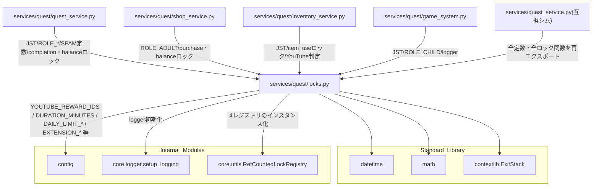

## 1. 解析メタ情報

| 項目 | 内容 |
| --- | --- |
| 対象ファイル | `MY_HOME_SYSTEM/services/quest/locks.py`（フルパス, disambiguation目的） |
| 言語 | Python |
| 解析対象 | 提供されたコードのみ |
| 推測・補完 | 一切なし |
| 解析基準コミット | `a1d2738` |

同名衝突の注意: `services/quest/quest_service.py`と`services/quest_service.py`（下位互換シム）がファイル名`quest_service`で衝突するため、`services/quest/`配下の6ファイルはいずれも`quest_`を接頭辞とした名前（`quest_locks.md`等）で区別している（`dashboard_common.md`と同じ命名規約）。本ファイル自体は`locks.py`という単独の基底名のため衝突は生じないが、他5ファイルとの命名一貫性のため同じ接頭辞を付けている。

## 関連ドキュメント

* [quest_service.md](./quest_service.md) - `services/quest_service.py`（Issue #550の分割後に残った下位互換の再エクスポートシム）。本ファイルで定義される定数・ロック関数はすべてこのシム経由でも`from services.quest_service import ...`として参照可能
* [quest_user_service.md](./quest_user_service.md) - `logger`のみを本ファイルからimportする（ロック関数は使用しない）
* [quest_quest_service.md](./quest_quest_service.md) - `JST`/`ROLE_ADULT`/`ROLE_CHILD`/`SPAM_CHECK_INTERVAL_SECONDS`/`INFINITE_QUEST_COOLDOWN_SECONDS`/`_acquire_user_balance_locks`/`_get_completion_lock`/`_get_user_balance_lock`/`_seconds_since_iso_timestamp`/`logger`を本ファイルからimportする、最大の利用元
* [quest_shop_service.md](./quest_shop_service.md) - `ROLE_ADULT`/`_get_purchase_lock`/`_get_user_balance_lock`/`_seconds_since_iso_timestamp`/`logger`を本ファイルからimportする
* [quest_inventory_service.md](./quest_inventory_service.md) - `JST`/`_get_item_use_lock`/`_get_youtube_cooldown_remaining_seconds`/`_is_youtube_cooldown_enforced`/`_is_youtube_daily_limit_enforced`/`can_extend_youtube_limit_now`/`get_youtube_daily_limit_minutes`/`get_youtube_daily_limit_with_extensions`/`get_youtube_reward_duration_minutes`/`get_youtube_used_minutes_today`を本ファイルからimportする
* [quest_game_system.md](./quest_game_system.md) - `JST`/`ROLE_CHILD`/`logger`を本ファイルからimportする
* [utils.md](./utils.md) - `core.utils.RefCountedLockRegistry`（本ファイルの4つのロックレジストリの実体）の仕様書
* [config.md](./config.md) - `config.YOUTUBE_REWARD_IDS`/`config.YOUTUBE_REWARD_COOLDOWN_ENFORCE_FROM`/`config.YOUTUBE_REWARD_DURATION_MINUTES`/`config.YOUTUBE_DAILY_LIMIT_MINUTES_WEEKDAY`/`config.YOUTUBE_DAILY_LIMIT_MINUTES_HOLIDAY`/`config.YOUTUBE_DAILY_LIMIT_ENFORCE_FROM`/`config.YOUTUBE_EXTENSION_QUEST_IDS`/`config.YOUTUBE_EXTENSION_MINUTES_PER_QUEST`/`config.YOUTUBE_EXTENSION_MAX_PER_DAY`の提供元
* [logger.md](./logger.md) - `core.logger.setup_logging`の実体

## 2. ファイルの概要

Issue #550で`services/quest_service.py`（1572行・5クラス）が`services/quest/`パッケージへ分割された際に切り出された、特定のサービスクラスに属さないモジュールレベルのヘルパーと定数を集約するファイル。JST定数・ロール定数・スパムチェック間隔定数・YouTubeごほうび券クールダウン定数、経過秒数計算ヘルパー(`_seconds_since_iso_timestamp`)、YouTubeクールダウン判定の2関数、および`QuestService`/`ShopService`/`InventoryService`が使う4種類のプロセス内ロック（完了ロック・ユーザー残高ロック・購入ロック・アイテム使用ロック、いずれも`core.utils.RefCountedLockRegistry`ベース）とそのアクセサ関数を提供する。ファイル冒頭のdocstring自身が「QuestService/ShopService/InventoryService/GameSystemはいずれもここから必要なロック・定数をimportする」と明記しており、`services/quest/`パッケージ内の共有基盤モジュールという位置づけである。
根拠: モジュールdocstring (行番号: 1〜6 / 抜粋: "並行制御(プロセス内ロック)とYouTubeクールダウン判定など、特定のサービスクラスに\n属さないモジュールレベルのヘルパー・定数を集約する。")

## 3. 外部依存関係

### インポート一覧

| 名称 | 種類 | 用途 | 根拠 |
| --- | --- | --- | --- |
| `datetime` | 標準ライブラリ | `JST`定数の構築、`_seconds_since_iso_timestamp`のタイムスタンプ比較、`_is_youtube_cooldown_enforced`/`_is_youtube_daily_limit_enforced`の日付比較、`get_youtube_daily_limit_minutes`の曜日判定、`get_youtube_used_minutes_today`の今日の日付文字列の組み立て | `import datetime` (行番号: 7) |
| `math` | 標準ライブラリ | `_get_youtube_cooldown_remaining_seconds`が残り秒数を切り上げる(`math.ceil`) | `import math` (行番号: 8) |
| `contextlib.ExitStack` | 標準ライブラリ | `_acquire_user_balance_locks`が複数ユーザー分のロックをまとめて取得・解放するために使用 | `from contextlib import ExitStack` (行番号: 9) |
| `typing` (`Optional`, `Tuple`) | 標準ライブラリ | 型ヒント（`_seconds_since_iso_timestamp`の戻り値型、`_get_completion_lock`/`_get_purchase_lock`が受け取るキー型） | `from typing import Optional, Tuple` (行番号: 10) |
| `fastapi.HTTPException` | サードパーティ | **（Issue #739で追加）** `_require_adult`が認可NG時に403を送出する | `from fastapi import HTTPException` (行番号: 15) |
| `config` | 内部モジュール | `YOUTUBE_REWARD_IDS`/`YOUTUBE_REWARD_COOLDOWN_ENFORCE_FROM`/`YOUTUBE_REWARD_DURATION_MINUTES`/`YOUTUBE_DAILY_LIMIT_MINUTES_WEEKDAY`/`YOUTUBE_DAILY_LIMIT_MINUTES_HOLIDAY`/`YOUTUBE_DAILY_LIMIT_ENFORCE_FROM`/`YOUTUBE_EXTENSION_QUEST_IDS`/`YOUTUBE_EXTENSION_MINUTES_PER_QUEST`/`YOUTUBE_EXTENSION_MAX_PER_DAY`の参照 | `import config` (行番号: 12) |
| `core.logger.setup_logging` | 内部モジュール | ロガー初期化 | `from core.logger import setup_logging` (行番号: 13) |
| `core.utils.RefCountedLockRegistry` | 内部モジュール | 4つのロックレジストリ(`_completion_locks`/`_user_balance_locks`/`_purchase_locks`/`_item_use_locks`)の実体クラス | `from core.utils import RefCountedLockRegistry` (行番号: 14) |

### ブラックボックスとなる外部要素

| 名称 | 理由 | 根拠 |
| --- | --- | --- |
| `config`のYouTube視聴制限系定数の実際の値 | `config.py`側の定義・実値が本ファイルからは不明 | `if not config.YOUTUBE_REWARD_IDS:` (行番号: 136)、`config.YOUTUBE_REWARD_COOLDOWN_ENFORCE_FROM` (行番号: 212)、`config.YOUTUBE_REWARD_DURATION_MINUTES.get(reward_id, 0)` (行番号: 121)、`config.YOUTUBE_DAILY_LIMIT_ENFORCE_FROM` (行番号: 224) |
| `setup_logging`の内部実装 | ハンドラ構成・出力先・フォーマットが本ファイルからは不明 | `logger = setup_logging("quest_service")` (行番号: 21) |
| `RefCountedLockRegistry`の内部実装 | 参照カウントの具体的な増減タイミング・スレッド安全性の詳細は`core/utils.py`側の実装に依存し本ファイルからは確認できない | `_completion_locks = RefCountedLockRegistry()` (行番号: 121) 等4箇所 |

## 4. 主要要素の定義（関数 / エンドポイント / コンポーネント）

### `logger` (モジュールレベル変数)

* **役割**: `"quest_service"`という名前でロガーを初期化する。分割後の`services/quest/`配下の各モジュールが同じロガー名を使い回すことで、ハンドラの二重登録を避けつつログの出所を分割前と同じ名前に保つ。
* 根拠: `logger = setup_logging("quest_service")` (行番号: 21)、コメント (行番号: 16〜18 / 抜粋: "分割後もログの出所が分かるよう、旧ファイルと同じロガー名を維持する")
* **引数/リクエスト・戻り値/レスポンス・副作用・エラーハンドリング**: 該当なし（モジュールレベルの変数代入）
* 根拠: (行番号: 19)

### `JST` (モジュールレベル定数)

* **役割**: JST(日本標準時、UTC+9固定・DSTなし)を表す`datetime.timezone`インスタンス。分割前の`services/quest_service.py`で複数箇所が独立にJSTを組み立てていた重複を解消するために一本化された定数で、標準ライブラリの固定オフセット版を採用している（pytzの`timezone`オブジェクトは`.replace(tzinfo=...)`に直接使うと不正なオフセット(+09:19)を返す落とし穴があるため）。
* 根拠: `JST = datetime.timezone(datetime.timedelta(hours=9), 'JST')` (行番号: 30)、コメント (行番号: 21〜29)
* **引数/リクエスト・戻り値/レスポンス・副作用・エラーハンドリング**: 該当なし

### `ROLE_ADULT` / `ROLE_CHILD` (モジュールレベル定数)

* **役割**: `quest_users.role`カラムに格納される値のうち、親権限(`role_adult`)と子供権限(`role_child`)を表す文字列定数。
* 根拠: `ROLE_ADULT = 'role_adult'` / `ROLE_CHILD = 'role_child'` (行番号: 35〜36)、コメント (行番号: 34 / 抜粋: "quest_users.role の値 (親権限判定はこの2値のみを唯一の判定基準とする)")
* **引数/リクエスト・戻り値/レスポンス・副作用・エラーハンドリング**: 該当なし

### `_require_adult`（Issue #739 / AUDIT-009 で追加）

* **役割**: 渡されたカーソルで`quest_users.role`を引き、`admin_id`が親(`ROLE_ADULT`)でなければ403を送出する共通の認可ヘルパー。従来この判定は`UserService._reset_user_data_locked`にインラインで書かれており共有されていなかったため、「破壊的な管理操作のうち`admin/reset_user`だけが`role_adult`を要求し、`sync_master`/`seed`は無認可」という非対称が生じていた。切り出しにより、`UserService._reset_user_data_locked`と`GameSystem.sync_master_data_as_admin`の双方が同じ判定を使う。LAN内を信頼境界とする方針（#321/#614）自体は変えておらず、ここで担保するのはアプリ固有の親／子の権限モデルの一貫性のみである。
* 根拠: `def _require_adult(cur, admin_id: str, detail: str = "権限がありません") -> None:` (行番号: 38)

* **引数/リクエスト**: `cur`（`get_db_cursor`のカーソル）、`admin_id` (str)、`detail` (str, 既定値 `"権限がありません"`、403のレスポンス文言)
* 根拠: `def _require_adult(cur, admin_id: str, detail: str = "権限がありません") -> None:` (行番号: 38)

* **（Issue #788 で追加）** `quest_users`が**1行も無い**ときだけは判定を行わず通過させる（初回ブートストラップの例外）。この表は`migrations/0000_baseline_schema.sql`で空のテーブルとして作られるだけで、行を作るのはseed/sync自身であるため、無条件に認可を要求するとまっさらなDBでは「seedするには親が必要、親を作るにはseedが必要」という循環になり、どの`admin_id`でも403になっていた（開発環境の初回起動・SDカード故障からの再構築で詰まる）。空のDBには守るべきデータも壊すものも無いため、フェイルクローズの趣旨とは矛盾しない。通過時は`logger.warning`を残す。1行でも登録されれば通常の403判定に戻る。
* 根拠: [空判定] (行番号: 61 / 抜粋: 'if cur.execute("SELECT 1 FROM quest_users LIMIT 1").fetchone() is None:')

* **戻り値/レスポンス**: `None`（通過時は何も返さない）

* **副作用**: `quest_users`のSELECTのみ。**（Issue #788）** 空のDBで認可をスキップした場合は`logger.warning`を1行出力する。

* **エラーハンドリング**: `admin_id`の行が存在しない、または`role`が`ROLE_ADULT`でない場合に`HTTPException(status_code=403, detail=detail)`を送出する。**（Issue #788）** ただし`quest_users`が空の場合はこの判定に到達せず通過する。

### `SPAM_CHECK_INTERVAL_SECONDS` / `INFINITE_QUEST_COOLDOWN_SECONDS` (モジュールレベル定数)

* **役割**: `QuestService._process_complete_quest_locked`のスパムチェックが用いる完了間隔の下限(秒)。`SPAM_CHECK_INTERVAL_SECONDS`(10)は通常クエスト向け、`INFINITE_QUEST_COOLDOWN_SECONDS`(60)は`quest_type == 'infinite'`のクエスト専用の下限値で、フロントエンド(`family-quest`の`QuestList.tsx`)が提示する60秒のクールダウン表示と揃えるために導入された。
* 根拠: `SPAM_CHECK_INTERVAL_SECONDS = 10` / `INFINITE_QUEST_COOLDOWN_SECONDS = 60` (行番号: 38〜39)、コメント (行番号: 36〜37)
* **引数/リクエスト・戻り値/レスポンス・副作用・エラーハンドリング**: 該当なし

### `YOUTUBE_REWARD_BREAK_SECONDS` (モジュールレベル定数)

* **役割**: `config.YOUTUBE_REWARD_IDS`に含まれるYouTube系ごほうび券を**見終わってから**、次の1枚を使用できるようになるまでに空ける休憩秒数(15分=900秒)。連続視聴による目の負担を防ぐ目的。コメントは「これは券の視聴時間を含まない『休憩そのものの長さ』である」と明記しており、クールダウン全体の長さは`_get_youtube_cooldown_remaining_seconds`が「券の視聴分数 + この秒数」として算出する。
* 根拠: `YOUTUBE_REWARD_BREAK_SECONDS = 15 * 60` (行番号: 85)、コメント (行番号: 76〜84)
* **引数/リクエスト・戻り値/レスポンス・副作用・エラーハンドリング**: 該当なし

### `get_youtube_reward_duration_minutes`

* **役割**: `reward_id`を受け取り、その券1枚で視聴できる分数を`config.YOUTUBE_REWARD_DURATION_MINUTES`(`Dict[int, int]`)から引いて返す。対応表に無い`reward_id`は`0`分として扱う。docstringはこれを「視聴時間が分からない券を安全側(=クールダウンは休憩ぶんだけ・日次上限には加算しない)に倒すため」「券を新設したのに対応表への追記を忘れても使用自体は壊れないようにしている」と説明している。
* 根拠: `def get_youtube_reward_duration_minutes(reward_id: int) -> int:` (行番号: 113〜121)
* **引数/リクエスト**: `reward_id: int`
* 根拠: (行番号: 113)
* **戻り値/レスポンス**: `int`（視聴分数。対応表に無い`reward_id`は`0`）
* 根拠: `return config.YOUTUBE_REWARD_DURATION_MINUTES.get(reward_id, 0)` (行番号: 121)
* **副作用**: なし（`config`の辞書を引くだけ）
* 根拠: (行番号: 121)
* **エラーハンドリング**: `dict.get`の既定値`0`により`KeyError`は発生しない
* 根拠: (行番号: 121)

### `_seconds_since_iso_timestamp`

* **役割**: `core.utils.get_now_iso()`で保存されたISOタイムスタンプ文字列から、現在までの経過秒数(実時間)を返す。`tzinfo`が無い古いデータは保存規約(`core.utils.get_now_iso`)に合わせてJSTとみなし、`tzinfo`を保持したまま`datetime.datetime.now(last_time.tzinfo)`と比較することで、サーバーのOSタイムゾーンに依存せず常に「実時間で何秒経過したか」を正しく判定する。
* 根拠: `def _seconds_since_iso_timestamp(timestamp_str: Optional[str]) -> Optional[float]:` (行番号: 88〜110)
* **引数/リクエスト**: `timestamp_str: Optional[str]`
* 根拠: (行番号: 46)
* **戻り値/レスポンス**: `Optional[float]`（経過秒数。空文字/`None`/パース失敗時は`None`）
* 根拠: (行番号: 58〜59, 66〜68)
* **副作用**: なし（純粋な日時計算）
* 根拠: (行番号: 46〜68)
* **エラーハンドリング**: `datetime.datetime.fromisoformat`等での例外を`except Exception:`で捕捉し`None`を返す（呼び出し元には送出しない）
* 根拠: `except Exception:\n        return None` (行番号: 67〜68)

### `_get_youtube_cooldown_remaining_seconds`

* **役割**: `cur`(呼び出し元のトランザクション内で使うDBカーソル)と`user_id`を受け取り、`user_inventory`から対象`user_id`・`config.YOUTUBE_REWARD_IDS`に含まれる`reward_id`群・`status = 'consumed'`のうち直近の1件を`reward_id`と`used_at`つきで取得し、`_seconds_since_iso_timestamp`で経過秒数を算出したうえで「その券の視聴秒数(`get_youtube_reward_duration_minutes(reward_id) * 60`) + `YOUTUBE_REWARD_BREAK_SECONDS`」との差分を残り秒数として返す。クールダウン対象IDが未設定、または一度も使用していない場合は`0`を返す。docstringは券の視聴分数を足す理由を「起点は`used_at`(使い始めた時刻)であり、固定15分だと30分券・60分券では見終わる前にクールダウンが明けてしまい休憩が成立しなかったため」と説明している。SQLはIN句のプレースホルダ個数のみをf-stringで組み立て、値自体はパラメータ化して渡している(bandit B608の誤検知を`# nosec B608`で抑制)。
* 根拠: `def _get_youtube_cooldown_remaining_seconds(cur, user_id: str) -> int:` (行番号: 124〜157)、`row = cur.execute(f"""SELECT reward_id, used_at FROM user_inventory ... reward_id IN ({placeholders})...""", (user_id, *config.YOUTUBE_REWARD_IDS)).fetchone()  # nosec B608` (行番号: 143〜147)
* **引数/リクエスト**: `cur`（呼び出し元のトランザクション内で実行されるDBカーソル）, `user_id: str`
* 根拠: (行番号: 124)
* **戻り値/レスポンス**: `int`（クールダウン残り秒数、`math.ceil`で切り上げ。対象外・未使用時は`0`）
* 根拠: `watch_seconds = get_youtube_reward_duration_minutes(row['reward_id']) * 60\n    remaining = (watch_seconds + YOUTUBE_REWARD_BREAK_SECONDS) - elapsed\n    return max(0, math.ceil(remaining))` (行番号: 155〜157)
* **副作用**: `user_inventory`への読み取りクエリ1回（引数`cur`をそのまま使うため呼び出し元のトランザクション内で実行される。自身ではコミットしない）
* 根拠: (行番号: 143〜147)
* **エラーハンドリング**: `config.YOUTUBE_REWARD_IDS`が空、該当行が無い、`_seconds_since_iso_timestamp`が`None`を返す、のいずれも例外を送出せず`0`を返す
* 根拠: (行番号: 136〜137, 149〜150, 152〜153)

### `get_youtube_daily_limit_minutes`

* **役割**: その日に使えるYouTube系ごほうび券の合計分数の上限を返す。`today`(省略時は`datetime.datetime.now(JST).date()`)の曜日を見て、土日(`weekday() >= 5`)なら`config.YOUTUBE_DAILY_LIMIT_MINUTES_HOLIDAY`、それ以外は`config.YOUTUBE_DAILY_LIMIT_MINUTES_WEEKDAY`を採用し、値が`0`以下なら「上限なし」として`None`を返す。docstringは祝日を平日として扱う理由を「祝日判定には外部の暦データ(jpholiday等)が必要で、個人用システムに依存を増やす割に合わないと判断した」と記している。
* 根拠: `def get_youtube_daily_limit_minutes(today: datetime.date | None = None) -> int | None:` (行番号: 160〜178)
* **引数/リクエスト**: `today: datetime.date | None = None`（省略時はJSTの現在日付）
* 根拠: (行番号: 160, 169〜170)
* **戻り値/レスポンス**: `int | None`（上限分数。`0`以下の設定時は`None`＝上限なし）
* 根拠: `return limit if limit > 0 else None` (行番号: 178)
* **副作用**: なし（DBアクセスなし）
* 根拠: (行番号: 169〜178)
* **エラーハンドリング**: 明示的な例外処理は無い（`config`の値は`int`である前提）
* 根拠: (行番号: 172〜178)

### `_get_today_jst_prefix`

* **役割**: JSTの今日の日付を`"YYYY-MM-DD"`形式で返す。`user_inventory.used_at`・`quest_history.completed_at`の「今日ぶん」をISO文字列の先頭一致で絞り込むために使う。docstringは、SQLiteの`date(...)`を使わない理由を「これらはJSTオフセット付きISO文字列で、SQLiteの日付関数はUTCへ変換してしまうため、JSTの朝9時より前の記録が『前日』に数えられてしまう」と説明している。
* 根拠: `def _get_today_jst_prefix() -> str:` (行番号: 181〜190)
* **引数/リクエスト**: なし
* 根拠: (行番号: 181)
* **戻り値/レスポンス**: `str`（`"YYYY-MM-DD"`）
* 根拠: `return datetime.datetime.now(JST).strftime("%Y-%m-%d")` (行番号: 190)
* **副作用**: なし
* 根拠: (行番号: 190)
* **エラーハンドリング**: なし
* 根拠: (行番号: 190)

### `_get_youtube_usages_today`

* **役割**: JSTの今日のうちに`status = 'consumed'`となったYouTube系ごほうび券を、`(used_at, 視聴分数)`のタプルのリストとして`used_at`の昇順で返す。`config.YOUTUBE_REWARD_IDS`が空なら空リストを返す。`get_youtube_used_minutes_today`(合計)と`get_youtube_daily_limit_with_extensions`(時系列の再生)の両方がこの1つの問い合わせを共有する。
* 根拠: `def _get_youtube_usages_today(cur, user_id: str) -> list:` (行番号: 193〜210)
* **引数/リクエスト**: `cur`（呼び出し元のトランザクション内で実行されるDBカーソル）, `user_id: str`
* 根拠: (行番号: 193)
* **戻り値/レスポンス**: `list`（`(used_at: str, minutes: int)`のリスト。古い順）
* 根拠: `return [(row['used_at'], get_youtube_reward_duration_minutes(row['reward_id'])) for row in rows]` (行番号: 210)
* **副作用**: `user_inventory`への読み取りクエリ1回（引数`cur`をそのまま使うため呼び出し元のトランザクション内で実行される）
* 根拠: (行番号: 203〜208)
* **エラーハンドリング**: `config.YOUTUBE_REWARD_IDS`が空の場合は早期に空リストを返す
* 根拠: (行番号: 198〜199)

### `get_youtube_used_minutes_today`

* **役割**: `_get_youtube_usages_today`の結果の視聴分数を合計し、JSTの今日すでに使用した合計分数を返す。
* 根拠: `def get_youtube_used_minutes_today(cur, user_id: str) -> int:` (行番号: 213〜215)
* **引数/リクエスト**: `cur`（呼び出し元のトランザクション内で実行されるDBカーソル）, `user_id: str`
* 根拠: (行番号: 213)
* **戻り値/レスポンス**: `int`（今日すでに使用した合計分数。対象IDが未設定なら`0`）
* 根拠: `return sum(minutes for _used_at, minutes in _get_youtube_usages_today(cur, user_id))` (行番号: 215)
* **副作用**: `_get_youtube_usages_today`経由の読み取りクエリ1回
* 根拠: (行番号: 215)
* **エラーハンドリング**: なし（空リストなら合計は`0`）
* 根拠: (行番号: 215)

### `_get_extension_quest_completions_today`

* **役割**: JSTの今日のうちに完了し、かつ`status = 'approved'`(親に承認済み)となった延長対象クエスト(`config.YOUTUBE_EXTENSION_QUEST_IDS` = プリント等)の`completed_at`を昇順で返す。docstringは`'approved'`に限定する理由を「やっていないプリントを『やった』と報告するだけで視聴時間を延ばせてしまわないようにするため」、並べ替えに承認時刻ではなく`completed_at`を使う理由を「『上限に達した後にやったか』はこちらで判定するのが自然なため」と説明している。対象クエストが未設定なら空リストを返す。
* 根拠: `def _get_extension_quest_completions_today(cur, user_id: str) -> list:` (行番号: 218〜240)
* **引数/リクエスト**: `cur`（呼び出し元のトランザクション内で実行されるDBカーソル）, `user_id: str`
* 根拠: (行番号: 218)
* **戻り値/レスポンス**: `list`（`completed_at: str`のリスト。古い順）
* 根拠: `return [row['completed_at'] for row in rows]` (行番号: 240)
* **副作用**: `quest_history`への読み取りクエリ1回（引数`cur`をそのまま使うため呼び出し元のトランザクション内で実行される）
* 根拠: (行番号: 232〜238)
* **エラーハンドリング**: `config.YOUTUBE_EXTENSION_QUEST_IDS`が空の場合は早期に空リストを返す
* 根拠: (行番号: 228〜229)

### `get_youtube_daily_limit_with_extensions`

* **役割**: その日の**実効上限**(分)と、プリントによって延長された回数を`(effective_limit, granted)`のタプルで返す。「上限に達した**後に**やったプリントだけが延長になる」という規則を、今日の出来事(券の使用とプリントの完了)を時系列に並べて再生することで実装する。各イベントを走査し、券の使用なら使用分数を加算、プリントなら**その時点で**`used_minutes >= effective_limit`かつ延長回数が`config.YOUTUBE_EXTENSION_MAX_PER_DAY`未満のときだけ`config.YOUTUBE_EXTENSION_MINUTES_PER_QUEST`を上限に加える。docstringはこの設計の理由を「朝の日課としてやったプリントで上限が最初から伸びているのでは『もっと見たいからもう1枚やる』という交換にならないため」と説明している。同時刻に券の使用とプリントが並んだ場合は券の使用を先に処理する(並べ替えの第2キーが`0=使用 / 1=プリント`)。延長分数・回数上限が`0`以下、または対象クエストが未設定なら`(base_limit_minutes, 0)`をそのまま返す。
* 根拠: `def get_youtube_daily_limit_with_extensions(cur, user_id: str, base_limit_minutes: int) -> tuple[int, int]:` (行番号: 243〜278)
* **引数/リクエスト**: `cur`（呼び出し元のトランザクション内で実行されるDBカーソル）, `user_id: str`, `base_limit_minutes: int`（`get_youtube_daily_limit_minutes`が返す延長前の上限）
* 根拠: (行番号: 243)
* **戻り値/レスポンス**: `tuple[int, int]`（実効上限の分数、延長が与えられた回数）
* 根拠: `return effective_limit, granted` (行番号: 278)
* **副作用**: `_get_youtube_usages_today`・`_get_extension_quest_completions_today`経由の読み取りクエリ2回
* 根拠: (行番号: 267〜268)
* **エラーハンドリング**: 延長機能が無効な設定(分数・回数が`0`以下、対象クエスト未設定)のときは早期に`(base_limit_minutes, 0)`を返す
* 根拠: (行番号: 260〜262)

### `can_extend_youtube_limit_now`

* **役割**: 「今プリントを1枚やれば上限が延びる」状態かどうかを返す。`get_youtube_daily_limit_with_extensions`のループ内の条件と同じ式(`used_minutes >= effective_limit and granted < config.YOUTUBE_EXTENSION_MAX_PER_DAY`)を共有しており、family-quest側が「プリントを1枚やると+30分」と案内するかどうか、および`InventoryService._use_item_locked`が拒否メッセージを「また明日つかおうね」と「プリントを1枚やると〜分ふえるよ」のどちらにするかの判定に使う。
* 根拠: `def can_extend_youtube_limit_now(used_minutes: int, effective_limit: int, granted: int) -> bool:` (行番号: 281〜290)
* **引数/リクエスト**: `used_minutes: int`, `effective_limit: int`, `granted: int`
* 根拠: (行番号: 281)
* **戻り値/レスポンス**: `bool`
* 根拠: `return used_minutes >= effective_limit and granted < config.YOUTUBE_EXTENSION_MAX_PER_DAY` (行番号: 290)
* **副作用**: なし（DBアクセスなし）
* 根拠: (行番号: 288〜290)
* **エラーハンドリング**: 延長機能が無効な設定のときは`False`を返す
* 根拠: (行番号: 288〜289)

### `_is_youtube_cooldown_enforced`

* **役割**: YouTube系ごほうび券のクールダウンを実際に強制する日(`config.YOUTUBE_REWARD_COOLDOWN_ENFORCE_FROM`、JST基準の`date`)を、現在のJST日付が迎えているかどうかを返す。この関数が`False`を返す間(施行日より前)は、`InventoryService._use_item_locked`が使用を拒否せず、`InventoryService.get_user_inventory`が予告用の`youtube_cooldown_announcement`を返す設計になっている（利用側は`quest_inventory_service.md`参照）。
* 根拠: `def _is_youtube_cooldown_enforced() -> bool:\n    return datetime.datetime.now(JST).date() >= config.YOUTUBE_REWARD_COOLDOWN_ENFORCE_FROM` (行番号: 293〜299)
* **引数/リクエスト**: なし
* 根拠: (行番号: 206)
* **戻り値/レスポンス**: `bool`
* 根拠: (行番号: 212)
* **副作用**: なし（純粋な日付比較）
* 根拠: (行番号: 206〜212)
* **エラーハンドリング**: なし
* 根拠: (行番号: 206〜212)

### `_is_youtube_daily_limit_enforced`

* **役割**: YouTube系ごほうび券の1日の合計分数上限を実際に強制する日(`config.YOUTUBE_DAILY_LIMIT_ENFORCE_FROM`、JST基準の`date`)を、現在のJST日付が迎えているかどうかを返す。docstringは、クールダウン(`_is_youtube_cooldown_enforced`)とは別の施行日を持つ理由を「両者は導入時期が異なり、既に施行済みのクールダウンの猶予期間を新しい上限の導入で巻き戻してしまわないよう、判定軸を分けている」と説明している。この関数が`False`を返す間は、`InventoryService._use_item_locked`が日次上限による拒否をせず、`InventoryService.get_user_inventory`が予告用の`youtube_daily_limit_announcement`を返す（利用側は`quest_inventory_service.md`参照）。
* 根拠: `def _is_youtube_daily_limit_enforced() -> bool:\n    return datetime.datetime.now(JST).date() >= config.YOUTUBE_DAILY_LIMIT_ENFORCE_FROM` (行番号: 302〜311)
* **引数/リクエスト**: なし
* 根拠: (行番号: 215)
* **戻り値/レスポンス**: `bool`
* 根拠: (行番号: 224)
* **副作用**: なし（純粋な日付比較）
* 根拠: (行番号: 215〜224)
* **エラーハンドリング**: なし
* 根拠: (行番号: 215〜224)

### `_completion_locks` (モジュールレベル変数) と `_get_completion_lock`

* **役割**: `_completion_locks`は`RefCountedLockRegistry`のインスタンスで、`Tuple[str, int]`(`user_id`, `quest_id`の組、または兄妹連携クエスト用の共通キー`('__coop__', quest_id)`)をキーとしてプロセス内ロックを提供する。`QuestService.process_complete_quest`が「直近履歴を読む→報酬を書く」処理を直列化し、同時リクエストによる二重加算を防ぐために使う。`_get_completion_lock(key)`は`_completion_locks.acquire(key)`が返すコンテキストマネージャをそのまま返す薄いラッパー。
* 根拠: `_completion_locks = RefCountedLockRegistry()` (行番号: 121)、`def _get_completion_lock(key: Tuple[str, int]):\n    return _completion_locks.acquire(key)` (行番号: 328〜329)、コメント (行番号: 110〜120)
* **引数/リクエスト**: `_get_completion_lock`: `key: Tuple[str, int]`
* 根拠: (行番号: 124)
* **戻り値/レスポンス**: `_get_completion_lock`: コンテキストマネージャ(`RefCountedLockRegistry.acquire`が返すもの)
* 根拠: (行番号: 125)
* **副作用**: `_completion_locks`内部辞書への新規エントリ登録（未登録時のみ）、参照カウントの増減、参照カウントが0に戻った場合の内部辞書からの削除（実体は`core/utils.py`の`RefCountedLockRegistry.acquire`）
* 根拠: (行番号: 125)
* **エラーハンドリング**: なし
* 根拠: (行番号: 124〜125)

### `_user_balance_locks` (モジュールレベル変数) と `_get_user_balance_lock`

* **役割**: `_user_balance_locks`は`RefCountedLockRegistry`のインスタンスで、`user_id`をキーとしてプロセス内ロックを提供する。`quest_users`(gold/exp/level)をread-modify-writeで更新する全経路(完了・承認・却下・取消・購入)を対象ユーザー単位で直列化し、経路間のlost updateを防ぐ目的で使われる（利用箇所の詳細は`quest_quest_service.md`/`quest_shop_service.md`参照）。`_get_user_balance_lock(user_id)`は`_user_balance_locks.acquire(user_id)`をそのまま返す。
* 根拠: `_user_balance_locks = RefCountedLockRegistry()` (行番号: 139)、`def _get_user_balance_lock(user_id: str):\n    return _user_balance_locks.acquire(user_id)` (行番号: 346〜347)、コメント (行番号: 128〜138)
* **引数/リクエスト**: `user_id: str`
* 根拠: (行番号: 142)
* **戻り値/レスポンス**: コンテキストマネージャ
* 根拠: (行番号: 143)
* **副作用**: `_user_balance_locks`内部辞書への新規エントリ登録（未登録時のみ）、参照カウントの増減、0に戻った場合の削除
* 根拠: (行番号: 143)
* **エラーハンドリング**: なし
* 根拠: (行番号: 142〜143)

### `_acquire_user_balance_locks`

* **役割**: 複数の`user_id`に対する`_get_user_balance_lock`のロックをまとめて取得し、`ExitStack`として返す。兄妹連携クエストの承認・却下・取消は報告者だけでなく連結された相方の`quest_users`もカスケード更新するため、関係する全ユーザーのロックをまとめて取得する必要がある。複数ユーザーを同時にロックする際は常に`user_id`の昇順(`sorted(set(user_ids))`)で取得することで、対向のカスケード処理同士が互いのロックを取り合うデッドロックを防ぐ。
* 根拠: `def _acquire_user_balance_locks(user_ids):` (行番号: 350〜361)、`for uid in sorted(set(user_ids)):\n        stack.enter_context(_get_user_balance_lock(uid))` (行番号: 155〜156)
* **引数/リクエスト**: `user_ids`（`str`のイテラブル）
* 根拠: (行番号: 146)
* **戻り値/レスポンス**: `ExitStack`（`with`文で使うコンテキストマネージャ。ブロック終了時に取得した全ロックを解放する）
* 根拠: (行番号: 154, 157)
* **副作用**: `_get_user_balance_lock`経由での`_user_balance_locks`内部辞書への書き込み（キー未登録時のみ）
* 根拠: (行番号: 156)
* **エラーハンドリング**: なし
* 根拠: (行番号: 146〜157)

### `_purchase_locks` (モジュールレベル変数) と `_get_purchase_lock`

* **役割**: `_purchase_locks`は`RefCountedLockRegistry`のインスタンスで、`Tuple[str, int]`(`user_id`, `reward_id`の組)をキーとしてプロセス内ロックを提供する。`ShopService.process_purchase_reward`が「直近の購入履歴を読む→履歴を書く」というスパムチェックのTOCTOUを防ぐために使う（残高減算自体はDBレベルのアトミックUPDATEで別途保護される）。`_get_purchase_lock(key)`は`_purchase_locks.acquire(key)`をそのまま返す。
* 根拠: `_purchase_locks = RefCountedLockRegistry()` (行番号: 173)、`def _get_purchase_lock(key: Tuple[str, int]):\n    return _purchase_locks.acquire(key)` (行番号: 380〜381)、コメント (行番号: 160〜172)
* **引数/リクエスト**: `key: Tuple[str, int]`
* 根拠: (行番号: 176)
* **戻り値/レスポンス**: コンテキストマネージャ
* 根拠: (行番号: 177)
* **副作用**: `_purchase_locks`内部辞書への新規エントリ登録（未登録時のみ）、参照カウントの増減、0に戻った場合の削除
* 根拠: (行番号: 177)
* **エラーハンドリング**: なし
* 根拠: (行番号: 176〜177)

### `_item_use_locks` (モジュールレベル変数) と `_get_item_use_lock`

* **役割**: `_item_use_locks`は`RefCountedLockRegistry`のインスタンスで、`user_id`をキーとしてプロセス内ロックを提供する。`InventoryService.use_item`が「YouTube系ごほうび券の直近`used_at`を読む→クールダウン判定→`consumed`へ更新」というTOCTOUを防ぐために使う。他の3レジストリと同じ`RefCountedLockRegistry`パターンで実装されている。
* 根拠: `_item_use_locks = RefCountedLockRegistry()` (行番号: 190)、`def _get_item_use_lock(user_id: str):\n    return _item_use_locks.acquire(user_id)` (行番号: 397〜398)、コメント (行番号: 180〜189)
* **引数/リクエスト**: `user_id: str`
* 根拠: (行番号: 193)
* **戻り値/レスポンス**: コンテキストマネージャ
* 根拠: (行番号: 194)
* **副作用**: `_item_use_locks`内部辞書への新規エントリ登録（未登録時のみ）、参照カウントの増減、0に戻った場合の削除
* 根拠: (行番号: 194)
* **エラーハンドリング**: なし
* 根拠: (行番号: 193〜194)

## 5. 処理フロー図

本ファイルはモジュールレベルの定数・ヘルパー定義のみで構成され、単一の「メイン関数」は存在しない。以下は代表的な3つの処理（クールダウン残り秒数の算出、今日の使用分数の集計、複数ユーザーロックの一括取得）のフローを示す。

```mermaid
flowchart TD
    subgraph GetYoutubeCooldown["_get_youtube_cooldown_remaining_seconds()"]
        G1["開始: cur, user_id"] --> G2{"config.YOUTUBE_REWARD_IDSが空?"}
        G2 -- Yes --> G3["0を返す"]
        G2 -- No --> G4["user_inventoryから直近のreward_id, used_atを1件SELECT"]
        G4 --> G5{"該当行あり?"}
        G5 -- No --> G3
        G5 -- Yes --> G6["_seconds_since_iso_timestampで経過秒数を算出"]
        G6 --> G7{"elapsedがNone?"}
        G7 -- Yes --> G3
        G7 -- No --> G8["watch_seconds = get_youtube_reward_duration_minutes(reward_id) * 60"]
        G8 --> G9["remaining = (watch_seconds + BREAK_SECONDS) - elapsed"]
        G9 --> G10["max(0, ceil(remaining))を返す"]
    end

    subgraph GetUsedMinutesToday["get_youtube_used_minutes_today()"]
        U1["開始: cur, user_id"] --> U2{"config.YOUTUBE_REWARD_IDSが空?"}
        U2 -- Yes --> U3["0を返す"]
        U2 -- No --> U4["JSTの今日の日付をYYYY-MM-DD形式で組み立て"]
        U4 --> U5["used_at LIKE 'YYYY-MM-DD%' のconsumed行をSELECT"]
        U5 --> U6["各行をget_youtube_reward_duration_minutesで分数へ換算"]
        U6 --> U7["合計を返す"]
    end

    subgraph WithExtensions["get_youtube_daily_limit_with_extensions()"]
        E1["開始: cur, user_id, base_limit"] --> E2{"延長設定が有効?<br/>(分数・回数>0 かつ 対象クエストあり)"}
        E2 -- No --> E3["(base_limit, 0)を返す"]
        E2 -- Yes --> E4["今日の券使用と承認済みプリント完了を取得"]
        E4 --> E5["(タイムスタンプ, 0=使用/1=プリント)で昇順ソート"]
        E5 --> E6["先頭から順に走査"]
        E6 --> E7{"イベント種別は?"}
        E7 -- 券の使用 --> E8["used_minutes += 分数"]
        E7 -- プリント --> E9{"used_minutes >= effective_limit<br/>かつ granted < MAX_PER_DAY?"}
        E9 -- Yes --> E10["effective_limit += MINUTES_PER_QUEST / granted += 1"]
        E9 -- No --> E11["何もしない(上限到達前 or 回数上限)"]
        E8 --> E6
        E10 --> E6
        E11 --> E6
        E6 --> E12["(effective_limit, granted)を返す"]
    end

    subgraph AcquireBalanceLocks["_acquire_user_balance_locks()"]
        A1["開始: user_ids"] --> A2["ExitStackを生成"]
        A2 --> A3["user_idsをsorted(set(...))で昇順ユニーク化"]
        A3 --> A4["各uidについて_get_user_balance_lock(uid)をstackへenter_context"]
        A4 --> A5["stackを返す(呼び出し元がwithで使用)"]
    end
```

## 6. 依存関係図

## 7. 次のステップ（リバースエンジニアリングの提案）

| 優先度 | ファイル名 | 理由 | 根拠 |
| --- | --- | --- | --- |
| 高 | `core/utils.py`（[utils.md](./utils.md)） | 本ファイルの4つのロックレジストリの実体である`RefCountedLockRegistry`の参照カウント管理・スレッド安全性の詳細を確認するため。 | `from core.utils import RefCountedLockRegistry` (行番号: 16) |
| 高 | `services/quest/quest_service.py`（[quest_quest_service.md](./quest_quest_service.md)） | 本ファイルの定数・ロックの最大の利用元であり、実際のロック取得順序(balance lock→completion lock)を確認するため。 | `_get_completion_lock`/`_get_user_balance_lock`の定義 (行番号: 121〜143) |
| 中 | `config.py`（[config.md](./config.md)） | YouTube視聴制限系定数(`YOUTUBE_REWARD_IDS`/`YOUTUBE_REWARD_COOLDOWN_ENFORCE_FROM`/`YOUTUBE_REWARD_DURATION_MINUTES`/`YOUTUBE_DAILY_LIMIT_MINUTES_WEEKDAY`/`YOUTUBE_DAILY_LIMIT_MINUTES_HOLIDAY`/`YOUTUBE_DAILY_LIMIT_ENFORCE_FROM`)の実際の値・型を確認するため。 | `config.YOUTUBE_REWARD_IDS` (行番号: 136, 139, 147) |

## 8. 保守上の注意点

* **4つのロックレジストリは互いに独立**: `_completion_locks`/`_user_balance_locks`/`_purchase_locks`/`_item_use_locks`は本ファイル内で統合されておらず、それぞれ別個の`RefCountedLockRegistry`インスタンスである。新しく`quest_users`を書き換える経路を追加する場合、`_get_user_balance_lock`を(自身の専用ロックより外側で)取得することを利用側が個別に判断・実装する必要があり、本ファイル自体にはそれを強制する仕組みはない。
* 根拠: `_completion_locks = RefCountedLockRegistry()` (行番号: 121), `_user_balance_locks = RefCountedLockRegistry()` (行番号: 139), `_purchase_locks = RefCountedLockRegistry()` (行番号: 173), `_item_use_locks = RefCountedLockRegistry()` (行番号: 190)
* **プロセス内ロック限定**: 全ロックは`threading.Lock`ベース(`RefCountedLockRegistry`の内部実装)のみを対象としており、複数プロセス/複数ワーカーで稼働する構成では別プロセスからの同時リクエストまでは防げない。
* 根拠: `RefCountedLockRegistry`のimport元コメント (行番号: 14)、`utils.md`参照
* **YouTubeの視聴制限は「長さ」「施行日」が制限ごとに独立している**: クールダウンは長さ(`YOUTUBE_REWARD_BREAK_SECONDS` + 券の視聴分数)と施行日(`_is_youtube_cooldown_enforced`)、日次上限は長さ(`get_youtube_daily_limit_minutes`)と施行日(`_is_youtube_daily_limit_enforced`)をそれぞれ別に持つ。呼び出し元(`InventoryService`)がこれらを組み合わせて「施行前は予告のみ・施行後は拒否」という挙動を実現しており、本ファイル単体では各組の対応関係は暗黙的である。
* 根拠: `YOUTUBE_REWARD_BREAK_SECONDS = 15 * 60` (行番号: 85)、`def _is_youtube_cooldown_enforced() -> bool:` (行番号: 293〜299)、`def _is_youtube_daily_limit_enforced() -> bool:` (行番号: 302〜311)
* **`get_youtube_reward_duration_minutes`の対応表漏れは静かに0分として扱われる**: `config.YOUTUBE_REWARD_DURATION_MINUTES`に無い`reward_id`は例外ではなく`0`分になるため、`config.YOUTUBE_REWARD_IDS`に新しい券を追加して対応表への追記を忘れると、その券はクールダウンが休憩ぶん(15分)だけになり、日次上限の集計にも加算されない。券を増やすときは2つの設定を必ずセットで更新すること。
* 根拠: `return config.YOUTUBE_REWARD_DURATION_MINUTES.get(reward_id, 0)` (行番号: 121)、docstring (行番号: 114〜120)
* **今日ぶんの絞り込みでSQLiteの`date()`を使ってはならない**: `used_at`/`completed_at`はJSTオフセット付きISO文字列のため、`date(...)`はUTCへ変換した日付を返し、JSTの朝9時より前の記録が前日に数えられてしまう。現在は`_get_today_jst_prefix()`による`LIKE 'YYYY-MM-DD%'`の先頭一致で判定している。
* 根拠: `def _get_today_jst_prefix() -> str:` (行番号: 181〜190)、`AND used_at LIKE ?` (行番号: 206)、`AND completed_at LIKE ?` (行番号: 236)
* **延長の判定は「その時点で上限を使い切っていたか」であり、単なる枚数ではない**: `get_youtube_daily_limit_with_extensions`は今日の出来事を時系列に再生し、プリントの時点で`used_minutes >= effective_limit`だった場合にだけ延長を与える。したがって「上限に達した直後にプリントを3枚まとめてやる」と延長は1回しか付かない(2枚目・3枚目の時点では延長後の上限に達していないため)。これは仕様であり、回数上限(`YOUTUBE_EXTENSION_MAX_PER_DAY`)とは別の歯止めとして効いている。
* 根拠: `def get_youtube_daily_limit_with_extensions(cur, user_id: str, base_limit_minutes: int) -> tuple[int, int]:` (行番号: 243〜278)、docstring (行番号: 244〜255)
* **上限と券の長さは同じ刻み(既定では10分)で揃えること**: 延長が始まる条件は「残り0分」(`used_minutes >= effective_limit`)である。上限を券の長さで割り切れない値(例: 45分)にすると、どの券にも満たない端数(例: 残り5分)が残って券は使えず、かつ残り0分ではないので延長も始まらない、という手詰まりが起こりうる。
* 根拠: `return used_minutes >= effective_limit and granted < config.YOUTUBE_EXTENSION_MAX_PER_DAY` (行番号: 290)
* **`_get_youtube_cooldown_remaining_seconds`のSQLはf-string組み立て**: IN句のプレースホルダ個数のみを動的に組み立てており、値そのものはパラメータ化されているため実際のSQLインジェクションリスクは無いが、`# nosec B608`によりbanditの静的解析は無効化されている。将来この関数を改変する際は、プレースホルダ数と`config.YOUTUBE_REWARD_IDS`の要素数が一致する前提を崩さないよう注意が必要。
* 根拠: `placeholders = ",".join("?" for _ in config.YOUTUBE_REWARD_IDS)` (行番号: 80)、`# nosec B608` (行番号: 88)

## 9. 不明事項一覧

| 項目 | 理由 | 必要なファイル |
| --- | --- | --- |
| `RefCountedLockRegistry`の参照カウント管理の具体的なアルゴリズム | 本ファイルは`acquire()`を呼び出すのみで、内部実装（辞書からの削除タイミング、`_guard`ロックの役割等）は`core/utils.py`側にある | `core/utils.py` |
| `config`のYouTube視聴制限系定数(`YOUTUBE_REWARD_IDS`/`YOUTUBE_REWARD_COOLDOWN_ENFORCE_FROM`/`YOUTUBE_REWARD_DURATION_MINUTES`/`YOUTUBE_DAILY_LIMIT_MINUTES_WEEKDAY`/`YOUTUBE_DAILY_LIMIT_MINUTES_HOLIDAY`/`YOUTUBE_DAILY_LIMIT_ENFORCE_FROM`/`YOUTUBE_EXTENSION_QUEST_IDS`/`YOUTUBE_EXTENSION_MINUTES_PER_QUEST`/`YOUTUBE_EXTENSION_MAX_PER_DAY`)の実際の値 | `config.py`側の定義・`.env`依存の実値は本ファイルからは確認できない | `config.py` |

## 相互参照による補足情報

| 元の不明事項 | 判明した内容 | 参照元ドキュメント |
| --- | --- | --- |
| `RefCountedLockRegistry`の参照カウント管理の具体的なアルゴリズム | `MY_HOME_SYSTEM/core/utils.py`を直接確認した。`RefCountedLockRegistry`(57〜101行目)は内部クラス`_Entry`(`__slots__ = ("lock", "ref_count")`、74〜79行目)で`threading.Lock`と参照カウントを保持し、`self._entries: Dict[Any, _Entry]`と単一の`self._guard = threading.Lock()`(81〜83行目)を持つ。`acquire(key)`は`@contextlib.contextmanager`(85行目)で、(1)`_guard`下でキーのエントリを取得または新規作成し`ref_count += 1`(88〜93行目)、(2)`with entry.lock:`でキー単位の排他を張って`yield`(94〜96行目)、(3)`finally`で再び`_guard`下に入り`ref_count -= 1`し、`ref_count == 0`かつ`self._entries.get(key) is entry`のときだけ辞書から削除する(97〜101行目)、という3段構成である。この`is`比較により、削除判定中に別スレッドが同じキーで新しいエントリを作っていた場合は削除しない。クラスdocstringは、単純な`lock.locked()`ベースの剪定では「辞書からロックを取り出した直後・`with`で獲得する直前」の隙間で別スレッドが剪定し、同一キーに対して2つのLockが同時に取得成功しうる（Issue #435）ため参照カウント方式を採った、と明記している。つまり本ファイルの4レジストリは「使用中のエントリは絶対に削除されない」ことが保証され、キー(ユーザーID×クエストID等)が増え続けてもエントリは蓄積しない。 | 直接ソース確認: `MY_HOME_SYSTEM/core/utils.py:57-101`（参考: [utils.md](./utils.md)） |
| `config`のYouTube視聴制限系定数の実際の値 | `MY_HOME_SYSTEM/config.py`を直接確認した。`YOUTUBE_REWARD_IDS`は環境変数のカンマ区切り文字列を既定値`"10,11,12"`として読み込み(735行目)、`List[int]`へパースする(736〜740行目)。`YOUTUBE_REWARD_COOLDOWN_ENFORCE_FROM`は既定値`"2026-09-12"`を`date.fromisoformat`で変換した値(750〜755行目)、`YOUTUBE_DAILY_LIMIT_ENFORCE_FROM`は既定値`"2026-09-27"`の同形(805〜810行目)で、いずれもパース失敗時は`date(2000, 1, 1)`へフォールバックする=即時強制になる。`YOUTUBE_REWARD_DURATION_MINUTES`は`"reward_id:分数"`のカンマ区切り(既定`"10:10,11:30,12:60"`)を`dict[int, int]`へパースする(771〜786行目)。`YOUTUBE_DAILY_LIMIT_MINUTES_WEEKDAY`/`_HOLIDAY`は`_get_int_env`による既定60分/90分(792〜793行目)。延長系は`YOUTUBE_EXTENSION_QUEST_IDS`が既定`"31,307"`(quest_data.pyのプリント)、`YOUTUBE_EXTENSION_MINUTES_PER_QUEST`が既定30分、`YOUTUBE_EXTENSION_MAX_PER_DAY`が既定2回(812〜834行目)。したがって本ファイルの`_is_youtube_cooldown_enforced()`は2026-09-12(JST)以降、`_is_youtube_daily_limit_enforced()`は2026-09-27(JST)以降`True`を返し、IN句は既定で`(10, 11, 12)`の3件、`get_youtube_reward_duration_minutes`は既定で10/30/60分を返す。`.env`による上書きは可能だが、リポジトリ内の既定値だけで本ファイルの分岐は決定できる。 | 直接ソース確認: `MY_HOME_SYSTEM/config.py:735-834`（参考: [config.md](./config.md)） |

## 10. 自己検証結果

* [x] 完了: 推測・外部ファイルの仕様を一切含んでいない
* [x] 完了: 全関数・全定数（モジュールレベル要素）を列挙した
* [x] 完了: 全てのインポート要素を列挙した
* [x] 完了: すべての仕様説明に「根拠（行番号・抜粋）」を明記した
* [x] 完了: 根拠漏れが0件である
* [x] 完了: Mermaid構文にエラーの原因となる記号（エスケープ漏れ）がない
* [x] 完了: 不明事項を漏れなく列挙した
