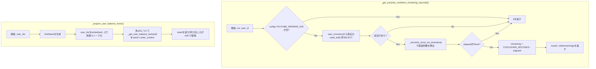
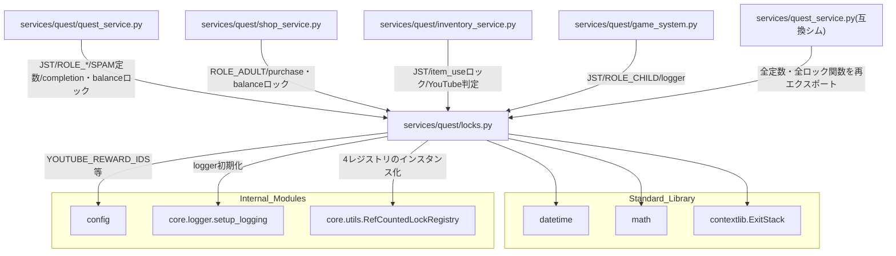

## 1. 解析メタ情報

| 項目 | 内容 |
| --- | --- |
| 対象ファイル | `MY_HOME_SYSTEM/services/quest/locks.py`（フルパス, disambiguation目的） |
| 言語 | Python |
| 解析対象 | 提供されたコードのみ |
| 推測・補完 | 一切なし |

同名衝突の注意: `services/quest/quest_service.py`と`services/quest_service.py`（下位互換シム）がファイル名`quest_service`で衝突するため、`services/quest/`配下の6ファイルはいずれも`quest_`を接頭辞とした名前（`quest_locks.md`等）で区別している（`dashboard_common.md`と同じ命名規約）。本ファイル自体は`locks.py`という単独の基底名のため衝突は生じないが、他5ファイルとの命名一貫性のため同じ接頭辞を付けている。

## 関連ドキュメント

* [quest_service.md](./quest_service.md) - `services/quest_service.py`（Issue #550の分割後に残った下位互換の再エクスポートシム）。本ファイルで定義される定数・ロック関数はすべてこのシム経由でも`from services.quest_service import ...`として参照可能
* [quest_user_service.md](./quest_user_service.md) - `logger`のみを本ファイルからimportする（ロック関数は使用しない）
* [quest_quest_service.md](./quest_quest_service.md) - `JST`/`ROLE_ADULT`/`ROLE_CHILD`/`SPAM_CHECK_INTERVAL_SECONDS`/`INFINITE_QUEST_COOLDOWN_SECONDS`/`_acquire_user_balance_locks`/`_get_completion_lock`/`_get_user_balance_lock`/`_seconds_since_iso_timestamp`/`logger`を本ファイルからimportする、最大の利用元
* [quest_shop_service.md](./quest_shop_service.md) - `ROLE_ADULT`/`_get_purchase_lock`/`_get_user_balance_lock`/`_seconds_since_iso_timestamp`/`logger`を本ファイルからimportする
* [quest_inventory_service.md](./quest_inventory_service.md) - `JST`/`_get_item_use_lock`/`_get_youtube_cooldown_remaining_seconds`/`_is_youtube_cooldown_enforced`を本ファイルからimportする
* [quest_game_system.md](./quest_game_system.md) - `JST`/`ROLE_CHILD`/`logger`を本ファイルからimportする
* [utils.md](./utils.md) - `core.utils.RefCountedLockRegistry`（本ファイルの4つのロックレジストリの実体）の仕様書
* [config.md](./config.md) - `config.YOUTUBE_REWARD_IDS`/`config.YOUTUBE_REWARD_COOLDOWN_ENFORCE_FROM`の提供元
* [logger.md](./logger.md) - `core.logger.setup_logging`の実体

## 2. ファイルの概要

Issue #550で`services/quest_service.py`（1572行・5クラス）が`services/quest/`パッケージへ分割された際に切り出された、特定のサービスクラスに属さないモジュールレベルのヘルパーと定数を集約するファイル。JST定数・ロール定数・スパムチェック間隔定数・YouTubeごほうび券クールダウン定数、経過秒数計算ヘルパー(`_seconds_since_iso_timestamp`)、YouTubeクールダウン判定の2関数、および`QuestService`/`ShopService`/`InventoryService`が使う4種類のプロセス内ロック（完了ロック・ユーザー残高ロック・購入ロック・アイテム使用ロック、いずれも`core.utils.RefCountedLockRegistry`ベース）とそのアクセサ関数を提供する。ファイル冒頭のdocstring自身が「QuestService/ShopService/InventoryService/GameSystemはいずれもここから必要なロック・定数をimportする」と明記しており、`services/quest/`パッケージ内の共有基盤モジュールという位置づけである。
根拠: モジュールdocstring (行番号: 1〜6 / 抜粋: "並行制御(プロセス内ロック)とYouTubeクールダウン判定など、特定のサービスクラスに\n属さないモジュールレベルのヘルパー・定数を集約する。")

## 3. 外部依存関係

### インポート一覧

| 名称 | 種類 | 用途 | 根拠 |
| --- | --- | --- | --- |
| `datetime` | 標準ライブラリ | `JST`定数の構築、`_seconds_since_iso_timestamp`のタイムスタンプ比較、`_is_youtube_cooldown_enforced`の日付比較 | `import datetime` (行番号: 7) |
| `math` | 標準ライブラリ | `_get_youtube_cooldown_remaining_seconds`が残り秒数を切り上げる(`math.ceil`) | `import math` (行番号: 8) |
| `contextlib.ExitStack` | 標準ライブラリ | `_acquire_user_balance_locks`が複数ユーザー分のロックをまとめて取得・解放するために使用 | `from contextlib import ExitStack` (行番号: 9) |
| `typing` (`Optional`, `Tuple`) | 標準ライブラリ | 型ヒント（`_seconds_since_iso_timestamp`の戻り値型、`_get_completion_lock`/`_get_purchase_lock`が受け取るキー型） | `from typing import Optional, Tuple` (行番号: 10) |
| `config` | 内部モジュール | `YOUTUBE_REWARD_IDS`/`YOUTUBE_REWARD_COOLDOWN_ENFORCE_FROM`の参照 | `import config` (行番号: 12) |
| `core.logger.setup_logging` | 内部モジュール | ロガー初期化 | `from core.logger import setup_logging` (行番号: 13) |
| `core.utils.RefCountedLockRegistry` | 内部モジュール | 4つのロックレジストリ(`_completion_locks`/`_user_balance_locks`/`_purchase_locks`/`_item_use_locks`)の実体クラス | `from core.utils import RefCountedLockRegistry` (行番号: 14) |

### ブラックボックスとなる外部要素

| 名称 | 理由 | 根拠 |
| --- | --- | --- |
| `config.YOUTUBE_REWARD_IDS` / `config.YOUTUBE_REWARD_COOLDOWN_ENFORCE_FROM`の実際の値 | `config.py`側の定義・実値が本ファイルからは不明 | `if not config.YOUTUBE_REWARD_IDS:` (行番号: 77)、`config.YOUTUBE_REWARD_COOLDOWN_ENFORCE_FROM` (行番号: 107) |
| `setup_logging`の内部実装 | ハンドラ構成・出力先・フォーマットが本ファイルからは不明 | `logger = setup_logging("quest_service")` (行番号: 19) |
| `RefCountedLockRegistry`の内部実装 | 参照カウントの具体的な増減タイミング・スレッド安全性の詳細は`core/utils.py`側の実装に依存し本ファイルからは確認できない | `_completion_locks = RefCountedLockRegistry()` (行番号: 121) 等4箇所 |

## 4. 主要要素の定義（関数 / エンドポイント / コンポーネント）

### `logger` (モジュールレベル変数)

* **役割**: `"quest_service"`という名前でロガーを初期化する。分割後の`services/quest/`配下の各モジュールが同じロガー名を使い回すことで、ハンドラの二重登録を避けつつログの出所を分割前と同じ名前に保つ。
* 根拠: `logger = setup_logging("quest_service")` (行番号: 19)、コメント (行番号: 16〜18 / 抜粋: "分割後もログの出所が分かるよう、旧ファイルと同じロガー名を維持する")
* **引数/リクエスト・戻り値/レスポンス・副作用・エラーハンドリング**: 該当なし（モジュールレベルの変数代入）
* 根拠: (行番号: 19)

### `JST` (モジュールレベル定数)

* **役割**: JST(日本標準時、UTC+9固定・DSTなし)を表す`datetime.timezone`インスタンス。分割前の`services/quest_service.py`で複数箇所が独立にJSTを組み立てていた重複を解消するために一本化された定数で、標準ライブラリの固定オフセット版を採用している（pytzの`timezone`オブジェクトは`.replace(tzinfo=...)`に直接使うと不正なオフセット(+09:19)を返す落とし穴があるため）。
* 根拠: `JST = datetime.timezone(datetime.timedelta(hours=9), 'JST')` (行番号: 30)、コメント (行番号: 21〜29)
* **引数/リクエスト・戻り値/レスポンス・副作用・エラーハンドリング**: 該当なし

### `ROLE_ADULT` / `ROLE_CHILD` (モジュールレベル定数)

* **役割**: `quest_users.role`カラムに格納される値のうち、親権限(`role_adult`)と子供権限(`role_child`)を表す文字列定数。
* 根拠: `ROLE_ADULT = 'role_adult'` / `ROLE_CHILD = 'role_child'` (行番号: 33〜34)、コメント (行番号: 32 / 抜粋: "quest_users.role の値 (親権限判定はこの2値のみを唯一の判定基準とする)")
* **引数/リクエスト・戻り値/レスポンス・副作用・エラーハンドリング**: 該当なし

### `SPAM_CHECK_INTERVAL_SECONDS` / `INFINITE_QUEST_COOLDOWN_SECONDS` (モジュールレベル定数)

* **役割**: `QuestService._process_complete_quest_locked`のスパムチェックが用いる完了間隔の下限(秒)。`SPAM_CHECK_INTERVAL_SECONDS`(10)は通常クエスト向け、`INFINITE_QUEST_COOLDOWN_SECONDS`(60)は`quest_type == 'infinite'`のクエスト専用の下限値で、フロントエンド(`family-quest`の`QuestList.tsx`)が提示する60秒のクールダウン表示と揃えるために導入された。
* 根拠: `SPAM_CHECK_INTERVAL_SECONDS = 10` / `INFINITE_QUEST_COOLDOWN_SECONDS = 60` (行番号: 38〜39)、コメント (行番号: 36〜37)
* **引数/リクエスト・戻り値/レスポンス・副作用・エラーハンドリング**: 該当なし

### `YOUTUBE_REWARD_COOLDOWN_SECONDS` (モジュールレベル定数)

* **役割**: `config.YOUTUBE_REWARD_IDS`に含まれるYouTube系ごほうび券を使用してから、次の1枚を使用できるようになるまでのクールダウン秒数(15分=900秒)。連続視聴による目の負担を防ぐ目的。
* 根拠: `YOUTUBE_REWARD_COOLDOWN_SECONDS = 15 * 60` (行番号: 43)、コメント (行番号: 41〜42)
* **引数/リクエスト・戻り値/レスポンス・副作用・エラーハンドリング**: 該当なし

### `_seconds_since_iso_timestamp`

* **役割**: `common.get_now_iso()`で保存されたISOタイムスタンプ文字列から、現在までの経過秒数(実時間)を返す。`tzinfo`が無い古いデータは保存規約(`common.get_now_iso`)に合わせてJSTとみなし、`tzinfo`を保持したまま`datetime.datetime.now(last_time.tzinfo)`と比較することで、サーバーのOSタイムゾーンに依存せず常に「実時間で何秒経過したか」を正しく判定する。
* 根拠: `def _seconds_since_iso_timestamp(timestamp_str: Optional[str]) -> Optional[float]:` (行番号: 46〜68)
* **引数/リクエスト**: `timestamp_str: Optional[str]`
* 根拠: (行番号: 46)
* **戻り値/レスポンス**: `Optional[float]`（経過秒数。空文字/`None`/パース失敗時は`None`）
* 根拠: (行番号: 58〜59, 66〜68)
* **副作用**: なし（純粋な日時計算）
* 根拠: (行番号: 46〜68)
* **エラーハンドリング**: `datetime.datetime.fromisoformat`等での例外を`except Exception:`で捕捉し`None`を返す（呼び出し元には送出しない）
* 根拠: `except Exception:\n        return None` (行番号: 67〜68)

### `_get_youtube_cooldown_remaining_seconds`

* **役割**: `cur`(呼び出し元のトランザクション内で使うDBカーソル)と`user_id`を受け取り、`user_inventory`から対象`user_id`・`config.YOUTUBE_REWARD_IDS`に含まれる`reward_id`群・`status = 'consumed'`のうち直近の`used_at`を1件取得し、`_seconds_since_iso_timestamp`で経過秒数を算出したうえで`YOUTUBE_REWARD_COOLDOWN_SECONDS`との差分を残り秒数として返す。クールダウン対象IDが未設定、または一度も使用していない場合は`0`を返す。SQLはIN句のプレースホルダ個数のみをf-stringで組み立て、値自体はパラメータ化して渡している(bandit B608の誤検知を`# nosec B608`で抑制)。
* 根拠: `def _get_youtube_cooldown_remaining_seconds(cur, user_id: str) -> int:` (行番号: 71〜98)、`row = cur.execute(f"""... WHERE user_id = ? AND status = 'consumed' AND reward_id IN ({placeholders})...""", (user_id, *config.YOUTUBE_REWARD_IDS)).fetchone()  # nosec B608` (行番号: 84〜88)
* **引数/リクエスト**: `cur`（呼び出し元のトランザクション内で実行されるDBカーソル）, `user_id: str`
* 根拠: (行番号: 71)
* **戻り値/レスポンス**: `int`（クールダウン残り秒数、`math.ceil`で切り上げ。対象外・未使用時は`0`）
* 根拠: `remaining = YOUTUBE_REWARD_COOLDOWN_SECONDS - elapsed\n    return max(0, math.ceil(remaining))` (行番号: 97〜98)
* **副作用**: `user_inventory`への読み取りクエリ1回（引数`cur`をそのまま使うため呼び出し元のトランザクション内で実行される。自身ではコミットしない）
* 根拠: (行番号: 84〜88)
* **エラーハンドリング**: `config.YOUTUBE_REWARD_IDS`が空、該当行が無い、`_seconds_since_iso_timestamp`が`None`を返す、のいずれも例外を送出せず`0`を返す
* 根拠: (行番号: 77〜78, 90〜91, 94〜95)

### `_is_youtube_cooldown_enforced`

* **役割**: YouTube系ごほうび券のクールダウンを実際に強制する日(`config.YOUTUBE_REWARD_COOLDOWN_ENFORCE_FROM`、JST基準の`date`)を、現在のJST日付が迎えているかどうかを返す。この関数が`False`を返す間(施行日より前)は、`InventoryService._use_item_locked`が使用を拒否せず、`InventoryService.get_user_inventory`が予告用の`youtube_cooldown_announcement`を返す設計になっている（利用側は`quest_inventory_service.md`参照）。
* 根拠: `def _is_youtube_cooldown_enforced() -> bool:\n    return datetime.datetime.now(JST).date() >= config.YOUTUBE_REWARD_COOLDOWN_ENFORCE_FROM` (行番号: 101〜107)
* **引数/リクエスト**: なし
* 根拠: (行番号: 101)
* **戻り値/レスポンス**: `bool`
* 根拠: (行番号: 107)
* **副作用**: なし（純粋な日付比較）
* 根拠: (行番号: 101〜107)
* **エラーハンドリング**: なし
* 根拠: (行番号: 101〜107)

### `_completion_locks` (モジュールレベル変数) と `_get_completion_lock`

* **役割**: `_completion_locks`は`RefCountedLockRegistry`のインスタンスで、`Tuple[str, int]`(`user_id`, `quest_id`の組、または兄妹連携クエスト用の共通キー`('__coop__', quest_id)`)をキーとしてプロセス内ロックを提供する。`QuestService.process_complete_quest`が「直近履歴を読む→報酬を書く」処理を直列化し、同時リクエストによる二重加算を防ぐために使う。`_get_completion_lock(key)`は`_completion_locks.acquire(key)`が返すコンテキストマネージャをそのまま返す薄いラッパー。
* 根拠: `_completion_locks = RefCountedLockRegistry()` (行番号: 121)、`def _get_completion_lock(key: Tuple[str, int]):\n    return _completion_locks.acquire(key)` (行番号: 124〜125)、コメント (行番号: 110〜120)
* **引数/リクエスト**: `_get_completion_lock`: `key: Tuple[str, int]`
* 根拠: (行番号: 124)
* **戻り値/レスポンス**: `_get_completion_lock`: コンテキストマネージャ(`RefCountedLockRegistry.acquire`が返すもの)
* 根拠: (行番号: 125)
* **副作用**: `_completion_locks`内部辞書への新規エントリ登録（未登録時のみ）、参照カウントの増減、参照カウントが0に戻った場合の内部辞書からの削除（実体は`core/utils.py`の`RefCountedLockRegistry.acquire`）
* 根拠: (行番号: 125)
* **エラーハンドリング**: なし
* 根拠: (行番号: 124〜125)

### `_user_balance_locks` (モジュールレベル変数) と `_get_user_balance_lock`

* **役割**: `_user_balance_locks`は`RefCountedLockRegistry`のインスタンスで、`user_id`をキーとしてプロセス内ロックを提供する。`quest_users`(gold/exp/level)をread-modify-writeで更新する全経路(完了・承認・却下・取消・購入)を対象ユーザー単位で直列化し、経路間のlost updateを防ぐ目的で使われる（利用箇所の詳細は`quest_quest_service.md`/`quest_shop_service.md`参照）。`_get_user_balance_lock(user_id)`は`_user_balance_locks.acquire(user_id)`をそのまま返す。
* 根拠: `_user_balance_locks = RefCountedLockRegistry()` (行番号: 139)、`def _get_user_balance_lock(user_id: str):\n    return _user_balance_locks.acquire(user_id)` (行番号: 142〜143)、コメント (行番号: 128〜138)
* **引数/リクエスト**: `user_id: str`
* 根拠: (行番号: 142)
* **戻り値/レスポンス**: コンテキストマネージャ
* 根拠: (行番号: 143)
* **副作用**: `_user_balance_locks`内部辞書への新規エントリ登録（未登録時のみ）、参照カウントの増減、0に戻った場合の削除
* 根拠: (行番号: 143)
* **エラーハンドリング**: なし
* 根拠: (行番号: 142〜143)

### `_acquire_user_balance_locks`

* **役割**: 複数の`user_id`に対する`_get_user_balance_lock`のロックをまとめて取得し、`ExitStack`として返す。兄妹連携クエストの承認・却下・取消は報告者だけでなく連結された相方の`quest_users`もカスケード更新するため、関係する全ユーザーのロックをまとめて取得する必要がある。複数ユーザーを同時にロックする際は常に`user_id`の昇順(`sorted(set(user_ids))`)で取得することで、対向のカスケード処理同士が互いのロックを取り合うデッドロックを防ぐ。
* 根拠: `def _acquire_user_balance_locks(user_ids):` (行番号: 146〜157)、`for uid in sorted(set(user_ids)):\n        stack.enter_context(_get_user_balance_lock(uid))` (行番号: 155〜156)
* **引数/リクエスト**: `user_ids`（`str`のイテラブル）
* 根拠: (行番号: 146)
* **戻り値/レスポンス**: `ExitStack`（`with`文で使うコンテキストマネージャ。ブロック終了時に取得した全ロックを解放する）
* 根拠: (行番号: 154, 157)
* **副作用**: `_get_user_balance_lock`経由での`_user_balance_locks`内部辞書への書き込み（キー未登録時のみ）
* 根拠: (行番号: 156)
* **エラーハンドリング**: なし
* 根拠: (行番号: 146〜157)

### `_purchase_locks` (モジュールレベル変数) と `_get_purchase_lock`

* **役割**: `_purchase_locks`は`RefCountedLockRegistry`のインスタンスで、`Tuple[str, int]`(`user_id`, `reward_id`の組)をキーとしてプロセス内ロックを提供する。`ShopService.process_purchase_reward`が「直近の購入履歴を読む→履歴を書く」というスパムチェックのTOCTOUを防ぐために使う（残高減算自体はDBレベルのアトミックUPDATEで別途保護される）。`_get_purchase_lock(key)`は`_purchase_locks.acquire(key)`をそのまま返す。
* 根拠: `_purchase_locks = RefCountedLockRegistry()` (行番号: 173)、`def _get_purchase_lock(key: Tuple[str, int]):\n    return _purchase_locks.acquire(key)` (行番号: 176〜177)、コメント (行番号: 160〜172)
* **引数/リクエスト**: `key: Tuple[str, int]`
* 根拠: (行番号: 176)
* **戻り値/レスポンス**: コンテキストマネージャ
* 根拠: (行番号: 177)
* **副作用**: `_purchase_locks`内部辞書への新規エントリ登録（未登録時のみ）、参照カウントの増減、0に戻った場合の削除
* 根拠: (行番号: 177)
* **エラーハンドリング**: なし
* 根拠: (行番号: 176〜177)

### `_item_use_locks` (モジュールレベル変数) と `_get_item_use_lock`

* **役割**: `_item_use_locks`は`RefCountedLockRegistry`のインスタンスで、`user_id`をキーとしてプロセス内ロックを提供する。`InventoryService.use_item`が「YouTube系ごほうび券の直近`used_at`を読む→クールダウン判定→`consumed`へ更新」というTOCTOUを防ぐために使う。他の3レジストリと同じ`RefCountedLockRegistry`パターンで実装されている。
* 根拠: `_item_use_locks = RefCountedLockRegistry()` (行番号: 190)、`def _get_item_use_lock(user_id: str):\n    return _item_use_locks.acquire(user_id)` (行番号: 193〜194)、コメント (行番号: 180〜189)
* **引数/リクエスト**: `user_id: str`
* 根拠: (行番号: 193)
* **戻り値/レスポンス**: コンテキストマネージャ
* 根拠: (行番号: 194)
* **副作用**: `_item_use_locks`内部辞書への新規エントリ登録（未登録時のみ）、参照カウントの増減、0に戻った場合の削除
* 根拠: (行番号: 194)
* **エラーハンドリング**: なし
* 根拠: (行番号: 193〜194)

## 5. 処理フロー図

本ファイルはモジュールレベルの定数・ヘルパー定義のみで構成され、単一の「メイン関数」は存在しない。以下は代表的な2つの処理（クールダウン残り秒数の算出、複数ユーザーロックの一括取得）のフローを示す。

## 6. 依存関係図

## 7. 次のステップ（リバースエンジニアリングの提案）

| 優先度 | ファイル名 | 理由 | 根拠 |
| --- | --- | --- | --- |
| 高 | `core/utils.py`（[utils.md](./utils.md)） | 本ファイルの4つのロックレジストリの実体である`RefCountedLockRegistry`の参照カウント管理・スレッド安全性の詳細を確認するため。 | `from core.utils import RefCountedLockRegistry` (行番号: 14) |
| 高 | `services/quest/quest_service.py`（[quest_quest_service.md](./quest_quest_service.md)） | 本ファイルの定数・ロックの最大の利用元であり、実際のロック取得順序(balance lock→completion lock)を確認するため。 | `_get_completion_lock`/`_get_user_balance_lock`の定義 (行番号: 121〜143) |
| 中 | `config.py`（[config.md](./config.md)） | `YOUTUBE_REWARD_IDS`/`YOUTUBE_REWARD_COOLDOWN_ENFORCE_FROM`の実際の値・型を確認するため。 | `config.YOUTUBE_REWARD_IDS` (行番号: 77, 80, 88) |

## 8. 保守上の注意点

* **4つのロックレジストリは互いに独立**: `_completion_locks`/`_user_balance_locks`/`_purchase_locks`/`_item_use_locks`は本ファイル内で統合されておらず、それぞれ別個の`RefCountedLockRegistry`インスタンスである。新しく`quest_users`を書き換える経路を追加する場合、`_get_user_balance_lock`を(自身の専用ロックより外側で)取得することを利用側が個別に判断・実装する必要があり、本ファイル自体にはそれを強制する仕組みはない。
* 根拠: `_completion_locks = RefCountedLockRegistry()` (行番号: 121), `_user_balance_locks = RefCountedLockRegistry()` (行番号: 139), `_purchase_locks = RefCountedLockRegistry()` (行番号: 173), `_item_use_locks = RefCountedLockRegistry()` (行番号: 190)
* **プロセス内ロック限定**: 全ロックは`threading.Lock`ベース(`RefCountedLockRegistry`の内部実装)のみを対象としており、複数プロセス/複数ワーカーで稼働する構成では別プロセスからの同時リクエストまでは防げない。
* 根拠: `RefCountedLockRegistry`のimport元コメント (行番号: 14)、`utils.md`参照
* **`YOUTUBE_REWARD_COOLDOWN_SECONDS`と`_is_youtube_cooldown_enforced`は独立した2つの判定軸**: 前者はクールダウンの長さ(15分)、後者はクールダウンをいつから実際に強制するか(施行日)を扱う。呼び出し元(`InventoryService`)がこの2つを組み合わせて「施行前は予告のみ・施行後は拒否」という挙動を実現しており、本ファイル単体では両者の関係は暗黙的である。
* 根拠: `YOUTUBE_REWARD_COOLDOWN_SECONDS = 15 * 60` (行番号: 43)、`def _is_youtube_cooldown_enforced() -> bool:` (行番号: 101〜107)
* **`_get_youtube_cooldown_remaining_seconds`のSQLはf-string組み立て**: IN句のプレースホルダ個数のみを動的に組み立てており、値そのものはパラメータ化されているため実際のSQLインジェクションリスクは無いが、`# nosec B608`によりbanditの静的解析は無効化されている。将来この関数を改変する際は、プレースホルダ数と`config.YOUTUBE_REWARD_IDS`の要素数が一致する前提を崩さないよう注意が必要。
* 根拠: `placeholders = ",".join("?" for _ in config.YOUTUBE_REWARD_IDS)` (行番号: 80)、`# nosec B608` (行番号: 88)

## 9. 不明事項一覧

| 項目 | 理由 | 必要なファイル |
| --- | --- | --- |
| `RefCountedLockRegistry`の参照カウント管理の具体的なアルゴリズム | 本ファイルは`acquire()`を呼び出すのみで、内部実装（辞書からの削除タイミング、`_guard`ロックの役割等）は`core/utils.py`側にある | `core/utils.py` |
| `config.YOUTUBE_REWARD_IDS`/`config.YOUTUBE_REWARD_COOLDOWN_ENFORCE_FROM`の実際の値 | `config.py`側の定義・`.env`依存の実値は本ファイルからは確認できない | `config.py` |

## 10. 自己検証結果

* [x] 完了: 推測・外部ファイルの仕様を一切含んでいない
* [x] 完了: 全関数・全定数（モジュールレベル要素）を列挙した
* [x] 完了: 全てのインポート要素を列挙した
* [x] 完了: すべての仕様説明に「根拠（行番号・抜粋）」を明記した
* [x] 完了: 根拠漏れが0件である
* [x] 完了: Mermaid構文にエラーの原因となる記号（エスケープ漏れ）がない
* [x] 完了: 不明事項を漏れなく列挙した
