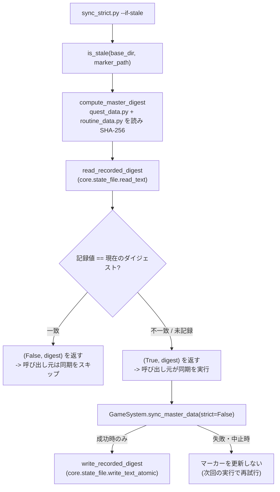
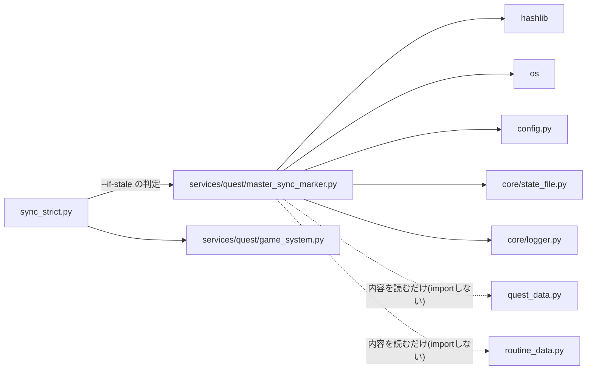

## 1. 解析メタ情報

| 項目 | 内容 |
| --- | --- |
| 対象ファイル | `MY_HOME_SYSTEM/services/quest/master_sync_marker.py`（フルパス, disambiguation目的） |
| 言語 | Python |
| 解析対象 | 提供されたコードのみ |
| 推測・補完 | 一切なし |
| 解析基準コミット | Issue #700 対応（`master_sync_marker.py` 新設時） |

同名衝突の注意: `services/quest/`配下のファイルはいずれも`quest_`を接頭辞とした仕様書名（`quest_locks.md`、`quest_master_sync_sql.md`等）で区別している（`dashboard_common.md`と同じ命名規約）。本ファイルも同じ接頭辞に揃えている。

## 関連ドキュメント

* [sync_strict.md](./sync_strict.md) - 唯一の呼び出し元。`sync_strict.py --if-stale`（Issue #700 で追加した冪等モード）が本ファイルの判定を使う
* [quest_game_system.md](./quest_game_system.md) - `GameSystem.sync_master_data()`。マーカーが「差分あり」と判定したときに実行される同期の本体
* [quest_data.md](./quest_data.md) - ダイジェスト対象その1。`quest_master`/`reward_master`の同期元マスタ
* [routine_data.md](./routine_data.md) - ダイジェスト対象その2。退役クエストの報酬の移設先（「きょうのすごろく」のステップ報酬）
* [config.md](./config.md) - `config.BASE_DIR`（ソースの探索基点）と`config.LOG_DIR`（マーカーの置き場）の定義元
* [common.md](./common.md) - **参照しない**（本ファイルは`core/`の実体を直importする）
* [database.md](./database.md) - 本ファイルはDBに一切触れない。DB側の同期は`game_system.py`が行う
* [health_watch.md](./health_watch.md) - 同じ Issue #700 で追加した「検知」側（チェック8）。こちらはDBとコードを直接比較し、マーカーは見ない

## 2. ファイルの概要

`quest_data.py`／`routine_data.py`（クエスト・ルーティンのマスタ定義ソース）が前回の同期時から変化しているかを、内容のSHA-256ダイジェストと1行のマーカーファイルで判定するモジュール（Issue #700 で新設）。

`GameSystem.sync_master_data()`はどのデプロイ経路からも自動実行されず、`unified_server.py`の`lifespan`が起動時に行うのはマイグレーション適用だけだったため、`quest_data.py`を編集したPRをマージして実機に`git pull`してもDBは古いまま残っていた。本ファイルは family-quest の`deploy.sh --if-stale`（ビルド元のgitツリーハッシュを`dist/.built-tree`に記録し、一致すればビルドをスキップする冪等モード）と同じ考え方をマスタ定義ソースへ適用し、**差分があるときだけ**同期を走らせることで、`DELETE ... NOT IN`を含む破壊的操作の自動実行頻度を増やさずにドリフトを回収できるようにする。

* 根拠: モジュールdocstring (行番号: 1〜28 / 抜粋: "マスタ定義ソースの鮮度マーカー(Issue #700)。")

判定材料にgitのツリーハッシュではなくファイル内容のSHA-256を使う理由（未コミットの編集も検知できること、gitが使えない状況でも判定できること）、および`routine_data.py`をダイジェスト対象に含める理由（クエストの退役は「`quest_data.py`から消して`routine_data.py`のステップ報酬へ移す」という2ファイルにまたがる1つの操作であること）は、いずれもモジュールdocstringに明記されている。

* 根拠: モジュールdocstring (行番号: 15〜27 / 抜粋: "判定材料に git のツリーハッシュではなく**ファイル内容の SHA-256** を使うのは:")

本ファイルはDB・ネットワークに一切触れず、ファイル読み取りとハッシュ計算だけを行う（マーカーの読み書きも`core/state_file.py`へ委譲する）。

## 3. 外部依存関係

### インポート一覧

| 名称 | 種類 | 用途 | 根拠 |
| --- | --- | --- | --- |
| `__future__.annotations` | 標準ライブラリ | 型注釈の遅延評価 | `from __future__ import annotations` (行番号: 29) |
| `hashlib` | 標準ライブラリ | マスタ定義ソースのSHA-256ダイジェスト計算 | `import hashlib` (行番号: 31) |
| `os` | 標準ライブラリ | ソース・マーカーのパス組み立て | `import os` (行番号: 32) |
| `config` | ローカルモジュール | `config.BASE_DIR`（ソースの探索基点）・`config.LOG_DIR`（マーカーの置き場） | `import config` (行番号: 34) |
| `core.state_file` | ローカルモジュール | マーカーの読み（共有ロック）・書き（tmp + fsync + `os.replace`） | `from core import state_file` (行番号: 35) |
| `core.logger.get_logger` | ローカルモジュール | ロガーの取得 | `from core.logger import get_logger` (行番号: 36) |

### ブラックボックスとなる外部要素

| 名称 | 理由 | 根拠 |
| --- | --- | --- |
| `core.state_file.read_text` / `write_text_atomic` | 実装は本ファイルにない（原子性・ロックの詳細は`core/state_file.py`側） | `raw = state_file.read_text(marker_path or get_marker_path())` (行番号: 85) |
| `config.LOG_DIR` | 参照時に解決される遅延属性で、解決結果（実ディレクトリ）は本ファイルからは決まらない | `return os.path.join(config.LOG_DIR, MARKER_BASENAME)` (行番号: 56) |
| `config.BASE_DIR` | 値の決まり方は`config.py`側 | `base = base_dir if base_dir is not None else config.BASE_DIR` (行番号: 70) |

## 4. 主要要素の定義（関数 / エンドポイント / コンポーネント）

### `MASTER_SOURCE_FILENAMES`（モジュールレベル定数）

* **役割**: ダイジェスト対象のファイル名。`("quest_data.py", "routine_data.py")`の2件で、`config.BASE_DIR`からの相対パスとして解決される。
* 根拠: `MASTER_SOURCE_FILENAMES: tuple[str, ...] = ("quest_data.py", "routine_data.py")` (行番号: 41)
* **引数/リクエスト**: 該当なし（定数）
* **戻り値/レスポンス**: 該当なし（`tuple[str, ...]`）
* **副作用**: なし
* **エラーハンドリング**: なし

### `MARKER_BASENAME`（モジュールレベル定数）

* **役割**: マーカーのファイル名 `.quest_master_sync_marker`。`config.LOG_DIR`配下へ置く（`health_watch`の各マーカーと同じ置き場で、gitignore済み・logrotate対象外であることがコメントに明記されている）。
* 根拠: `MARKER_BASENAME: str = ".quest_master_sync_marker"` (行番号: 47)
* **引数/リクエスト**: 該当なし（定数）
* **戻り値/レスポンス**: 該当なし（`str`）
* **副作用**: なし
* **エラーハンドリング**: なし

### `get_marker_path`

* **役割**: マーカーの絶対パス（`config.LOG_DIR` + `MARKER_BASENAME`）を返す。`config.LOG_DIR`が参照時に解決される遅延属性のため、モジュールレベル定数にせず関数で都度組み立てる。
* 根拠: `def get_marker_path() -> str:` (行番号: 50〜56)
* **引数/リクエスト**: なし
* 根拠: `def get_marker_path() -> str:` (行番号: 50)
* **戻り値/レスポンス**: `str`（マーカーの絶対パス）
* 根拠: (行番号: 56 / 抜粋: "return os.path.join(config.LOG_DIR, MARKER_BASENAME)")
* **副作用**: なし（`config.LOG_DIR`の参照により遅延解決が起きうる点を除く）
* **エラーハンドリング**: なし

### `compute_master_digest`

* **役割**: `MASTER_SOURCE_FILENAMES`の各ファイルをバイナリで読み、「ファイル名 + NUL + バイト長 + NUL + 内容」の順にSHA-256へ流し込んで16進ダイジェストを返す。ファイル名とバイト長を混ぜるのは、ファイル間の境界が曖昧になって別々の内容が同じダイジェストになる（連結の衝突）ことを避けるためである。
* 根拠: `def compute_master_digest(base_dir: str | None = None) -> str:` (行番号: 59〜80)
* **引数/リクエスト**: `base_dir: str | None = None`（`None`なら`config.BASE_DIR`）
* 根拠: (行番号: 70 / 抜粋: "base = base_dir if base_dir is not None else config.BASE_DIR")
* **戻り値/レスポンス**: `str`（SHA-256の16進ダイジェスト）
* 根拠: (行番号: 80 / 抜粋: "return digest.hexdigest()")
* **副作用**: 対象2ファイルの読み取りのみ（書き込みなし）
* 根拠: (行番号: 73〜74 / 抜粋: "with open(os.path.join(base, name), \"rb\") as f:")
* **エラーハンドリング**: 例外を捕捉しない。対象ファイルが存在しない・読めない場合は`OSError`がそのまま送出され、docstringは呼び出し側に「判定不能として同期をスキップし、マーカーも更新しない」ことを求めている。
* 根拠: (行番号: 65〜68 / 抜粋: "OSError: 対象ファイルが存在しない/読めない場合。呼び出し側は")

### `read_recorded_digest`

* **役割**: マーカーに記録されたダイジェストを読む。`core.state_file.read_text`が返す空文字・`None`はどちらも「未記録」として`None`に丸める。
* 根拠: `def read_recorded_digest(marker_path: str | None = None) -> str | None:` (行番号: 83〜86)
* **引数/リクエスト**: `marker_path: str | None = None`（`None`なら`get_marker_path()`）
* 根拠: (行番号: 85 / 抜粋: "raw = state_file.read_text(marker_path or get_marker_path())")
* **戻り値/レスポンス**: `str | None`
* 根拠: (行番号: 86 / 抜粋: "return raw or None")
* **副作用**: マーカーの読み取りのみ
* **エラーハンドリング**: 本ファイルでは行わない（`state_file.read_text`が読み取り失敗を`default`（ここでは既定の`None`）へ倒す）

### `write_recorded_digest`

* **役割**: 同期に成功したダイジェストをマーカーへ原子的に記録する。
* 根拠: `def write_recorded_digest(digest: str, marker_path: str | None = None) -> bool:` (行番号: 89〜95)
* **引数/リクエスト**: `digest: str`、`marker_path: str | None = None`（`None`なら`get_marker_path()`）
* 根拠: (行番号: 95 / 抜粋: "return state_file.write_text_atomic(marker_path or get_marker_path(), digest)")
* **戻り値/レスポンス**: `bool`（`state_file.write_text_atomic`の成否をそのまま返す）
* 根拠: (行番号: 95 / 抜粋: "return state_file.write_text_atomic(marker_path or get_marker_path(), digest)")
* **副作用**: マーカーファイルの作成・差し替え（一時ファイル経由の`os.replace`は`core/state_file.py`側）
* **エラーハンドリング**: 例外にせず`False`を返す方針がdocstringに明記されている（書けなければ次回の実行が「差分あり」と判定して同期をやり直す＝安全側）。
* 根拠: (行番号: 92〜93 / 抜粋: "書き込み失敗(権限等)は例外にせず False を返す。次回の実行が")

### `is_stale`

* **役割**: 現在のダイジェストとマーカーの記録値を比較し、`(差分があるか, 現在のダイジェスト)`を返す。マーカーが無い初回実行は記録値が`None`になるため常に「差分あり」になる。
* 根拠: `def is_stale(` (行番号: 98〜110)
* **引数/リクエスト**: `base_dir: str | None = None`、`marker_path: str | None = None`
* 根拠: (行番号: 99 / 抜粋: "base_dir: str | None = None, marker_path: str | None = None")
* **戻り値/レスポンス**: `tuple[bool, str]`
* 根拠: (行番号: 110 / 抜粋: "return recorded != digest, digest")
* **副作用**: 対象ファイルとマーカーの読み取りのみ（書き込みは行わない）
* **エラーハンドリング**: 本ファイルでは捕捉せず、`compute_master_digest`の`OSError`がそのまま呼び出し元へ伝播する

## 5. 処理フロー図

## 6. 依存関係図

## 7. 次のステップ（リバースエンジニアリングの提案）

| 優先度 | ファイル | 理由 |
| --- | --- | --- |
| 高 | `sync_strict.py`（[sync_strict.md](./sync_strict.md)） | 唯一の呼び出し元。`--if-stale`の同期モード（`strict=False`）と、マーカーを更新する条件を持つ |
| 高 | `services/quest/game_system.py`（[quest_game_system.md](./quest_game_system.md)） | 「差分あり」のときに実行される同期の本体。削除の安全弁（#242）もここ |
| 中 | `core/state_file.py` | マーカーの原子的な読み書きの実体 |
| 中 | `monitors/health_watch.py`（[health_watch.md](./health_watch.md)） | 同じ Issue #700 の検知側。マーカーではなくDBとコードを直接比較する |

## 8. 保守上の注意点

* **ダイジェスト対象を増やすときは`MASTER_SOURCE_FILENAMES`だけを直す**。同期の実行条件がここ1箇所に集約されている。
* マーカーは失われても壊れても「差分あり」に倒れるだけで、同期が1回余分に走るのみ（同期自体が冪等）。逆に**同期が失敗したのにマーカーを進めると、次回以降のデプロイで永久に同期されなくなる**ため、マーカーの更新は同期の成功後に限ること（判定はこのファイル、更新のタイミングは`sync_strict.run_sync_if_stale`が持つ）。
* マーカーは`config.LOG_DIR`配下のドットファイルであり、`config.BACKUP_FILES`にも`.coveragerc`の`omit`にも追加していない（バックアップ対象の本番データではなく、いつでも再生成できる派生物のため。本ファイル自身は`tests/test_quest_master_sync_marker.py`でカバーされる）。
* 回帰テストは`tests/test_quest_master_sync_marker.py`。ダイジェストの安定性、2ファイルそれぞれの変更検知、ファイル境界を跨いだ内容移動の非同一視、ソース欠損時の`OSError`、マーカーの往復と置き場（`config.LOG_DIR`配下）を固定している。

## 9. 不明事項一覧

| 不明点 | 理由 | 参照すべきファイル |
| --- | --- | --- |
| `config.LOG_DIR`が実際に解決されるディレクトリ | 参照時に解決される遅延属性で、NAS等の状態によって変わりうる | `config.py` |
| マーカー書き込みの原子性の実装詳細（ロック・fsync） | 本ファイルは`state_file.write_text_atomic`へ委譲している | `core/state_file.py` |
| 「差分あり」と判定された後に実際に何がDBへ書かれるか | 本ファイルはDBに触れない | `services/quest/game_system.py` |

## 10. 自己検証結果

* [x] 完了: 推測・外部ファイルの仕様を一切含んでいない
* [x] 完了: 全関数・全定数（モジュールレベル要素）を列挙した
* [x] 完了: 全てのインポート要素を列挙した
* [x] 完了: すべての仕様説明に「根拠（行番号・抜粋）」を明記した
* [x] 完了: 根拠漏れが0件である
* [x] 完了: Mermaid構文にエラーの原因となる記号（エスケープ漏れ）がない
* [x] 完了: 不明事項を漏れなく列挙した
