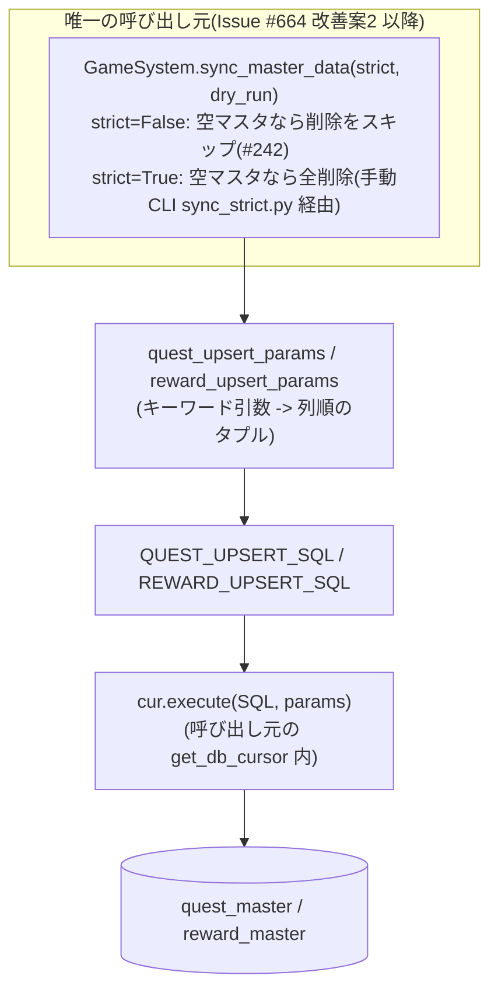
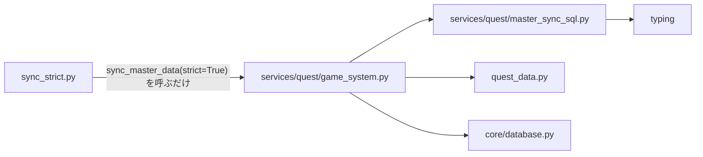

## 1. 解析メタ情報

| 項目 | 内容 |
| --- | --- |
| 対象ファイル | `MY_HOME_SYSTEM/services/quest/master_sync_sql.py`（フルパス, disambiguation目的） |
| 言語 | Python |
| 解析対象 | 提供されたコードのみ |
| 推測・補完 | 一切なし |
| 解析基準コミット | Issue #664 対応（`master_sync_sql.py` 新設時） |

同名衝突の注意: `services/quest/`配下のファイルはいずれも`quest_`を接頭辞とした仕様書名（`quest_locks.md`等）で区別している（`dashboard_common.md`と同じ命名規約）。本ファイルも同じ接頭辞に揃えている。

## 関連ドキュメント

* [quest_game_system.md](./quest_game_system.md) - `GameSystem.sync_master_data()`。本ファイルの定数・ヘルパーを使う利用元の1つ
* [sync_strict.md](./sync_strict.md) - 手動実行のCLI `sync_strict.py`。**（Issue #664 改善案2）** 以前はもう1つの利用元だったが、同期処理ごと`GameSystem.sync_master_data(strict=True)`へ統合されたため、現在は本ファイルを参照しない
* [quest_data.md](./quest_data.md) - 同期元となるマスターデータ（`QUESTS`/`REWARDS`）の定義
* [database.md](./database.md) - 実行に使う`core.database.get_db_cursor`の実体
* [init_unified_db.md](./init_unified_db.md) - `quest_master`/`reward_master`のスキーマを適用する側（スキーマの唯一の定義元は`migrations/`）

## 2. ファイルの概要

`quest_master`/`reward_master`への UPSERT 文と、それに渡す値のタプルを組み立てるヘルパーを1箇所に集約するモジュール（Issue #664 で新設）。

`GameSystem.sync_master_data()`（`services/quest/game_system.py`）と手動実行CLIの`sync_strict.py`は、どちらも`quest_data.py`の内容で同じ2テーブルを同期していた。両者は「マスタに無い行をどう扱うか」（前者は空マスタなら削除をスキップする安全弁、後者は確認プロンプト付きで全削除を許す）という目的が異なるため、まずここには **UPSERT の列リストだけ** が寄せられた。モジュールdocstringが挙げる3件の過去事故（#100 の`reset_period`欠落、#164 の時間帯/期間/出現率/前提クエスト欠落、#165 の`description`欠落）はいずれも「実行した経路によって結果が変わる」という形で表面化していた。

**（Issue #664 改善案2 で変更）** その後、同期処理そのものも統合された。目的の違いは`sync_master_data(strict=...)`の引数として表現され、`sync_strict.py`は引数解析と安全ガードだけのCLIになったため、**現在このモジュールの呼び出し元は`services/quest/game_system.py`の1箇所だけ**である。それでもここを独立させたままにしているのは、上記3件の事故が「UPSERTの列リストは同期方針と分けて管理する」という教訓を残しているためである。

`reward_master.desc`はアプリが読まないレガシー列（読むのは`description`）だが、過去に書かれた行が残っているため、両経路とも`description`と同じ値を書いて食い違いを残さない方針であることがdocstringに明記されている。

* 根拠: モジュールdocstring (行番号: 1〜26 / 抜粋: "`quest_master` / `reward_master` への UPSERT を1箇所に集約するモジュール(Issue #664)。")

## 3. 外部依存関係

### インポート一覧

| 名称 | 種類 | 用途 | 根拠 |
| --- | --- | --- | --- |
| `typing.Any`, `Optional`, `Tuple` | 標準ライブラリ | ヘルパーの引数・戻り値の型ヒント | 根拠: `from typing import Any, Optional, Tuple` (行番号: 27 / 抜粋: "from typing import Any, Optional, Tuple") |

本ファイルはSQL文字列とタプル組み立てだけを担い、DB接続・ロギング・設定のいずれにも依存しない（実行は呼び出し元が`core.database.get_db_cursor`で行う）。

### ブラックボックスとなる外部要素

| 名称 | 理由 | 根拠 |
| --- | --- | --- |
| `quest_master` / `reward_master` の実スキーマ | 列の型・NOT NULL制約・デフォルト値は`migrations/`側にあり、本ファイルからは確認できない（`migrations/`がスキーマの唯一の定義元） | `INSERT INTO quest_master (` (行番号: 30 / 抜粋: "INSERT INTO quest_master (") |

## 4. 主要要素の定義（関数 / エンドポイント / コンポーネント）

### `QUEST_UPSERT_SQL`（モジュールレベル定数）

* **役割**: `quest_master`への16列のUPSERT文。`ON CONFLICT(quest_id) DO UPDATE SET`で`quest_id`以外の15列をすべて`excluded.*`で上書きする。列を欠落させると再UPSERT時にその列がNULLへ上書きされる（#164 の事故）ため、同期対象の列は必ずここに並ぶ。
* 根拠: `QUEST_UPSERT_SQL = """` (行番号: 30 / 抜粋: "INSERT INTO quest_master (")

* **引数/リクエスト**: 該当なし（定数）。プレースホルダ`?`は16個で、`quest_upsert_params()`が返すタプルと対応する。
* 根拠: `VALUES (?, ?, ?, ?, ?, ?, ?, ?, ?, ?, ?, ?, ?, ?, ?, ?)` (行番号: 36 / 抜粋: "VALUES (?, ?, ?, ?, ?, ?, ?, ?, ?, ?, ?, ?, ?, ?, ?, ?)")

* **戻り値/レスポンス**: 該当なし（`str`定数）
* **副作用**: なし（定義時に副作用はない。実行は呼び出し元の`cur.execute`）
* **エラーハンドリング**: なし

### `REWARD_UPSERT_SQL`（モジュールレベル定数）

* **役割**: `reward_master`への8列のUPSERT文。`description`とレガシー列`desc`の両方を同期対象に含む（#165 の事故の再発防止）。`ON CONFLICT(reward_id) DO UPDATE SET`で`reward_id`以外の7列を上書きする。
* 根拠: `REWARD_UPSERT_SQL = """` (行番号: 56 / 抜粋: "INSERT INTO reward_master (")

* **引数/リクエスト**: 該当なし（定数）。プレースホルダ`?`は8個。
* 根拠: `VALUES (?, ?, ?, ?, ?, ?, ?, ?)` (行番号: 60 / 抜粋: "VALUES (?, ?, ?, ?, ?, ?, ?, ?)")

* **戻り値/レスポンス**: 該当なし（`str`定数）
* **副作用**: なし
* **エラーハンドリング**: なし

### `quest_upsert_params`

* **役割**: `QUEST_UPSERT_SQL`に渡す値のタプルを、列の並びを間違えない形で組み立てる。呼び出し元はPydanticモデル（`GameSystem.sync_master_data`）と生のdict（`sync_strict.py`）で表現が違うため、すべてキーワード専用引数（`*`）で受けてここで並べ替える。
* 根拠: `def quest_upsert_params(` (行番号: 78 / 抜粋: "def quest_upsert_params(")

* **引数/リクエスト**: キーワード専用の16引数 — `quest_id`, `title`, `description`, `quest_type`, `target_user`, `exp_gain`, `gold_gain`, `icon_key`, `day_of_week`, `start_date`, `end_date`, `occurrence_chance`, `start_time`, `end_time`, `pre_requisite_quest_id`, `reset_period`（いずれも`Any`）
* 根拠: `def quest_upsert_params(` (行番号: 78 / 抜粋: "def quest_upsert_params(")

* **戻り値/レスポンス**: `Tuple[Any, ...]`（`QUEST_UPSERT_SQL`のプレースホルダ順に並んだ16要素）
* 根拠: [戻り値のタプル] (行番号: 96〜100 / 抜粋: "return (\n        quest_id, title, description, quest_type, target_user,")

* **副作用**: なし（純粋関数）
* **エラーハンドリング**: なし（引数が不足していれば`TypeError`がそのまま送出される＝列の追加漏れが実行時に必ず露見する）

### `reward_upsert_params`

* **役割**: `REWARD_UPSERT_SQL`に渡す値のタプルを組み立てる。レガシー列`desc`には`description`と同じ値を入れる。
* 根拠: `def reward_upsert_params(` (行番号: 110 / 抜粋: "def reward_upsert_params(")

* **引数/リクエスト**: キーワード専用の7引数 — `reward_id`, `title`, `category`, `cost_gold`, `icon_key`, `description`（`Optional[str]`）, `target`
* 根拠: `def reward_upsert_params(` (行番号: 110 / 抜粋: "def reward_upsert_params(")

* **戻り値/レスポンス**: `Tuple[Any, ...]`（8要素。`description`が6番目と7番目の両方に入る）
* 根拠: [戻り値のタプル] (行番号: 117 / 抜粋: "return (reward_id, title, category, cost_gold, icon_key, description, description, target)")

* **副作用**: なし（純粋関数）
* **エラーハンドリング**: なし

## 5. 処理フロー図

## 6. 依存関係図

## 7. 次のステップ（リバースエンジニアリングの提案）

| 優先度 | ファイル | 理由 |
| --- | --- | --- |
| 高 | `services/quest/game_system.py`（[quest_game_system.md](./quest_game_system.md)） | 本ファイルの利用元。マスタに無い行の削除方針（安全弁）を含む同期の本体 |
| 中 | `sync_strict.py`（[sync_strict.md](./sync_strict.md)） | `strict=True` を渡す唯一の呼び出し元。確認プロンプト・`--dry-run`・`--allow-empty-master`の安全ガードを持つ |
| 中 | `migrations/0000_baseline_schema.sql` | `quest_master`/`reward_master`の実スキーマ（列の型・デフォルト値）の唯一の定義元 |

## 8. 保守上の注意点

* **列を増やすときは必ずこのファイルだけを直す**。SQLとパラメータ組み立ての両方がここにあるため、片方の経路にだけ列を足すという#100/#164/#165 型の事故は起きない。呼び出し元はすべてキーワード専用引数を渡すため、列を足して引数を渡し忘れれば`TypeError`で必ず失敗する。
* `reward_master.desc`はアプリが読まないレガシー列だが、`description`と同じ値を書き続ける方針。片方だけを書くと、どちらの経路で同期したかによって所持アイテム一覧の説明表示が変わる（#165 の症状）。
* 本ファイルはSQL文字列とタプルだけを持ち、DB接続・トランザクション境界・削除の方針は一切持たない。「マスタに無い行をどう扱うか」は`GameSystem.sync_master_data`の`strict`引数が決めることであり、ここへ寄せてはいけない。
* 回帰テストは`tests/test_sync_strict.py`の`TestMasterSyncSqlIsSharedWithGameSystem`。`game_system`が本ファイルのSQL定数オブジェクトを参照していること、パラメータの並びがSQLの列リストと一致すること、`sync_strict.py`側に同期の再実装（独自SQL・`sync_quests`/`sync_rewards`）が復活していないこと、`strict=True`と`strict=False`が同じマスタ入力から同じ行を書くことを固定している。

## 9. 不明事項一覧

| 不明点 | 理由 | 参照すべきファイル |
| --- | --- | --- |
| 各列の型・NOT NULL制約・デフォルト値 | 本ファイルはSQL文字列のみを持ち、スキーマ定義は`migrations/`側にある | `migrations/0000_baseline_schema.sql`, `MY_HOME_SYSTEM/current_schema.sql` |
| 呼び出し元が渡す値の実際の型 | `Any`で受けている。**（Issue #664 改善案2 以降）** 呼び出し元は`services/quest/game_system.py`の1箇所だけで、`strict`の有無によらずPydanticモデル（`MasterQuest`/`MasterReward`）の属性が渡される | `services/quest/game_system.py` |

## 10. 自己検証結果

* [x] 完了: 推測・外部ファイルの仕様を一切含んでいない
* [x] 完了: 全関数・全定数（モジュールレベル要素）を列挙した
* [x] 完了: 全てのインポート要素を列挙した
* [x] 完了: すべての仕様説明に「根拠（行番号・抜粋）」を明記した
* [x] 完了: 根拠漏れが0件である
* [x] 完了: Mermaid構文にエラーの原因となる記号（エスケープ漏れ）がない
* [x] 完了: 不明事項を漏れなく列挙した
